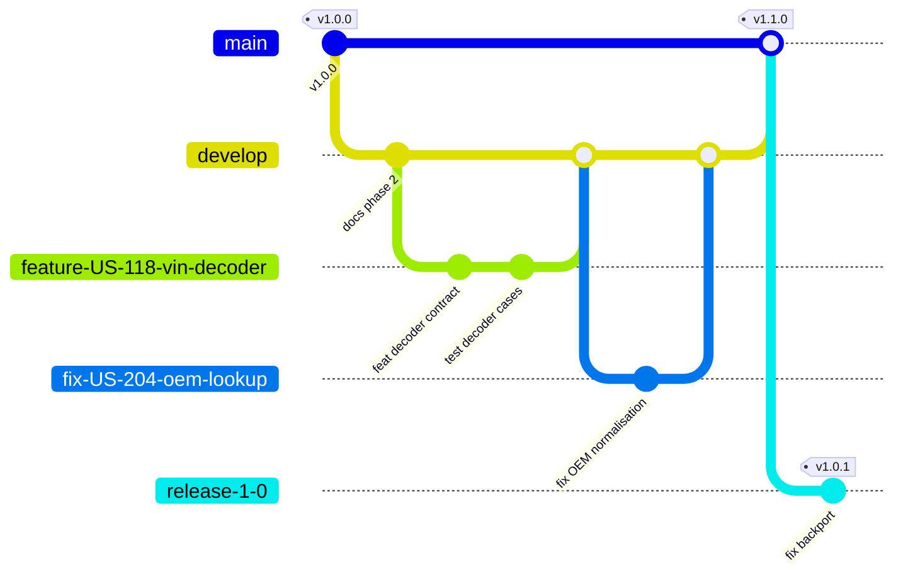
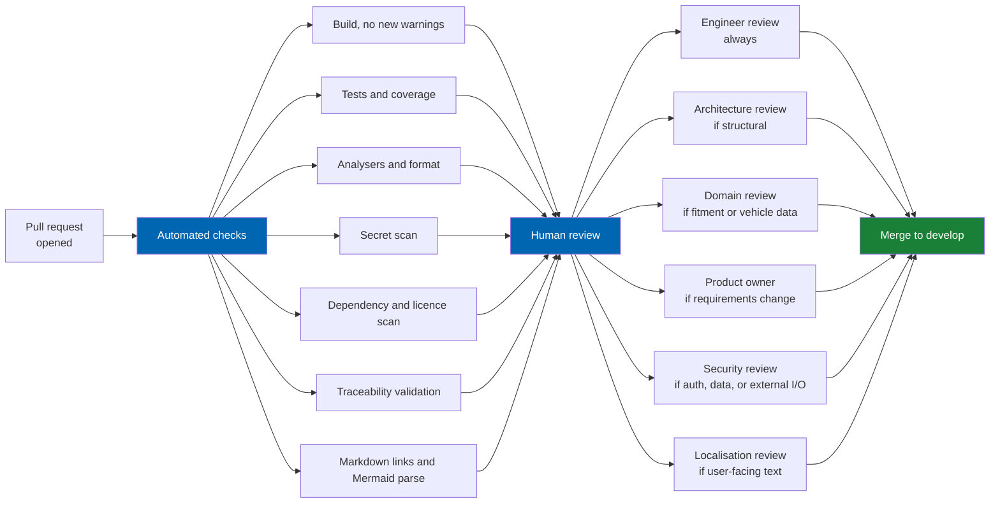
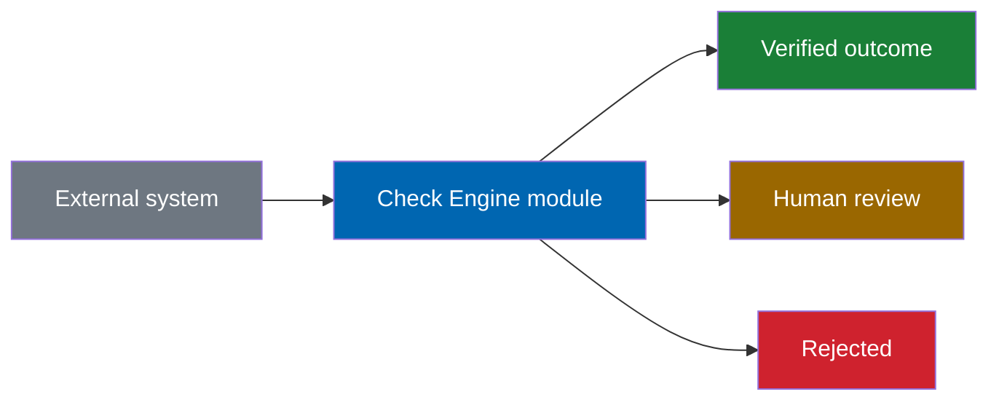
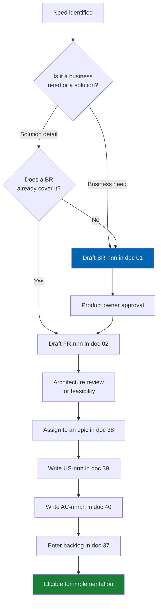

# Contributing to Check Engine™

Check Engine is a commercial product with a controlled contribution process. This document defines how
work enters the codebase and the documentation set, and the standard it must meet to be accepted.

**Who this applies to:** Twin Particles engineers, contracted implementation partners, and licensed
customers submitting fixes under [LICENSE.md § 5.3](LICENSE.md#53-contributions).

**Engineering status (2026-08-25):** Plugin `0.104.0` is in tree. Progress, evidence gates (G1–G6 done; G11 packing partial), and remaining blockers (H1.35/G8, G7, G11 vendor signing, G12) are recorded in [EXECUTION-PLAN.md](EXECUTION-PLAN.md). This document remains the contribution process, not a release sign-off.

**Before you write anything:** read [34 Coding Standards](docs/34-coding-standards.md) for code — including
**Test-Driven Development (`ADR-015`)** — and the [document template](#document-template) below for
documentation. Both are enforced at review, and a pull request that ignores them will be returned rather
than corrected by the reviewer.

---

## Contents

- [Contribution licence](#contribution-licence)
- [Ways to contribute](#ways-to-contribute)
- [Development environment](#development-environment)
- [Repository layout](#repository-layout)
- [Branching model](#branching-model)
- [Commit conventions](#commit-conventions)
- [Test-Driven Development](#test-driven-development)
- [Pull requests](#pull-requests)
- [Review gates](#review-gates)
- [Definition of done](#definition-of-done)
- [Documentation contributions](#documentation-contributions)
- [Document template](#document-template)
- [Mermaid diagram standards](#mermaid-diagram-standards)
- [Requirement and identifier discipline](#requirement-and-identifier-discipline)
- [Reporting defects](#reporting-defects)
- [Reporting security vulnerabilities](#reporting-security-vulnerabilities)
- [Automotive domain accuracy](#automotive-domain-accuracy)
- [Localisation contributions](#localisation-contributions)
- [Code of conduct](#code-of-conduct)

---

## Contribution licence

By submitting a contribution of any kind — code, documentation, diagram, translation, test, or vehicle
data correction — you grant Twin Particles a perpetual, worldwide, irrevocable, royalty-free,
sublicensable licence to use, reproduce, modify, and commercially exploit it, as set out in
[LICENSE.md § 5.3](LICENSE.md#53-contributions). You confirm that you have the right to grant this
licence and that your contribution is your own work or is properly attributed.

Do not submit code, data, or text you do not have the right to license. In particular, **do not submit
vehicle fitment data extracted from a licensed third-party database** such as TecDoc or an ACES/PIES
feed. Check Engine's catalog is curated in-house precisely so that it carries no third-party
redistribution restriction, and a single tainted contribution compromises that position for the whole
product. See [LICENSE.md § 9](LICENSE.md#9-vehicle-and-part-data).

---

## Ways to contribute

| Contribution | Where it goes | Review requirement |
|---|---|---|
| Defect fix | Branch from the affected release branch | One engineer approval, regression test required |
| Feature implementation | Branch from `develop`, must map to an existing `US-nnn` | One engineer plus architecture approval |
| Documentation revision | Branch from `develop` | One engineer approval; product owner approval if it changes a requirement |
| Specification of new behaviour | Requires a `BR-nnn` first, then `FR-nnn`, then `US-nnn` | Product owner approval before implementation begins |
| Vehicle or fitment data correction | Data correction workflow, not a code branch | Domain reviewer approval; see [Automotive domain accuracy](#automotive-domain-accuracy) |
| Translation | Localisation resource files | Native-speaker review plus automotive terminology check |
| Architecture change | Requires an `ADR` in the [Appendix](docs/appendix.md) before code | Architecture board approval |
| Security finding | **Not a pull request.** See [Reporting security vulnerabilities](#reporting-security-vulnerabilities) | — |

**Work does not start without a story.** Every code change traces to a `US-nnn` in
[39 User Stories](docs/39-user-stories.md), which traces to an `FR-nnn`, which traces to a `BR-nnn`. If
you believe something should be built and no story exists, raise the requirement first. This is not
bureaucracy — it is what makes the traceability chain in
[README.md](README.md#traceability) hold, and CI validates it.

---

## Development environment

### Prerequisites

| Tool | Version | Notes |
|---|---|---|
| .NET SDK | 9.0.100 or later | Required by nopCommerce 4.90 |
| Visual Studio 2022 | 17.14 or later | Or JetBrains Rider 2024.3+, or VS Code with the C# Dev Kit |
| SQL Server | 2019 or later | Developer edition is sufficient; LocalDB is not, because full-text search is required |
| nopCommerce source | 4.90.6 | See [32 Deployment](docs/32-deployment.md) |
| Node.js | 20 LTS or later | Theme asset build only |
| Git | 2.40 or later | |
| Docker Desktop | Current | Optional, for the ERPNext and search index test fixtures |

### Setup

```powershell
# 1. Restore and build the host platform
dotnet restore src/NopCommerce.sln
dotnet build src/NopCommerce.sln -c Debug

# 2. Verify the platform runs before adding the plugin
dotnet run --project src/Presentation/Nop.Web

# 2a. Manual install verification (current E2E stack uses PostgreSQL 16 + Chromium)
.\e2e\start-manual-stack.ps1
# browse to http://127.0.0.1:5000 and confirm the install flow

# 3. Build the plugin. Output is copied to the Nop.Web plugins directory
#    by the plugin project's post-build target.
dotnet build src/Plugins/TwinParticles.CheckEngine -c Debug

# 4. Run the E2E smoke / regression suite (PostgreSQL-backed)
.\e2e\run-regressions.ps1

# 5. Run the full test suite
dotnet test src/NopCommerce.sln
```

> **Known trap.** nopCommerce's build includes a `ClearPluginAssemblies` step that removes plugin
> assemblies duplicating platform references. If a dependency you add disappears from the plugin output
> directory after build, this is why. The resolution — declaring the reference correctly rather than
> defeating the cleanup — is documented in
> [09 Plugin Architecture](docs/09-plugin-architecture.md#assembly-and-dependency-management).

### Local configuration

Never commit connection strings, API keys, licence keys, or AI provider credentials. Use
`appsettings.Development.json`, which is git-ignored, or user secrets:

```powershell
dotnet user-secrets set "CheckEngine:Ai:ApiKey" "your-key-here" --project src/Presentation/Nop.Web
```

A pull request containing a credential is closed immediately and the credential is treated as
compromised and rotated. Secret scanning runs in CI — see [33 CI-CD](docs/33-ci-cd.md).

---

## Repository layout

```
CheckEngine/
├── README.md                  Product overview and entry point
├── LICENSE.md                 Commercial EULA
├── CHANGELOG.md               Revision history and decision records
├── ROADMAP.md                 Delivery horizons and documentation phases
├── CONTRIBUTING.md            This document
└── docs/
    ├── README.md              Annotated document index
    ├── 00-vision.md … 49-saas-roadmap.md
    └── appendix.md            Glossary, ADRs, references
```

Plugin source lives in the host tree under `src/Plugins/TwinParticles.CheckEngine`, following the
nopCommerce convention. The internal structure is specified in
[09 Plugin Architecture](docs/09-plugin-architecture.md).

---

## Branching model

`main` is always releasable. Nothing is committed to it directly.



Branch names are shown hyphenated in the diagram for rendering reasons. The actual convention uses
slashes, as specified in the table below.

| Branch | Purpose | Merges from | Protected |
|---|---|---|---|
| `main` | Released, tagged code | `develop`, `release/*` | Yes |
| `develop` | Integration branch for the next release | `feature/*`, `fix/*`, `docs/*` | Yes |
| `feature/US-nnn-short-slug` | One story | — | No |
| `fix/US-nnn-short-slug` | One defect | — | No |
| `docs/short-slug` | Documentation only | — | No |
| `release/x.y` | Maintenance of a supported version | `fix/*` | Yes |
| `platform/4.90-upgrade` | Long-lived platform upgrade work | — | Yes |

Branch names include the story identifier so that tooling can link a branch to its requirement. Keep
branches short-lived; a branch open longer than one sprint is a planning defect.

---

## Commit conventions

[Conventional Commits 1.0.0](https://www.conventionalcommits.org/), with the story identifier in the
footer.

```
<type>(<scope>): <subject>

<body>

Refs: US-nnn
```

| Type | Use for |
|---|---|
| `feat` | New capability |
| `fix` | Defect correction |
| `docs` | Documentation only |
| `refactor` | Behaviour-preserving restructuring |
| `perf` | Performance improvement, with a measurement in the body |
| `test` | Test addition or correction |
| `build` | Build system, packaging, dependencies |
| `ci` | Pipeline configuration |
| `chore` | Maintenance with no product effect |
| `revert` | Reverting a previous commit |

| Scope | Area |
|---|---|
| `vehicle` `vin` `oem` `fitment` `search` `ai` `garage` | Automotive and intelligence modules |
| `import` `image` | Data pipeline |
| `erp` `marketplace` | Integration modules |
| `theme` `admin` | Presentation |
| `data` `security` `perf` `infra` | Cross-cutting |
| `docs` | Documentation |

### Rules

1. Subject in the imperative mood, no trailing period, 72 characters or fewer: "add VIN checksum
   validation", not "added" or "adds".
2. The body explains **why**, not what. The diff already shows what.
3. Breaking changes require a `BREAKING CHANGE:` footer describing the migration path.
4. `Refs:` is mandatory for `feat` and `fix`, and cites the story or defect identifier.
5. One logical change per commit. If the body needs the word "also", split it.

### Example

```
feat(fitment): add production date window evaluation

Fitment claims previously matched on generation alone, which produced
false positives for parts that changed mid-generation. BMW F30 water
pumps differ before and after the 03/2015 facelift, and matching on
generation returned both.

Evaluation now intersects the claim's production window with the
vehicle's build date, derived from the VIN where available and from the
model year otherwise. Claims without a window continue to match the
whole generation, preserving existing data.

Refs: US-118
```

---

## Test-Driven Development

Check Engine development follows **Test-Driven Development (TDD)**. The full rules live in
[34 Coding Standards — Test-Driven Development](docs/34-coding-standards.md#test-driven-development)
(`ADR-015`). This section is the contribution-facing summary reviewers enforce.

### Required cycle

1. **Red** — Add or extend an automated test that fails for the behaviour you intend to deliver (story
   `AC`, defect reproduction, or domain invariant).
2. **Green** — Implement the smallest production change that makes the test pass.
3. **Refactor** — Improve design with the suite remaining green.

### Evidence in the pull request

In the **Verification** section, state how red→green was demonstrated. Acceptable evidence:

- Separate commits: failing test commit, then implementation commit (preferred)
- CI log showing the new test failed on the base SHA and passes on the PR head
- For tiny fixes: explicit statement that the regression test was run red against `develop` before the fix

### Exceptions

| Allowed without full TDD cycle | Still required |
|---|---|
| Pure CSS / static markup with no behaviour | RTL/LTR and visual check |
| Documentation-only PRs | Link and Mermaid checks |
| Time-boxed spikes on `spike/*` branches | Must be rewritten under TDD before merge to `develop` |

Coverage thresholds alone do **not** satisfy this gate.

---

## Pull requests

### Before opening

- [ ] Branch is rebased on the current tip of its target
- [ ] Behaviour was developed **test-first** (red→green→refactor) per [TDD](#test-driven-development)
- [ ] `dotnet build` succeeds with no new warnings
- [ ] `dotnet test` passes in full
- [ ] Coverage meets the thresholds in [35 Testing Strategy](docs/35-testing-strategy.md)
- [ ] Analyser and formatting rules pass — `dotnet format --verify-no-changes`
- [ ] No credentials, connection strings, or licence keys in the diff
- [ ] Documentation updated if behaviour changed
- [ ] `CHANGELOG.md` updated under `[Unreleased]` if the change is customer-visible

### Description template

```markdown
## What
One paragraph on what changed.

## Why
The problem this solves. Link the story: US-nnn.

## How
Approach taken, and any alternative rejected with the reason.

## Scope
- Requirements: FR-nnn, NFR-nnn
- Modules touched:
- Schema migration: yes/no — if yes, the migration name and measured duration
- Breaking change: yes/no — if yes, the migration path

## Verification
How this was tested. Include automated test names.
TDD evidence: how red→green was shown (commit SHAs, CI log, or local red run against base).
Manual verification steps if any, with the environment used.

## Screenshots
Required for any UI change. Include Arabic RTL alongside English LTR.

## Checklist
- [ ] Traces to a story
- [ ] Developed test-first (TDD / ADR-015)
- [ ] Failure and boundary cases covered
- [ ] Tests added or updated
- [ ] Documentation updated
- [ ] Changelog updated
- [ ] No new analyser warnings
- [ ] Brand-agnostic: no manufacturer hardcoded in logic
```

### Size

Aim for fewer than 400 changed lines excluding tests and generated files. Large pull requests receive
shallow reviews, which is how defects enter. If a change cannot be made smaller, say why in the
description and expect a longer review.

---

## Review gates



| Gate | Trigger | Reviewer |
|---|---|---|
| Engineer review | Every pull request | Any engineer other than the author |
| Architecture review | New project, new dependency, cross-module contract, or anything touching an `ADR` | Architecture owner |
| Domain review | Vehicle hierarchy, VIN rules, OEM logic, or fitment evaluation | Automotive domain owner |
| Product owner review | Any change to a `BR`, `FR`, `NFR`, or acceptance criterion | Product owner |
| Security review | Authentication, authorisation, data handling, external I/O, or cryptography | Security owner |
| Localisation review | Any user-facing string or RTL-affecting layout | Native speaker per locale |
| Performance review | Anything on the search, fitment, or catalog read path | Performance owner |

Automated checks are described in [33 CI-CD](docs/33-ci-cd.md). A red check blocks merge; there is no
override.

---

## Definition of done

A story is done when **all** of the following are true. Partial completion is not done.

### Code

- [ ] Every acceptance criterion in [40](docs/40-acceptance-criteria.md) is demonstrably met
- [ ] Behaviour was delivered via **TDD** (red→green→refactor) per [34](docs/34-coding-standards.md#test-driven-development)
- [ ] Unit tests cover the domain logic, including boundary and failure cases — written to fail first where applicable
- [ ] Integration tests cover the data access and any external integration
- [ ] Bug fixes include a regression test that failed on the defect before the fix
- [ ] Coverage meets the threshold for the module (floor only; does not replace TDD)
- [ ] No new analyser warnings, no suppressions without a justifying comment
- [ ] Async throughout; no synchronous blocking on asynchronous work
- [ ] Errors handled and logged per [31 Logging](docs/31-logging.md)
- [ ] Authorisation enforced server-side, never only in the UI
- [ ] Input validated at the boundary
- [ ] No manufacturer name, model code, or market hardcoded in logic
- [ ] Fitment and publish paths fail closed (never invent Fits or auto-publish AI output)

### Data and schema

- [ ] Migration is reversible, or its irreversibility is documented and justified
- [ ] Migration tested forward and backward against a populated reference database
- [ ] Indexes added for every new query path, with the plan verified
- [ ] Naming follows [10 Database Design](docs/10-database-design.md)

### Presentation

- [ ] Renders correctly in Arabic RTL and English LTR
- [ ] Responsive from 320 px to 2560 px
- [ ] Meets WCAG 2.2 level AA per [23 UX Guidelines](docs/23-ux-guidelines.md)
- [ ] Keyboard navigable, focus visible
- [ ] Within the Core Web Vitals budget in [29 Performance](docs/29-performance.md)
- [ ] All strings localised; no literal text in a view

### Documentation

- [ ] Specification updated to match the built behaviour
- [ ] Public API and extension points documented with XML doc comments
- [ ] Changelog entry added
- [ ] Configuration keys documented with defaults and valid ranges

### Verification

- [ ] Reviewed and approved through every applicable gate
- [ ] Verified on a clean 4.90.6 instance, installed and uninstalled without residue
- [ ] Verified against the reference dataset, not only against a handful of test rows

---

## Documentation contributions

Documentation is held to the same standard as code, because it is the product's specification and its
customer-facing reference.

### Rules

1. **No placeholders.** No `TODO`, no `TBD`, no lorem ipsum, no "to be determined". If it is not
   decided, either decide it or record the open question explicitly with the decision owner and the
   date a decision is required.
2. **Specify, do not gesture.** "Search must be fast" is not a specification. "Search returns the
   first page within 300 ms at the 95th percentile against the reference catalog of 250,000 parts" is.
3. **Every claim is checkable.** A number in a document is either measured, calculated from stated
   assumptions, or cited. State which.
4. **Cross-link, do not duplicate.** A fact belongs in exactly one document. Everywhere else links to
   it. Duplicated facts diverge.
5. **Prose over fragments.** Write complete sentences. A specification read by a stranger in eighteen
   months cannot rely on context you had at the time.
6. **Tables for enumerable facts, prose for reasoning.** Do not put an argument inside a table cell.
7. **Diagrams earn their place.** A diagram that restates the adjacent paragraph should be deleted.
8. **British or American English, consistently.** This repository uses British spelling.

### Filename convention

Lowercase, hyphen-separated, with the numeric prefix retained: `12-vehicle-database.md`. Filenames
never contain spaces, because spaces require percent-encoding in Markdown links, break shell tooling
without quoting, and are mishandled by several static site generators. Recorded as `ADR-010`.

---

## Document template

Every document in `docs/` follows this structure. Sections appear in this order and none is omitted; a
section with nothing to say states why in one sentence rather than being deleted, because a missing
section is indistinguishable from an oversight.

```markdown
# NN Document Title

> One-sentence statement of what this document governs.

**Status:** Draft | Review | Approved · **Owner:** role · **Last revised:** YYYY-MM-DD

Numbered specifications also carry a one-line **Engineering status** pointer to
[EXECUTION-PLAN.md](EXECUTION-PLAN.md) after **Last revised**. Do not treat that pointer as a
v1.0 sign-off.

## Contents
[Table of contents for documents over roughly 300 lines]

## Executive Summary
What this document covers and the three to five things a reader must take away.
Written for someone who will read only this section.

## Objectives
Numbered, measurable objectives. Each traces to a BR-nnn.

## Scope
### In scope
### Out of scope
### Assumptions
### Dependencies

## Detailed Specifications
The substance. Subsectioned by concern. Every behaviour specified to the point
where two engineers reading it independently would build the same thing.

## Architecture
Structure, components, data flow, and the decisions behind them. At least one
Mermaid diagram. Rejected alternatives recorded with the reason.

## User Stories
Table of the US-nnn this document specifies, with persona, value, points, and priority.

## Acceptance Criteria
Given/When/Then per criterion, identified as AC-nnn.n and traced to its story.

## Future Enhancements
What was deliberately deferred, and the horizon it belongs to.

## References
Internal cross-links and external sources.
```

### Section rules

| Section | Requirement |
|---|---|
| Executive Summary | Under 400 words. Comprehensible without the rest of the document |
| Objectives | Every objective measurable and traced to a `BR-nnn` |
| Scope | Out-of-scope is mandatory and specific. "Everything else" is not out-of-scope |
| Detailed Specifications | The longest section. Tables for parameters, limits, and enumerations |
| Architecture | At least one Mermaid diagram. Record what was rejected and why |
| User Stories | Only stories this document specifies. Full inventory lives in [39](docs/39-user-stories.md) |
| Acceptance Criteria | Given/When/Then, testable, no compound criteria |
| Future Enhancements | Each item assigned a horizon from [ROADMAP.md](ROADMAP.md) |
| References | Internal links relative, external links with the retrieval context |

---

## Mermaid diagram standards

Diagrams are rendered by GitHub and must parse there. A diagram that fails to render is a broken
document.

### Rules

1. **Quote every label containing punctuation.** `A["Water pump, F30"]` — an unquoted comma,
   parenthesis, bracket, or colon breaks the parser.
2. **Never use a reserved word as a node or subgraph identifier.** `subgraph TB["Trade buyers"]` fails,
   because `TB` is a direction keyword. The reserved set is `TB`, `TD`, `BT`, `RL`, `LR`, `end`,
   `graph`, `subgraph`, `class`, `style`, `click`, `linkStyle`, `o`, and `x`. Prefix or rename instead:
   `subgraph TRD["Trade buyers"]`.
3. **Never put a raw `<` or `>` inside a label.** Labels are parsed as HTML, so `["Decode < 40 ms"]`
   breaks. Write the comparison in words — `["Decode under 40 ms"]` — or escape it as `&lt;` / `&gt;`,
   as in `["IRepository&lt;T&gt;"]`.
4. **Use `<br/>` for line breaks** inside labels, not literal newlines. Keep `<br/>` out of edge
   labels, where it is less reliably handled than in node labels.
5. **Restrict yourself to the diagram types on the allowlist:** `flowchart`, `graph`, `sequenceDiagram`,
   `erDiagram`, `stateDiagram-v2`, `classDiagram`, `gitGraph`, `pie`. Nothing else. `mindmap`, `timeline`,
   `journey`, and `quadrantChart` are **not permitted** — every one of them failed to render somewhere in
   the toolchain this repository is read through, because renderers lag the Mermaid release that added
   them and each carries its own indentation, continuation-line, or lexer sensitivity. A `flowchart` plus
   a table expresses the same content with no parser risk, and the table is more precise anyway. The
   allowlist is enforced, not advisory.
6. **In `gitGraph`, keep branch names and commit ids alphanumeric with hyphens.** Slashes, dots, and
   colons — `feature/US-118`, `release/1.0`, `id: "docs: phase 2"` — are unreliable. Use
   `feature-US-118` and `id: "docs phase 2"` in the diagram, and document the real convention in
   adjacent prose or a table.
7. **Do not invent replacements that reintroduce the banned types.** If a competitive-position or
   satisfaction chart is needed, draw a `flowchart` of bands or stages and put the numeric scores in
   an adjacent table. Never fall back to `quadrantChart` or `journey` "just this once".
8. **Direction is explicit.** `flowchart TB` or `flowchart LR`, chosen for the content, not by default.
9. **Node identifiers are short and meaningful.** `VE` for VIN Engine, not `node7`.
10. **Colour carries meaning, never decoration.** The palette below is fixed.
11. **Keep diagrams under about twenty nodes.** Split larger ones; an unreadable diagram communicates
    nothing.
12. **Every diagram has a sentence before or after it** stating what the reader should conclude from it.

CI runs a Mermaid parse over every fenced ` ```mermaid ` block and fails the build on a syntax error, so
a broken diagram cannot merge. See [33 CI-CD](docs/33-ci-cd.md).

### Palette

| Purpose | Colour | Usage |
|---|---|---|
| Primary — Check Engine components | `#0066B1` with `#fff` text | Modules the product owns |
| Success — desired outcome | `#1a7f37` with `#fff` text | Correct paths, verified states |
| Warning — attention required | `#9a6700` with `#fff` text | Review queues, degraded modes, gated work |
| Danger — failure | `#cf222e` with `#fff` text | Failure modes, rejected paths |
| Neutral — external or platform | `#6e7781` with `#fff` text | nopCommerce, third-party systems |



---

## Requirement and identifier discipline

Identifiers are permanent. This is the single most important convention in the repository, because
traceability is what lets a commit be explained two years later.

### Rules

1. **Never reuse an identifier.** A withdrawn requirement is marked `WITHDRAWN` with the date and the
   reason, and its number is retired.
2. **Never renumber.** Sequence is not meaning. If `FR-207` logically belongs beside `FR-140`, link
   them; do not move them.
3. **Allocate from the module block.** Functional requirement blocks: 100s vehicle, 200s VIN and OEM,
   300s fitment, 400s search, 500s AI, 600s catalog and import, 700s garage and customer, 800s
   marketplace and ERP, 900s administration and platform.
4. **Every requirement has an owner and a state:** `Proposed`, `Approved`, `Implemented`, `Verified`,
   or `Withdrawn`.
5. **A requirement with no forward trace is a defect in the specification.** Every `BR` reaches at
   least one `FR`; every `FR` reaches at least one `US`; every `US` reaches at least one `AC`; every
   `AC` reaches at least one test. CI validates the chain.

### Adding a requirement



---

## Reporting defects

Open an issue with:

| Field | Requirement |
|---|---|
| Title | The observed behaviour, not a guess at the cause |
| Environment | Check Engine version, nopCommerce version, .NET version, database version, OS, browser |
| Configuration | Relevant settings, AI provider if involved, ERPNext version if involved |
| Steps to reproduce | Numbered, from a clean state, deterministic |
| Expected | What should happen, citing the `FR-nnn` or `AC-nnn.n` if known |
| Actual | What happens, with exact error text |
| Logs | Relevant excerpt with credentials redacted |
| Scope | Reproducible on a stock install, or only with your customisations |
| Severity | Per the table below |

| Severity | Definition | Target first response |
|---|---|---|
| 1 — Critical | Store unavailable, data loss, or a security exposure | 4 hours |
| 2 — High | Core function broken with no workaround; incorrect fitment published | 1 business day |
| 3 — Medium | Function broken with a workaround | 3 business days |
| 4 — Low | Cosmetic, or an edge case with minimal impact | Next planning cycle |

**Incorrect fitment is always at least severity 2**, regardless of how few parts are affected. A wrong
fitment claim is the one defect class that can cause physical harm — see
[LICENSE.md § 9.4](LICENSE.md#94-safety-critical-components).

---

## Reporting security vulnerabilities

**Do not open a public issue. Do not open a pull request.**

Report privately through the channel published in [28 Security](docs/28-security.md). Include the
affected version, the vulnerability class, reproduction steps, assessed impact, and any proof of
concept.

| Commitment | Target |
|---|---|
| Acknowledgement | 48 hours |
| Initial assessment with severity | 5 business days |
| Fix for critical severity | 14 days |
| Fix for high severity | 30 days |
| Coordinated disclosure | 90 days, or on release of the fix, whichever is earlier |

Twin Particles credits reporters in release notes unless anonymity is requested. Good-faith research
conducted without accessing customer data, degrading service, or exfiltrating information will not be
met with legal action.

---

## Automotive domain accuracy

The domain has failure modes that ordinary code review does not catch. These rules exist because each
one corresponds to a class of defect that reaches customers as a wrong part in a box.

| Rule | Why |
|---|---|
| **Never hardcode a manufacturer.** No `if (make == "BMW")` in logic, ever | The product's addressable market is every brand. A special case for BMW is a defect even while BMW is the only dataset. Recorded as `ADR-004` |
| **Generation is not sufficient for fitment** | Parts change mid-generation at facelifts. Always evaluate the production date window |
| **Model year is not build date** | A vehicle sold as a 2016 model may be built in 2015. Where the VIN yields a build date, prefer it |
| **VIN position meaning is manufacturer-specific** | Only the first three characters, the check digit position, and the seventeen-character length are standardised. Everything else belongs in a per-manufacturer decoder |
| **OEM numbers are not globally unique** | The same number may exist across manufacturers. Always qualify by manufacturer |
| **Normalise before comparing part numbers** | `11-51-7-586-925`, `11517586925`, and `11 51 7 586 925` are one number. Normalisation is specified in [14](docs/14-oem-engine.md) |
| **Supersession is directed and transitive** | If A supersedes B and B supersedes C, a request for C should surface A. Never treat the chain as bidirectional |
| **Left- and right-hand drive change fitment** | Steering side is a first-class qualifier, not a note |
| **Market region changes fitment** | Emissions, lighting, and safety specifications differ by market for the same model |
| **Every fitment claim carries provenance** | A claim whose source cannot be identified cannot be audited, corrected, or defended |
| **Low confidence never auto-publishes** | Below the publication threshold, a claim enters review. There is no configuration that bypasses this for safety-critical categories |

A contribution touching fitment logic requires domain review. A contribution that hardcodes a
manufacturer is rejected without further review.

---

## Localisation contributions

Check Engine ships Arabic and English and is built to accept more.

| Rule | Detail |
|---|---|
| No literal strings in views or code | Every string resolves through `ILocalizationService` |
| Resource keys are hierarchical | `Plugins.Misc.CheckEngine.Garage.AddVehicle.Button` |
| Both locales in the same pull request | An English-only string is an incomplete change |
| RTL is verified visually, not assumed | Screenshots in both directions are required for UI changes |
| Automotive terminology follows the glossary | Part names are not freely translated; the controlled vocabulary is in the [Appendix](docs/appendix.md) |
| Numerals, dates, and units follow the locale | Including Eastern Arabic numeral preference where configured |
| Never concatenate translated fragments | Grammatical order differs between languages; use a full parameterised string |

RTL is a layout constraint, not a stylesheet toggle. Mirrored icons, logical CSS properties, and
directional component behaviour are specified in
[23 UX Guidelines](docs/23-ux-guidelines.md#bidirectional-layout).

---

## Code of conduct

Professional conduct is expected in every interaction: code review, issue discussion, and
documentation.

- Critique the work, never the person. "This query will table-scan at catalog scale" is review. "You
  clearly did not think about performance" is not.
- Assume competence and good faith. A reviewer who does not understand a change asks before objecting.
- Disagree with reasoning, and escalate to the architecture owner rather than to volume.
- Harassment, discrimination, and personal attacks result in removal of contribution privileges.

Concerns about conduct should be raised with the product owner or through the confidential channel in
[28 Security](docs/28-security.md).

---

## References

- [README.md](README.md) — product overview, identifier scheme, traceability model
- [LICENSE.md](LICENSE.md) — contribution licence and data provenance obligations
- [CHANGELOG.md](CHANGELOG.md) — revision history and decision records
- [ROADMAP.md](ROADMAP.md) — horizons and documentation phases
- [09 Plugin Architecture](docs/09-plugin-architecture.md) — project structure and dependency management
- [10 Database Design](docs/10-database-design.md) — schema and naming conventions
- [28 Security](docs/28-security.md) — vulnerability disclosure and confidential channels
- [31 Logging](docs/31-logging.md) — logging standards
- [33 CI-CD](docs/33-ci-cd.md) — automated checks and release automation
- [34 Coding Standards](docs/34-coding-standards.md) — the full engineering standard
- [35 Testing Strategy](docs/35-testing-strategy.md) — coverage thresholds and test categories
- [39 User Stories](docs/39-user-stories.md) — story inventory
- [40 Acceptance Criteria](docs/40-acceptance-criteria.md) — criteria inventory
- [Conventional Commits 1.0.0](https://www.conventionalcommits.org/)
- [Semantic Versioning 2.0.0](https://semver.org/)
