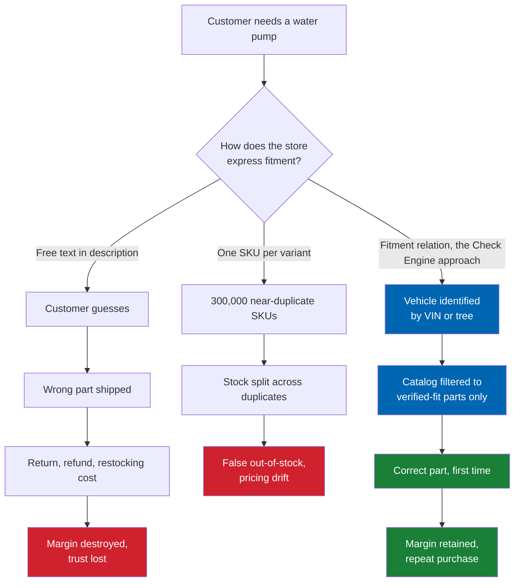
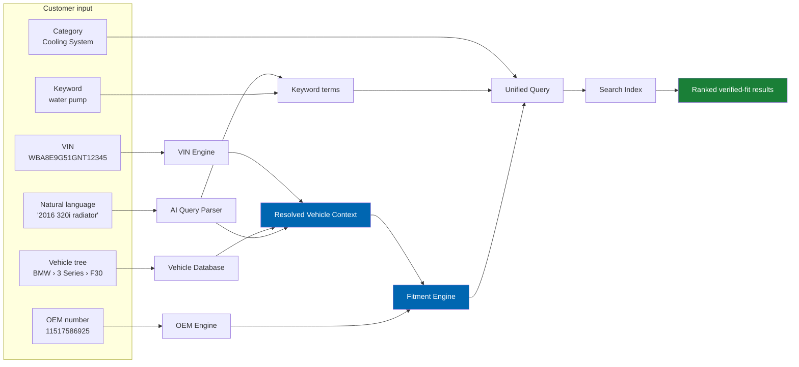
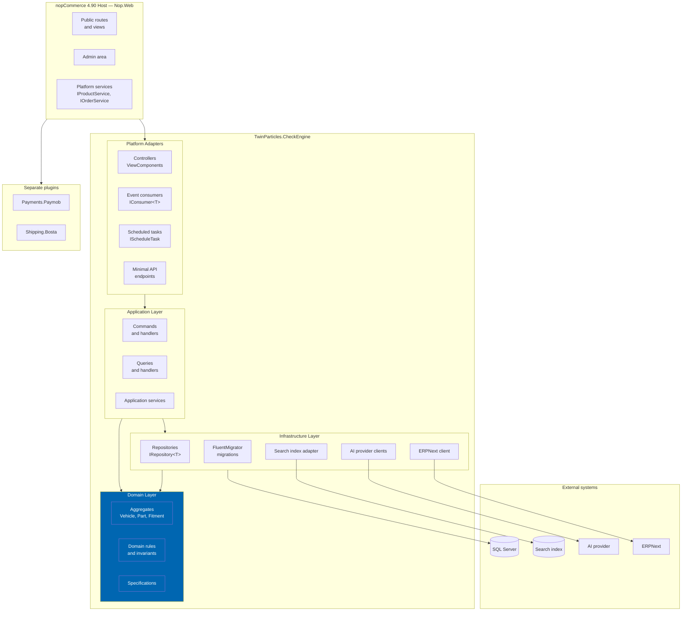
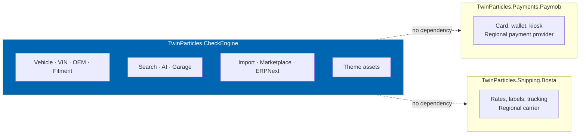
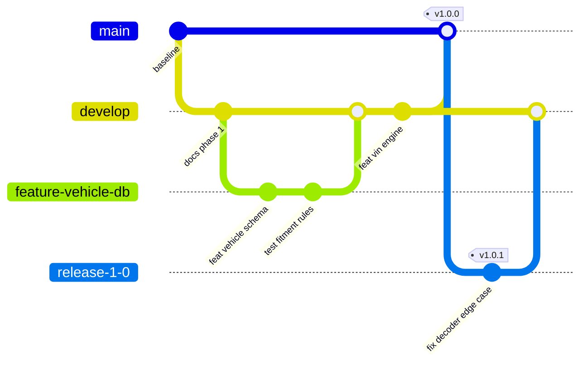

# Check Engine™

**The Complete Automotive Commerce Platform for nopCommerce**

[](docs/00-vision.md)
[](https://www.nopcommerce.com/en/release-notes)
[](https://dotnet.microsoft.com/en-us/platform/support/policy/dotnet-core)
[](docs/10-database-design.md)
[](LICENSE.md)
[](docs/README.md)

Check Engine is a commercial nopCommerce extension by [Twin Particles](#vendor) that turns a standard
nopCommerce storefront into a full automotive parts commerce platform. It adds the three capabilities
that general-purpose e-commerce platforms structurally lack: a **vehicle-aware catalog**, a
**fitment engine** that guarantees a part fits a specific vehicle, and a **VIN-to-parts search path**
that lets a customer arrive with nothing but a chassis number and leave with the correct component.

> 📘 **New here?** The [Check Engine User Guide](USER-GUIDE.md) is a screenshot-led walkthrough of
> installing, configuring, and using the plugin end to end.

> **Status:** Specification baseline plus in-tree plugin implementation. Check Engine remains
> **pre-release**: Horizon 1 is not gated until H1.35/G8 (independent security assessment), G7
> (product-owner sign-off), G11 vendor signing, and G12 Marketplace submission. Current plugin
> SemVer is `0.104.0` on nopCommerce 4.90.6 / .NET 9. See [EXECUTION-PLAN.md](EXECUTION-PLAN.md)
> and [CHANGELOG.md](CHANGELOG.md).

---

## Table of contents

- [Why Check Engine exists](#why-check-engine-exists)
- [Capabilities](#capabilities)
- [Platform requirements](#platform-requirements)
- [Architecture at a glance](#architecture-at-a-glance)
- [Product boundaries](#product-boundaries)
- [Packaging](#packaging)
- [Documentation map](#documentation-map)
- [Documentation conventions](#documentation-conventions)
- [Versioning and support](#versioning-and-support)
- [Contributing](#contributing)
- [Licensing](#licensing)
- [Vendor](#vendor)

---

## Why Check Engine exists

Selling automotive parts is not selling products. It is answering one question, repeatedly and
correctly: **"does this part fit my car?"** Every commercially meaningful behaviour in an auto parts
store descends from that question.

A general-purpose e-commerce catalog models a product as an item with attributes. An automotive
catalog must model a product as an item with *applicability* — a many-to-many relationship between a
part and the set of vehicle configurations it is valid for, qualified by production date ranges,
engine codes, body styles, drive types, steering side, market region, and supersession chains where
one part number replaces another. nopCommerce, like Shopify and WooCommerce, has no primitive for
this. Stores that try to express fitment through categories, tags, or product attributes end up with
one of two failure modes:

| Failure mode | What the store does | Commercial consequence |
|---|---|---|
| Under-specification | Lists parts with a free-text "fits BMW 3 Series" note | Customer orders the wrong part; return rates of 20–35% are typical in unassisted auto parts retail |
| Over-specification | Creates a separate product per vehicle variant | Catalog explodes combinatorially; 4,000 parts become 300,000 SKUs; inventory and pricing become unmanageable |

Check Engine resolves this by introducing a normalised vehicle model and a dedicated fitment
relation, then building every customer-facing surface — search, category pages, product pages, the
customer garage, the recommendation engine — on top of it. The commercial argument is documented in
[01 Business Requirements](docs/01-business-requirements.md) and quantified against competitors in
[04 Competitive Analysis](docs/04-competitive-analysis.md).

### The wrong-part problem, illustrated



---

## Capabilities

Check Engine ships as one commercial plugin containing eleven functional modules. Each module has a
dedicated specification document.

| Module | What it does | Specification |
|---|---|---|
| **Vehicle Database** | Normalised make → model → generation → body → engine → trim hierarchy, curated in-house, brand-agnostic by design | [12](docs/12-vehicle-database.md) |
| **VIN Engine** | Decodes a 17-character VIN into a resolved vehicle configuration, with pluggable per-manufacturer decoders and a confidence model | [13](docs/13-vin-engine.md) |
| **OEM Engine** | Manufacturer part number registry, cross-references, aftermarket equivalences, and supersession chains | [14](docs/14-oem-engine.md) |
| **Fitment Engine** | Authoritative "does this part fit this vehicle" evaluation, with qualifiers, date windows, and provenance on every claim | [15](docs/15-fitment-engine.md) |
| **Search Engine** | Six search modes — VIN, OEM, vehicle tree, category, keyword, and AI natural language — over one unified index | [16](docs/16-search-engine.md) |
| **AI Services** | Content generation, translation, compatibility inference, semantic search, recommendations, and a customer assistant, behind a provider-agnostic abstraction | [17](docs/17-ai-architecture.md) |
| **ERPNext Integration** | Bi-directional synchronisation of products, inventory, customers, orders, invoices, returns, shipments, and CRM records | [18](docs/18-erpnext-integration.md) |
| **Marketplace** | Multi-supplier catalogs, vendor dashboards, commission models, and payout reconciliation | [19](docs/19-marketplace-module.md) |
| **Customer Garage** | Saved vehicles, VINs, and OEM numbers, with cross-device persistence and garage-scoped browsing | [20](docs/20-customer-garage.md) |
| **Import Pipeline** | Twelve-stage ingestion of supplier catalogs from PDF, Excel, and CSV into a normalised, enriched, reviewable catalog | [24](docs/24-product-import-pipeline.md) |
| **Theme** | Performance-first dark automotive theme with mega menu, garage widget, vehicle selector, and sticky search | [21](docs/21-theme-design.md) |

### Search modes

Any of the six modes resolves to the same internal query contract, which is why they can be combined
in a single request. A customer can decode a VIN, then narrow by category, then refine by free text,
without changing surfaces.



Full specification in [16 Search Engine](docs/16-search-engine.md).

---

## Platform requirements

| Requirement | Version | Notes |
|---|---|---|
| nopCommerce | 4.90.0 – 4.90.6 | Minor releases within 4.90 are plugin-compatible; see [Versioning](#versioning-and-support) |
| .NET runtime | .NET 9.0 | Required by nopCommerce 4.90. See the [.NET 10 migration note](#net-10-migration) |
| .NET SDK | 9.0.100 or later | Development only |
| Visual Studio | 2022 v17.14 or later | Or JetBrains Rider 2024.3+, or VS Code with C# Dev Kit |
| Database | SQL Server 2019 or later | Standard or Enterprise; Azure SQL Database supported at S2 or above |
| Full-text search | SQL Server Full-Text Search, or Elasticsearch 8.x / OpenSearch 2.x | Required for keyword and AI search modes; see [16](docs/16-search-engine.md) |
| Cache | In-process, or Redis 7.x | Redis required for web farm deployments |
| Hosting | Windows Server 2019+ with IIS, or Linux with Nginx, or Docker | Container images published; see [32](docs/32-deployment.md) |
| AI provider | OpenAI, Azure OpenAI, or Anthropic | Optional. All AI features degrade gracefully when unconfigured; see [17](docs/17-ai-architecture.md) |

### Current workspace note

This documentation repository lives inside a nopCommerce **4.60.4** source tree. Check Engine targets
**4.90.6**. The platform upgrade from 4.60 to 4.90 spans three major versions, each with plugin-facing
breaking changes, and must complete before Check Engine implementation begins. The upgrade is
specified as a prerequisite track in [32 Deployment](docs/32-deployment.md) and sequenced in
[36 Sprint Planning](docs/36-sprint-planning.md).

### .NET 10 migration

.NET 9 is a Standard Term Support release that reaches end of support on **10 November 2026**.
nopCommerce 4.90 targets .NET 9 and does not support .NET 10. Given nopCommerce's annual November
release cadence, the platform's next major version is expected to move to .NET 10 LTS, supported
through November 2028. Check Engine treats this retargeting as a **scheduled, budgeted milestone**
rather than an unplanned event. It is a first-class item in [41 Release Plan](docs/41-release-plan.md)
and a standing risk in [45 Future Roadmap](docs/45-future-roadmap.md).

---

## Architecture at a glance

Check Engine follows Clean Architecture within the constraints of the nopCommerce plugin host. Domain
logic is isolated from both the platform and the infrastructure; the platform-facing edge is a thin
adapter layer implementing nopCommerce's extension interfaces.



The domain layer has no dependency on nopCommerce assemblies, which is what makes the vehicle,
fitment, and OEM logic unit-testable without a host and portable across future platform versions.
The dependency rules, and the specific places where nopCommerce's design forces a pragmatic
compromise, are documented in [08 System Architecture](docs/08-system-architecture.md) and
[09 Plugin Architecture](docs/09-plugin-architecture.md).

### Platform extension points used

Check Engine integrates through documented nopCommerce interfaces rather than core modification. No
file in `src/Libraries` or `src/Presentation` is altered.

| Extension point | Interface | Purpose |
|---|---|---|
| Plugin lifecycle | `BasePlugin`, `IMiscPlugin` | Install, uninstall, update, configuration URL |
| Dependency injection | `INopStartup` | Service registration and middleware configuration |
| Schema management | `[NopMigration]`, `AutoReversingMigration` | Versioned, reversible schema migrations |
| Routing | `IRouteProvider` | Public and admin route registration |
| Widget injection | `IWidgetPlugin` | Garage widget, vehicle selector, fitment panel |
| Domain events | `IConsumer<T>` | Catalog, order, and customer event reactions |
| Background work | `IScheduleTask` | Import processing, ERP sync, index rebuild |
| Caching | `ICacheKeyService`, `IStaticCacheManager` | Fitment and vehicle tree cache invalidation |
| Localisation | `ILocalizationService` | Arabic and English resources, RTL support |

---

## Product boundaries

Explicit scope control. Documented here so that scope questions have a canonical answer.

**In scope for v1.0**

- Single-supplier automotive parts commerce on nopCommerce 4.90
- Curated in-house vehicle database, BMW-first, brand-agnostic schema
- VIN decoding, OEM cross-referencing, and fitment evaluation
- Six-mode search including AI natural language
- Supplier catalog import from PDF, Excel, and CSV with AI enrichment
- Arabic and English, RTL and LTR
- ERPNext synchronisation
- Premium dark automotive theme
- Customer garage

**Deferred, with specifications written**

- Marketplace multi-supplier operation — [19](docs/19-marketplace-module.md)
- Workshop portal — [46](docs/46-workshop-portal.md)
- Fleet portal — [47](docs/47-fleet-portal.md)
- Dealer portal — [48](docs/48-dealer-portal.md)
- Multi-tenant SaaS — [49](docs/49-saas-roadmap.md)

**Out of scope, permanently**

| Excluded | Rationale |
|---|---|
| Payment gateway integrations | Delivered as separate plugins. Paymob is the reference implementation |
| Shipping carrier integrations | Delivered as separate plugins. Bosta is the reference implementation |
| Licensed fitment data redistribution | Check Engine curates its own catalog. Licensed feeds like TecDoc or ACES/PIES may be *imported* by a customer who holds a licence, but no licensed data ships with the product |
| nopCommerce core modification | Breaks upgradability and marketplace eligibility |
| Accounting and general ledger | Delegated to ERPNext |
| Vehicle diagnostics and OBD-II telemetry | Different product category. Evaluated in [45](docs/45-future-roadmap.md) |

### Vehicle data sourcing

Check Engine's vehicle, OEM, and fitment data is **curated in-house**, seeded from supplier catalogs
and enriched by AI under human review. This is a deliberate strategic choice with consequences that
run through the whole product:

- **No per-seat data licensing cost**, which is what makes the SaaS model in [49](docs/49-saas-roadmap.md) viable
- **No redistribution restrictions**, so the catalog is an owned asset rather than a rented one
- **The import pipeline becomes the primary data acquisition mechanism**, not a convenience feature — which is why [24](docs/24-product-import-pipeline.md) is the most rigorously specified document in the set
- **Data quality is the principal product risk.** Every fitment claim therefore carries a confidence score and a provenance record, and low-confidence claims route to a human review queue before publication. Specified in [15](docs/15-fitment-engine.md) and [24](docs/24-product-import-pipeline.md)
- **Trademark obligations sit with the operator.** Manufacturer names and part numbers are used nominatively for identification. Required disclaimers, usage rules, and the compliance posture are specified in [43 Licensing](docs/43-licensing.md)

---

## Packaging

Three independently versioned, independently installable artifacts.



The payment and shipping plugins are **regional reference implementations**, not required
dependencies. Check Engine functions with any nopCommerce payment or shipping provider. Paymob and
Bosta exist to prove the integration pattern and to serve the launch region; the same pattern applies
to Stripe, Adyen, DHL, or Aramex. This is what makes the product market-agnostic — see
[05 Product Strategy](docs/05-product-strategy.md).

| Artifact | Namespace | nopCommerce system name | Group |
|---|---|---|---|
| Check Engine | `TwinParticles.CheckEngine` | `TwinParticles.CheckEngine` | Misc |
| Paymob | `TwinParticles.Payments.Paymob` | `Payments.Paymob` | Payment methods |
| Bosta | `TwinParticles.Shipping.Bosta` | `Shipping.Bosta` | Shipping rate computation |

---

## Documentation map

Fifty documents organised into eight tracks. The full annotated index with reading paths by role is
in [docs/README.md](docs/README.md).

| Track | Documents | Purpose |
|---|---|---|
| **Product foundation** | [00](docs/00-vision.md) · [01](docs/01-business-requirements.md) · [02](docs/02-functional-requirements.md) · [03](docs/03-non-functional-requirements.md) | Vision, business case, and the complete requirement baseline |
| **Strategy** | [04](docs/04-competitive-analysis.md) · [05](docs/05-product-strategy.md) · [44](docs/44-commercial-strategy.md) · [42](docs/42-marketplace-publishing.md) · [43](docs/43-licensing.md) | Market position, pricing, licensing, distribution |
| **Experience** | [06](docs/06-personas.md) · [07](docs/07-user-journey.md) · [21](docs/21-theme-design.md) · [22](docs/22-ui-design-system.md) · [23](docs/23-ux-guidelines.md) · [27](docs/27-seo-strategy.md) | Users, journeys, visual system, discoverability |
| **Architecture** | [08](docs/08-system-architecture.md) · [09](docs/09-plugin-architecture.md) · [10](docs/10-database-design.md) · [11](docs/11-domain-model.md) · [34](docs/34-coding-standards.md) | Structure, schema, domain model, engineering standards |
| **Automotive core** | [12](docs/12-vehicle-database.md) · [13](docs/13-vin-engine.md) · [14](docs/14-oem-engine.md) · [15](docs/15-fitment-engine.md) · [16](docs/16-search-engine.md) · [20](docs/20-customer-garage.md) | The differentiating engines |
| **Data and AI** | [17](docs/17-ai-architecture.md) · [24](docs/24-product-import-pipeline.md) · [25](docs/25-ai-content-pipeline.md) · [26](docs/26-image-management.md) | Ingestion, enrichment, AI provider abstraction |
| **Integration and operations** | [18](docs/18-erpnext-integration.md) · [19](docs/19-marketplace-module.md) · [28](docs/28-security.md) · [29](docs/29-performance.md) · [30](docs/30-analytics.md) · [31](docs/31-logging.md) · [32](docs/32-deployment.md) · [33](docs/33-ci-cd.md) · [35](docs/35-testing-strategy.md) | Running the product in production |
| **Delivery and future** | [36](docs/36-sprint-planning.md) · [37](docs/37-product-backlog.md) · [38](docs/38-epics.md) · [39](docs/39-user-stories.md) · [40](docs/40-acceptance-criteria.md) · [41](docs/41-release-plan.md) · [45](docs/45-future-roadmap.md) · [46](docs/46-workshop-portal.md) · [47](docs/47-fleet-portal.md) · [48](docs/48-dealer-portal.md) · [49](docs/49-saas-roadmap.md) · [Appendix](docs/appendix.md) | Execution plan and product evolution |

### Reading paths

| If you are a… | Read in this order |
|---|---|
| Executive or investor | [00](docs/00-vision.md) → [04](docs/04-competitive-analysis.md) → [05](docs/05-product-strategy.md) → [44](docs/44-commercial-strategy.md) → [41](docs/41-release-plan.md) |
| Product manager | [00](docs/00-vision.md) → [01](docs/01-business-requirements.md) → [02](docs/02-functional-requirements.md) → [06](docs/06-personas.md) → [07](docs/07-user-journey.md) → [37](docs/37-product-backlog.md) |
| Solution architect | [08](docs/08-system-architecture.md) → [09](docs/09-plugin-architecture.md) → [11](docs/11-domain-model.md) → [10](docs/10-database-design.md) → [03](docs/03-non-functional-requirements.md) |
| Backend engineer | [09](docs/09-plugin-architecture.md) → [34](docs/34-coding-standards.md) → [11](docs/11-domain-model.md) → [15](docs/15-fitment-engine.md) → [35](docs/35-testing-strategy.md) |
| Frontend engineer | [21](docs/21-theme-design.md) → [22](docs/22-ui-design-system.md) → [23](docs/23-ux-guidelines.md) → [29](docs/29-performance.md) |
| Data engineer | [24](docs/24-product-import-pipeline.md) → [25](docs/25-ai-content-pipeline.md) → [12](docs/12-vehicle-database.md) → [14](docs/14-oem-engine.md) |
| DevOps engineer | [32](docs/32-deployment.md) → [33](docs/33-ci-cd.md) → [31](docs/31-logging.md) → [29](docs/29-performance.md) |
| QA engineer | [35](docs/35-testing-strategy.md) → [40](docs/40-acceptance-criteria.md) → [02](docs/02-functional-requirements.md) → [03](docs/03-non-functional-requirements.md) |

---

## Documentation conventions

Every document follows a fixed section template: Executive Summary, Objectives, Scope, Detailed
Specifications, Architecture, User Stories, Acceptance Criteria, Future Enhancements, References.
This is enforced so that a reader can predict where information lives.

### Identifier scheme

All requirements, stories, and criteria carry stable identifiers. Identifiers are **never reused or
renumbered** — a retired requirement is marked withdrawn and its number retained, so that traceability
from a git commit back to a business requirement survives refactoring.

| Prefix | Meaning | Defined in | Example |
|---|---|---|---|
| `BR-nnn` | Business requirement | [01](docs/01-business-requirements.md) | `BR-014` |
| `FR-nnn` | Functional requirement | [02](docs/02-functional-requirements.md) | `FR-207` |
| `NFR-nnn` | Non-functional requirement | [03](docs/03-non-functional-requirements.md) | `NFR-031` |
| `EP-nn` | Epic | [38](docs/38-epics.md) | `EP-07` |
| `US-nnn` | User story | [39](docs/39-user-stories.md) | `US-118` |
| `AC-nnn.n` | Acceptance criterion | [40](docs/40-acceptance-criteria.md) | `AC-118.3` |
| `RISK-nn` | Tracked risk | [01](docs/01-business-requirements.md) | `RISK-04` |
| `ADR-nnn` | Architecture decision record | [Appendix](docs/appendix.md) | `ADR-012` |

Functional requirement numbers are blocked by module: 100s vehicle, 200s VIN and OEM, 300s fitment,
400s search, 500s AI, 600s catalog and import, 700s garage and customer, 800s marketplace and ERP,
900s administration and platform.

### Traceability

Each business requirement traces forward to functional requirements, epics, stories, criteria, and
tests. The chain is machine-checkable and is validated in CI — see [33 CI-CD](docs/33-ci-cd.md).


### Terminology

Precise terms, used consistently. The full glossary is in the [Appendix](docs/appendix.md).

| Term | Definition |
|---|---|
| **Vehicle** | A specific, fully qualified configuration: make, model, generation, body style, engine, trim, and production window |
| **Vehicle node** | Any level of the vehicle hierarchy, from make down to trim |
| **Part** | A commercial offering, mapped to one nopCommerce product |
| **OEM number** | A manufacturer-assigned part number, used nominatively for identification |
| **Fitment** | An assertion that a part is applicable to a vehicle, qualified and carrying provenance |
| **Qualifier** | A constraint narrowing a fitment, such as steering side, market, or production date range |
| **Supersession** | A directed relation where one part number replaces another |
| **Garage** | A customer's saved set of vehicles, VINs, and OEM numbers |
| **Verified fit** | A fitment with confidence at or above the publication threshold, human-reviewed |

---

## Versioning and support

Check Engine follows [Semantic Versioning 2.0.0](https://semver.org/) with a platform-compatibility
discipline layered on top, because a nopCommerce plugin's compatibility is bounded by the host.

```
MAJOR . MINOR . PATCH
  │       │       └── Backward-compatible fixes. No schema change, no API change.
  │       └────────── Backward-compatible features. Additive schema only.
  └────────────────── Breaking change, or a new nopCommerce major version target.
```

The plugin declares its supported host versions in `plugin.json`, which nopCommerce validates at
upload time and refuses to install on mismatch:

```json
{
  "Group": "Misc",
  "FriendlyName": "Check Engine",
  "SystemName": "TwinParticles.CheckEngine",
  "Version": "0.104.0",
  "SupportedVersions": [ "4.90" ],
  "Author": "Twin Particles",
  "DisplayOrder": 1,
  "FileName": "TwinParticles.CheckEngine.dll",
  "Description": "The complete automotive commerce platform for nopCommerce: vehicle database, VIN decoding, OEM cross-referencing, fitment engine, AI-assisted search, and ERPNext integration."
}
```

### Support matrix

| Check Engine | nopCommerce | .NET | Status | Support until |
|---|---|---|---|---|
| 1.0.x | 4.90.0 – 4.90.6 | 9.0 | Planned launch | 12 months after 1.1 release |
| 1.1.x | 4.90.x | 9.0 | Planned | 12 months after 2.0 release |
| 2.0.x | Next nopCommerce major | 10.0 LTS | Planned, tracks platform | 24 months |

Two minor versions are supported concurrently. Security fixes are backported to every supported
version. The full policy, including the end-of-life procedure and the customer notification
commitment, is in [43 Licensing](docs/43-licensing.md).

### Branch strategy

`main` is always releasable. Work happens on short-lived branches merged by pull request with a green
CI run and one approving review. Release branches exist only to carry patches for supported versions.
Details, including commit message format and the release checklist, are in
[33 CI-CD](docs/33-ci-cd.md) and [CONTRIBUTING.md](CONTRIBUTING.md).



---

## Contributing

This is a commercial product with a controlled contribution process. Internal engineers, contracted
partners, and licensed customers submitting fixes should read [CONTRIBUTING.md](CONTRIBUTING.md),
which covers the branching model, commit conventions, the documentation section template, the
definition of done, and the review gates.

Documentation changes are held to the same standard as code: they are reviewed, versioned, and
recorded in [CHANGELOG.md](CHANGELOG.md).

---

## Licensing

Check Engine is **commercial, proprietary software**. It is not open source. Use requires a valid
licence from Twin Particles. See [LICENSE.md](LICENSE.md) for the end-user licence agreement and
[43 Licensing](docs/43-licensing.md) for the licence tiers, activation mechanism, entitlement
enforcement, and compliance obligations — including the trademark posture required when publishing a
catalog that references manufacturer part numbers.

The documentation in this repository is confidential and proprietary to Twin Particles.

---

## Vendor

**Twin Particles** — automotive commerce software.

| | |
|---|---|
| Product | Check Engine™ |
| Platform | nopCommerce 4.90.6 on .NET 9 |
| Documentation baseline | See [CHANGELOG.md](CHANGELOG.md) |
| Roadmap | See [ROADMAP.md](ROADMAP.md) |

Check Engine™ is a trademark of Twin Particles. nopCommerce is a trademark of nopCommerce Ltd. BMW,
MINI, Mercedes-Benz, Audi, Volkswagen, Porsche, Toyota, Lexus, Nissan, Hyundai, Kia, Land Rover, and
Volvo are trademarks of their respective owners, referenced nominatively for vehicle and part
identification only. Twin Particles is not affiliated with, endorsed by, or sponsored by any vehicle
manufacturer.
