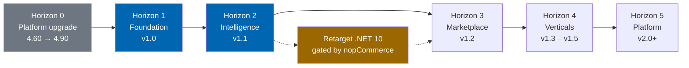
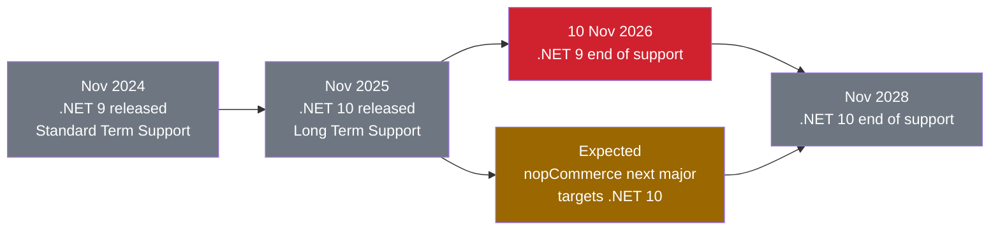

# Check Engine™ Roadmap

**Status:** Specification baseline; Horizon 1 engineering is in tree and pre-release · **Platform target:** nopCommerce 4.90.6 on .NET 9 · **Last revised:** 2026-08-25

**Engineering status (2026-08-25):** Plugin `0.104.0` is in tree. Progress, evidence gates (G1–G6 done; G11 packing partial), and remaining blockers (H1.35/G8, G7, G11 vendor signing, G12) are recorded in [EXECUTION-PLAN.md](EXECUTION-PLAN.md). This document remains the specification baseline.

This roadmap states what Check Engine will deliver, in what order, and why that order. It covers two
tracks: the **documentation phases** that produce the specification baseline, and the **product
horizons** that deliver software.

Roadmap items are commitments of sequence, not of date. Dates appear only where a release is gated by
an external event — such as nopCommerce's platform releases — and are marked as such. The detailed
sprint decomposition lives in [36 Sprint Planning](docs/36-sprint-planning.md) and the release gating
criteria in [41 Release Plan](docs/41-release-plan.md).

---

## Contents

- [Guiding principles](#guiding-principles)
- [Product horizons](#product-horizons)
- [Horizon 1 — Foundation](#horizon-1--foundation)
- [Horizon 2 — Intelligence](#horizon-2--intelligence)
- [Horizon 3 — Marketplace](#horizon-3--marketplace)
- [Horizon 4 — Verticals](#horizon-4--verticals)
- [Horizon 5 — Platform](#horizon-5--platform)
- [Documentation phases](#documentation-phases)
- [Platform dependency track](#platform-dependency-track)
- [Sequencing rationale](#sequencing-rationale)
- [Risk register summary](#risk-register-summary)
- [What we are not doing](#what-we-are-not-doing)
- [Roadmap governance](#roadmap-governance)

---

## Guiding principles

Five rules govern what enters a horizon and what waits.

| Principle | Consequence for the roadmap |
|---|---|
| **Fitment correctness precedes everything** | No feature that presents parts to customers ships before the fitment engine can substantiate its claims. This is why search and the storefront sit behind the vehicle and fitment work rather than beside it. |
| **Data acquisition is the critical path** | A perfect catalog engine with an empty catalog has no value. The import pipeline is Horizon 1 work, not a later convenience. |
| **AI augments, never authorises** | AI features accelerate human work and are always reviewable. No AI output reaches a customer without a review path, which is why the review workflow ships before the generation features that feed it. |
| **Brand-agnostic from the first commit** | BMW is the first dataset, never a special case in code. Any schema or rule that cannot express a second manufacturer is rejected at review. |
| **Ship a coherent product, not a feature list** | Each horizon ends at a state a customer could buy and operate. Partial capability is held back rather than released incomplete. |

---

## Product horizons

| Horizon | Release | Theme | Ends when |
|---|---|---|---|
| **0** | — | Platform upgrade to 4.90 | The host tree builds and passes tests on 4.90.6 |
| **1** | v1.0 | Foundation — vehicle, fitment, search, import, storefront | A single-supplier BMW parts store is commercially operable end to end |
| **2** | v1.1 | Intelligence — AI content, semantic search, assistant, recommendations | AI features are production-grade with cost controls and review workflows |
| **3** | v1.2 | Marketplace — multi-supplier, commissions, vendor dashboards | A second supplier can onboard, list, sell, and be paid without operator intervention |
| **4** | v1.3–v1.5 | Verticals — workshop, fleet, and dealer portals | Trade segments have purpose-built experiences rather than adapted retail ones |
| **5** | v2.0+ | Platform — multi-tenant SaaS, public API, data services | Check Engine is operable as a hosted service, not only as a plugin |

---

## Horizon 0 — Platform upgrade

**Prerequisite work. Not a Check Engine release.**

This repository sits in a nopCommerce **4.60.4** tree. Check Engine targets **4.90.6**. That is three
major-version hops, each carrying plugin-facing breaking changes. This work must complete before
Check Engine implementation begins, because building against 4.60 and porting later would mean writing
the plugin twice.

| Step | From → To | Runtime change | Principal plugin-facing concerns |
|---|---|---|---|
| 0.1 | 4.60 → 4.70 | .NET 7 → .NET 8 | Service registration changes, nullable reference type propagation |
| 0.2 | 4.70 → 4.80 | .NET 8 → .NET 9 | Namespace and API refactoring from the platform's architecture cleanup |
| 0.3 | 4.80 → 4.90 | .NET 9 (no change) | Admin area and view component adjustments |
| 0.4 | Verification | — | Full regression against the platform test suite; plugin reference implementations build and install |

Deliverables, tooling, and the rollback plan are specified in
[32 Deployment](docs/32-deployment.md#platform-upgrade-track).

> **Why not target 4.60 and stay put?** 4.60 runs on .NET 7, which left support in May 2024. A
> commercial product launched on an unpatched runtime inherits every unremediated vulnerability in it
> and cannot be sold to customers with security review requirements. Recorded as `ADR-001`.

---

## Horizon 1 — Foundation

**Release v1.0 · Theme: a correct, complete, single-supplier automotive store**

The commercial thesis of Horizon 1 is narrow and testable: a customer arrives with a vehicle, finds
the right part, and buys it. Everything in this horizon serves that sentence.

### Deliverables

| Capability | Specification | Why it is in Horizon 1 |
|---|---|---|
| Vehicle database and hierarchy | [12](docs/12-vehicle-database.md) | Nothing else can be built without it |
| VIN decoding with confidence model | [13](docs/13-vin-engine.md) | The highest-value entry point; converts an opaque chassis number into a shopping context |
| OEM registry, cross-references, supersessions | [14](docs/14-oem-engine.md) | Trade buyers search by part number, not by car |
| Fitment engine | [15](docs/15-fitment-engine.md) | The product's reason to exist |
| Search — VIN, OEM, tree, category, keyword | [16](docs/16-search-engine.md) | Five of six modes; AI natural language waits for Horizon 2 |
| Customer garage | [20](docs/20-customer-garage.md) | Converts a one-time fitment resolution into a returning-customer asset |
| Import pipeline with human review | [24](docs/24-product-import-pipeline.md) | The catalog acquisition mechanism; the critical path for having anything to sell |
| Image management | [26](docs/26-image-management.md) | Parts without images do not convert; placeholder and sourcing workflow included |
| Premium dark theme | [21](docs/21-theme-design.md) · [22](docs/22-ui-design-system.md) | The storefront surface for all of the above |
| Arabic and English, RTL and LTR | [23](docs/23-ux-guidelines.md) | Launch-region requirement, and a structural constraint on every component |
| SEO — vehicle and part landing pages | [27](docs/27-seo-strategy.md) | Organic acquisition is the dominant channel for long-tail part queries |
| ERPNext synchronisation | [18](docs/18-erpnext-integration.md) | Target customers already run ERPNext; a store that does not sync is a second system to maintain |
| Security, logging, observability | [28](docs/28-security.md) · [31](docs/31-logging.md) | Not deferrable. Retrofitting audit and authorisation is a rewrite |
| Paymob and Bosta reference plugins | [05](docs/05-product-strategy.md) | Prove the regional provider pattern and serve the launch region |

### Exit criteria

Horizon 1 is complete when all of the following hold. These are gates, not aspirations.

- [ ] A supplier catalog in PDF, Excel, or CSV form imports to a published, reviewed state without manual data entry
- [ ] A VIN resolves to a vehicle configuration, and the resulting parts list contains no part that does not fit
- [ ] Every published fitment claim carries a confidence score and a provenance record
- [ ] Search returns results within the budget in [03](docs/03-non-functional-requirements.md) at the reference catalog size
- [ ] The storefront meets its Core Web Vitals targets on a mid-range mobile device over a throttled connection
- [ ] Arabic and English render correctly in RTL and LTR with no layout defects
- [ ] Orders, inventory, and customers reconcile with ERPNext with no manual intervention
- [ ] Test coverage meets the thresholds in [35](docs/35-testing-strategy.md), including the implemented PostgreSQL-backed Playwright smoke stack for install/home/search/sample PDP
- [ ] The plugin installs and uninstalls cleanly on a stock 4.90.6 instance, leaving no orphaned schema
- [ ] Security review passes with no open high or critical findings

---

## Horizon 2 — Intelligence

**Release v1.1 · Theme: AI that shortens work without removing judgement**

Horizon 2 exists as a separate horizon on purpose. AI features are the most demonstrable part of the
product and the easiest to ship badly. Building them after the deterministic engines means the AI has
correct data to reason over and a review workflow to be corrected by.

### Deliverables

| Capability | Specification | Note |
|---|---|---|
| AI provider abstraction | [17](docs/17-ai-architecture.md) | OpenAI, Azure OpenAI, and Anthropic behind one interface; no provider lock-in |
| Natural-language search | [16](docs/16-search-engine.md) | "BMW F30 water pump", "2016 320i radiator", "front bumper E90" resolve to structured queries |
| Semantic and vector search | [16](docs/16-search-engine.md) | Handles synonyms, misspellings, and Arabic-English code-switching |
| AI product descriptions and specifications | [25](docs/25-ai-content-pipeline.md) | Generation with mandatory review before publication |
| AI translation, Arabic and English | [25](docs/25-ai-content-pipeline.md) | Automotive terminology glossary enforced, not free translation |
| AI SEO metadata and slugs | [27](docs/27-seo-strategy.md) | Titles, descriptions, and structured data at catalog scale |
| AI compatibility inference | [15](docs/15-fitment-engine.md) | Proposes fitments as low-confidence candidates for review; never publishes directly |
| Recommendations, cross-sell, upsell | [17](docs/17-ai-architecture.md) | Fitment-constrained: a recommendation that does not fit is a defect, not a suggestion |
| Customer assistant | [17](docs/17-ai-architecture.md) | Grounded in the store's own catalog and fitment data |
| Cost governance | [17](docs/17-ai-architecture.md) | Per-feature budgets, token accounting, rate limits, caching, and hard spend ceilings |

### Exit criteria

- [ ] Natural-language search resolves the published benchmark query set at or above its accuracy target
- [ ] No AI feature can publish customer-visible content without passing through review
- [ ] Every AI recommendation is fitment-constrained to the active vehicle context
- [ ] AI spend is observable per feature, and a configured ceiling stops spend rather than degrading silently
- [ ] All AI features remain individually disableable, and the product is fully functional with every one disabled

---

## Horizon 3 — Marketplace

**Release v1.2 · Theme: from one supplier to many**

### Deliverables

| Capability | Specification |
|---|---|
| Supplier onboarding and verification | [19](docs/19-marketplace-module.md) |
| Vendor catalog isolation and per-vendor pricing | [19](docs/19-marketplace-module.md) |
| Vendor dashboard — orders, inventory, performance | [19](docs/19-marketplace-module.md) |
| Commission models — flat, percentage, tiered, category-specific | [19](docs/19-marketplace-module.md) |
| Payout calculation, reconciliation, and statements | [19](docs/19-marketplace-module.md) |
| Multi-vendor cart, split orders, split shipments | [19](docs/19-marketplace-module.md) |
| Vendor-scoped fitment contribution with review | [15](docs/15-fitment-engine.md) |
| Marketplace analytics and supplier scorecards | [30](docs/30-analytics.md) |

### Exit criteria

- [ ] A supplier onboards, lists, sells, ships, and is paid without operator intervention
- [ ] A vendor cannot read or modify another vendor's catalog, orders, or customers
- [ ] Commission and payout figures reconcile exactly with ERPNext
- [ ] Vendor-contributed fitment claims are attributed, reviewable, and revocable

---

## Horizon 4 — Verticals

**Releases v1.3 – v1.5 · Theme: trade segments deserve purpose-built experiences**

Retail e-commerce patterns fail for trade buyers. A workshop ordering twelve parts against three
customer jobs, a fleet manager scheduling maintenance across two hundred vehicles, and a dealer
managing allocation against a franchise agreement are three different products wearing the same
storefront.

| Release | Portal | Specification | Core value |
|---|---|---|---|
| v1.3 | Workshop | [46](docs/46-workshop-portal.md) | Job-based ordering, labour estimates, customer vehicle records, trade pricing, parts-to-job allocation |
| v1.4 | Fleet | [47](docs/47-fleet-portal.md) | Bulk vehicle registers, scheduled maintenance forecasting, consumption analytics, cost-per-vehicle reporting, approval workflows |
| v1.5 | Dealer | [48](docs/48-dealer-portal.md) | Franchise-aware catalogs, allocation and quota management, tiered dealer pricing, warranty claim support |

### Exit criteria per portal

- [ ] The segment's primary workflow completes without using the retail storefront
- [ ] Segment-specific pricing, credit terms, and approval rules are enforced server-side
- [ ] The portal's data model reuses the core vehicle and fitment engines with no forked logic

---

## Horizon 5 — Platform

**Release v2.0 and beyond · Theme: Check Engine as a service**

| Capability | Specification | Gate |
|---|---|---|
| Retarget to .NET 10 LTS | [32](docs/32-deployment.md) | Gated by nopCommerce's next major release |
| Multi-tenant SaaS operation | [49](docs/49-saas-roadmap.md) | Requires tenant isolation, metered billing, per-tenant configuration |
| Public REST API and webhooks | [08](docs/08-system-architecture.md) | Requires a versioned, stable contract surface |
| Vehicle data as a service | [49](docs/49-saas-roadmap.md) | Only viable because the catalog is owned, not licensed — see `ADR-003` |
| Mobile applications | [45](docs/45-future-roadmap.md) | Depends on the public API |
| Additional platform targets | [45](docs/45-future-roadmap.md) | Evaluated, not committed |

### The .NET 10 milestone

.NET 9 reaches end of support on **10 November 2026**. .NET 10 is the LTS release, supported through
**November 2028**. nopCommerce 4.90 targets .NET 9 and does not support .NET 10; given the platform's
annual November cadence, its next major version is expected to move to .NET 10.

Check Engine's position is to **track the platform, not lead it**. A plugin cannot target a runtime its
host does not support. The work is therefore scheduled as a standing milestone, budgeted in advance,
and triggered by nopCommerce's release rather than by a calendar date. Recorded as `ADR-002`.

---

## Documentation phases

The specification is produced in eight phases, ordered by dependency. Each phase locks decisions that
later phases build on, which is why they are sequential rather than parallel.

| Phase | Documents | Locks | Status |
|---|---|---|---|
| **1** | README, LICENSE, CHANGELOG, ROADMAP, CONTRIBUTING, [00](docs/00-vision.md)–[07](docs/07-user-journey.md) | Vision, market, personas, and the complete requirement baseline | **Complete** |
| **2** | [08](docs/08-system-architecture.md) [09](docs/09-plugin-architecture.md) [10](docs/10-database-design.md) [11](docs/11-domain-model.md) [34](docs/34-coding-standards.md) | Architecture, domain model, schema conventions, engineering standards | **Complete** |
| **3** | [12](docs/12-vehicle-database.md)–[16](docs/16-search-engine.md) | The automotive engines | **Complete** |
| **4** | [17](docs/17-ai-architecture.md) [24](docs/24-product-import-pipeline.md) [25](docs/25-ai-content-pipeline.md) [26](docs/26-image-management.md) | Data acquisition, enrichment, AI abstraction | **Complete** |
| **5** | [18](docs/18-erpnext-integration.md) [19](docs/19-marketplace-module.md) [20](docs/20-customer-garage.md) | Integration and multi-party operation | **Complete** |
| **6** | [21](docs/21-theme-design.md) [22](docs/22-ui-design-system.md) [23](docs/23-ux-guidelines.md) [27](docs/27-seo-strategy.md) | Experience and discoverability | **Complete** |
| **7** | [28](docs/28-security.md)–[33](docs/33-ci-cd.md) [35](docs/35-testing-strategy.md) | Production operation | **Complete** |
| **8** | [36](docs/36-sprint-planning.md)–[49](docs/49-saas-roadmap.md), [Appendix](docs/appendix.md) | Delivery plan and product evolution | **Complete** |

Phase 8 locks the delivery inventory (`EP-01`–`EP-28`, `US-001`–`US-120`), release gates, commercial
packaging, vertical portals, SaaS direction, and the appendix (glossary + ADR index). The documentation
baseline is now complete pending product-owner sign-off of documents marked Review.

---

## Platform dependency track

Check Engine's release schedule is partly determined by events outside Twin Particles' control. Those
dependencies are tracked explicitly rather than assumed away.

| Dependency | Owner | Impact if it slips | Mitigation |
|---|---|---|---|
| nopCommerce next major on .NET 10 | nopCommerce Ltd | v2.0 slips; Check Engine remains on an unsupported runtime | Maintain a .NET 10 compatibility branch; contribute upstream where useful |
| nopCommerce 4.90 minor releases | nopCommerce Ltd | Compatibility regressions | CI matrix tests every supported minor version |
| AI provider API stability | OpenAI, Microsoft, Anthropic | Feature breakage | Provider abstraction with at least two implementations validated at all times |
| ERPNext API stability | Frappe Technologies | Sync breakage | Version-pinned client, contract tests against a pinned ERPNext instance |
| Paymob and Bosta API stability | Respective vendors | Regional plugin breakage | Isolated in separate plugins; core unaffected |

---

## Sequencing rationale

Why this order and not another. Four questions that come up, answered once.

**Why not ship AI search in v1.0? It is the most demonstrable feature.**
Because AI search over a catalog with unverified fitment produces confident wrong answers, which is
worse than no answer. Natural-language search returns parts; if the fitment behind those parts is not
trustworthy, the feature actively harms the customer. The deterministic engines have to be correct
first. Shipping AI search in v1.0 would also mean the search benchmark suite is validating against a
moving target.

**Why is the import pipeline Horizon 1 rather than a later tool?**
Because the product has no value without a catalog, and the catalog is curated in-house rather than
licensed (`ADR-003`). Under that decision, import *is* the data acquisition mechanism. A store cannot
launch with an empty database, and manual entry of tens of thousands of parts with fitment is not a
viable launch path.

**Why does the marketplace wait until Horizon 3?**
Multi-supplier operation multiplies every unsolved problem. Two suppliers with overlapping catalogs
require duplicate detection, competing fitment claims require adjudication, and split orders require a
settled order model. Each of those is straightforward once the single-supplier case is correct and
unpleasant before.

**Why are the portals separate releases rather than one Horizon 4 release?**
Each portal serves a distinct segment with its own sales motion. Shipping them together delays all
three for the slowest. Shipping them in sequence lets revenue from the workshop portal fund the fleet
portal, and lets each portal's design learn from the previous one.

---

## Risk register summary

The principal risks to this roadmap. Full analysis, likelihood, impact scoring, owners, and mitigation
detail are in [01 Business Requirements](docs/01-business-requirements.md#risk-register).

| ID | Risk | Horizon at risk | Mitigation summary |
|---|---|---|---|
| `RISK-01` | Curated fitment data proves inaccurate at scale, damaging trust | 1 | Confidence scoring, provenance on every claim, mandatory review below threshold, customer-reported correction loop |
| `RISK-02` | Catalog acquisition is slower than projected, delaying launch | 1 | Import pipeline is critical-path with dedicated capacity; pilot with a real supplier catalog in Phase 3 |
| `RISK-03` | Platform upgrade 4.60 → 4.90 uncovers unexpected breaking changes | 0 | Sequential single-hop upgrades with regression gates at each step |
| `RISK-04` | nopCommerce next major slips, stranding the product on .NET 9 | 5 | Compatibility branch maintained ahead of the platform release |
| `RISK-05` | AI operating cost exceeds the margin it generates | 2 | Hard per-feature spend ceilings, aggressive caching, batch processing, measured cost per enriched product |
| `RISK-06` | Trademark challenge over manufacturer references | 1 | Nominative-use discipline, disclaimers enabled by default, obligations contractually allocated in [LICENSE.md](LICENSE.md#10-trademarks-and-nominative-use) |
| `RISK-07` | Search performance degrades at full catalog scale | 1 | Performance budgets defined before build; load testing against a reference dataset from Phase 3 |
| `RISK-08` | ERPNext API changes break synchronisation | 1 | Version-pinned client with contract tests |

---

## What we are not doing

Stated explicitly, because a roadmap without exclusions is a wish list. The reasoning for each is in
[README.md](README.md#out-of-scope-permanently) and [05 Product Strategy](docs/05-product-strategy.md).

| Not doing | Reason |
|---|---|
| Modifying nopCommerce core | Destroys upgradability and marketplace eligibility |
| Bundling licensed fitment data | Incompatible with `ADR-003`; import connectors are provided instead |
| Building payment or shipping integrations into the core | Regional concerns belong in separate provider plugins |
| Accounting, general ledger, or payroll | ERPNext's domain |
| OBD-II diagnostics and vehicle telemetry | Different product category; evaluated in [45](docs/45-future-roadmap.md) |
| A headless-only architecture in v1.0 | The public API arrives in Horizon 5 with a stable contract, not as an unversioned side effect |
| Supporting nopCommerce versions below 4.90 | Every earlier line runs on an out-of-support runtime |

---

## Roadmap governance

| Aspect | Rule |
|---|---|
| Review cadence | At the close of each documentation phase and each horizon |
| Change authority | Product owner, with architecture sign-off for any change affecting an `ADR` |
| Horizon promotion | An item may move earlier only if its dependencies are already satisfied and its exit criteria are testable |
| Deferral | Any deferred item is recorded with the reason and the earliest horizon it could re-enter |
| Date commitments | Made only in [41 Release Plan](docs/41-release-plan.md), never here, and only for externally gated events |
| Backlog linkage | Every horizon item maps to at least one epic in [38 Epics](docs/38-epics.md) |

---

## References

- [README.md](README.md) — product overview and support matrix
- [CHANGELOG.md](CHANGELOG.md) — revision history and decision records
- [CONTRIBUTING.md](CONTRIBUTING.md) — contribution and review process
- [01 Business Requirements](docs/01-business-requirements.md) — full risk register and commercial drivers
- [05 Product Strategy](docs/05-product-strategy.md) — positioning and segment prioritisation
- [36 Sprint Planning](docs/36-sprint-planning.md) — sprint-level decomposition
- [38 Epics](docs/38-epics.md) — epic inventory mapped to horizons
- [41 Release Plan](docs/41-release-plan.md) — release cadence, gating, and dates
- [45 Future Roadmap](docs/45-future-roadmap.md) — beyond Horizon 5
- [nopCommerce release notes](https://www.nopcommerce.com/en/release-notes)
- [.NET support policy](https://dotnet.microsoft.com/en-us/platform/support/policy/dotnet-core)
