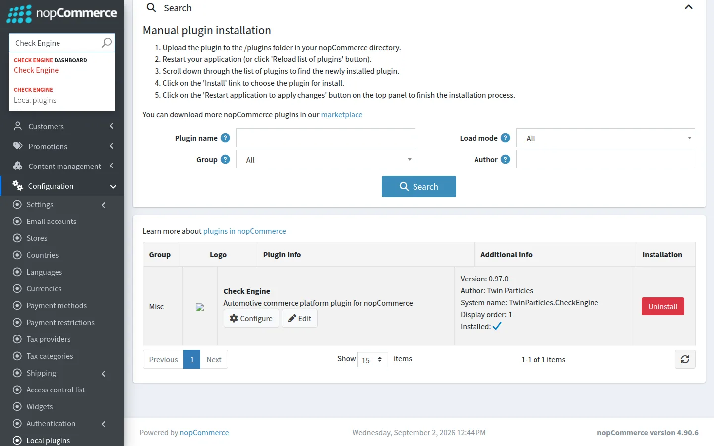
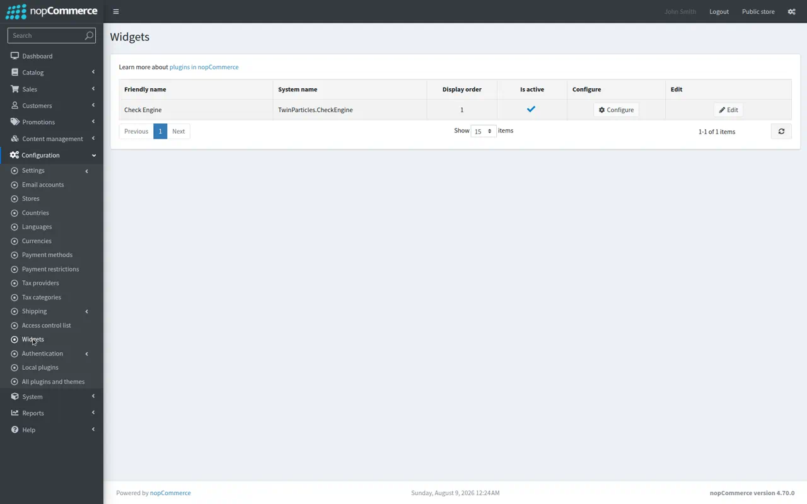
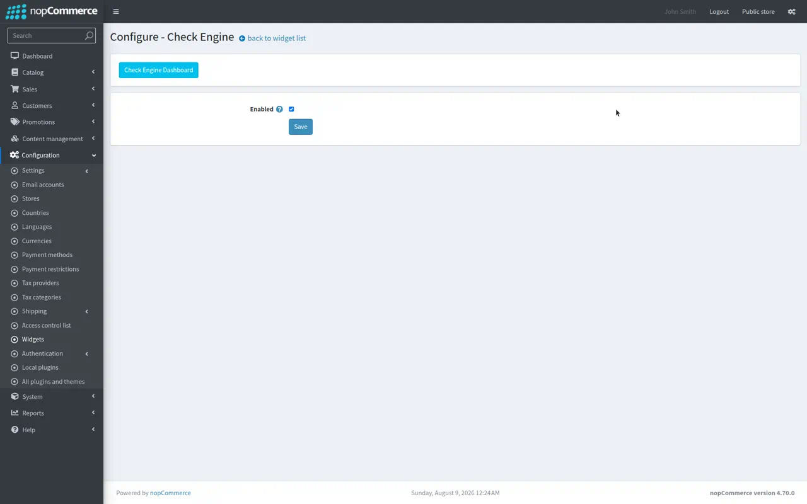
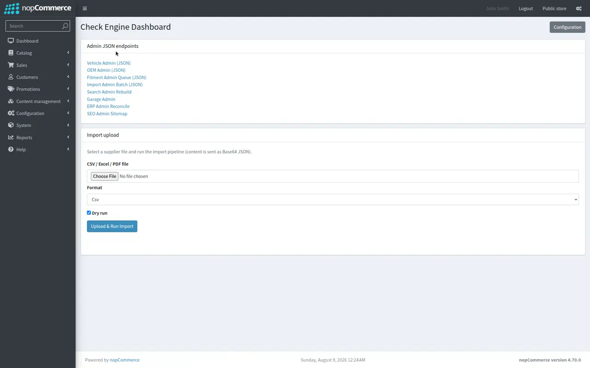
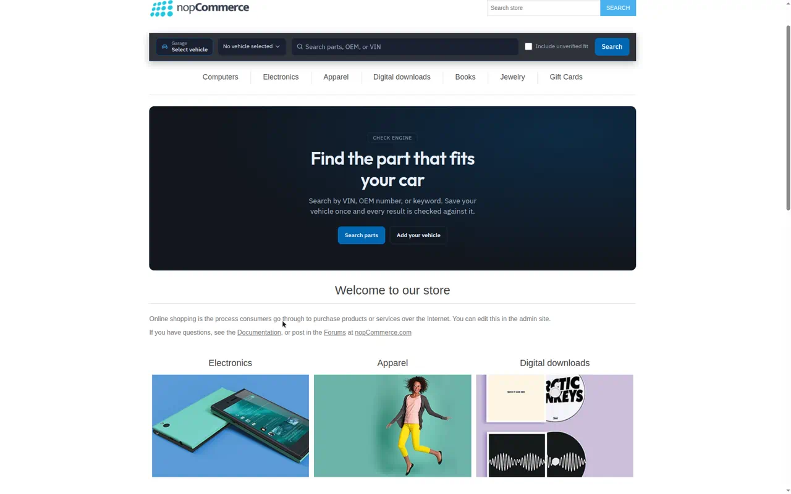
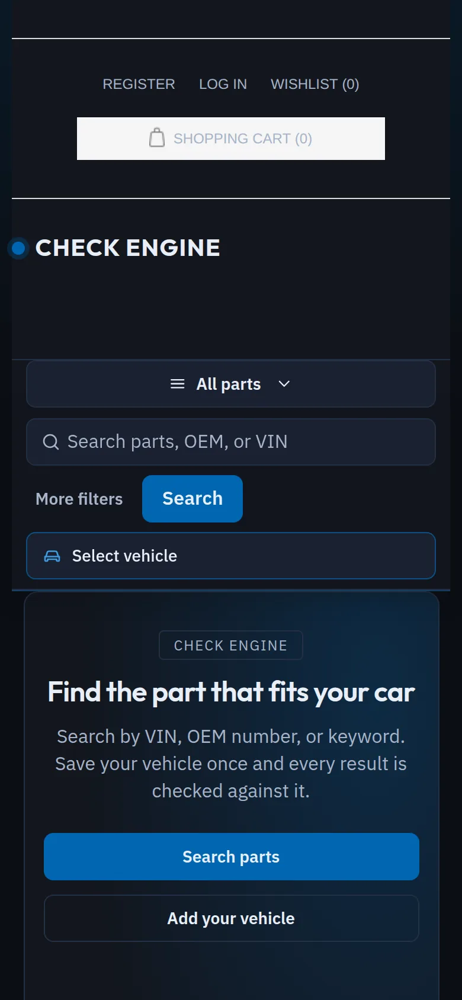
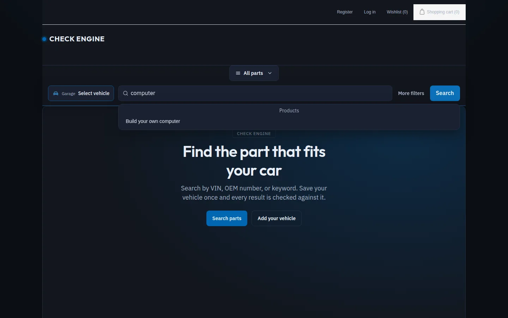
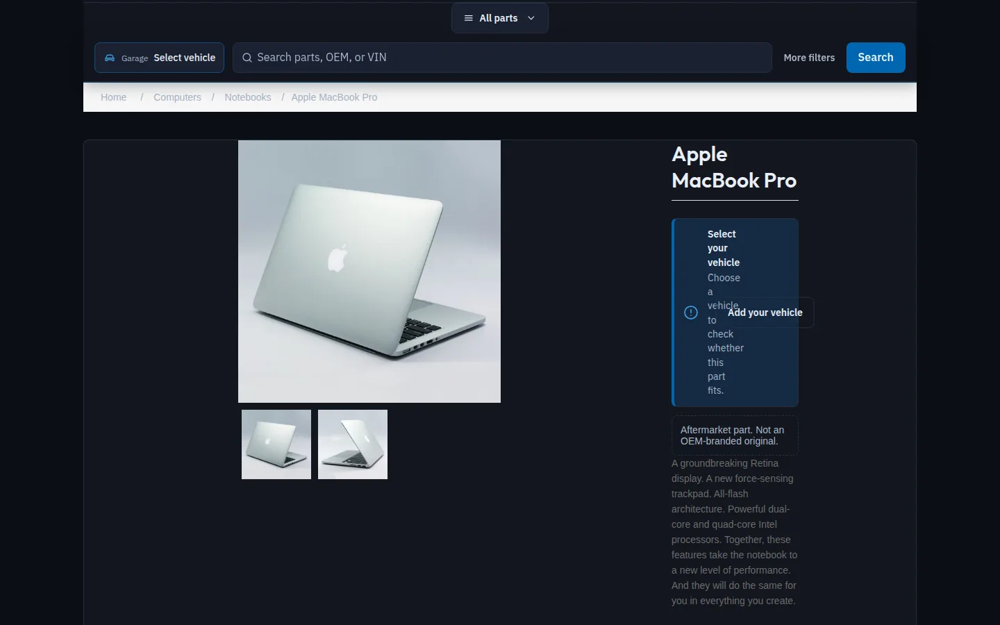
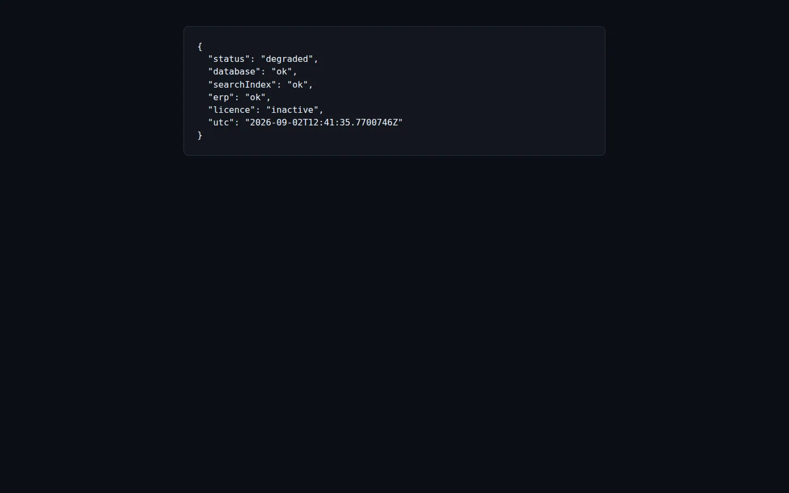

# Check Engine™ — User Guide

> A practical, screenshot-led guide to installing, configuring, and using the Check Engine plugin for nopCommerce.

**Status:** Draft · **Applies to:** Check Engine `0.1.0` on nopCommerce `4.70` · **Last revised:** 2026-08-09

All screenshots in this guide were captured from a live store running the plugin.

---

## Contents

1. [What Check Engine does](#1-what-check-engine-does)
2. [Compatibility and prerequisites](#2-compatibility-and-prerequisites)
3. [Installation](#3-installation)
4. [Enabling the storefront widget](#4-enabling-the-storefront-widget)
5. [Configuration and the admin dashboard](#5-configuration-and-the-admin-dashboard)
6. [Using Check Engine on the storefront](#6-using-check-engine-on-the-storefront)
7. [Admin workflows](#7-admin-workflows)
8. [The product import pipeline](#8-the-product-import-pipeline)
9. [Health and diagnostics](#9-health-and-diagnostics)
10. [HTTP API reference](#10-http-api-reference)
11. [Optional integrations (AI and ERP)](#11-optional-integrations-ai-and-erp)
12. [Troubleshooting](#12-troubleshooting)
12a. [Theming and appearance](#12a-theming-and-appearance)
13. [Known limitations](#13-known-limitations)
14. [Uninstalling](#14-uninstalling)

---

## 1. What Check Engine does

Check Engine turns a standard nopCommerce store into an **automotive parts storefront**. It adds a
vehicle-aware layer on top of the normal catalog so that shoppers can find parts that fit their car and
store operators can manage fitment data with an audit trail.

Core capabilities:

| Area | What it gives you |
|---|---|
| **Unified search** | One search box that understands VINs, OEM part numbers, vehicle trees, categories, and keywords |
| **Garage** | Shoppers save vehicles (by VIN or configuration) and browse "parts that fit" |
| **Fitment** | A "does this fit?" band on product pages, evaluated against the active vehicle, with a fail-closed policy |
| **OEM engine** | Part-number normalization, cross-reference, and supersession chains |
| **Import pipeline** | Upload supplier CSV/Excel/PDF, review low-confidence rows, then publish to the catalog |
| **Admin + health** | JSON admin endpoints, an operator dashboard, audit events, and a health endpoint |

---

## 2. Compatibility and prerequisites

| Requirement | Value |
|---|---|
| nopCommerce | 4.70 (`SupportedVersions` in `plugin.json`) |
| .NET runtime | .NET 8 (the host and plugin target `net8.0`) |
| Database | **SQL Server** is the supported production database for Check Engine tables (see [Known limitations](#13-known-limitations)) |
| Permissions | An admin account with the **Manage Check Engine** permission for admin endpoints |

Before installing, make sure the host store itself is installed and reachable (you can browse the
storefront and log into `/admin`).

---

## 3. Installation

### 3.1 Build and deploy the plugin

From a clone of the repository, build the plugin (its post-build step copies the output into the host's
`Plugins/TwinParticles.CheckEngine` folder):

```bash
dotnet build src/Plugins/TwinParticles.CheckEngine/TwinParticles.CheckEngine.csproj -c Release
```

Or run the bundled convenience script, which also builds and runs the test suite:

```bash
bash CheckEngine/scripts/build-checkengine.sh     # Linux/macOS
pwsh CheckEngine/scripts/build-checkengine.ps1     # Windows
```

Start (or restart) the store so it discovers the new plugin assembly.

### 3.2 Install from the admin area

1. Log into the admin: `http://<your-store>/admin`.
2. Go to **Configuration → Local plugins** (`/Admin/Plugin/List`).
3. Find **Check Engine** in the **Misc** group and click **Install**.
4. Click **Restart application to apply changes** and wait for the app to come back.

On install, Check Engine runs its database migrations and creates its `TP_CE_*` tables (vehicle
hierarchy, OEM registry, fitment, garage, import, SEO, ERP queue, and audit). When installed, the row
shows **Uninstall / Configure / Edit** actions:



---

## 4. Enabling the storefront widget

Installing the plugin does **not** automatically switch on its storefront chrome — nopCommerce tracks
widget activation separately.

1. Go to **Configuration → Widgets** (`/Admin/Widget/List`).
2. Find **Check Engine** and set **Is active** to yes (Edit → tick *Is active* → Update, or toggle it in
   the grid).



Once active, the plugin injects its search bar, vehicle selector/garage chip, and product fitment band
into the storefront widget zones.

---

## 5. Configuration and the admin dashboard

### 5.1 Configure page

Open **Configure** from the Local plugins row, or browse to `/Admin/CheckEngine/Configure`. The page
carries a master **Enabled** switch and a link into the operator dashboard.



### 5.2 Operator dashboard

The dashboard (`/Admin/CheckEngine/Dashboard`) is the operator hub. It lists the admin JSON endpoints
(vehicle, OEM, fitment queue, import, search rebuild, garage, ERP, SEO) and provides a file-upload panel
for running the import pipeline.



---

## 6. Using Check Engine on the storefront

### 6.1 The Check Engine chrome

With the widget active, the storefront gains a **sticky search rail** that sits directly below the store
header. The rail holds, in order: the **garage context chip**, the **vehicle selector**, the unified
**search field** ("Search parts, OEM, or VIN"), an **Include unverified fit** toggle, and the **Search**
button. On the home page a Check Engine **hero panel** introduces the vehicle-first flow.



The rail stays visible while scrolling, and on small screens it reflows so the query field always leads:



### 6.2 Searching for parts

Type into the Check Engine search bar and submit. The box is **mode-aware**: it auto-detects what you
typed and routes the query accordingly.

| You type | Detected mode | Behavior |
|---|---|---|
| A 17-character VIN | VIN | Decodes the VIN, sets vehicle context, returns fitment-filtered parts |
| An OEM part number (e.g. `11-51-7-586-925`) | OEM | Normalizes and resolves the number, follows supersession, returns linked products |
| Free text (e.g. `oil filter`) | Keyword | Bilingual keyword search, fitment-filtered when a vehicle is active |

Results render in a dropdown directly under the search field. The panel header shows the result count and
the **mode that was actually used** (and flags `degraded` when the search index is unavailable). Each row
shows the product name plus brand and product id:



Behaviour worth knowing:

- **Include unverified fit** widens results to parts whose compatibility could not be verified. It is off
  by default, so a vehicle-filtered search only returns verified fits.
- `Esc` closes the dropdown and returns focus to the field; clicking outside also dismisses it.
- When no part matches, the panel shows a clear empty state with recovery advice rather than a wrong
  result — fitment answers are always fail-closed.

### 6.3 The garage and active vehicle

- Signed-in shoppers can add vehicles to their **garage** by VIN or by picking a vehicle configuration.
- Exactly **one** vehicle is *active* at a time; the active vehicle drives default fitment filtering in
  search and on product pages.
- Guests get a local (browser) garage that is **merged into their account** when they sign in or register.
- The vehicle selector in the header lets shoppers switch the active vehicle or add a new one.

### 6.4 The product fitment band

On a product page, Check Engine adds a **fitment band** near the top of the product details. It calls the
fitment engine for the active vehicle and shows one of a small set of states — never a speculative
"Fits":

| State | Meaning |
|---|---|
| **Select your vehicle** | No active vehicle yet — prompt to choose one |
| **Fits** | The part is a verified fit for the active vehicle |
| **Does not fit** | The part is known not to fit |
| **Unknown** | Compatibility can't be verified (also the fail-closed result on any error) |

Every state is encoded three ways — colour, icon, and text — so the meaning never depends on colour
alone. When no vehicle is set, the band offers an **Add your vehicle** action inline.



---

## 7. Admin workflows

All admin endpoints live under `/Admin/CheckEngine/...`, require the **Manage Check Engine** permission,
and (today) return **JSON** rather than full admin screens. The dashboard links to each of them. They are
designed to be driven from the dashboard, scripts, or your own tooling.

| Workflow | Endpoint(s) | Notes |
|---|---|---|
| **Vehicle catalog** | `/Admin/CheckEngine/VehicleAdmin/{Makes,Models,Generations,Bodies,Engines,Markets,Configurations,Aliases}` and `Create*/Update*/Delete*`; `Seed` | Full brand-agnostic hierarchy CRUD |
| **OEM registry** | `/Admin/CheckEngine/OemAdmin/{Manufacturers,OemNumbers,Relations}` and `Create*/Update*/Delete*` | Manufacturer-qualified numbers, cross-reference and supersession relations |
| **Fitment review** | `/Admin/CheckEngine/FitmentAdmin/Queue`, `Approve`, `Reject` | Approvals/rejections are written to the audit trail; safety-critical categories can't be force-published below threshold |
| **Import** | `/Admin/CheckEngine/ImportAdmin/{Run,Batch,RerunStage,SetReviewStatus,Publish}` | See [section 8](#8-the-product-import-pipeline) |
| **Search index** | `/Admin/CheckEngine/SearchAdmin/Rebuild` | Rebuilds/refreshes the search index health |
| **Garage support** | `/Admin/CheckEngine/GarageAdmin/CustomerGarage` | Read a customer's garage for support |
| **Images** | `/Admin/CheckEngine/ImageAdmin/Replace` | Replace a placeholder image with a professional asset |
| **SEO** | `/Admin/CheckEngine/SeoAdmin/{Sitemap,GenerateVehicle,GeneratePartForVehicle,RebuildSitemap}` | Landing-page and sitemap helpers |
| **ERP** | `/Admin/CheckEngine/ErpAdmin/{Queue,Process,Reconcile,InventorySnapshot}` | ERPNext sync (see [section 11](#11-optional-integrations-ai-and-erp)) |

---

## 8. The product import pipeline

The import pipeline ingests a supplier file, runs it through extraction → normalization → duplicate/OEM/
vehicle matching → optional AI/translation/SEO hooks → categorization → review, then publishes approved
rows into the catalog.

### 8.1 Run an import from the dashboard

1. Open the **operator dashboard** (`/Admin/CheckEngine/Dashboard`).
2. In the **Import upload** card, choose a file (`.csv`, `.xlsx`, or `.pdf`) and its **Format**.
3. Leave **Dry run** ticked for a first pass (no catalog writes), then click **Upload & Run Import**.
4. The response shows the batch id, total rows, and how many rows need review.

A CSV is the simplest starting point. Recognized columns include `oem`, `name`, `sku`, `price`,
`vehicleConfigurationId`, `category`, and `image`, for example:

```csv
oem,name,sku,price,vehicleConfigurationId,category,image
11-51-7-586-925,Oil Filter,LE_OF_001,12.90,1001,Engine,https://example/img/of1.jpg
```

### 8.2 Review and publish

- Each batch is durable. The uploaded source, run options, stage cursor, completed-stage set, errors,
  and complete row state live in SQL, so `Batch`, review, rerun, and publish continue after an
  application restart.
- To repeat one corrected stage without replaying the whole import, call
  `POST /Admin/CheckEngine/ImportAdmin/RerunStage` with the batch id and an
  `ImportPipelineStage` value (`Extract` through `Publish`). Upstream results remain unchanged.
- Low-confidence or ambiguous rows are flagged for review. Set a row's decision with
  `POST /Admin/CheckEngine/ImportAdmin/SetReviewStatus` (`Approved` / `Rejected` / `Pending`).
- Call `POST /Admin/CheckEngine/ImportAdmin/Publish` with `dryRun=false` to commit. Publishing is
  **per-row transactional**: a failed row does not block its siblings, and only **Approved** rows are
  written. Approvals, rejections, and publishes are recorded as audit events.

---

## 9. Health and diagnostics

Check Engine exposes a public health endpoint at `/check-engine/health` that reports the reachability of
its dependencies:



```json
{ "status": "degraded", "database": "ok", "searchIndex": "ok", "erp": "ok", "licence": "inactive", "utc": "..." }
```

- `status` is `ok` only when every probe is healthy; it reports `degraded` otherwise. A fresh install
  shows `degraded` purely because the licence is `inactive` — `database`, `searchIndex`, and `erp` are
  `ok`.
- Admins can pull a redacted diagnostics package from `/Admin/CheckEngine/DiagnosticsAdmin` (secrets and
  PII are stripped).

---

## 10. HTTP API reference

### 10.1 Public endpoints

These are called by the storefront widgets and can also be used directly. Bodies are JSON.

| Method | Route | Body (fields) |
|---|---|---|
| `POST` | `/check-engine/search/query` | `rawText`, `mode` (`1`Auto `2`Vin `3`Oem `4`VehicleTree `5`Category `6`Keyword `7`NaturalLanguage), `vehicleConfigurationId?`, `widenFitment`, `categoryId?`, `brand?`, `priceMin?`, `priceMax?`, `page`, `pageSize`, `locale` |
| `POST` | `/check-engine/search/recommend` | query string `vehicleConfigurationId?`, `take` |
| `POST` | `/check-engine/vin/decode` | `vin` |
| `POST` | `/check-engine/oem/resolve` | `number`, `manufacturerId?` |
| `POST` | `/check-engine/fitment/evaluate` | `productId`, `vehicleConfigurationId`, `productionYear?`, `steeringSide?`, `marketRegion?` |
| `GET/POST` | `/check-engine/garage/...` | `Current`, `AddVehicle`, `SetActive`, `ClearActive`, `RemoveVehicle`, `SaveOem`, `Migrate`, `Guest` (garage account endpoints require sign-in) |
| `POST` | `/check-engine/l10n/preview` | localization preview payload |
| `GET` | `/check-engine/health` | — |

Example — keyword search:

```bash
curl -X POST http://<your-store>/check-engine/search/query \
  -H 'Content-Type: application/json' \
  -d '{"rawText":"oil filter","page":1,"pageSize":24,"locale":"en"}'
```

Example — VIN decode (note the fail-closed response when the check digit is invalid):

```bash
curl -X POST http://<your-store>/check-engine/vin/decode \
  -H 'Content-Type: application/json' \
  -d '{"vin":"WBA3A5C51DF350429"}'
```

Search and VIN decode are rate-limited; exceeding the limit returns HTTP `429` with a `retryAfterSeconds`
hint. Raw VINs are never written to analytics/rate-limit logs.

### 10.2 Admin endpoints

All `/Admin/CheckEngine/...` routes require an authenticated admin with the **Manage Check Engine**
permission and use anti-forgery protection. See the table in [section 7](#7-admin-workflows).

---

## 11. Optional integrations (AI and ERP)

Both are **off/unconfigured by default** and degrade safely.

- **AI** — every AI feature toggle starts disabled. With no provider key, the AI port is a no-op, so
  imports, search, and fitment run their deterministic paths unchanged. When enabled, AI output
  (descriptions, translations, SEO, fitment inference) is created as **unpublished proposals** and never
  auto-published; a human reviewer must approve it.
- **ERPNext** — with no ERP base URL configured, a stub adapter is used and checkout is never blocked.
  Configure the base URL and credentials (via host settings / user secrets, never committed) to enable
  order/inventory sync, retries, conflict handling, and the daily reconciliation report.

---

## 12. Troubleshooting

| Symptom | Likely cause / fix |
|---|---|
| No `TP_CE_*` tables after install | Ensure you are on a build that applies the plugin's Infrastructure migrations on install; reinstall the plugin and restart |
| Storefront shows no search bar / garage | The widget is installed but not **active** — enable it under Configuration → Widgets ([section 4](#4-enabling-the-storefront-widget)) |
| Search returns nothing for a real part | The sample/seed catalog is not linked to OEM numbers; link products to OEM numbers (OEM admin / import) so search can resolve them |
| `health` reports `degraded` | Expected when `licence` is `inactive`; check that `database`, `searchIndex`, and `erp` are `ok` |
| Admin endpoint returns Access Denied | The signed-in user lacks the **Manage Check Engine** permission |
| Install fails on MySQL/MariaDB | Check Engine targets SQL Server; see [Known limitations](#13-known-limitations) |

---

## 12a. Theming and appearance

The storefront components ship as a small design system rather than ad-hoc styles, implemented from
[docs/22-ui-design-system.md](docs/22-ui-design-system.md):

| File | Role |
|---|---|
| `Content/checkengine-tokens.css` | Design tokens — palette, spacing scale, radius, type scale, motion. Layer 1 (primitive) and layer 2 (semantic). |
| `Content/checkengine-theme.css` | Component styles. References only `var(--ce-*)` tokens, never raw hex. |
| `Content/checkengine-storefront.js` | Behaviour for the rail, garage, and fitment band. |

Both stylesheets are registered automatically by the widget, so they are picked up by nopCommerce's CSS
bundling — you do not need to edit the theme to include them.

**To re-skin Check Engine, override the tokens** rather than the component rules. For example, in your
theme's stylesheet:

```css
:root {
  --ce-action-primary: #b3121d;   /* brand accent */
  --ce-surface-canvas: #101418;   /* rail background */
  --ce-radius-md: 4px;            /* squarer controls */
}
```

Accessibility and layout behaviour built into the components:

- WCAG 2.2 AA contrast targets, with a 2px focus ring (2px offset) on every interactive control.
- Fitment status uses colour **plus** icon **plus** text.
- Full RTL support via CSS logical properties; directional icons mirror, brand marks and product media
  do not. OEM numbers and VINs stay LTR and monospaced inside Arabic copy.
- Verified from 320px to 2560px; below 1200px the search field takes its own row so it never collapses.
- Honours `prefers-reduced-motion`; status transitions stay at or under 200ms.
- Loading uses skeleton rows with reserved height to protect the CLS budget.

---

## 13. Known limitations

- **Database:** Check Engine's SQL repositories use SQL Server syntax (for example `SCOPE_IDENTITY()`).
  Schema creation works on other providers, but write-heavy Check Engine features are only expected to
  work against **SQL Server**. Use SQL Server for a full evaluation.
- **Admin UI:** admin workflows are exposed as **JSON endpoints** plus the operator dashboard, not as
  full AdminLTE CRUD screens yet.
- **Storefront styling:** the chrome renders below the host header and is styled from Check Engine's own
  token set. It is designed against nopCommerce's DefaultClean theme; a heavily customised theme may need
  token overrides (see [Theming and appearance](#12a-theming-and-appearance)).
- **Web fonts:** the design system specifies Outfit and IBM Plex, loaded from Google Fonts. If your
  deployment blocks external font hosts, self-host them and override `--ce-font-display` / `--ce-font-ui`.
- **Search data source:** out of the box, search resolves against fitment/OEM maps with a small seeded
  fallback, so results reflect Check Engine data rather than the full nopCommerce catalog until you link
  products.

---

## 14. Uninstalling

1. Back up any Check Engine data you want to keep (the `TP_CE_*` tables).
2. In **Configuration → Local plugins**, click **Uninstall** on Check Engine, then **Restart application
   to apply changes**.
3. On uninstall, the plugin reverses its migrations and drops its `TP_CE_*` tables. Verify the storefront
   still serves catalog pages normally afterward.

---

### See also

- [README](README.md) — product overview and traceability model
- [CONTRIBUTING](CONTRIBUTING.md) — development environment and standards
- [docs/implementation/06-operator-runbook.md](docs/implementation/06-operator-runbook.md) — operator runbook
- [docs/16-search-engine.md](docs/16-search-engine.md), [docs/15-fitment-engine.md](docs/15-fitment-engine.md), [docs/20-customer-garage.md](docs/20-customer-garage.md), [docs/24-product-import-pipeline.md](docs/24-product-import-pipeline.md) — full specifications
