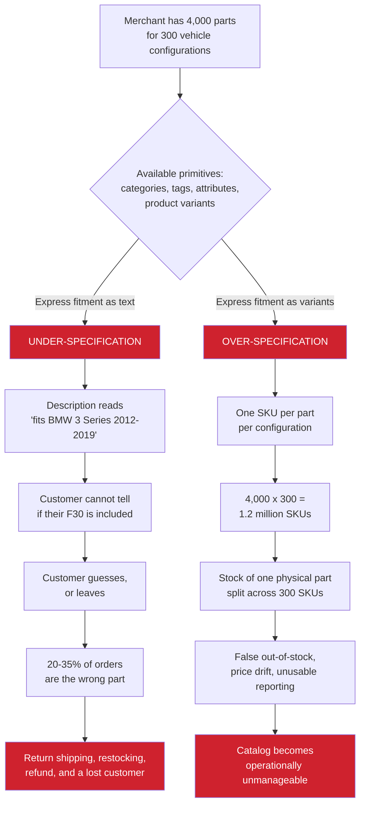
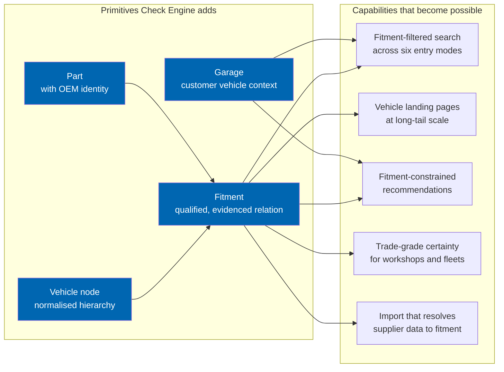
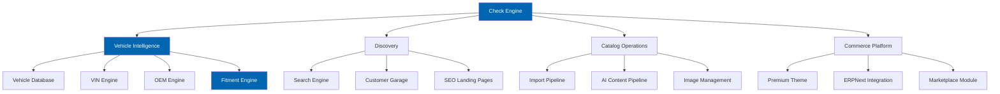
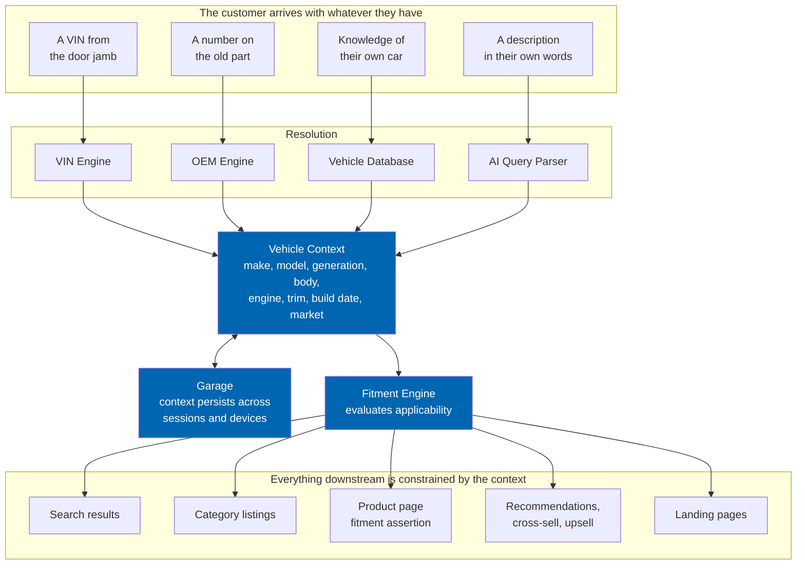
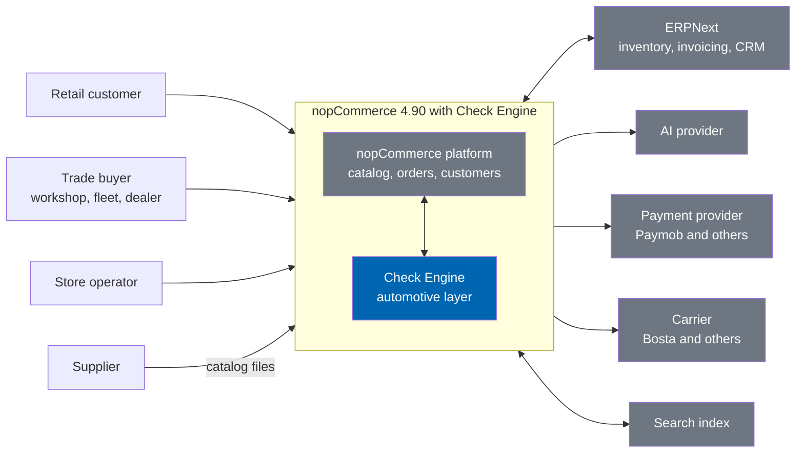

# 00 Vision

> Check Engine exists to make "does this part fit my car?" a question that software answers correctly,
> every time, on any e-commerce storefront.

**Status:** Review · **Owner:** Product Owner · **Last revised:** 2026-07-28

---

## Contents

- [Executive Summary](#executive-summary)
- [Objectives](#objectives)
- [Scope](#scope)
- [Detailed Specifications](#detailed-specifications)
  - [The problem thesis](#the-problem-thesis)
  - [Why general-purpose commerce fails at fitment](#why-general-purpose-commerce-fails-at-fitment)
  - [The product thesis](#the-product-thesis)
  - [Design principles](#design-principles)
  - [Product pillars](#product-pillars)
  - [Positioning](#positioning)
  - [The brand-agnostic principle](#the-brand-agnostic-principle)
  - [Strategic bets](#strategic-bets)
- [Architecture](#architecture)
- [Success measures](#success-measures)
- [User Stories](#user-stories)
- [Acceptance Criteria](#acceptance-criteria)
- [Future Enhancements](#future-enhancements)
- [References](#references)

---

## Executive Summary

Automotive parts retail is a category where the catalog, not the storefront, decides whether a business
succeeds. A customer who buys a shirt in the wrong size returns it and tries again. A customer who buys
the wrong water pump has an immobilised vehicle, a workshop bay occupied by a car that cannot be
finished, and a merchant who has paid to ship a part twice and earned nothing. Industry return rates in
unassisted online auto parts retail run at roughly a fifth to a third of orders, and the dominant cause
is not defect or damage — it is fitment error.

**Check Engine is an enterprise-grade automotive commerce platform delivered as a commercial plugin for
nopCommerce 4.90.** It adds the three capabilities that general-purpose e-commerce platforms
structurally lack: a normalised vehicle database, a fitment engine that can substantiate every
compatibility claim it makes, and a set of entry points — VIN, OEM number, vehicle tree, and natural
language — that let a customer arrive with whatever identifier they happen to have and still reach the
right part.

Four things a reader should take from this document:

1. **Fitment is a relation, not an attribute.** Every architectural decision in the product follows from
   modelling applicability as a first-class, qualified, evidenced relationship between a part and a
   vehicle configuration. Platforms that treat fitment as a category, a tag, or a text field fail in one
   of two predictable ways, described below.
2. **The catalog is the product.** Check Engine's value is not the storefront; it is the correctness of
   the data behind it. This is why the import pipeline is launch-critical rather than a convenience, and
   why every fitment claim carries a confidence score and a provenance record.
3. **Brand-agnostic from the first line of code.** BMW is the first dataset, never a special case. Any
   schema, rule, or algorithm that cannot express a second manufacturer is rejected at review. The
   addressable market is every vehicle brand; a product that hardcodes one has capped itself.
4. **AI augments, never authorises.** AI accelerates catalog enrichment, translation, and search
   comprehension. It does not publish a compatibility claim to a customer without human review, because
   a confidently wrong fitment is worse than no answer.

Check Engine targets automotive importers, distributors, dealers, parts retailers, workshops, service
centres, fleet operators, and marketplace operators — organisations for whom the catalog is an
operational asset rather than a marketing surface.

---

## Objectives

Each objective is measurable and traces to a business requirement in
[01 Business Requirements](01-business-requirements.md).

| # | Objective | Measure | Traces to |
|---|---|---|---|
| 1 | Eliminate fitment-driven returns as the dominant return cause | Fitment-attributed return rate below 5% of orders placed through a resolved vehicle context, against a category baseline of 20–35% | `BR-001`, `BR-004` |
| 2 | Make vehicle identification effortless regardless of what the customer knows | A customer reaches a correctly filtered catalog from a VIN, an OEM number, a vehicle tree selection, or a free-text description, in three interactions or fewer | `BR-002`, `BR-005` |
| 3 | Substantiate every compatibility claim | 100% of published fitment claims carry a confidence score and a provenance record; no claim below the publication threshold is customer-visible without human review | `BR-003`, `BR-011` |
| 4 | Make catalog acquisition tractable | A supplier catalog of 10,000 line items in PDF, Excel, or CSV form reaches published, reviewed state without manual per-item data entry | `BR-006`, `BR-018` |
| 5 | Support any vehicle brand without code change | Adding a manufacturer requires data and, where VIN decoding is needed, a decoder implementation — never a change to core schema or logic | `BR-007`, `BR-025` |
| 6 | Serve Arabic and English as equals | Both languages fully supported in RTL and LTR, with no feature available in only one; automotive terminology governed by a controlled vocabulary rather than free translation | `BR-008`, `BR-030` |
| 7 | Integrate with the systems operators already run | Bi-directional ERPNext synchronisation across products, inventory, customers, orders, invoices, returns, shipments, and CRM, reconciling without manual intervention | `BR-009`, `BR-032` |
| 8 | Remain a plugin, never a fork | Zero modifications to nopCommerce core; installable and removable on a stock instance with no residue | `BR-010`, `BR-036` |
| 9 | Meet performance expectations at real catalog scale | Search and fitment evaluation within the budgets in [03](03-non-functional-requirements.md) against a reference catalog of 250,000 parts and 40,000 vehicle configurations | `BR-012`, `BR-034` |
| 10 | Own the data asset | No licensed third-party fitment feed required for operation, removing per-seat data cost and redistribution restriction | `BR-013`, `BR-041` |

---

## Scope

### In scope

This document defines the product's reason to exist, its positioning, its design principles, and how its
success is measured. It is the root of the traceability chain: every business requirement descends from
an objective stated here.

### Out of scope

| Not covered here | Where it lives |
|---|---|
| Enumerated business requirements | [01 Business Requirements](01-business-requirements.md) |
| Functional behaviour | [02 Functional Requirements](02-functional-requirements.md) |
| Quality attributes and budgets | [03 Non-Functional Requirements](03-non-functional-requirements.md) |
| Competitor assessment | [04 Competitive Analysis](04-competitive-analysis.md) |
| Pricing, packaging, and segment prioritisation | [05 Product Strategy](05-product-strategy.md), [44 Commercial Strategy](44-commercial-strategy.md) |
| Technical structure | [08 System Architecture](08-system-architecture.md), [09 Plugin Architecture](09-plugin-architecture.md) |
| Delivery sequence | [ROADMAP.md](../ROADMAP.md), [41 Release Plan](41-release-plan.md) |

### Assumptions

| # | Assumption | If it proves false |
|---|---|---|
| A1 | nopCommerce remains an actively maintained platform with a viable commercial plugin marketplace | The core domain layer carries no platform dependency (`ADR-007`), making a port to another host feasible without rewriting the automotive engines |
| A2 | Target operators already hold or can obtain supplier catalogs in digital form | The import pipeline supports PDF as a first-class input precisely because many supplier catalogs are not structured data |
| A3 | Curated fitment data can reach commercially acceptable accuracy through AI enrichment under human review | `RISK-01`. Mitigated by confidence scoring, provenance, mandatory review below threshold, and a customer correction loop |
| A4 | AI provider APIs remain commercially available at costs proportionate to the value generated | `RISK-05`. Mitigated by a provider abstraction with multiple implementations, hard spend ceilings, and full functionality with AI disabled |
| A5 | Operators accept a plugin rather than demanding a hosted service at launch | The SaaS horizon exists ([49](49-saas-roadmap.md)) but is deliberately not v1.0 |

### Dependencies

| Dependency | Nature | Managed in |
|---|---|---|
| nopCommerce 4.90.6 | Host platform | [32 Deployment](32-deployment.md) |
| .NET 9, moving to .NET 10 | Runtime, gated by the platform | [ROADMAP.md](../ROADMAP.md#the-net-10-milestone) |
| SQL Server 2019+ | Data store | [10 Database Design](10-database-design.md) |
| AI provider, optional | Enrichment and semantic search | [17 AI Architecture](17-ai-architecture.md) |
| ERPNext, optional | Back-office synchronisation | [18 ERPNext Integration](18-erpnext-integration.md) |
| Platform upgrade 4.60 → 4.90 | Prerequisite work in the host tree | [ROADMAP.md](../ROADMAP.md#horizon-0--platform-upgrade) |

---

## Detailed Specifications

### The problem thesis

Selling automotive parts is not selling products. It is answering one question, repeatedly and
correctly: **does this part fit my car?**

Every commercially significant behaviour in an auto parts business descends from that question. Search
is fitment-filtered browsing. A category page is a fitment-filtered list. A product page is a fitment
assertion with a price attached. A recommendation is only a recommendation if it also fits. Returns are
overwhelmingly fitment failures. Customer trust is the accumulated record of fitment claims that turned
out to be true.

The question is harder than it appears, for reasons intrinsic to the domain rather than to any
particular implementation.

**A vehicle is not a model.** "BMW 3 Series" identifies nothing precise enough to order a part against.
The relevant unit is a configuration: make, model, generation, body style, engine, transmission, drive
type, steering side, market region, and production window. A BMW F30 320i built in February 2015 and one
built in September 2015 straddle a facelift and take different parts for several systems.

**A part number is not an identity.** The same physical component carries a manufacturer number, one or
more supplier numbers, several aftermarket equivalents, and a supersession history in which newer
numbers replace older ones. `11-51-7-586-925`, `11517586925`, and `11 51 7 586 925` are one number
written three ways. Two manufacturers may independently use the same digits for unrelated parts.

**Applicability is qualified, not binary.** A part fits a vehicle *given* conditions: within a date
range, for left-hand drive only, for the European market, when the vehicle has a particular option code,
or up to a chassis number. Discarding the qualifiers to get a simple yes-or-no answer is the mechanism
by which wrong parts get sold.

**The customer usually does not know what they need.** They know a symptom, a photograph, a chassis
number on a door jamb, or a number scratched onto the old part. The entry point cannot be assumed.

### Why general-purpose commerce fails at fitment

A general-purpose platform models a product as an item with attributes. An automotive catalog needs a
part with *applicability* — a many-to-many, qualified, evidenced relation to vehicle configurations.
nopCommerce, Shopify, WooCommerce, and Magento have no primitive for this. Stores that attempt it with
the primitives available converge on one of two failure modes.

Both failure modes are structural. They are not the result of a merchant configuring the platform badly;
they are what happens when a domain requiring a relation is expressed with tools that offer only
attributes and hierarchies.

Three secondary consequences follow, and they are the ones that quietly cap a business:

| Consequence | Mechanism |
|---|---|
| **Search cannot be trusted** | Keyword search over free-text fitment returns parts that mention a model but do not fit it. Adding filters does not help, because the filter has nothing structured to filter on |
| **SEO opportunity is unreachable** | The high-intent long tail — "F30 320i water pump", "E90 front bumper" — requires a page per vehicle-and-part intersection. Without a fitment relation there is nothing from which to generate those pages |
| **Trade customers are unservable** | A workshop ordering against a customer's vehicle needs certainty, not a description to interpret. Losing trade custom removes the highest-value, highest-frequency segment |

### The product thesis

Check Engine's thesis is that **fitment correctness is a platform capability, not a merchandising
practice** — and that once it exists as a first-class relation, every other automotive commerce feature
becomes straightforward to build on top of it.

The product introduces four primitives that nopCommerce does not have, and then rebuilds the customer
experience on them.

The fitment relation is the load-bearing element. Its specification is in
[15 Fitment Engine](15-fitment-engine.md), and it is deliberately the most rigorous document in the set.

### Design principles

Nine principles. Each is a constraint that has been used to reject a design, not an aspiration.

| # | Principle | What it forbids |
|---|---|---|
| 1 | **Fitment claims carry evidence** | Publishing a compatibility assertion with no recorded source. Every claim states where it came from and how confident the system is. Without this, a wrong claim cannot be traced, corrected, or defended |
| 2 | **Brand-agnostic by construction** | Any conditional on a manufacturer name in logic. BMW-specific behaviour lives in data and in pluggable decoders, never in core code |
| 3 | **Qualifiers are never discarded** | Simplifying a qualified fitment into a binary yes. If the system cannot evaluate a qualifier, it lowers confidence rather than dropping the constraint |
| 4 | **AI proposes, humans dispose** | Any path by which AI-generated compatibility or customer-visible content publishes without a review opportunity. AI output enters as a candidate, not a fact |
| 5 | **Degrade, never fail** | A hard dependency on an optional service. With the AI provider unreachable, search falls back to deterministic modes. With ERPNext down, orders still complete. With the licence server unreachable, the store keeps trading |
| 6 | **The plugin never forks the platform** | Modifying nopCommerce core, patching platform assemblies, or depending on internals. Integration is through documented extension points only |
| 7 | **Both languages are first-class** | A feature that works in English and is "coming soon" in Arabic. RTL is a layout constraint applied throughout, not a stylesheet appended at the end |
| 8 | **Performance is specified before it is built** | Adding a query path without a budget and an index. Budgets are defined in [03](03-non-functional-requirements.md) and measured against a reference dataset, not against a developer's test rows |
| 9 | **Safety-critical categories get no shortcuts** | Any configuration that allows low-confidence fitment to auto-publish for braking, steering, suspension, or restraint components. There is no toggle for this |

### Product pillars

Eleven modules, grouped into four pillars. The pillar structure is how the product is explained
commercially; the module structure is how it is built.

| Pillar | Modules | Commercial argument |
|---|---|---|
| **Vehicle Intelligence** | [12](12-vehicle-database.md) [13](13-vin-engine.md) [14](14-oem-engine.md) [15](15-fitment-engine.md) | The part that cannot be bought elsewhere as a plugin. Everything else is table stakes; this is the product |
| **Discovery** | [16](16-search-engine.md) [20](20-customer-garage.md) [27](27-seo-strategy.md) | Converts correctness into revenue. Correct data nobody can find earns nothing |
| **Catalog Operations** | [24](24-product-import-pipeline.md) [25](25-ai-content-pipeline.md) [26](26-image-management.md) | Determines time-to-launch. A merchant who cannot populate a catalog never opens |
| **Commerce Platform** | [21](21-theme-design.md) [18](18-erpnext-integration.md) [19](19-marketplace-module.md) | Makes the product operable as a business rather than a database |

### Positioning

**For** automotive parts sellers who need fitment certainty,
**who are** underserved by general-purpose e-commerce platforms and priced out of enterprise automotive
suites,
**Check Engine is** a commercial automotive commerce platform for nopCommerce
**that** provides vehicle-aware catalog, VIN decoding, OEM cross-referencing, and evidenced fitment as
native platform capabilities,
**unlike** custom development, which is expensive and unmaintainable, or licensed automotive suites,
which impose per-seat data costs and closed ecosystems,
**Check Engine** delivers the automotive layer as an installable, self-hosted, own-your-data product on a
platform the operator already controls.

The competitive landscape supporting this statement is assessed in
[04 Competitive Analysis](04-competitive-analysis.md), and the positioning is developed into segment
strategy in [05 Product Strategy](05-product-strategy.md).

### The brand-agnostic principle

Check Engine launches with BMW data. It is not a BMW product. The distinction is architectural and is
enforced at code review.

| Aspect | Rule |
|---|---|
| Schema | Contains no manufacturer-specific column, table, or enumeration. A manufacturer is a row |
| Logic | Contains no conditional on manufacturer identity. A contribution with `if (make == "BMW")` is rejected without further review |
| VIN decoding | The 17-character length, the first three characters as World Manufacturer Identifier, and the check-digit position are standardised. Everything else is manufacturer-specific and lives in a pluggable decoder |
| Vehicle hierarchy | Depth and terminology vary by manufacturer. The hierarchy is configurable per manufacturer rather than fixed to BMW's generation-code convention |
| Terminology | The controlled vocabulary maps manufacturer-specific terms to canonical concepts, so that "E90", "F30", and "G20" are generation codes without the schema knowing what a generation code is |

The intended expansion sequence is BMW, then MINI — which shares platform architecture and therefore
validates the hierarchy — then Mercedes-Benz, Audi, Volkswagen, and Porsche, then the Japanese and Korean
manufacturers, then Land Rover and Volvo. The sequence is commercial rather than technical; the schema
supports any of them from v1.0. Rationale in [05 Product Strategy](05-product-strategy.md).

### Strategic bets

Four bets the product makes. Each could be wrong, and each has a stated consequence if it is.

| Bet | Reasoning | If wrong |
|---|---|---|
| **Own the data rather than license it** (`ADR-003`) | Removes per-seat cost and redistribution restriction, making the catalog an appreciating asset and the SaaS horizon viable | Curation proves too slow or inaccurate. `RISK-01` and `RISK-02`. Fallback: import connectors already exist for operators who hold their own licensed feed |
| **nopCommerce as the host** | A mature .NET platform with a commercial marketplace, self-hosting, and an installed base of operators who already control their infrastructure | Platform decline. Mitigated by `ADR-007`: the domain layer has no platform dependency, so the engines port without rewriting |
| **AI for enrichment, not for authority** (`ADR-008`) | Enrichment is where AI's economics are compelling — thousands of descriptions and translations at marginal cost. Authority is where its failure mode is unacceptable | AI proves insufficiently accurate even for reviewed enrichment. The pipeline works with AI disabled; enrichment reverts to human, slower and costlier but functional |
| **Market-agnostic core with regional plugins** (`ADR-004`) | Keeps the addressable market global while still serving a specific launch region well | Regional requirements prove too deeply entangled to isolate. Would force per-region builds; mitigated by keeping payment and shipping in separate plugins from the outset |

---

## Architecture

Vision-level view only. The technical architecture is specified in
[08 System Architecture](08-system-architecture.md) and [09 Plugin Architecture](09-plugin-architecture.md).

### The resolution path

Every customer interaction with Check Engine follows the same shape: an identifier of unknown type
arrives, is resolved into a vehicle context, and that context constrains everything the customer
subsequently sees. This diagram is the product in one picture.

Two properties of this design matter commercially. First, the entry point is interchangeable — the
customer is never told "you need your VIN" or "please select your model", because any identifier they
have is sufficient. Second, the context is persistent: once resolved, it becomes a garage entry, which
converts a single successful transaction into a returning customer whose subsequent visits start already
filtered.

### System context

### Rejected alternatives

Recorded because the reasons remain relevant and the questions recur.

| Alternative | Rejected because |
|---|---|
| **A standalone automotive commerce application** | Rebuilds cart, checkout, tax, shipping, promotions, and customer management — years of work with no differentiation — and forces operators to migrate off a working platform |
| **A hosted SaaS-only product from v1.0** | Target operators are importers and distributors with existing infrastructure, ERP integration requirements, and data-residency preferences. Self-hosted is the shorter path to the first customers. SaaS remains Horizon 5 |
| **Licensing a third-party fitment feed** | Per-seat cost scales against the operator's margin, redistribution restrictions block the data-services and SaaS horizons, and the catalog becomes rented rather than owned. Recorded as `ADR-003`. Import connectors serve operators who hold their own licence |
| **Fitment as nopCommerce product attributes** | The over-specification failure mode. Attribute combinations multiply into an unmanageable catalog and cannot express date windows or qualifiers |
| **Fitment as category hierarchy** | The under-specification failure mode. Categories cannot express a many-to-many qualified relation, and the tree becomes unnavigable past a few hundred configurations |
| **AI as the primary fitment source** | AI infers plausible compatibility, which for safety-critical components is precisely the wrong property. AI contributes low-confidence candidates for human review — see principle 4 and `ADR-008` |
| **Separate plugins per module** | Fragments a single coherent product across a dozen marketplace listings, multiplies version-compatibility combinations, and makes the fitment engine — which every module depends on — a shared dependency nightmare. Recorded as `ADR-005` |
| **Targeting nopCommerce 4.30 as originally specified** | 4.30 runs on .NET Core 3.1, out of support since December 2022. Launching a commercial product on an unpatched runtime is indefensible and disqualifies the product from customers with security review requirements. Recorded as `ADR-001` |

---

## Success measures

Measured from first production deployment. Instrumentation is specified in
[30 Analytics](30-analytics.md); these are the measures the product is judged by, not a full metric
inventory.

### Product correctness

| Measure | Target | Why this measure |
|---|---|---|
| Fitment-attributed return rate | Below 5% of orders placed through a resolved vehicle context | The single measure that validates the product thesis |
| Published claims with provenance | 100% | Principle 1. Anything below 100% means unauditable claims exist |
| Claims published below confidence threshold without review | 0 | Principle 4 and principle 9. A non-zero value is a defect, not a metric |
| VIN decode success rate, supported manufacturers | Above 95% to configuration level | Below this, the highest-value entry point is unreliable |
| Customer-reported fitment corrections upheld | Tracked as an accuracy signal, trending down | Rising corrections indicate curation quality regression |

### Customer experience

| Measure | Target |
|---|---|
| Interactions from arrival to correctly filtered catalog | 3 or fewer |
| Search result relevance, benchmark query set | Above 90% precision at rank 10 |
| Garage adoption among returning customers | Above 40% |
| Conversion rate, vehicle context resolved versus not | 2× or better |
| Core Web Vitals, mid-range mobile on throttled connection | All three metrics in the "good" band |

### Operator outcomes

| Measure | Target |
|---|---|
| Time from supplier file to published catalog, 10,000 items | Under 5 working days including review |
| Manual data entry per imported item | Zero for items matched with sufficient confidence |
| ERPNext reconciliation exceptions requiring manual intervention | Below 0.5% of transactions |
| AI cost per enriched product | Within the per-feature ceiling in [17](17-ai-architecture.md) |

### Commercial

| Measure | Horizon | Target |
|---|---|---|
| Production deployments | 1 | Reference customers operating end to end |
| Licence renewal rate | 2 | Above 85% |
| Suppliers onboarded per marketplace deployment | 3 | Growth without proportional operator effort |
| Manufacturers supported | 4 | Six or more, none requiring core code change |
| Revenue concentration | 4 | No single customer above 20% |

Full commercial modelling is in [44 Commercial Strategy](44-commercial-strategy.md).

---

## User Stories

Vision-level stories. They express the product's purpose rather than implementable increments; each
decomposes into module stories in [39 User Stories](39-user-stories.md).

| ID | As a… | I want… | So that… | Points | Priority |
|---|---|---|---|---|---|
| `US-001` | Vehicle owner | to find parts that are certain to fit my exact car | I do not waste money and time on the wrong part | 13 | Must |
| `US-002` | Vehicle owner | to use my VIN instead of describing my car | I do not have to know my model code, engine variant, or build date | 8 | Must |
| `US-003` | Workshop technician | to order against a customer's vehicle with certainty | the job completes on the first attempt and the bay is not blocked | 13 | Must |
| `US-004` | Store operator | to publish a supplier catalog without entering data by hand | I can open for business in days rather than months | 21 | Must |
| `US-005` | Store operator | to see the evidence behind every compatibility claim | I can defend the claim to a customer and correct it when it is wrong | 8 | Must |
| `US-006` | Store operator | to add a new vehicle brand without a code change | my catalog can grow with my business | 8 | Must |
| `US-007` | Arabic-speaking customer | to use the store fully in Arabic | I am not a second-class customer of my own local retailer | 13 | Must |
| `US-008` | Store operator | to keep the store and ERPNext in agreement automatically | I do not maintain two systems by hand | 21 | Must |
| `US-009` | Marketplace operator | to onboard suppliers who list and sell independently | the catalog grows without proportional effort from me | 21 | Should |
| `US-010` | Fleet manager | to plan maintenance across my vehicle register | I control cost and avoid unplanned downtime | 13 | Could |

---

## Acceptance Criteria

Vision-level criteria. Each is testable, and each governs a whole capability rather than a single
behaviour. Module-level criteria are in [40 Acceptance Criteria](40-acceptance-criteria.md).

**`AC-001.1`** — Fitment certainty
Given a customer with a resolved vehicle context, when they browse any catalog surface — search results,
category listing, landing page, or recommendation — then every part shown is applicable to that vehicle,
and no part that is not applicable appears.

**`AC-001.2`** — Claim substantiation
Given any published fitment claim, when an operator inspects it in the administration area, then a
confidence score and a provenance record identifying its source are present.

**`AC-001.3`** — Review enforcement
Given a fitment claim with confidence below the publication threshold, when the system attempts to
publish it, then publication is prevented and the claim enters the review queue; and given a claim in a
safety-critical category, then no configuration setting permits bypassing this.

**`AC-002.1`** — Interchangeable entry points
Given a customer with only a VIN, only an OEM number, only knowledge of their vehicle, or only a
free-text description, when they use that identifier, then each path reaches a correctly filtered catalog
in three interactions or fewer.

**`AC-002.2`** — Context persistence
Given a customer who has resolved a vehicle context, when they return in a later session or on another
device while signed in, then the context is available from their garage without re-resolution.

**`AC-004.1`** — Catalog acquisition
Given a supplier catalog of 10,000 line items supplied as PDF, Excel, or CSV, when it is processed
through the import pipeline, then items matched with sufficient confidence require no manual data entry,
and items below threshold are queued for review with the specific ambiguity identified.

**`AC-006.1`** — Brand agnosticism
Given a manufacturer not previously supported, when it is added to the system, then no change to core
schema or logic is required; a VIN decoder implementation is required only if VIN decoding is wanted for
that manufacturer.

**`AC-007.1`** — Language parity
Given the store configured for Arabic, when a customer uses any feature available in English, then it is
available and fully functional in Arabic, rendered correctly right-to-left with no layout defect.

**`AC-008.1`** — Graceful degradation
Given the AI provider, ERPNext, or the licence validation service is unreachable, when a customer
browses, searches, and places an order, then the transaction completes successfully using deterministic
fallbacks, and the degradation is recorded in the operator's log.

**`AC-010.1`** — Platform integrity
Given a stock nopCommerce 4.90.6 instance, when Check Engine is installed and subsequently uninstalled,
then no nopCommerce core file has been modified and no Check Engine schema, setting, or resource remains.

---

## Future Enhancements

Deliberately deferred. Each is assigned a horizon from [ROADMAP.md](../ROADMAP.md).

| Enhancement | Horizon | Why deferred |
|---|---|---|
| AI natural-language search and semantic retrieval | 2 | Requires trustworthy fitment data underneath. AI search over unverified fitment produces confident wrong answers |
| AI customer assistant | 2 | Depends on a grounded, reviewed catalog to answer from |
| Marketplace multi-supplier operation | 3 | Multiplies every unsolved single-supplier problem: duplicate detection, competing fitment claims, split orders |
| Workshop, fleet, and dealer portals | 4 | Each serves a distinct segment with its own sales motion; sequencing lets each learn from the last |
| Multi-tenant SaaS | 5 | Requires tenant isolation, metered billing, and a stable API contract |
| Public REST API and webhooks | 5 | A public contract must be versioned and stable before it is published |
| Vehicle data as a service | 5 | Viable only because the catalog is owned rather than licensed (`ADR-003`) |
| Mobile applications | Beyond 5 | Depends on the public API |
| Image recognition for part identification | Beyond 5 | Evaluated in [45](45-future-roadmap.md); accuracy for visually similar components is unproven |
| OBD-II and telematics integration | Not planned | A different product category. Assessed in [45](45-future-roadmap.md) |

---

## References

### Internal

- [README.md](../README.md) — product overview and platform requirements
- [ROADMAP.md](../ROADMAP.md) — delivery horizons and sequencing rationale
- [CHANGELOG.md](../CHANGELOG.md) — decision records `ADR-001` to `ADR-010`
- [01 Business Requirements](01-business-requirements.md) — enumerated requirements and risk register
- [02 Functional Requirements](02-functional-requirements.md) — functional behaviour
- [03 Non-Functional Requirements](03-non-functional-requirements.md) — quality attributes and budgets
- [04 Competitive Analysis](04-competitive-analysis.md) — landscape assessment
- [05 Product Strategy](05-product-strategy.md) — positioning and segment strategy
- [06 Personas](06-personas.md) — user model
- [07 User Journey](07-user-journey.md) — end-to-end journeys
- [08 System Architecture](08-system-architecture.md) — technical structure
- [15 Fitment Engine](15-fitment-engine.md) — the load-bearing specification
- [24 Product Import Pipeline](24-product-import-pipeline.md) — catalog acquisition
- [30 Analytics](30-analytics.md) — measurement instrumentation
- [Appendix](appendix.md) — glossary and architecture decision records

### External

- [nopCommerce release notes](https://www.nopcommerce.com/en/release-notes) — platform version and requirements
- [nopCommerce technology and system requirements](https://docs.nopcommerce.com/en/installation-and-upgrading/technology-and-system-requirements.html) — runtime mapping per platform version
- [.NET support policy](https://dotnet.microsoft.com/en-us/platform/support/policy/dotnet-core) — runtime support windows informing `ADR-001` and `ADR-002`
- ISO 3779 and ISO 4030 — Vehicle Identification Number structure and location, the standardised portion of VIN handling described in [13](13-vin-engine.md)
- Auto Care Association ACES and PIES — the industry fitment and product information standards Check Engine's model is compatible with without depending on
