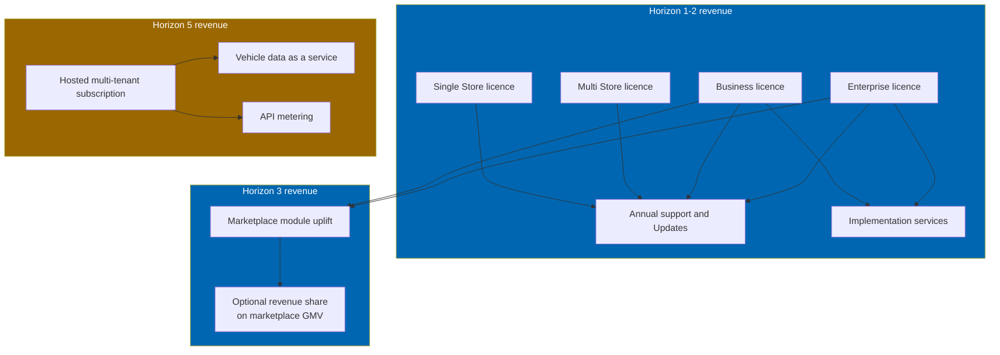
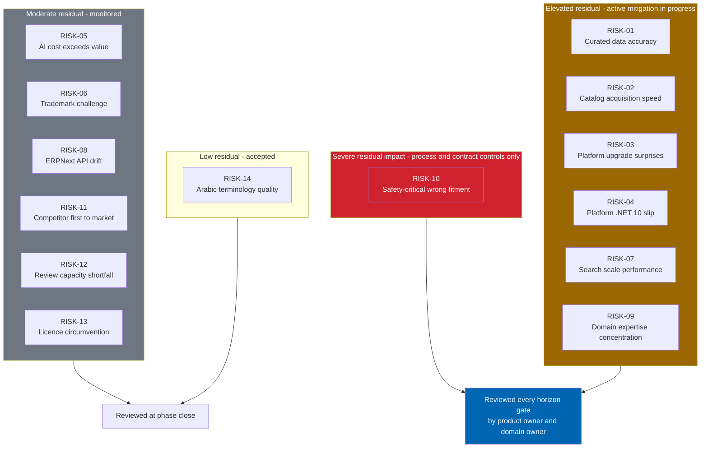
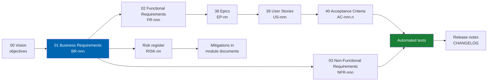

# 01 Business Requirements

> The complete set of business requirements that Check Engine must satisfy, the commercial drivers
> behind them, and the risks that threaten them.

**Status:** Review · **Owner:** Product Owner · **Last revised:** 2026-07-28

**Engineering status (2026-08-25):** Plugin `0.104.0` is in tree. Progress, evidence gates (G1–G6 done; G11 packing partial), and remaining blockers (H1.35/G8, G7, G11 vendor signing, G12) are recorded in [EXECUTION-PLAN.md](../EXECUTION-PLAN.md). This document remains the specification baseline.

---

## Contents

- [Executive Summary](#executive-summary)
- [Objectives](#objectives)
- [Scope](#scope)
- [Detailed Specifications](#detailed-specifications)
  - [Market context](#market-context)
  - [Target customers](#target-customers)
  - [Revenue model](#revenue-model)
  - [Stakeholder map](#stakeholder-map)
  - [Business requirements inventory](#business-requirements-inventory)
  - [Constraints](#constraints)
  - [Assumptions](#assumptions)
  - [Risk register](#risk-register)
- [Architecture](#architecture)
- [User Stories](#user-stories)
- [Acceptance Criteria](#acceptance-criteria)
- [Future Enhancements](#future-enhancements)
- [References](#references)

---

## Executive Summary

This document is the contractual baseline between product intent and engineering delivery. Every
feature, story, and acceptance criterion in the Check Engine specification set traces to a business
requirement stated here. A requirement that does not appear in this document is not a commitment; a
feature that does not satisfy a requirement stated here is not justified.

Forty-two business requirements (`BR-001` through `BR-042`) are organised into eight themes: fitment
correctness, vehicle discovery, catalog operations, platform integrity, language and market reach,
operational integration, commercial viability, and governance. Each requirement carries a priority
(Must / Should / Could), a horizon assignment, and a forward trace to the functional requirements that
implement it.

Fourteen risks (`RISK-01` through `RISK-14`) are tracked with likelihood, impact, owner, and mitigation.
The two risks that dominate the product's fate are curated data accuracy (`RISK-01`) and catalog
acquisition speed (`RISK-02`). Both follow from the strategic decision to own the vehicle and fitment
data rather than license it (`ADR-003`), and both are mitigated by making the import pipeline and the
review workflow launch-critical rather than deferrable.

Three things a reader should take from this document:

1. **Fitment correctness is non-negotiable.** Requirements `BR-001` through `BR-004` are Must-priority
   and have no deferred alternative. A product that ships without them is not Check Engine.
2. **The catalog is an owned asset.** Requirements `BR-013` and `BR-041` encode the decision to curate
   rather than license, and every commercial projection in [44](44-commercial-strategy.md) depends on
   them holding.
3. **Market-agnosticism is a requirement, not an aspiration.** `BR-025` and `BR-026` require that
   regional payment and shipping concerns live outside the core, and that adding a vehicle brand never
   requires a core code change.

---

## Objectives

| # | Objective | Measure | Traces to |
|---|---|---|---|
| 1 | Capture every commercially binding expectation as a numbered, permanent requirement | 100% of Must-priority behaviours in [02](02-functional-requirements.md) trace to a `BR-nnn` here | Traceability chain |
| 2 | Make priority and horizon assignment explicit | Every `BR-nnn` carries Must/Should/Could and a horizon from [ROADMAP.md](../ROADMAP.md) | Delivery planning |
| 3 | Surface the risks that can kill the product before they kill it | Every material risk has an owner, a mitigation, and a residual rating | Risk governance |
| 4 | Ground commercial projections in stated requirements | Pricing, packaging, and segment strategy in [05](05-product-strategy.md) and [44](44-commercial-strategy.md) cite the `BR-nnn` they depend on | Commercial integrity |

---

## Scope

### In scope

- Market context and target customer definition
- Revenue model at the level of business requirements (pricing detail is in [44](44-commercial-strategy.md))
- Stakeholder map and their interest in each requirement theme
- The complete `BR-001`–`BR-042` inventory
- Constraints and assumptions that bound the requirements
- The risk register `RISK-01`–`RISK-14`

### Out of scope

| Not covered here | Where it lives |
|---|---|
| Functional behaviour implementing these requirements | [02 Functional Requirements](02-functional-requirements.md) |
| Quality attributes and measurement methods | [03 Non-Functional Requirements](03-non-functional-requirements.md) |
| Competitive justification | [04 Competitive Analysis](04-competitive-analysis.md) |
| Segment prioritisation and positioning | [05 Product Strategy](05-product-strategy.md) |
| Pricing, packaging, unit economics | [44 Commercial Strategy](44-commercial-strategy.md) |
| Licence tiers and enforcement | [43 Licensing](43-licensing.md), [LICENSE.md](../LICENSE.md) |

### Assumptions

Inherited from [00 Vision](00-vision.md#assumptions) and extended:

| # | Assumption | Sensitivity |
|---|---|---|
| A1 | Target customers currently operate or will adopt nopCommerce | High — the product is a plugin |
| A2 | Supplier catalogs exist in digital form (PDF, Excel, CSV) for the launch segment | High — without them the import pipeline has nothing to ingest |
| A3 | Operators will accept a human review step for low-confidence fitment | Medium — some will want full automation; the product refuses this for safety-critical categories |
| A4 | ERPNext is the dominant ERP in the target operator population, or is acceptable as the integration target | Medium — additional ERP connectors are a future enhancement |
| A5 | Arabic and English cover the launch language requirement; additional languages follow | Low — the localisation architecture accepts more without redesign |

### Dependencies

| Dependency | Required for | Document |
|---|---|---|
| Vision and design principles | Interpreting why requirements exist | [00 Vision](00-vision.md) |
| Platform upgrade to 4.90 | Any implementation | [ROADMAP.md](../ROADMAP.md#horizon-0--platform-upgrade) |
| Decision records ADR-001 through ADR-010 | Understanding which alternatives were rejected | [CHANGELOG.md](../CHANGELOG.md#decisions) |

---

## Detailed Specifications

### Market context

The global automotive aftermarket is a multi-hundred-billion-dollar category. Online parts retail is its
fastest-growing channel and also its least reliable, because the fitment problem that a counter assistant
solves in a physical store has no equivalent on a general-purpose e-commerce platform.

Check Engine addresses a specific gap in that market:

| Segment of the market | Current options | Gap |
|---|---|---|
| Enterprise automotive chains | Closed proprietary suites with licensed data feeds | High cost, locked ecosystem, per-seat data licensing |
| Mid-market importers and distributors | nopCommerce, Shopify, or WooCommerce with improvised fitment | No native fitment primitive; high return rates; unusable for trade |
| Small retailers | Marketplace listing (Amazon, eBay) with platform-provided fitment | No ownership of customer relationship; thin margins; limited brand control |

Check Engine targets the mid-market gap: operators who are too sophisticated for a marketplace listing,
too cost-sensitive for an enterprise suite, and currently making do with a general-purpose platform that
cannot express fitment. The competitive assessment is in [04](04-competitive-analysis.md).

### Target customers

Eight customer types, ordered by Horizon 1 priority. Personas that represent them are in
[06 Personas](06-personas.md).

| Priority | Customer type | Why they buy | Horizon |
|---|---|---|---|
| 1 | Automotive importer / distributor | Owns the catalog, needs a storefront that does not destroy margin through returns | 1 |
| 2 | Auto spare parts retailer | Needs VIN and OEM search to compete with marketplaces | 1 |
| 3 | Multi-brand parts specialist | Needs brand-agnostic fitment across a growing brand set | 1–2 |
| 4 | Workshop / service centre | Needs trade-grade certainty and job-based ordering | 4 (portal), served as retail buyer in 1 |
| 5 | Dealer (independent or franchise) | Needs franchise-aware catalogs and allocation | 4 |
| 6 | Fleet operator | Needs bulk vehicle registers and maintenance forecasting | 4 |
| 7 | Marketplace operator | Needs multi-supplier catalogs and commission | 3 |
| 8 | Regional commerce platform vendor | Needs an automotive vertical to resell | 5 |

### Revenue model

Business-requirement level only. Pricing numbers live in [44](44-commercial-strategy.md).

| Revenue stream | Requirement that enables it | Horizon |
|---|---|---|
| Perpetual or term licence by tier | `BR-037`, `BR-038` | 1 |
| Annual support and Updates | `BR-039` | 1 |
| Implementation and data curation services | `BR-018`, `BR-040` | 1 |
| Marketplace module as a tier uplift | `BR-027` | 3 |
| Hosted SaaS subscription | `BR-042` | 5 |
| Vehicle data licensing to third parties | `BR-013`, `BR-041` | 5 |

The data-ownership decision (`ADR-003`) is what makes the Horizon 5 streams possible. A product that
licenses its fitment data from a third party cannot resell it.

### Stakeholder map

| Stakeholder | Interest | Primary requirements |
|---|---|---|
| Twin Particles product owner | Product-market fit, revenue, defensibility | All; owns priority |
| Twin Particles engineering | Feasible, maintainable, testable delivery | `BR-010`, `BR-012`, `BR-036` |
| Twin Particles commercial | Sellable packaging, clear differentiation | `BR-037`–`BR-042` |
| Store operator (buyer) | Fitment correctness, catalog speed, ERP sync | `BR-001`–`BR-009`, `BR-018` |
| End customer | Right part, first time, in their language | `BR-001`, `BR-002`, `BR-005`, `BR-008` |
| Trade buyer | Certainty, speed, trade pricing | `BR-001`, `BR-003`, `BR-028` |
| Supplier (marketplace) | Fair listing, timely payout | `BR-027` |
| Vehicle manufacturers | Nominative use only; no affiliation implied | `BR-014` |
| nopCommerce Ltd | Compliant marketplace listing; no core fork | `BR-010`, `BR-036` |
| Regulators / data protection authorities | Lawful processing, consumer protection | `BR-015`, `BR-016` |

### Business requirements inventory

Priority values: **Must** (Horizon exit criterion), **Should** (committed within the named horizon),
**Could** (accepted if capacity allows). Horizon values match [ROADMAP.md](../ROADMAP.md).

#### Theme A — Fitment correctness

| ID | Requirement | Priority | Horizon | Traces to |
|---|---|---|---|---|
| `BR-001` | The system shall ensure that every part presented to a customer within a resolved vehicle context is applicable to that vehicle | Must | 1 | `FR-301`–`FR-320` |
| `BR-002` | The system shall accept vehicle identification via VIN, OEM number, vehicle tree selection, category browsing, keyword, and natural-language description | Must | 1 (five modes), 2 (natural language) | `FR-201`–`FR-220`, `FR-401`–`FR-430` |
| `BR-003` | Every published fitment claim shall carry a confidence score and a provenance record identifying its source | Must | 1 | `FR-310`–`FR-315` |
| `BR-004` | Fitment claims below the publication confidence threshold shall not become customer-visible without human review; safety-critical categories shall have no bypass | Must | 1 | `FR-316`–`FR-320` |
| `BR-011` | The system shall support production-date windows, steering side, market region, and option-code qualifiers on fitment claims | Must | 1 | `FR-305`–`FR-309` |
| `BR-014` | Manufacturer names and OEM part numbers shall be used nominatively for identification only; the system shall provide configurable affiliation disclaimers and shall not imply endorsement | Must | 1 | `FR-901`–`FR-905` |

#### Theme B — Vehicle discovery and identity

| ID | Requirement | Priority | Horizon | Traces to |
|---|---|---|---|---|
| `BR-005` | A customer shall reach a correctly filtered catalog from any supported identifier in three interactions or fewer | Must | 1 | `FR-401`–`FR-410` |
| `BR-007` | The vehicle data model shall be brand-agnostic: adding a manufacturer shall require data and optionally a decoder, never a core schema or logic change | Must | 1 | `FR-101`–`FR-130` |
| `BR-020` | The system shall decode a 17-character VIN into a vehicle configuration with a stated confidence level, and shall fail gracefully on unrecognised or invalid VINs | Must | 1 | `FR-201`–`FR-215` |
| `BR-021` | The system shall maintain an OEM part number registry with normalisation, manufacturer qualification, cross-references, aftermarket equivalence, and directed supersession chains | Must | 1 | `FR-220`–`FR-240` |
| `BR-022` | Customers shall be able to save vehicles, VINs, and OEM numbers in a garage that persists across sessions and devices | Must | 1 | `FR-701`–`FR-720` |

#### Theme C — Catalog operations

| ID | Requirement | Priority | Horizon | Traces to |
|---|---|---|---|---|
| `BR-006` | The system shall ingest supplier catalogs from PDF, Excel, and CSV and progress them to a published state through a defined pipeline with human review for low-confidence items | Must | 1 | `FR-601`–`FR-650` |
| `BR-018` | A supplier catalog of 10,000 line items shall be processable to published state within five working days including review, with zero manual data entry for items matched above threshold | Must | 1 | `FR-640`–`FR-650` |
| `BR-019` | The system shall detect duplicate parts across imports and within the existing catalog, and shall support merge and supersession workflows | Must | 1 | `FR-610`–`FR-615` |
| `BR-023` | The system shall generate and manage product images, including placeholders and a workflow for professional replacement | Should | 1 | `FR-660`–`FR-670` |
| `BR-024` | The system shall generate SEO-optimised landing pages for vehicle and part intersections at catalog scale | Must | 1 | `FR-430`–`FR-450` |

#### Theme D — Platform integrity

| ID | Requirement | Priority | Horizon | Traces to |
|---|---|---|---|---|
| `BR-010` | Check Engine shall operate as a nopCommerce plugin through documented extension points and shall not modify platform core source | Must | 1 | `FR-910`–`FR-920` |
| `BR-012` | Search and fitment evaluation shall meet the performance budgets defined in [03](03-non-functional-requirements.md) against the reference catalog | Must | 1 | `NFR-001`–`NFR-015` |
| `BR-036` | The plugin shall install and uninstall cleanly on a stock nopCommerce instance, leaving no orphaned schema, settings, or resources | Must | 1 | `FR-921`–`FR-925` |
| `BR-033` | The system shall be operable in a web farm with shared cache and database, without sticky-session requirements beyond those of the host platform | Should | 1 | `NFR-020`–`NFR-025` |
| `BR-034` | The system shall meet Core Web Vitals targets on a mid-range mobile device over a throttled connection | Must | 1 | `NFR-030`–`NFR-035` |

#### Theme E — Language and market reach

| ID | Requirement | Priority | Horizon | Traces to |
|---|---|---|---|---|
| `BR-008` | Arabic and English shall be fully supported as equals, including RTL and LTR layout, with no feature available in only one language | Must | 1 | `FR-930`–`FR-945` |
| `BR-025` | Adding a vehicle brand shall never require a change to core code; brand-specific behaviour shall live in data and pluggable decoders | Must | 1 | `FR-101`, `FR-210` |
| `BR-026` | Payment and shipping integrations shall be delivered as separate plugins; the core shall function with any nopCommerce payment or shipping provider | Must | 1 | `FR-950`–`FR-955` |
| `BR-030` | Automotive terminology shall be governed by a controlled bilingual vocabulary; free translation of part names is not acceptable | Must | 1 | `FR-940`–`FR-945` |

#### Theme F — Operational integration

| ID | Requirement | Priority | Horizon | Traces to |
|---|---|---|---|---|
| `BR-009` | The system shall synchronise products, inventory, customers, orders, invoices, returns, shipments, and CRM records bi-directionally with ERPNext | Must | 1 | `FR-801`–`FR-830` |
| `BR-032` | ERPNext synchronisation shall reconcile without manual intervention for the normal case, and shall surface exceptions for operator resolution | Must | 1 | `FR-825`–`FR-830` |
| `BR-027` | The system shall support multi-supplier marketplace operation including onboarding, catalog isolation, commissions, and payouts | Should | 3 | `FR-850`–`FR-890` |
| `BR-028` | The system shall support trade buyer experiences including trade pricing, credit terms, and job- or fleet-based ordering | Should | 4 | Portal documents 46–48 |
| `BR-029` | AI features shall be individually configurable, disabled by default, and shall disclose the data each feature transmits before enablement | Must | 2 | `FR-501`–`FR-520` |

#### Theme G — Intelligence

| ID | Requirement | Priority | Horizon | Traces to |
|---|---|---|---|---|
| `BR-031` | AI-generated content and compatibility inferences shall enter as candidates for review and shall never publish directly to customers | Must | 2 | `FR-530`–`FR-550` |
| `BR-035` | AI operating cost shall be observable per feature and bounded by configurable hard ceilings that stop spend rather than degrade silently | Must | 2 | `FR-560`–`FR-570` |
| `BR-017` | Recommendations, cross-sell, and upsell shall be constrained by the active vehicle context; a recommendation that does not fit is a defect | Must | 2 | `FR-580`–`FR-590` |

#### Theme H — Commercial viability and governance

| ID | Requirement | Priority | Horizon | Traces to |
|---|---|---|---|---|
| `BR-013` | The system shall operate without a licensed third-party fitment data feed; vehicle and fitment data shall be curated in-house | Must | 1 | `ADR-003`, [12](12-vehicle-database.md) |
| `BR-015` | The system shall support the operator's obligations under GDPR and comparable regimes, including access, portability, rectification, erasure, and consent management | Must | 1 | `FR-960`–`FR-970` |
| `BR-016` | The system shall maintain an audit trail of administrative actions, fitment publications, and licence-affecting events | Must | 1 | `FR-971`–`FR-980` |
| `BR-037` | The product shall be commercially licensed under a tiered model with enforceable Instance and Store limits | Must | 1 | [43](43-licensing.md) |
| `BR-038` | Licence expiry shall never interrupt commercial storefront operation; administrative and background capabilities may degrade to read-only | Must | 1 | `ADR-009`, [43](43-licensing.md) |
| `BR-039` | An active subscription shall include Updates, security patches, and support at the tier's stated service level | Must | 1 | [43](43-licensing.md) |
| `BR-040` | Twin Particles shall offer implementation and data curation services as a complementary revenue stream, without making them mandatory for product operation | Should | 1 | [44](44-commercial-strategy.md) |
| `BR-041` | The curated vehicle and fitment catalog shall be structured as an owned asset capable of supporting future data-licensing and SaaS revenue | Must | 1 (structure), 5 (monetisation) | `ADR-003`, [49](49-saas-roadmap.md) |
| `BR-042` | The architecture shall not preclude multi-tenant SaaS operation; tenant-isolation concerns shall be considered in schema and configuration design from Horizon 1 | Should | 1 (design), 5 (delivery) | [08](08-system-architecture.md), [49](49-saas-roadmap.md) |

### Constraints

| ID | Constraint | Origin |
|---|---|---|
| C1 | Host platform is nopCommerce 4.90.x on .NET 9 | `ADR-001` |
| C2 | Database is SQL Server 2019 or later (or Azure SQL at S2+) | Platform requirement |
| C3 | No modification of nopCommerce core source | `BR-010`, marketplace eligibility |
| C4 | Payment and shipping are separate plugins | `ADR-005`, `BR-026` |
| C5 | Safety-critical fitment categories cannot auto-publish below threshold | `BR-004`, [LICENSE.md](../LICENSE.md) § 9.4 |
| C6 | Licence validation may not disable the storefront | `ADR-009`, `BR-038` |
| C7 | AI features disabled by default | `ADR-008`, `BR-029` |
| C8 | British English in documentation; both Arabic and English in the product | Editorial and `BR-008` |
| C9 | Identifiers are permanent; withdrawn requirements retain their number | Traceability discipline |
| C10 | .NET 10 retargeting is a scheduled milestone gated by nopCommerce | `ADR-002` |

### Assumptions

See [Scope — Assumptions](#assumptions) above. Assumptions that become false trigger a review of every
requirement that depends on them, recorded as a change in [CHANGELOG.md](../CHANGELOG.md).

### Risk register

Likelihood and impact are scored 1 (low) to 5 (high). Residual is the rating after mitigation.

| ID | Risk | L | I | Residual | Owner | Horizon | Mitigation |
|---|---|---|---|---|---|---|---|
| `RISK-01` | Curated fitment data proves inaccurate at scale, destroying trust and elevating returns | 4 | 5 | 2 | Domain owner | 1 | Confidence scoring, provenance, mandatory review below threshold, customer correction loop, safety-critical hard stop |
| `RISK-02` | Catalog acquisition is slower than projected, delaying launch | 4 | 4 | 2 | Product owner | 1 | Import pipeline is critical-path with dedicated capacity; pilot against a real supplier catalog in documentation Phase 3 |
| `RISK-03` | Platform upgrade 4.60 → 4.90 uncovers unexpected breaking changes | 3 | 4 | 2 | Engineering lead | 0 | Sequential single-hop upgrades with regression gates at each step |
| `RISK-04` | nopCommerce next major slips, stranding the product on unsupported .NET 9 | 3 | 4 | 2 | Architecture owner | 5 | Compatibility branch maintained ahead of the platform; contribution upstream where useful |
| `RISK-05` | AI operating cost exceeds the margin it generates | 3 | 3 | 2 | Product owner | 2 | Hard per-feature spend ceilings, caching, batch processing, measured cost per enriched product; product fully functional with AI disabled |
| `RISK-06` | Trademark challenge over manufacturer name or part number use | 2 | 4 | 2 | Commercial / legal | 1 | Nominative-use discipline, disclaimers on by default, obligations allocated to Licensee in [LICENSE.md](../LICENSE.md) § 10 |
| `RISK-07` | Search or fitment performance degrades at full catalog scale | 3 | 4 | 2 | Performance owner | 1 | Budgets defined before build; load testing against reference dataset from Phase 3; indexes specified with every query path |
| `RISK-08` | ERPNext API changes break synchronisation | 3 | 3 | 2 | Integration owner | 1 | Version-pinned client, contract tests against a pinned ERPNext instance |
| `RISK-09` | Key automotive domain expertise is concentrated in too few people | 3 | 4 | 2 | Product owner | 1 | Documentation of domain rules in [12](12-vehicle-database.md)–[15](15-fitment-engine.md); cross-training; glossary in [Appendix](appendix.md) |
| `RISK-10` | A safety-critical wrong-fitment incident causes injury and legal exposure | 2 | 5 | 1 | Domain owner | 1 | Hard stop on auto-publish for safety-critical categories; liability allocation in [LICENSE.md](../LICENSE.md) § 9.3–9.4 and § 16.3; operator verification workflow |
| `RISK-11` | Competitor ships a comparable nopCommerce automotive plugin first | 3 | 3 | 2 | Commercial | 1 | Speed to Horizon 1 exit; differentiation on owned data and evidenced fitment rather than feature count |
| `RISK-12` | Operator cannot staff the human review queue, leaving catalog unpublished | 3 | 3 | 2 | Product owner | 1 | Review tooling optimised for throughput; Twin Particles curation services as optional capacity (`BR-040`) |
| `RISK-13` | Licence entitlement circumvention becomes widespread | 2 | 3 | 2 | Engineering | 1 | Signed keys, instance fingerprinting, graceful degradation rather than punitive disable (`BR-038` reduces incentive to crack) |
| `RISK-14` | Arabic localisation quality is insufficient for automotive terminology | 3 | 3 | 1 | Localisation owner | 1 | Controlled vocabulary, native-speaker review gate, bilingual acceptance criteria on every UI story |

`RISK-10` sits alone in the high-impact band even after mitigation. That is intentional. The residual
likelihood is driven as low as the product can drive it; the impact of a safety-critical incident cannot
be reduced by software, only by process and by contractual allocation. Both are in place.

---

## Architecture

Requirements do not have a runtime architecture, but they have a **traceability architecture** that
determines how they flow into delivery.

CI validates that every Must-priority `BR` has at least one `FR`, every `FR` has at least one `US`,
every `US` has at least one `AC`, and every `AC` has at least one test. A broken link fails the build.
Specified in [33 CI-CD](33-ci-cd.md).

### Requirement state machine

| State | Meaning | Who moves it |
|---|---|---|
| Proposed | Drafted, not yet approved | Author |
| Approved | Accepted into the baseline | Product owner |
| Implemented | All tracing `FR`s are implemented | Engineering |
| Verified | All tracing `AC`s pass in a release candidate | QA |
| Withdrawn | Removed from commitment; number retired | Product owner, with changelog entry |

---

## User Stories

Business-requirement-level stories. These are the commitments the business makes to itself; module
stories in [39](39-user-stories.md) decompose them.

| ID | As a… | I want… | So that… | Priority |
|---|---|---|---|---|
| `US-011` | Product owner | every Must requirement to be testable and traced | I can refuse a release that does not satisfy them | Must |
| `US-012` | Engineering lead | requirements to be stable and permanently identified | a two-year-old commit still explains itself | Must |
| `US-013` | Commercial lead | the data-ownership decision to be encoded as a requirement | future data-licensing revenue is not accidentally designed away | Must |
| `US-014` | Domain owner | safety-critical auto-publish to be impossible | a configuration mistake cannot create a physical-harm exposure | Must |
| `US-015` | Operator | licence expiry not to take my store offline | I am not held hostage by a billing dispute | Must |

---

## Acceptance Criteria

**`AC-011.1`** — Completeness of Must coverage
Given the set of Must-priority `BR-nnn` in this document, when the Horizon 1 release candidate is
evaluated, then every Must-priority requirement assigned to Horizon 1 has at least one verified
acceptance criterion.

**`AC-011.2`** — Traceability integrity
Given any Must-priority `BR-nnn`, when the traceability graph is validated, then a path exists from that
requirement through `FR` → `EP` → `US` → `AC` → test.

**`AC-014.1`** — Safety-critical hard stop
Given a fitment claim in a safety-critical category with confidence below threshold, when any actor —
including an administrator — attempts to publish it without completing review, then the system refuses
and records the attempt in the audit log.

**`AC-015.1`** — Licence expiry behaviour
Given a Production Instance whose Subscription Term has expired, when a customer browses and places an
order, then the order completes successfully; and when an administrator opens Check Engine
configuration, then the configuration is read-only.

---

## Future Enhancements

| Enhancement | Horizon | Notes |
|---|---|---|
| Additional language packs beyond Arabic and English | 2+ | Architecture accepts them; vocabulary and review capacity are the constraint |
| Additional ERP connectors (SAP B1, Odoo, Dynamics) | 3+ | ERPNext is the launch target; the sync architecture is provider-agnostic |
| Formal ISO 26262 alignment for safety-critical handling | 4 | Evaluated if fleet and dealer portals create OEM-adjacent liability |
| SOC 2 / ISO 27001 certification of Twin Particles operations | 5 | Required for SaaS enterprise sales; not required for self-hosted plugin sales |

---

## References

### Internal

- [00 Vision](00-vision.md) — product thesis and design principles
- [02 Functional Requirements](02-functional-requirements.md) — forward trace target
- [03 Non-Functional Requirements](03-non-functional-requirements.md) — quality attributes
- [04 Competitive Analysis](04-competitive-analysis.md) — market gap evidence
- [05 Product Strategy](05-product-strategy.md) — segment and positioning
- [06 Personas](06-personas.md) — who the requirements serve
- [ROADMAP.md](../ROADMAP.md) — horizon definitions
- [CHANGELOG.md](../CHANGELOG.md) — decision records
- [LICENSE.md](../LICENSE.md) — contractual allocation of fitment and trademark risk
- [43 Licensing](43-licensing.md) — entitlement and support
- [44 Commercial Strategy](44-commercial-strategy.md) — pricing and packaging

### External

- [nopCommerce marketplace policies](https://www.nopcommerce.com/marketplace) — constraints informing `BR-010` and `BR-036`
- [GDPR](https://gdpr.eu/) — informing `BR-015`
- [OWASP Top Ten](https://owasp.org/www-project-top-ten/) — informing security-related requirements detailed in [03](03-non-functional-requirements.md) and [28](28-security.md)
