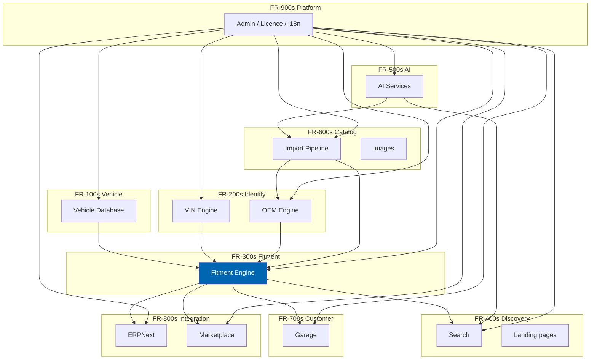

# 02 Functional Requirements

> The complete functional behaviour Check Engine must implement, organised by module, traced to
> business requirements, and identified permanently as `FR-nnn`.

**Status:** Review · **Owner:** Product Owner · **Last revised:** 2026-07-28

**Engineering status (2026-08-25):** Plugin `0.104.0` is in tree. Progress, evidence gates (G1–G6 done; G11 packing partial), and remaining blockers (H1.35/G8, G7, G11 vendor signing, G12) are recorded in [EXECUTION-PLAN.md](../EXECUTION-PLAN.md). This document remains the specification baseline.

---

## Contents

- [Executive Summary](#executive-summary)
- [Objectives](#objectives)
- [Scope](#scope)
- [Detailed Specifications](#detailed-specifications)
  - [Numbering and priority](#numbering-and-priority)
  - [Block 100 — Vehicle Database](#block-100--vehicle-database)
  - [Block 200 — VIN and OEM Engines](#block-200--vin-and-oem-engines)
  - [Block 300 — Fitment Engine](#block-300--fitment-engine)
  - [Block 400 — Search and Discovery](#block-400--search-and-discovery)
  - [Block 500 — AI Services](#block-500--ai-services)
  - [Block 600 — Catalog and Import](#block-600--catalog-and-import)
  - [Block 700 — Garage and Customer](#block-700--garage-and-customer)
  - [Block 800 — Marketplace and ERP](#block-800--marketplace-and-erp)
  - [Block 900 — Administration and Platform](#block-900--administration-and-platform)
  - [Coverage matrix](#coverage-matrix)
- [Architecture](#architecture)
- [User Stories](#user-stories)
- [Acceptance Criteria](#acceptance-criteria)
- [Future Enhancements](#future-enhancements)
- [References](#references)

---

## Executive Summary

This document enumerates **214 functional requirements** across nine module blocks. Each requirement
states a specific, testable behaviour, carries a priority and horizon, and traces to at least one
business requirement in [01](01-business-requirements.md).

The numbering scheme is permanent and blocked by module: 100s vehicle, 200s VIN and OEM, 300s fitment,
400s search, 500s AI, 600s catalog and import, 700s garage and customer, 800s marketplace and ERP, 900s
administration and platform. Numbers are never reused or renumbered.

Three things a reader should take from this document:

1. **Fitment is the densest block.** Block 300 contains the requirements that make the product what it
   is. If capacity forces a cut, cut anywhere else first.
2. **Horizon assignment is explicit.** A requirement marked Horizon 2 is not a Horizon 1 commitment.
   Shipping it early is allowed; treating it as a launch gate is not.
3. **Every Must-priority Horizon 1 requirement is an exit criterion** for [ROADMAP.md](../ROADMAP.md)
   Horizon 1. The release cannot ship with any of them unmet.

Module-level behaviour is specified further in documents 12–20 and 24–26. This document is the inventory
and the traceability spine; those documents are the detailed design.

---

## Objectives

| # | Objective | Measure |
|---|---|---|
| 1 | Specify every Must-priority behaviour to a testable level of detail | Two engineers reading an `FR` independently build the same behaviour |
| 2 | Maintain a complete forward and backward trace | Every `FR` cites a `BR`; every Must `BR` has at least one `FR` |
| 3 | Make horizon and priority unambiguous | No `FR` lacks either field |
| 4 | Prevent scope creep through the identifier discipline | New behaviour requires a new `FR`, which requires product owner approval |

---

## Scope

### In scope

- Functional behaviour of all Check Engine modules
- Administration and platform-integration behaviour
- AI feature behaviour (including the disabled-by-default and review constraints)
- Marketplace and ERP behaviour at the requirement level

### Out of scope

| Not covered here | Where it lives |
|---|---|
| Quality attributes (performance, security, accessibility) | [03](03-non-functional-requirements.md) |
| Algorithm and schema design | Module documents 12–16, 10, 11 |
| UI layout and interaction | [21](21-theme-design.md), [22](22-ui-design-system.md), [23](23-ux-guidelines.md) |
| Exact API contracts | [08](08-system-architecture.md) and module documents |
| Test cases | [35](35-testing-strategy.md), [40](40-acceptance-criteria.md) |

### Assumptions

- Business requirements in [01](01-business-requirements.md) are approved.
- Domain terminology follows the glossary in [Appendix](appendix.md).
- "The system" means the Check Engine plugin operating within a configured nopCommerce 4.90 host.

### Dependencies

| Dependency | Document |
|---|---|
| Business requirements | [01](01-business-requirements.md) |
| Domain model (for precise entity names) | [11](11-domain-model.md) |
| Horizon definitions | [ROADMAP.md](../ROADMAP.md) |

---

## Detailed Specifications

### Numbering and priority

| Field | Values |
|---|---|
| Priority | Must · Should · Could |
| Horizon | 1 · 2 · 3 · 4 · 5 (matching [ROADMAP.md](../ROADMAP.md)) |
| State | Proposed · Approved · Implemented · Verified · Withdrawn |

All requirements in this baseline are in state **Approved** unless marked otherwise.

### Block 100 — Vehicle Database

Traces primarily to `BR-007`, `BR-025`. Detailed design: [12 Vehicle Database](12-vehicle-database.md).

| ID | Requirement | Priority | Horizon | BR |
|---|---|---|---|---|
| `FR-101` | The system shall maintain a hierarchical vehicle taxonomy with levels: Make, Model, Generation, BodyStyle, Engine, Trim | Must | 1 | `BR-007` |
| `FR-102` | Each vehicle node shall have a stable unique identifier, a slug, localised display names (Arabic and English), and an active/inactive flag | Must | 1 | `BR-007` |
| `FR-103` | The hierarchy depth and level names shall be configurable per Make without schema change | Must | 1 | `BR-007`, `BR-025` |
| `FR-104` | A Vehicle Configuration shall be a fully qualified path through the hierarchy plus optional production date range and market region | Must | 1 | `BR-007` |
| `FR-105` | The system shall support querying the hierarchy by any node level and returning child nodes | Must | 1 | `BR-005` |
| `FR-106` | The system shall support searching vehicle nodes by localised name, code, and alias | Must | 1 | `BR-005` |
| `FR-107` | Vehicle nodes shall support multiple aliases (e.g. "3 Series", "3er", "الفئة الثالثة") mapped to one canonical node | Must | 1 | `BR-008`, `BR-030` |
| `FR-108` | The system shall record the provenance of every vehicle node (source, import batch, curator, timestamp) | Must | 1 | `BR-003` |
| `FR-109` | Inactive nodes shall be excluded from customer-facing selection but retained for historical fitment evaluation | Must | 1 | `BR-001` |
| `FR-110` | The system shall prevent deletion of a node that has child nodes or fitment claims; archival shall be used instead | Must | 1 | `BR-003` |
| `FR-111` | Administrators shall be able to create, edit, merge, and archive vehicle nodes through the admin area | Must | 1 | `BR-007` |
| `FR-112` | Merge of two nodes shall reassign all child nodes and fitment claims to the survivor and record the merge in the audit log | Must | 1 | `BR-016` |
| `FR-113` | The system shall expose a read API for the vehicle hierarchy for use by the theme, search, and garage modules | Must | 1 | `BR-005` |
| `FR-114` | Vehicle hierarchy data shall be cacheable with explicit invalidation on mutation | Must | 1 | `BR-012` |
| `FR-115` | The system shall support importing vehicle hierarchy data via the import pipeline | Must | 1 | `BR-006` |
| `FR-116` | Generation codes (e.g. F30, E90) shall be first-class attributes of Generation nodes, not free text | Must | 1 | `BR-007` |
| `FR-117` | Engine nodes shall capture displacement, fuel type, power output, and engine code where known | Should | 1 | `BR-007` |
| `FR-118` | The system shall support market-region tagging on configurations (e.g. ECE, USDM, GCC, JDM) | Must | 1 | `BR-011` |
| `FR-119` | The initial dataset shall include BMW passenger vehicles for generations in current commercial demand in the launch region | Must | 1 | `BR-013` |
| `FR-120` | Adding a new Make shall be achievable by an administrator without a code deployment | Must | 1 | `BR-025` |
| `FR-121` | The system shall validate that a configuration path is complete before it can be used as a fitment target | Must | 1 | `BR-001` |
| `FR-122` | Vehicle nodes shall support an optional external reference key for reconciliation with supplier or ERP identifiers | Should | 1 | `BR-009` |
| `FR-123` | The hierarchy shall support at least 50 Makes, 5,000 Models, and 40,000 fully qualified Configurations at the reference scale | Must | 1 | `BR-012` |
| `FR-124` | Bulk edit operations on vehicle nodes shall be transactional and audited | Should | 1 | `BR-016` |
| `FR-125` | The system shall provide a vehicle hierarchy health report (orphan nodes, incomplete paths, nodes without fitments) | Should | 1 | `BR-003` |
| `FR-126` | Chassis codes and platform codes shall be capturable as attributes without requiring hierarchy changes | Should | 1 | `BR-007` |
| `FR-127` | The system shall support year-range display derived from production windows for customer-facing selectors | Must | 1 | `BR-005` |
| `FR-128` | Customer-facing vehicle selectors shall not expose inactive or empty branches (nodes with no sellable fitments) | Must | 1 | `BR-005` |
| `FR-129` | The vehicle database shall have no dependency on any licensed third-party feed for operation | Must | 1 | `BR-013` |
| `FR-130` | Schema and APIs shall use manufacturer-neutral naming; no manufacturer name shall appear in table, column, or type names | Must | 1 | `BR-025` |

### Block 200 — VIN and OEM Engines

Traces to `BR-002`, `BR-020`, `BR-021`. Detailed design: [13](13-vin-engine.md), [14](14-oem-engine.md).

| ID | Requirement | Priority | Horizon | BR |
|---|---|---|---|---|
| `FR-201` | The system shall accept a 17-character VIN, normalise case and whitespace, and reject inputs that fail length or character-set rules | Must | 1 | `BR-020` |
| `FR-202` | The system shall validate the VIN check digit per ISO 3779 and report check-digit failure distinctly from decode failure | Must | 1 | `BR-020` |
| `FR-203` | The system shall extract WMI, VDS, and VIS segments and resolve WMI to a Make where known | Must | 1 | `BR-020` |
| `FR-204` | VIN decoding beyond WMI shall be performed by a pluggable per-manufacturer decoder; the core shall not contain manufacturer-specific position maps | Must | 1 | `BR-025` |
| `FR-205` | A successful decode shall return a Vehicle Configuration (or a ranked set of candidates) with a confidence score | Must | 1 | `BR-020` |
| `FR-206` | Where a decode yields multiple candidate configurations, the system shall present them for customer disambiguation rather than silently picking one | Must | 1 | `BR-001` |
| `FR-207` | An unrecognised or undecodable VIN shall return a structured failure with a reason code, not an empty success | Must | 1 | `BR-020` |
| `FR-208` | The system shall optionally derive a build date or model year from the VIS where the manufacturer decoder supports it | Must | 1 | `BR-011` |
| `FR-209` | VIN decode results shall be cacheable by normalised VIN for a configurable TTL | Must | 1 | `BR-012` |
| `FR-210` | Administrators shall be able to register, enable, and disable manufacturer VIN decoders without a code deployment to the core | Must | 1 | `BR-025` |
| `FR-211` | The BMW decoder shall be supplied with Horizon 1 and shall resolve to Generation and Engine level for supported WMI ranges | Must | 1 | `BR-020` |
| `FR-212` | VIN decode attempts — success and failure — shall be logged with correlation identifiers and without storing the full VIN in application logs by default | Must | 1 | `BR-015`, `BR-016` |
| `FR-213` | The system shall support masking or hashing VINs in logs and analytics per configuration | Must | 1 | `BR-015` |
| `FR-214` | A decoded VIN shall be attachable to a garage entry and to a fitment evaluation request | Must | 1 | `BR-022` |
| `FR-215` | The public VIN decode API shall be rate-limited per IP and per customer account | Must | 1 | `BR-012` |
| `FR-220` | The system shall maintain an OEM part number registry qualified by manufacturer | Must | 1 | `BR-021` |
| `FR-221` | OEM numbers shall be stored in a normalised form and in their display form; comparison shall use the normalised form | Must | 1 | `BR-021` |
| `FR-222` | Normalisation shall remove separators (spaces, hyphens) and normalise case per configurable rules per manufacturer | Must | 1 | `BR-021` |
| `FR-223` | The system shall support cross-reference relations between OEM numbers (equivalent, replaces, replaced-by, component-of) | Must | 1 | `BR-021` |
| `FR-224` | Supersession chains shall be directed and transitively resolvable; a lookup for a superseded number shall surface the current number | Must | 1 | `BR-021` |
| `FR-225` | Supersession shall never be treated as bidirectional | Must | 1 | `BR-021` |
| `FR-226` | Aftermarket equivalence relations shall record the aftermarket brand and their part number against an OEM number | Must | 1 | `BR-021` |
| `FR-227` | OEM lookup shall accept any of the display variants and resolve to the registry entry | Must | 1 | `BR-002` |
| `FR-228` | OEM numbers are not globally unique; lookups shall require or infer a manufacturer qualifier | Must | 1 | `BR-021` |
| `FR-229` | The system shall link OEM registry entries to nopCommerce products (one OEM to many products, one product to many OEMs) | Must | 1 | `BR-021` |
| `FR-230` | Administrators shall manage OEM entries, cross-references, and supersessions through the admin area | Must | 1 | `BR-021` |
| `FR-231` | OEM data shall carry provenance and be importable via the import pipeline | Must | 1 | `BR-003`, `BR-006` |
| `FR-232` | The system shall detect and flag conflicting cross-references for review | Should | 1 | `BR-003` |
| `FR-233` | OEM search shall be available as a first-class storefront search mode | Must | 1 | `BR-002` |
| `FR-234` | A customer-facing OEM result shall show supersession status when the queried number is not current | Must | 1 | `BR-021` |
| `FR-235` | The OEM registry shall support at least 500,000 entries at the reference scale without breaching lookup budgets | Must | 1 | `BR-012` |
| `FR-236` | Bulk OEM import shall support upsert by normalised number and manufacturer | Must | 1 | `BR-006` |
| `FR-237` | The system shall expose OEM lookup APIs for theme, search, import, and ERP sync | Must | 1 | `BR-009` |
| `FR-238` | Kit and assembly relationships (one OEM number comprising others) shall be representable | Should | 2 | `BR-021` |
| `FR-239` | The system shall support marking OEM numbers as obsolete without deleting historical links | Must | 1 | `BR-021` |
| `FR-240` | OEM display on product pages shall be configurable (show, hide, show-to-trade-only) | Should | 1 | `BR-028` |

### Block 300 — Fitment Engine

Traces to `BR-001`, `BR-003`, `BR-004`, `BR-011`. Detailed design: [15 Fitment Engine](15-fitment-engine.md).

| ID | Requirement | Priority | Horizon | BR |
|---|---|---|---|---|
| `FR-301` | A Fitment Claim shall assert that a Part is applicable to a Vehicle Configuration, with optional qualifiers | Must | 1 | `BR-001` |
| `FR-302` | Fitment evaluation shall return one of: Fits, DoesNotFit, Unknown, NeedsDisambiguation | Must | 1 | `BR-001` |
| `FR-303` | Evaluation against a resolved vehicle context shall exclude DoesNotFit parts from all customer-facing catalog surfaces | Must | 1 | `BR-001` |
| `FR-304` | Unknown results shall be excluded from "verified fit" surfaces and may appear only in explicitly labelled "unverified" surfaces if the operator enables them | Must | 1 | `BR-001` |
| `FR-305` | Qualifiers shall include production date window, steering side, market region, drive type, transmission type, and free-form option codes | Must | 1 | `BR-011` |
| `FR-306` | Where a vehicle context supplies a build date, evaluation shall intersect it with the claim's production window | Must | 1 | `BR-011` |
| `FR-307` | Where a vehicle context lacks a value needed by a qualifier, the engine shall lower confidence rather than discard the qualifier | Must | 1 | `BR-011` |
| `FR-308` | Steering side shall be a first-class qualifier, not a text note | Must | 1 | `BR-011` |
| `FR-309` | Market region shall be a first-class qualifier | Must | 1 | `BR-011` |
| `FR-310` | Every Fitment Claim shall carry a confidence score in a defined range (0.00–1.00) | Must | 1 | `BR-003` |
| `FR-311` | Every Fitment Claim shall carry a provenance record: source type, source reference, creator, created timestamp, last verified timestamp | Must | 1 | `BR-003` |
| `FR-312` | Source types shall include: SupplierCatalog, CuratorManual, AiInference, CustomerReport, VinDecode, ImportedFeed | Must | 1 | `BR-003` |
| `FR-313` | A configurable publication threshold shall determine the minimum confidence for customer-visible claims | Must | 1 | `BR-004` |
| `FR-314` | Claims below threshold shall enter a review queue and shall not be customer-visible | Must | 1 | `BR-004` |
| `FR-315` | Review actions (approve, reject, request more evidence, adjust confidence) shall be audited | Must | 1 | `BR-016` |
| `FR-316` | Safety-critical categories (braking, steering, suspension, restraints/airbags) shall have a hard stop: no configuration may allow below-threshold auto-publish | Must | 1 | `BR-004` |
| `FR-317` | The set of safety-critical categories shall be configurable by an administrator with an elevated permission, and changes shall be audited | Must | 1 | `BR-004` |
| `FR-318` | Customer-reported fitment corrections shall create review items linked to the original claim | Must | 1 | `BR-003` |
| `FR-319` | Approved corrections shall update or supersede the claim and record the correction event | Must | 1 | `BR-003` |
| `FR-320` | The product page shall display fitment status for the active vehicle context: Fits / Does not fit / Unknown / Select your vehicle | Must | 1 | `BR-001` |
| `FR-321` | Fitment evaluation shall be available as a service to search, recommendations, import, and ERP modules | Must | 1 | `BR-001` |
| `FR-322` | Bulk evaluation (part against many vehicles, vehicle against many parts) shall be supported for admin and import use | Must | 1 | `BR-006` |
| `FR-323` | Fitment results shall be cacheable with invalidation on claim mutation or vehicle context change | Must | 1 | `BR-012` |
| `FR-324` | The engine shall not hardcode any manufacturer in evaluation logic | Must | 1 | `BR-025` |
| `FR-325` | Administrators shall create, edit, deactivate, and review claims through the admin area | Must | 1 | `BR-003` |
| `FR-326` | Deactivated claims shall be retained for audit and shall not affect customer-facing evaluation | Must | 1 | `BR-016` |
| `FR-327` | The system shall provide fitment coverage reports (parts without claims, vehicles without parts, low-confidence concentrations) | Should | 1 | `BR-003` |
| `FR-328` | AI-inferred claims shall be created with source type AiInference and confidence capped below the publication threshold by default | Must | 2 | `BR-031` |
| `FR-329` | Fitment claims shall support an optional note field for curator context, never shown as a substitute for structured qualifiers | Should | 1 | `BR-011` |
| `FR-330` | Evaluation latency shall meet the budgets in [03](03-non-functional-requirements.md) | Must | 1 | `BR-012` |

### Block 400 — Search and Discovery

Traces to `BR-002`, `BR-005`, `BR-024`. Detailed design: [16 Search Engine](16-search-engine.md), [27](27-seo-strategy.md).

| ID | Requirement | Priority | Horizon | BR |
|---|---|---|---|---|
| `FR-401` | The system shall provide a unified search entry point accepting VIN, OEM, keyword, and natural-language input and routing to the appropriate mode | Must | 1 | `BR-002` |
| `FR-402` | VIN search mode shall decode the VIN and return fitment-filtered results for the resolved configuration | Must | 1 | `BR-002`, `BR-020` |
| `FR-403` | OEM search mode shall resolve the number and return linked products, honouring supersession | Must | 1 | `BR-002`, `BR-021` |
| `FR-404` | Vehicle tree search mode shall filter the catalog to verified-fit parts for the selected configuration | Must | 1 | `BR-002` |
| `FR-405` | Category browse within an active vehicle context shall show only verified-fit parts | Must | 1 | `BR-001` |
| `FR-406` | Keyword search shall query a bilingual (Arabic/English) index and return relevance-ranked results | Must | 1 | `BR-002`, `BR-008` |
| `FR-407` | When a vehicle context is active, keyword results shall be fitment-filtered by default, with an explicit control to widen | Must | 1 | `BR-001` |
| `FR-408` | Natural-language search shall parse free text into structured vehicle and part intents | Must | 2 | `BR-002` |
| `FR-409` | Search shall return the first page within the latency budget at the reference catalog size | Must | 1 | `BR-012` |
| `FR-410` | Search shall support faceting by category, brand, price, and fitment status | Must | 1 | `BR-005` |
| `FR-411` | Search shall support pagination and configurable page size | Must | 1 | `BR-005` |
| `FR-412` | Zero-result searches shall offer recovery: widen fitment filter, suggest alternate spellings, link to vehicle selector | Must | 1 | `BR-005` |
| `FR-413` | Search analytics shall record query, mode, result count, and click-through without storing raw VINs by default | Must | 1 | `BR-015` |
| `FR-414` | The sticky search UI shall remain accessible while scrolling on storefront pages | Must | 1 | `BR-005` |
| `FR-415` | Autocomplete shall suggest vehicles, OEM numbers, and products as the customer types | Should | 1 | `BR-005` |
| `FR-416` | Semantic / vector search shall be available when an AI provider is configured | Should | 2 | `BR-002` |
| `FR-417` | Search index rebuild shall be operable as a scheduled task and as an on-demand admin action | Must | 1 | `BR-012` |
| `FR-418` | Index updates shall be incremental for product and fitment mutations where the backend supports it | Should | 1 | `BR-012` |
| `FR-419` | The system shall maintain a benchmark query set and report precision metrics against it | Must | 1 | `BR-005` |
| `FR-420` | Arabic and English queries shall be first-class; mixed-script queries shall be handled | Must | 1 | `BR-008` |
| `FR-430` | The system shall generate vehicle landing pages for configurations that have sellable fitments | Must | 1 | `BR-024` |
| `FR-431` | The system shall generate part-and-vehicle intersection landing pages for SEO | Must | 1 | `BR-024` |
| `FR-432` | Landing pages shall emit structured data (Product, BreadcrumbList, and automotive-relevant types where applicable) | Must | 1 | `BR-024` |
| `FR-433` | URL structure shall be stable, localised, and include hreflang alternates for Arabic and English | Must | 1 | `BR-008`, `BR-024` |
| `FR-434` | Landing page generation shall be incremental and shall not require a full site rebuild | Must | 1 | `BR-024` |
| `FR-435` | Sitemap generation shall include vehicle and intersection pages and stay within search-engine size limits via index files | Must | 1 | `BR-024` |
| `FR-436` | Operators shall be able to exclude specific nodes or products from landing page generation | Should | 1 | `BR-024` |
| `FR-437` | Canonical tags shall prevent duplicate-content issues across equivalent URLs | Must | 1 | `BR-024` |
| `FR-438` | Landing pages shall render within Core Web Vitals budgets | Must | 1 | `BR-034` |
| `FR-439` | SEO metadata (title, description) shall be overridable per page and generable by AI under review in Horizon 2 | Should | 1 / 2 | `BR-024` |
| `FR-440` | The system shall support noindex for thin or empty landing pages | Must | 1 | `BR-024` |
| `FR-441` | Category pages with an active vehicle context shall update title and heading to reflect the vehicle | Must | 1 | `BR-005` |
| `FR-442` | Search result URLs shall be shareable and shall restore context when opened | Should | 1 | `BR-005` |
| `FR-443` | The system shall support synonym lists for automotive terms in both languages | Must | 1 | `BR-030` |
| `FR-444` | Typo tolerance shall be configurable and measured against the benchmark set | Should | 1 | `BR-005` |
| `FR-445` | Admin search preview shall allow operators to test queries against the live index | Should | 1 | `BR-005` |
| `FR-446` | Search shall degrade to SQL full-text or database fallback if the external index is unavailable | Must | 1 | `BR-012` |
| `FR-447` | Rank signals shall include textual relevance, fitment confidence, stock availability, and commercial boosts configurable by the operator | Should | 1 | `BR-005` |
| `FR-448` | Personalised ranking based on garage vehicles shall be available when the customer is signed in | Could | 2 | `BR-022` |
| `FR-449` | The system shall expose search as an API for headless or partner use | Should | 5 | `BR-042` |
| `FR-450` | Abusive search patterns (scraping, credential stuffing via search) shall be rate-limited | Must | 1 | `BR-012` |

### Block 500 — AI Services

Traces to `BR-029`, `BR-031`, `BR-035`, `BR-017`. Detailed design: [17](17-ai-architecture.md), [25](25-ai-content-pipeline.md).

| ID | Requirement | Priority | Horizon | BR |
|---|---|---|---|---|
| `FR-501` | All AI features shall be individually toggleable and disabled by default | Must | 2 | `BR-029` |
| `FR-502` | Before enabling an AI feature, the admin UI shall disclose the data categories that feature transmits to the configured provider | Must | 2 | `BR-029` |
| `FR-503` | AI providers shall be accessed through an abstraction supporting OpenAI, Azure OpenAI, and Anthropic | Must | 2 | `BR-029` |
| `FR-504` | Provider credentials shall be stored using the platform's secret storage mechanisms, never in source control | Must | 2 | `BR-015` |
| `FR-505` | The system shall function fully with every AI feature disabled | Must | 2 | `BR-029` |
| `FR-510` | Natural-language query parsing shall produce a structured intent (vehicle attributes, part type, OEM candidates) | Must | 2 | `BR-002` |
| `FR-511` | Semantic search shall embed queries and documents into a vector index when configured | Should | 2 | `BR-002` |
| `FR-520` | AI product description generation shall create candidate content routed to review | Must | 2 | `BR-031` |
| `FR-521` | AI specification extraction shall create candidate attribute values routed to review | Must | 2 | `BR-031` |
| `FR-522` | AI translation shall use the controlled automotive vocabulary and route output to review | Must | 2 | `BR-030`, `BR-031` |
| `FR-523` | AI SEO metadata generation shall create candidate titles and descriptions routed to review | Should | 2 | `BR-024`, `BR-031` |
| `FR-530` | AI compatibility inference shall create Fitment Claims with source AiInference and confidence below publication threshold | Must | 2 | `BR-031` |
| `FR-531` | AI shall never publish customer-visible content or fitment without a review path | Must | 2 | `BR-031` |
| `FR-540` | The customer assistant shall answer only from the store's catalog, fitment, and policy data (retrieval-augmented), and shall refuse when unsure | Should | 2 | `BR-031` |
| `FR-541` | The assistant shall not invent part numbers, prices, or fitment claims | Must | 2 | `BR-031` |
| `FR-550` | Recommendations shall be fitment-constrained to the active vehicle context | Must | 2 | `BR-017` |
| `FR-551` | Cross-sell and upsell suggestions that fail fitment evaluation shall be suppressed | Must | 2 | `BR-017` |
| `FR-560` | Token usage and cost shall be recorded per feature per day | Must | 2 | `BR-035` |
| `FR-561` | Configurable hard spend ceilings shall stop further AI calls for a feature when reached | Must | 2 | `BR-035` |
| `FR-562` | AI responses shall be cacheable where inputs are identical, to reduce cost | Must | 2 | `BR-035` |
| `FR-563` | Prompt templates shall be versioned and stored as configuration, not hard-coded strings scattered in code | Must | 2 | `BR-029` |
| `FR-570` | Provider outages shall cause the affected feature to degrade gracefully without failing the request pipeline | Must | 2 | `BR-029` |
| `FR-580` | Recommendation model inputs shall exclude another customer's personal data | Must | 2 | `BR-015` |
| `FR-590` | Admin dashboards shall show AI cost, volume, and review queue depth | Must | 2 | `BR-035` |

### Block 600 — Catalog and Import

Traces to `BR-006`, `BR-018`, `BR-019`, `BR-023`. Detailed design: [24](24-product-import-pipeline.md), [26](26-image-management.md).

| ID | Requirement | Priority | Horizon | BR |
|---|---|---|---|---|
| `FR-601` | The system shall accept supplier catalog uploads in PDF, Excel (.xlsx), and CSV formats | Must | 1 | `BR-006` |
| `FR-602` | Each upload shall create an Import Batch with status, progress, and error summary | Must | 1 | `BR-006` |
| `FR-603` | The pipeline shall execute stages: ingest, extract, normalise, deduplicate, OEM-match, vehicle-match, enrich, translate, SEO-generate, categorise, image-assign, review, publish | Must | 1 | `BR-006` |
| `FR-604` | Stages shall be individually re-runnable for a batch after correction | Must | 1 | `BR-006` |
| `FR-605` | PDF extraction shall support both text-based and scanned PDFs (OCR) | Must | 1 | `BR-006` |
| `FR-606` | Column mapping for Excel/CSV shall be configurable and persistable as a supplier profile | Must | 1 | `BR-006` |
| `FR-607` | Normalisation shall apply OEM number rules, unit normalisation, and controlled vocabulary mapping | Must | 1 | `BR-021`, `BR-030` |
| `FR-610` | Duplicate detection shall match within the batch and against the existing catalog using OEM, brand+number, and fuzzy name signals | Must | 1 | `BR-019` |
| `FR-611` | Detected duplicates shall be presented for merge, link, or keep-separate decisions | Must | 1 | `BR-019` |
| `FR-612` | OEM matching shall attach or create OEM registry entries with confidence scores | Must | 1 | `BR-021` |
| `FR-613` | Vehicle matching shall propose fitment claims with confidence scores and provenance ImportBatch | Must | 1 | `BR-006`, `BR-003` |
| `FR-614` | Items below confidence thresholds shall enter the review queue with the ambiguity identified | Must | 1 | `BR-004`, `BR-006` |
| `FR-615` | Items above thresholds shall proceed without per-item manual data entry | Must | 1 | `BR-018` |
| `FR-620` | Enrichment stages (description, specs) shall create candidates for review when AI is enabled | Must | 2 | `BR-031` |
| `FR-621` | Translation stages shall create bilingual candidates using the controlled vocabulary | Must | 2 | `BR-030` |
| `FR-622` | SEO generation shall create slug, title, and description candidates | Should | 2 | `BR-024` |
| `FR-623` | Category assignment shall propose nopCommerce categories from a configurable mapping ruleset | Must | 1 | `BR-006` |
| `FR-630` | Image assignment shall link supplier images when present and assign placeholders when absent | Must | 1 | `BR-023` |
| `FR-631` | The system shall support a professional image replacement workflow without breaking product links | Should | 1 | `BR-023` |
| `FR-640` | Publishing shall create or update nopCommerce products transactionally per item | Must | 1 | `BR-006` |
| `FR-641` | A batch of 10,000 line items shall be processable to published state within five working days including human review under reference hardware | Must | 1 | `BR-018` |
| `FR-642` | Pipeline progress and failures shall be visible in admin with downloadable error reports | Must | 1 | `BR-006` |
| `FR-643` | Failed items shall not block publication of successful items in the same batch | Must | 1 | `BR-006` |
| `FR-644` | Import shall be permission-restricted and audited | Must | 1 | `BR-016` |
| `FR-645` | The system shall support dry-run mode that executes matching without publishing | Should | 1 | `BR-006` |
| `FR-650` | Supplier profiles shall store default mappings, confidence overrides, and contact metadata | Should | 1 | `BR-006` |
| `FR-660` | Images shall be stored via nopCommerce's media pipeline and delivered via configurable CDN | Must | 1 | `BR-023` |
| `FR-661` | Derivative sizes shall be generated for listing, product, and zoom views | Must | 1 | `BR-023` |
| `FR-662` | Alt text shall be localisable and generable as reviewable candidates | Should | 2 | `BR-008` |
| `FR-670` | The system shall quarantine images that fail malware or content checks | Must | 1 | `BR-015` |

### Block 700 — Garage and Customer

Traces to `BR-022`, `BR-005`. Detailed design: [20 Customer Garage](20-customer-garage.md).

| ID | Requirement | Priority | Horizon | BR |
|---|---|---|---|---|
| `FR-701` | Signed-in customers shall be able to save Vehicle Configurations to a garage | Must | 1 | `BR-022` |
| `FR-702` | Customers shall be able to save VINs linked to garage vehicles | Must | 1 | `BR-022` |
| `FR-703` | Customers shall be able to save OEM numbers for quick reorder | Should | 1 | `BR-022` |
| `FR-704` | Guest garage data stored in the browser shall migrate to the account on sign-in | Must | 1 | `BR-022` |
| `FR-705` | One garage vehicle shall be markable as active; the active vehicle drives fitment filtering | Must | 1 | `BR-005` |
| `FR-706` | Switching the active vehicle shall refresh catalog surfaces without a full site reload where technically feasible | Must | 1 | `BR-005` |
| `FR-707` | Garage entries shall sync across devices for the signed-in customer | Must | 1 | `BR-022` |
| `FR-708` | Customers shall be able to rename, edit, and delete garage entries | Must | 1 | `BR-022` |
| `FR-709` | The garage widget shall be available in the storefront header/theme | Must | 1 | `BR-005` |
| `FR-710` | Garage data shall be included in data subject export and erasure flows | Must | 1 | `BR-015` |
| `FR-711` | Maximum garage size shall be configurable | Should | 1 | `BR-022` |
| `FR-712` | Trade customer accounts shall support shared garages / vehicle registers at organisation level in portal horizons | Should | 4 | `BR-028` |
| `FR-713` | Garage-scoped browsing shall be the default when an active vehicle is set | Must | 1 | `BR-001` |
| `FR-714` | Clearing the active vehicle shall restore unfiltered browsing with an explicit confirmation | Must | 1 | `BR-005` |
| `FR-715` | Administrators shall be able to view a customer's garage for support purposes with access audited | Should | 1 | `BR-016` |
| `FR-716` | VIN values in the garage shall be stored encrypted at rest when encryption is configured | Must | 1 | `BR-015` |
| `FR-717` | The system shall prompt a customer who searches by VIN to save the vehicle to the garage | Should | 1 | `BR-022` |
| `FR-718` | Garage API endpoints shall require authentication for account-scoped operations | Must | 1 | `BR-015` |
| `FR-719` | The theme shall render the garage empty state with a clear path to add a vehicle | Must | 1 | `BR-005` |
| `FR-720` | Garage changes shall emit events consumable by analytics and personalisation | Should | 2 | `BR-022` |

### Block 800 — Marketplace and ERP

Traces to `BR-009`, `BR-027`, `BR-032`. Detailed design: [18](18-erpnext-integration.md), [19](19-marketplace-module.md).

| ID | Requirement | Priority | Horizon | BR |
|---|---|---|---|---|
| `FR-801` | The system shall synchronise products bi-directionally with ERPNext Item records | Must | 1 | `BR-009` |
| `FR-802` | The system shall synchronise inventory quantities from ERPNext as the system of record for stock | Must | 1 | `BR-009` |
| `FR-803` | The system shall synchronise customers with ERPNext Customer/Lead records | Must | 1 | `BR-009` |
| `FR-804` | The system shall push orders to ERPNext Sales Orders on placement | Must | 1 | `BR-009` |
| `FR-805` | The system shall synchronise invoices, returns, and shipments | Must | 1 | `BR-009` |
| `FR-806` | The system shall synchronise CRM notes and issue statuses where configured | Should | 1 | `BR-009` |
| `FR-810` | Sync operations shall be idempotent and safely retryable | Must | 1 | `BR-032` |
| `FR-811` | Conflicts shall be resolved by configurable rules per entity type, with unresolved conflicts queued | Must | 1 | `BR-032` |
| `FR-812` | Sync exceptions requiring human resolution shall be visible in admin with payload and error detail | Must | 1 | `BR-032` |
| `FR-813` | The ERPNext client shall be version-pinned and covered by contract tests | Must | 1 | `BR-032` |
| `FR-814` | Sync shall run as scheduled tasks and support on-demand triggers | Must | 1 | `BR-009` |
| `FR-815` | Credentials and endpoint configuration shall use secret storage | Must | 1 | `BR-015` |
| `FR-820` | Mapping between nopCommerce entities and ERPNext DocTypes shall be configurable | Must | 1 | `BR-009` |
| `FR-821` | Fitment and OEM data sync to ERPNext shall be optional and one-way (Check Engine → ERP) when enabled | Should | 1 | `BR-009` |
| `FR-825` | Reconciliation reports shall compare order, payment, and inventory totals across systems daily | Must | 1 | `BR-032` |
| `FR-830` | ERP downtime shall not block order placement; sync shall catch up when connectivity returns | Must | 1 | `BR-032` |
| `FR-850` | Marketplace mode shall allow multiple supplier accounts with isolated catalogs | Should | 3 | `BR-027` |
| `FR-851` | Supplier onboarding shall include verification workflow and agreement acceptance | Should | 3 | `BR-027` |
| `FR-852` | Vendors shall manage their catalog, inventory, and orders through a vendor dashboard | Should | 3 | `BR-027` |
| `FR-853` | Commission models shall support flat, percentage, tiered, and category-specific rules | Should | 3 | `BR-027` |
| `FR-854` | Payout calculation and statements shall reconcile with ERPNext | Should | 3 | `BR-027` |
| `FR-855` | Multi-vendor carts shall split into per-vendor orders and shipments | Should | 3 | `BR-027` |
| `FR-856` | Vendor-contributed fitment claims shall be attributed, reviewable, and revocable | Should | 3 | `BR-027`, `BR-003` |
| `FR-857` | A vendor shall not read or modify another vendor's catalog, orders, or customers | Must | 3 | `BR-027` |
| `FR-860` | Marketplace analytics shall provide supplier scorecards | Should | 3 | `BR-027` |
| `FR-870` | Marketplace features shall be licence-tier gated | Must | 3 | `BR-037` |
| `FR-890` | Existing single-supplier deployments shall upgrade to marketplace mode without catalog loss | Should | 3 | `BR-027` |

### Block 900 — Administration and Platform

Traces to `BR-010`, `BR-014`, `BR-015`, `BR-016`, `BR-036`, `BR-037`, `BR-038`, `BR-008`.

| ID | Requirement | Priority | Horizon | BR |
|---|---|---|---|---|
| `FR-901` | Catalog pages referencing manufacturer marks shall display a configurable affiliation disclaimer | Must | 1 | `BR-014` |
| `FR-902` | Disclaimers shall be enabled by default and localisable | Must | 1 | `BR-014` |
| `FR-903` | The system shall not ship manufacturer logos as brand assets | Must | 1 | `BR-014` |
| `FR-904` | Aftermarket parts shall be labelled as aftermarket in customer-facing UI | Must | 1 | `BR-014` |
| `FR-905` | Admin shall provide guidance text on nominative use obligations | Should | 1 | `BR-014` |
| `FR-910` | The plugin shall implement nopCommerce's BasePlugin lifecycle (install, uninstall, update) | Must | 1 | `BR-010` |
| `FR-911` | Services shall register via INopStartup without modifying platform composition roots | Must | 1 | `BR-010` |
| `FR-912` | Schema changes shall use FluentMigrator with [NopMigration] attributes | Must | 1 | `BR-010` |
| `FR-913` | Routes shall register via IRouteProvider | Must | 1 | `BR-010` |
| `FR-914` | Storefront injections shall use IWidgetPlugin and view components | Must | 1 | `BR-010` |
| `FR-915` | Domain events shall be handled via IConsumer implementations | Must | 1 | `BR-010` |
| `FR-916` | Background work shall use IScheduleTask | Must | 1 | `BR-010` |
| `FR-917` | plugin.json shall declare SupportedVersions including 4.90 | Must | 1 | `BR-010` |
| `FR-918` | The plugin shall not reference or patch nopCommerce internal types outside public extension surfaces | Must | 1 | `BR-010` |
| `FR-920` | Configuration shall use the Options pattern / nopCommerce settings pattern with validation | Must | 1 | `BR-010` |
| `FR-921` | Uninstall shall remove Check Engine schema objects created by its migrations | Must | 1 | `BR-036` |
| `FR-922` | Uninstall shall remove Check Engine settings, locale resources, schedule tasks, and permission records | Must | 1 | `BR-036` |
| `FR-923` | Uninstall shall warn that fitment and vehicle data will be deleted and require confirmation | Must | 1 | `BR-036` |
| `FR-924` | Export of vehicle, OEM, and fitment data shall be available before uninstall | Must | 1 | `BR-036` |
| `FR-925` | Install on a stock 4.90.6 instance shall succeed without manual SQL | Must | 1 | `BR-036` |
| `FR-930` | All customer-facing and admin strings shall resolve through localisation resources | Must | 1 | `BR-008` |
| `FR-931` | Arabic and English resource packs shall ship with the product | Must | 1 | `BR-008` |
| `FR-932` | RTL layout shall be correct for Arabic without per-page exceptions | Must | 1 | `BR-008` |
| `FR-933` | Locale switching shall not lose vehicle context or cart contents | Must | 1 | `BR-008` |
| `FR-940` | Part-type names shall come from the controlled bilingual vocabulary | Must | 1 | `BR-030` |
| `FR-941` | Vocabulary terms shall be administrable with change audit | Should | 1 | `BR-030` |
| `FR-945` | Date, number, and currency formatting shall follow the active locale | Must | 1 | `BR-008` |
| `FR-950` | The core plugin shall have no hard dependency on Paymob or Bosta assemblies | Must | 1 | `BR-026` |
| `FR-951` | Payment and shipping shall use nopCommerce provider abstractions | Must | 1 | `BR-026` |
| `FR-955` | Companion plugins shall version independently of the core | Must | 1 | `BR-026` |
| `FR-960` | Customers shall be able to export their personal data including garage entries | Must | 1 | `BR-015` |
| `FR-961` | Customers shall be able to request erasure subject to legal retention holds on orders | Must | 1 | `BR-015` |
| `FR-962` | Consent for AI features that process personal data shall be recorded when applicable | Must | 2 | `BR-015`, `BR-029` |
| `FR-970` | Administrative actions on fitment, vehicle data, import publish, and licence settings shall be audit-logged | Must | 1 | `BR-016` |
| `FR-971` | Audit logs shall be tamper-evident and retained per policy | Must | 1 | `BR-016` |
| `FR-980` | Licence activation and periodic validation shall operate as specified in [43](43-licensing.md) | Must | 1 | `BR-037` |
| `FR-981` | Licence expiry shall keep the storefront operational and set admin Check Engine configuration to read-only | Must | 1 | `BR-038` |
| `FR-982` | Offline activation shall be supported for air-gapped deployments | Must | 1 | `BR-037` |
| `FR-983` | The system shall not transmit catalog, customer, or order data through the licensing channel | Must | 1 | `BR-015` |
| `FR-990` | Permission records shall gate admin menus and API actions for Check Engine modules | Must | 1 | `BR-016` |
| `FR-991` | Health checks shall report dependency status (database, index, ERP, AI, licence) | Should | 1 | `BR-012` |
| `FR-992` | Diagnostic package generation for support shall redact secrets and personal data by default | Must | 1 | `BR-015` |
| `FR-993` | The admin home shall surface review queue depth, sync exceptions, and licence status | Must | 1 | `BR-003`, `BR-032` |
| `FR-994` | Multi-store configurations shall respect per-store enablement of Check Engine features | Must | 1 | `BR-037` |
| `FR-995` | Feature flags shall allow gradual enablement of Horizon 2+ modules without redeploying | Should | 2 | `BR-029` |

### Coverage matrix

| Theme (BR) | FR count (approx.) | Must in Horizon 1 |
|---|---|---|
| Fitment correctness A | 30 | Yes |
| Vehicle discovery B | 55 | Yes |
| Catalog operations C | 40 | Yes |
| Platform integrity D | 20 | Yes |
| Language and market E | 20 | Yes |
| Operational integration F | 25 | Partial (ERP Must; marketplace Horizon 3) |
| Intelligence G | 25 | Horizon 2 |
| Commercial / governance H | 25 | Yes |

Total enumerated in this baseline: **214** requirements (`FR-101`–`FR-130`, `FR-201`–`FR-240`, `FR-301`–`FR-330`, `FR-401`–`FR-450`, `FR-501`–`FR-590`, `FR-601`–`FR-670`, `FR-701`–`FR-720`, `FR-801`–`FR-890`, `FR-901`–`FR-995`, with intentional gaps between sub-blocks for future allocation).

---

## Architecture

Functional requirements map onto the module architecture as follows.

---

## User Stories

Representative stories; full inventory in [39](39-user-stories.md).

| ID | Persona | Story | FR anchors | Points | Priority |
|---|---|---|---|---|---|
| `US-101` | Customer | Decode my VIN and show parts that fit | `FR-201`–`FR-206`, `FR-402` | 8 | Must |
| `US-102` | Customer | Search by the number on my old part | `FR-227`, `FR-403` | 5 | Must |
| `US-103` | Customer | Browse with my garage vehicle active and see only fitting parts | `FR-705`, `FR-303` | 8 | Must |
| `US-104` | Operator | Import a supplier Excel and review only low-confidence rows | `FR-601`–`FR-615` | 13 | Must |
| `US-105` | Operator | See why a fitment claim exists and who approved it | `FR-311`, `FR-315` | 5 | Must |
| `US-106` | Operator | Refuse to publish a low-confidence brake pad fitment | `FR-316` | 5 | Must |
| `US-107` | Operator | Sync today's orders to ERPNext without manual export | `FR-804`, `FR-810` | 8 | Must |
| `US-108` | Admin | Install the plugin on a clean 4.90 store | `FR-925` | 3 | Must |
| `US-109` | Customer | Use the entire store in Arabic RTL | `FR-930`–`FR-932` | 8 | Must |
| `US-110` | Operator | Enable AI descriptions only after seeing the data disclosure | `FR-501`, `FR-502` | 5 | Should |

---

## Acceptance Criteria

Cross-cutting criteria for this inventory. Per-story criteria live in [40](40-acceptance-criteria.md).

**`AC-FR.1`** — Inventory completeness
Given this document's Must-priority Horizon 1 requirements, when Horizon 1 exit is evaluated, then each has a linked `US` and at least one automated or scripted `AC` that passed on the release candidate.

**`AC-FR.2`** — No silent manufacturer special cases
Given the codebase implementing Blocks 100–300, when static analysis for manufacturer name literals in logic branches is run, then zero matches are found outside decoder plug-in assemblies and seed data.

**`AC-FR.3`** — AI cannot bypass review
Given any AI feature producing fitment or customer-visible content, when its output is generated, then the published flag remains false until a review action sets it true.

**`AC-FR.4`** — Clean uninstall
Given a stock 4.90.6 instance after Check Engine install and sample data import, when the plugin is uninstalled with confirmation, then no `CheckEngine` / `CE_` schema objects, settings keys, locale resources, or schedule tasks remain.

---

## Future Enhancements

| Enhancement | Horizon | Notes |
|---|---|---|
| `FR-238` kit relationships | 2 | Allocated |
| Natural-language and semantic search FRs | 2 | Allocated in Block 400/500 |
| Marketplace FRs `FR-850`+ | 3 | Allocated |
| Portal-specific FRs | 4 | Specified in documents 46–48 |
| Public API FRs | 5 | Specified in [08](08-system-architecture.md) |
| Additional OEM relation types | 2+ | Use spare numbers in 240s |

---

## References

- [00 Vision](00-vision.md)
- [01 Business Requirements](01-business-requirements.md)
- [03 Non-Functional Requirements](03-non-functional-requirements.md)
- [11 Domain Model](11-domain-model.md)
- [12](12-vehicle-database.md)–[16](16-search-engine.md), [17](17-ai-architecture.md), [18](18-erpnext-integration.md), [19](19-marketplace-module.md), [20](20-customer-garage.md), [24](24-product-import-pipeline.md)
- [39 User Stories](39-user-stories.md), [40 Acceptance Criteria](40-acceptance-criteria.md)
- [ROADMAP.md](../ROADMAP.md)
