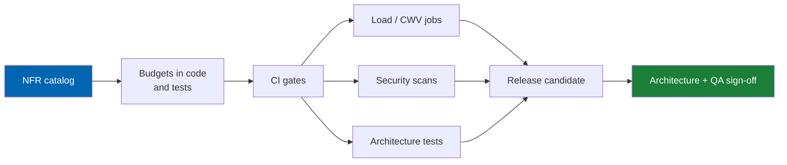

# 03 Non-Functional Requirements

> Quality attributes Check Engine must meet — performance, scalability, availability, security,
> accessibility, localisation, and maintainability — each with a measurement method.

**Status:** Review · **Owner:** Architecture Owner · **Last revised:** 2026-08-25

**Engineering status (2026-08-25):** Plugin `0.104.0` is in tree. Progress, evidence gates (G1–G6 done; G11 packing partial), and remaining blockers (H1.35/G8, G7, G11 vendor signing, G12) are recorded in [EXECUTION-PLAN.md](../EXECUTION-PLAN.md). This document remains the specification baseline.

---

## Contents

- [Executive Summary](#executive-summary)
- [Objectives](#objectives)
- [Scope](#scope)
- [Detailed Specifications](#detailed-specifications)
  - [Reference environment and dataset](#reference-environment-and-dataset)
  - [Performance](#performance-nfr-001nfr-015)
  - [Scalability and capacity](#scalability-and-capacity-nfr-016nfr-025)
  - [Availability and resilience](#availability-and-resilience-nfr-026nfr-032)
  - [Security](#security-nfr-033nfr-045)
  - [Accessibility](#accessibility-nfr-046nfr-050)
  - [Localisation and experience](#localisation-and-experience-nfr-051nfr-056)
  - [Maintainability and operability](#maintainability-and-operability-nfr-057nfr-068)
  - [Quality attribute scenarios](#quality-attribute-scenarios)
- [Architecture](#architecture)
- [User Stories](#user-stories)
- [Acceptance Criteria](#acceptance-criteria)
- [Future Enhancements](#future-enhancements)
- [References](#references)

---

## Executive Summary

Non-functional requirements (NFRs) define how well Check Engine must behave, not what it does. This
document specifies **68 NFRs** (`NFR-001` through `NFR-068`). Every performance number is stated against
a **reference environment and dataset**, so that "fast" is a measurement rather than an opinion.

The budgets that matter most commercially:

| Budget | Target (reference dataset) |
|---|---|
| Search first page, 95th percentile | ≤ 300 ms server-side; ≤ 1.5 s Largest Contentful Paint on mid-range mobile / 4G |
| Fitment evaluation, single part × single vehicle | ≤ 20 ms cached; ≤ 50 ms uncached |
| VIN decode (excluding external calls) | ≤ 40 ms |
| Core Web Vitals | LCP ≤ 2.5 s, INP ≤ 200 ms, CLS ≤ 0.1 on the defined mobile profile |

NFRs are testable. A requirement without a measurement method is incomplete and is not accepted into
this baseline.

---

## Objectives

| # | Objective | Measure |
|---|---|---|
| 1 | Make every quality attribute measurable | Each `NFR` has a metric, a target, and a method |
| 2 | Bind performance claims to a reference scale | Budgets cite the reference dataset defined here |
| 3 | Prevent silent regressions | CI and release gates enforce the Must-priority NFRs |
| 4 | Align security and accessibility with recognised standards | OWASP Top Ten mapping; WCAG 2.2 Level AA |

---

## Scope

### In scope

Performance, scalability, availability, security, accessibility, localisation behaviour, observability,
and maintainability requirements for Check Engine on nopCommerce 4.90.

### Out of scope

| Not covered | Where |
|---|---|
| Functional behaviour | [02](02-functional-requirements.md) |
| Detailed security control design | [28 Security](28-security.md) |
| Detailed performance engineering | [29 Performance](29-performance.md) |
| Logging field dictionary | [31 Logging](31-logging.md) |
| Test harness design | [35 Testing Strategy](35-testing-strategy.md) |

### Assumptions

- Hosting meets the platform requirements in [README.md](../README.md#platform-requirements).
- Redis is used for web-farm cache scenarios; in-process cache is acceptable for single-node.
- External AI and ERP latency is excluded from core budgets unless an NFR explicitly includes it.
- Current browser verification uses the PostgreSQL-backed Podman stack in `e2e/start-manual-stack.ps1` and `e2e/run-regressions.ps1` with local Chromium; that setup is for smoke validation, not a production database commitment.

### Dependencies

[01](01-business-requirements.md) (`BR-012`, `BR-034`, `BR-015`), [29](29-performance.md),
[28](28-security.md), [35](35-testing-strategy.md).

---

## Detailed Specifications

### Reference environment and dataset

All performance NFRs are measured against this baseline unless an NFR states otherwise.

**Reference dataset**

| Entity | Count |
|---|---|
| Makes | 12 |
| Models | 800 |
| Generations | 2,400 |
| Fully qualified configurations | 40,000 |
| OEM registry entries | 500,000 |
| Fitment claims | 2,000,000 |
| nopCommerce products (sellable parts) | 250,000 |
| Concurrent vehicle contexts in garage tables | 100,000 |

**Reference application host**

| Resource | Specification |
|---|---|
| Compute | 4 vCPU, 16 GB RAM (application) |
| Database | SQL Server 2022, 4 vCPU, 32 GB RAM, SSD |
| Cache | Redis 7, 2 GB |
| Search | OpenSearch 2.x or SQL Server Full-Text (both profiles documented) |
| Network | Application and database in the same region / VNet |

**Reference client profile (CWV)**

| Attribute | Value |
|---|---|
| Device | Mid-range Android (4× CPU slowdown in Lighthouse) |
| Network | Slow 4G throttling profile |
| Viewport | 360 × 800 |

### Performance (`NFR-001`–`NFR-015`)

| ID | Requirement | Target | Measurement | Priority |
|---|---|---|---|---|
| `NFR-001` | Search first-page server latency | p95 ≤ 300 ms, p99 ≤ 600 ms | Load test, reference dataset, warm cache | Must |
| `NFR-002` | Search first-page LCP (mobile profile) | ≤ 1.5 s for search results template | Lighthouse / Web Vitals RUM | Must |
| `NFR-003` | Fitment eval, 1 part × 1 vehicle | p95 ≤ 20 ms cached; ≤ 50 ms uncached | Microbench + integration | Must |
| `NFR-004` | Fitment eval, 1 vehicle × 100 parts | p95 ≤ 100 ms cached | Integration bench | Must |
| `NFR-005` | VIN decode local path | p95 ≤ 40 ms | Unit / integration bench | Must |
| `NFR-006` | OEM normalised lookup | p95 ≤ 15 ms | Integration bench | Must |
| `NFR-007` | Vehicle hierarchy child query | p95 ≤ 25 ms cached | Integration bench | Must |
| `NFR-008` | Product page TTFB with fitment panel | p95 ≤ 200 ms | Load test | Must |
| `NFR-009` | Import throughput, structured Excel | ≥ 50 rows/sec sustained excluding human review | Pipeline benchmark | Must |
| `NFR-010` | Admin list pages (claims, OEM, vehicles) | p95 ≤ 400 ms for 50-row page | Load test | Should |
| `NFR-011` | ERP sync batch of 1,000 stock updates | ≤ 3 minutes under reference host | Integration | Should |
| `NFR-012` | Cold start (app pool recycle to first healthy request) | ≤ 30 s | Ops measurement | Should |
| `NFR-013` | Static asset cache hit ratio via CDN | ≥ 95% for hashed assets | CDN analytics | Should |
| `NFR-014` | No N+1 query patterns on storefront catalog paths | Zero N+1 in profiling of top 20 routes | DotTrace / MiniProfiler gate | Must |
| `NFR-015` | Allocations on fitment hot path | No LOH churn under steady load; gen2 collections stable | PerfView soak | Should |

### Scalability and capacity (`NFR-016`–`NFR-025`)

| ID | Requirement | Target | Measurement | Priority |
|---|---|---|---|---|
| `NFR-016` | Horizontal scale-out | Linear to 4 app nodes behind a load balancer with Redis | Scale test | Must |
| `NFR-017` | Concurrent sessions | 2,000 concurrent shoppers with p95 search within `NFR-001` | Load test | Must |
| `NFR-018` | Catalog growth headroom | 2× reference dataset without redesign; documented plan to 10× | Capacity review | Should |
| `NFR-019` | Fitment claims table | Support 10M claims with partition / indexing strategy documented | DBA review + test at 2M | Must |
| `NFR-020` | Web farm: no sticky session requirement beyond nopCommerce's own | Verified with round-robin | Chaos / failover test | Should |
| `NFR-021` | Search index rebuild time | Full rebuild ≤ 4 hours at reference size | Ops runbook test | Should |
| `NFR-022` | Incremental index update lag | ≤ 60 s from product publish to searchable | Integration | Should |
| `NFR-023` | Import batch concurrency | ≥ 2 batches parallel without cross-corruption | Integration | Must |
| `NFR-024` | Garage sync fan-out | 50 devices/account soft limit; graceful error beyond | API test | Could |
| `NFR-025` | Multi-store | 5 stores on one instance within Multi Store licence, budgets held | Load test | Should |

Operator rehearsal for `NFR-017` (plugin 0.104.0): `CheckEngine/scripts/run-search-load-gate.sh|.ps1`
and `tests/perf/search-nfr017.js`. Rate limits are per shopper (`search:customer:{id}`). Load scripts
must send a browser User-Agent. Default in-flight cap is 25 on a single node; a synchronized
2,000-POST herd needs the 4-node Redis reference in `NFR-016`. See [29](29-performance.md).

The `NFR-002` 1.5 s search LCP target is unchanged. G6 CWV rehearsal on this host does **not**
claim it is met (measured LCP is bound by host logo/CSS, which the plugin must not patch).

### Availability and resilience (`NFR-026`–`NFR-032`)

| ID | Requirement | Target | Measurement | Priority |
|---|---|---|---|---|
| `NFR-026` | Storefront availability | 99.9% monthly excluding planned maintenance | Uptime monitoring | Must |
| `NFR-027` | Graceful degradation when search index is down | Keyword search falls back; VIN/OEM/tree still work | Failure injection | Must |
| `NFR-028` | Graceful degradation when AI provider is down | AI features skip; deterministic paths unaffected | Failure injection | Must |
| `NFR-029` | Graceful degradation when ERPNext is down | Orders accepted; sync queues and catches up | Failure injection | Must |
| `NFR-030` | Graceful degradation when licence server is unreachable | 30-day grace; storefront uninterrupted | Failure injection | Must |
| `NFR-031` | Database failover RPO / RTO | RPO ≤ 5 min; RTO ≤ 30 min (customer infra dependent; documented) | DR drill | Should |
| `NFR-032` | Zero data loss for completed orders on app-node kill | Confirmed by chaos test | Chaos | Must |

### Security (`NFR-033`–`NFR-045`)

Detailed controls in [28 Security](28-security.md). NFRs here are the acceptance-level statements.

| ID | Requirement | Target | Measurement | Priority |
|---|---|---|---|---|
| `NFR-033` | OWASP Top Ten coverage | All applicable risks mitigated or accepted with ADR | Security review checklist | Must |
| `NFR-034` | Authentication | Uses nopCommerce auth; no custom credential stores | Design review | Must |
| `NFR-035` | Authorisation | Server-side permission checks on every admin and mutating API | Automated authz tests | Must |
| `NFR-036` | Input validation | All external inputs validated; OLE/PDF/CSV upload sandboxed | SAST + upload fuzzing | Must |
| `NFR-037` | Secrets | No secrets in repo; secret scan clean in CI | gitleaks / equivalent | Must |
| `NFR-038` | Encryption in transit | TLS 1.2+ only on public endpoints | SSL labs / config | Must |
| `NFR-039` | Encryption at rest for VINs in garage | When configured, AES via platform data protection | Config + unit tests | Must |
| `NFR-040` | Rate limiting | VIN decode, search, and login protected | Load / abuse test | Must |
| `NFR-041` | Audit integrity | Admin fitment/licence actions append-only | Design + penetration | Must |
| `NFR-042` | Dependency vulnerabilities | No known critical/high in release artifacts without waiver | `dotnet list package --vulnerable` | Must |
| `NFR-043` | Vendor isolation (marketplace) | Cross-tenant data access attempts fail | Security tests Horizon 3 | Must |
| `NFR-044` | Personal data minimisation in logs | No raw VIN/PII by default | Log review | Must |
| `NFR-045` | Security response | Disclosure SLA per [CONTRIBUTING.md](../CONTRIBUTING.md) | Process audit | Must |

### Accessibility (`NFR-046`–`NFR-050`)

| ID | Requirement | Target | Measurement | Priority |
|---|---|---|---|---|
| `NFR-046` | WCAG 2.2 Level AA on storefront Check Engine surfaces | Zero serious/critical axe findings on key templates | axe + manual | Must |
| `NFR-047` | Keyboard operability | All garage, search, and vehicle selector flows completable without pointer | Manual protocol | Must |
| `NFR-048` | Focus visibility | Visible focus on all interactive elements | Manual + CSS audit | Must |
| `NFR-049` | Screen reader labels | Controls have accessible names; live regions for async search | NVDA / VoiceOver sample | Must |
| `NFR-050` | Admin AA targets | Admin Check Engine pages AA for core workflows | axe on admin | Should |

### Localisation and experience (`NFR-051`–`NFR-056`)

| ID | Requirement | Target | Measurement | Priority |
|---|---|---|---|---|
| `NFR-051` | Language parity | Every English string has Arabic; no feature English-only | Resource diff gate | Must |
| `NFR-052` | RTL correctness | No clipped text, mirrored icons correct, logical CSS properties | Visual review protocol | Must |
| `NFR-053` | Font performance | Arabic and Latin text render without FOIT > 100 ms on reference client | Web Vitals / filmstrip | Should |
| `NFR-054` | Core Web Vitals | LCP ≤ 2.5 s, INP ≤ 200 ms, CLS ≤ 0.1 on mobile profile for home, category, product, search | RUM + Lighthouse CI | Must |
| `NFR-055` | Responsive range | Usable 320 px–2560 px | Visual matrix | Must |
| `NFR-056` | Prefer reduced motion | Animations respect `prefers-reduced-motion` | Manual | Should |

### Maintainability and operability (`NFR-057`–`NFR-068`)

| ID | Requirement | Target | Measurement | Priority |
|---|---|---|---|---|
| `NFR-057` | Domain layer independence | Domain project references no nopCommerce assemblies | Architecture test | Must |
| `NFR-058` | Unit test coverage (domain) | ≥ 80% line coverage | CI | Must |
| `NFR-059` | Unit test coverage (application) | ≥ 70% | CI | Must |
| `NFR-060` | Analyser cleanliness | Zero new warnings; warnings-as-errors in CI | CI | Must |
| `NFR-061` | Cyclomatic complexity | Hot-path methods ≤ 15 unless justified ADR | Roslyn analyser | Should |
| `NFR-062` | Structured logging | 100% of log events in Check Engine use structured templates | Code review + serilog audit | Must |
| `NFR-063` | Correlation IDs | Every request carries correlation across plugin logs | Integration | Must |
| `NFR-064` | Runbooks | Install, upgrade, rollback, index rebuild, sync failure documented | Doc review | Must |
| `NFR-065` | Migration safety | Forward + backward tested on populated DB; duration measured | CI migration test | Must |
| `NFR-066` | Public extension points documented | XML docs on all public APIs | DocFX / CI | Should |
| `NFR-067` | Time to deploy hotfix | Documented path ≤ 1 hour for config-only; ≤ 1 day for patched build | Process drill | Should |
| `NFR-068` | Traceability gate | Broken BR→FR→US→AC→test links fail CI | CI | Must |

### Quality attribute scenarios

```mermaid
flowchart TB
    subgraph Perf["Performance scenario"]
        P1["2,000 concurrent users"] --> P2["Search p95 ≤ 300 ms"]
        P2 --> P3["Pass / Fail gate"]
    end

    subgraph Resilience["Resilience scenario"]
        R1["Kill OpenSearch"] --> R2["Fallback search active"]
        R2 --> R3["VIN and OEM modes healthy"]
        R3 --> R4["Orders still complete"]
    end

    subgraph Security["Security scenario"]
        S1["Vendor A API token"] --> S2["Attempt read Vendor B orders"]
        S2 --> S3["403 + audit entry"]
    end

    style P3 fill:#1a7f37,color:#fff
    style R4 fill:#1a7f37,color:#fff
    style S3 fill:#1a7f37,color:#fff
```

---

## Architecture

NFR enforcement is layered: design budgets → implementation → automated gates → release sign-off.

Trade-offs are recorded as ADRs when an NFR cannot be met without relaxing another. Silent violation is
not permitted.

---

## User Stories

| ID | As a… | I want… | So that… | Priority |
|---|---|---|---|---|
| `US-201` | Operator | search to feel instant on a large catalog | customers do not bounce | Must |
| `US-202` | Operator | the store to keep selling if ERP or AI is down | revenue is not coupled to integrations | Must |
| `US-203` | Customer using assistive tech | to complete purchase flows with keyboard and screen reader | I am not excluded | Must |
| `US-204` | Security reviewer | evidence of OWASP coverage and dependency scanning | I can approve the deployment | Must |
| `US-205` | Engineer | performance budgets in CI | regressions fail the build before customers see them | Must |

---

## Acceptance Criteria

**`AC-NFR.1`** — Performance gate
Given the reference environment and dataset, when the Horizon 1 release candidate load suite runs, then
`NFR-001`, `NFR-003`, `NFR-005`, and `NFR-008` pass at the stated percentiles.

**`AC-NFR.2`** — CWV gate
Given the mobile client profile, when Lighthouse CI runs on home, category, product, and search
templates, then `NFR-054` passes.

**`AC-NFR.3`** — Resilience gate
Given failure injection for search index, AI, ERP, and licence server, when storefront purchase is
attempted, then the order completes and degradation is logged (`NFR-027`–`NFR-030`).

**`AC-NFR.4`** — Accessibility gate
Given axe scans of Check Engine storefront templates, when serious or critical issues are counted, then
the count is zero (`NFR-046`).

**`AC-NFR.5`** — Architecture gate
Given the domain project, when references are analysed, then no nopCommerce assembly reference exists
(`NFR-057`).

---

## Future Enhancements

| Enhancement | Horizon | Notes |
|---|---|---|
| Multi-region active-active targets | 5 | SaaS |
| Formal SOC 2 control mapping | 5 | SaaS enterprise |
| Stricter admin WCAG AAA for selected workflows | 3 | Optional |
| Automated bilingual visual regression | 2 | Extends `NFR-052` |

---

## References

- [01 Business Requirements](01-business-requirements.md) — `BR-012`, `BR-034`, `BR-015`
- [02 Functional Requirements](02-functional-requirements.md)
- [28 Security](28-security.md), [29 Performance](29-performance.md), [31 Logging](31-logging.md)
- [35 Testing Strategy](35-testing-strategy.md)
- [WCAG 2.2](https://www.w3.org/TR/WCAG22/)
- [OWASP Top Ten](https://owasp.org/www-project-top-ten/)
- [web.dev Core Web Vitals](https://web.dev/articles/vitals)
