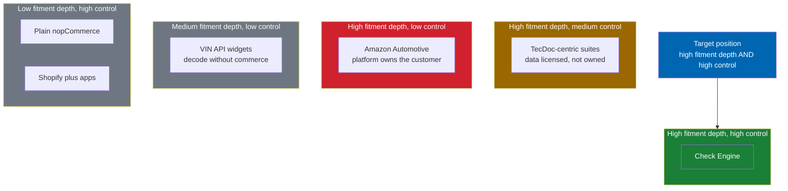
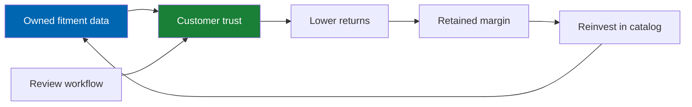

# 04 Competitive Analysis

> How Check Engine wins — and where it does not — against eleven competing approaches across four
> categories of the automotive commerce landscape.

**Status:** Review · **Owner:** Product Owner · **Last revised:** 2026-07-28

---

## Contents

- [Executive Summary](#executive-summary)
- [Objectives](#objectives)
- [Scope](#scope)
- [Detailed Specifications](#detailed-specifications)
  - [Category map](#category-map)
  - [Competitor profiles](#competitor-profiles)
  - [Feature comparison matrix](#feature-comparison-matrix)
  - [Pricing and commercial model comparison](#pricing-and-commercial-model-comparison)
  - [Defensibility analysis](#defensibility-analysis)
  - [Win / lose scenarios](#win--lose-scenarios)
- [Architecture](#architecture)
- [User Stories](#user-stories)
- [Acceptance Criteria](#acceptance-criteria)
- [Future Enhancements](#future-enhancements)
- [References](#references)

---

## Executive Summary

Check Engine competes in a fragmented landscape. No single product owns "automotive commerce on
nopCommerce." Operators today choose among four categories of imperfect options:

1. **General-purpose e-commerce** with improvised fitment (nopCommerce, Shopify, WooCommerce, Magento)
2. **Enterprise automotive suites** with licensed data (TecAlliance/TecDoc-centric stacks, OEM portals)
3. **Marketplace channels** that own the customer (Amazon Automotive, eBay Motors, regional marketplaces)
4. **Point solutions** that solve one slice (VIN APIs, fitment widgets, PIM tools)

Check Engine's wedge is the mid-market operator who needs evidenced fitment and catalog ownership on a
platform they control, without per-seat data licensing and without surrendering the customer
relationship to a marketplace.

The durable advantages are **owned curated data**, **evidenced fitment with review workflow**, and
**deep nopCommerce-native integration**. The vulnerabilities are **time-to-catalog** (curation is
slower than licensing a feed) and **brand recognition** against Amazon for retail consumers.

---

## Objectives

| # | Objective | Measure |
|---|---|---|
| 1 | Identify every realistic alternative a buyer evaluates | Eleven approaches documented |
| 2 | Make win/lose conditions explicit | Sales play guidance derived from matrices |
| 3 | Stress-test the strategic bets in [00](00-vision.md) | Each bet mapped to competitive pressure |
| 4 | Inform pricing and packaging | Inputs to [44](44-commercial-strategy.md) |

---

## Scope

### In scope

Competitive alternatives relevant to Target Customers in [01](01-business-requirements.md), feature and
commercial comparison, defensibility, and win/lose scenarios.

### Out of scope

| Not covered | Where |
|---|---|
| Detailed product strategy and sequencing | [05](05-product-strategy.md) |
| Pricing numbers | [44](44-commercial-strategy.md) |
| Marketing copy | Go-to-market materials outside this repo |

### Assumptions

- Buyers in the mid-market evaluate total cost of ownership over three years, not licence fee alone.
- Licensed fitment data (TecDoc and equivalents) remains priced per user / per brand in ways that hurt
  mid-market margins.
- nopCommerce retains a meaningful installed base for .NET-centric operators.

---

## Detailed Specifications

### Category map

The landscape sorts along two axes: **fitment depth** (can the system substantiate that a part fits a
specific vehicle?) and **control** (does the operator own the catalog and the customer relationship?).
Every category is strong on one axis and weak on the other. The gap Check Engine occupies is the
top-right corner, where both hold at once.

Scored positions, on a 0.00–1.00 scale for each axis:

| Approach | Fitment depth | Control | Reading |
|---|---|---|---|
| **Check Engine** | 0.82 | 0.78 | The only approach strong on both |
| TecDoc-centric suites | 0.88 | 0.55 | Deepest data, but rented and per-seat |
| Amazon Automotive | 0.80 | 0.25 | Good fitment, no customer ownership |
| VIN API widgets | 0.55 | 0.40 | Solves one slice, not a platform |
| Shopify plus apps | 0.35 | 0.70 | Own the store, improvise the fitment |
| Plain nopCommerce | 0.20 | 0.75 | Full control, no automotive primitive |

### Competitor profiles

#### Category 1 — General-purpose e-commerce

| Approach | Fitment reality | Strength | Weakness vs Check Engine |
|---|---|---|---|
| **Plain nopCommerce** | None native | Full control, .NET, self-host | Operator builds fitment themselves |
| **Shopify + fitment apps** | App-dependent, often shallow | Fast storefront, huge app ecosystem | App sprawl; data in multiple SaaS; weaker trade/ERP story for .NET shops |
| **WooCommerce + plugins** | Plugin-dependent | Low entry cost | Reliability and performance at catalog scale; security burden |
| **Adobe Commerce (Magento)** | Extensions exist | Enterprise merchandising | Cost and complexity; fitment still an extension concern |

#### Category 2 — Enterprise automotive / data-centric

| Approach | Fitment reality | Strength | Weakness vs Check Engine |
|---|---|---|---|
| **TecAlliance / TecDoc-centric commerce** | Deep, licensed | Authoritative data for many markets | Per-seat / brand licensing; redistribution limits; not nopCommerce-native |
| **OEM dealer portals** | Exact for one brand | Genuine parts certainty | Single brand; franchise constraints; not a multi-brand retail platform |
| **Custom builds on licensed feeds** | As good as the integrator | Tailored | CapEx, maintenance, key-person risk |

#### Category 3 — Marketplaces

| Approach | Fitment reality | Strength | Weakness vs Check Engine |
|---|---|---|---|
| **Amazon Automotive** | Platform fitment tools | Demand, trust, logistics | Customer ownership lost; fees; commodity competition |
| **eBay Motors / regional marketplaces** | Variable | Reach | Same ownership and margin issues; brand dilution |

#### Category 4 — Point solutions

| Approach | Fitment reality | Strength | Weakness vs Check Engine |
|---|---|---|---|
| **VIN decode APIs** | Decode only | Easy integration | Not a catalog or commerce platform |
| **Fitment widgets for Shopify/etc.** | Widget-level | Fast to add | Shallow integration; weak import/ERP/trade |
| **Automotive PIM / MDM tools** | Data management | Strong governance | Not a selling experience; still need commerce |

### Feature comparison matrix

Legend: **F** = Full · **P** = Partial · **N** = None · **L** = Licensed third-party required

| Capability | Check Engine | Plain nop | Shopify+apps | TecDoc stack | Amazon Auto | VIN API only |
|---|---|---|---|---|---|---|
| Evidenced fitment relation | F | N | P | F | F | N |
| Confidence + provenance | F | N | N | P | P | N |
| Human review workflow | F | N | N | P | N | N |
| VIN → filtered catalog | F | N | P | F | F | P |
| OEM + supersession | F | N | P | F | P | N |
| Brand-agnostic schema | F | N/A | P | P | F | P |
| Owned data (no feed licence) | F | N/A | P | L | N/A | L/N |
| Supplier PDF/Excel import → fitment | F | N | P | P | N | N |
| AI enrichment with review | F | N | P | N | N | N |
| Arabic + English RTL | F | P | P | P | P | N |
| ERPNext native sync | F | N | N | N | N | N |
| nopCommerce-native plugin | F | N/A | N | N | N | N |
| Marketplace multi-vendor | P (H3) | P | F | P | F | N |
| Trade / fleet portals | P (H4) | N | P | P | N | N |
| Consumer demand / traffic | N | N | P | N | F | N |

### Pricing and commercial model comparison

Directional only; not a price list.

| Approach | Commercial pattern | 3-year TCO driver |
|---|---|---|
| Check Engine | Tiered commercial licence + optional services | Licence + curation effort / services |
| Plain nop + custom | Engineering time | Build + forever maintain |
| Shopify + apps | Shopify sub + app stack + transaction fees | Fees scale with GMV; app sprawl |
| TecDoc-centric | Platform + **data licences per brand/user** | Data fees dominate at multi-brand scale |
| Amazon | Referral + FBA/fulfilichannel fees | Fees + price competition |
| VIN API | Usage-based API | Decode cost without commerce value |

**Implication:** Check Engine wins TCO arguments when the buyer (a) needs multi-brand fitment, (b) wants
to own the customer, and (c) already prefers nopCommerce or .NET self-hosting. It loses when the buyer
primarily needs marketplace traffic or already sits inside an OEM franchise stack.

### Defensibility analysis

| Moat element | Strength | How competitors erode it | Counter |
|---|---|---|---|
| Owned curated catalog | High over time | Licence a feed faster at launch | Import pipeline + services; quality compounds |
| Review + provenance model | Medium-high | Copyable in theory | Operational discipline + safety posture hard to fake |
| nopCommerce depth | Medium | Other platforms ignore nop buyers | Own the .NET automotive niche |
| Brand-agnostic architecture | Medium | Most rivals are brand-tied or feed-tied | Expansion speed without rewrites |
| AI layer | Low alone | Commodity models | Differentiation is grounding in owned fitment, not the LLM |

This flywheel is the strategic answer to "why not just licence TecDoc?" Licensing buys Day-1 coverage;
it does not buy an owned asset that improves unit economics over time (`ADR-003`, `BR-041`).

### Win / lose scenarios

| Scenario | Likely winner | Why |
|---|---|---|
| Multi-brand importer on nopCommerce, high return pain | **Check Engine** | Exact ICP |
| Single-brand OEM dealer group | OEM portal / franchise stack | Genuine parts + franchise rules |
| Pure consumer growth team, no ops depth | Amazon / Shopify | Traffic and speed |
| Enterprise EU parts chain needing TecDoc everywhere | TecDoc-centric suite | Data coverage expectation |
| Workshop chain needing job-based ordering today | Incumbent DMS + purchasing | Portals are Horizon 4 for Check Engine |
| Operator who refuses any human review | Not Check Engine | Product will not remove safety review |

---

## Architecture

Competitive positioning feeds product architecture decisions already recorded:

| Competitive pressure | Architectural response | ADR / BR |
|---|---|---|
| TecDoc speed-to-coverage | Import connectors for operators who hold licences; do not bundle | `ADR-003` |
| Shopify app sprawl | One coherent plugin, not a dozen | `ADR-005` |
| Marketplace customer capture | SEO landing pages + garage retention | `BR-024`, `BR-022` |
| Enterprise suite lock-in | Self-hosted, exportable data, clean uninstall | `BR-036`, `BR-041` |

---

## User Stories

| ID | As a… | I want… | So that… |
|---|---|---|---|
| `US-301` | Sales engineer | a clear win/lose matrix | I do not waste cycles on OEM franchise deals |
| `US-302` | Product owner | defensibility tied to roadmap | we invest in the flywheel, not me-too features |
| `US-303` | Prospect | an honest comparison to TecDoc and Amazon | I trust the vendor |

---

## Acceptance Criteria

**`AC-CA.1`** — ICP clarity
Given a prospect questionnaire covering platform, brand count, data licence posture, and traffic source,
when scored with this document's win/lose table, then the recommendation is Check Engine / Competitor /
Disqualify with a stated reason.

**`AC-CA.2`** — No false claims
Given marketing materials derived from this analysis, when compared to the feature matrix, then no cell
marked Partial or None is described as Full.

---

## Future Enhancements

| Enhancement | Horizon | Notes |
|---|---|---|
| Living competitor scorecards refreshed quarterly | 2 | Commercial ops |
| Regional marketplace deep-dives | 2 | Per go-to-market region |
| Win/loss interview programme | 1 | Feeds [05](05-product-strategy.md) |

---

## References

- [00 Vision](00-vision.md), [01](01-business-requirements.md), [05](05-product-strategy.md)
- [44 Commercial Strategy](44-commercial-strategy.md)
- [TecAlliance](https://www.tecalliance.net/) — illustrative licensed-data competitor class
- [nopCommerce Marketplace](https://www.nopcommerce.com/marketplace)
