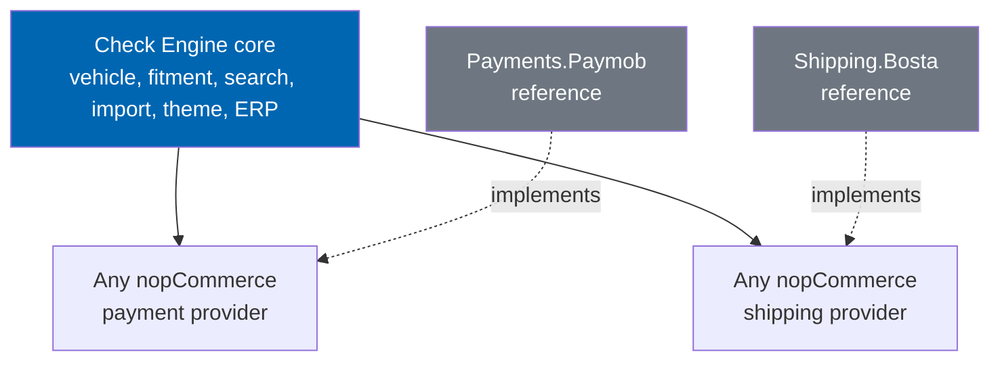
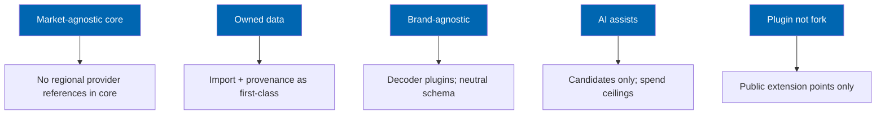

# 05 Product Strategy

> Where Check Engine plays, how it wins, and what it deliberately postpones — the strategy that turns
> vision and competitive analysis into sequenced bets.

**Status:** Review · **Owner:** Product Owner · **Last revised:** 2026-07-28

**Engineering status (2026-08-25):** Plugin `0.104.0` is in tree. Progress, evidence gates (G1–G6 done; G11 packing partial), and remaining blockers (H1.35/G8, G7, G11 vendor signing, G12) are recorded in [EXECUTION-PLAN.md](../EXECUTION-PLAN.md). This document remains the specification baseline.

---

## Contents

- [Executive Summary](#executive-summary)
- [Objectives](#objectives)
- [Scope](#scope)
- [Detailed Specifications](#detailed-specifications)
  - [Positioning statement](#positioning-statement)
  - [Ideal customer profile](#ideal-customer-profile)
  - [Segment prioritisation](#segment-prioritisation)
  - [Market-agnostic regional strategy](#market-agnostic-regional-strategy)
  - [Brand expansion strategy](#brand-expansion-strategy)
  - [Build versus license decision](#build-versus-license-decision)
  - [Moat construction plan](#moat-construction-plan)
  - [Packaging strategy](#packaging-strategy)
  - [Go-to-market motion](#go-to-market-motion)
  - [Anti-goals](#anti-goals)
- [Architecture](#architecture)
- [User Stories](#user-stories)
- [Acceptance Criteria](#acceptance-criteria)
- [Future Enhancements](#future-enhancements)
- [References](#references)

---

## Executive Summary

Check Engine's strategy is to **own the automotive layer on nopCommerce for mid-market parts sellers**
who need fitment certainty and catalog ownership. The product is market-agnostic by architecture and
regionally excellent by companion plugins. Data is curated, not licensed. AI accelerates curation and
discovery but never replaces evidenced fitment.

Sequencing follows [ROADMAP.md](../ROADMAP.md): correctness before intelligence, single-supplier before
marketplace, retail before vertical portals, self-hosted before SaaS.

The strategy rejects three tempting shortcuts: forking nopCommerce, bundling TecDoc, and shipping AI
search before the fitment engine is trustworthy.

---

## Objectives

| # | Objective | Measure |
|---|---|---|
| 1 | Define ICP tightly enough to refuse bad-fit deals | Win/lose alignment with [04](04-competitive-analysis.md) |
| 2 | Sequence brands and segments without rewriting the core | Brand N adds data + decoder only |
| 3 | Encode market-agnosticism in packaging | Core sells without Paymob/Bosta |
| 4 | Align commercial packaging with licence tiers | Trace to [43](43-licensing.md) / [44](44-commercial-strategy.md) |

---

## Scope

### In scope

Positioning, ICP, segment and brand sequencing, regional strategy, build-vs-license, moat plan,
packaging principles, GTM motion, anti-goals.

### Out of scope

| Not covered | Where |
|---|---|
| Price points and unit economics | [44](44-commercial-strategy.md) |
| Legal licence text | [LICENSE.md](../LICENSE.md), [43](43-licensing.md) |
| Sprint-level delivery | [36](36-sprint-planning.md), [41](41-release-plan.md) |

---

## Detailed Specifications

### Positioning statement

For **multi-brand automotive parts importers, distributors, and retailers** who run or will run
**nopCommerce** and suffer **fitment-driven returns and unscalable catalogs**, Check Engine is the
**automotive commerce platform plugin** that provides **vehicle intelligence, evidenced fitment, and
catalog acquisition** on infrastructure they control. Unlike **general e-commerce improvisation**, it
treats fitment as a first-class relation; unlike **licensed enterprise data suites**, it makes the
catalog an **owned asset**; unlike **marketplaces**, it **keeps the customer relationship**.

### Ideal customer profile

| Dimension | ICP yes | ICP no |
|---|---|---|
| Platform | nopCommerce now or migrating to 4.90 | Locked to Shopify-only or OEM franchise portal |
| Catalog | Multi-brand or expanding beyond one brand | Single OEM franchise genuine-only |
| Pain | Returns, wrong-part tickets, unusable variants | Only needs more traffic |
| Data posture | Willing to curate / review or buy curation services | Demands TecDoc Day-1 with zero review |
| Ops maturity | Has (or will hire) someone accountable for catalog quality | Pure drop-ship with no review capacity |
| Integration | ERPNext or willingness to adopt / sync | Requires SAP real-time in v1 |
| Language | Needs Arabic and/or English | Needs ten languages on Day-1 |

### Segment prioritisation

| Rank | Segment | Why now | Horizon product surface |
|---|---|---|---|
| 1 | Importer / distributor | Owns supply; highest willingness to pay for correctness | Core v1.0 |
| 2 | Specialty parts retailer | Direct ROI via return reduction | Core v1.0 |
| 3 | Multi-brand specialist | Validates brand-agnostic claim | Core + brand packs |
| 4 | Marketplace operator | Expansion revenue | v1.2 module |
| 5 | Workshop groups | High frequency orders | v1.3 portal |
| 6 | Fleet | Long sales cycle, high ACV | v1.4 portal |
| 7 | Dealers | Franchise complexity | v1.5 portal |

### Market-agnostic regional strategy

Paymob and Bosta are **reference regional providers**, not product dependencies (`ADR-004`, `BR-026`).

| Principle | Practice |
|---|---|
| Core has zero references to regional providers | Enforced by architecture tests |
| Launch region gets excellent defaults | Paymob + Bosta + Arabic-first content quality |
| Next region is a packaging exercise | New payment/shipping plugins + vocabulary + tax config |
| Compliance is local | ETA e-invoicing etc. are operator/ERP concerns unless productised later |

### Brand expansion strategy

| Wave | Brands | Intent |
|---|---|---|
| 0 | BMW | Launch dataset; prove curation pipeline |
| 1 | MINI | Shared platforms; validates hierarchy without new decoder class |
| 2 | Mercedes-Benz, Audi, Volkswagen, Porsche | Volume + premium EU/GCC demand |
| 3 | Toyota, Lexus, Nissan, Hyundai, Kia | Volume Asia brands |
| 4 | Land Rover, Volvo | Adjacent premium |
| N | Unlimited | Data + decoder only |

**Rule:** No wave requires a core schema change. If it does, the change is a defect against `BR-025`.

### Build versus license decision

| Option | Decision | Rationale |
|---|---|---|
| Bundle TecDoc/ACES | **Reject** | Per-seat cost, redistribution limits, blocks SaaS/data revenue (`ADR-003`) |
| Curate in-house | **Adopt** | Owned asset; import pipeline as acquisition; review as quality gate |
| Hybrid connectors | **Adopt as optional** | Operators who already license a feed can import; Check Engine does not redistribute |

### Moat construction plan

| Phase | Moat investment | Observable signal |
|---|---|---|
| Horizon 1 | Provenance + review + BMW coverage depth | Return rate; claim auditability |
| Horizon 2 | AI grounded on owned data | Enrichment cost/quality; NL search accuracy |
| Horizon 3 | Multi-supplier fitment adjudication | Supplier retention |
| Horizon 4 | Vertical workflows on same engines | Portal ACV |
| Horizon 5 | Data services from owned catalog | Non-licence revenue mix |

### Packaging strategy

| Package | Includes | Excludes |
|---|---|---|
| Check Engine core | Plugin + theme assets + BMW starter methodology | Paymob, Bosta |
| Regional starter kits | Documented provider plugins + sample config | Not required |
| Curation services | Optional professional services | Not mandatory for licence |
| Marketplace module | Tier-gated capability | Not in Single Store |
| Portals | Separate SKUs / tiers later | Not in v1.0 |

Licence tiers align with [LICENSE.md](../LICENSE.md) § 3 and [43](43-licensing.md).

### Go-to-market motion

| Motion | Use when |
|---|---|
| Direct sales to importers/distributors | Primary Horizon 1 |
| nopCommerce Marketplace listing | Awareness + inbound ([42](42-marketplace-publishing.md)) |
| Implementation partners | Capacity without headcount |
| Content / SEO on fitment pain | Inbound education |
| Marketplace-led consumer acquisition | **Not** primary; contradicts customer-ownership bet |

### Anti-goals

| Anti-goal | Why |
|---|---|
| Become an Amazon competitor for traffic | Different business; lose on logistics and demand |
| Become a TecDoc reseller | Destroys owned-data strategy |
| Support every nopCommerce version back to 4.30 | Unsupported runtimes; support matrix explosion |
| Ship headless-only in v1 | ICP needs a theme and admin, not only APIs |
| Remove human review to "move faster" | Safety and trust risk (`RISK-10`) |

---

## Architecture

Strategy constraints that architecture must honour:

---

## User Stories

| ID | As a… | I want… | So that… |
|---|---|---|---|
| `US-401` | Product owner | a written ICP | engineering does not build for non-customers |
| `US-402` | Partner | regional kits without forking core | I can localise for my market |
| `US-403` | Prospect | to buy core without Paymob | I am not forced into Egypt-specific stack |

---

## Acceptance Criteria

**`AC-PS.1`** — Core independence
Given a clean Check Engine install without Paymob or Bosta, when the operator configures another
payment and shipping provider, then checkout completes for a fitment-filtered order.

**`AC-PS.2`** — Brand wave test
Given MINI data and a MINI decoder assembly, when added to a BMW-capable system, then no core binary
change is required for hierarchy or fitment evaluation to function.

**`AC-PS.3`** — Anti-goal enforcement
Given a proposal to auto-publish below-threshold safety-critical fitment, when reviewed against this
strategy, then it is rejected as violating an anti-goal.

---

## Future Enhancements

| Enhancement | Horizon |
|---|---|
| Formal partner programme tiers | 2 |
| Regional compliance packs (e-invoicing) | 3 |
| Data-as-service packaging | 5 |

---

## References

- [00 Vision](00-vision.md), [04 Competitive Analysis](04-competitive-analysis.md)
- [ROADMAP.md](../ROADMAP.md), [CHANGELOG.md](../CHANGELOG.md) (ADRs)
- [43 Licensing](43-licensing.md), [44 Commercial Strategy](44-commercial-strategy.md)
- [42 Marketplace Publishing](42-marketplace-publishing.md)
