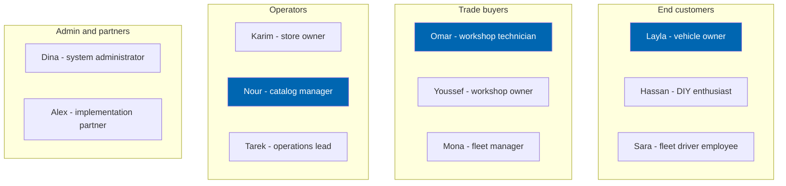
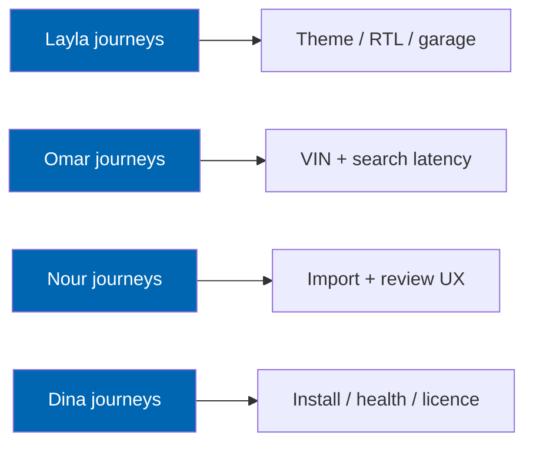

# 06 Personas

> The eleven people Check Engine is built for — their goals, frustrations, technical context, and the
> requirements each of them drives.

**Status:** Review · **Owner:** Product Owner · **Last revised:** 2026-07-28

**Engineering status (2026-08-25):** Plugin `0.104.0` is in tree. Progress, evidence gates (G1–G6 done; G11 packing partial), and remaining blockers (H1.35/G8, G7, G11 vendor signing, G12) are recorded in [EXECUTION-PLAN.md](../EXECUTION-PLAN.md). This document remains the specification baseline.

---

## Contents

- [Executive Summary](#executive-summary)
- [Objectives](#objectives)
- [Scope](#scope)
- [Detailed Specifications](#detailed-specifications)
  - [Persona classes](#persona-classes)
  - [End customers](#end-customers)
  - [Trade buyers](#trade-buyers)
  - [Operators](#operators)
  - [Administrators and partners](#administrators-and-partners)
  - [Persona to requirement trace matrix](#persona-to-requirement-trace-matrix)
  - [Anti-personas](#anti-personas)
- [Architecture](#architecture)
- [User Stories](#user-stories)
- [Acceptance Criteria](#acceptance-criteria)
- [Future Enhancements](#future-enhancements)
- [References](#references)

---

## Executive Summary

Check Engine serves four persona classes: **end customers**, **trade buyers**, **store operators**, and
**administrators / partners**. Eleven named personas cover the behaviours that shape the product. They
are archetypes grounded in the ICP in [05](05-product-strategy.md), not fictional demographics for their
own sake.

Design rule: every storefront flow is proven against **Layla** (Arabic-speaking vehicle owner) and
**Omar** (workshop technician) before it is considered done. Every admin flow is proven against
**Nour** (catalog manager) and **Karim** (store owner). If a flow works only for an English-speaking
retail browser with no vehicle context, it is incomplete.

---

## Objectives

| # | Objective | Measure |
|---|---|---|
| 1 | Give UX, engineering, and QA a shared user model | Personas cited in stories and tests |
| 2 | Prevent building for anti-personas | Explicit anti-persona list |
| 3 | Connect people to requirements | Trace matrix to `BR` / `FR` |
| 4 | Drive journey design | Input to [07](07-user-journey.md) |

---

## Scope

### In scope

Eleven personas, anti-personas, and the requirement trace matrix.

### Out of scope

| Not covered | Where |
|---|---|
| Step-by-step journeys | [07](07-user-journey.md) |
| UI component behaviour | [22](22-ui-design-system.md), [23](23-ux-guidelines.md) |
| Sales ICP firmographics | [05](05-product-strategy.md) |

---

## Detailed Specifications

### Persona classes

### End customers

#### P1 — Layla, vehicle owner (primary retail)

| Attribute | Detail |
|---|---|
| Role | Owns a BMW 320i; not a car expert |
| Languages | Arabic primary, some English |
| Goals | Buy the correct part quickly; avoid returns; use her phone |
| Frustrations | Sites that ask for chassis codes she does not know; English-only UI; wrong parts |
| Entry points | VIN from door jamb; photo of old part number; "water pump for my car" |
| Success | Order arrives, fits first time, garage remembers her car |
| Drives | `BR-001`, `BR-002`, `BR-005`, `BR-008`, `FR-402`, `FR-705`, RTL NFRs |

#### P2 — Hassan, DIY enthusiast

| Attribute | Detail |
|---|---|
| Role | Weekend mechanic; follows forums; compares OEM vs aftermarket |
| Goals | Find OEM number equivalents; read specifications; save money intelligently |
| Frustrations | Vague "fits 3 Series" text; no supersession info; poor images |
| Entry points | OEM number, generation code (F30), keyword |
| Success | Understands aftermarket vs OEM; buys equivalent with confidence |
| Drives | `BR-021`, `FR-234`, `FR-904`, product page depth |

#### P3 — Sara, company car driver

| Attribute | Detail |
|---|---|
| Role | Drives a company vehicle; sometimes ordered to buy a consumable |
| Goals | Follow fleet instructions; get reimbursed; minimal time |
| Frustrations | Being asked for details the fleet already knows |
| Entry points | Link or OEM from fleet manager; later fleet portal |
| Success | Correct part with invoice suitable for reclaim |
| Drives | Horizon 4 fleet flows; Horizon 1 still needs simple OEM/VIN path |

### Trade buyers

#### P4 — Omar, workshop technician (primary trade)

| Attribute | Detail |
|---|---|
| Role | Diagnoses cars; orders parts while the vehicle is on the ramp |
| Goals | Certainty and speed; bay utilisation; no second delivery wait |
| Frustrations | Ambiguous fitment; slow sites; no VIN decode; chatty consumer UI |
| Entry points | VIN, OEM, customer registration plate + known model |
| Success | Part ordered in under three minutes with verified fit |
| Drives | `BR-001`, `BR-020`, `NFR-001`, trade pricing later (`BR-028`) |

#### P5 — Youssef, workshop owner

| Attribute | Detail |
|---|---|
| Role | Owns a multi-bay workshop; cares about margin and supplier reliability |
| Goals | Trade pricing, credit terms, consolidated ordering, less admin |
| Frustrations | Consumer checkout; no job allocation; payment friction |
| Entry points | Accounts / trade registration; Horizon 4 workshop portal |
| Success | Monthly purchasing with clear invoices and few returns |
| Drives | Portal [46](46-workshop-portal.md); Horizon 1 account + ERP invoices |

#### P6 — Mona, fleet manager

| Attribute | Detail |
|---|---|
| Role | Manages dozens to hundreds of vehicles |
| Goals | Cost per vehicle, scheduled maintenance, approval workflows |
| Frustrations | One-VIN-at-a-time retail UX; no register import |
| Entry points | Horizon 4 fleet portal; interim CSV vehicle lists via operator |
| Success | Predictable maintenance spend; downtime reduced |
| Drives | [47](47-fleet-portal.md), `BR-028` |

### Operators

#### P7 — Karim, store owner / importer

| Attribute | Detail |
|---|---|
| Role | Buys the Check Engine licence; owns P&L |
| Goals | Lower returns, grow brands, sync with ERPNext, predictable cost |
| Frustrations | Custom dev quotes; TecDoc pricing; marketplace fee erosion |
| Success | Measurable return-rate drop within a quarter of go-live |
| Drives | `BR-001`, `BR-009`, `BR-013`, `BR-037`, commercial docs |

#### P8 — Nour, catalog manager (primary admin user)

| Attribute | Detail |
|---|---|
| Role | Imports supplier files; reviews fitment; publishes catalog |
| Goals | Throughput; clear ambiguity; auditability |
| Frustrations | Manual Excel cleansing; unknown duplicates; pressure to publish unchecked |
| Success | 10k-line file through pipeline with review queue that is workable |
| Drives | `BR-006`, `BR-018`, `BR-003`, `BR-004`, Block 600 FRs |

#### P9 — Tarek, operations lead

| Attribute | Detail |
|---|---|
| Role | Orders, fulfilment, ERP reconciliation, customer issues |
| Goals | Clean sync; few exceptions; fast support answers on fitment disputes |
| Frustrations | Dual entry in ERP and store; unexplained stock mismatches |
| Success | Daily reconciliation with < 0.5% exceptions (`BR-032`) |
| Drives | Block 800 FRs, audit `BR-016` |

### Administrators and partners

#### P10 — Dina, system administrator

| Attribute | Detail |
|---|---|
| Role | Hosts nopCommerce; installs plugins; manages SSL, backups, web farm |
| Goals | Clean install/upgrade/uninstall; observability; no core forks |
| Frustrations | Plugins that patch core; silent licence bricks; missing runbooks |
| Success | Install on stock 4.90; monitoring green; licence grace understood |
| Drives | `BR-010`, `BR-036`, `BR-038`, NFRs for ops |

#### P11 — Alex, implementation partner

| Attribute | Detail |
|---|---|
| Role | Twin Particles partner or freelance nopCommerce specialist |
| Goals | Repeatable delivery; documentation; regional localisation kits |
| Frustrations | Spec gaps; undocumented extension points; English-only samples |
| Success | Deliver a BMW catalog go-live without inventing architecture |
| Drives | This documentation set; [09](09-plugin-architecture.md); [CONTRIBUTING.md](../CONTRIBUTING.md) |

### Persona to requirement trace matrix

| Persona | Primary BRs | Primary FR blocks |
|---|---|---|
| Layla | 001, 002, 005, 008 | 200, 400, 700, 900 i18n |
| Hassan | 021, 014 | 200, 400 |
| Sara | 002, 028 | 200, 400, portals later |
| Omar | 001, 020, 012 | 200, 300, 400 |
| Youssef | 028, 009 | 800, 46 |
| Mona | 028 | 47 |
| Karim | 001, 009, 013, 037 | commercial + 800 |
| Nour | 006, 018, 003, 004 | 600, 300 |
| Tarek | 032, 016 | 800, 900 |
| Dina | 010, 036, 038 | 900 |
| Alex | 010, 025, 026 | 900 + docs |

### Anti-personas

| Anti-persona | Why we do not optimise for them |
|---|---|
| Pure marketplace arbitrage seller | Will not invest in review; conflicts with safety posture |
| Buyer demanding zero-review TecDoc Day-1 | Wrong product; see [04](04-competitive-analysis.md) |
| Team wanting nopCommerce core fork | Violates `BR-010` |
| Consumer who only wants the cheapest listing globally | Amazon problem, not Check Engine |
| Bot scraper of VIN/OEM APIs | Actively defended against via rate limits |

---

## Architecture

Personas do not change runtime architecture; they change **acceptance priorities**.

---

## User Stories

Persona-framed epics (detail in [39](39-user-stories.md)):

| ID | Persona | Want | Priority |
|---|---|---|---|
| `US-501` | Layla | Arabic VIN-to-part purchase on mobile | Must |
| `US-502` | Omar | Sub-three-minute verified order from VIN | Must |
| `US-503` | Nour | Review queue that names the ambiguity | Must |
| `US-504` | Karim | Return-rate dashboard after go-live | Should |
| `US-505` | Dina | Documented uninstall with export | Must |

---

## Acceptance Criteria

**`AC-P.1`** — Dual-language primary proof
Given any Must storefront story, when QA signs off, then evidence includes Layla path in Arabic RTL and
English LTR.

**`AC-P.2`** — Trade speed proof
Given Omar's VIN order journey, when measured on reference env, then time-to-cart for a verified-fit part
is ≤ 3 minutes including decode.

**`AC-P.3`** — Catalog manager proof
Given Nour importing a sample 500-row file with intentional ambiguities, when complete, then only
ambiguous rows require decisions and each shows a reason code.

---

## Future Enhancements

| Enhancement | Horizon |
|---|---|
| Dealer principal persona | 4 |
| SaaS tenant admin persona | 5 |
| Quantitative persona validation interviews | 1 ongoing |

---

## References

- [01](01-business-requirements.md), [05](05-product-strategy.md), [07](07-user-journey.md)
- [23 UX Guidelines](23-ux-guidelines.md)
- [39 User Stories](39-user-stories.md)
