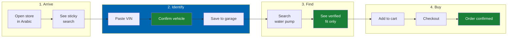
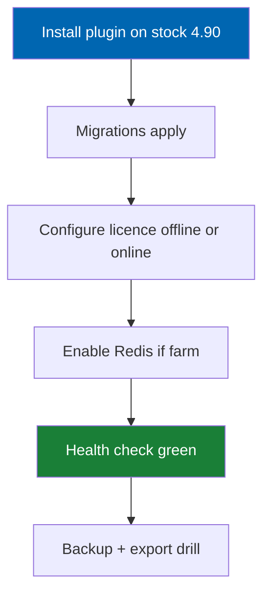
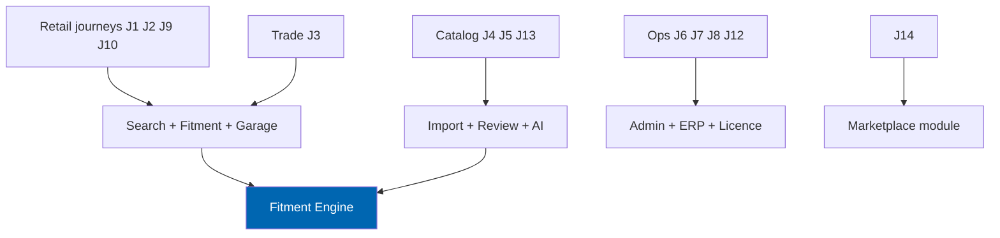

# 07 User Journey

> Fourteen end-to-end journeys that define how Check Engine delivers value — with stages, emotions,
> failure modes, instrumentation, and success criteria.

**Status:** Review · **Owner:** Product Owner · **Last revised:** 2026-07-28

**Engineering status (2026-08-25):** Plugin `0.104.0` is in tree. Progress, evidence gates (G1–G6 done; G11 packing partial), and remaining blockers (H1.35/G8, G7, G11 vendor signing, G12) are recorded in [EXECUTION-PLAN.md](../EXECUTION-PLAN.md). This document remains the specification baseline.

---

## Contents

- [Executive Summary](#executive-summary)
- [Objectives](#objectives)
- [Scope](#scope)
- [Detailed Specifications](#detailed-specifications)
  - [Journey inventory](#journey-inventory)
  - [J1 — Layla buys via VIN on mobile Arabic](#j1--layla-buys-via-vin-on-mobile-arabic)
  - [J2 — Hassan finds an aftermarket equivalent](#j2--hassan-finds-an-aftermarket-equivalent)
  - [J3 — Omar orders under time pressure](#j3--omar-orders-under-time-pressure)
  - [J4 — Nour imports a supplier catalog](#j4--nour-imports-a-supplier-catalog)
  - [J5 — Nour reviews low-confidence fitment](#j5--nour-reviews-low-confidence-fitment)
  - [J6 — Karim goes live and watches returns](#j6--karim-goes-live-and-watches-returns)
  - [J7 — Tarek resolves an ERP sync exception](#j7--tarek-resolves-an-erp-sync-exception)
  - [J8 — Dina installs and hardens](#j8--dina-installs-and-hardens)
  - [J9 — Layla returns and uses the garage](#j9--layla-returns-and-uses-the-garage)
  - [J10 — Zero-result recovery](#j10--zero-result-recovery)
  - [J11 — Wrong-fitment report](#j11--wrong-fitment-report)
  - [J12 — Licence grace and renewal](#j12--licence-grace-and-renewal)
  - [J13 — AI description enablement](#j13--ai-description-enablement)
  - [J14 — Supplier onboarding preview](#j14--supplier-onboarding-preview-horizon-3)
  - [Cross-journey instrumentation](#cross-journey-instrumentation)
- [Architecture](#architecture)
- [User Stories](#user-stories)
- [Acceptance Criteria](#acceptance-criteria)
- [Future Enhancements](#future-enhancements)
- [References](#references)

---

## Executive Summary

Journeys translate personas and requirements into observable paths through the product. Fourteen
journeys cover retail purchase, trade speed, catalog operations, integration, platform administration,
trust repair, and commercial lifecycle. Horizon 3 marketplace onboarding is included as a preview so
architecture does not paint itself into a single-supplier corner.

Each journey specifies: trigger, stages, emotional arc, failure modes, instrumentation events, and
success criteria. If a journey cannot be completed in a release candidate, the related Must
requirements are not done.

---

## Objectives

| # | Objective | Measure |
|---|---|---|
| 1 | Make UX and QA validate whole paths, not screens | Journey-based test protocols |
| 2 | Expose failure modes before customers do | Failure table per journey |
| 3 | Define analytics events for product learning | Event names stable for [30](30-analytics.md) |
| 4 | Tie journeys to FR/NFR gates | Success criteria cite IDs |

---

## Scope

### In scope

Fourteen journeys across Horizon 1–3 preview, with Mermaid stage maps.

### Out of scope

| Not covered | Where |
|---|---|
| Wireframe-level UI | [21](21-theme-design.md), [22](22-ui-design-system.md) |
| Exact API payloads | Module docs + [08](08-system-architecture.md) |
| Portal-only journeys | [46](46-workshop-portal.md)–[48](48-dealer-portal.md) |

---

## Detailed Specifications

### Journey inventory

| ID | Name | Primary persona | Horizon |
|---|---|---|---|
| J1 | VIN purchase Arabic mobile | Layla | 1 |
| J2 | Aftermarket equivalent | Hassan | 1 |
| J3 | Trade VIN rush order | Omar | 1 |
| J4 | Supplier catalog import | Nour | 1 |
| J5 | Fitment review queue | Nour | 1 |
| J6 | Go-live and return watch | Karim | 1 |
| J7 | ERP exception handling | Tarek | 1 |
| J8 | Install and harden | Dina | 1 |
| J9 | Returning garage shopper | Layla | 1 |
| J10 | Zero-result recovery | Layla / Omar | 1 |
| J11 | Wrong-fitment report | Layla → Nour | 1 |
| J12 | Licence grace / renewal | Karim / Dina | 1 |
| J13 | Enable AI descriptions | Nour / Karim | 2 |
| J14 | Supplier onboarding | Marketplace operator | 3 |

### J1 — Layla buys via VIN on mobile Arabic

**Trigger:** Check engine light; needs a water pump; has VIN on door sticker.

Satisfaction along the journey, scored 1 (frustrated) to 5 (delighted). The two lifts that matter are
vehicle confirmation and the verified-fit result set; both are the moments Check Engine exists to create.

| Step | Score | Why |
|---|---|---|
| Open store in Arabic | 3 | Neutral arrival; anxious about the fault |
| See sticky search | 4 | Obvious next action, no hunting |
| Paste VIN | 3 | Still uncertain the store will understand it |
| **Confirm vehicle** | **5** | The store named her exact car; relief |
| Save to garage | 5 | Will not have to repeat this |
| Search water pump | 4 | Focused results |
| **See verified fit only** | **5** | No guessing, no cross-referencing |
| Add to cart | 5 | Confident |
| Checkout | 4 | Standard friction |
| Order confirmed | 5 | Trust established for repeat purchase |

| Stage | System behaviour | FR / NFR |
|---|---|---|
| Paste VIN | Normalise, check digit, decode, candidates if needed | `FR-201`–`FR-206` |
| Confirm vehicle | Show configuration in Arabic | `FR-102`, `NFR-051` |
| Save garage | Persist active vehicle | `FR-701`, `FR-705` |
| Search | Fitment-filtered keyword results | `FR-407`, `NFR-001` |
| Product | Shows Fits | `FR-320` |
| Checkout | Standard nopCommerce + payment provider | `FR-950` |

**Emotional arc:** Anxiety → relief at recognition → confidence → completion.

**Failure modes**

| Failure | Handling |
|---|---|
| Invalid VIN | Clear reason; offer vehicle tree |
| Multiple candidates | Disambiguation UI, not silent pick |
| No water pump in catalog | Zero-result recovery (J10) |
| RTL layout break | Block release (`NFR-052`) |

**Success:** Paid order; active garage vehicle; all parts in order evaluated Fits.

**Instrumentation:** `vin_decode_submitted`, `vin_decode_succeeded`, `garage_vehicle_saved`, `search_with_context`, `purchase_with_context`.

### J2 — Hassan finds an aftermarket equivalent

**Trigger:** Has OEM `11517586925`; wants cheaper equivalent.

| Stage | Behaviour |
|---|---|
| OEM search | Resolve normalised number |
| Result | Show OEM product + aftermarket equivalents |
| Supersession | If obsolete, show current number |
| Label | Aftermarket clearly marked |
| Fitment | Still constrained if garage vehicle active |

**Failure modes:** Ambiguous OEM across manufacturers → require manufacturer qualifier (`FR-228`).

**Success:** Hassan can state why the equivalent is acceptable; no genuine-parts misrepresentation.

### J3 — Omar orders under time pressure

**Trigger:** Customer car on ramp; needs thermostat today.

**Success criterion:** ≤ 3 minutes VIN → cart on reference env (`AC-P.2` in [06](06-personas.md)).

**Failure modes:** Slow search (`NFR-001` fail); decode miss → manual tree within same time budget.

### J4 — Nour imports a supplier catalog

**Trigger:** New supplier Excel, ~10,000 rows.

| Stage | Pipeline stage | Outcome |
|---|---|---|
| Upload | ingest | Batch created |
| Map columns | extract / profile | Supplier profile saved |
| Dry run | all stages except publish | Report of matches / ambiguities |
| Execute | through review | High-confidence auto; low to queue |
| Publish | publish | Products + claims live |

**Success:** Meets `BR-018` / `FR-641` spirit on reference hardware for the pilot file size; zero manual entry for above-threshold rows.

**Failure modes:** Bad PDF OCR → batch error report; duplicate storm → merge UI (`FR-611`).

### J5 — Nour reviews low-confidence fitment

**Trigger:** Review queue depth > 0 after import or AI inference.

| Action | Result |
|---|---|
| Approve | Confidence raised / published; audit |
| Reject | Claim deactivated; audit |
| Request evidence | Stays queued |
| Safety-critical below threshold | Cannot approve without evidence path; hard stop still applies for auto-publish |

**Success:** No customer-visible below-threshold claims; audit complete (`FR-314`–`FR-316`).

### J6 — Karim goes live and watches returns

**Trigger:** Catalog published; marketing turned on.

| Stage | Need |
|---|---|
| Baseline | Capture pre-Check Engine return rate if migrating |
| 30 days | Monitor fitment-attributed returns |
| Decision | Expand brands or buy curation services |

**Instrumentation:** `order_completed_with_context`, `return_created`, `return_reason_fitment`.

**Success:** Fitment-attributed returns trending under 5% for contextualised orders (Vision objective 1).

### J7 — Tarek resolves an ERP sync exception

**Trigger:** Admin home shows sync exception.

| Stage | Behaviour |
|---|---|
| Open exception | See payload, error, entity links |
| Fix data or mapping | Retry idempotent sync |
| Confirm | Reconciliation report clean |

**Success:** Exception cleared; no duplicate Sales Order (`FR-810`–`FR-812`).

### J8 — Dina installs and hardens

**Success:** `FR-925`, health endpoints, runbook followed; no core file changes.

### J9 — Layla returns and uses the garage

**Trigger:** Needs brake pads weeks later.

| Stage | Behaviour |
|---|---|
| Sign in on new device | Garage syncs |
| Active vehicle already set | Catalog pre-filtered |
| Browse brakes | Verified fit only |

**Success:** No re-entry of VIN; conversion higher than cold visit (`FR-707`).

### J10 — Zero-result recovery

**Trigger:** Search yields zero in context.

| Offer | Purpose |
|---|---|
| Widen fitment filter (explicit) | Avoid dead end |
| Spelling / synonym suggestions | Arabic-English |
| Link to vehicle selector | Fix wrong context |
| Notify-me / contact trade desk | Operator option |

**Success:** Recovery click > dead abandon for benchmark queries (`FR-412`).

### J11 — Wrong-fitment report

**Trigger:** Customer or technician reports part did not fit.

| Stage | Behaviour |
|---|---|
| Submit report | Linked to order line + claim |
| Queue item | Nour reviews |
| Outcome | Correct claim; possibly recall visibility on PDP |

**Success:** Provenance updated; systemic error rate measurable (`FR-318`).

### J12 — Licence grace and renewal

**Trigger:** Validation unreachable or term expired.

| State | Storefront | Admin Check Engine |
|---|---|---|
| Grace (30 days offline) | Full | Full + warnings |
| Expired | Full commerce | Read-only config; AI/import/sync stop |

**Success:** No checkout interruption (`BR-038`, `FR-981`); Karim can renew without emergency.

### J13 — AI description enablement

**Trigger:** Horizon 2; Nour wants faster enrichment.

| Stage | Behaviour |
|---|---|
| Open AI feature toggle | Data disclosure shown |
| Enable descriptions | Still review-only publish |
| Ceiling set | Cost visible |

**Success:** `FR-501`–`FR-502`, `FR-520`, `FR-561`.

### J14 — Supplier onboarding preview (Horizon 3)

**Trigger:** Marketplace operator invites a supplier.

| Stage | Behaviour |
|---|---|
| Apply / verify | Onboarding workflow |
| List catalog | Isolated catalog |
| Fitment contribute | Reviewable attributed claims |
| Get paid | Payout statement |

**Success criteria** deferred to Horizon 3 exit in [ROADMAP.md](../ROADMAP.md); journey exists to keep
`FR-850`+ architecturally honest.

### Cross-journey instrumentation

| Event | Journeys | Purpose |
|---|---|---|
| `vin_decode_succeeded` | J1, J3, J9 | Funnel |
| `search_with_context` | J1, J3, J9, J10 | Relevance |
| `fitment_review_action` | J5, J11 | Quality ops |
| `import_batch_published` | J4 | Catalog velocity |
| `erp_sync_exception_resolved` | J7 | Ops health |
| `purchase_with_context` | J1, J3, J9 | North-star |
| `return_reason_fitment` | J6, J11 | Thesis validation |
| `licence_state_changed` | J12 | Commercial health |

Full taxonomy in [30 Analytics](30-analytics.md).

---

## Architecture

Journeys map to systems without prescribing UI chrome:

---

## User Stories

| ID | Journey | Story spine | Priority |
|---|---|---|---|
| `US-601` | J1 | Layla completes Arabic VIN purchase on mobile | Must |
| `US-602` | J3 | Omar reaches verified cart in ≤ 3 minutes | Must |
| `US-603` | J4 | Nour publishes high-confidence rows without retyping | Must |
| `US-604` | J5 | Nour cannot auto-publish safety-critical low confidence | Must |
| `US-605` | J12 | Karim's store keeps selling after licence expiry | Must |
| `US-606` | J11 | Wrong-fit report becomes audited claim change | Must |
| `US-607` | J13 | AI enablement shows disclosure first | Should |
| `US-608` | J14 | Supplier lists without seeing others' data | Should |

---

## Acceptance Criteria

**`AC-J1.1`** — Given Layla's VIN for a supported BMW configuration, when she completes J1 on mobile Arabic, then the order contains only Fits parts and garage has the vehicle active.

**`AC-J3.1`** — Given Omar's rush scenario on reference env, when timing J3, then VIN to cart ≤ 3 minutes.

**`AC-J4.1`** — Given the Phase 3 pilot supplier file, when J4 completes, then above-threshold rows require zero manual field entry.

**`AC-J5.1`** — Given a below-threshold brake-pad claim, when any publish API is invoked, then the server rejects and audits.

**`AC-J12.1`** — Given an expired licence, when a customer checks out, then payment succeeds; when admin opens Check Engine settings, then they are read-only.

**`AC-J10.1`** — Given a zero-result contextual search from the benchmark set, when the results page renders, then at least one recovery action is presented.

---

## Future Enhancements

| Journey | Horizon |
|---|---|
| Workshop job-based ordering | 4 |
| Fleet register bulk maintenance | 4 |
| Dealer allocation conflict | 4 |
| SaaS tenant provisioning | 5 |

---

## References

- [06 Personas](06-personas.md)
- [02 Functional Requirements](02-functional-requirements.md)
- [03 Non-Functional Requirements](03-non-functional-requirements.md)
- [20 Customer Garage](20-customer-garage.md)
- [24 Product Import Pipeline](24-product-import-pipeline.md)
- [30 Analytics](30-analytics.md)
- [ROADMAP.md](../ROADMAP.md)
