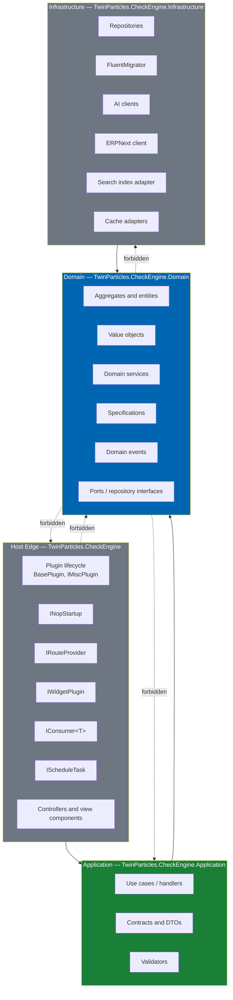
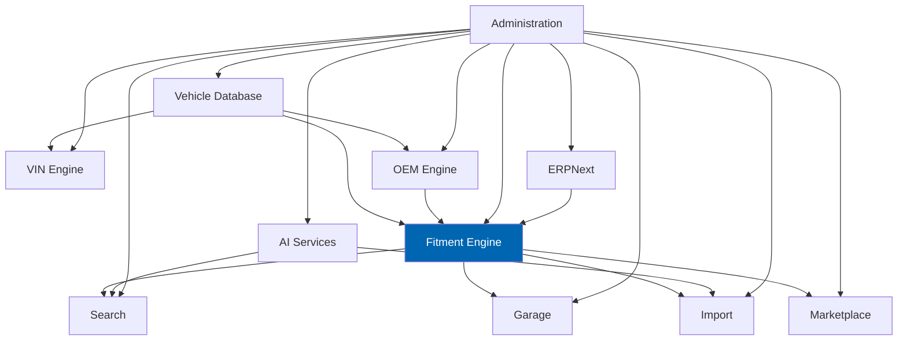
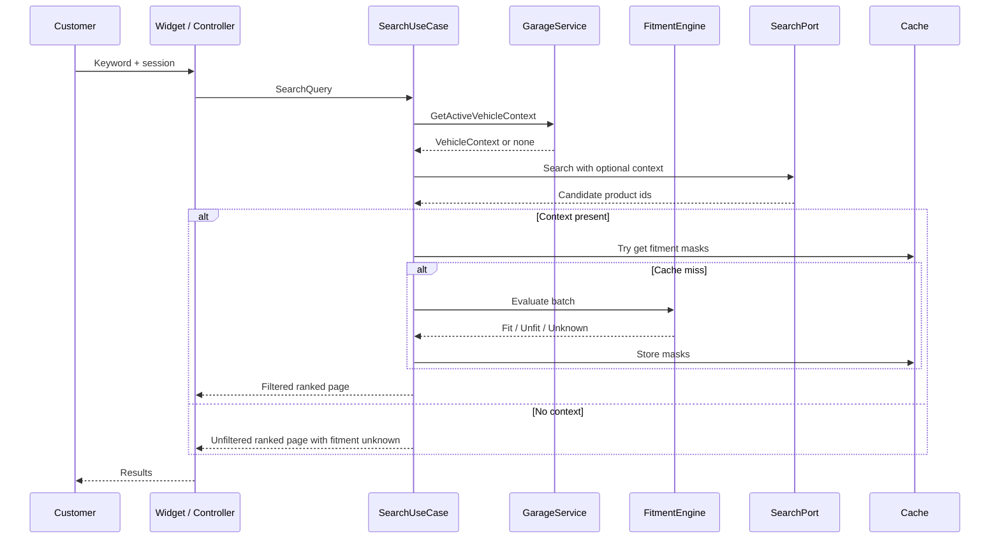
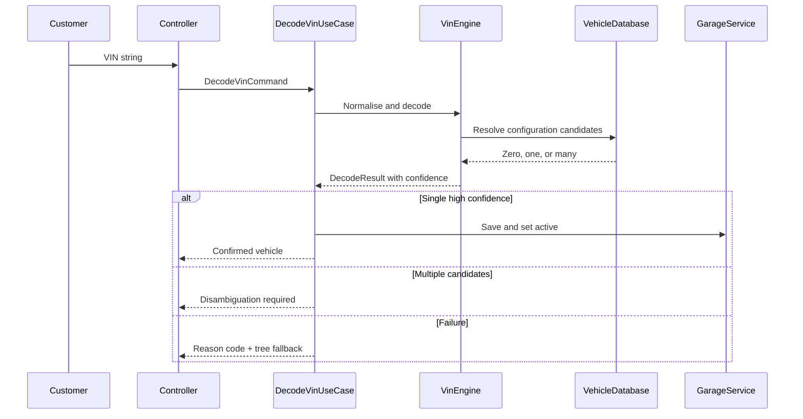
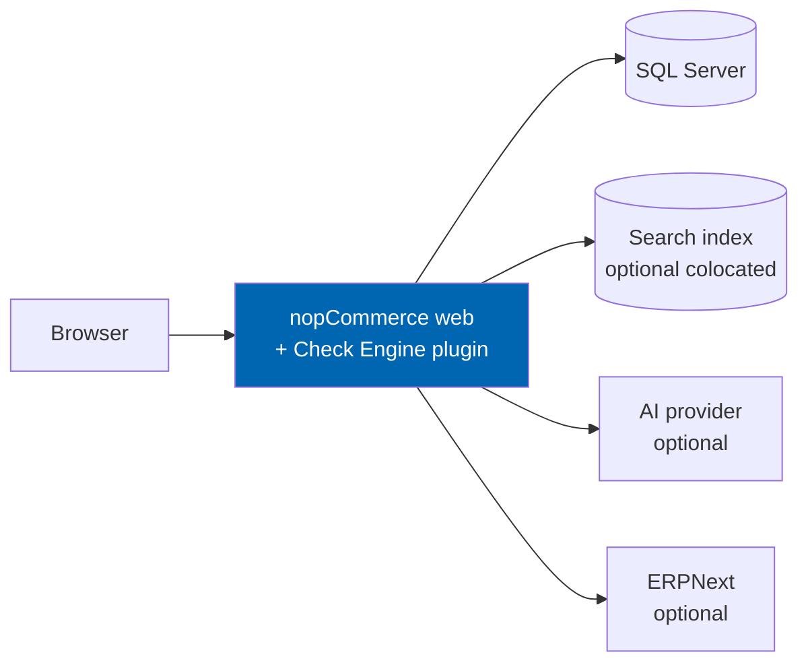
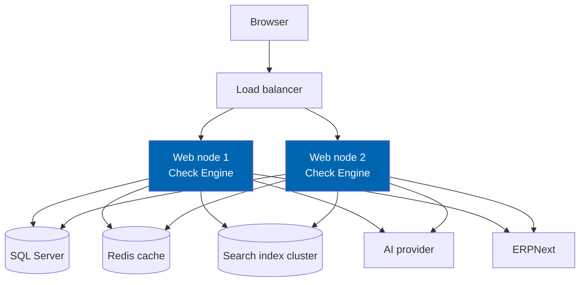
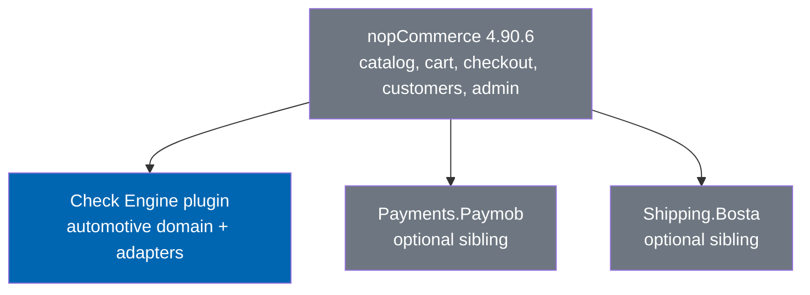

# 08 System Architecture

> The layered structure of Check Engine, its module boundaries, dependency rules, deployment
> topology, and the public surface it exposes to the host and to operators.

**Status:** Review · **Owner:** Architecture Owner · **Last revised:** 2026-07-28

**Engineering status (2026-08-25):** Plugin `0.104.0` is in tree. Progress, evidence gates (G1–G6 done; G11 packing partial), and remaining blockers (H1.35/G8, G7, G11 vendor signing, G12) are recorded in [EXECUTION-PLAN.md](../EXECUTION-PLAN.md). This document remains the specification baseline.

---

## Contents

- [Executive Summary](#executive-summary)
- [Objectives](#objectives)
- [Scope](#scope)
- [Detailed Specifications](#detailed-specifications)
  - [Architectural style](#architectural-style)
  - [Layering and dependency rules](#layering-and-dependency-rules)
  - [Module map](#module-map)
  - [Cross-cutting concerns](#cross-cutting-concerns)
  - [Request and resolution flows](#request-and-resolution-flows)
  - [Deployment topology](#deployment-topology)
  - [Public API surface](#public-api-surface)
  - [Architecture decision records](#architecture-decision-records)
- [Architecture](#architecture)
- [User Stories](#user-stories)
- [Acceptance Criteria](#acceptance-criteria)
- [Future Enhancements](#future-enhancements)
- [References](#references)

---

## Executive Summary

Check Engine is a **single commercial nopCommerce plugin** (`TwinParticles.CheckEngine`) that adds an
automotive domain layer to a stock 4.90.6 host. The architecture is Clean Architecture adapted to
nopCommerce's plugin model: a domain core with no platform dependency, an application layer of use
cases, an infrastructure layer that talks to SQL Server and external systems, and a thin host-edge
layer that implements nopCommerce extension points.

Five things a reader must take away:

1. **Fitment is the centre.** Every storefront, search, and catalog path eventually asks the fitment
   engine whether a part applies to a vehicle. That engine is a domain service with no UI and no
   nopCommerce reference.
2. **The domain does not reference nopCommerce.** Portability and unit-testability are structural
   properties, not aspirations (`ADR-007`).
3. **One plugin owns the automotive surface.** Payment and shipping remain separate plugins
   (`ADR-005`). Check Engine never ships a payment gateway.
4. **AI and ERP are adapters.** Both sit behind interfaces in the domain or application layer; both
   are optional at runtime; neither may authorise fitment (`ADR-008`).
5. **Horizon 1 exposes host-internal APIs.** A versioned public REST API is Horizon 5 work; until
   then, external systems integrate through ERPNext sync and documented internal services.

This document is the structural source of truth. Plugin packaging and nopCommerce wiring live in
[09](09-plugin-architecture.md). Tables live in [10](10-database-design.md). Aggregates and invariants
live in [11](11-domain-model.md). Engineering rules live in [34](34-coding-standards.md).

---

## Objectives

| # | Objective | Traces to | Measure |
|---|---|---|---|
| 1 | Define layers and dependency rules that two engineers can enforce in review | `BR-015`, `BR-042` | Zero upward references from Domain to Host; CI analyser rule passes |
| 2 | Bound every Horizon 1 module so ownership is unambiguous | `BR-001`–`BR-012` | Module map covers all Must FRs in Blocks 100–900 |
| 3 | Specify deployment shapes that meet the NFR budgets | `NFR-001`–`NFR-032` | Topology diagrams match [03](03-non-functional-requirements.md) reference env |
| 4 | Separate host-internal contracts from future public API | `BR-042` | Public API section states Horizon 5 explicitly; no v1.0 public REST commitment |
| 5 | Record rejected alternatives so the same debates do not reopen | `ADR-001`–`ADR-010` | Rejected table present and cited |

---

## Scope

### In scope

- Logical architecture of Check Engine on nopCommerce 4.90.6 / .NET 9
- Layer responsibilities, dependency rules, and allowed exceptions
- Module boundaries and inter-module contracts at the interface level
- Cross-cutting concerns: caching, events, background work, localisation, licensing hooks
- Deployment topologies for single-node and web-farm
- Host-internal API surface for Horizon 1 and the Horizon 5 public API sketch
- Architecture decisions that affect structure (`ADR-001`–`ADR-010` and Phase 2 additions)

### Out of scope

| Not covered | Where |
|---|---|
| Project folder layout, `plugin.json`, FluentMigrator class names | [09 Plugin Architecture](09-plugin-architecture.md) |
| Table DDL, indexes, migration versioning | [10 Database Design](10-database-design.md) |
| Aggregate invariants and value objects | [11 Domain Model](11-domain-model.md) |
| C# naming, analysers, CQRS conventions | [34 Coding Standards](34-coding-standards.md) |
| Per-engine algorithms (VIN, OEM, fitment, search) | Documents [12](12-vehicle-database.md)–[16](16-search-engine.md) |
| Security control catalogue | [28 Security](28-security.md) |
| CI pipeline YAML | [33 CI-CD](33-ci-cd.md) |

### Assumptions

- The host has completed Horizon 0 (platform on 4.90.6) before Check Engine is installed.
- SQL Server 2019+ remains the system of record; current browser verification uses PostgreSQL 16 in Podman with local Chromium and does not alter the production storage target.
- Operators may disable AI and ERP independently; the storefront remains functional.
- Separate Paymob and Bosta plugins may or may not be installed; Check Engine does not require them.

### Dependencies

[00](00-vision.md), [01](01-business-requirements.md), [02](02-functional-requirements.md),
[03](03-non-functional-requirements.md), [ROADMAP.md](../ROADMAP.md), [README.md](../README.md).

---

## Detailed Specifications

### Architectural style

Check Engine uses **Clean Architecture** with **Domain-Driven Design** in the automotive core, and
**pragmatic adapters** at the nopCommerce edge.

| Style element | How it applies |
|---|---|
| Dependency rule | Source code dependencies point inward. Domain has zero project references to nopCommerce, ASP.NET, or infrastructure packages beyond BCL and agreed shared kernels |
| DDD | Aggregates for Vehicle Configuration, OEM Number, Fitment Claim, Garage, Import Batch. Domain services for Fitment Evaluation, VIN Decode, OEM Resolve |
| CQRS where useful | Read models for search and vehicle tree; write models for catalog mutation and fitment approval. Not a bus-heavy CQRS product — see [34](34-coding-standards.md#cqrs-boundaries) |
| Ports and adapters | AI, ERPNext, and search index are ports (interfaces) implemented in Infrastructure |
| Host edge | Controllers, widgets, admin views, `IConsumer`, `IScheduleTask`, and `INopStartup` live in the Host project and call Application services only |

This is not a microservices architecture. Horizon 1–3 ship as one deployable plugin inside one
nopCommerce process. Multi-tenant SaaS process isolation is Horizon 5 (`BR-042`, [49](49-saas-roadmap.md)).

### Layering and dependency rules

**Hard rules**

| Rule | Enforcement |
|---|---|
| Domain references no nopCommerce assembly | Project reference ban + CI `CheckEngine.Architecture` tests |
| Application references Domain only among Check Engine projects | Same |
| Infrastructure implements Domain ports; does not call Application | Same |
| Host Edge may reference Application and Infrastructure for DI composition only | Composition root exception documented in [09](09-plugin-architecture.md) |
| No Check Engine project references Paymob or Bosta | Separate plugins; communication only through nopCommerce payment/shipping abstractions |

**Allowed pragmatic exceptions** (must be named in code review)

| Exception | Why allowed | Guardrail |
|---|---|---|
| Host Edge maps nopCommerce `Product` / `Customer` / `Order` IDs into domain value objects | Catalog commerce remains in the host | Mapping lives in Application or Host adapters, never inside Domain entities |
| Infrastructure uses `IRepository<T>` from nopCommerce data layer for Check Engine entities | Avoids a second ORM (`ADR-011`) | Domain still sees only Domain ports; LinqToDB types do not leak upward |
| Shared localisation resource keys registered via host services | nopCommerce owns the localisation pipeline | Domain messages use domain error codes; host maps codes to locale strings |

### Module map

Modules are logical, not separate plugins. Physical folders follow feature folders inside each layer
([09](09-plugin-architecture.md), [34](34-coding-standards.md)).

| Module | Owns | Depends on | Horizon |
|---|---|---|---|
| **Vehicle Database** | Makes, models, generations, bodies, engines, markets, configurations | — | 1 |
| **VIN Engine** | Normalisation, check digit, WMI/VDS/VIS decode, confidence, candidates | Vehicle Database | 1 |
| **OEM Engine** | Number normalisation, manufacturer qualification, cross-refs, supersessions | Vehicle Database (optional context) | 1 |
| **Fitment Engine** | Claims, confidence, provenance, safety class, evaluation API | Vehicle, OEM | 1 |
| **Search** | Six-mode query contract, fitment-constrained result sets, index projection | Fitment, Vehicle, OEM | 1 |
| **Garage** | Saved vehicles, VINs, OEMs, active context | Vehicle, VIN | 1 |
| **Import Pipeline** | File ingest, normalisation, matching, review queue hand-off | OEM, Fitment, Vehicle | 1 |
| **AI Services** | Description, SEO, translation, query parse, recommendations | Ports only; review gates | 1 (disabled default) / 2 |
| **ERPNext** | Bi-directional sync jobs and conflict policy | Application events | 1 |
| **Marketplace** | Vendor, commission, multi-supplier listing | Fitment, Catalog | 3 |
| **Administration** | Settings, licence hooks, permissions, diagnostics | All | 1 |
| **Theme / Storefront widgets** | Presentation only; no domain logic | Application read models | 1 |

### Cross-cutting concerns

| Concern | Approach | Document |
|---|---|---|
| **Caching** | Fitment results and vehicle trees use short TTL plus explicit invalidation on claim or vehicle mutation. Web-farm uses Redis via host cache manager | [29](29-performance.md) |
| **Domain events** | Raised inside aggregates; dispatched after successful unit of work. Host consumers translate to nopCommerce notifications or index updates | [11](11-domain-model.md) |
| **Background work** | `IScheduleTask` for import batches, ERP sync, index rebuild, licence heartbeat | [09](09-plugin-architecture.md) |
| **Localisation** | Arabic and English resource packs; domain returns stable codes | [03](03-non-functional-requirements.md) `NFR-051`–`NFR-056` |
| **Licensing** | Heartbeat and entitlement checks never disable storefront checkout (`ADR-009`, `BR-038`) | [43](43-licensing.md) |
| **Audit** | Fitment approval, import publish, settings change write audit records | [28](28-security.md), [31](31-logging.md) |
| **Observability** | Structured logs with correlation id; metrics for decode, fitment, search latency | [30](30-analytics.md), [31](31-logging.md) |
| **Feature flags** | AI modules, ERP sync, marketplace — settings with safe defaults | [09](09-plugin-architecture.md) |

### Request and resolution flows

#### Storefront search with active garage vehicle

#### VIN decode to garage

Budgets for these paths are `NFR-001` (search), `NFR` VIN ≤ 40 ms local, fitment ≤ 20 ms cached /
≤ 50 ms uncached — see [03](03-non-functional-requirements.md).

### Deployment topology

#### Single-node (reference and small operators)

#### Web farm (larger operators)

**Topology rules**

| Rule | Rationale |
|---|---|
| Plugin binaries identical on every web node | No sticky-session requirement for Check Engine logic |
| Fitment and vehicle-tree caches must use distributed cache in farm mode | Stale local cache causes wrong fitment display (`RISK-07`) |
| Background tasks run on a single designated node or via host task locking | Prevents duplicate ERP posts and duplicate import commits |
| Search index is eventually consistent; product page fitment evaluation is authoritative | Index speed vs claim correctness |

### Public API surface

#### Horizon 1 — host-internal

Horizon 1 does **not** publish a versioned public REST API for third parties. Integration surfaces are:

| Surface | Audience | Stability |
|---|---|---|
| Application service interfaces (`IFitmentEvaluationService`, `IVinDecodeService`, …) | Theme, widgets, other plugins in-process | Semantic versioned with the plugin |
| Admin MVC / AJAX endpoints under Check Engine routes | Operators | Authenticated; CSRF-protected |
| Storefront AJAX endpoints for garage, decode, fitment badge | Theme and customers | Session/customer auth as applicable |
| ERPNext sync | External ERP | Documented in [18](18-erpnext-integration.md) |
| Domain events → consumers | In-process extensions | Not a public contract |

#### Horizon 5 — public REST sketch

Reserved for SaaS and partner integrations ([49](49-saas-roadmap.md)). Design constraints fixed now so
Horizon 1 schema does not paint us into a corner:

| Constraint | Decision |
|---|---|
| Style | REST JSON over HTTPS; OpenAPI 3 |
| Auth | OAuth2 client credentials + per-tenant API keys |
| Versioning | URL path `/api/v1/...` |
| Resources (planned) | Vehicles, VIN decode, OEM resolve, Fitment evaluate, Garage (customer-scoped) |
| Idempotency | Required on write endpoints via `Idempotency-Key` |
| Rate limiting | Per key; defaults in [28](28-security.md) |
| Fitment authority | Same engine as storefront; never a separate AI path |

No Horizon 1 code may invent an ad-hoc public API that bypasses these constraints.

### Architecture decision records

Phase 1 ADRs that shape this document:

| ID | Decision |
|---|---|
| `ADR-001` | Target nopCommerce 4.90.6 on .NET 9 |
| `ADR-002` | Budget .NET 10 retargeting |
| `ADR-003` | Curate vehicle/fitment data in-house |
| `ADR-004` | Market-agnostic core; regional payment/shipping plugins |
| `ADR-005` | One Check Engine plugin; separate Paymob/Bosta |
| `ADR-007` | Domain layer has no nopCommerce dependency |
| `ADR-008` | AI augments; never authorises |
| `ADR-009` | Licence expiry must not kill storefront |
| `ADR-010` | Hyphenated doc filenames |

Phase 2 additions:

| ID | Decision | Alternatives rejected |
|---|---|---|
| `ADR-011` | Use nopCommerce `IRepository<T>` / LinqToDB for Check Engine tables rather than introducing EF Core beside the host | Second ORM doubles migration and transaction complexity |
| `ADR-012` | Composition root in Host (`INopStartup`) may reference Infrastructure; all other Host code talks to Application only | Letting controllers new up repositories |
| `ADR-013` | Fitment evaluation is synchronous in the request path for product and search filter; batch re-evaluation is asynchronous | Making all fitment async-only (breaks badge latency budgets) |
| `ADR-014` | Search index is a projection, not the system of record for fitment | Serving fitment solely from the index |

Full narrative for each ADR will be collated in [Appendix](appendix.md); the identifiers above are
normative from this revision.

---

## Architecture

### Rejected alternatives

| Alternative | Rejected because |
|---|---|
| Microservices for VIN / Fitment / Search in v1.0 | Operational cost exceeds benefit for a plugin sold to mid-market operators; NFR latency budgets favour in-process calls |
| Shared "Common" library referenced by Domain and Host with nopCommerce types | Immediately violates `ADR-007` |
| MediatR-only application layer with no explicit module folders | Obscures module ownership for a product this size; CQRS handlers are allowed inside feature folders, not as the only organising principle |
| Embedding Paymob/Bosta inside Check Engine | Violates `ADR-004` / `ADR-005`; couples global SKU to one market |
| Public REST in Horizon 1 | No partner programme yet; would freeze contracts before fitment semantics stabilise |

### Relationship to the host

Check Engine **never** patches files under `src/Libraries` or `src/Presentation`. All integration is
through documented extension points listed in [README.md](../README.md#platform-extension-points-used)
and detailed in [09](09-plugin-architecture.md).

---

## User Stories

| ID | Persona | Story | Points | Priority |
|---|---|---|---|---|
| `US-201` | Solution architect | Understand layer boundaries so reviews can reject illegal references | 5 | Must |
| `US-202` | Backend engineer | Know which module owns a change before opening a PR | 3 | Must |
| `US-203` | Ops engineer | Deploy Check Engine on a two-node farm with Redis without silent cache skew | 5 | Must |
| `US-204` | Partner engineer | Know that no public REST API is supported in v1.0 and what to use instead | 2 | Must |
| `US-205` | Security reviewer | See where AI and licence checks sit so they cannot disable checkout | 3 | Must |

---

## Acceptance Criteria

**`AC-08.1`** — Domain isolation
Given the `TwinParticles.CheckEngine.Domain` project, when its project references and analyser rules are evaluated, then it references no nopCommerce, ASP.NET Core MVC, or Infrastructure assembly.

**`AC-08.2`** — Module coverage
Given the module map in this document, when mapped against Must-priority Horizon 1 FRs in [02](02-functional-requirements.md), then every such FR is owned by exactly one module.

**`AC-08.3`** — Farm cache
Given two web nodes with Redis configured, when a fitment claim is approved on node A, then node B serves the updated evaluation within the invalidation SLA defined in [29](29-performance.md).

**`AC-08.4`** — No public API surprise
Given a clean v1.0 install, when an unauthenticated client probes `/api/v1/*` Check Engine routes, then no such public resource exists (404), and admin/storefront AJAX routes remain authentication-protected.

**`AC-08.5`** — Licence non-interference
Given an expired licence, when a customer completes checkout of an in-stock fitting part, then the order completes; only administrative mutation and background enrichment features degrade.

---

## Future Enhancements

| Enhancement | Horizon | Notes |
|---|---|---|
| Versioned public REST + webhooks | 5 | Sketch constrained above |
| Tenant-isolated process or schema mode | 5 | [49](49-saas-roadmap.md) |
| Optional read replica for heavy search | 2+ | If `NFR` search budgets fail at scale |
| Workshop / fleet / dealer API profiles | 4 | Documents 46–48 |

---

## References

- [00 Vision](00-vision.md) — product thesis and system context
- [02 Functional Requirements](02-functional-requirements.md) — behaviour inventory
- [03 Non-Functional Requirements](03-non-functional-requirements.md) — budgets
- [09 Plugin Architecture](09-plugin-architecture.md) — host wiring
- [10 Database Design](10-database-design.md) — schema
- [11 Domain Model](11-domain-model.md) — aggregates
- [34 Coding Standards](34-coding-standards.md) — engineering rules
- [README.md](../README.md) — packaging and extension points
- [ROADMAP.md](../ROADMAP.md) — horizons
- [CHANGELOG.md](../CHANGELOG.md) — ADR table
