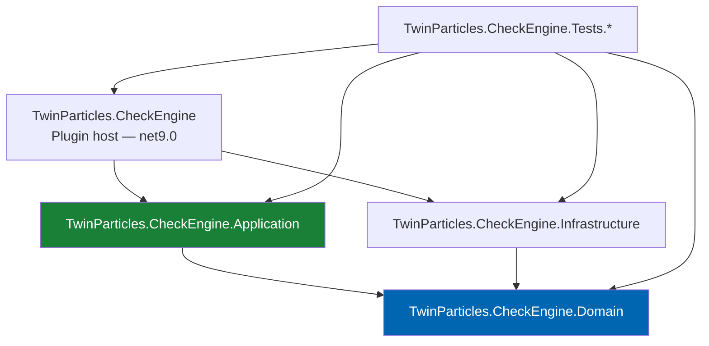
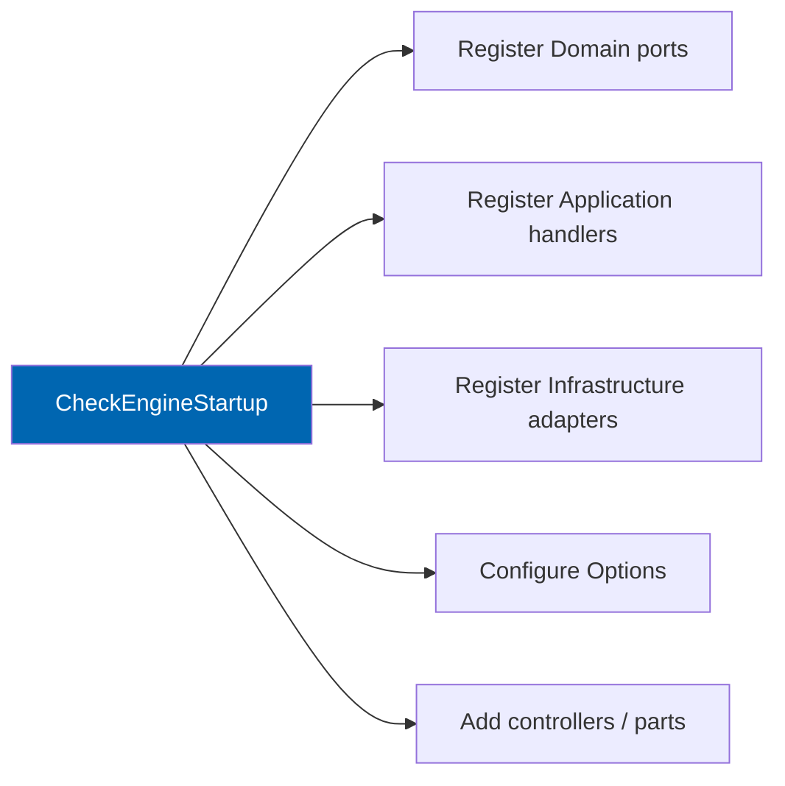
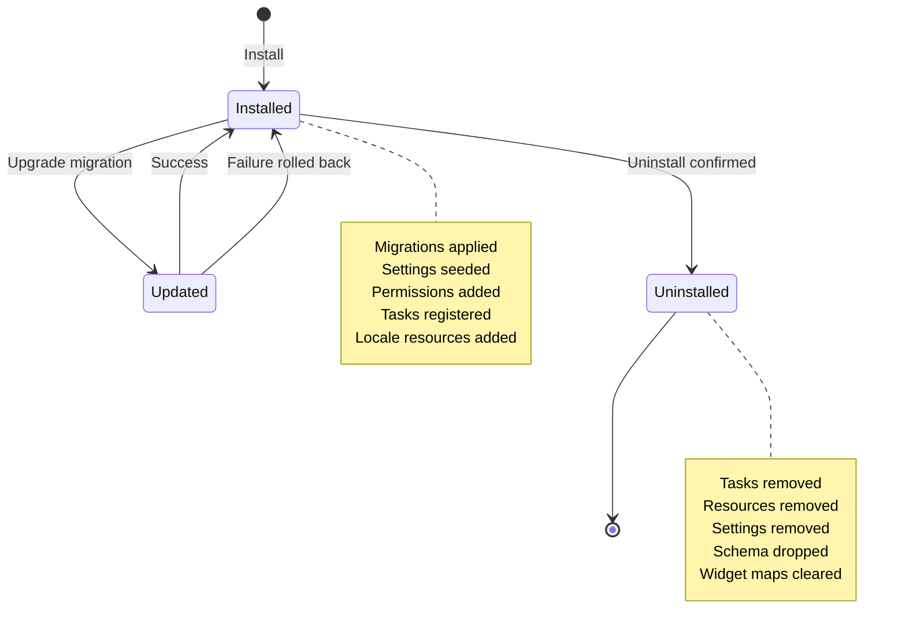
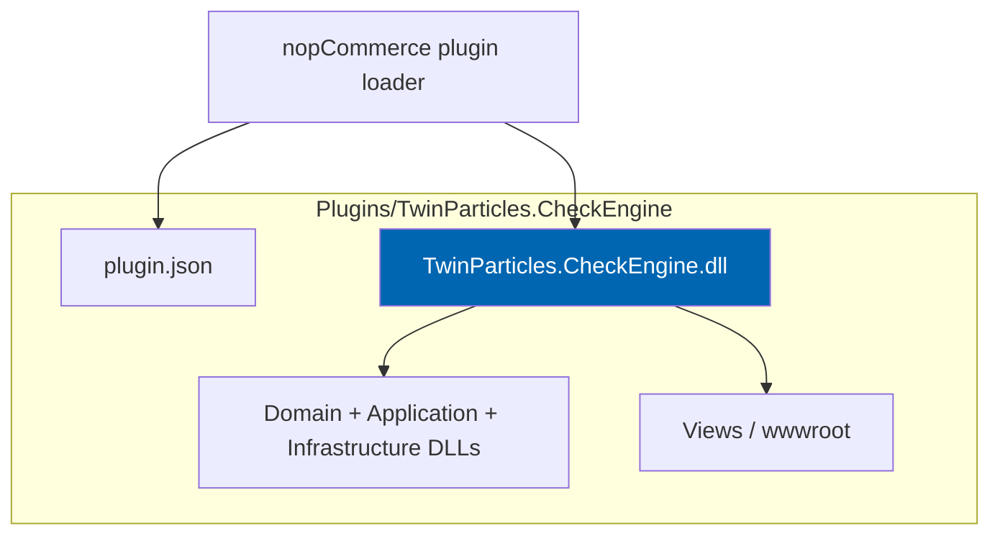

# 09 Plugin Architecture

> How Check Engine packages itself as a nopCommerce 4.90.6 plugin: projects, folders, DI, migrations,
> routes, widgets, consumers, tasks, and the install/uninstall lifecycle.

**Status:** Review · **Owner:** Architecture Owner · **Last revised:** 2026-08-25

**Engineering status (2026-08-25):** Plugin `0.104.0` is in tree. Progress, evidence gates (G1–G6 done; G11 packing partial), and remaining blockers (H1.35/G8, G7, G11 vendor signing, G12) are recorded in [EXECUTION-PLAN.md](../EXECUTION-PLAN.md). This document remains the specification baseline.

---

## Contents

- [Executive Summary](#executive-summary)
- [Objectives](#objectives)
- [Scope](#scope)
- [Detailed Specifications](#detailed-specifications)
  - [Solution and project structure](#solution-and-project-structure)
  - [Feature folder layout](#feature-folder-layout)
  - [plugin.json and assembly identity](#pluginjson-and-assembly-identity)
  - [Release packing](#release-packing)
  - [Dependency injection](#dependency-injection)
  - [Database migrations](#database-migrations)
  - [Routing](#routing)
  - [Widgets and view components](#widgets-and-view-components)
  - [Event consumers](#event-consumers)
  - [Schedule tasks](#schedule-tasks)
  - [Settings and configuration](#settings-and-configuration)
  - [Localisation resources](#localisation-resources)
  - [Permissions](#permissions)
  - [Install, update, and uninstall](#install-update-and-uninstall)
  - [Assembly and dependency management](#assembly-and-dependency-management)
  - [Sibling plugins](#sibling-plugins)
- [Architecture](#architecture)
- [User Stories](#user-stories)
- [Acceptance Criteria](#acceptance-criteria)
- [Future Enhancements](#future-enhancements)
- [References](#references)

---

## Executive Summary

Check Engine ships as **one misc plugin** whose system name is `TwinParticles.CheckEngine`. It
implements the nopCommerce extension points listed in [README.md](../README.md) without modifying host
source. Logical architecture is defined in [08](08-system-architecture.md); this document specifies the
**physical plugin shape** an engineer clones, builds, installs, and supports.

Takeaways:

1. **Four projects** — Domain, Application, Infrastructure, Host (plugin entry) — map 1:1 to the
   Clean Architecture layers.
2. **Composition root is `CheckEngineStartup : INopStartup`.** Only here may Infrastructure concrete
   types be registered (`ADR-012`).
3. **Schema changes are FluentMigrator migrations** versioned with the plugin, never ad-hoc SQL in
   Install methods beyond calling the migrator.
4. **Uninstall is complete.** Tables, settings, locale resources, permissions, schedule tasks, and
   widget mappings are removed when the operator confirms (`FR-925`, `AC-FR.4`).
5. **Paymob and Bosta are never referenced** by this plugin's csproj files (`ADR-005`).

---

## Objectives

| # | Objective | Traces to | Measure |
|---|---|---|---|
| 1 | Define a buildable project graph that enforces layering | `BR-015`, `ADR-007` | Architecture tests pass on CI |
| 2 | Specify every nopCommerce extension point Check Engine uses | `FR-900`–`FR-925` | Checklist in Acceptance Criteria |
| 3 | Make install/update/uninstall deterministic and reversible | `FR-925`, `NFR-057` | Clean uninstall AC passes |
| 4 | Keep third-party package versions compatible with the 4.90.6 host | `RISK-03` | Dependency policy table enforced |
| 5 | Isolate regional payment/shipping from the core package | `BR-026`, `ADR-004` | Zero project references to sibling plugins |

---

## Scope

### In scope

- Visual Studio / SDK-style project layout under the nopCommerce plugin directory
- `plugin.json`, assembly naming, and versioning alignment with SemVer
- DI registration, middleware hooks, and options binding
- Migrations, routes, widgets, consumers, schedule tasks, permissions, locale resources
- Install, update, uninstall behaviour
- NuGet and transitive dependency policy
- Contract with sibling payment/shipping plugins (absence of coupling)

### Out of scope

| Not covered | Where |
|---|---|
| Layer semantics and module map | [08](08-system-architecture.md) |
| Table definitions | [10](10-database-design.md) |
| Domain invariants | [11](11-domain-model.md) |
| C# style and analysers | [34](34-coding-standards.md) |
| Theme Razor beyond widget contracts | [21](21-theme-design.md) |
| CI build matrix | [33](33-ci-cd.md) |
| Marketplace listing assets | [42](42-marketplace-publishing.md) |

### Assumptions

- Plugin path: `src/Plugins/TwinParticles.CheckEngine/` (Host) with sibling class-library projects either
  under the same folder or in `src/Plugins/TwinParticles.CheckEngine.*` as specified below.
- Host is nopCommerce 4.90.6; plugin `SupportedVersions` includes `4.90`.
- Build uses the host's target framework (`net9.0`).

### Dependencies

[08](08-system-architecture.md), [10](10-database-design.md), [34](34-coding-standards.md),
[LICENSE.md](../LICENSE.md), [CONTRIBUTING.md](../CONTRIBUTING.md).

---

## Detailed Specifications

### Solution and project structure



| Project | Output | Role |
|---|---|---|
| `TwinParticles.CheckEngine.Domain` | Class library | Aggregates, value objects, domain services, ports |
| `TwinParticles.CheckEngine.Application` | Class library | Use cases, validators, application DTOs, mapping abstractions |
| `TwinParticles.CheckEngine.Infrastructure` | Class library | Repositories, migrations, AI/ERP/search adapters |
| `TwinParticles.CheckEngine` | Plugin (copied to `Plugins/TwinParticles.CheckEngine`) | `BasePlugin`, startup, controllers, views, `plugin.json` |
| `TwinParticles.CheckEngine.Tests.Unit` | Test | Domain and application unit tests |
| `TwinParticles.CheckEngine.Tests.Integration` | Test | Migrations, repositories, host smoke |
| `TwinParticles.CheckEngine.Tests.E2E` | Test | Playwright install/home/search/sample PDP smoke |
| `TwinParticles.CheckEngine.Tests.Architecture` | Test | NetArchTest / custom reference rules |

**Directory placement (normative)**

```text
src/Plugins/
  TwinParticles.CheckEngine/                 ← Host (plugin root)
    plugin.json
    TwinParticles.CheckEngine.csproj
    Controllers/
    Views/
    Components/
    Consumers/
    Infrastructure/                         ← Host-only wiring (startup, route provider)
    wwwroot/
  TwinParticles.CheckEngine.Domain/
  TwinParticles.CheckEngine.Application/
  TwinParticles.CheckEngine.Infrastructure/
tests/
  TwinParticles.CheckEngine.Tests.Unit/
  TwinParticles.CheckEngine.Tests.Integration/
  TwinParticles.CheckEngine.Tests.Architecture/
```

Libraries are referenced by the Host project and **copied to the plugin output directory** on build so
nopCommerce's plugin loader finds a self-contained folder. Build targets for copy are defined in the
Host csproj (same pattern as official nopCommerce plugins that ship extra assemblies).

### Feature folder layout

Inside Application, Domain, and Infrastructure, organise by **feature**, not by technical type alone.

```text
Application/
  Vehicle/
  Vin/
  Oem/
  Fitment/
  Search/
  Garage/
  Import/
  Ai/
  Erp/
  Admin/
Domain/
  Vehicle/
  Vin/
  Oem/
  Fitment/
  Garage/
  Import/
  Shared/          ← cross-feature value objects, error codes
Infrastructure/
  Persistence/
  Migrations/
  Ai/
  Erp/
  Search/
  Caching/
```

Controllers in the Host may group by area (`Admin` / `Public`) but action methods call Application
services that live in the matching feature folder.

### plugin.json and assembly identity

| Field | Value |
|---|---|
| `Group` | `Misc` |
| `FriendlyName` | `Check Engine` |
| `SystemName` | `TwinParticles.CheckEngine` |
| `Version` | SemVer aligned with assembly metadata (`PluginMetadataContractTests`). In-tree engineering builds use `0.104.0`; GA begins at `1.0.0` |
| `SupportedVersions` | `[ "4.90" ]` |
| `Author` | `Twin Particles` |
| `DisplayOrder` | `1` |
| `FileName` | `TwinParticles.CheckEngine.dll` |
| `Description` | Short marketplace blurb; full text in [42](42-marketplace-publishing.md) |

Assembly version, file version, and `plugin.json` Version **must match** on release builds. CI fails
the build if they diverge.

### Release packing

Operator rehearsal: `CheckEngine/scripts/pack-checkengine.sh|.ps1` (Python `pack-checkengine.py`)
emits `TwinParticles.CheckEngine.{version}.zip` plus SHA-256. Zip root is
`TwinParticles.CheckEngine/`. The allow-list is Check Engine layer DLLs, `plugin.json`, `Content/`,
and `Views/` — not host `Nop.Web`, `App_Data`, native `runtimes`, or symbols. The artefact is
unsigned; production licence vendor signing remains the external G11 remainder ([33](33-ci-cd.md),
[42](42-marketplace-publishing.md)).

Namespace root: `TwinParticles.CheckEngine` with layer suffixes `.Domain`, `.Application`,
`.Infrastructure`.

### Dependency injection

Registration occurs in `CheckEngineStartup : INopStartup`.

| Order concern | Rule |
|---|---|
| `Order` property | Choose a value after core nopCommerce registrations and before theme-specific startups that depend on Check Engine services; document the numeric Order in code comment |
| Lifetimes | Domain services and use cases: scoped. Stateless pure domain services may be singleton only if they hold no request state. Repositories: scoped. Http clients: typed clients via `IHttpClientFactory` |
| Options | Bind `CheckEngineSettings` and nested options (`AiOptions`, `ErpOptions`, `SearchOptions`, `LicenceOptions`) with the Options pattern ([34](34-coding-standards.md)) |
| Validation | `IValidateOptions<T>` for settings that can brick the store if invalid; fail soft on optional subsystems |



**Forbidden:** service locator in Domain; `EngineContext.Current.Resolve` inside Domain or Application.
Host Edge may resolve only in nopCommerce-required entry points (consumers, tasks, plugin methods).

### Database migrations

| Topic | Specification |
|---|---|
| Tool | FluentMigrator via nopCommerce `[NopMigration]` attributes |
| Location | `Infrastructure/Migrations` |
| Versioning | Timestamp or sequential migration version unique across the plugin; never reuse |
| Naming | `YYYYMMDDHHMM_Description` class names, e.g. `202607281200_AddFitmentClaim` |
| Reversibility | Prefer `AutoReversingMigration` where nopCommerce supports safe reverse; destructive data migrations require explicit down or documented irreversible flag |
| Seed data | Reference/sample BMW slice behind a separate migration or install step gated by setting; production installs do not force sample catalog |
| Ownership | All Check Engine tables use the naming rules in [10](10-database-design.md) |

Install calls the host migration runner; Install methods **do not** open raw `CREATE TABLE` scripts.

### Routing

Implement `IRouteProvider`.

| Area | Pattern | Auth |
|---|---|---|
| Public AJAX | `/check-engine/...` | Anonymous or customer as required per endpoint |
| Admin | `/Admin/CheckEngine/...` | Admin permission attributes |
| SEO landing (theme) | Vehicle/part URLs owned by theme + SEO doc | Public |

Route names are constants in `CheckEngineRouteNames`. No conflict with nopCommerce built-in routes;
prefix `check-engine` / admin area `CheckEngine` is reserved.

### Widgets and view components

Implement `IWidgetPlugin` for zones consumed by the Check Engine theme and compatible third-party
themes.

| Widget system name | Purpose | Default zones |
|---|---|---|
| `check_engine_garage` | Garage summary and active vehicle | `header_selectors`, theme-specific |
| `check_engine_vehicle_selector` | Make/model/year tree | Search and category pages |
| `check_engine_fitment_badge` | Fits / does not fit / unknown | Product details |
| `check_engine_sticky_search` | Sticky multi-mode search | Content before |

Widgets call Application read services only. No SQL in views. RTL-safe markup is mandatory
(`NFR-052`).

### Event consumers

Implement `IConsumer<T>` for host events that must update Check Engine state or projections.

| Event (illustrative) | Reaction |
|---|---|
| Product inserted/updated/deleted | Reproject search documents; invalidate fitment product masks |
| Order paid | Optional ERP enqueue; analytics |
| Customer deleted | Cascade garage entries per privacy rules ([28](28-security.md)) |
| Category updated | Landing page / facet refresh |

Consumers are thin: map → Application command → return. Failures log and must not throw away the host
event pipeline unless the failure is critical and documented.

### Schedule tasks

| Task | Default period | Purpose |
|---|---|---|
| `CheckEngine.Import.ProcessBatches` | 1 minute | Advance import pipeline |
| `CheckEngine.Erp.Sync` | 5 minutes | Push/pull ERPNext deltas |
| `CheckEngine.Search.RebuildIncremental` | 5 minutes | Incremental index |
| `CheckEngine.Licence.Heartbeat` | 24 hours | Entitlement check (`ADR-009`) |
| `CheckEngine.Fitment.ReevaluateQueued` | 5 minutes | Async batch re-eval (`ADR-013`) |

Tasks are registered on install, removed on uninstall, and disabled cleanly when the subsystem setting
is off (e.g. ERP disabled → sync task no-ops or is deactivated).

### Settings and configuration

Primary settings entity: `CheckEngineSettings` stored via nopCommerce settings infrastructure.

| Group | Examples | Default |
|---|---|---|
| General | Enabled modules mask, default language behaviour | Core on |
| Fitment | Unknown-fitment display policy, safety-class publish rules | Conservative |
| AI | Provider, model, budget caps, enabled flag | **Disabled** (`ADR-008`) |
| ERP | Base URL, API key secret ref, sync directions | Disabled until configured |
| Search | Provider, index name | Host-configured |
| Licence | Activation key, last heartbeat | Per [43](43-licensing.md) |

Secrets never belong in source control. Use host secret storage / environment variables for API keys.

### Localisation resources

| Locale | Pack |
|---|---|
| `en-US` (or host default English) | Complete for all admin and public strings |
| `ar-SA` (or host Arabic) | Complete; RTL validated |

Resources use keys prefixed `Plugins.Misc.CheckEngine.`. Domain error codes map to these keys in the
Host localisation adapter — Domain never embeds English or Arabic sentences.

### Permissions

Register standard permission records on install.

| Permission system name | Purpose |
|---|---|
| `ManageCheckEngine` | Full admin configuration |
| `ManageCheckEngineCatalog` | Import, OEM, vehicle data mutation |
| `ManageCheckEngineFitment` | Approve/reject fitment claims |
| `ManageCheckEngineAi` | Enable AI and review queues |
| `ManageCheckEngineErp` | ERP connection settings |

Public storefront actions use customer roles / standard nopCommerce auth, not these admin permissions.

### Install, update, and uninstall



| Lifecycle | Behaviour |
|---|---|
| **Install** | Run migrations → seed settings defaults → add locale resources → add permissions → register schedule tasks → set configuration URL |
| **Update** | Detect version change → run pending migrations only → migrate settings keys if renamed → leave customer data intact |
| **Uninstall** | Require explicit confirmation in UI → delete Check Engine schema objects → remove settings, resources, permissions, tasks, widget zone mappings → do **not** delete nopCommerce products/orders created while the plugin was active (catalog commerce data remains host-owned) |

Sample/demo vehicle data deletion follows the same uninstall path when it was installed via Check Engine
migrations. Operator-imported catalog rows that became nopCommerce `Product` records remain.

### Assembly and dependency management

| Rule | Detail |
|---|---|
| Target framework | `net9.0` matching host |
| nopCommerce package references | Reference the same host projects/packages the official plugins use; do not vend a second copy of `Nop.Core` |
| Third-party NuGet | Allowed only with Architecture Owner approval; prefer BCL and host-provided abstractions |
| Banned | Embedding Chromium, second ORM (EF Core), full AutoMapper if host patterns suffice without it — decisions in [34](34-coding-standards.md) |
| Binding redirects | Prefer avoid; align versions with host |
| Strong naming | Follow host plugin norms; do not strong-name unless licensing build requires it |

Private assets that must ship in the plugin folder (e.g. default config templates) are listed in the
csproj as content with `CopyToOutputDirectory`.

### Sibling plugins

| Plugin | Relationship |
|---|---|
| `TwinParticles.Payments.Paymob` | Optional; implements nopCommerce payment method interfaces only |
| `TwinParticles.Shipping.Bosta` | Optional; implements nopCommerce shipping interfaces only |

Check Engine may **document** recommended pairing for a launch market. It must **not**:

- Reference their assemblies
- Hard-code their system names in required install logic
- Fail install if they are absent

---

## Architecture

### Host edge composition



### Rejected alternatives

| Alternative | Rejected because |
|---|---|
| Single project containing all layers | Cannot enforce `ADR-007` with project references; tests become host-heavy |
| Multiple misc plugins (Fitment, VIN, Search) | `ADR-005`; version matrix explosion |
| Editing `Nop.Web` to inject vehicle selector | Breaks upgrade path and Marketplace rules |
| Running migrations only from external SQL scripts | Bypasses plugin update story; unsupported for operators |

---

## User Stories

| ID | Persona | Story | Points | Priority |
|---|---|---|---|---|
| `US-211` | Backend engineer | Install Check Engine from the admin Plugins page on a clean 4.90.6 store | 5 | Must |
| `US-212` | Backend engineer | Add a new table via FluentMigrator and have it apply on plugin update | 5 | Must |
| `US-213` | Admin | Uninstall and confirm no Check Engine tables or tasks remain | 5 | Must |
| `US-214` | Theme developer | Place garage and fitment widgets in theme zones without forking the plugin | 3 | Must |
| `US-215` | Ops engineer | Upgrade from plugin 1.0.0 to 1.0.1 with zero downtime beyond app recycle | 5 | Must |

---

## Acceptance Criteria

**`AC-09.1`** — Clean install
Given a stock nopCommerce 4.90.6 database, when Check Engine is installed from the admin UI, then the plugin shows as installed, configuration page loads, and default settings match this document.

**`AC-09.2`** — Extension point coverage
Given the built plugin, when reflection enumerates implementations, then `INopStartup`, `IRouteProvider`, `IWidgetPlugin`, at least one `IScheduleTask`, and `BasePlugin` are present and registered.

**`AC-09.3`** — Clean uninstall
Given install plus sample migration data, when uninstall is confirmed, then no tables matching Check Engine naming prefixes, no `Plugins.Misc.CheckEngine.*` locale resources, no Check Engine permissions, and no Check Engine schedule tasks remain (`AC-FR.4`).

**`AC-09.4`** — Layering
Given `Tests.Architecture`, when run in CI, then Domain references no nopCommerce assembly and Application references no Infrastructure assembly.

**`AC-09.5`** — Sibling isolation
Given Host and library csproj files, when scanned for Paymob/Bosta package or project references, then zero matches are found.

**`AC-09.6`** — Version alignment
Given a release build, when `plugin.json` Version is compared to `AssemblyInformationalVersion`, then they are identical SemVer strings.

---

## Future Enhancements

| Enhancement | Horizon | Notes |
|---|---|---|
| Plugin split for SaaS control plane | 5 | Still one logical product |
| Hot-reload of AI provider packages | 2 | Optional provider assemblies |
| Admin UI as SPA island | 3+ | Only if MVC productivity stalls |

---

## References

- [08 System Architecture](08-system-architecture.md)
- [10 Database Design](10-database-design.md)
- [34 Coding Standards](34-coding-standards.md)
- [32 Deployment](32-deployment.md)
- [42 Marketplace Publishing](42-marketplace-publishing.md)
- [43 Licensing](43-licensing.md)
- [CONTRIBUTING.md](../CONTRIBUTING.md)
- [nopCommerce plugin documentation](https://docs.nopcommerce.com/) — host extension model
