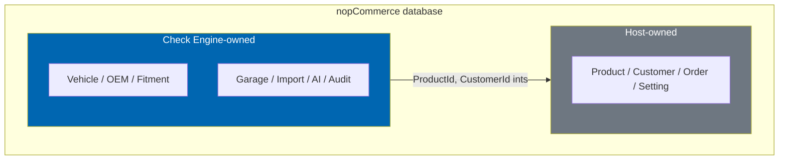

# 10 Database Design

> The Check Engine relational schema on SQL Server: entities, relationships, indexes, naming
> conventions, and the FluentMigrator migration strategy.

**Status:** Review · **Owner:** Database Architect · **Last revised:** 2026-07-28

---

## Contents

- [Executive Summary](#executive-summary)
- [Objectives](#objectives)
- [Scope](#scope)
- [Detailed Specifications](#detailed-specifications)
  - [Design principles](#design-principles)
  - [Naming conventions](#naming-conventions)
  - [Entity-relationship overview](#entity-relationship-overview)
  - [Table specifications](#table-specifications)
  - [Indexes and constraints](#indexes-and-constraints)
  - [Relationship to nopCommerce tables](#relationship-to-nopcommerce-tables)
  - [Migration strategy](#migration-strategy)
  - [Data volume and partitioning guidance](#data-volume-and-partitioning-guidance)
  - [Backup, retention, and PII](#backup-retention-and-pii)
- [Architecture](#architecture)
- [User Stories](#user-stories)
- [Acceptance Criteria](#acceptance-criteria)
- [Future Enhancements](#future-enhancements)
- [References](#references)

---

## Executive Summary

Check Engine persists automotive state in **SQL Server 2019+** beside the nopCommerce catalog. Vehicle,
OEM, fitment, garage, import, and audit data live in **plugin-owned tables**. Products, customers, and
orders remain nopCommerce tables; Check Engine stores **foreign keys by integer id** only, never by
duplicating host rows.

Takeaways:

1. **Table prefix `Ce`** (PascalCase entity name after prefix, matching nopCommerce style:
   `CeVehicleMake`, `CeFitmentClaim`). Indexes `IX_Ce…`, constraints `FK_Ce…` / `UQ_Ce…`.
2. **Fitment is a first-class relation**, not product attributes or category paths (`ADR` from vision).
3. **Brand-agnostic keys** — no BMW-specific columns; manufacturer is data (`ADR-004`).
4. **Provenance and confidence** columns exist on claims and import rows so AI never silently becomes
   authority (`ADR-008`).
5. **Migrations are the only schema path** ([09](09-plugin-architecture.md)); uninstall drops plugin
   tables without touching host commerce data.

Column-level algorithms (VIN parse, OEM normalise) are specified in [12](12-vehicle-database.md)–[15](15-fitment-engine.md);
this document owns storage shape.

---

## Objectives

| # | Objective | Traces to | Measure |
|---|---|---|---|
| 1 | Provide a complete Horizon 1 schema implementable from this doc alone | `BR-013`, Blocks 100–700 | All Must FRs that persist state have a table |
| 2 | Enforce naming and indexing conventions for reviewability | `NFR-057` | Checklist AC passes |
| 3 | Support reference-dataset performance budgets via indexes | `NFR-001`, fitment NFRs | Index section maps to query paths |
| 4 | Keep multi-tenant SaaS viable without rewrite | `BR-042` | No global singleton assumptions; tenant column reserved strategy documented |
| 5 | Define safe migration and rollback policy | `FR-925` | Migration strategy section complete |

---

## Scope

### In scope

- Logical and physical design for Horizon 1 plugin tables
- ER diagram, primary/foreign keys, unique constraints, check constraints
- Index plan tied to hot paths
- Migration versioning and uninstall drop order
- Mapping strategy to nopCommerce `Product`, `Customer`, `Picture`, `Category`

### Out of scope

| Not covered | Where |
|---|---|
| Domain invariants expressed in code | [11](11-domain-model.md) |
| VIN/OEM/fitment algorithms | [12](12-vehicle-database.md)–[15](15-fitment-engine.md) |
| Search engine index schema (Elastic/Lucene/etc.) | [16](16-search-engine.md) |
| ERPNext remote schema | [18](18-erpnext-integration.md) |
| Marketplace vendor tables beyond stubs | Horizon 3 / [19](19-marketplace-module.md) |

### Assumptions

- Collation follows the host database (typically `SQL_Latin1_General_CP1_CI_AS`); Unicode `nvarchar` for
  all user-facing text including Arabic.
- Soft delete is used where audit requires retention; hard delete on uninstall of plugin-owned rows.
- Money and tax remain in nopCommerce order tables.
- The production schema target remains SQL Server 2019+; the current browser verification stack uses PostgreSQL 16 in Podman only for E2E smoke runs.

### Dependencies

[08](08-system-architecture.md), [09](09-plugin-architecture.md), [11](11-domain-model.md),
[02](02-functional-requirements.md), [03](03-non-functional-requirements.md).

---

## Detailed Specifications

### Design principles

| Principle | Application |
|---|---|
| Single source of truth | Fitment claims live in `CeFitmentClaim`, not in product attribute XML |
| Surrogate keys | `Id int IDENTITY` primary keys on all tables unless noted |
| Natural keys uniqueness | Enforced with unique constraints (e.g. normalised OEM + manufacturer) |
| Temporal applicability | Fitment and supersession use inclusive date bounds nullable for open-ended |
| Confidence + provenance | Numeric confidence and source enum/code on claims and import lines |
| Idempotent imports | External source keys stored for upsert |
| No manufacturer special columns | `MakeId` references `CeVehicleMake` |
| Host references are ints | `ProductId`, `CustomerId` nullable where optional |

### Naming conventions

| Object | Convention | Example |
|---|---|---|
| Table | `Ce` + entity PascalCase | `CeFitmentClaim` |
| Column | PascalCase | `NormalisedNumber` |
| Primary key | `Id` | `Id` |
| Foreign key column | `{TableSansCe}Id` or clear role name | `VehicleConfigurationId`, `ProductId` |
| Unique constraint | `UQ_Ce{Table}_{Cols}` | `UQ_CeOemNumber_ManufacturerId_NormalisedNumber` |
| Foreign key | `FK_Ce{Table}_{Ref}` | `FK_CeFitmentClaim_VehicleConfigurationId` |
| Index | `IX_Ce{Table}_{Cols}_{Suffix}` | `IX_CeFitmentClaim_ProductId_Includes` |
| Check constraint | `CK_Ce{Table}_{Meaning}` | `CK_CeFitmentClaim_ConfidenceRange` |

Boolean columns use `bit` with `Is` / `Has` prefix (`IsPublished`). Enums stored as `int` with domain
enum parity documented in [11](11-domain-model.md). Avoid SQL Server reserved words as bare identifiers.

**Reserved for Horizon 5:** a nullable `TenantId` is **not** added in Horizon 1. SaaS tenancy prefers
database-per-tenant or schema-per-tenant at the host level ([49](49-saas-roadmap.md)). Horizon 1 avoids
scattering nullable tenant columns that stay unused and unindexed.

### Entity-relationship overview

```mermaid
erDiagram
    CeVehicleMake ||--o{ CeVehicleModel : has
    CeVehicleModel ||--o{ CeVehicleGeneration : has
    CeVehicleGeneration ||--o{ CeVehicleConfiguration : has
    CeEngine ||--o{ CeVehicleConfiguration : powers
    CeBodyStyle ||--o{ CeVehicleConfiguration : shapes
    CeMarket ||--o{ CeVehicleConfiguration : markets

    CeManufacturer ||--o{ CeOemNumber : issues
    CeOemNumber ||--o{ CeOemRelation : from
    CeOemNumber ||--o{ CeOemRelation : to
    CeOemNumber ||--o{ CeFitmentClaim : fits_via

    CeVehicleConfiguration ||--o{ CeFitmentClaim : applies
    CeFitmentClaim }o--|| CeFitmentSource : sourced_from

    CeCustomerGarage ||--o{ CeGarageVehicle : contains
    CeGarageVehicle }o--o| CeVehicleConfiguration : links
    CeCustomerGarage }o--|| CeCustomerRef : owns

    CeImportBatch ||--o{ CeImportRow : contains
    CeImportRow }o--o| CeOemNumber : matched
    CeImportRow }o--o| CeFitmentClaim : proposed

    CeProductMap }o--|| CeOemNumber : maps
    CeProductMap }o--|| CeProductRef : product
```

`CeCustomerRef` and `CeProductRef` in the diagram are **logical** — physically they are integer columns
pointing at nopCommerce `Customer.Id` and `Product.Id` without plugin shadow tables.

### Table specifications

#### Vehicle hierarchy

##### `CeVehicleMake`

| Column | Type | Null | Notes |
|---|---|---|---|
| Id | int IDENTITY | N | PK |
| Name | nvarchar(128) | N | Display name |
| Slug | nvarchar(128) | N | URL slug, unique |
| IsActive | bit | N | Default 1 |
| DisplayOrder | int | N | Default 0 |
| CreatedOnUtc | datetime2(0) | N | |
| UpdatedOnUtc | datetime2(0) | N | |

##### `CeVehicleModel`

| Column | Type | Null | Notes |
|---|---|---|---|
| Id | int IDENTITY | N | PK |
| MakeId | int | N | FK → `CeVehicleMake` |
| Name | nvarchar(128) | N | |
| Slug | nvarchar(128) | N | Unique per make |
| IsActive | bit | N | |
| DisplayOrder | int | N | |
| CreatedOnUtc | datetime2(0) | N | |
| UpdatedOnUtc | datetime2(0) | N | |

##### `CeVehicleGeneration`

| Column | Type | Null | Notes |
|---|---|---|---|
| Id | int IDENTITY | N | PK |
| ModelId | int | N | FK → `CeVehicleModel` |
| Code | nvarchar(64) | N | e.g. platform code `F30` as data |
| Name | nvarchar(128) | N | |
| YearFrom | int | Y | Model year inclusive |
| YearTo | int | Y | Null = current |
| Slug | nvarchar(128) | N | |
| IsActive | bit | N | |
| CreatedOnUtc | datetime2(0) | N | |
| UpdatedOnUtc | datetime2(0) | N | |

##### `CeEngine`

| Column | Type | Null | Notes |
|---|---|---|---|
| Id | int IDENTITY | N | PK |
| Code | nvarchar(64) | N | Unique engine code |
| Name | nvarchar(128) | N | |
| DisplacementCc | int | Y | |
| FuelType | int | N | Enum |
| PowerKw | int | Y | |
| IsActive | bit | N | |

##### `CeBodyStyle`

| Column | Type | Null | Notes |
|---|---|---|---|
| Id | int IDENTITY | N | PK |
| Code | nvarchar(64) | N | Unique |
| Name | nvarchar(128) | N | |

##### `CeMarket`

| Column | Type | Null | Notes |
|---|---|---|---|
| Id | int IDENTITY | N | PK |
| Code | nvarchar(16) | N | ISO-like market code, unique |
| Name | nvarchar(128) | N | |
| IsActive | bit | N | |

##### `CeVehicleAlias`

Supports `FR-107` / [12](12-vehicle-database.md). Multiple display strings map to one canonical node.

| Column | Type | Null | Notes |
|---|---|---|---|
| Id | int IDENTITY | N | PK |
| NodeType | int | N | Make, Model, Generation, Configuration |
| NodeId | int | N | Id in the corresponding table |
| Locale | nvarchar(10) | Y | Null = language-neutral alias |
| AliasText | nvarchar(256) | N | Display form |
| AliasNormalised | nvarchar(256) | N | Lookup key |
| CreatedOnUtc | datetime2(0) | N | |

Unique: `UQ_CeVehicleAlias_NodeType_AliasNormalised` within make scope enforced in application when
aliases can collide across makes; Horizon 1 unique on `(NodeType, AliasNormalised)` plus optional
`MakeId` column if cross-make collisions appear in curation.

##### `CeVehicleConfiguration`

The leaf shoppers and fitment bind to.

| Column | Type | Null | Notes |
|---|---|---|---|
| Id | int IDENTITY | N | PK |
| GenerationId | int | N | FK |
| EngineId | int | Y | FK |
| BodyStyleId | int | Y | FK |
| MarketId | int | Y | FK |
| TrimName | nvarchar(128) | Y | |
| ProductionFrom | date | Y | |
| ProductionTo | date | Y | |
| ChassisCodes | nvarchar(256) | Y | Denormalised search aid; normalised elsewhere if needed |
| Fingerprint | nvarchar(64) | N | Hash of distinguishing attributes; unique |
| IsActive | bit | N | |
| CreatedOnUtc | datetime2(0) | N | |
| UpdatedOnUtc | datetime2(0) | N | |

#### VIN support tables

##### `CeVinWmi`

| Column | Type | Null | Notes |
|---|---|---|---|
| Id | int IDENTITY | N | PK |
| Wmi | char(3) | N | Unique |
| MakeId | int | Y | FK when known |
| ManufacturerName | nvarchar(128) | N | |
| RegionCode | nvarchar(16) | Y | |

##### `CeVinPattern`

| Column | Type | Null | Notes |
|---|---|---|---|
| Id | int IDENTITY | N | PK |
| MakeId | int | N | FK |
| Pattern | nvarchar(32) | N | Position masks for VDS rules |
| Priority | int | N | Higher wins |
| VehicleConfigurationId | int | Y | Direct bind when pattern unique |
| Notes | nvarchar(512) | Y | |

Exact VIN decode rules are code + data; these tables store the configurable portions ([13](13-vin-engine.md)).

#### OEM

##### `CeManufacturer`

Parts manufacturer (OEM brand or aftermarket brand), distinct from vehicle make when needed.

| Column | Type | Null | Notes |
|---|---|---|---|
| Id | int IDENTITY | N | PK |
| Name | nvarchar(128) | N | |
| Slug | nvarchar(128) | N | Unique |
| IsOeBrand | bit | N | Genuine OE line flag |
| IsActive | bit | N | |

##### `CeOemNumber`

| Column | Type | Null | Notes |
|---|---|---|---|
| Id | int IDENTITY | N | PK |
| ManufacturerId | int | N | FK |
| DisplayNumber | nvarchar(64) | N | Canonical display form |
| NormalisedNumber | nvarchar(64) | N | Compare key |
| IsActive | bit | N | |
| CreatedOnUtc | datetime2(0) | N | |
| UpdatedOnUtc | datetime2(0) | N | |

##### `CeOemRelation`

| Column | Type | Null | Notes |
|---|---|---|---|
| Id | int IDENTITY | N | PK |
| FromOemNumberId | int | N | FK |
| ToOemNumberId | int | N | FK |
| RelationType | int | N | CrossRef, Supersession, Equivalent, KitMember, … |
| ValidFrom | date | Y | |
| ValidTo | date | Y | |
| CreatedOnUtc | datetime2(0) | N | |

#### Fitment

##### `CeFitmentSource`

| Column | Type | Null | Notes |
|---|---|---|---|
| Id | int IDENTITY | N | PK |
| Code | nvarchar(64) | N | Unique |
| Name | nvarchar(128) | N | Catalog, Manual, Import, AiProposal, … |
| IsAuthoritative | bit | N | AI sources must be 0 |

##### `CeFitmentClaim`

| Column | Type | Null | Notes |
|---|---|---|---|
| Id | int IDENTITY | N | PK |
| ProductId | int | N | nopCommerce Product |
| VehicleConfigurationId | int | N | FK |
| OemNumberId | int | Y | FK optional |
| FitmentStatus | int | N | Fits, DoesNotFit, Unknown, Rejected |
| Confidence | decimal(5,4) | N | 0–1 |
| SafetyClass | int | N | Standard, SafetyCritical, … |
| SourceId | int | N | FK → `CeFitmentSource` |
| ProvenanceNote | nvarchar(512) | Y | |
| ValidFrom | date | Y | |
| ValidTo | date | Y | |
| IsPublished | bit | N | Customer-visible only when 1 |
| ReviewedByCustomerId | int | Y | Admin user id |
| ReviewedOnUtc | datetime2(0) | Y | |
| CreatedOnUtc | datetime2(0) | N | |
| UpdatedOnUtc | datetime2(0) | N | |

##### `CeFitmentQualifier`

Optional structured constraints (drive side, transmission, option package).

| Column | Type | Null | Notes |
|---|---|---|---|
| Id | int IDENTITY | N | PK |
| FitmentClaimId | int | N | FK |
| QualifierType | int | N | |
| QualifierValue | nvarchar(128) | N | |

#### Product ↔ OEM map

##### `CeProductOemMap`

| Column | Type | Null | Notes |
|---|---|---|---|
| Id | int IDENTITY | N | PK |
| ProductId | int | N | |
| OemNumberId | int | N | |
| IsPrimary | bit | N | |
| CreatedOnUtc | datetime2(0) | N | |

#### Garage

##### `CeGarage`

| Column | Type | Null | Notes |
|---|---|---|---|
| Id | int IDENTITY | N | PK |
| CustomerId | int | N | Unique per customer |
| CreatedOnUtc | datetime2(0) | N | |
| UpdatedOnUtc | datetime2(0) | N | |

##### `CeGarageVehicle`

| Column | Type | Null | Notes |
|---|---|---|---|
| Id | int IDENTITY | N | PK |
| GarageId | int | N | FK |
| VehicleConfigurationId | int | Y | Null until confirmed |
| VinNormalised | char(17) | Y | |
| Label | nvarchar(128) | Y | Customer nickname |
| IsActive | bit | N | Active context flag; at most one per garage |
| CreatedOnUtc | datetime2(0) | N | |
| UpdatedOnUtc | datetime2(0) | N | |

##### `CeGarageOem`

| Column | Type | Null | Notes |
|---|---|---|---|
| Id | int IDENTITY | N | PK |
| GarageId | int | N | FK |
| OemNumberId | int | N | FK |
| CreatedOnUtc | datetime2(0) | N | |

#### Import pipeline

##### `CeImportBatch`

| Column | Type | Null | Notes |
|---|---|---|---|
| Id | int IDENTITY | N | PK |
| FileName | nvarchar(260) | N | |
| SourceFormat | int | N | Csv, Excel, Pdf |
| Status | int | N | Received, Parsing, Matching, Review, Committed, Failed |
| UploadedByCustomerId | int | N | Admin |
| RowCount | int | N | |
| ErrorSummary | nvarchar(max) | Y | |
| CreatedOnUtc | datetime2(0) | N | |
| UpdatedOnUtc | datetime2(0) | N | |

##### `CeImportRow`

| Column | Type | Null | Notes |
|---|---|---|---|
| Id | int IDENTITY | N | PK |
| BatchId | int | N | FK |
| RowNumber | int | N | |
| RawPayload | nvarchar(max) | N | JSON of source columns |
| NormalisedOem | nvarchar(64) | Y | |
| MatchedOemNumberId | int | Y | |
| ProposedProductId | int | Y | |
| ProposedFitmentJson | nvarchar(max) | Y | |
| Confidence | decimal(5,4) | Y | |
| ReviewStatus | int | N | Pending, Approved, Rejected, Skipped |
| ReviewNote | nvarchar(512) | Y | |

#### AI review and audit

##### `CeAiGeneration`

| Column | Type | Null | Notes |
|---|---|---|---|
| Id | int IDENTITY | N | PK |
| EntityType | int | N | ProductDescription, Seo, Translation, … |
| EntityId | int | N | |
| ModelName | nvarchar(128) | N | |
| PromptHash | char(64) | N | |
| OutputText | nvarchar(max) | N | |
| IsPublished | bit | N | Default 0 |
| ReviewedByCustomerId | int | Y | |
| CreatedOnUtc | datetime2(0) | N | |

##### `CeAiUsageDaily`

Token and cost ledger for [17](17-ai-architecture.md) (`FR-560`, `FR-561`).

| Column | Type | Null | Notes |
|---|---|---|---|
| Id | int IDENTITY | N | PK |
| UsageDate | date | N | Store calendar date |
| FeatureCode | nvarchar(64) | N | e.g. Description, Translation |
| InputTokens | bigint | N | |
| OutputTokens | bigint | N | |
| EstimatedCost | decimal(18,4) | N | |
| CallCount | int | N | |

Unique: `UQ_CeAiUsageDaily_UsageDate_FeatureCode`.

##### `CeSupplierProfile`

Optional import defaults ([24](24-product-import-pipeline.md) `FR-650`).

| Column | Type | Null | Notes |
|---|---|---|---|
| Id | int IDENTITY | N | PK |
| Name | nvarchar(128) | N | |
| ColumnMapJson | nvarchar(max) | N | |
| ConfidenceOverridesJson | nvarchar(max) | Y | |
| DefaultManufacturerId | int | Y | OEM disambiguation |
| ContactMetaJson | nvarchar(max) | Y | |
| IsActive | bit | N | |
| CreatedOnUtc | datetime2(0) | N | |
| UpdatedOnUtc | datetime2(0) | N | |

##### `CeAuditEntry`

| Column | Type | Null | Notes |
|---|---|---|---|
| Id | bigint IDENTITY | N | PK |
| ActorCustomerId | int | Y | |
| ActionCode | nvarchar(64) | N | |
| EntityType | nvarchar(64) | N | |
| EntityId | nvarchar(64) | N | |
| DataJson | nvarchar(max) | Y | |
| CreatedOnUtc | datetime2(0) | N | |

#### ERP synchronisation

Normative for [18](18-erpnext-integration.md). Horizon 1.

##### `CeErpEntityMap`

| Column | Type | Null | Notes |
|---|---|---|---|
| Id | int IDENTITY | N | PK |
| LocalEntityType | nvarchar(64) | N | Product, Customer, Order, … |
| LocalId | int | N | |
| RemoteDoctype | nvarchar(128) | N | |
| RemoteName | nvarchar(140) | N | ERPNext name/id |
| LastSyncedOnUtc | datetime2(0) | Y | |

Unique: `UQ_CeErpEntityMap_Local` on `(LocalEntityType, LocalId)`.

##### `CeErpSyncOutbox`

| Column | Type | Null | Notes |
|---|---|---|---|
| Id | bigint IDENTITY | N | PK |
| IdempotencyKey | nvarchar(128) | N | Unique |
| OperationType | nvarchar(64) | N | |
| PayloadJson | nvarchar(max) | N | |
| Status | int | N | Pending, Succeeded, Failed, Dead |
| AttemptCount | int | N | |
| LastError | nvarchar(max) | Y | |
| CreatedOnUtc | datetime2(0) | N | |
| UpdatedOnUtc | datetime2(0) | N | |

##### `CeErpConflict`

| Column | Type | Null | Notes |
|---|---|---|---|
| Id | int IDENTITY | N | PK |
| LocalEntityType | nvarchar(64) | N | |
| LocalId | int | N | |
| FieldName | nvarchar(128) | N | |
| LocalValue | nvarchar(max) | Y | |
| RemoteValue | nvarchar(max) | Y | |
| Status | int | N | Open, Resolved |
| CreatedOnUtc | datetime2(0) | N | |

#### Settings note

Plugin settings use nopCommerce `Setting` table with keys `CheckEngine.*` — no parallel settings table
required unless binary blobs appear (licence certificate may use `CeLicenceState` if needed in [43](43-licensing.md)).

##### `CeLicenceState` (minimal)

| Column | Type | Null | Notes |
|---|---|---|---|
| Id | int IDENTITY | N | PK, single row expected |
| ActivationKeyHash | nvarchar(128) | Y | |
| Status | int | N | |
| LastHeartbeatUtc | datetime2(0) | Y | |
| LastPayloadJson | nvarchar(max) | Y | Non-secret status |

### Indexes and constraints

#### Required unique constraints

| Table | Constraint |
|---|---|
| `CeVehicleMake` | `UQ_CeVehicleMake_Slug` |
| `CeVehicleModel` | `UQ_CeVehicleModel_MakeId_Slug` |
| `CeVehicleConfiguration` | `UQ_CeVehicleConfiguration_Fingerprint` |
| `CeEngine` | `UQ_CeEngine_Code` |
| `CeOemNumber` | `UQ_CeOemNumber_ManufacturerId_NormalisedNumber` |
| `CeFitmentClaim` | `UQ_CeFitmentClaim_ProductId_VehicleConfigurationId` (active claims; see note) |
| `CeGarage` | `UQ_CeGarage_CustomerId` |
| `CeProductOemMap` | `UQ_CeProductOemMap_ProductId_OemNumberId` |
| `CeVinWmi` | `UQ_CeVinWmi_Wmi` |
| `CeFitmentSource` | `UQ_CeFitmentSource_Code` |

**Fitment uniqueness note:** If historical rejected claims must be retained, enforce uniqueness with a
filtered unique index on `ProductId, VehicleConfigurationId` where `FitmentStatus` in published-active
set, or use `IsPublished = 1` filter. Exact filter is fixed in the first fitment migration and covered
by tests.

#### Hot-path indexes

| Index | Supports |
|---|---|
| `IX_CeFitmentClaim_VehicleConfigurationId_IsPublished` INCLUDE (`ProductId`, `FitmentStatus`, `Confidence`) | Search filter by vehicle |
| `IX_CeFitmentClaim_ProductId_IsPublished` | Product page badge |
| `IX_CeOemNumber_NormalisedNumber` INCLUDE (`ManufacturerId`, `DisplayNumber`) | OEM lookup |
| `IX_CeGarageVehicle_GarageId_IsActive` | Active context |
| `IX_CeImportRow_BatchId_ReviewStatus` | Review queue |
| `IX_CeVehicleConfiguration_GenerationId` | Tree browse |
| `IX_CeOemRelation_FromOemNumberId` | Supersession walk |
| `IX_CeOemRelation_ToOemNumberId` | Reverse walk |
| `IX_CeProductOemMap_OemNumberId` | OEM → products |
| `IX_CeAiGeneration_EntityType_EntityId_IsPublished` | Review queues |

#### Check constraints

| Constraint | Rule |
|---|---|
| `CK_CeFitmentClaim_ConfidenceRange` | `Confidence >= 0 AND Confidence <= 1` |
| `CK_CeVehicleGeneration_YearOrder` | `YearTo IS NULL OR YearFrom IS NULL OR YearTo >= YearFrom` |
| `CK_CeFitmentClaim_AiNotAuthoritative` | Enforced in domain; optional trigger discouraged — prefer application rule that `Source.IsAuthoritative = 0` when publishing AI-originated claims without review |

### Relationship to nopCommerce tables

| nopCommerce table | Check Engine usage |
|---|---|
| `Product` | `ProductId` on claims and maps |
| `Customer` | Garage owner; audit actor; admin reviewer ids |
| `Category` | Theme/SEO may link via settings or mapping table in later revision; Horizon 1 uses host categories without `CeCategoryMap` unless import requires it — if required, add `CeCategoryMap` in import migrations |
| `Picture` | Import image assignment stores `PictureId` on product via host APIs, not duplicate blobs |
| `ScheduleTask` | Task rows owned by host; plugin registers by type name |
| `PermissionRecord` | Registered on install |
| `LocaleStringResource` | Resource keys on install |
| `Setting` | `CheckEngine.*` keys |

**Referential integrity:** SQL FKs to `Product` / `Customer` are **optional**. Prefer application-level
integrity plus periodic orphan cleanup tasks, because nopCommerce deletions and plugin uninstall
ordering can conflict with hard FKs. If FKs are created, they must be `ON DELETE CASCADE` only where
safe (garage → customer) and documented; default Horizon 1 recommendation is **no cross-database-owner
FKs**, indexes only.

### Migration strategy


| Topic | Rule |
|---|---|
| Baseline | `202607280001_InitCheckEngineSchema` creates Horizon 1 tables |
| Additive first | Prefer add column/table; avoid rename/drop in patch releases |
| Breaking schema | Only in major plugin version; provide data migration script and upgrade notes in CHANGELOG |
| Timeouts | Long indexes use `ONLINE` where edition supports; document lock expectations for Standard edition |
| Rollback | Auto-reversing where possible; otherwise restore DB backup — stated in [32](32-deployment.md) |
| Uninstall drop order | Children first: qualifiers → claims → relations → garage → import rows → batches → vehicle leaves → roots → audit optional retain policy |
| Audit retention on uninstall | Default **drop** audit with plugin; operators who need retention export first |

### Data volume and partitioning guidance

Reference dataset from [03](03-non-functional-requirements.md): on the order of **250,000 parts**,
vehicle configurations in the tens of thousands for BMW-first, fitment claims potentially
**multiples of products × configurations** but sparse in practice.

| Guidance | Horizon 1 |
|---|---|
| Partitioning | Not required at reference scale |
| Archival | Import raw payloads older than 180 days may move to cold storage setting |
| `CeAuditEntry` | Rotate/archive after 365 days via task |

### Backup, retention, and PII

| Data | PII? | Handling |
|---|---|---|
| Garage VIN | Yes (indirect) | Encrypt at rest follows host; purge on customer delete consumer |
| Import files / raw rows | Maybe | Access limited to catalog permissions |
| AI outputs | Maybe | Same review ACL |
| Fitment claims | No | Catalog IP — protected by licence |

Customer delete must remove `CeGarage*` rows (`FR` privacy / [28](28-security.md)).

---

## Architecture

### Schema ownership boundary



### Rejected alternatives

| Alternative | Rejected because |
|---|---|
| Fitment as `ProductAttribute` combinations | Combinatorial explosion; weak provenance |
| JSON-only fitment blob on product | Cannot index by vehicle efficiently |
| Separate Check Engine database | Complicates transactions and operator backup story for v1.0 |
| EF Core migrations beside FluentMigrator | `ADR-011` |
| Manufacturer-specific tables (`CeBmw…`) | Violates brand-agnostic principle |

---

## User Stories

| ID | Persona | Story | Points | Priority |
|---|---|---|---|---|
| `US-221` | Backend engineer | Create the Horizon 1 schema from migrations that match this document | 13 | Must |
| `US-222` | DBA | See indexes that support vehicle-constrained product lookup | 5 | Must |
| `US-223` | Backend engineer | Add a nullable column in a patch release without downtime beyond recycle | 3 | Must |
| `US-224` | Admin | Uninstall and drop all `Ce*` tables | 5 | Must |
| `US-225` | Security reviewer | Confirm VINs in garage are deleted with the customer | 3 | Must |

---

## Acceptance Criteria

**`AC-10.1`** — Schema completeness
Given this document's Horizon 1 tables, when compared to Must FRs that require persistence in Blocks 100–700, then each FR has a documented table/column home.

**`AC-10.2`** — Naming
Given all plugin migrations, when tables are listed, then every table name starts with `Ce` and constraints follow the naming conventions section.

**`AC-10.3`** — Fitment query plan
Given the reference dataset, when explaining the product-by-vehicle published claim lookup, then it uses `IX_CeFitmentClaim_VehicleConfigurationId_IsPublished` (or successor) without table scan.

**`AC-10.4`** — Uninstall
Given installed schema, when uninstall runs, then no user tables with prefix `Ce` remain.

**`AC-10.5`** — Customer purge
Given a customer with garage VINs, when the customer delete consumer completes, then no `CeGarage*` rows remain for that `CustomerId`.

---

## Future Enhancements

| Enhancement | Horizon | Notes |
|---|---|---|
| `CeVendor*` marketplace tables | 3 | [19](19-marketplace-module.md) |
| Fleet vehicle pools | 4 | [47](47-fleet-portal.md) |
| Table partitioning for claims | 2+ | If volumes exceed reference × 20 |
| Optional FKs to host with cascade | 2 | After uninstall ordering proven |

---

## References

- [08 System Architecture](08-system-architecture.md)
- [09 Plugin Architecture](09-plugin-architecture.md)
- [11 Domain Model](11-domain-model.md)
- [12 Vehicle Database](12-vehicle-database.md)
- [14 OEM Engine](14-oem-engine.md)
- [15 Fitment Engine](15-fitment-engine.md)
- [03 Non-Functional Requirements](03-non-functional-requirements.md)
- [28 Security](28-security.md)
- [32 Deployment](32-deployment.md)
