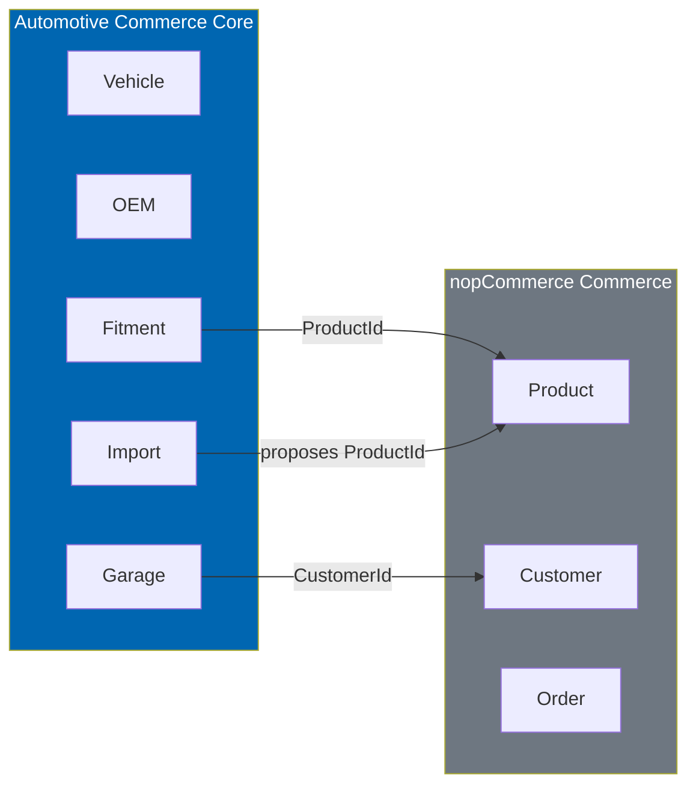
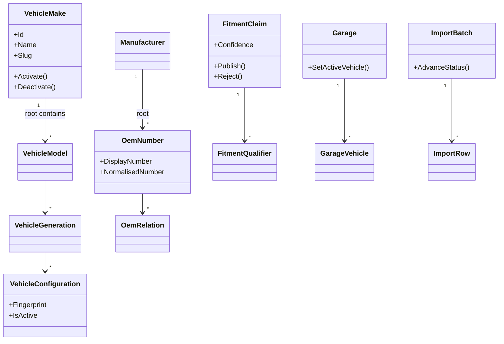
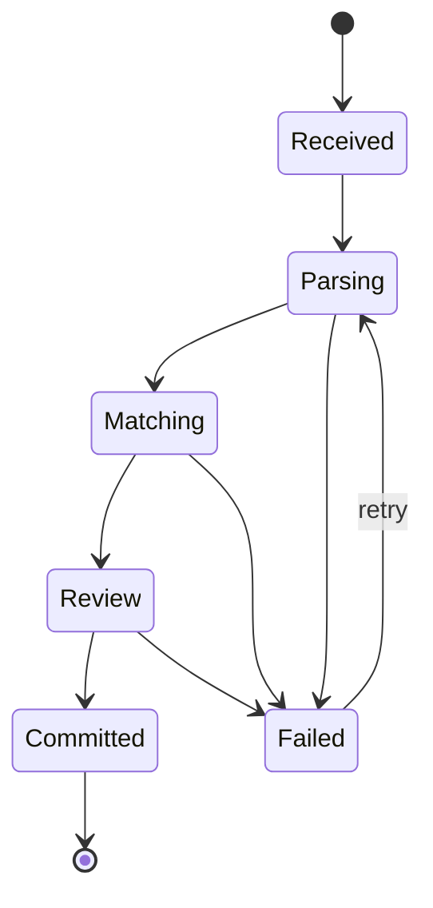
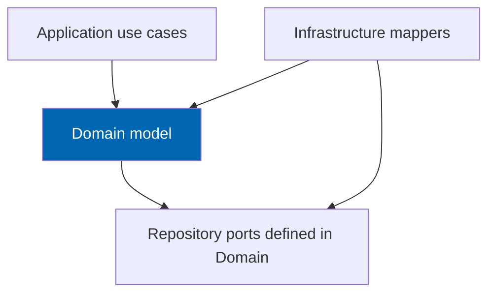

# 11 Domain Model

> Aggregates, entities, value objects, domain services, invariants, specifications, and domain events
> that implement Check Engine's automotive core without depending on nopCommerce.

**Status:** Review · **Owner:** Domain Architect · **Last revised:** 2026-07-28

**Engineering status (2026-08-25):** Plugin `0.104.0` is in tree. Progress, evidence gates (G1–G6 done; G11 packing partial), and remaining blockers (H1.35/G8, G7, G11 vendor signing, G12) are recorded in [EXECUTION-PLAN.md](../EXECUTION-PLAN.md). This document remains the specification baseline.

---

## Contents

- [Executive Summary](#executive-summary)
- [Objectives](#objectives)
- [Scope](#scope)
- [Detailed Specifications](#detailed-specifications)
  - [Ubiquitous language](#ubiquitous-language)
  - [Bounded context](#bounded-context)
  - [Aggregate catalogue](#aggregate-catalogue)
  - [Value objects](#value-objects)
  - [Enumerations](#enumerations)
  - [Domain services](#domain-services)
  - [Specifications](#specifications)
  - [Domain events](#domain-events)
  - [Factory and repository ports](#factory-and-repository-ports)
  - [Invariant catalogue](#invariant-catalogue)
  - [Mapping to persistence](#mapping-to-persistence)
- [Architecture](#architecture)
- [User Stories](#user-stories)
- [Acceptance Criteria](#acceptance-criteria)
- [Future Enhancements](#future-enhancements)
- [References](#references)

---

## Executive Summary

The domain model is the **executable expression** of Check Engine's automotive rules. It lives in
`TwinParticles.CheckEngine.Domain`, references no nopCommerce types (`ADR-007`), and is the only place
fitment authority, OEM identity, and VIN interpretation may be decided.

Takeaways:

1. **Aggregates protect invariants.** Cross-aggregate rules go through domain services, not tangled
   entity graphs.
2. **FitmentClaim is the commercial heart.** Publishing a claim is an explicit domain operation with
   safety-class and source constraints (`ADR-008`).
3. **Value objects normalise identity.** `Vin`, `OemNormalisedNumber`, `VehicleFingerprint`, and
   `Confidence` prevent primitive obsession.
4. **Persistence is a projection.** Table shapes in [10](10-database-design.md) follow this model; the
   model does not follow LinqToDB entities upward.
5. **English ubiquitous language** is used in code; Arabic appears only in localisation at the edge.

---

## Objectives

| # | Objective | Traces to | Measure |
|---|---|---|---|
| 1 | Name every Horizon 1 aggregate and its root | Blocks 100–700 | Catalogue complete |
| 2 | State invariants as testable rules | `FR-300`s, `AC-FR.3` | Invariant table with AC links |
| 3 | Define domain services for VIN, OEM resolve, fitment evaluate | `FR-200`s–`FR-300`s | Interfaces listed |
| 4 | Keep brand-agnostic modelling | `ADR-004`, `AC-FR.2` | No manufacturer branching in domain services |
| 5 | Specify domain events for integration | [08](08-system-architecture.md) | Event list with consumers' duties |

---

## Scope

### In scope

- Ubiquitous language for the automotive core
- Aggregates, entities, value objects, enums
- Domain services and specifications
- Invariants and domain events
- Ports (repository interfaces) owned by the domain
- Mapping notes to `Ce*` tables

### Out of scope

| Not covered | Where |
|---|---|
| Application use-case orchestration | [08](08-system-architecture.md), feature docs |
| SQL and indexes | [10](10-database-design.md) |
| Algorithm detail (WMI tables, scoring weights) | [12](12-vehicle-database.md)–[15](15-fitment-engine.md) |
| AI prompt design | [17](17-ai-architecture.md) |
| C# file templates and analysers | [34](34-coding-standards.md) |

### Assumptions

- Host product/customer identity crosses the boundary as primitive ids wrapped in value objects
  (`ProductId`, `CustomerId`) defined in Domain.Shared.
- Money, tax, and cart remain outside this model.

### Dependencies

[00](00-vision.md), [02](02-functional-requirements.md), [08](08-system-architecture.md),
[10](10-database-design.md).

---

## Detailed Specifications

### Ubiquitous language

| Term | Meaning |
|---|---|
| **Make / Model / Generation** | Vehicle hierarchy nodes; Generation often carries platform code as data |
| **Vehicle configuration** | Leaf configuration a part can fit (generation + engine + body + market + trim window) |
| **VIN** | 17-character chassis identifier after normalisation |
| **OEM number** | Manufacturer part number with display and normalised forms |
| **Supersession** | Directed replacement relation between OEM numbers |
| **Cross-reference** | Non-replacement equivalence or alternate numbering |
| **Fitment claim** | Asserted relationship between a product and a vehicle configuration |
| **Confidence** | 0–1 score of claim reliability |
| **Safety class** | Severity band controlling publish rules |
| **Provenance / source** | Origin of a claim (catalog, manual, import, AI proposal) |
| **Published** | Visible to storefront evaluation |
| **Garage** | Per-customer collection of vehicles/VINs/OEMs with one active context |
| **Active vehicle context** | The configuration constraining search and badges |
| **Import batch / row** | Supplier file ingestion unit awaiting review |

Avoid "compatible" as a stored state — use Fit / DoesNotFit / Unknown. Avoid "BMW id" — use Make.

### Bounded context

**Automotive Commerce Core** is the single bounded context for Horizon 1–2 Check Engine domain code.
Catalog pricing and checkout are an **external context** (nopCommerce) anticorrupted via ids.



Marketplace vendor aggregates join this context in Horizon 3 without splitting the assembly until
complexity forces a second bounded context.

### Aggregate catalogue



#### Aggregate: VehicleMake (hierarchy root)

| Element | Detail |
|---|---|
| **Root** | `VehicleMake` |
| **Contains** | Models → Generations → Configurations (load by need; see consistency) |
| **Consistency** | Rename/slug uniqueness within parent; configuration fingerprint unique globally |
| **Transaction** | Prefer smaller write models: configuration edits may use `VehicleConfiguration` as a separate aggregate root if hierarchy size demands — **Horizon 1 choice:** `VehicleConfiguration` is its **own aggregate root**; Make/Model/Generation are separate roots. Hierarchy links by id |

**Horizon 1 normative roots for vehicle data:** `VehicleMake`, `VehicleModel`, `VehicleGeneration`,
`VehicleConfiguration`, `Engine`, `BodyStyle`, `Market` as discrete aggregates/entities with
repositories. The class diagram above shows structural containment; **transaction boundaries** follow
the table below.

| Aggregate root | Entities inside boundary | Invariants (summary) |
|---|---|---|
| `VehicleMake` | — | Slug unique; cannot delete while models exist (or cascade policy explicit) |
| `VehicleModel` | — | Belongs to one make; slug unique per make |
| `VehicleGeneration` | — | YearTo ≥ YearFrom when both set |
| `VehicleConfiguration` | — | Fingerprint unique; generation required |
| `Engine` | — | Code unique |
| `BodyStyle` | — | Code unique |
| `Market` | — | Code unique |
| `Manufacturer` | `OemNumber` children optional via separate root | See OEM |
| `OemNumber` | — | Normalised unique per manufacturer |
| `OemRelation` | — | From ≠ To; no conflicting supersession cycles at write |
| `FitmentClaim` | `FitmentQualifier` | See fitment invariants |
| `Garage` | `GarageVehicle`, `GarageOem` | One active vehicle; customer unique |
| `ImportBatch` | `ImportRow` | Status machine monotonic except Failed retry |
| `AiGeneration` | — | Cannot publish without review flag path |
| `LicenceState` | — | Single logical instance |

#### FitmentClaim behaviours

| Method | Behaviour |
|---|---|
| `ProposeFromImport(...)` | Creates unpublished claim; source non-authoritative |
| `ProposeFromAi(...)` | Source AI; `IsPublished = false` always |
| `Publish(reviewer, now)` | Allowed only if safety rules pass and source authoritative **or** human review recorded |
| `Reject(reason)` | Status Rejected; unpublished |
| `SupersedeValidity(to)` | Closes ValidTo |

#### Garage behaviours

| Method | Behaviour |
|---|---|
| `AddVehicle(...)` | Adds vehicle; does not auto-activate unless first |
| `SetActive(garageVehicleId)` | Clears other actives; sets one |
| `SaveVin(vin)` | Normalises; may attach configuration later |
| `RemoveVehicle(...)` | If active removed, active becomes none |

#### ImportBatch status machine



### Value objects

| Value object | Equality | Notes |
|---|---|---|
| `Vin` | Normalised 17-char | Factory validates charset + check digit option |
| `OemNormalisedNumber` | String compare | Strips spaces/separators per [14](14-oem-engine.md) |
| `OemDisplayNumber` | String | Presentation |
| `Confidence` | Decimal 0–1 | Rejects out of range |
| `VehicleFingerprint` | String/hash | Built from configuration attributes |
| `ProductId` | Int wrapper | Host id |
| `CustomerId` | Int wrapper | Host id |
| `Slug` | Lowercase kebab | Validation shared |
| `DateRange` | From/To | Inclusive; open-ended nulls |
| `Money` | **Not used** in core | Host owns money |

Value objects are immutable. Invalid input throws domain exceptions with stable **error codes**
(e.g. `vin.invalid_length`), never localised strings.

### Enumerations

| Enum | Values (Horizon 1) |
|---|---|
| `FitmentStatus` | Fits, DoesNotFit, Unknown, Rejected |
| `SafetyClass` | Standard, Elevated, SafetyCritical |
| `FitmentSourceKind` | Catalog, Manual, Import, AiProposal, ExternalFeed |
| `OemRelationType` | CrossReference, Supersession, Equivalent, Alternate, KitMember |
| `FuelType` | Petrol, Diesel, Hybrid, Electric, Other |
| `ImportSourceFormat` | Csv, Excel, Pdf |
| `ImportBatchStatus` | Received, Parsing, Matching, Review, Committed, Failed |
| `ImportReviewStatus` | Pending, Approved, Rejected, Skipped |
| `AiEntityType` | ProductDescription, SeoMetadata, Translation, Specification, CompatibilitySuggestion |
| `LicenceStatus` | Active, Grace, Expired, Invalid |

### Domain services

| Service | Responsibility | Stateless? |
|---|---|---|
| `IVinDecodeService` | Normalise, validate, decode to candidate configurations + confidence | Yes (uses repos) |
| `IOemResolutionService` | Resolve display/raw → `OemNumber`; disambiguate manufacturers | Yes |
| `IOemGraphService` | Walk supersession/cross-ref within depth limits | Yes |
| `IFitmentEvaluationService` | Evaluate product × configuration → result; batch evaluate | Yes |
| `IFitmentPublishingPolicy` | Decide whether `Publish` allowed given safety + source + review | Yes |
| `IVehicleFingerprintService` | Compute fingerprint | Yes |
| `IImportMatchingService` | Match rows to OEM/vehicle/product | Yes |

Application use cases call these services; controllers do not.

**Brand-agnostic rule:** no `if (make.Name == "BMW")` inside these services. Manufacturer-specific decode
data is **data** (patterns, WMI rows), optionally loaded via `IVinPatternProvider` ports.

### Specifications

| Specification | Use |
|---|---|
| `PublishedFitsSpec` | Claims visible as Fits on storefront |
| `SafetyCriticalNeedsReviewSpec` | Blocks publish without reviewer |
| `ActiveGarageVehicleSpec` | Locates active vehicle |
| `OpenSupersessionSpec` | Relations currently valid by date |
| `PendingImportReviewSpec` | Review queue filters |

Specifications implement a small `ISpecification<T>` pattern in Domain.Shared and compose with
repository queries in Infrastructure without leaking LinqToDB into Domain.

### Domain events

| Event | Raised when | Typical handlers |
|---|---|---|
| `FitmentClaimPublished` | Successful publish | Search reproject; cache invalidate |
| `FitmentClaimRejected` | Reject | Cache invalidate |
| `VehicleConfigurationChanged` | Material change to fingerprint inputs | Recompute dependent claims queue |
| `OemRelationChanged` | Graph mutation | Clear OEM resolve cache |
| `GarageActiveVehicleChanged` | Active set | Session projection update |
| `ImportBatchCommitted` | Batch committed | Product create/update commands |
| `AiGenerationPublished` | AI content approved | Host product field update |
| `CustomerGaragePurgeRequested` | Privacy delete | Already in-garage delete |

Events are immutable records. Dispatch **after** persistence success (outbox optional in Horizon 2;
Horizon 1 in-process dispatch post-UoW is acceptable if documented failure modes are accepted).

### Factory and repository ports

```csharp
// Illustrative port shapes — normative names
public interface IFitmentClaimRepository
{
    Task<FitmentClaim?> GetAsync(FitmentClaimId id, CancellationToken ct);
    Task<FitmentClaim?> GetByProductAndVehicleAsync(ProductId productId, VehicleConfigurationId configurationId, CancellationToken ct);
    Task AddAsync(FitmentClaim claim, CancellationToken ct);
}

public interface IUnitOfWork
{
    Task CommitAsync(CancellationToken ct);
}
```

Repositories return domain types. `IUnitOfWork` may be implemented by Infrastructure wrapping the host
data provider (`ADR-011`).

Factories: `Vin.TryCreate`, `OemNormalisedNumber.FromRaw`, `FitmentClaim.ProposeFromAi`.

### Invariant catalogue

| ID | Aggregate / Service | Invariant |
|---|---|---|
| `INV-001` | `OemNumber` | `(ManufacturerId, NormalisedNumber)` unique |
| `INV-002` | `OemRelation` | `FromOemNumberId ≠ ToOemNumberId` |
| `INV-003` | `OemGraphService` | Supersession write refuses simple cycle (A→B→A) |
| `INV-004` | `VehicleConfiguration` | Fingerprint unique |
| `INV-005` | `FitmentClaim` | `Confidence` in [0,1] |
| `INV-006` | `FitmentClaim` | AI source cannot be published without `ReviewedOnUtc` set |
| `INV-007` | `FitmentPublishingPolicy` | `SafetyCritical` requires human review regardless of source |
| `INV-008` | `FitmentClaim` | Storefront evaluation ignores `IsPublished = false` |
| `INV-009` | `Garage` | At most one `GarageVehicle.IsActive` |
| `INV-010` | `Garage` | One garage per `CustomerId` |
| `INV-011` | `Vin` | Length 17 after normalisation for accept path |
| `INV-012` | `ImportBatch` | Cannot commit while any required row still `Pending` under strict mode setting |
| `INV-013` | Domain services | No manufacturer name literals in control flow |
| `INV-014` | `AiGeneration` | `IsPublished` default false |
| `INV-015` | `LicenceState` | Expiry must not emit domain commands that cancel host orders |

### Mapping to persistence

| Domain concept | Table |
|---|---|
| `VehicleMake` | `CeVehicleMake` |
| `VehicleConfiguration` | `CeVehicleConfiguration` |
| `OemNumber` | `CeOemNumber` |
| `OemRelation` | `CeOemRelation` |
| `FitmentClaim` | `CeFitmentClaim` |
| `FitmentQualifier` | `CeFitmentQualifier` |
| `Garage` | `CeGarage` |
| `GarageVehicle` | `CeGarageVehicle` |
| `ImportBatch` / `ImportRow` | `CeImportBatch` / `CeImportRow` |
| `AiGeneration` | `CeAiGeneration` |
| Domain events | Not persisted Horizon 1 (optional outbox later) |

Infrastructure mappers are the only types that know both sides.

---

## Architecture

### Dependency direction reminder



### Rejected alternatives

| Alternative | Rejected because |
|---|---|
| Anaemic DTOs as "domain" | Invariants scatter into services inconsistently |
| Single `Fitment` god aggregate holding all claims for a product | Write contention; huge graphs |
| Encoding fitment in product attributes | Contradicts vision architecture |
| Localised strings in domain exceptions | Breaks Arabic/English symmetry; codes map at edge |

---

## User Stories

| ID | Persona | Story | Points | Priority |
|---|---|---|---|---|
| `US-231` | Backend engineer | Implement FitmentClaim publish so AI proposals cannot go live without review | 8 | Must |
| `US-232` | Backend engineer | Unit-test VIN and OEM value objects without a database | 5 | Must |
| `US-233` | Backend engineer | Enforce one active garage vehicle via domain method | 5 | Must |
| `US-234` | Architect | Review a PR for manufacturer literals using INV-013 | 2 | Must |
| `US-235` | Backend engineer | Raise FitmentClaimPublished for search invalidation | 3 | Must |

---

## Acceptance Criteria

**`AC-11.1`** — AI publish guard
Given a `FitmentClaim` with source `AiProposal` and no reviewer, when `Publish` is invoked, then the operation fails with a domain error and `IsPublished` remains false (`INV-006`, `AC-FR.3`).

**`AC-11.2`** — Safety-critical review
Given `SafetyClass = SafetyCritical`, when publish is attempted without review metadata, then publish fails (`INV-007`).

**`AC-11.3`** — Garage active uniqueness
Given a garage with vehicle A active, when `SetActive(B)` succeeds, then A is inactive and B is active (`INV-009`).

**`AC-11.4`** — Domain isolation
Given Domain unit tests, when executed, then zero nopCommerce assemblies are loaded.

**`AC-11.5`** — Brand agnostic
Given static analysis for manufacturer string literals in Domain control flow, when run, then zero hits outside obvious allowlisted seed constants files if any (prefer zero).

---

## Future Enhancements

| Enhancement | Horizon | Notes |
|---|---|---|
| Persistent outbox for domain events | 2 | Stronger integration reliability |
| Kit aggregate | 2 | `FR-238` |
| Vendor and offer aggregates | 3 | Marketplace |
| Fleet pool aggregate | 4 | Shared vehicles |

---

## References

- [08 System Architecture](08-system-architecture.md)
- [10 Database Design](10-database-design.md)
- [12](12-vehicle-database.md)–[15](15-fitment-engine.md)
- [20 Customer Garage](20-customer-garage.md)
- [24 Product Import Pipeline](24-product-import-pipeline.md)
- [34 Coding Standards](34-coding-standards.md)
- [02 Functional Requirements](02-functional-requirements.md)
