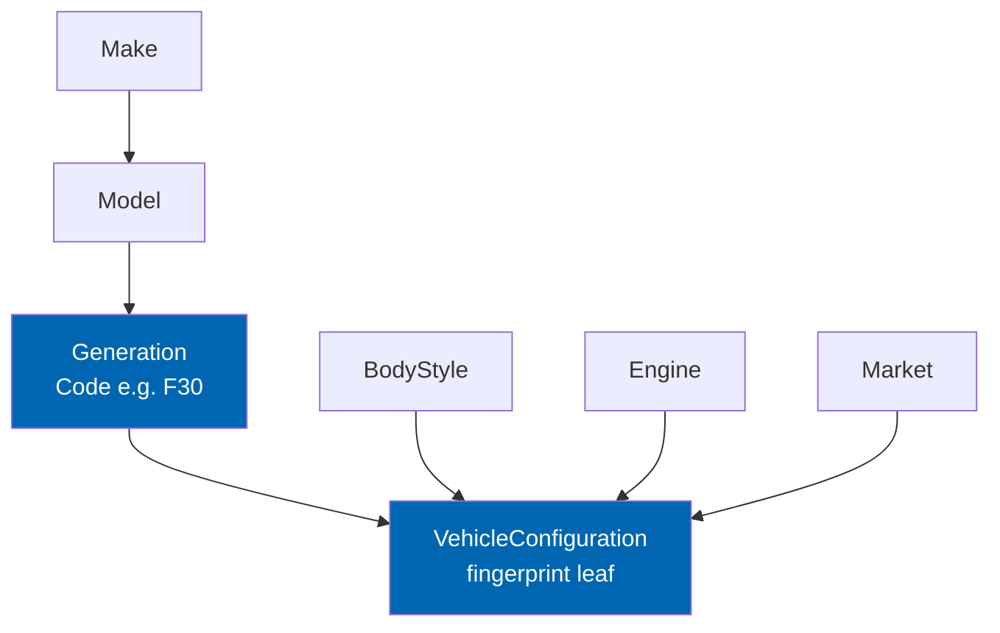
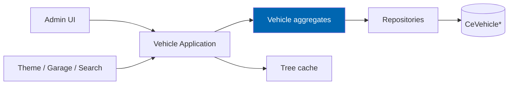

# 12 Vehicle Database

> The brand-agnostic vehicle hierarchy, configuration model, curation methodology, and read APIs that
> every other automotive engine depends on.

**Status:** Review · **Owner:** Domain Architect · **Last revised:** 2026-07-28

---

## Contents

- [Executive Summary](#executive-summary)
- [Objectives](#objectives)
- [Scope](#scope)
- [Detailed Specifications](#detailed-specifications)
  - [Hierarchy model](#hierarchy-model)
  - [Vehicle configuration](#vehicle-configuration)
  - [Localisation and aliases](#localisation-and-aliases)
  - [Provenance and lifecycle](#provenance-and-lifecycle)
  - [Admin operations](#admin-operations)
  - [Curation methodology](#curation-methodology)
  - [Read API and caching](#read-api-and-caching)
  - [Initial dataset](#initial-dataset)
  - [Health and scale](#health-and-scale)
- [Architecture](#architecture)
- [User Stories](#user-stories)
- [Acceptance Criteria](#acceptance-criteria)
- [Future Enhancements](#future-enhancements)
- [References](#references)

---

## Executive Summary

The vehicle database is the **structural spine** of Check Engine. Fitment claims target vehicle
configurations; VIN decode resolves to them; search and the garage constrain catalog surfaces by them.
Without a correct, brand-agnostic hierarchy, every downstream feature is theatre.

Takeaways:

1. **Canonical path:** Make → Model → Generation → (BodyStyle, Engine, Market, Trim) → Configuration leaf.
2. **BMW is the first dataset, never a schema special case** (`FR-130`, `ADR-004`).
3. **Configurations are fitment targets.** Incomplete paths cannot be published as claims (`FR-121`).
4. **Archive, do not delete** nodes that have children or claims (`FR-110`).
5. **No licensed feed required for operation** (`FR-129`, `ADR-003`).

Tables: [10 Database Design](10-database-design.md). Aggregates: [11 Domain Model](11-domain-model.md).

---

## Objectives

| # | Objective | Traces to | Measure |
|---|---|---|---|
| 1 | Specify a hierarchy two engineers implement identically | `FR-101`–`FR-104` | Schema + API match this doc |
| 2 | Make brand expansion an admin data task, not a deploy | `FR-120`, `BR-025` | New Make without code change |
| 3 | Support reference scale with selector performance | `FR-123`, `NFR` tree budgets | 50 / 5,000 / 40,000 capacity |
| 4 | Preserve historical fitment when nodes retire | `FR-109`, `FR-110` | Inactive retained; delete blocked |
| 5 | Ship a commercially useful BMW slice for Horizon 1 | `FR-119` | Launch-region demand generations covered |

---

## Scope

### In scope

- Hierarchy semantics, configuration fingerprint, aliases, localisation
- Admin create/edit/merge/archive, provenance, health reports
- Read APIs for theme, search, garage, VIN, fitment
- Curation process and BMW-first dataset scope
- Caching and empty-branch filtering for selectors

### Out of scope

| Not covered | Where |
|---|---|
| VIN position maps | [13](13-vin-engine.md) |
| Fitment claim logic | [15](15-fitment-engine.md) |
| Import file formats | [24](24-product-import-pipeline.md) |
| SEO landing page generation | [27](27-seo-strategy.md) / `FR-430`+ in [16](16-search-engine.md) |
| Table DDL | [10](10-database-design.md) |

### Assumptions

- Arabic and English locale resources exist for display names (`FR-102`).
- Engine and BodyStyle may be shared across configurations (lookup tables).
- `FR-103` “configurable depth per Make” is satisfied by **optional levels** (null Engine/Body/Market) and
  display metadata, not by inventing arbitrary new table types per make.

### Dependencies

[02](02-functional-requirements.md) Block 100, [10](10-database-design.md), [11](11-domain-model.md),
[08](08-system-architecture.md).

---

## Detailed Specifications

### Hierarchy model

| Level | Entity | Required for configuration? | Notes |
|---|---|---|---|
| Make | `VehicleMake` | Yes | Admin-creatable (`FR-120`) |
| Model | `VehicleModel` | Yes | Slug unique per make |
| Generation | `VehicleGeneration` | Yes | **Code** is first-class (`FR-116`) |
| BodyStyle | `BodyStyle` | Optional | Sedan, Touring, … |
| Engine | `Engine` | Optional | Code, displacement, fuel, power (`FR-117`) |
| Market | `Market` | Optional | ECE, USDM, GCC, JDM (`FR-118`) |
| Trim | on configuration | Optional | `TrimName` |
| Production window | on configuration / generation | Optional | Dates / year range (`FR-127`) |

**Manufacturer-neutral naming:** no `Bmw*` types, tables, or columns (`FR-130`).

**Attributes without hierarchy change:** chassis and platform codes on configuration or generation
attribute bags (`FR-126`) — Horizon 1 uses `ChassisCodes` on `CeVehicleConfiguration` and Generation
`Code` for platform-style codes.

### Vehicle configuration

A **Vehicle Configuration** is the leaf used by fitment, garage, and search context (`FR-104`).

| Field | Rule |
|---|---|
| `GenerationId` | Required |
| `EngineId`, `BodyStyleId`, `MarketId`, `TrimName` | Optional but contribute to fingerprint |
| `ProductionFrom` / `ProductionTo` | Inclusive dates; open-ended nulls allowed |
| `Fingerprint` | Hash of distinguishing attributes; globally unique (`INV-004`) |
| `IsActive` | Customer selectors hide inactive (`FR-109`, `FR-128`) |

**Completeness for fitment target (`FR-121`):** a configuration is *fitment-eligible* when it has a
valid generation, an active path to an active make, and a fingerprint. Operators may require Engine
for certain categories via settings, but the engine does not hardcode manufacturer rules.

**Year-range display (`FR-127`):** selectors show `YearFrom`–`YearTo` derived from generation and/or
configuration production windows; never invent years not present in data.

### Localisation and aliases

| Concern | Behaviour |
|---|---|
| Display names | English and Arabic required for customer-visible nodes (`FR-102`) |
| Slugs | Stable, URL-safe; per-parent uniqueness |
| Aliases (`FR-107`) | Multiple strings per node (e.g. "3 Series", "3er", "الفئة الثالثة") map to one canonical id |
| Search (`FR-106`) | Name, code, alias — all languages |

**Horizon 1 persistence for aliases:** `CeVehicleAlias` table (Make/Model/Generation scoped) with
`NodeType`, `NodeId`, `Locale`, `AliasText`, unique on normalised alias per type. If not present in the
baseline migration yet, it is added in the vehicle-feature migration set and is normative here.

### Provenance and lifecycle

| Event | Record |
|---|---|
| Create / edit | Curator id, timestamp, source (`FR-108`) |
| Import | Import batch id |
| Archive | Soft inactive; no hard delete if children or claims (`FR-110`) |
| Merge (`FR-112`) | Survivor id; reassign children and fitment claims; audit entry |

Inactive nodes remain evaluable for historical claims (`FR-109`) but are hidden from selectors
(`FR-128`). Empty branches (no sellable published fitments) are also hidden from customer selectors.

### Admin operations

| Operation | Rules |
|---|---|
| Create / edit | Permission `ManageCheckEngineCatalog` |
| Archive | Blocked if would orphan required structure incorrectly; prefer archive over delete |
| Merge | Transactional; audit; cannot merge across Makes |
| Bulk edit (`FR-124`) | Transactional + audited |
| External key (`FR-122`) | Optional reconciliation key per node |

### Curation methodology

| Principle | Practice |
|---|---|
| Own the data | No runtime dependency on TecDoc-class feeds (`FR-129`) |
| Evidence | Prefer OEM documentation, parts catalogues, VIN-confirmed samples |
| Confidence of structure | Incomplete configurations stay inactive until verified |
| BMW-first (`FR-119`) | Passenger cars in commercial demand for the launch region; expand by generation priority list owned by Domain Owner |
| Brand expansion | New Make = data entry + optional VIN decoder pack ([13](13-vin-engine.md)); zero core schema change |

### Read API and caching

Host-internal Application services (not Horizon 5 public REST):

| Operation | Purpose |
|---|---|
| `GetChildren(parentType, parentId)` | Tree browse (`FR-105`) |
| `SearchNodes(query, locale)` | Typeahead (`FR-106`) |
| `GetConfiguration(id)` | Resolve leaf |
| `GetPath(configurationId)` | Breadcrumb Make›Model›… |
| `ListMakes(activeOnly, withSellableFitmentsOnly)` | Selector root |

**Caching (`FR-114`):** tree fragments and path DTOs cached; invalidate on any mutation of the node or
its ancestors/descendants in the cached slice. Web farm uses distributed cache ([08](08-system-architecture.md)).

### Initial dataset

| Scope | Horizon 1 commitment |
|---|---|
| Make | BMW (and optionally MINI if commercially required — still separate Make rows) |
| Coverage | Generations with active spare-parts demand in launch region |
| Quality bar | Every customer-selectable configuration has at least one path to sellable fitment or is hidden |
| Seed | Optional sample slice for demo installs; production operators load curated data via import/admin |

### Health and scale

| Report (`FR-125`) | Detects |
|---|---|
| Orphans | Nodes with missing parent |
| Incomplete paths | Configurations missing required generation |
| No-fitment leaves | Active configurations with zero published Fits claims |
| Alias collisions | Two nodes sharing normalised alias in same make scope |

**Scale (`FR-123`):** ≥ 50 Makes, ≥ 5,000 Models, ≥ 40,000 Configurations without redesign.

---

## Architecture

### Rejected alternatives

| Alternative | Rejected because |
|---|---|
| Fitment via category tree only | Cannot express qualified many-to-many |
| Manufacturer-specific tables | Violates `FR-130` |
| Hard-delete nodes | Breaks historical claims (`FR-110`) |
| Licensed feed as system of record | `ADR-003` |

---

## User Stories

| ID | Persona | Story | FR | Points | Priority |
|---|---|---|---|---|---|
| `US-301` | Operator | Browse and edit the vehicle tree in admin | `FR-111` | 8 | Must |
| `US-302` | Customer | Select Make › Model › Generation › options in Arabic | `FR-105`, `FR-102` | 8 | Must |
| `US-303` | Operator | Merge duplicate generations without losing claims | `FR-112` | 8 | Must |
| `US-304` | Operator | Add a new Make without waiting for a release | `FR-120` | 5 | Must |
| `US-305` | Operator | See which configurations have no fitments | `FR-125` | 5 | Should |

---

## Acceptance Criteria

**`AC-12.1`** — Brand-neutral schema
Given plugin tables and domain types, when scanned for manufacturer names in identifiers, then none appear (`FR-130`).

**`AC-12.2`** — Archive over delete
Given a generation with fitment claims, when delete is attempted, then the API rejects and archive succeeds (`FR-110`).

**`AC-12.3`** — Selector hiding
Given an inactive configuration and an active configuration with no published fitments, when the customer selector loads, then neither appears (`FR-109`, `FR-128`).

**`AC-12.4`** — Merge integrity
Given two models merged, when complete, then all children and claims point to the survivor and an audit row exists (`FR-112`).

**`AC-12.5`** — Cache invalidation
Given a cached tree, when a model is renamed, then subsequent reads show the new name within the invalidation SLA (`FR-114`).

---

## Future Enhancements

| Enhancement | Horizon | Notes |
|---|---|---|
| Commercial vehicle / motorcycle taxonomies | 4+ | Same schema |
| Automated conflict detection across import sources | 2 | With [24](24-product-import-pipeline.md) |
| Public read API for configurations | 5 | [08](08-system-architecture.md) |

---

## References

- [02 Functional Requirements](02-functional-requirements.md) — `FR-101`–`FR-130`
- [10 Database Design](10-database-design.md)
- [11 Domain Model](11-domain-model.md)
- [13 VIN Engine](13-vin-engine.md)
- [15 Fitment Engine](15-fitment-engine.md)
- [20 Customer Garage](20-customer-garage.md)
