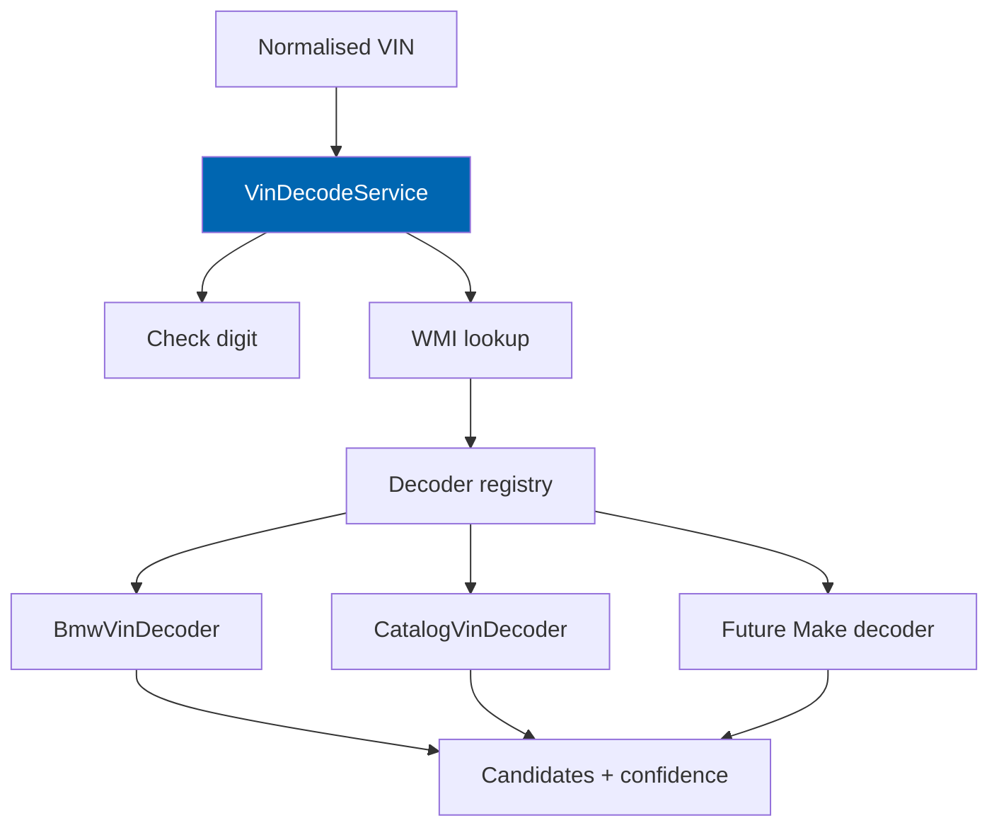
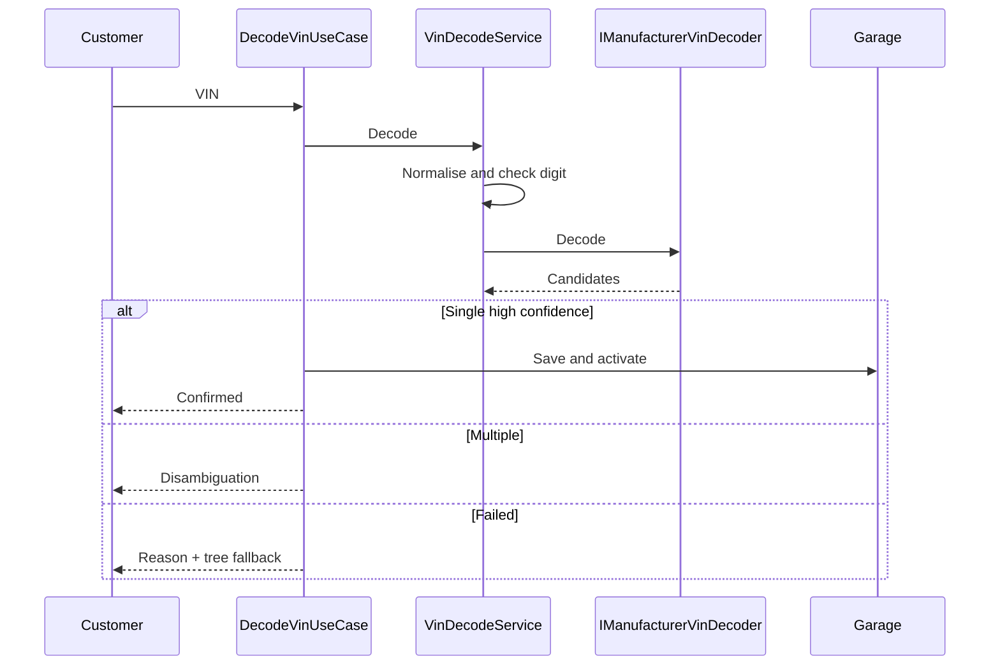

# 13 VIN Engine

> Normalisation, ISO 3779 check-digit validation, WMI resolution, pluggable manufacturer decoders,
> confidence scoring, and privacy-aware logging for Vehicle Identification Numbers.

**Status:** Review · **Owner:** Domain Architect · **Last revised:** 2026-08-25

**Engineering status (2026-08-25):** Plugin `0.104.0` is in tree. Progress, evidence gates (G1–G6 done; G11 packing partial), and remaining blockers (H1.35/G8, G7, G11 vendor signing, G12) are recorded in [EXECUTION-PLAN.md](../EXECUTION-PLAN.md). This document remains the specification baseline.

---

## Contents

- [Executive Summary](#executive-summary)
- [Objectives](#objectives)
- [Scope](#scope)
- [Detailed Specifications](#detailed-specifications)
  - [Input normalisation](#input-normalisation)
  - [Check digit](#check-digit)
  - [Segmentation and WMI](#segmentation-and-wmi)
  - [Decoder plugin model](#decoder-plugin-model)
  - [Decode results and confidence](#decode-results-and-confidence)
  - [BMW Horizon 1 decoder](#bmw-horizon-1-decoder)
  - [Catalog VIN decoder (H1.6a)](#catalog-vin-decoder-h16a)
  - [Caching and rate limiting](#caching-and-rate-limiting)
  - [Privacy and logging](#privacy-and-logging)
  - [Integration points](#integration-points)
  - [API contracts](#api-contracts)
- [Architecture](#architecture)
- [User Stories](#user-stories)
- [Acceptance Criteria](#acceptance-criteria)
- [Future Enhancements](#future-enhancements)
- [References](#references)

---

## Executive Summary

The VIN engine turns a **17-character chassis number** into a **vehicle context** the rest of Check
Engine can use. It is the highest-value retail entry point and a hard correctness problem: silent wrong
decode is worse than failure.

Takeaways:

1. **Core is brand-agnostic.** Position maps live in pluggable decoders + data (`FR-204`).
2. **Check-digit failure ≠ decode failure** — distinct reason codes (`FR-202`).
3. **Multiple candidates require disambiguation UI**, never silent pick (`FR-206`).
4. **BMW decoder ships in Horizon 1** for supported WMI ranges (`FR-211`). The H1.6a catalog decoder covers the other top-10 passenger brands with **documented VDS only**.
5. **Full VIN is not logged by default** (`FR-212`, `FR-213`).
6. **Unknown VDS fails closed** (`vin.decode_failed`). Do not fabricate VDS→generation maps.

Budget: ≤ 40 ms local decode excluding external calls ([03](03-non-functional-requirements.md)).

---

## Objectives

| # | Objective | Traces to | Measure |
|---|---|---|---|
| 1 | Specify deterministic normalisation and ISO check digit | `FR-201`, `FR-202` | Unit tests vs golden vectors |
| 2 | Keep manufacturer maps out of core evaluation | `FR-204`, `FR-210` | Architecture + registration tests |
| 3 | Return structured success/failure with confidence | `FR-205`–`FR-207` | Contract tests |
| 4 | Meet privacy and rate-limit requirements | `FR-212`–`FR-215` | Log scrub + limit tests |
| 5 | Attach results to garage and fitment | `FR-214` | Integration with [20](20-customer-garage.md) |

---

## Scope

### In scope

- VIN accept/reject rules, check digit, WMI/VDS/VIS handling
- Decoder port, registration, enable/disable
- Confidence model and candidate ranking
- Cache, rate limit, logging/masking
- Host-internal decode API

### Out of scope

| Not covered | Where |
|---|---|
| Vehicle hierarchy data | [12](12-vehicle-database.md) |
| Fitment evaluation after context set | [15](15-fitment-engine.md) |
| Search mode orchestration | [16](16-search-engine.md) |
| External paid VIN APIs as authority | Rejected for Horizon 1 core path |

### Assumptions

- Decoders may use only local data in Horizon 1 (WMI table, patterns). Optional external enrichment is
  Horizon 2+ and must not override local high-confidence results without review policy.
- Characters `I`, `O`, `Q` are invalid in VINs per ISO practice.

### Dependencies

[12](12-vehicle-database.md), [11](11-domain-model.md), [10](10-database-design.md) (`CeVinWmi`,
`CeVinPattern`), [02](02-functional-requirements.md) `FR-201`–`FR-215`.

---

## Detailed Specifications

### Input normalisation

| Step | Rule (`FR-201`) |
|---|---|
| Trim | Remove leading/trailing whitespace |
| Case | Uppercase A–Z |
| Separators | Remove spaces and hyphens inside the string |
| Length | Must be exactly 17 after normalisation |
| Charset | Digits + letters excluding I, O, Q |
| Failure | Reason code `vin.invalid_length` or `vin.invalid_charset` |

Value object: `Vin` ([11](11-domain-model.md)).

### Check digit

| Topic | Specification |
|---|---|
| Standard | ISO 3779 transliteration and weighted sum |
| Position | 9th character |
| Failure code | `vin.check_digit_failed` — distinct from decode miss (`FR-202`) |
| Operator override | Admin setting may allow “accept with warning” for known non-ISO markets; default **reject**; storefront shows clear message |

### Segmentation and WMI

| Segment | Positions | Use |
|---|---|---|
| WMI | 1–3 | Resolve to Make via `CeVinWmi` (`FR-203`) |
| VDS | 4–9 | Decoder interprets (check digit at 9) |
| VIS | 10–17 | Model year / plant / serial per decoder (`FR-208`) |

Unknown WMI → failure `vin.wmi_unknown` (structured, not empty success) (`FR-207`).

### Decoder plugin model



| Rule | Detail |
|---|---|
| Port | `IManufacturerVinDecoder` with `CanDecode(wmi)`, `Decode(vin) → DecodeContribution` |
| Registration | DI + admin enable flags (`FR-210`); data-driven patterns in `CeVinPattern` |
| Core | Must not contain manufacturer position switch statements (`FR-204`) |
| Disable | Disabled decoder skipped; falls through to structured failure if none apply |

### Decode results and confidence

| Outcome | Behaviour |
|---|---|
| Single candidate above auto-accept threshold | Return configuration id + confidence (`FR-205`) |
| Multiple candidates | Return ranked list; UI disambiguates (`FR-206`) |
| None | `vin.decode_failed` with partial hints if WMI known (`FR-207`) |
| Model year / build | Optional fields when decoder supports (`FR-208`) |

**Confidence (0.00–1.00):**

| Factor | Effect |
|---|---|
| Exact pattern → single configuration | High (e.g. ≥ 0.90) |
| Generation+engine resolved, trim ambiguous | Mid; multiple candidates |
| WMI-only | Low; do not auto-set garage without disambiguation |

Auto-accept threshold is a setting (default 0.85). Below threshold → always disambiguation or failure.

### BMW Horizon 1 decoder

| Commitment (`FR-211`) | Detail |
|---|---|
| Scope | Supported WMI ranges for BMW passenger vehicles in curated table |
| Depth | Resolve to **Generation and Engine** where data allows; Body/Market when patterned |
| Delivery | Separate class library or feature folder implementing `IManufacturerVinDecoder` + seed patterns |
| Gaps | Undocumented VIS variants → candidates or failure, never guess publish |

### Catalog VIN decoder (H1.6a)

Horizon 1 also ships a data-driven `CatalogVinDecoder` for the other top-10 passenger brands besides
BMW. It is a **catalog**, not a second manufacturer-specific engine: WMI allow-lists and VDS prefixes
live in seed JSON; the Domain stays brand-agnostic (`FR-204`, `INV-013`).

| Commitment | Detail |
|---|---|
| Brands | Toyota, Volkswagen, Honda, Hyundai, Ford, Mercedes-Benz, Nissan, Kia, Chevrolet (BMW remains the `BmwVinDecoder` exemplar) |
| Depth | WMI → Make, then documented VDS prefix → generation/model when the prefix is in the curated table |
| Provenance | NHTSA manufacturer lists and documented VDS only. Plugin 0.104.0 ships 224 non-BMW VDS prefixes |
| Fail-closed | Unknown or shared/skipped WMI, or undocumented VDS, returns `vin.decode_failed` with partial WMI hints — never a guessed configuration |
| Shared WMI skips | No Kia `5NP`; no Hyundai `3KP`; skip `3MY`, `1ZV`, `3GP`, Crown/`AAA`, CC/`HP7` |
| Forbidden | Fabricating VDS→generation patterns to “complete” a brand |

Engineering evidence for H1.6a is recorded in [EXECUTION-PLAN.md](../EXECUTION-PLAN.md). OEM-complete
VDS maps remain un-fabricated.

### Caching and rate limiting

| Concern | Rule |
|---|---|
| Cache key | Normalised VIN (`FR-209`) |
| TTL | Configurable (default 24 h); invalidate not required on vehicle edits unless pattern tables change (then flush VIN cache) |
| Rate limit (`FR-215`) | Per IP and per customer on public decode API; limits in [28](28-security.md) |
| Budget | ≤ 40 ms local path |

### Privacy and logging

| Rule | Detail |
|---|---|
| Default logs | Correlation id, success/fail, reason code, WMI, **not** full VIN (`FR-212`) |
| Masking | Show last 4 or hash per setting (`FR-213`) |
| Analytics | Same redaction (`FR-413` alignment) |
| Garage storage | Full normalised VIN allowed in `CeGarageVehicle` with purge on customer delete |

### Integration points

| Consumer | Use |
|---|---|
| Search VIN mode | Decode → set context → fitment filter ([16](16-search-engine.md)) |
| Garage | Attach VIN + configuration (`FR-214`) |
| Fitment | Evaluation request may include VIN-derived build date |
| Admin | Decoder enable, pattern CRUD, test decode tool |

### API contracts

**`DecodeVin` (Application)**

Request: `{ "vin": "…" }`

Success response (illustrative):

```json
{
  "outcome": "SingleMatch",
  "normalisedVin": "WBA8E9G51GNT12345",
  "checkDigitValid": true,
  "wmi": "WBA",
  "makeId": 1,
  "candidates": [
    {
      "vehicleConfigurationId": 10041,
      "confidence": 0.92,
      "displayPath": { "en": "BMW › 3 Series › F30 › …", "ar": "…" },
      "modelYear": 2016
    }
  ],
  "reasonCode": null
}
```

Multi: `outcome: "NeedsDisambiguation"`. Failure: `outcome: "Failed"`, `reasonCode` set, `candidates` empty.

---

## Architecture



### Rejected alternatives

| Alternative | Rejected because |
|---|---|
| Hardcoded BMW maps in core service | `FR-204` |
| Always call external VIN API | Latency, cost, privacy, single vendor risk |
| Silent best-guess configuration | `FR-206`, safety |

---

## User Stories

| ID | Persona | Story | FR | Points | Priority |
|---|---|---|---|---|---|
| `US-311` | Customer | Paste VIN and see my car confirmed | `FR-205` | 8 | Must |
| `US-312` | Customer | Choose among candidate cars when decode is ambiguous | `FR-206` | 5 | Must |
| `US-313` | Customer | See a clear error when VIN is invalid | `FR-201`, `FR-207` | 3 | Must |
| `US-314` | Admin | Disable a decoder without redeploying | `FR-210` | 3 | Must |
| `US-315` | Security reviewer | Confirm logs do not store full VIN by default | `FR-212` | 3 | Must |

---

## Acceptance Criteria

**`AC-13.1`** — Check digit distinct
Given a VIN with wrong check digit, when decoded, then `reasonCode` is `vin.check_digit_failed` (`FR-202`).

**`AC-13.2`** — No silent pick
Given two candidates with confidence 0.70 and 0.68, when decoded, then outcome is `NeedsDisambiguation` (`FR-206`).

**`AC-13.3`** — Core purity
Given Domain/Application VIN core, when scanned for manufacturer position maps, then none exist outside decoder assemblies (`FR-204`).

**`AC-13.4`** — Latency
Given local BMW pattern decode on reference hardware, when measured, then p95 ≤ 40 ms excluding network (`FR-330` family / NFR).

**`AC-13.5`** — Log redaction
Given default config, when a decode is logged, then the full 17-character VIN does not appear in the log message (`FR-212`).

---

## Future Enhancements

| Enhancement | Horizon | Notes |
|---|---|---|
| Additional make decoders | 1+ rolling | Same port |
| Optional external VIN enrichment | 2 | Never auto-authorise fitment |
| Camera / OCR VIN capture | 2 | Theme concern |

---

## References

- [12 Vehicle Database](12-vehicle-database.md)
- [15 Fitment Engine](15-fitment-engine.md)
- [16 Search Engine](16-search-engine.md)
- [20 Customer Garage](20-customer-garage.md)
- [28 Security](28-security.md)
- ISO 3779 — VIN content and structure
