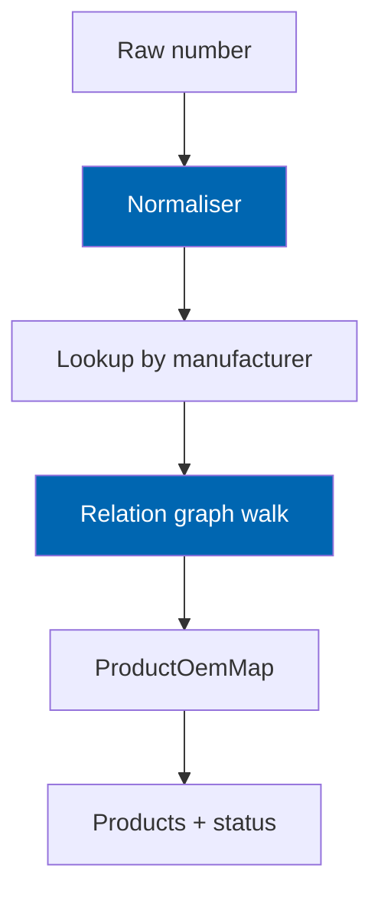

# 14 OEM Engine

> Part-number registry, normalisation, manufacturer qualification, cross-references, supersession
> chains, aftermarket equivalence, and product linkage.

**Status:** Review · **Owner:** Domain Architect · **Last revised:** 2026-07-28

---

## Contents

- [Executive Summary](#executive-summary)
- [Objectives](#objectives)
- [Scope](#scope)
- [Detailed Specifications](#detailed-specifications)
  - [Registry model](#registry-model)
  - [Normalisation](#normalisation)
  - [Lookup and disambiguation](#lookup-and-disambiguation)
  - [Relations graph](#relations-graph)
  - [Supersession](#supersession)
  - [Aftermarket equivalence](#aftermarket-equivalence)
  - [Product linkage](#product-linkage)
  - [Obsolescence and conflicts](#obsolescence-and-conflicts)
  - [Admin and import](#admin-and-import)
  - [Storefront behaviour](#storefront-behaviour)
  - [API contracts](#api-contracts)
- [Architecture](#architecture)
- [User Stories](#user-stories)
- [Acceptance Criteria](#acceptance-criteria)
- [Future Enhancements](#future-enhancements)
- [References](#references)

---

## Executive Summary

Trade buyers search by **the number on the old part**. The OEM engine makes those numbers first-class:
normalised identity, manufacturer qualification, supersession, and links to sellable products.

Takeaways:

1. **Numbers are not globally unique** — manufacturer qualifier required or inferred (`FR-228`).
2. **Compare on normalised form; display the canonical display form** (`FR-221`).
3. **Supersession is directed and transitive; never bidirectional** (`FR-224`, `FR-225`).
4. **Aftermarket equivalence is explicit and labelled** (`FR-226`).
5. **Scale:** ≥ 500,000 registry entries within lookup budgets (`FR-235`).

---

## Objectives

| # | Objective | Traces to | Measure |
|---|---|---|---|
| 1 | Define normalisation rules implementable as pure functions | `FR-222` | Golden-vector unit tests |
| 2 | Specify relation types and graph walk limits | `FR-223`–`FR-226` | Cycle and depth tests |
| 3 | Link OEM ↔ product many-to-many | `FR-229` | Map table + API |
| 4 | Honour supersession on storefront OEM search | `FR-233`, `FR-234` | Journey J2 |
| 5 | Support upsert import by manufacturer + normalised number | `FR-236` | Import integration |

---

## Scope

### In scope

- Registry, normalisation, lookup, relations, supersession, aftermarket, product maps
- Admin CRUD, conflict flags, obsolescence
- Host-internal APIs for theme, search, import, ERP

### Out of scope

| Not covered | Where |
|---|---|
| Kit member deep UX | Horizon 2 `FR-238` |
| Fitment of OEM to vehicle | [15](15-fitment-engine.md) |
| Search ranking UI | [16](16-search-engine.md) |
| ERP field mapping detail | [18](18-erpnext-integration.md) |

### Assumptions

- `CeManufacturer` distinguishes OE brands and aftermarket brands (`IsOeBrand`).
- Default normalisation is case-fold + strip spaces/hyphens; per-manufacturer overrides are data.

### Dependencies

[10](10-database-design.md), [11](11-domain-model.md), [02](02-functional-requirements.md) `FR-220`–`FR-240`.

---

## Detailed Specifications

### Registry model

| Entity | Role |
|---|---|
| `Manufacturer` | Qualifier for numbers (`FR-220`) |
| `OemNumber` | `DisplayNumber` + `NormalisedNumber` + `ManufacturerId` (`FR-221`) |
| `OemRelation` | Directed edge with `RelationType` and validity dates |
| `ProductOemMap` | Product ↔ OEM (`FR-229`) |

Unique key: `(ManufacturerId, NormalisedNumber)` (`INV-001`).

### Normalisation

| Rule (`FR-222`) | Default |
|---|---|
| Trim | Yes |
| Remove | Spaces, hyphens, dots used as separators |
| Case | Uppercase ASCII letters |
| Unicode | Preserve digits; strip decorative punctuation |
| Per-manufacturer | Optional rule pack (e.g. keep leading zeros) stored as settings/data |

Examples (illustrative BMW-style input → same normalised identity):

| Input | Normalised |
|---|---|
| `11-51-7-586-925` | `11517586925` |
| `11 51 7 586 925` | `11517586925` |
| `11517586925` | `11517586925` |

Display form remains the curated canonical string for UI (`DisplayNumber`).

### Lookup and disambiguation

| Step | Behaviour (`FR-227`, `FR-228`) |
|---|---|
| 1 | Normalise input |
| 2 | If manufacturer provided → unique lookup |
| 3 | If not → search all manufacturers; 0 → not found; 1 → use; many → require qualifier |
| 4 | Never pick silently among manufacturers |

Reason codes: `oem.not_found`, `oem.ambiguous_manufacturer`.

### Relations graph

| `OemRelationType` | Meaning | Bidirectional? |
|---|---|---|
| `CrossReference` | Alternate numbering | May add reverse explicitly |
| `Supersession` | From obsolete → To current (`replaces` direction: **From** is old, **To** is new) | **Never** auto-reverse (`FR-225`) |
| `Equivalent` | Functional equivalent (often aftermarket) | Explicit edges |
| `Alternate` | Packaging / region alternate | Explicit |
| `KitMember` | Component-of kit (`FR-238` Horizon 2) | Horizon 2 |

`From ≠ To` (`INV-002`). Simple cycle refuse on supersession write (`INV-003`).

### Supersession

| Rule | Detail |
|---|---|
| Transitive resolve (`FR-224`) | Walk `Supersession` To-side until leaf or depth cap (default 10) |
| Lookup UX (`FR-234`) | Query on obsolete number shows current + “superseded” status |
| Validity dates | Optional `ValidFrom` / `ValidTo` on relation |
| Obsolete flag (`FR-239`) | Mark number obsolete without deleting historical links |

### Aftermarket equivalence

| Rule (`FR-226`) | Detail |
|---|---|
| Edge | `Equivalent` (or dedicated type) from OE number to aftermarket number |
| Brand | Aftermarket `Manufacturer` with `IsOeBrand = false` |
| Storefront | Label aftermarket clearly; never present as genuine OE |
| Fitment | Still constrained by vehicle context when active |

### Product linkage

| Cardinality | Support |
|---|---|
| One OEM → many products | Yes (quality grades, suppliers) |
| One product → many OEMs | Yes (supersessions, dual labelling) |
| Primary | `IsPrimary` on `CeProductOemMap` |

### Obsolescence and conflicts

| Case | Handling |
|---|---|
| Conflicting cross-refs (`FR-232`) | Flag for review queue; do not auto-delete |
| Duplicate normalised insert | Upsert (`FR-236`) |
| Delete | Prefer deactivate/`IsActive = false`; retain maps historically as needed |

### Admin and import

| Capability | FR |
|---|---|
| CRUD numbers and relations | `FR-230` |
| Provenance on import | `FR-231` |
| Bulk upsert | `FR-236` |
| APIs for theme/search/ERP | `FR-237` |

### Storefront behaviour

| Surface | Behaviour |
|---|---|
| OEM search mode | Resolve → products + supersession banner (`FR-233`, `FR-234`) |
| Product page OEM display | Show / hide / trade-only (`FR-240`) |
| Garage saved OEM | Stores registry id when resolved |

### API contracts

**`ResolveOem`**

Request: `{ "number": "11-51-7-586-925", "manufacturerId": null }`

Response (success): registry id, display, normalised, manufacturer, `isObsolete`, `currentOemNumberId` if superseded, linked `productIds`.

**`GetSupersessionChain(oemNumberId)`** — ordered from queried node to current leaf.

---

## Architecture

### Rejected alternatives

| Alternative | Rejected because |
|---|---|
| Global unique part numbers | False in multi-brand catalogs (`FR-228`) |
| Bidirectional supersession | Wrong commercially (`FR-225`) |
| Storing only display form | Matching fails on separators (`FR-221`) |

---

## User Stories

| ID | Persona | Story | FR | Points | Priority |
|---|---|---|---|---|---|
| `US-321` | Trade buyer | Search by number on the old part and find equivalents | `FR-227`, `FR-233` | 8 | Must |
| `US-322` | Trade buyer | See that my number was superseded and get the current one | `FR-234` | 5 | Must |
| `US-323` | Operator | Import OEM list upserting by normalised key | `FR-236` | 8 | Must |
| `US-324` | Operator | Link two OEMs as supersession in admin | `FR-230` | 5 | Must |
| `US-325` | Customer | Never mistake aftermarket for genuine | `FR-226` | 5 | Must |

---

## Acceptance Criteria

**`AC-14.1`** — Normalisation identity
Given the three variants of `11517586925` with separators, when normalised, then all equal (`FR-222`).

**`AC-14.2`** — Ambiguous manufacturer
Given the same normalised number under two manufacturers, when lookup omits manufacturer, then `oem.ambiguous_manufacturer` (`FR-228`).

**`AC-14.3`** — Supersession direction
Given A supersedes to B, when resolving A, then current is B; resolving B does not return A as current (`FR-225`).

**`AC-14.4`** — Transitive
Given A→B→C supersession, when resolving A, then current is C within depth cap (`FR-224`).

**`AC-14.5`** — Scale smoke
Given 500,000 synthetic OEM rows, when looking up by normalised number + manufacturer, then p95 within NFR lookup budget (`FR-235`).

---

## Future Enhancements

| Enhancement | Horizon | Notes |
|---|---|---|
| Kit / assembly (`FR-238`) | 2 | `KitMember` relations |
| Interchange standards import connectors | 2 | For operators with licensed feeds |
| Public OEM API | 5 | [08](08-system-architecture.md) |

---

## References

- [10 Database Design](10-database-design.md)
- [11 Domain Model](11-domain-model.md)
- [15 Fitment Engine](15-fitment-engine.md)
- [16 Search Engine](16-search-engine.md)
- [24 Product Import Pipeline](24-product-import-pipeline.md)
