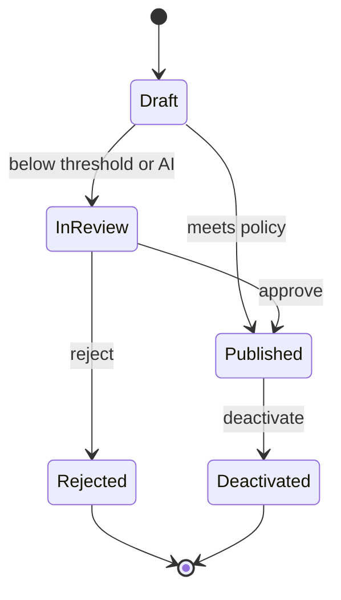
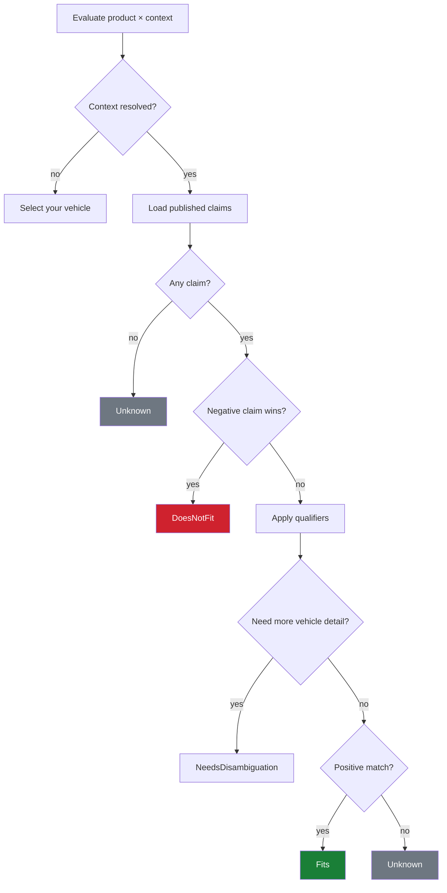
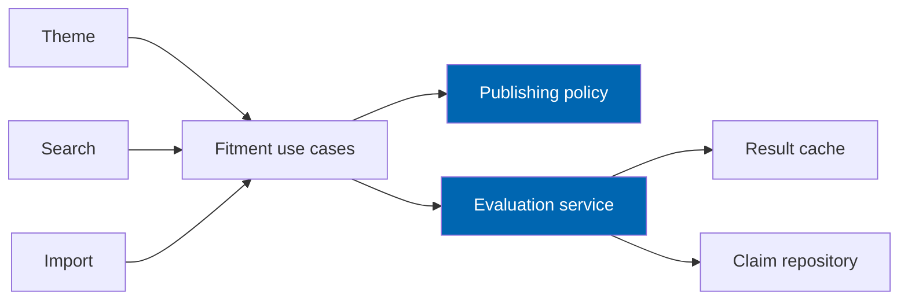

# 15 Fitment Engine

> Applicability claims between products and vehicle configurations: qualifiers, confidence, provenance,
> publication policy, safety-critical hard stops, evaluation algorithm, caching, and review workflow.

**Status:** Review · **Owner:** Domain Architect · **Last revised:** 2026-07-28

---

## Contents

- [Executive Summary](#executive-summary)
- [Objectives](#objectives)
- [Scope](#scope)
- [Detailed Specifications](#detailed-specifications)
  - [Claim model](#claim-model)
  - [Evaluation outcomes](#evaluation-outcomes)
  - [Qualifiers](#qualifiers)
  - [Confidence and provenance](#confidence-and-provenance)
  - [Publication and review](#publication-and-review)
  - [Safety-critical hard stop](#safety-critical-hard-stop)
  - [Evaluation algorithm](#evaluation-algorithm)
  - [Customer surfaces](#customer-surfaces)
  - [Bulk evaluation and caching](#bulk-evaluation-and-caching)
  - [Corrections](#corrections)
  - [Coverage reports](#coverage-reports)
  - [API contracts](#api-contracts)
- [Architecture](#architecture)
- [User Stories](#user-stories)
- [Acceptance Criteria](#acceptance-criteria)
- [Future Enhancements](#future-enhancements)
- [References](#references)

---

## Executive Summary

Fitment is **why Check Engine exists**. A Fitment Claim asserts that a product applies to a vehicle
configuration. Evaluation returns Fits, DoesNotFit, Unknown, or NeedsDisambiguation — and **never fails
open into Fits** when data is missing ([34](34-coding-standards.md)).

Takeaways:

1. **Published claims only** affect verified-fit customer surfaces (`FR-303`, `FR-304`).
2. **AI and low confidence never auto-publish**; safety-critical categories hard-stop (`FR-316`, `ADR-008`).
3. **Qualifiers are structured** (dates, steering, market, drive, transmission, options) (`FR-305`).
4. **Missing qualifier context lowers confidence**, it does not invent a match (`FR-307`).
5. **Brand-agnostic evaluation** — no manufacturer branches (`FR-324`).

Budgets: ≤ 20 ms cached / ≤ 50 ms uncached single evaluation ([03](03-non-functional-requirements.md)).

---

## Objectives

| # | Objective | Traces to | Measure |
|---|---|---|---|
| 1 | Specify evaluation outcomes and surface filtering rules | `FR-302`–`FR-304` | Contract + UI tests |
| 2 | Encode publication, review, and safety hard stops | `FR-313`–`FR-317` | Policy unit tests |
| 3 | Define qualifier intersection behaviour | `FR-305`–`FR-309` | Scenario tests |
| 4 | Provide service API for search, import, ERP, theme | `FR-321` | Integration |
| 5 | Meet latency budgets with cache invalidation | `FR-323`, `FR-330` | Perf tests |

---

## Scope

### In scope

- Claim lifecycle, evaluation, qualifiers, confidence, provenance, review, safety classes
- Product-page and catalog filtering semantics
- Bulk evaluate, cache keys, coverage reports
- Customer-reported corrections

### Out of scope

| Not covered | Where |
|---|---|
| How search ranks within Fits set | [16](16-search-engine.md) |
| AI proposal generation | [17](17-ai-architecture.md) (`FR-328` Horizon 2) |
| Import row matching UX | [24](24-product-import-pipeline.md) |
| Schema DDL | [10](10-database-design.md) |

### Assumptions

- Product identity is nopCommerce `ProductId`.
- Vehicle identity is `VehicleConfigurationId` from [12](12-vehicle-database.md).
- Domain enums align with [11](11-domain-model.md); source kinds map to `FR-312`.

### Dependencies

[11](11-domain-model.md), [12](12-vehicle-database.md), [14](14-oem-engine.md), [02](02-functional-requirements.md) Block 300,
[03](03-non-functional-requirements.md).

---

## Detailed Specifications

### Claim model

A **Fitment Claim** (`FR-301`) links:

| Field | Role |
|---|---|
| `ProductId` | Part |
| `VehicleConfigurationId` | Vehicle leaf |
| `OemNumberId` | Optional supporting OEM |
| `FitmentStatus` | Fits / DoesNotFit / Unknown / Rejected (storage) |
| Qualifiers | Optional structured constraints |
| `Confidence` | 0.00–1.00 (`FR-310`) |
| Provenance | Source, references, timestamps (`FR-311`) |
| `SafetyClass` | Standard / Elevated / SafetyCritical |
| `IsPublished` | Customer-visible when true |
| Validity dates | Optional window on the claim itself |

Notes (`FR-329`) are curator-only; never a substitute for qualifiers.

### Evaluation outcomes

Runtime evaluation returns (`FR-302`):

| Outcome | Meaning | Verified-fit surfaces |
|---|---|---|
| `Fits` | Published positive claim passes qualifiers | Included |
| `DoesNotFit` | Published negative claim or hard conflict | Excluded (`FR-303`) |
| `Unknown` | No published claim, or insufficient data | Excluded from verified; optional unverified lane (`FR-304`) |
| `NeedsDisambiguation` | Context incomplete for required qualifiers | Prompt for more vehicle detail |

**Fail closed:** errors → `Unknown`, never `Fits`.

### Qualifiers

| Qualifier (`FR-305`) | First-class? | Behaviour |
|---|---|---|
| Production date window | Yes | Intersect with context build/model date (`FR-306`) |
| Steering side | Yes (`FR-308`) | LHD/RHD match |
| Market region | Yes (`FR-309`) | ECE/USDM/GCC/… |
| Drive type | Yes | e.g. RWD/AWD |
| Transmission type | Yes | |
| Option codes | Free-form coded | Match set intersection |

**Missing context (`FR-307`):** if claim requires a qualifier the context lacks, **lower effective
confidence** and may return `NeedsDisambiguation` or `Unknown` rather than discarding the qualifier or
forcing `Fits`.

### Confidence and provenance

| Source type (`FR-312`) | Notes |
|---|---|
| `SupplierCatalog` | Import |
| `CuratorManual` | Admin |
| `AiInference` | Always below publish threshold by default (`FR-328` H2) |
| `CustomerReport` | Review item |
| `VinDecode` | Supporting evidence, not sole publish authority for safety-critical |
| `ImportedFeed` | Operator-owned feed |

Provenance fields: source type, source reference, creator, created UTC, last verified UTC (`FR-311`).

### Publication and review



| Rule | Detail |
|---|---|
| Threshold (`FR-313`) | Setting `MinPublishConfidence` (e.g. 0.80) |
| Below threshold (`FR-314`) | Review queue; not customer-visible |
| Review actions (`FR-315`) | Approve, reject, request evidence, adjust confidence — audited |
| Deactivated (`FR-326`) | Retained; ignored in evaluation |
| AI (`INV-006`) | Cannot publish without review metadata |

### Safety-critical hard stop

| Rule (`FR-316`) | Detail |
|---|---|
| Categories | Braking, steering, suspension, restraints/airbags (configurable map to nopCommerce categories) |
| Hard stop | No configuration allows below-threshold **auto-publish** for these |
| Config changes (`FR-317`) | Elevated permission + audit |

`IFitmentPublishingPolicy` encodes these rules ([11](11-domain-model.md)).

### Evaluation algorithm



**Normative steps:**

1. If no vehicle context → UI state “Select your vehicle” (not a false Fits).
2. Load **published** claims for `ProductId` + `VehicleConfigurationId` (and optional inheritance —
   Horizon 1: **no** silent parent-level inheritance; claims target configuration leaves only).
3. If published `DoesNotFit` (status) exists → `DoesNotFit`.
4. If published `Fits` exists → evaluate qualifiers against context.
5. Qualifier fail → treat as non-match for that claim (not global DoesNotFit unless negative claim).
6. Qualifier incomplete → `NeedsDisambiguation` or confidence-reduced `Unknown` per settings.
7. Else `Fits` with claim confidence.
8. On exception → `Unknown` + log.

**No manufacturer hardcoding** (`FR-324`).

### Customer surfaces

| Surface | Rule |
|---|---|
| Product badge (`FR-320`) | Fits / Does not fit / Unknown / Select your vehicle |
| Search / category with context (`FR-303`) | Exclude `DoesNotFit`; verified mode excludes `Unknown` |
| Unverified lane (`FR-304`) | Only if operator enables; explicitly labelled |

### Bulk evaluation and caching

| Capability | Detail |
|---|---|
| Bulk (`FR-322`) | Product × many vehicles; vehicle × many products — admin/import |
| Cache (`FR-323`) | Key: product + configuration (+ qualifier context hash); invalidate on claim mutation |
| Async re-eval | Queue for mass invalidation (`ADR-013`) |
| Latency (`FR-330`) | Meet NFR budgets |

### Corrections

| Flow | Detail |
|---|---|
| Customer report (`FR-318`) | Creates review item linked to claim |
| Approval (`FR-319`) | Updates/supersedes claim; audit event |

### Coverage reports

Should-priority (`FR-327`): parts without claims, vehicles without parts, low-confidence concentrations.

### API contracts

**`EvaluateFitment`**

```json
{
  "productId": 501,
  "vehicleConfigurationId": 10041,
  "context": {
    "buildDate": "2016-05-01",
    "steeringSide": "LHD",
    "marketCode": "GCC"
  }
}
```

Response: `{ "outcome": "Fits", "confidence": 0.91, "claimId": 7781, "reasonCode": null }`.

**`EvaluateFitmentBatch`** — array of product ids for one configuration (search path).

---

## Architecture



### Rejected alternatives

| Alternative | Rejected because |
|---|---|
| Attribute combinatorial fitment | Explosion; weak provenance |
| AI as authority | `ADR-008`, `RISK-10` |
| Fail open to Fits | Safety defect |
| Inherit claims from Model to all configs silently | Over-fit risk |

---

## User Stories

| ID | Persona | Story | FR | Points | Priority |
|---|---|---|---|---|---|
| `US-331` | Customer | See Fits on the product page for my garage car | `FR-320` | 8 | Must |
| `US-332` | Customer | Never see DoesNotFit parts in filtered search | `FR-303` | 8 | Must |
| `US-333` | Operator | Approve a claim in the review queue | `FR-315` | 5 | Must |
| `US-334` | Operator | Block auto-publish for brake pads below threshold | `FR-316` | 8 | Must |
| `US-335` | Customer | Report a wrong fit and trigger review | `FR-318` | 5 | Must |

---

## Acceptance Criteria

**`AC-15.1`** — Verified filter
Given active context and a published DoesNotFit claim, when searching verified fit, then the product is absent (`FR-303`).

**`AC-15.2`** — AI cannot publish
Given AiInference claim without review, when publish invoked, then it fails (`FR-314`, `AC-FR.3`).

**`AC-15.3`** — Safety hard stop
Given SafetyCritical category, when confidence below threshold, then auto-publish is impossible (`FR-316`).

**`AC-15.4`** — Date window
Given claim ValidFrom–ValidTo and context build date outside, when evaluated, then not Fits (`FR-306`).

**`AC-15.5`** — Fail closed
Given repository throw, when evaluated, then outcome Unknown (`FR-302` + coding standard).

**`AC-15.6`** — Latency
Given warm cache, when single evaluate, then p95 ≤ 20 ms on reference env (`FR-330`).

---

## Future Enhancements

| Enhancement | Horizon | Notes |
|---|---|---|
| AI-inferred claims capped (`FR-328`) | 2 | Still review-gated |
| Configuration inheritance rules | 2 | Explicit, tested |
| Shop-floor barcode fitment check | 4 | Workshop portal |

---

## References

- [11 Domain Model](11-domain-model.md) — invariants `INV-005`–`INV-008`
- [12 Vehicle Database](12-vehicle-database.md)
- [14 OEM Engine](14-oem-engine.md)
- [16 Search Engine](16-search-engine.md)
- [03 Non-Functional Requirements](03-non-functional-requirements.md)
- [34 Coding Standards](34-coding-standards.md)
