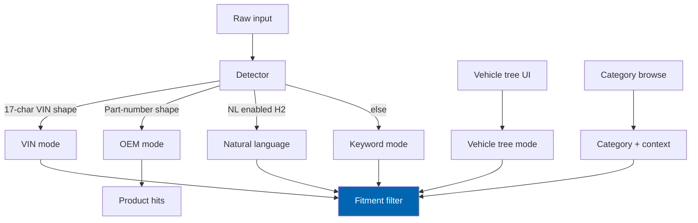
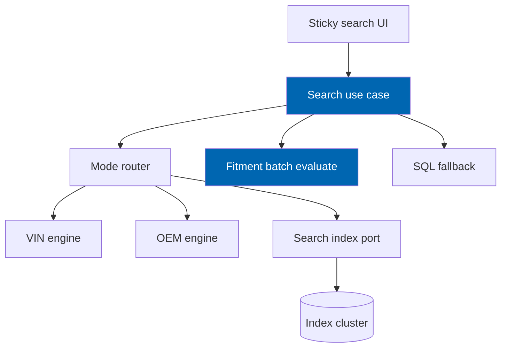

# 16 Search Engine

> Six search modes over one query contract: VIN, OEM, vehicle tree, category, keyword, and natural
> language — with fitment filtering, bilingual indexing, faceting, fallback, and analytics.

**Status:** Review · **Owner:** Search Architect · **Last revised:** 2026-07-28

---

## Contents

- [Executive Summary](#executive-summary)
- [Objectives](#objectives)
- [Scope](#scope)
- [Detailed Specifications](#detailed-specifications)
  - [Unified query contract](#unified-query-contract)
  - [Mode routing](#mode-routing)
  - [Mode behaviours](#mode-behaviours)
  - [Fitment filtering](#fitment-filtering)
  - [Indexing](#indexing)
  - [Ranking and facets](#ranking-and-facets)
  - [Bilingual and synonyms](#bilingual-and-synonyms)
  - [Zero-result recovery](#zero-result-recovery)
  - [Autocomplete](#autocomplete)
  - [Degradation and rebuild](#degradation-and-rebuild)
  - [Analytics and abuse](#analytics-and-abuse)
  - [Landing pages note](#landing-pages-note)
  - [API contracts](#api-contracts)
- [Architecture](#architecture)
- [User Stories](#user-stories)
- [Acceptance Criteria](#acceptance-criteria)
- [Future Enhancements](#future-enhancements)
- [References](#references)

---

## Executive Summary

Search is how customers **enter** the catalog; fitment is how results **stay honest**. Check Engine
exposes one sticky entry point that routes VIN, OEM, tree, keyword, and (later) natural language into
the same internal contract, then applies fitment when a vehicle context exists.

Takeaways:

1. **One contract, six modes** (`FR-401`) — modes compose (decode VIN, then keyword refine).
2. **Active vehicle context filters by default**; widen is explicit (`FR-407`).
3. **Arabic and English are first-class**; mixed script supported (`FR-420`).
4. **Index is a projection**; fitment claims remain authoritative (`ADR-014`).
5. **Fallback to SQL/full-text if the external index is down** (`FR-446`).

Budget: first page ≤ 300 ms server-side p95 at reference catalog ([03](03-non-functional-requirements.md),
`FR-409`).

---

## Objectives

| # | Objective | Traces to | Measure |
|---|---|---|---|
| 1 | Specify mode routing and contracts | `FR-401`–`FR-407` | Contract tests |
| 2 | Bind search to fitment evaluation rules | `FR-303`, `FR-407` | Integration tests |
| 3 | Define index fields, rebuild, incremental update | `FR-417`, `FR-418` | Ops runbook + tests |
| 4 | Meet bilingual and synonym requirements | `FR-420`, `FR-443` | Benchmark set `FR-419` |
| 5 | Specify degradation and rate limits | `FR-446`, `FR-450` | Chaos + limit tests |

---

## Scope

### In scope

- Search modes, routing, filtering, index projection, ranking signals, facets, autocomplete
- Analytics (no raw VIN by default), rate limiting, admin preview
- Relationship to sticky search UI (behavioural; visual design in theme docs)

### Out of scope

| Not covered | Where |
|---|---|
| Full SEO landing page system | [27](27-seo-strategy.md); requirements `FR-430`–`FR-441` summarised only |
| Natural-language parsing internals | [17](17-ai-architecture.md) Horizon 2 (`FR-408`) |
| Theme layout / sticky CSS | [21](21-theme-design.md) |
| Vector index provider choice detail | Horizon 2 `FR-416` |

### Assumptions

- Search index adapter is a port ([08](08-system-architecture.md)); Lucene/Elastic/OpenSearch-class or
  host-capable engine — operator configurable.
- Garage active vehicle supplies context ([20](20-customer-garage.md)).

### Dependencies

[13](13-vin-engine.md), [14](14-oem-engine.md), [15](15-fitment-engine.md), [12](12-vehicle-database.md),
[02](02-functional-requirements.md) Block 400, [03](03-non-functional-requirements.md).

---

## Detailed Specifications

### Unified query contract

```json
{
  "rawText": "2016 320i radiator",
  "mode": "Auto",
  "vehicleConfigurationId": 10041,
  "widenFitment": false,
  "filters": { "categoryId": null, "brand": null, "priceMin": null, "priceMax": null },
  "page": 1,
  "pageSize": 24,
  "locale": "ar"
}
```

| Field | Rule |
|---|---|
| `mode` | `Auto`, `Vin`, `Oem`, `VehicleTree`, `Keyword`, `NaturalLanguage` (H2) |
| `vehicleConfigurationId` | From garage or explicit tree selection |
| `widenFitment` | When true, include Unknown per operator policy (`FR-407`) |

### Mode routing



**Auto detection heuristics (Horizon 1):**

| Signal | Route |
|---|---|
| Normalisable to 17-char VIN charset | VIN (then confirm check digit) |
| Matches OEM pattern (length/charset) and resolves | OEM |
| Else | Keyword |

Ambiguous → Keyword with OEM/VIN suggestions in autocomplete, not wrong hard route.

### Mode behaviours

| Mode | Behaviour | FR |
|---|---|---|
| **VIN** | Decode → set/suggest context → keyword optional refine → fitment-filtered products | `FR-402` |
| **OEM** | Resolve number → products; supersession banner; fitment filter if context active | `FR-403` |
| **Vehicle tree** | Configuration selected → verified-fit catalog slice | `FR-404` |
| **Category + context** | Category browse only verified fit | `FR-405` |
| **Keyword** | Bilingual relevance; fitment filter default when context active | `FR-406`, `FR-407` |
| **Natural language** | Parse to structured intent then search | `FR-408` H2 |

### Fitment filtering

| Setting | Behaviour |
|---|---|
| Default + context | Exclude DoesNotFit; verified mode excludes Unknown (`FR-303`, `FR-304`) |
| Widen control | Customer-visible toggle; analytics event |
| No context | Rank without fitment filter; badge shows Select vehicle / Unknown |

Batch evaluate product ids via [15](15-fitment-engine.md); prefer precomputed published claim masks in
index for speed, **re-validate** authoritative path on product page (`ADR-014`).

### Indexing

| Document field (logical) | Source |
|---|---|
| Product id, sku, name en/ar, description en/ar | Host product + locale |
| Category ids | Host |
| Brand / manufacturer | Host + OEM manufacturers |
| OEM normalised + display | `CeProductOemMap` |
| Published fit configuration ids | `CeFitmentClaim` where Fits + published |
| Stock / price signals | Host |
| Boost fields | Operator settings |

| Operation | FR |
|---|---|
| Full rebuild task + admin | `FR-417` |
| Incremental on product/fitment mutation | `FR-418` Should |
| Fallback | SQL/full-text (`FR-446`) |

### Ranking and facets

| Signal (`FR-447`) | Role |
|---|---|
| Textual relevance | Primary for keyword |
| Fitment confidence | Boost Fits |
| Stock availability | Boost in-stock |
| Commercial boosts | Operator configurable |

**Facets (`FR-410`):** category, brand, price, fitment status (when widened or no context).

**Pagination (`FR-411`):** page size configurable; hard max enforced.

### Bilingual and synonyms

| Rule | FR |
|---|---|
| AR + EN indexes / analyzers | `FR-406`, `FR-420` |
| Mixed-script queries | `FR-420` |
| Synonym lists both languages | `FR-443` |
| Typo tolerance configurable | `FR-444` Should |
| Benchmark query set + precision report | `FR-419` |

### Zero-result recovery

When count = 0 (`FR-412`):

1. Offer widen fitment (if context tight).
2. Suggest alternate spellings / synonyms.
3. Link to vehicle selector / clear context.
4. Show popular categories — without implying fit.

### Autocomplete

Should (`FR-415`): vehicles, OEM numbers, products as user types; RTL-safe; rate-limited.

### Degradation and rebuild

| Failure | Behaviour |
|---|---|
| Index unavailable | Degrade to SQL/full-text (`FR-446`); banner optional for admin |
| Partial rebuild | Search remains available on last good index |
| Sticky search | Remains accessible while scrolling (`FR-414`) — theme implements |

Admin search preview (`FR-445` Should) hits live index.

### Analytics and abuse

| Rule | FR |
|---|---|
| Record query, mode, result count, CTR | `FR-413` |
| No raw VIN by default | `FR-413` |
| Rate limit scraping / abuse | `FR-450` |
| Shareable result URLs restore context | `FR-442` Should |

### Landing pages note

Vehicle and intersection landing pages (`FR-430`+) are specified in depth in [27](27-seo-strategy.md).
Search owns: ability to query the same fitment-constrained product sets those pages display; sitemap and
hreflang are SEO track.

Category pages with active context update title/heading (`FR-441`).

### API contracts

**`Search`** — accepts unified contract; returns:

```json
{
  "modeUsed": "Keyword",
  "total": 128,
  "page": 1,
  "items": [
    {
      "productId": 501,
      "fitmentOutcome": "Fits",
      "score": 12.4
    }
  ],
  "facets": [],
  "recovery": null,
  "degraded": false
}
```

Horizon 5 public search API (`FR-449`) follows [08](08-system-architecture.md) versioning — not in v1.0.

---

## Architecture



### Rejected alternatives

| Alternative | Rejected because |
|---|---|
| Separate search boxes per mode | Hurts mobile UX; violates unified entry |
| Trust index alone for fitment | `ADR-014` |
| English-only analyzer | Breaks `FR-420` |
| No fallback | Breaches availability expectations `FR-446` |

---

## User Stories

| ID | Persona | Story | FR | Points | Priority |
|---|---|---|---|---|---|
| `US-341` | Customer | Paste VIN in sticky search and see fitting parts | `FR-402` | 13 | Must |
| `US-342` | Customer | Search OEM and see supersession + products | `FR-403` | 8 | Must |
| `US-343` | Customer | Keyword search in Arabic with garage car active | `FR-406`, `FR-407` | 8 | Must |
| `US-344` | Customer | Recover from zero results without dead end | `FR-412` | 5 | Must |
| `US-345` | Ops | Rebuild index from admin and scheduled task | `FR-417` | 5 | Must |
| `US-346` | Ops | Store still searches when index is down | `FR-446` | 8 | Must |

---

## Acceptance Criteria

**`AC-16.1`** — Mode compose
Given a decoded VIN context, when customer enters keyword “water pump”, then results are fitment-filtered (`FR-401`, `FR-407`).

**`AC-16.2`** — Latency
Given reference catalog, when first page keyword+context search runs, then server p95 ≤ 300 ms (`FR-409`).

**`AC-16.3`** — Bilingual
Given Arabic synonym for a part type, when queried in Arabic, then relevant products return (`FR-420`, `FR-443`).

**`AC-16.4`** — Fallback
Given index stopped, when searching, then fallback path returns results or controlled empty with degradation flag (`FR-446`).

**`AC-16.5`** — No raw VIN analytics
Given default config, when VIN search recorded, then analytics store omits full VIN (`FR-413`).

**`AC-16.6`** — DoesNotFit excluded
Given published DoesNotFit, when verified search with context, then product absent (`FR-405`, `FR-303`).

---

## Future Enhancements

| Enhancement | Horizon | Notes |
|---|---|---|
| Natural language (`FR-408`) | 2 | [17](17-ai-architecture.md) |
| Semantic / vector (`FR-416`) | 2 | |
| Personalised garage ranking (`FR-448`) | 2 | Could |
| Public search API (`FR-449`) | 5 | |

---

## References

- [13 VIN Engine](13-vin-engine.md)
- [14 OEM Engine](14-oem-engine.md)
- [15 Fitment Engine](15-fitment-engine.md)
- [12 Vehicle Database](12-vehicle-database.md)
- [27 SEO Strategy](27-seo-strategy.md)
- [20 Customer Garage](20-customer-garage.md)
- [03 Non-Functional Requirements](03-non-functional-requirements.md)
- [08 System Architecture](08-system-architecture.md) — `ADR-014`
