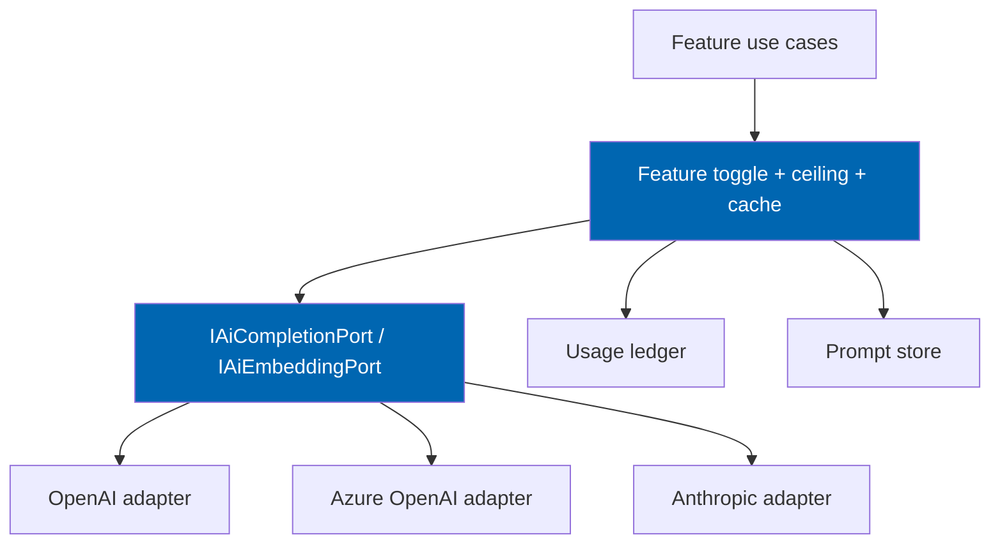
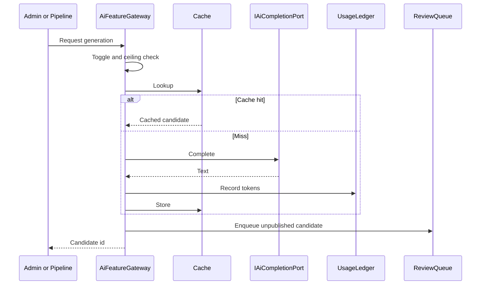

# 17 AI Architecture

> Provider abstraction, prompt versioning, cost controls, caching, disclosure, degradation, and the
> rule that AI augments never authorises — for every Check Engine AI feature.

**Status:** Review · **Owner:** AI Architect · **Last revised:** 2026-07-28

**Engineering status (2026-08-25):** Plugin `0.104.0` is in tree. Progress, evidence gates (G1–G6 done; G11 packing partial), and remaining blockers (H1.35/G8, G7, G11 vendor signing, G12) are recorded in [EXECUTION-PLAN.md](../EXECUTION-PLAN.md). This document remains the specification baseline.

---

## Contents

- [Executive Summary](#executive-summary)
- [Objectives](#objectives)
- [Scope](#scope)
- [Detailed Specifications](#detailed-specifications)
  - [Governing principles](#governing-principles)
  - [Feature inventory and horizons](#feature-inventory-and-horizons)
  - [Provider abstraction](#provider-abstraction)
  - [Data disclosure inventory](#data-disclosure-inventory)
  - [Prompt management](#prompt-management)
  - [Cost accounting and ceilings](#cost-accounting-and-ceilings)
  - [Response caching](#response-caching)
  - [Degradation and outages](#degradation-and-outages)
  - [Natural-language and semantic search](#natural-language-and-semantic-search)
  - [Compatibility inference](#compatibility-inference)
  - [Assistant and recommendations](#assistant-and-recommendations)
  - [Observability dashboard](#observability-dashboard)
  - [Security and privacy](#security-and-privacy)
- [Architecture](#architecture)
- [User Stories](#user-stories)
- [Acceptance Criteria](#acceptance-criteria)
- [Future Enhancements](#future-enhancements)
- [References](#references)

---

## Executive Summary

Check Engine uses AI for **enrichment and assistance**, never for **authority** (`ADR-008`). Every AI
feature is **off by default**, individually toggleable, review-gated for customer-visible output, and
bounded by **spend ceilings**. The product must operate fully with all AI features disabled (`FR-505`).

Takeaways:

1. **One port, three providers:** OpenAI, Azure OpenAI, Anthropic (`FR-503`).
2. **No publish without review** for content or fitment (`FR-531`).
3. **Prompts are versioned configuration**, not scattered string literals (`FR-563`).
4. **Hard daily/feature spend caps** stop calls when reached (`FR-561`).
5. **Content pipelines** are detailed in [25](25-ai-content-pipeline.md); this document owns the platform.

Most AI FRs are **Horizon 2**. Horizon 1 ships the disabled-safe architecture so import and fitment do
not assume AI.

---

## Objectives

| # | Objective | Traces to | Measure |
|---|---|---|---|
| 1 | Define a provider-agnostic AI port and options | `FR-503`, `FR-504` | Two providers pass contract tests |
| 2 | Encode disable-default, disclosure, and review gates | `FR-501`, `FR-502`, `FR-531` | Admin UX + policy tests |
| 3 | Specify cost, cache, and degradation behaviour | `FR-560`–`FR-570` | Ceiling enforcement tests |
| 4 | Bound NL search, assistant, and recommendations | `FR-510`–`FR-551` | Fail-closed invent rules |
| 5 | Keep Domain free of provider SDKs | `ADR-007` | Architecture tests |

---

## Scope

### In scope

- Cross-cutting AI platform: providers, prompts, cost, cache, disclosure, degradation
- Feature catalogue and which document owns deep behaviour
- Compatibility inference hand-off to fitment
- Assistant and recommendation safety rules
- Admin cost/queue dashboard requirements

### Out of scope

| Not covered | Where |
|---|---|
| Description/translation/SEO generation stages | [25](25-ai-content-pipeline.md) |
| Import stage orchestration | [24](24-product-import-pipeline.md) |
| Search mode UX for NL | [16](16-search-engine.md) |
| Licence legal terms for AI | [LICENSE.md](../LICENSE.md), [43](43-licensing.md) |
| Full security control catalogue | [28](28-security.md) |

### Assumptions

- Operators may use one primary provider; failover to a second is optional Horizon 2+.
- Token prices are configured as rates for accounting, not scraped live.
- Embedding models are a separate optional capability from chat completion.

### Dependencies

[08](08-system-architecture.md), [15](15-fitment-engine.md), [11](11-domain-model.md),
[02](02-functional-requirements.md) Block 500, `ADR-008`.

---

## Detailed Specifications

### Governing principles

| Principle | Consequence |
|---|---|
| AI augments, never authorises | Fitment and storefront content require human review paths |
| Disabled by default | Fresh install: all AI toggles off (`FR-501`) |
| Full product without AI | Import (deterministic stages), VIN, OEM, fitment, keyword search work (`FR-505`) |
| Disclose before enable | Admin must see data categories sent to provider (`FR-502`) |
| Fail closed on invention | No invented OEM numbers, prices, or Fits (`FR-541`) |
| Cost is a product feature | Ceilings and dashboards are Must (`FR-560`, `FR-561`, `FR-590`) |

### Feature inventory and horizons

| Feature | FR | Horizon | Deep doc |
|---|---|---|---|
| Provider platform + toggles | `FR-501`–`FR-505` | 2 (hooks in H1) | This doc |
| NL query parse | `FR-510` | 2 | This + [16](16-search-engine.md) |
| Semantic / vector search | `FR-511` | 2 Should | This + [16](16-search-engine.md) |
| Description / specs / translation / SEO | `FR-520`–`FR-523` | 2 | [25](25-ai-content-pipeline.md) |
| Compatibility inference | `FR-530`–`FR-531` | 2 | This + [15](15-fitment-engine.md) |
| Customer assistant | `FR-540`–`FR-541` | 2 Should/Must | This doc |
| Recommendations / cross-sell / upsell | `FR-550`–`FR-551` | 2 | This doc |
| Cost / cache / prompts / degrade | `FR-560`–`FR-570` | 2 | This doc |
| Privacy of rec inputs | `FR-580` | 2 | This + [28](28-security.md) |
| Admin AI dashboard | `FR-590` | 2 | This doc |
| Import enrichment stages | `FR-620`–`FR-622` | 2 | [24](24-product-import-pipeline.md), [25](25-ai-content-pipeline.md) |
| Alt text candidates | `FR-662` | 2 Should | [26](26-image-management.md) |

### Provider abstraction

| Topic | Specification |
|---|---|
| Interfaces | `IAiCompletionPort.CompleteAsync(AiRequest, ct)`, `IAiEmbeddingPort.EmbedAsync(...)` |
| Adapters | One Infrastructure class per provider; no provider types in Domain |
| Credentials | Secret storage only (`FR-504`); never in `plugin.json` or source |
| Options | `AiOptions` with provider enum, endpoint, deployment/model names, timeouts |
| Validation | `IValidateOptions` — invalid config keeps features disabled rather than crashing storefront |

### Data disclosure inventory

Before a feature toggle can turn on, the admin UI shows the categories transmitted (`FR-502`):

| Feature | May send to provider |
|---|---|
| Description generation | Product title, OEM numbers, category, supplier attributes (no customer PII) |
| Spec extraction | Same + raw row text snippets |
| Translation | Candidate text + glossary terms |
| SEO metadata | Title, category, vehicle names as catalog data |
| Compatibility inference | Product attributes, vehicle configuration descriptors — **not** full customer VIN by default |
| NL parse | Customer query text (may contain VIN — redaction policy applies) |
| Assistant | Retrieved catalog snippets + user question; system prompt forbids invention |
| Embeddings | Product text fields configured for indexing |

VIN policy: strip or hash full VIN in outbound prompts unless an explicit elevated setting allows it
(default off). Logged in [28](28-security.md).

### Prompt management

| Rule (`FR-563`) | Detail |
|---|---|
| Storage | Versioned records (DB or config files shipped with plugin) with `PromptKey`, `Version`, `Body`, `ModelHint` |
| Resolution | Features request `PromptKey` + optional locale; never inline multi-paragraph prompts in C# |
| Change control | New version does not mutate old; A/B via feature flag optional |
| Automotive glossary | Injected as structured context for translation ([25](25-ai-content-pipeline.md)) |

### Cost accounting and ceilings

| Rule | FR | Behaviour |
|---|---|---|
| Record usage | `FR-560` | Per feature per day: tokens in/out, estimated cost, call count |
| Hard ceiling | `FR-561` | When reached, further calls for that feature return `AiBudgetExceeded`; no silent overage |
| Scope | Per feature and optional global daily cap | |
| Reset | Calendar day in store time zone | |
| Ledger table | `CeAiUsageDaily` (normative; add in AI migrations) | |

### Response caching

| Rule (`FR-562`) | Detail |
|---|---|
| Key | Hash of prompt version + model + normalised inputs |
| Store | Distributed cache when farm; TTL configurable |
| Bypass | Admin “regenerate” forces miss |
| Fitment inference | Cache proposals only; never skip review because of cache hit |

Persisted generations also live in `CeAiGeneration` ([10](10-database-design.md)).

### Degradation and outages

| Failure (`FR-570`) | Behaviour |
|---|---|
| Provider timeout / 5xx | Feature returns degraded result; host request continues |
| Import enrichment | Skip AI stage; leave candidates empty; deterministic stages proceed |
| Search NL | Fall back to keyword (`FR-446` family) |
| Assistant | Refuse with “temporarily unavailable” — no hallucinated catalog |

### Natural-language and semantic search

| Capability | Specification |
|---|---|
| NL parse (`FR-510`) | Output structured intent: make/model/year hints, part type, OEM candidates; Search applies deterministic engines |
| Semantic (`FR-511`) | Optional embeddings into vector index; still fitment-filtered when context active |
| Authority | Parsed intent never creates published fitment |

### Compatibility inference

| Rule | FR | Behaviour |
|---|---|---|
| Create claims | `FR-530` | Source `AiInference`; confidence **capped below** publish threshold |
| Review | `FR-531` | Must enter review; safety-critical hard stop still applies ([15](15-fitment-engine.md)) |
| Never | — | Auto-set `IsPublished = true` |

### Assistant and recommendations

| Rule | Detail |
|---|---|
| RAG only (`FR-540`) | Ground answers in retrieved catalog, published fitment, and store policy snippets |
| Refuse when unsure | Explicit refusal copy; no guessing Fits |
| No invention (`FR-541`) | Forbid fabricating OEM, price, stock, or fitment in system prompt + output validation hooks |
| Recommendations (`FR-550`) | Only products that evaluate Fits (or no context → unscoped but labelled) |
| Suppress fails (`FR-551`) | Cross-sell/upsell that DoesNotFit/Unknown-in-verified-mode are dropped |
| Privacy (`FR-580`) | No other customer's garage/orders/PII in model inputs |

### Observability dashboard

Admin (`FR-590`) shows:

- Cost and volume by feature (today / 7 / 30 days)
- Ceiling utilisation
- Review queue depth (content + fitment AI proposals)
- Error/degraded rates

Permission: `ManageCheckEngineAi`.

### Security and privacy

| Topic | Rule |
|---|---|
| Secrets | Host secret store (`FR-504`) |
| PII | Minimise; redaction defaults |
| Multi-tenant later | Per-tenant credentials and ceilings (Horizon 5) |
| Prompt injection | Treat retrieved docs as data; assistant instructions separate |

---

## Architecture

### Rejected alternatives

| Alternative | Rejected because |
|---|---|
| Single hard-coded OpenAI client in use cases | Breaks `FR-503` and testability |
| Auto-publish high-confidence AI fitment | `ADR-008`, `RISK-10` |
| Soft budget warnings only | Operators overspend (`FR-561`) |
| Embedding AI in Domain | Violates `ADR-007` |

---

## User Stories

| ID | Persona | Story | FR | Points | Priority |
|---|---|---|---|---|---|
| `US-401` | Admin | See data disclosure before enabling AI descriptions | `FR-502` | 5 | Must |
| `US-402` | Admin | Cap daily spend so a runaway job cannot burn the budget | `FR-561` | 8 | Must |
| `US-403` | Operator | Run the store with all AI off | `FR-505` | 3 | Must |
| `US-404` | Customer | Get assistant answers that never invent a part number | `FR-541` | 8 | Must |
| `US-405` | Admin | Switch provider without rewriting features | `FR-503` | 8 | Must |

---

## Acceptance Criteria

**`AC-17.1`** — Default off
Given a fresh install, when AI settings are read, then every feature toggle is false (`FR-501`).

**`AC-17.2`** — Ceiling stop
Given a feature at its daily ceiling, when another completion is requested, then no provider call is made and `AiBudgetExceeded` is returned (`FR-561`).

**`AC-17.3`** — No AI publish
Given an AI-generated description, when created, then `IsPublished` is false until review (`FR-531`).

**`AC-17.4`** — Provider port
Given contract tests, when run against two configured adapters, then both satisfy `IAiCompletionPort` (`FR-503`).

**`AC-17.5`** — Outage degrade
Given provider forced timeout, when import enrichment runs, then the batch continues without AI candidates (`FR-570`).

**`AC-17.6`** — Fitment inference cap
Given AI compatibility proposal, when saved, then confidence is below publish threshold and source is `AiInference` (`FR-530`).

---

## Future Enhancements

| Enhancement | Horizon | Notes |
|---|---|---|
| Automatic secondary provider failover | 2+ | Optional |
| On-prem / local model adapter | 5 | Same ports |
| Prompt A/B analytics | 2 | |

---

## References

- [25 AI Content Pipeline](25-ai-content-pipeline.md)
- [24 Product Import Pipeline](24-product-import-pipeline.md)
- [15 Fitment Engine](15-fitment-engine.md)
- [16 Search Engine](16-search-engine.md)
- [08 System Architecture](08-system-architecture.md)
- [LICENSE.md](../LICENSE.md) — AI feature terms
- [28 Security](28-security.md)
