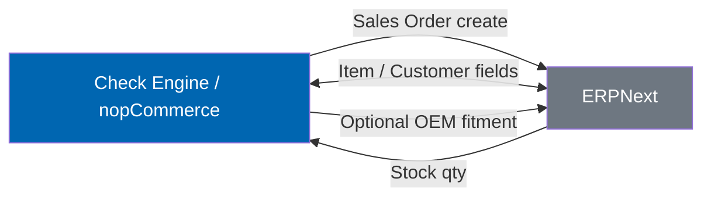
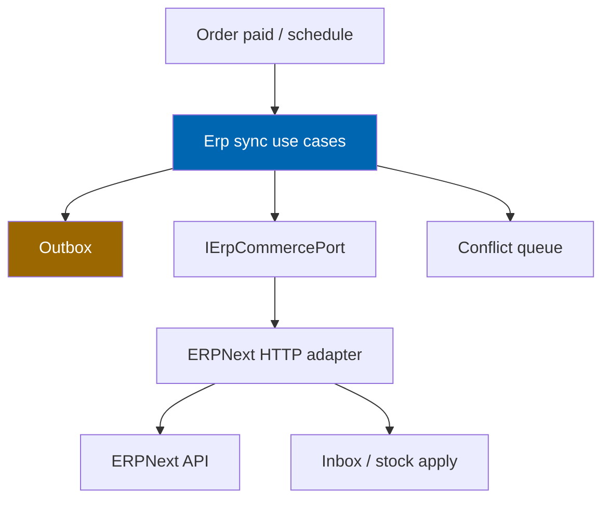

# 18 ERPNext Integration

> Bi-directional synchronisation of products, inventory, customers, orders, invoices, returns,
> shipments, and optional CRM with ERPNext — including idempotency, conflict rules, reconciliation,
> and catch-up after downtime.

**Status:** Review · **Owner:** Integration Architect · **Last revised:** 2026-07-28

---

## Contents

- [Executive Summary](#executive-summary)
- [Objectives](#objectives)
- [Scope](#scope)
- [Detailed Specifications](#detailed-specifications)
  - [Integration principles](#integration-principles)
  - [Entity sync matrix](#entity-sync-matrix)
  - [Direction and system of record](#direction-and-system-of-record)
  - [Mapping configuration](#mapping-configuration)
  - [Idempotency and retries](#idempotency-and-retries)
  - [Conflict resolution](#conflict-resolution)
  - [Scheduling and triggers](#scheduling-and-triggers)
  - [Downtime and order placement](#downtime-and-order-placement)
  - [Optional fitment and OEM push](#optional-fitment-and-oem-push)
  - [Reconciliation](#reconciliation)
  - [Security and versioning](#security-and-versioning)
  - [Admin surfaces](#admin-surfaces)
  - [API and client contracts](#api-and-client-contracts)
- [Architecture](#architecture)
- [User Stories](#user-stories)
- [Acceptance Criteria](#acceptance-criteria)
- [Future Enhancements](#future-enhancements)
- [References](#references)

---

## Executive Summary

ERPNext is the **operational back office** for operators who already run inventory, invoicing, and CRM
there. Check Engine keeps the **automotive commerce truth** (fitment, OEM, garage) while ERPNext owns
**stock quantity** and financial documents. Sync is **idempotent**, **retryable**, and must **never
block checkout** when ERP is down (`FR-830`).

Takeaways:

1. **Stock SoR = ERPNext**; product commerce fields may be bi-directional with clear conflict rules (`FR-802`).
2. **Orders push on placement**; invoices/returns/shipments sync as configured (`FR-804`, `FR-805`).
3. **Version-pinned client + contract tests** (`FR-813`).
4. **Secrets in secret storage** (`FR-815`).
5. **Fitment/OEM → ERP is optional one-way** (`FR-821`).

Horizon 1 Must for core commerce entities. Marketplace payouts reconcile in Horizon 3 ([19](19-marketplace-module.md)).

---

## Objectives

| # | Objective | Traces to | Measure |
|---|---|---|---|
| 1 | Specify SoR and sync direction per entity | `FR-801`–`FR-806` | Matrix complete and testable |
| 2 | Guarantee idempotent, retry-safe operations | `FR-810` | Duplicate delivery tests |
| 3 | Keep storefront selling during ERP outage | `FR-830` | Chaos test: place order offline |
| 4 | Expose conflicts and daily reconciliation | `FR-811`, `FR-812`, `FR-825` | Admin queue + report |
| 5 | Keep Domain free of ERPNext SDK types | `ADR-007` | Architecture tests |

---

## Scope

### In scope

- Sync behaviours, mapping, queues, conflict policy, reconciliation, admin ops
- Host-internal Application ports and Infrastructure ERPNext adapter

### Out of scope

| Not covered | Where |
|---|---|
| ERPNext DocType customisation inside Frappe | Operator runbook / partner services |
| Payment capture (Paymob) | Sibling plugin |
| Marketplace commission payout detail | [19](19-marketplace-module.md) |
| Full security control catalogue | [28](28-security.md) |

### Assumptions

- ERPNext REST API (version-pinned) is reachable from the web/job node.
- Multi-company ERP setups map via configurable company/warehouse codes.
- Disabled ERP settings → all sync tasks no-op; store runs normally.

### Dependencies

[08](08-system-architecture.md), [09](09-plugin-architecture.md), [02](02-functional-requirements.md)
`FR-801`–`FR-830`, [10](10-database-design.md).

---

## Detailed Specifications

### Integration principles

| Principle | Consequence |
|---|---|
| Ports and adapters | `IErpCommercePort` in Application/Domain edge; Frappe HTTP client in Infrastructure only |
| Idempotency keys | Every outbound write carries a stable key derived from nopCommerce entity id + operation |
| At-least-once delivery | Handlers must be safe under duplicate posts (`FR-810`) |
| Fail soft on storefront | Queue outbound work; never throw away a paid order because ERP is down (`FR-830`) |
| Automotive data optional | Fitment/OEM push is opt-in (`FR-821`) |

### Entity sync matrix

| nopCommerce / Check Engine | ERPNext DocType (typical) | Direction | SoR for critical fields | FR |
|---|---|---|---|---|
| Product | Item | Bi-directional | Configurable; SKU identity shared | `FR-801` |
| Inventory (stock qty) | Bin / Stock Ledger | **ERP → CE** | **ERPNext** | `FR-802` |
| Customer | Customer / Lead | Bi-directional | Configurable per field group | `FR-803` |
| Order | Sales Order | **CE → ERP** (create); status may pull back | Order placement in CE | `FR-804` |
| Invoice / payment refs | Sales Invoice | Sync as configured | ERP for invoice numbers | `FR-805` |
| Return / RMA | Return / Credit Note | Sync as configured | Per mapping | `FR-805` |
| Shipment | Delivery Note / Shipment | Sync as configured | Carrier may be CE sibling | `FR-805` |
| CRM notes / issues | ToDo / Issue / Comment | Optional | — | `FR-806` Should |
| OEM / Fitment summary | Custom fields / Child table | **CE → ERP** optional | CE | `FR-821` Should |

### Direction and system of record



**Inventory rule (`FR-802`):** Check Engine must not invent stock quantities from import alone when ERP
sync is enabled; ERP qty overwrites local stock on successful pull. When ERP disabled, host stock rules
apply.

### Mapping configuration

| Topic (`FR-820`) | Specification |
|---|---|
| Storage | `CeErpMapping` / settings JSON — field map, warehouse, price list, company |
| Identity | External id columns or `CeErpEntityMap` (LocalType, LocalId, RemoteDoctype, RemoteName) |
| Transforms | Units, tax codes, customer groups — declarative where possible |
| Admin UI | Edit maps without code deploy; validate on save |

### Idempotency and retries

| Rule (`FR-810`) | Detail |
|---|---|
| Outbound | `Idempotency-Key` or ERPNext unique naming (`SO-NOP-{orderId}`) |
| Inbound | Upsert by remote id; ignore duplicate events |
| Retry | Exponential backoff; max attempts then **exception queue** (`FR-812`) |
| Poison messages | Visible with payload (redacted secrets) and replay action |

Persistence: `CeErpSyncOutbox`, `CeErpSyncInbox`, `CeErpConflict` (normative tables added in ERP
migrations — see schema note below).

### Conflict resolution

| Rule (`FR-811`) | Detail |
|---|---|
| Per entity type | Policies: PreferErp, PreferCommerce, NewestWins, ManualOnly |
| Unresolved | Enter conflict queue; do not silently clobber SoR fields |
| Stock | PreferErp always when ERP sync enabled |
| Manual | Admin chooses winner; audited |

### Scheduling and triggers

| Mechanism (`FR-814`) | Use |
|---|---|
| `CheckEngine.Erp.Sync` schedule task | Default every 5 minutes ([09](09-plugin-architecture.md)) |
| On-demand admin | “Sync now” per entity type |
| Event-driven | Order paid → enqueue Sales Order push immediately |

### Downtime and order placement

| Scenario (`FR-830`) | Behaviour |
|---|---|
| ERP unreachable at checkout | Order completes in nopCommerce; outbox row pending |
| Catch-up | Task drains outbox when healthy |
| Stale stock | Show last known qty with optional “stock may be outdated” admin flag; never cancel paid orders automatically |

### Optional fitment and OEM push

When enabled (`FR-821`): push read-only summary (OEM numbers, published Fits count, or custom child
table) **CE → ERP only**. ERP must not become fitment authority.

### Reconciliation

Daily job (`FR-825`):

| Compare | Action on mismatch |
|---|---|
| Order counts / totals | Exception report |
| Payment vs invoice | Exception report |
| Inventory sample / full | Exception report |

Reports retained per audit policy; admin downloadable.

### Security and versioning

| Topic | Rule |
|---|---|
| Credentials (`FR-815`) | API key / token in secret storage |
| Client (`FR-813`) | NuGet/project version pinned; contract tests against pinned ERPNext fixture |
| TLS | Required for non-lab environments |
| Logging | No secrets; redact tokens |

### Admin surfaces

| Surface | Content |
|---|---|
| Connection settings | URL, company, secrets ref, enable flag |
| Mapping editor | Field maps |
| Sync dashboard | Last success, lag, queue depths |
| Conflict / exception queue | Payload, error, retry (`FR-812`) |
| Reconciliation | Daily results (`FR-825`) |
| Home widget | Sync exceptions (`FR-993`) |

Permission: `ManageCheckEngineErp`.

### API and client contracts

**Outbound Sales Order (illustrative)**

```json
{
  "idempotencyKey": "order:10045:create",
  "localOrderId": 10045,
  "customerRemoteId": "CUST-008",
  "items": [{ "sku": "WP-320", "qty": 1, "rate": 85.00 }],
  "currency": "EGP"
}
```

**Inbound stock pull:** upsert `Product` stock by SKU / Item Code map.

Contract tests cover create, duplicate create, conflict, and timeout.

---

## Architecture



### Schema additions (normative)

| Table | Purpose |
|---|---|
| `CeErpEntityMap` | Local ↔ remote identity |
| `CeErpSyncOutbox` | Pending outbound ops |
| `CeErpSyncInbox` | Processed inbound cursors / events |
| `CeErpConflict` | Unresolved field conflicts |
| `CeErpReconciliationRun` | Daily report header |

### Rejected alternatives

| Alternative | Rejected because |
|---|---|
| Synchronous ERP call inside checkout transaction | Violates `FR-830` |
| Dual-write without outbox | Lost updates on partial failure |
| Fitment SoR in ERP | Contradicts product thesis |

---

## User Stories

| ID | Persona | Story | FR | Points | Priority |
|---|---|---|---|---|---|
| `US-501` | Operator | Push today's orders to ERPNext without manual export | `FR-804` | 8 | Must |
| `US-502` | Operator | See ERP stock quantities on the storefront | `FR-802` | 8 | Must |
| `US-503` | Ops | Place a test order while ERP is down and see it sync later | `FR-830` | 8 | Must |
| `US-504` | Admin | Resolve a product field conflict from the queue | `FR-811` | 5 | Must |
| `US-505` | Admin | Download yesterday's reconciliation report | `FR-825` | 5 | Must |

---

## Acceptance Criteria

**`AC-18.1`** — Order push idempotent
Given an order already created remotely, when the outbox retries the same key, then no duplicate Sales Order is created (`FR-810`).

**`AC-18.2`** — Stock SoR
Given ERP qty 7 and local qty 2, when stock pull succeeds, then storefront shows 7 (`FR-802`).

**`AC-18.3`** — Downtime
Given ERP stopped, when customer completes checkout, then order is Paid/Placed in nopCommerce and an outbox row exists (`FR-830`).

**`AC-18.4`** — Secrets
Given configuration UI, when connection is saved, then the API key is not written to source or plain settings export (`FR-815`).

**`AC-18.5`** — Contract tests
Given pinned ERPNext fixture, when CI runs ERP contract tests, then they pass against the pinned version (`FR-813`).

**`AC-18.6`** — TDD
Given a new conflict policy, when implemented, then a failing test existed before the policy code (`ADR-015`).

---

## Future Enhancements

| Enhancement | Horizon | Notes |
|---|---|---|
| Webhook inbound from ERPNext | 2 | Reduce poll lag |
| Multi-company advanced routing | 2 | |
| Marketplace payout DocTypes | 3 | [19](19-marketplace-module.md) |

---

## References

- [08 System Architecture](08-system-architecture.md)
- [09 Plugin Architecture](09-plugin-architecture.md)
- [19 Marketplace Module](19-marketplace-module.md)
- [10 Database Design](10-database-design.md)
- [28 Security](28-security.md)
- [34 Coding Standards](34-coding-standards.md) — TDD
- ERPNext REST API documentation — version pinned in contract tests
