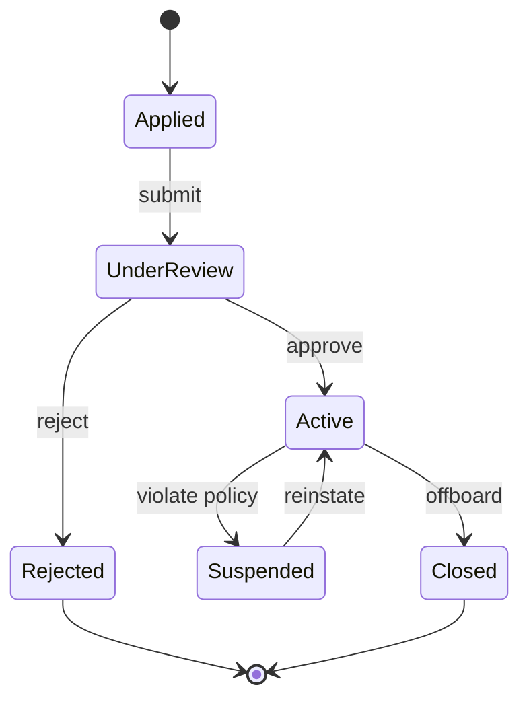
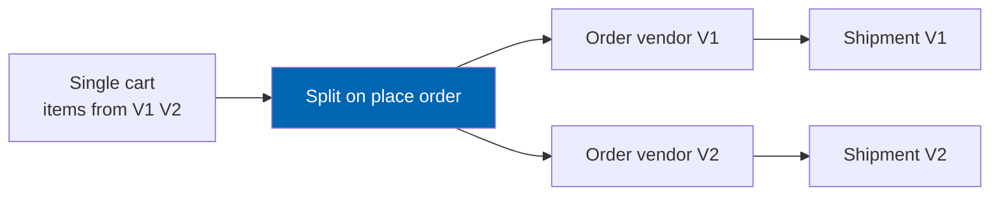
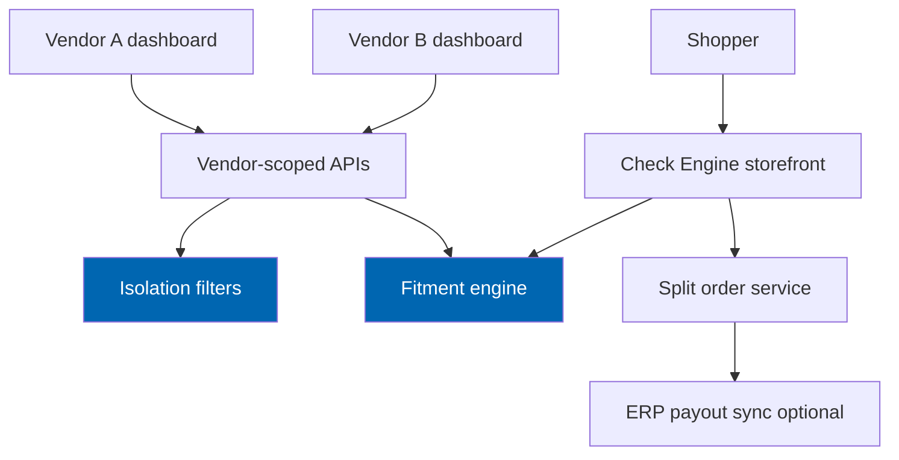

# 19 Marketplace Module

> Multi-supplier operation on Check Engine: vendor onboarding, catalog isolation, dashboards,
> commissions, payouts, split carts/orders, and vendor-contributed fitment under review.

**Status:** Review · **Owner:** Product Owner · **Last revised:** 2026-07-28

---

## Contents

- [Executive Summary](#executive-summary)
- [Objectives](#objectives)
- [Scope](#scope)
- [Detailed Specifications](#detailed-specifications)
  - [Operating modes](#operating-modes)
  - [Vendor lifecycle](#vendor-lifecycle)
  - [Catalog isolation](#catalog-isolation)
  - [Vendor dashboard](#vendor-dashboard)
  - [Commission models](#commission-models)
  - [Payouts and ERP reconciliation](#payouts-and-erp-reconciliation)
  - [Multi-vendor cart and split orders](#multi-vendor-cart-and-split-orders)
  - [Vendor-contributed fitment](#vendor-contributed-fitment)
  - [Analytics and scorecards](#analytics-and-scorecards)
  - [Licensing and upgrade path](#licensing-and-upgrade-path)
  - [Schema sketch](#schema-sketch)
- [Architecture](#architecture)
- [User Stories](#user-stories)
- [Acceptance Criteria](#acceptance-criteria)
- [Future Enhancements](#future-enhancements)
- [References](#references)

---

## Executive Summary

Horizon 1 ships **single-supplier**. Horizon 3 adds an optional **hybrid marketplace** where multiple
suppliers sell on one Check Engine storefront without reading each other's data (`FR-857`). Fitment
correctness does not relax: vendor claims are attributed, reviewable, and revocable (`FR-856`).

Takeaways:

1. **Licence-tier gated** (`FR-870`) — not available on every SKU.
2. **Hard isolation** of catalog, orders, customers (`FR-857`).
3. **Split cart → per-vendor orders/shipments** (`FR-855`).
4. **Commissions:** flat, percentage, tiered, category-specific (`FR-853`).
5. **Upgrade from single-supplier without catalog loss** (`FR-890`).

This document specifies Horizon 3 behaviour so Horizon 1 schema and APIs do not paint the product into
a corner (`BR-027`, `BR-042`).

---

## Objectives

| # | Objective | Traces to | Measure |
|---|---|---|---|
| 1 | Define vendor isolation invariants | `FR-857` | Security/integration tests |
| 2 | Specify onboarding, dashboard, commissions, split orders | `FR-850`–`FR-855` | Story coverage |
| 3 | Keep vendor fitment under the same review/safety rules | `FR-856`, `FR-316` | Policy tests |
| 4 | Gate features by licence tier | `FR-870` | Entitlement tests |
| 5 | Define single→multi upgrade | `FR-890` | Migration playbook |

---

## Scope

### In scope

- Marketplace mode semantics, vendor model, commissions, payouts, split fulfilment, vendor fitment
- Isolation and licence gating
- Relationship to ERP payouts ([18](18-erpnext-integration.md))

### Out of scope

| Not covered | Where |
|---|---|
| Dealer/workshop/fleet portals | [46](46-workshop-portal.md)–[48](48-dealer-portal.md) |
| Payment provider specifics | Sibling plugins |
| Full SaaS multi-tenant | [49](49-saas-roadmap.md) |
| Horizon 1 single-supplier commerce | Assumed baseline |

### Assumptions

- nopCommerce multi-vendor patterns may be leveraged where they do not weaken fitment or isolation.
- Operator remains marketplace administrator; Twin Particles does not operate the marketplace.
- TDD applies to isolation and commission calculation (`ADR-015`).

### Dependencies

[15](15-fitment-engine.md), [18](18-erpnext-integration.md), [43](43-licensing.md), Block 800 marketplace FRs.

---

## Detailed Specifications

### Operating modes

| Mode | Horizon | Behaviour |
|---|---|---|
| Single-supplier | 1 | One operator catalog; marketplace UI hidden |
| Marketplace | 3 | Multiple vendors; feature flag + licence (`FR-870`) |

Enabling marketplace does not delete existing products; they become the **operator vendor** or default
seller (`FR-890`).

### Vendor lifecycle

| Step (`FR-851`) | Detail |
|---|---|
| Apply | Business profile, tax ids, banking (secrets), categories |
| Verification | Manual/admin workflow |
| Agreement | Accept operator terms; versioned acceptance record |
| Activate | Can list products subject to review rules |

### Catalog isolation

| Rule (`FR-850`, `FR-857`) | Detail |
|---|---|
| Product ownership | Every product has `VendorId` (operator = well-known id) |
| Reads | Vendor APIs/queries scoped by vendor; cross-vendor denied |
| Customers | Vendors see buyers of **their** orders only — not full CRM |
| Fitment | Claims carry vendor attribution; evaluation still global for shoppers |

Admin/operator roles may see all vendors.

### Vendor dashboard

| Area (`FR-852`) | Capabilities |
|---|---|
| Catalog | Create/edit own products; cannot edit others |
| Inventory | Own stock (may still sync via ERP per vendor map later) |
| Orders | Own split orders only |
| Fitment proposals | Submit claims for review |
| Statements | Commission and payout views |
| Locale | Arabic and English |

### Commission models

| Model (`FR-853`) | Definition |
|---|---|
| Flat | Fixed amount per order or per item |
| Percentage | % of line or order subtotal |
| Tiered | Rate bands by volume period |
| Category-specific | Override by category |

Rules are data-driven; evaluation is a pure domain service under TDD. Effective rate at order time is
**snapshotted** on the order line (no retroactive silent change).

### Payouts and ERP reconciliation

| Topic (`FR-854`) | Detail |
|---|---|
| Calculation | Periodic statement: sales − commission − adjustments − refunds |
| ERP | Push payout / journal docs when ERP enabled; reconcile totals |
| Disputes | Manual adjustment with audit |

### Multi-vendor cart and split orders

| Rule (`FR-855`) | Detail |
|---|---|
| Cart | May mix vendors |
| Place order | Creates one parent/group id + per-vendor child orders (or equivalent host pattern) |
| Payment | Single customer payment; settlement allocates to vendors via statements |
| Shipping | Per-vendor shipment; rates may differ |
| Fitment filter | Still applies to each line against active vehicle |

### Vendor-contributed fitment

| Rule (`FR-856`) | Detail |
|---|---|
| Attribution | `Source` / vendor id on claim |
| Review | Same queues and safety hard stops as operator claims ([15](15-fitment-engine.md)) |
| Revoke | Operator or vendor (own claims) can deactivate; audit |
| AI | Still cannot auto-publish |

### Analytics and scorecards

Should (`FR-860`): fill rate, cancel rate, claim rejection rate, on-time shipment — vendor-visible and
operator-visible.

### Licensing and upgrade path

| Topic | Rule |
|---|---|
| Gate (`FR-870`) | Marketplace menus/APIs require licence entitlement |
| Upgrade (`FR-890`) | Migration assigns existing catalog to default vendor; zero product loss |
| Downgrade | Hide marketplace; existing multi-vendor data retained read-only per policy |

### Schema sketch

| Table | Purpose |
|---|---|
| `CeVendor` | Vendor profile, status, default commission plan |
| `CeVendorAgreementAcceptance` | Terms version + timestamp |
| `CeCommissionPlan` / `CeCommissionRule` | Rule definitions |
| `CeVendorProductMap` | If not using Product extension field alone |
| `CeOrderVendorSplit` | Parent/child order linkage |
| `CePayoutStatement` / lines | Periodic statements |
| Fitment claim | Add `VendorId` nullable (null = operator) |

---

## Architecture

### Rejected alternatives

| Alternative | Rejected because |
|---|---|
| Separate plugin per vendor feature | Violates `ADR-005` coherence |
| Vendors publish fitment without review | Safety / `ADR-008` |
| Shared open customer list across vendors | Violates `FR-857` |

---

## User Stories

| ID | Persona | Story | FR | Points | Priority |
|---|---|---|---|---|---|
| `US-511` | Operator | Enable marketplace and keep existing catalog | `FR-890` | 8 | Should |
| `US-512` | Vendor | Onboard and accept terms | `FR-851` | 5 | Should |
| `US-513` | Vendor | Manage only my products and orders | `FR-852`, `FR-857` | 13 | Must (H3) |
| `US-514` | Customer | Checkout a cart with parts from two vendors | `FR-855` | 13 | Should |
| `US-515` | Operator | Configure category-specific commission | `FR-853` | 8 | Should |
| `US-516` | Operator | Reject a vendor fitment claim | `FR-856` | 5 | Should |

---

## Acceptance Criteria

**`AC-19.1`** — Isolation
Given vendor A authenticated, when requesting vendor B's product edit API, then the call is denied (`FR-857`).

**`AC-19.2`** — Split order
Given a cart with lines from two vendors, when order is placed, then two vendor orders (or equivalent splits) exist linked to one checkout (`FR-855`).

**`AC-19.3`** — Fitment review
Given a vendor-submitted safety-critical claim below threshold, when auto-publish attempted, then it fails (`FR-856`, `FR-316`).

**`AC-19.4`** — Licence gate
Given licence without marketplace entitlement, when marketplace admin route is opened, then access is denied (`FR-870`).

**`AC-19.5`** — Upgrade
Given a single-supplier catalog, when marketplace mode is enabled, then all existing products remain assigned and sellable (`FR-890`).

**`AC-19.6`** — Commission snapshot
Given a percentage rule change after order placement, when statement is calculated, then the order uses the snapshotted rate (`FR-853`).

---

## Future Enhancements

| Enhancement | Horizon | Notes |
|---|---|---|
| Vendor self-serve import pipeline | 3+ | Extends [24](24-product-import-pipeline.md) |
| Vendor storefront pages | 3 | SEO in [27](27-seo-strategy.md) |
| Dispute centre UX | 3 | |

---

## References

- [15 Fitment Engine](15-fitment-engine.md)
- [18 ERPNext Integration](18-erpnext-integration.md)
- [43 Licensing](43-licensing.md)
- [24 Product Import Pipeline](24-product-import-pipeline.md)
- [10 Database Design](10-database-design.md)
- [ROADMAP.md](../ROADMAP.md) — Horizon 3
