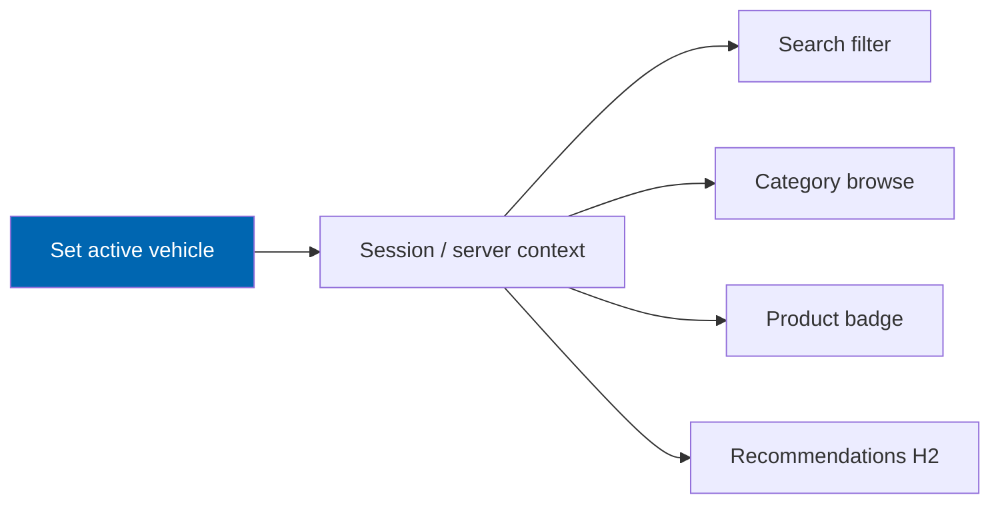
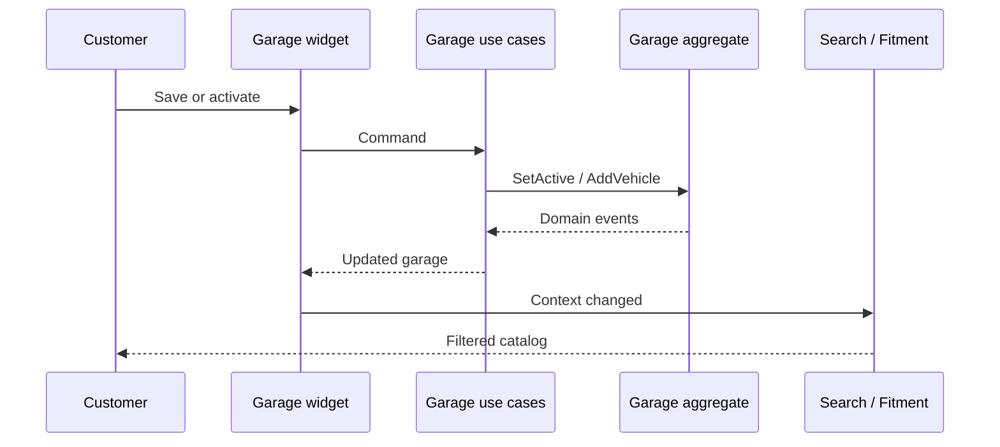

# 20 Customer Garage

> Saved vehicles, VINs, and OEM numbers; active vehicle context; guest-to-account migration;
> cross-device sync; privacy export/erasure; and garage-scoped browsing.

**Status:** Review · **Owner:** UX / Domain Architect · **Last revised:** 2026-07-28

**Engineering status (2026-08-25):** Plugin `0.104.0` is in tree. Progress, evidence gates (G1–G6 done; G11 packing partial), and remaining blockers (H1.35/G8, G7, G11 vendor signing, G12) are recorded in [EXECUTION-PLAN.md](../EXECUTION-PLAN.md). This document remains the specification baseline.

---

## Contents

- [Executive Summary](#executive-summary)
- [Objectives](#objectives)
- [Scope](#scope)
- [Detailed Specifications](#detailed-specifications)
  - [Garage model](#garage-model)
  - [Active vehicle context](#active-vehicle-context)
  - [VIN and OEM saves](#vin-and-oem-saves)
  - [Guest garage and migration](#guest-garage-and-migration)
  - [Cross-device sync](#cross-device-sync)
  - [Storefront widget and UX](#storefront-widget-and-ux)
  - [Search and catalog integration](#search-and-catalog-integration)
  - [Limits and trade shared garages](#limits-and-trade-shared-garages)
  - [Privacy security and support](#privacy-security-and-support)
  - [Events and analytics](#events-and-analytics)
  - [API contracts](#api-contracts)
- [Architecture](#architecture)
- [User Stories](#user-stories)
- [Acceptance Criteria](#acceptance-criteria)
- [Future Enhancements](#future-enhancements)
- [References](#references)

---

## Executive Summary

The garage turns a one-time VIN decode into a **persistent shopping context**. One active vehicle drives
fitment filtering across search and catalog (`FR-705`, `FR-713`). Without the garage, Check Engine's
resolution path cannot convert into repeat commerce.

Takeaways:

1. **At most one active vehicle** per garage (`INV-009`).
2. **Guest data migrates on sign-in** (`FR-704`).
3. **Signed-in garage syncs across devices** (`FR-707`).
4. **VIN storage encrypts at rest when configured** (`FR-716`).
5. **Export and erasure include garage** (`FR-710`, `FR-960`).

Horizon 1 Must for individual garages. Organisation-shared registers are Horizon 4 (`FR-712`).

---

## Objectives

| # | Objective | Traces to | Measure |
|---|---|---|---|
| 1 | Specify save/activate/clear behaviours | `FR-701`–`FR-708`, `FR-714` | Domain + API tests |
| 2 | Specify guest migration without data loss | `FR-704` | Integration test |
| 3 | Bind garage to search/fitment filtering | `FR-713`, `FR-706` | Journey J1 |
| 4 | Meet privacy and auth requirements | `FR-710`, `FR-716`, `FR-718` | Security tests |
| 5 | Deliver TDD for active-vehicle invariants | `ADR-015`, `INV-009` | Red→green evidence |

---

## Scope

### In scope

- Garage aggregate behaviour, widget contracts, guest storage, privacy, admin support view
- Events for analytics

### Out of scope

| Not covered | Where |
|---|---|
| VIN decode algorithm | [13](13-vin-engine.md) |
| Fitment evaluation | [15](15-fitment-engine.md) |
| Widget visual design | [21](21-theme-design.md) |
| Fleet/org registers detail | Horizon 4 portals |

### Assumptions

- Tables `CeGarage`, `CeGarageVehicle`, `CeGarageOem` per [10](10-database-design.md).
- Guest storage uses browser storage + optional cookie key; not a substitute for account security.
- Theme hosts the garage widget via `IWidgetPlugin` ([09](09-plugin-architecture.md)).

### Dependencies

[12](12-vehicle-database.md), [13](13-vin-engine.md), [14](14-oem-engine.md), [15](15-fitment-engine.md),
[16](16-search-engine.md), [11](11-domain-model.md), `FR-701`–`FR-720`.

---

## Detailed Specifications

### Garage model

| Entity | Rule |
|---|---|
| `Garage` | One per customer (`INV-010`, `UQ_CeGarage_CustomerId`) |
| `GarageVehicle` | Configuration id and/or VIN; label; active flag |
| `GarageOem` | Saved OEM registry ids (`FR-703` Should) |

Domain methods: `AddVehicle`, `SetActive`, `ClearActive`, `RemoveVehicle`, `SaveVin`, `SaveOem`
([11](11-domain-model.md)).

### Active vehicle context

| Rule | FR |
|---|---|
| Exactly zero or one active | `FR-705`, `INV-009` |
| Active drives fitment filter default | `FR-713` |
| Switch refreshes surfaces without full reload where feasible | `FR-706` |
| Clear requires explicit confirmation | `FR-714` |

### VIN and OEM saves

| Action | Behaviour |
|---|---|
| Save VIN (`FR-702`) | Normalise; store; optionally link configuration after decode |
| Prompt after VIN search (`FR-717` Should) | Offer “Save to garage” |
| Save OEM (`FR-703`) | Resolve via OEM engine when possible |
| Rename / edit / delete (`FR-708`) | Customer-owned |

### Guest garage and migration

| Topic (`FR-704`) | Specification |
|---|---|
| Guest store | Local payload: vehicles, VINs (careful), OEMs, active id |
| Sign-in / register | Merge into account garage: union by configuration/VIN; conflict → keep both with labels; active = guest active if account had none |
| Security | Do not migrate into another user's garage; bind merge to authenticated session only |
| Failure | If merge fails, retain guest copy and show retry |

### Cross-device sync

Signed-in customers (`FR-707`): server is source of truth; devices load via authenticated API. Guests do
not cross-device sync.

### Storefront widget and UX

| Requirement | FR |
|---|---|
| Header/theme widget | `FR-709` |
| Empty state with add path | `FR-719` |
| Arabic RTL + English | `FR-930`–`FR-932` family |
| Locale switch keeps garage context | `FR-933` |

Widget calls Application read/write services only — no SQL in views.

### Search and catalog integration

| Surface | Behaviour |
|---|---|
| Sticky search | Uses active configuration id in unified query ([16](16-search-engine.md)) |
| Category | Verified fit when active (`FR-405`) |
| Product page | Badge from fitment evaluate (`FR-320`) |
| Clear active | Unfiltered browse after confirm (`FR-714`) |

### Limits and trade shared garages

| Topic | FR | Horizon |
|---|---|---|
| Max vehicles configurable | `FR-711` Should | 1 |
| Org / shared registers | `FR-712` Should | 4 |

### Privacy security and support

| Topic | Rule |
|---|---|
| Export (`FR-710`, `FR-960`) | Include garage vehicles, VINs, OEMs in subject export |
| Erasure (`FR-710`, `FR-961`) | Delete `CeGarage*` on customer erase (orders retained per law) |
| Encryption (`FR-716`) | VIN at rest encrypted when host encryption configured |
| API auth (`FR-718`) | Account-scoped endpoints require authentication |
| Admin support view (`FR-715` Should) | View customer garage; access audited |
| Logging | No full VIN in Information+ by default ([13](13-vin-engine.md)) |

### Events and analytics

Should (`FR-720`): `garage_vehicle_saved`, `garage_active_changed`, `garage_cleared`,
`garage_guest_migrated` — consumable by analytics ([30](30-analytics.md)).

### API contracts

**`GET /check-engine/garage`** (authenticated) — garage DTO with vehicles and active id.

**`POST /check-engine/garage/vehicles`** — add from configuration id and/or VIN.

**`PUT /check-engine/garage/active/{garageVehicleId}`** — set active (clears others).

**`DELETE /check-engine/garage/active`** — clear after confirm token/flag.

**Guest:** client-side store + `POST /check-engine/garage/migrate` on login.

All account operations: auth required (`FR-718`). Rate-limited.

---

## Architecture

### Rejected alternatives

| Alternative | Rejected because |
|---|---|
| Cookie-only for signed-in users | Breaks cross-device (`FR-707`) |
| Multiple simultaneous actives | Ambiguous fitment (`FR-705`) |
| Silent clear of active on locale switch | Violates `FR-933` intent |

---

## User Stories

| ID | Persona | Story | FR | Points | Priority |
|---|---|---|---|---|---|
| `US-521` | Customer | Save my decoded VIN car to the garage | `FR-701`, `FR-702` | 5 | Must |
| `US-522` | Customer | Set active car and see only fitting parts | `FR-705`, `FR-713` | 8 | Must |
| `US-523` | Customer | Sign in and keep the car I added as guest | `FR-704` | 8 | Must |
| `US-524` | Customer | Clear active vehicle with confirmation | `FR-714` | 3 | Must |
| `US-525` | Customer | Use garage on phone and laptop when signed in | `FR-707` | 5 | Must |
| `US-526` | Support admin | View a customer's garage with audit | `FR-715` | 3 | Should |

---

## Acceptance Criteria

**`AC-20.1`** — Single active
Given vehicle A active, when B is activated, then only B is active (`FR-705`).

**`AC-20.2`** — Guest migrate
Given guest garage with one VIN car, when user registers/signs in with empty garage, then the car appears and is active (`FR-704`).

**`AC-20.3`** — Filter default
Given active configuration, when category is browsed, then DoesNotFit products are excluded (`FR-713`, `FR-303`).

**`AC-20.4`** — Clear confirm
Given active vehicle, when clear is requested without confirmation, then active remains (`FR-714`).

**`AC-20.5`** — Auth
Given anonymous caller, when `GET` account garage API is called, then 401/403 (`FR-718`).

**`AC-20.6`** — Erasure
Given customer erase, when completed, then no `CeGarage*` rows remain (`FR-710`).

**`AC-20.7`** — TDD invariant
Given `SetActive`, when developed, then a unit test asserting single-active failed before the aggregate method shipped (`ADR-015`, `INV-009`).

---

## Future Enhancements

| Enhancement | Horizon | Notes |
|---|---|---|
| Shared org vehicle registers | 4 | `FR-712` |
| Garage events → personalisation | 2 | `FR-720`, `FR-448` |
| Nickname suggestions from decode | 1+ | UX sugar |

---

## References

- [11 Domain Model](11-domain-model.md)
- [10 Database Design](10-database-design.md)
- [13 VIN Engine](13-vin-engine.md)
- [15 Fitment Engine](15-fitment-engine.md)
- [16 Search Engine](16-search-engine.md)
- [07 User Journey](07-user-journey.md) — J1
- [09 Plugin Architecture](09-plugin-architecture.md) — widgets
- [28 Security](28-security.md)
- [34 Coding Standards](34-coding-standards.md)
