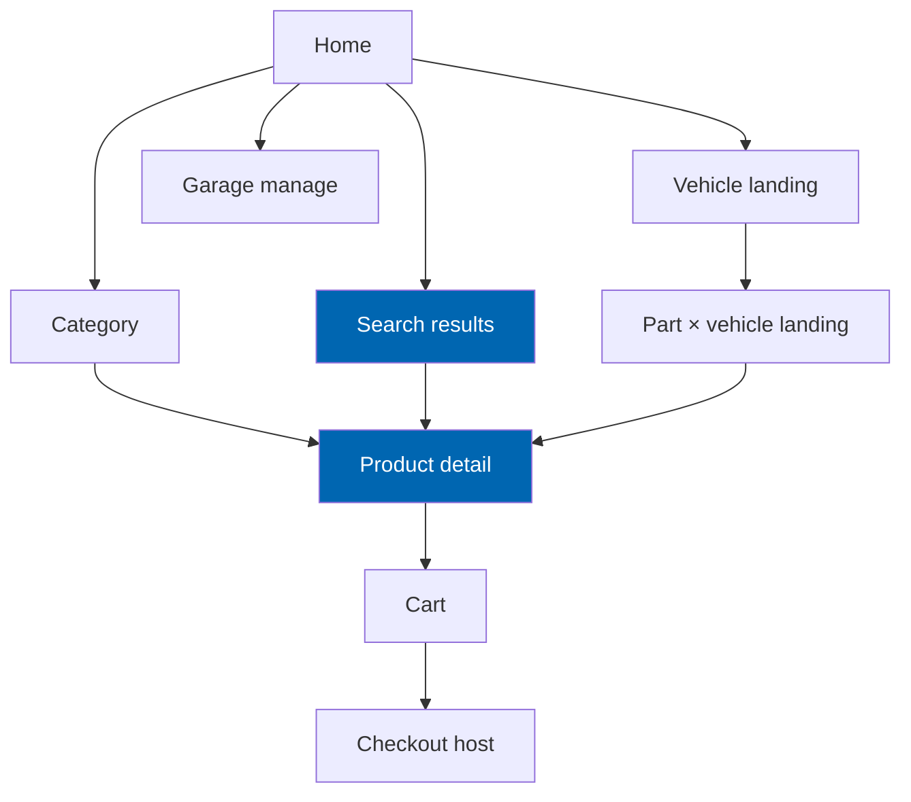
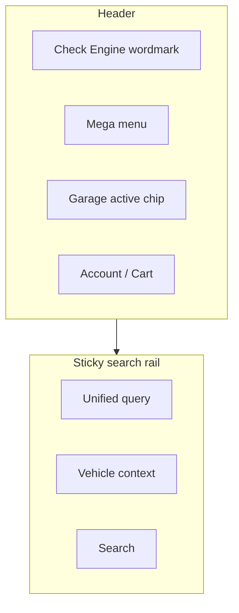
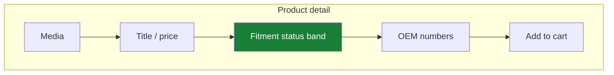
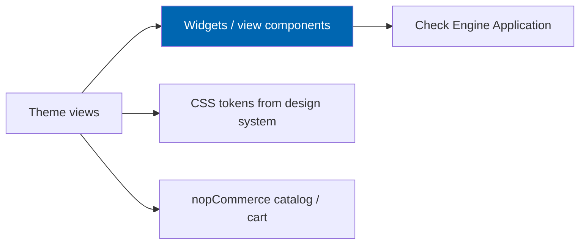

# 21 Theme Design

> The Check Engine premium dark automotive theme for nopCommerce 4.90: layout system, navigation,
> garage and vehicle selector, sticky search, product and landing templates, and performance-first
> composition.

**Status:** Review · **Owner:** UX Architect · **Last revised:** 2026-07-28

---

## Contents

- [Executive Summary](#executive-summary)
- [Objectives](#objectives)
- [Scope](#scope)
- [Detailed Specifications](#detailed-specifications)
  - [Design direction](#design-direction)
  - [Theme packaging](#theme-packaging)
  - [Layout system](#layout-system)
  - [Screen hierarchy](#screen-hierarchy)
  - [Global chrome](#global-chrome)
  - [Sticky search](#sticky-search)
  - [Garage widget and vehicle selector](#garage-widget-and-vehicle-selector)
  - [Home and category](#home-and-category)
  - [Product page](#product-page)
  - [Landing page templates](#landing-page-templates)
  - [Cart and checkout hand-off](#cart-and-checkout-hand-off)
  - [Motion](#motion)
  - [Responsive behaviour](#responsive-behaviour)
  - [Wireframes](#wireframes)
- [Architecture](#architecture)
- [User Stories](#user-stories)
- [Acceptance Criteria](#acceptance-criteria)
- [Future Enhancements](#future-enhancements)
- [References](#references)

---

## Executive Summary

The Check Engine theme is a **performance-first, dark automotive storefront** that makes vehicle
context and fitment status impossible to miss. It is inspired by premium automotive commerce — deep
surfaces, precise typography, restrained motion — without embedding any manufacturer’s brand identity
into the chrome (`FR-903`).

Takeaways:

1. **Tokens live in [22](22-ui-design-system.md)**; this document owns templates and composition.
2. **Garage, vehicle selector, sticky search, and fitment badge** are first-class chrome (`FR-709`,
   `FR-414`, `FR-320`).
3. **RTL and LTR are equal layouts**, not mirrored afterthoughts (`NFR-052`).
4. **Core Web Vitals are release gates** (`NFR-054`, `FR-438`).
5. **Cards are rare** — used for product tiles and interactive queues, not decorative chrome.

---

## Objectives

| # | Objective | Traces to | Measure |
|---|---|---|---|
| 1 | Define every major storefront template Check Engine requires | `BR-005`, Block 400/700 | Screen hierarchy complete |
| 2 | Make active vehicle context visible within one viewport | `FR-705`, `FR-709` | Widget always reachable |
| 3 | Keep sticky search usable while scrolling | `FR-414` | Manual + device test |
| 4 | Meet CWV on home, category, product, search, landing | `NFR-054`, `FR-438` | Lighthouse CI + RUM |
| 5 | Ship Arabic RTL and English LTR without feature skew | `NFR-051`, `NFR-052` | Visual protocol |

---

## Scope

### In scope

- nopCommerce theme structure, layouts, key templates, widget placement, motion, responsive rules
- Composition rules for automotive surfaces

### Out of scope

| Not covered | Where |
|---|---|
| Colour/type/spacing tokens and component states | [22](22-ui-design-system.md) |
| Interaction and a11y principles | [23](23-ux-guidelines.md) |
| SEO URL and structured data | [27](27-seo-strategy.md) |
| Admin UI | Host admin + Check Engine admin MVC |

### Assumptions

- Theme name: `CheckEngine` under `Presentation/Nop.Web/Themes/CheckEngine` (or plugin-shipped theme
  package per Marketplace packaging in [42](42-marketplace-publishing.md)).
- Views call Check Engine Application APIs via widgets/view components only.
- Default visual mode is **dark**; an optional light high-contrast admin preview is not required for v1.0 storefront.

### Dependencies

[22](22-ui-design-system.md), [23](23-ux-guidelines.md), [20](20-customer-garage.md), [16](16-search-engine.md),
[15](15-fitment-engine.md), [03](03-non-functional-requirements.md).

---

## Detailed Specifications

### Design direction

| Attribute | Choice |
|---|---|
| Atmosphere | Dark graphite / carbon surfaces with subtle radial depth — not flat black fill alone |
| Accent | Check Engine blue `#0066B1` (tokens in [22](22-ui-design-system.md)) |
| Typography | Expressive sans for UI + distinctive display for brand wordmark — **not** Inter/Roboto/Arial |
| Imagery | Real parts, vehicles, workshop context; full-bleed only on promotional/vehicle landings |
| Density | Trade-speed friendly: high signal, low decoration |
| Avoid | Purple gradients, cream+terracotta clichés, newspaper broadsheet chrome, emoji ornament |

**Brand test:** With the nav labels removed, the first viewport must still read as Check Engine via
wordmark treatment, atmosphere, and the vehicle/search composition — not a generic dark Bootstrap shop.

### Theme packaging

| Item | Specification |
|---|---|
| Theme system name | `CheckEngine` |
| Views | Razor overrides for layout, catalog, product, search, topic |
| Assets | CSS from tokens, minimal JS for sticky search / garage refresh |
| Widgets | Zones for garage, selector, sticky search, fitment badge |
| Locales | All strings via resources (`FR-930`) |

### Layout system

| Region | Role |
|---|---|
| Top utility | Locale, account, mini-cart |
| Header | Wordmark, mega menu trigger, garage widget |
| Sticky search rail | Always reachable (`FR-414`) |
| Main | Template body |
| Footer | Trust, disclaimers (`FR-901`), links |

Grid: fluid with max content width token; logical CSS properties for RTL (`inset-inline-start`, etc.).

### Screen hierarchy

### Global chrome

| Element | Behaviour |
|---|---|
| Mega menu | Categories + popular vehicle entry points; keyboardable ([23](23-ux-guidelines.md)) |
| Affiliation disclaimer | Configurable, default on, localised (`FR-901`, `FR-902`) — footer and where manufacturer marks appear |
| Aftermarket label | Clear on product tiles and PDP (`FR-904`) |

### Sticky search

| Rule | Detail |
|---|---|
| Persistence | Remains accessible while scrolling (`FR-414`) |
| Modes | Unified entry; detector per [16](16-search-engine.md) |
| Context chip | Shows active vehicle or “Select vehicle” |
| Widen fitment | Explicit control when context active |
| Mobile | Compact bar; expands to full modes sheet |

### Garage widget and vehicle selector

| Surface | FR | Composition |
|---|---|---|
| Garage widget | `FR-709` | Active vehicle summary, switch, add, empty state (`FR-719`) |
| Vehicle selector | Tree Make→… | Modal or dedicated panel; hides inactive/empty branches ([12](12-vehicle-database.md)) |
| VIN paste | — | Inline in selector/search |

No detached floating promo badges on hero media.

### Home and category

| Template | Composition rules |
|---|---|
| Home | One primary composition: brand, one headline, one supporting line, search/CTA, one dominant visual plane (full-bleed atmospheric or product-in-context). No stat strips or card grids in the first viewport |
| Category | Title reflects active vehicle when set (`FR-441`); product tiles with fitment badge; filters |

Product tiles may use card treatment as the interactive unit (tap target, focus ring).

### Product page

| Block | Rule |
|---|---|
| Media | Listing/product/zoom derivatives ([26](26-image-management.md)) |
| Fitment badge | Fits / Does not fit / Unknown / Select vehicle (`FR-320`) — primary, not a tiny icon-only hint |
| OEM block | Configurable visibility (`FR-240`) |
| Title / price / add | Host commerce |
| Specs / description | Bilingual |
| Cross-sell | Fitment-constrained when AI/recs on ([17](17-ai-architecture.md)) |

### Landing page templates

| Template | Use | Notes |
|---|---|---|
| Vehicle landing | Configuration with sellable fitments (`FR-430`) | Full-bleed hero with vehicle context; then parts list — one job per section |
| Part × vehicle | Intersection SEO (`FR-431`) | Headline = part + vehicle; fitment asserted |

Thin/empty pages: `noindex` ([27](27-seo-strategy.md) `FR-440`). CWV budgets apply (`FR-438`).

### Cart and checkout hand-off

Theme styles cart; checkout remains nopCommerce flow with theme chrome where supported. Payment/shipping
widgets come from sibling plugins — no Paymob/Bosta hard dependency (`FR-950`).

### Motion

Ship at least three intentional motions (presence, not noise):

| Motion | Where |
|---|---|
| Search rail settle | On sticky attach |
| Fitment badge state change | Soft colour/opacity crossfade ≤ 200 ms |
| Garage active switch | Context chip update |

Respect `prefers-reduced-motion` ([23](23-ux-guidelines.md)).

### Responsive behaviour

| Breakpoint (tokenised) | Priority |
|---|---|
| ≥ 1200 px | Mega menu, dual-column PDP |
| 768–1199 | Condensed header |
| ≤ 767 | Bottom-accessible search; garage in sheet; single column |

Verified from 320 px to 2560 px (DoD).

### Wireframes

#### Header + sticky search (LTR)

#### Product page fitment band

---

## Architecture

### Rejected alternatives

| Alternative | Rejected because |
|---|---|
| Light generic nopCommerce default theme | Fails brand test and automotive trust |
| Card-heavy dashboard home | Violates one-composition rule |
| Manufacturer logo pack in theme | `FR-903` |
| Fitment as optional footnote | Undermines `FR-320` |

---

## User Stories

| ID | Persona | Story | FR | Points | Priority |
|---|---|---|---|---|---|
| `US-601` | Customer | Use sticky search while scrolling a long category | `FR-414` | 5 | Must |
| `US-602` | Customer | See fitment status prominently on the product page | `FR-320` | 5 | Must |
| `US-603` | Customer | Open garage from the header on mobile | `FR-709` | 5 | Must |
| `US-604` | Customer | Browse home in Arabic RTL without clipped chrome | `NFR-052` | 8 | Must |
| `US-605` | Operator | Enable theme on 4.90 without code edits to host | Theme install | 3 | Must |

---

## Acceptance Criteria

**`AC-21.1`** — Sticky search
Given a scrolled category page, when the user focuses search, then the sticky rail is reachable without returning to top (`FR-414`).

**`AC-21.2`** — Fitment band
Given an active vehicle and published Fits claim, when PDP loads, then the fitment status is visible without opening an accordion (`FR-320`).

**`AC-21.3`** — CWV gate
Given Lighthouse CI on mobile profile for home/category/product/search, when run on reference hardware, then LCP/INP/CLS meet `NFR-054`.

**`AC-21.4`** — RTL chrome
Given Arabic locale, when header and sticky search render, then no clipped text and icons mirror correctly (`NFR-052`).

**`AC-21.5`** — First viewport home
Given home at 1280×800, when counted, then the first viewport has no stat strip or multi-card promo grid.

---

## Future Enhancements

| Enhancement | Horizon | Notes |
|---|---|---|
| Optional light storefront theme | 2 | Same tokens, inverted surfaces |
| Vendor storefront skins | 3 | Marketplace |
| Advanced 360 media layout | 3 | [26](26-image-management.md) |

---

## References

- [22 UI Design System](22-ui-design-system.md)
- [23 UX Guidelines](23-ux-guidelines.md)
- [20 Customer Garage](20-customer-garage.md)
- [16 Search Engine](16-search-engine.md)
- [27 SEO Strategy](27-seo-strategy.md)
- [03 Non-Functional Requirements](03-non-functional-requirements.md)
