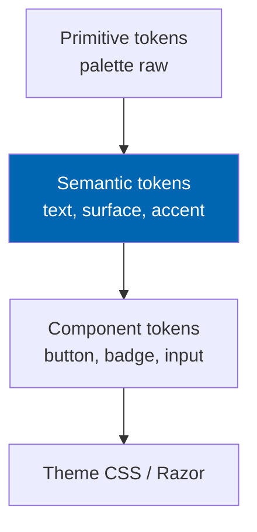
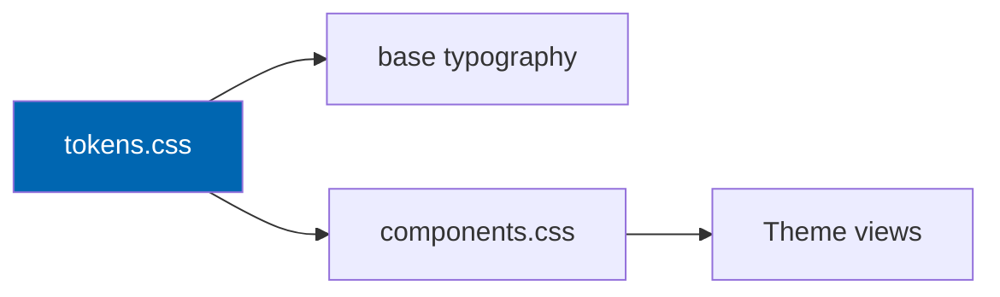

# 22 UI Design System

> Design tokens, typography, colour, spacing, elevation, component catalogue, interaction states, and
> the Arabic type strategy for the Check Engine storefront.

**Status:** Review · **Owner:** UX Architect · **Last revised:** 2026-07-28

---

## Contents

- [Executive Summary](#executive-summary)
- [Objectives](#objectives)
- [Scope](#scope)
- [Detailed Specifications](#detailed-specifications)
  - [Token architecture](#token-architecture)
  - [Colour](#colour)
  - [Typography](#typography)
  - [Spacing density and radius](#spacing-density-and-radius)
  - [Elevation and borders](#elevation-and-borders)
  - [Iconography](#iconography)
  - [Component catalogue](#component-catalogue)
  - [States](#states)
  - [Arabic type strategy](#arabic-type-strategy)
  - [Fitment status language](#fitment-status-language)
  - [Implementation notes](#implementation-notes)
- [Architecture](#architecture)
- [User Stories](#user-stories)
- [Acceptance Criteria](#acceptance-criteria)
- [Future Enhancements](#future-enhancements)
- [References](#references)

---

## Executive Summary

The design system is the **single source of visual truth** for the Check Engine theme. Templates in
[21](21-theme-design.md) consume tokens; they do not invent hex values. The system supports dark
storefront surfaces, bilingual typography, and fitment status colours that match the documentation
palette used across Mermaid diagrams for consistency.

Takeaways:

1. **CSS custom properties** name every colour, space, and type step.
2. **No Inter / Roboto / Arial / system-ui as primary UI fonts.**
3. **Fitment colours are semantic and colourblind-safe with icons/text**, not colour alone.
4. **Arabic uses a purpose-chosen Arabic family** paired with the Latin display/UI pair.
5. **Components are few and purposeful** — prefer composition over a bloated kit.

---

## Objectives

| # | Objective | Traces to | Measure |
|---|---|---|---|
| 1 | Publish a complete token set for theme implementation | `NFR-057` | Token file in theme |
| 2 | Ensure WCAG contrast on text/interactive defaults | `NFR-046` | Contrast audit |
| 3 | Define bilingual type ramp | `NFR-051` | Specimens EN+AR |
| 4 | Standardise fitment and feedback states | `FR-320` | Component table |
| 5 | Keep radius/shadow restrained for automotive tone | [21](21-theme-design.md) | Visual review |

---

## Scope

### In scope

- Tokens, type, colour, components, states, Arabic strategy
- Mapping to theme CSS

### Out of scope

| Not covered | Where |
|---|---|
| Page templates | [21](21-theme-design.md) |
| Behaviour and a11y procedures | [23](23-ux-guidelines.md) |
| Admin nopCommerce skinning | Not in v1.0 scope |

### Assumptions

- Fonts are self-hosted or licensed for commercial nopCommerce redistribution; licence files in theme.
- Preferred Latin UI: **IBM Plex Sans**; display/wordmark: **Outfit** (or equivalent distinctive sans).
  Arabic UI: **IBM Plex Sans Arabic** (paired). Substitutions allowed if licence blocks redistribution —
  must remain non-generic and documented in CHANGELOG.

### Dependencies

[21](21-theme-design.md), [23](23-ux-guidelines.md), [03](03-non-functional-requirements.md).

---

## Detailed Specifications

### Token architecture

Naming: `--ce-color-surface-raised`, `--ce-space-4`, `--ce-font-size-md`. Prefix `ce` avoids host clashes.

### Colour

#### Primitives (normative)

| Token | Value | Role |
|---|---|---|
| `--ce-raw-graphite-950` | `#0B0E13` | Deepest canvas |
| `--ce-raw-graphite-900` | `#12161E` | Page background |
| `--ce-raw-graphite-800` | `#1A2030` | Raised surface |
| `--ce-raw-graphite-700` | `#243044` | Borders / hairlines |
| `--ce-raw-cloud-100` | `#E8EEF7` | Primary text |
| `--ce-raw-cloud-300` | `#A7B4C8` | Secondary text |
| `--ce-raw-blue-600` | `#0066B1` | Brand / primary action |
| `--ce-raw-blue-400` | `#3D9BE0` | Focus / link hover |
| `--ce-raw-green-700` | `#1A7F37` | Fits / success |
| `--ce-raw-amber-700` | `#9A6700` | Warning / review |
| `--ce-raw-red-700` | `#CF222E` | Does not fit / danger |
| `--ce-raw-slate-600` | `#6E7781` | Unknown / neutral |

Atmosphere: page background uses a subtle radial gradient from graphite-900 toward a cooler blue-black —
not flat single fill alone ([21](21-theme-design.md)).

#### Semantic mapping

| Semantic | Token |
|---|---|
| `--ce-surface-canvas` | graphite-900 |
| `--ce-surface-raised` | graphite-800 |
| `--ce-text-primary` | cloud-100 |
| `--ce-text-muted` | cloud-300 |
| `--ce-action-primary` | blue-600 |
| `--ce-fit-fits` | green-700 |
| `--ce-fit-unfit` | red-700 |
| `--ce-fit-unknown` | slate-600 |
| `--ce-focus-ring` | blue-400 |

**Contrast:** primary text on canvas ≥ 4.5:1; primary buttons use cloud text on blue-600 verified ≥ 4.5:1
or adjust lightness.

**Avoid:** purple/indigo as brand; glow stacks; rainbow gradients.

### Typography

| Role | Family | Notes |
|---|---|---|
| Display / wordmark | Outfit | Tracking slightly tight; brand-scale on home |
| UI Latin | IBM Plex Sans | Body, forms, nav |
| UI Arabic | IBM Plex Sans Arabic | Same scale steps |
| Mono (OEM numbers) | IBM Plex Mono | Part numbers, VINs in UI |

#### Type scale (rem)

| Step | Size | Use |
|---|---|---|
| `xs` | 0.75 | Meta |
| `sm` | 0.875 | Secondary |
| `md` | 1.0 | Body |
| `lg` | 1.125 | Titles sm |
| `xl` | 1.5 | Section |
| `2xl` | 2.0 | Page |
| `3xl` | 2.75 | Display (home) |

Line-height: 1.45 body; 1.2 display. Font-feature-settings for tabular figures on prices/OEM where useful.

### Spacing density and radius

| Token | Value |
|---|---|
| `--ce-space-1` … `--ce-space-8` | 4, 8, 12, 16, 24, 32, 48, 64 px |
| `--ce-radius-sm` | 4 px |
| `--ce-radius-md` | 8 px |
| `--ce-radius-lg` | 12 px |

No `rounded-full` pills for primary actions by default — slight radius only. Full-pill reserved for
optional filter chips if needed.

### Elevation and borders

| Token | Use |
|---|---|
| Hairline `1px solid graphite-700` | Default separation |
| `--ce-shadow-raised` | Single soft shadow for dropdowns only — not multi-layer stacks on every card |

### Iconography

| Rule | Detail |
|---|---|
| Style | Simple geometric stroke icons, 1.5–2 px |
| Mirroring | Directional icons flip in RTL |
| Fitment | Always paired with text label |

### Component catalogue

| Component | Purpose | Card? |
|---|---|---|
| Button primary / secondary / quiet | Actions | No |
| Text field / textarea | Input | No |
| Context chip | Active vehicle | No |
| Fitment badge | Status | No |
| Product tile | Catalog hit | Yes (interaction unit) |
| Filter panel | Facets | No |
| Mega menu panel | Nav | No |
| Modal / sheet | Selector, garage | No |
| Toast / inline alert | Feedback | No |
| Skeleton | Loading | No |

Form controls: visible labels; errors inline; never colour-only.

### States

| State | Treatment |
|---|---|
| Default | Semantic tokens |
| Hover | Lighten action / raise hairline |
| Focus visible | `--ce-focus-ring` 2 px outline offset 2 px |
| Disabled | 40% opacity + `aria-disabled`; not solely greyed text |
| Loading | Skeleton or button spinner; announce busy |
| Error | red-700 border + message |
| Success | green-700 message |

### Arabic type strategy

| Topic | Rule |
|---|---|
| Family | IBM Plex Sans Arabic for UI |
| Digits | Prefer locale-appropriate; OEM/VIN stay Western Arabic numerals for catalog fidelity |
| Line length | Slightly shorter measure than Latin when needed |
| Mixed script | OEM Latin inside AR copy remains LTR isolate (`unicode-bidi: isolate`) |
| Fallbacks | Documented stack ending in a licensed Arabic-capable face — not bare `sans-serif` alone |

### Fitment status language

| Status | Colour token | Icon | Text (EN) | Text (AR resource key) |
|---|---|---|---|---|
| Fits | `--ce-fit-fits` | Check | Fits your vehicle | Localised resource |
| Does not fit | `--ce-fit-unfit` | Cross | Does not fit | Localised |
| Unknown | `--ce-fit-unknown` | Dash | Fitment unknown | Localised |
| Select vehicle | `--ce-action-primary` | Car | Select your vehicle | Localised |

### Implementation notes

| Rule | Detail |
|---|---|
| Delivery | `_tokens.css` imported by theme |
| No magic hex in components | Only `var(--ce-…)` |
| Dark default | v1.0 storefront |
| Print | Rare; ensure product specs printable in light |

---

## Architecture

### Rejected alternatives

| Alternative | Rejected because |
|---|---|
| Tailwind default palette / Inter | Generic AI look; brand test fail |
| Colour-only fitment states | Fails WCAG use-of-colour |
| Large shadow card system | Conflicts with automotive restraint |

---

## User Stories

| ID | Persona | Story | Points | Priority |
|---|---|---|---|---|
| `US-611` | Frontend engineer | Implement buttons using only design tokens | 3 | Must |
| `US-612` | Frontend engineer | Render Arabic body text with the specified Arabic family | 5 | Must |
| `US-613` | Customer | Distinguish Fits vs Does not fit without relying on colour alone | 3 | Must |
| `US-614` | Designer | Audit contrast of primary text and primary button | 3 | Must |

---

## Acceptance Criteria

**`AC-22.1`** — Token-only colours
Given theme component CSS, when scanned for raw `#` hex outside `_tokens.css`, then zero matches in component files.

**`AC-22.2`** — Contrast
Given primary text on canvas and primary button label, when measured, then contrast ≥ 4.5:1 (`NFR-046`).

**`AC-22.3`** — Fonts
Given computed styles on body and wordmark, when inspected, then families are the specified pair (or documented licensed substitute), not Inter/Roboto/Arial.

**`AC-22.4`** — Fitment dual encoding
Given each fitment status, when rendered, then text label and non-colour cue (icon) are both present (`FR-320`, WCAG).

**`AC-22.5`** — OEM isolate
Given Arabic description containing an OEM number, when rendered, then the OEM number reading order is correct.

---

## Future Enhancements

| Enhancement | Horizon | Notes |
|---|---|---|
| Light theme semantic layer | 2 | Remap surfaces |
| Density compact mode for trade | 2 | Spacing scale variant |
| Figma library parity export | 1 | Partner tooling |

---

## References

- [21 Theme Design](21-theme-design.md)
- [23 UX Guidelines](23-ux-guidelines.md)
- [03 Non-Functional Requirements](03-non-functional-requirements.md)
- WCAG 2.2 contrast criteria
