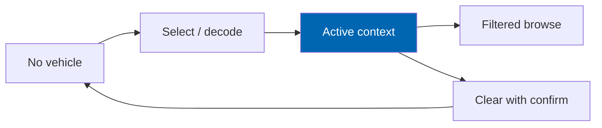

# 23 UX Guidelines

> Interaction principles, bidirectional layout, WCAG 2.2 AA practice, progressive disclosure, empty
> and error states, and trade-speed patterns for Check Engine storefronts.

**Status:** Review · **Owner:** UX Architect · **Last revised:** 2026-07-28

**Engineering status (2026-08-25):** Plugin `0.104.0` is in tree. Progress, evidence gates (G1–G6 done; G11 packing partial), and remaining blockers (H1.35/G8, G7, G11 vendor signing, G12) are recorded in [EXECUTION-PLAN.md](../EXECUTION-PLAN.md). This document remains the specification baseline.

---

## Contents

- [Executive Summary](#executive-summary)
- [Objectives](#objectives)
- [Scope](#scope)
- [Detailed Specifications](#detailed-specifications)
  - [Interaction principles](#interaction-principles)
  - [Vehicle context as a first-class object](#vehicle-context-as-a-first-class-object)
  - [Bidirectional layout](#bidirectional-layout)
  - [Accessibility WCAG 2.2 AA](#accessibility-wcag-22-aa)
  - [Progressive disclosure](#progressive-disclosure)
  - [Empty error and loading states](#empty-error-and-loading-states)
  - [Search and zero-result recovery](#search-and-zero-result-recovery)
  - [Forms and validation](#forms-and-validation)
  - [Motion and reduced motion](#motion-and-reduced-motion)
  - [Trade-speed patterns](#trade-speed-patterns)
  - [Content and tone](#content-and-tone)
  - [Review protocol](#review-protocol)
- [Architecture](#architecture)
- [User Stories](#user-stories)
- [Acceptance Criteria](#acceptance-criteria)
- [Future Enhancements](#future-enhancements)
- [References](#references)

---

## Executive Summary

UX guidelines tell engineers and designers **how Check Engine must behave** under real use: Arabic and
English as equals, vehicle context always honest, accessibility as a gate, and recovery paths when
fitment or search yields nothing. Visual tokens live in [22](22-ui-design-system.md); templates in
[21](21-theme-design.md).

Takeaways:

1. **Never invent Fits** in the UI — Unknown and Select vehicle are first-class (`FR-320`).
2. **WCAG 2.2 AA** on Check Engine storefront surfaces (`NFR-046`).
3. **RTL is logical properties + mirrored affordances**, not a bolted stylesheet (`NFR-052`).
4. **Zero results always offer a next step** (`FR-412`).
5. **Trade buyers get speed**: VIN → cart paths stay short ([07](07-user-journey.md) J3).

---

## Objectives

| # | Objective | Traces to | Measure |
|---|---|---|---|
| 1 | Codify interaction rules for vehicle context and fitment | `FR-320`, `FR-705` | Heuristic review |
| 2 | Operationalise WCAG 2.2 AA | `NFR-046`–`NFR-050` | axe + manual |
| 3 | Define bilingual / RTL behaviour | `NFR-051`, `NFR-052` | Visual protocol |
| 4 | Standardise empty/error/recovery | `FR-412` | Journey tests |
| 5 | Align with TDD for behavioural UI logic | `ADR-015` | Widget tests |

---

## Scope

### In scope

- Storefront UX principles, a11y expectations, RTL, states, tone
- Patterns for search, garage, fitment, forms

### Out of scope

| Not covered | Where |
|---|---|
| Visual tokens | [22](22-ui-design-system.md) |
| Page layouts | [21](21-theme-design.md) |
| Admin UX detail | Later / light touch in ops docs |
| Full a11y test matrix tooling | [35](35-testing-strategy.md) |

### Assumptions

- Target devices include mid-range Android on 4G (NFR mobile profile).
- Keyboard and screen-reader testing uses current NVDA/VoiceOver baselines.

### Dependencies

[21](21-theme-design.md), [22](22-ui-design-system.md), [20](20-customer-garage.md), [16](16-search-engine.md),
[07](07-user-journey.md), [03](03-non-functional-requirements.md).

---

## Detailed Specifications

### Interaction principles

| # | Principle | Practice |
|---|---|---|
| 1 | Honesty over conversion tricks | Never label Unknown as Fits |
| 2 | Context before catalog | Prompt vehicle selection early; do not hide garage |
| 3 | One primary action per view band | Search submit, Add to cart, Save vehicle |
| 4 | Speed for trade | Minimise steps VIN → cart (≤ 3 minutes target journey) |
| 5 | Parity of languages | No English-only feature (`NFR-051`) |
| 6 | Progressive disclosure | Advanced filters collapsed; essentials visible |
| 7 | Forgiveness | Confirm destructive clears; reversible garage deletes where possible |

### Vehicle context as a first-class object

| Rule | Detail |
|---|---|
| Visibility | Active vehicle chip always in chrome when set |
| Ambiguity | VIN multi-candidate → choose explicitly ([13](13-vin-engine.md)) |
| Switch | Announce change to AT; refresh results (`FR-706`) |
| Clear | Confirm (`FR-714`) |

### Bidirectional layout

| Rule (`NFR-052`) | Detail |
|---|---|
| CSS | Logical properties (`margin-inline`, `padding-inline`, `inset-inline-start`) |
| Icons | Directional chevrons mirror; brand marks do not |
| Mega menu | Opens toward inline-end consistently |
| Numbers | OEM/VIN LTR isolates inside RTL text ([22](22-ui-design-system.md)) |
| Media | Do not flip product photos |

### Accessibility WCAG 2.2 AA

| Area | Requirement |
|---|---|
| Percievable | Text alternatives for images (`FR-662`); contrast ([22](22-ui-design-system.md)) |
| Operable | Keyboard all flows; focus visible; no keyboard trap in mega menu/modals |
| Understandable | Labels; consistent nav; error identification |
| Robust | Valid ARIA on widgets; live regions for fitment/search updates |
| Target size | Adequate hit targets on mobile garage/search |
| Motion | Honour `prefers-reduced-motion` |

**Gate (`NFR-046`):** zero serious/critical axe findings on home, category, product, search, garage sheet.

### Progressive disclosure

| Surface | Collapsed by default | Always visible |
|---|---|---|
| Search | Advanced mode picker detail | Query + context |
| Filters | Secondary facets | Category / fitment widen |
| PDP | Long specs | Fitment band, price, add |
| Garage | Past vehicles list detail | Active chip |

### Empty error and loading states

| State | Must include |
|---|---|
| Empty garage | Illustration/text + path to add vehicle (`FR-719`) |
| Empty category with context | Explain no fitting parts + widen or clear vehicle |
| Error | What failed + recovery (retry, contact) — no blameful copy |
| Loading | Skeleton; preserve layout to limit CLS (`NFR-054`) |
| Offline search degrade | Message when `degraded` flag ([16](16-search-engine.md)) |

### Search and zero-result recovery

Per `FR-412` and [16](16-search-engine.md):

1. Offer widen fitment if context tight  
2. Suggest spelling / synonyms  
3. Link to vehicle selector / clear context  
4. Never show random non-fitting parts as “similar” without label  

### Forms and validation

| Rule | Detail |
|---|---|
| Validate on submit + blur for critical fields | VIN charset hints early |
| Errors | Inline, associated with `aria-describedby` |
| Success | Quiet confirmation |
| VIN privacy | Do not echo full VIN in public analytics toasts |

### Motion and reduced motion

| Rule | Detail |
|---|---|
| Intentional only | Per [21](21-theme-design.md) motion list |
| `prefers-reduced-motion: reduce` | Disable non-essential transitions |
| Duration | ≤ 200 ms for status changes |

### Trade-speed patterns

| Pattern | Guidance |
|---|---|
| VIN first | Sticky search accepts paste; large touch target |
| Recent vehicles | Garage list prioritises last active |
| OEM monospace | Fast visual scan of part numbers |
| Minimal modal depth | Prefer one sheet, not stacked dialogs |

### Content and tone

| Do | Do not |
|---|---|
| Precise: “Does not fit your 2016 F30 320i” | Vague: “May not be compatible” when DoesNotFit known |
| Nominative manufacturer use only | Imply affiliation (`FR-901`) |
| Aftermarket labelled | Imply OE when aftermarket (`FR-904`) |
| Short helper text | Marketing fluff that invents fitment |

### Review protocol

Before release of UI changes:

1. EN LTR + AR RTL screenshots of touched templates  
2. Keyboard pass  
3. axe on touched templates  
4. Fitment honesty checklist (no fail-open copy)  
5. CWV smoke on product/search if layout shifted  

---

## Architecture

UX rules apply at the **theme and widget** layer; domain honesty is enforced by APIs returning Unknown
rather than Fits on failure ([15](15-fitment-engine.md), [34](34-coding-standards.md)).

### Rejected alternatives

| Alternative | Rejected because |
|---|---|
| Dark patterns to force account creation before VIN | Harms J1 trust |
| Auto-picking VIN candidate | `FR-206` |
| English-first with Arabic “phase 2” | `NFR-051` |

---

## User Stories

| ID | Persona | Story | FR | Points | Priority |
|---|---|---|---|---|---|
| `US-621` | Customer | Recover from zero results without a dead end | `FR-412` | 5 | Must |
| `US-622` | Customer | Complete VIN purchase flow with keyboard only | `NFR-046` | 8 | Must |
| `US-623` | Customer | Use Arabic RTL garage without mirrored product images | `NFR-052` | 5 | Must |
| `US-624` | Trade buyer | Reach cart quickly after VIN decode | J3 / `NFR` | 8 | Must |
| `US-625` | Customer | Understand Does not fit is definitive when shown | `FR-320` | 3 | Must |

---

## Acceptance Criteria

**`AC-23.1`** — axe gate
Given home, category, product, search templates, when axe runs in CI/manual gate, then serious/critical count is zero (`NFR-046`).

**`AC-23.2`** — Zero-result recovery
Given a verified search with zero hits, when the page renders, then at least two recovery actions are offered (`FR-412`).

**`AC-23.3`** — Clear confirm
Given active vehicle, when clear is attempted, then a confirmation step is required (`FR-714`).

**`AC-23.4`** — Reduced motion
Given OS reduced-motion enabled, when navigating PDP fitment changes, then non-essential transitions do not run.

**`AC-23.5`** — Honesty
Given Unknown fitment, when badge copy is inspected, then it does not use Fits wording (`FR-320`).

---

## Future Enhancements

| Enhancement | Horizon | Notes |
|---|---|---|
| WCAG AAA for selected admin flows | 3 | Optional NFR |
| Guided first-run coach marks | 2 | Opt-in, dismissible |
| Voice input for search | 4 | |

---

## References

- [21 Theme Design](21-theme-design.md)
- [22 UI Design System](22-ui-design-system.md)
- [20 Customer Garage](20-customer-garage.md)
- [16 Search Engine](16-search-engine.md)
- [07 User Journey](07-user-journey.md)
- [03 Non-Functional Requirements](03-non-functional-requirements.md)
- [WCAG 2.2](https://www.w3.org/TR/WCAG22/)
