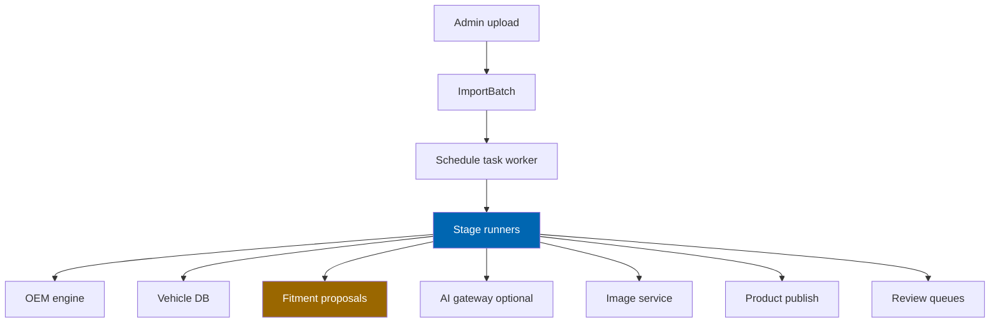

# 24 Product Import Pipeline

> Twelve-stage ingestion of supplier catalogs from PDF, Excel, and CSV: extraction through review and
> publication, with re-runnable stages, confidence gates, and partial-batch success.

**Status:** Review · **Owner:** Data Architect · **Last revised:** 2026-07-28

**Engineering status (2026-08-25):** Plugin `0.104.0` is in tree. Progress, evidence gates (G1–G6 done; G11 packing partial), and remaining blockers (H1.35/G8, G7, G11 vendor signing, G12) are recorded in [EXECUTION-PLAN.md](../EXECUTION-PLAN.md). This document remains the specification baseline.

---

## Contents

- [Executive Summary](#executive-summary)
- [Objectives](#objectives)
- [Scope](#scope)
- [Detailed Specifications](#detailed-specifications)
  - [Batch lifecycle](#batch-lifecycle)
  - [Stage catalogue](#stage-catalogue)
  - [Ingest and extract](#ingest-and-extract)
  - [Normalise and deduplicate](#normalise-and-deduplicate)
  - [OEM and vehicle match](#oem-and-vehicle-match)
  - [Enrich translate SEO](#enrich-translate-seo)
  - [Categorise and image assign](#categorise-and-image-assign)
  - [Review and publish](#review-and-publish)
  - [Supplier profiles](#supplier-profiles)
  - [Dry-run progress and errors](#dry-run-progress-and-errors)
  - [Throughput commitment](#throughput-commitment)
  - [Permissions and audit](#permissions-and-audit)
- [Architecture](#architecture)
- [User Stories](#user-stories)
- [Acceptance Criteria](#acceptance-criteria)
- [Future Enhancements](#future-enhancements)
- [References](#references)

---

## Executive Summary

Data acquisition is the **critical path** to a sellable automotive catalog (`ADR-003`, roadmap). The
import pipeline turns supplier files into nopCommerce products, OEM links, and **proposed** fitment
claims — with humans in the loop wherever confidence is low.

Takeaways:

1. **Twelve named stages**, each re-runnable (`FR-603`, `FR-604`).
2. **PDF (text + OCR), Excel, CSV** (`FR-601`, `FR-605`).
3. **High-confidence rows auto-advance; low-confidence enter review** (`FR-614`, `FR-615`).
4. **Failed rows do not block successful ones** (`FR-643`).
5. **AI enrichment stages are optional** — pipeline works with AI off ([17](17-ai-architecture.md)).

Horizon 1 delivers deterministic stages through publish. AI enrich/translate/SEO are Horizon 2 hooks
that no-op when disabled.

---

## Objectives

| # | Objective | Traces to | Measure |
|---|---|---|---|
| 1 | Specify every stage input/output and failure mode | `FR-603` | Stage contract tests |
| 2 | Support supplier column profiles | `FR-606`, `FR-650` | Profile CRUD |
| 3 | Integrate OEM, vehicle, fitment engines without bypassing review | `FR-612`–`FR-614` | Claims unpublished when below threshold |
| 4 | Meet 10k-lines / five working days commitment | `FR-641` | Measured on reference hardware |
| 5 | Keep publish transactional per item | `FR-640` | Partial batch success |

---

## Scope

### In scope

- Batch model, twelve stages, supplier profiles, review/publish, dry-run, admin visibility
- Hand-offs to OEM, vehicle, fitment, AI content, and image modules

### Out of scope

| Not covered | Where |
|---|---|
| Prompt/model details for enrichment | [25](25-ai-content-pipeline.md), [17](17-ai-architecture.md) |
| Image derivatives and CDN | [26](26-image-management.md) |
| ERP push of imported products | [18](18-erpnext-integration.md) |
| Table DDL | [10](10-database-design.md) `CeImportBatch` / `CeImportRow` |

### Assumptions

- Uploads stored in secure private storage; not publicly URL-guessable.
- Schedule task `CheckEngine.Import.ProcessBatches` advances work ([09](09-plugin-architecture.md)).
- OCR engine is a replaceable Infrastructure adapter.

### Dependencies

[14](14-oem-engine.md), [12](12-vehicle-database.md), [15](15-fitment-engine.md), [17](17-ai-architecture.md),
[25](25-ai-content-pipeline.md), [26](26-image-management.md), Block 600 FRs.

---

## Detailed Specifications

### Batch lifecycle

Statuses align with [11](11-domain-model.md): Received → Parsing → Matching → Review → Committed / Failed.

| Concept | Persistence |
|---|---|
| Batch | `CeImportBatch` — file name, format, status, counts, error summary (`FR-602`) |
| Row | `CeImportRow` — raw JSON, normalised fields, match ids, review status |
| Progress | Stage cursor + per-stage counters visible in admin (`FR-642`) |

### Stage catalogue

`FR-603` lists twelve stages; **Review** and **Publish** are the final human/automated gates (shown as
12–13 above for clarity). Normative ordered names:

| # | Stage | Horizon | AI? |
|---|---|---|---|
| 1 | Ingest | 1 | No |
| 2 | Extract | 1 | No (OCR optional local) |
| 3 | Normalise | 1 | No |
| 4 | Deduplicate | 1 | No |
| 5 | OEM-match | 1 | No |
| 6 | Vehicle-match | 1 | No |
| 7 | Enrich | 2 | Yes if enabled |
| 8 | Translate | 2 | Yes if enabled |
| 9 | SEO-generate | 2 Should | Yes if enabled |
| 10 | Categorise | 1 | Rules; AI assist optional H2 |
| 11 | Image-assign | 1 | No |
| 12 | Review | 1 | Human |
| 13 | Publish | 1 | No |

Each stage is **individually re-runnable** after correction (`FR-604`) for rows still in scope (not yet
committed, or flagged for reprocess).

### Ingest and extract

| Topic | Rule |
|---|---|
| Formats (`FR-601`) | PDF, `.xlsx`, CSV (UTF-8 with BOM detection) |
| Ingest | Validate size/type; virus scan hook; create batch; store blob |
| Excel/CSV (`FR-606`) | Column map from supplier profile; preview first N rows |
| PDF text | Extract tables/text where selectable |
| PDF scan (`FR-605`) | OCR adapter; confidence per cell; low OCR confidence → review |
| Output | Row records with `RawPayload` JSON |

### Normalise and deduplicate

| Stage | Behaviour |
|---|---|
| Normalise (`FR-607`) | OEM rules ([14](14-oem-engine.md)); units; controlled vocabulary terms |
| Deduplicate (`FR-610`) | Within batch + against catalog: OEM key, brand+number, fuzzy name |
| Decisions (`FR-611`) | UI: merge, link to existing product, or keep separate |

### OEM and vehicle match

| Stage | Behaviour |
|---|---|
| OEM-match (`FR-612`) | Attach or create `OemNumber` with confidence; ambiguous manufacturer → review |
| Vehicle-match (`FR-613`) | Propose `FitmentClaim` candidates; provenance ImportBatch; **unpublished** if below threshold |
| Thresholds (`FR-614`, `FR-615`) | Below → review queue with ambiguity reason; above → continue without per-item typing |

Safety-critical proposed claims never auto-publish ([15](15-fitment-engine.md)).

### Enrich translate SEO

When AI disabled: stages **skip** and leave fields empty or copy source language (`FR-505`).

When enabled: create **candidates** only (`FR-620`–`FR-622`) via [25](25-ai-content-pipeline.md) — never
write published storefront fields until review approval.

### Categorise and image assign

| Stage | Behaviour |
|---|---|
| Categorise (`FR-623`) | Ruleset maps supplier category → nopCommerce category ids |
| Image-assign (`FR-630`) | Link supplier URLs/files when present; else placeholder ([26](26-image-management.md)) |

### Review and publish

| Topic | Rule |
|---|---|
| Review queue | Filters by confidence, stage error, duplicate decision pending |
| Publish (`FR-640`) | Create/update `Product` per row in a transaction; map OEM; enqueue fitment review items |
| Partial success (`FR-643`) | Row failure records error; siblings continue |
| Idempotency | Re-publish uses external/supplier key upsert where profile defines it |

### Supplier profiles

Should (`FR-650`): default column maps, confidence overrides, contact metadata, preferred manufacturer
id for OEM disambiguation.

### Dry-run progress and errors

| Capability | FR |
|---|---|
| Dry-run matching without publish | `FR-645` Should |
| Progress + downloadable error report | `FR-642` |
| Per-row error codes | Stable codes for automation |

### Throughput commitment

`FR-641`: **10,000 line items** to published state within **five working days** including human review,
on reference hardware from [03](03-non-functional-requirements.md). Assumes staffing for review queue
proportional to low-confidence rate; automation target is that high-confidence majority needs no
keystrokes (`FR-615`).

### Permissions and audit

| Rule | FR |
|---|---|
| Permission-restricted | `FR-644` — `ManageCheckEngineCatalog` |
| Audit upload, map change, publish, review decisions | `FR-644`, `BR-016` |

---

## Architecture

### Rejected alternatives

| Alternative | Rejected because |
|---|---|
| Single monolithic “import job” without stages | Cannot re-run (`FR-604`) |
| Auto-publish all fitment from supplier PDF | Safety / `ADR-008` |
| Blocking batch on first error | Violates `FR-643` |
| Requiring AI for import | Violates `FR-505` |

---

## User Stories

| ID | Persona | Story | FR | Points | Priority |
|---|---|---|---|---|---|
| `US-411` | Operator | Upload supplier Excel and map columns once as a profile | `FR-606` | 8 | Must |
| `US-412` | Operator | Review only low-confidence OEM/vehicle matches | `FR-614` | 13 | Must |
| `US-413` | Operator | Re-run vehicle-match after fixing aliases | `FR-604` | 5 | Must |
| `US-414` | Operator | Publish successful rows while failures remain listed | `FR-643` | 5 | Must |
| `US-415` | Operator | Dry-run a 10k file before go-live | `FR-645` | 5 | Should |

---

## Acceptance Criteria

**`AC-24.1`** — Format accept
Given PDF, xlsx, and CSV samples, when uploaded, then each creates a batch in Received (`FR-601`, `FR-602`).

**`AC-24.2`** — Stage re-run
Given a batch after OEM-match, when vehicle-match is re-run, then OEM results remain and vehicle proposals refresh (`FR-604`).

**`AC-24.3`** — Confidence gate
Given a vehicle match below threshold, when pipeline advances, then no published fitment claim is created (`FR-614`).

**`AC-24.4`** — Partial publish
Given 100 rows with 5 extract failures, when publish runs, then 95 products exist and 5 errors are reportable (`FR-643`).

**`AC-24.5`** — AI off
Given all AI toggles false, when enrich/translate/SEO stages run, then batch reaches review without provider calls (`FR-505`).

**`AC-24.6`** — OCR path
Given a scanned PDF fixture, when extract runs, then rows are produced or quarantined with OCR reason codes (`FR-605`).

---

## Future Enhancements

| Enhancement | Horizon | Notes |
|---|---|---|
| SFTP / scheduled pull from supplier | 2 | |
| Marketplace vendor self-import | 3 | [19](19-marketplace-module.md) |
| Parallel stage workers | 2 | Throughput |

---

## References

- [14 OEM Engine](14-oem-engine.md)
- [15 Fitment Engine](15-fitment-engine.md)
- [17 AI Architecture](17-ai-architecture.md)
- [25 AI Content Pipeline](25-ai-content-pipeline.md)
- [26 Image Management](26-image-management.md)
- [10 Database Design](10-database-design.md)
- [03 Non-Functional Requirements](03-non-functional-requirements.md)
