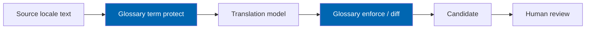
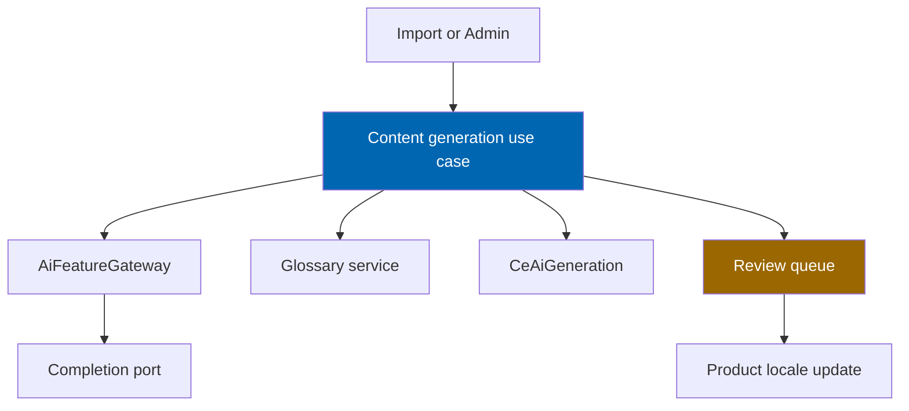

# 25 AI Content Pipeline

> Generation of product descriptions, specifications, bilingual translations, and SEO metadata as
> reviewable candidates — with glossary enforcement, quality scoring, and mandatory human approval.

**Status:** Review · **Owner:** AI Architect · **Last revised:** 2026-07-28

**Engineering status (2026-08-25):** Plugin `0.104.0` is in tree. Progress, evidence gates (G1–G6 done; G11 packing partial), and remaining blockers (H1.35/G8, G7, G11 vendor signing, G12) are recorded in [EXECUTION-PLAN.md](../EXECUTION-PLAN.md). This document remains the specification baseline.

---

## Contents

- [Executive Summary](#executive-summary)
- [Objectives](#objectives)
- [Scope](#scope)
- [Detailed Specifications](#detailed-specifications)
  - [Candidate model](#candidate-model)
  - [Description generation](#description-generation)
  - [Specification extraction](#specification-extraction)
  - [Translation and glossary](#translation-and-glossary)
  - [SEO metadata](#seo-metadata)
  - [Quality scoring](#quality-scoring)
  - [Review workflow](#review-workflow)
  - [Import integration](#import-integration)
  - [Batch and on-demand triggers](#batch-and-on-demand-triggers)
- [Architecture](#architecture)
- [User Stories](#user-stories)
- [Acceptance Criteria](#acceptance-criteria)
- [Future Enhancements](#future-enhancements)
- [References](#references)

---

## Executive Summary

The AI content pipeline turns sparse supplier rows into **bilingual, sellable copy** — without ever
writing straight to the live storefront. Every artefact is a **candidate** in `CeAiGeneration` until a
reviewer publishes it (`FR-531`, `ADR-008`).

Takeaways:

1. **Descriptions, specs, translations, SEO** are separate features with separate toggles (`FR-520`–`FR-523`).
2. **Controlled automotive glossary** constrains translation (`FR-522`, `BR-030`).
3. **Quality scores** help prioritise the review queue; they do not auto-publish.
4. **Import stages 7–9** call this pipeline when enabled ([24](24-product-import-pipeline.md)).
5. Platform concerns (providers, cost, cache) live in [17](17-ai-architecture.md).

Horizon 2 delivery. Horizon 1 may store manual bilingual content without this pipeline.

---

## Objectives

| # | Objective | Traces to | Measure |
|---|---|---|---|
| 1 | Specify candidate lifecycle for each content type | `FR-520`–`FR-523` | State tests |
| 2 | Enforce glossary on translation | `FR-522` | Glossary hit-rate tests |
| 3 | Bind review as the only publish path | `FR-531` | AC-FR.3 |
| 4 | Integrate with import without blocking deterministic stages | `FR-620`–`FR-622` | Skip when AI off |
| 5 | Keep prompts versioned | `FR-563` | Prompt store usage |

---

## Scope

### In scope

- Generation behaviours, glossary, quality scoring, review UI contracts, import hooks
- Mapping approved candidates onto nopCommerce product fields

### Out of scope

| Not covered | Where |
|---|---|
| Provider ports and ceilings | [17](17-ai-architecture.md) |
| Fitment inference | [17](17-ai-architecture.md), [15](15-fitment-engine.md) |
| Image alt-text detail | [26](26-image-management.md) `FR-662` |
| Theme rendering of descriptions | [21](21-theme-design.md) |

### Assumptions

- English and Arabic are the two required storefront languages.
- Glossary is curated by Domain Owner; missing terms fall back to human translation queue.
- HTML in descriptions is sanitised on publish per [28](28-security.md).

### Dependencies

[17](17-ai-architecture.md), [24](24-product-import-pipeline.md), [10](10-database-design.md),
Block 500 content FRs.

---

## Detailed Specifications

### Candidate model

| Field | Rule |
|---|---|
| `EntityType` | ProductDescription, Specification, Translation, SeoMetadata, … |
| `EntityId` | Product id or import row id during pre-publish |
| `OutputText` / structured JSON | Candidate payload |
| `PromptHash` / prompt version | Traceability |
| `IsPublished` | Default false |
| `QualityScore` | 0–1 optional |
| Reviewer + timestamps | Set on approve/reject |

One product may have many candidate versions; **only one published** per locale/field at a time.

### Description generation

| Topic | `FR-520` |
|---|---|
| Inputs | Title, OEM, category, attributes, optional supplier blurb |
| Output | Candidate HTML/Markdown plain per store policy |
| Constraints | No fabricated OEM/fitment/price; no trademark misuse (nominative use only) |
| Review | Required before `FullDescription` / locale fields update |

### Specification extraction

| Topic | `FR-521` |
|---|---|
| Inputs | Raw supplier text / PDF snippets |
| Output | Candidate attribute key-value pairs against allowed attribute map |
| Unknown keys | Flag for curator; do not invent nopCommerce attributes silently |
| Review | Approve subset; reject rest |

### Translation and glossary

| Rule (`FR-522`) | Detail |
|---|---|
| Glossary | Term pairs EN↔AR for parts, systems, units |
| Enforcement | Preferred terms must appear when source contained the paired term |
| Tone | Trade-friendly; no marketing fluff that implies unsafe fitment |
| Mixed | Partial glossary miss lowers quality score → review priority |

Arabic quality is a tracked risk (`RISK-14`); human review remains mandatory for publish.

### SEO metadata

| Topic | `FR-523` Should |
|---|---|
| Outputs | Slug candidate, meta title, meta description (per locale) |
| Rules | Length budgets; no keyword stuffing; vehicle names only when accurate |
| Override | Operator can edit before/after approve ([27](27-seo-strategy.md)) |
| Import | Stage SEO-generate (`FR-622`) |

### Quality scoring

| Signal | Effect |
|---|---|
| Glossary compliance | Higher |
| Length within bounds | Higher |
| Hallucination heuristics (OEM-like tokens not in input) | Hard fail → auto-reject or force review |
| Toxicity / policy filters | Quarantine |

Scores rank the queue; **never** auto-publish on high score alone.

### Review workflow

| Action | Effect |
|---|---|
| Approve | Set `IsPublished`; write to product locale fields; audit |
| Reject | Record reason; keep history |
| Edit then approve | Store edited text as new published version |
| Request regenerate | New candidate version; cost counted |

Permission: `ManageCheckEngineAi` and/or catalog permission as configured.

### Import integration

| Import stage | Content pipeline call |
|---|---|
| Enrich | Description + specs candidates (`FR-620`) |
| Translate | Bilingual candidates (`FR-621`) |
| SEO-generate | Metadata candidates (`FR-622`) |

If ceiling reached mid-batch: remaining rows skip AI with reason `AiBudgetExceeded`; deterministic
publish can still proceed with source-language content.

### Batch and on-demand triggers

| Trigger | Use |
|---|---|
| Import stage | Bulk |
| Admin product action | Single product regenerate |
| Scheduled backfill | Optional for catalogs missing AR/EN |

---

## Architecture

### Rejected alternatives

| Alternative | Rejected because |
|---|---|
| Write AI text straight to live product | `FR-531` |
| Machine translation without glossary | `RISK-14`, `FR-522` |
| Shared prompt soup for all content types | `FR-563` versioning / quality |

---

## User Stories

| ID | Persona | Story | FR | Points | Priority |
|---|---|---|---|---|---|
| `US-421` | Operator | Generate EN description candidates for an imported batch | `FR-520` | 8 | Must |
| `US-422` | Operator | Approve Arabic translations that respect the glossary | `FR-522` | 8 | Must |
| `US-423` | Operator | Reject a candidate that invents an OEM number | `FR-541` | 5 | Must |
| `US-424` | Operator | Edit SEO title then publish | `FR-523` | 3 | Should |
| `US-425` | Admin | See content review queue depth on AI dashboard | `FR-590` | 3 | Must |

---

## Acceptance Criteria

**`AC-25.1`** — Candidate default
Given a generated description, when saved, then `IsPublished = false` (`FR-520`, `FR-531`).

**`AC-25.2`** — Glossary
Given source containing a glossary term, when translated, then the preferred target term appears or quality score flags miss (`FR-522`).

**`AC-25.3`** — Publish path
Given approve action, when completed, then product locale field matches approved text and audit exists (`FR-531`).

**`AC-25.4`** — Hallucinated OEM
Given output containing an OEM-like token absent from inputs, when quality gate runs, then candidate is not auto-approvable (`FR-541`).

**`AC-25.5`** — Import skip
Given AI description toggle off, when import enrich runs, then no completion calls occur (`FR-620` + `FR-505`).

---

## Future Enhancements

| Enhancement | Horizon | Notes |
|---|---|---|
| Additional locales beyond AR/EN | 3+ | Same pipeline |
| Voice/tone profiles per brand store | 2 | Prompt variants |
| Customer-facing generative Q&A content blocks | 2 | Still reviewed |

---

## References

- [17 AI Architecture](17-ai-architecture.md)
- [24 Product Import Pipeline](24-product-import-pipeline.md)
- [27 SEO Strategy](27-seo-strategy.md)
- [26 Image Management](26-image-management.md)
- [10 Database Design](10-database-design.md) — `CeAiGeneration`
