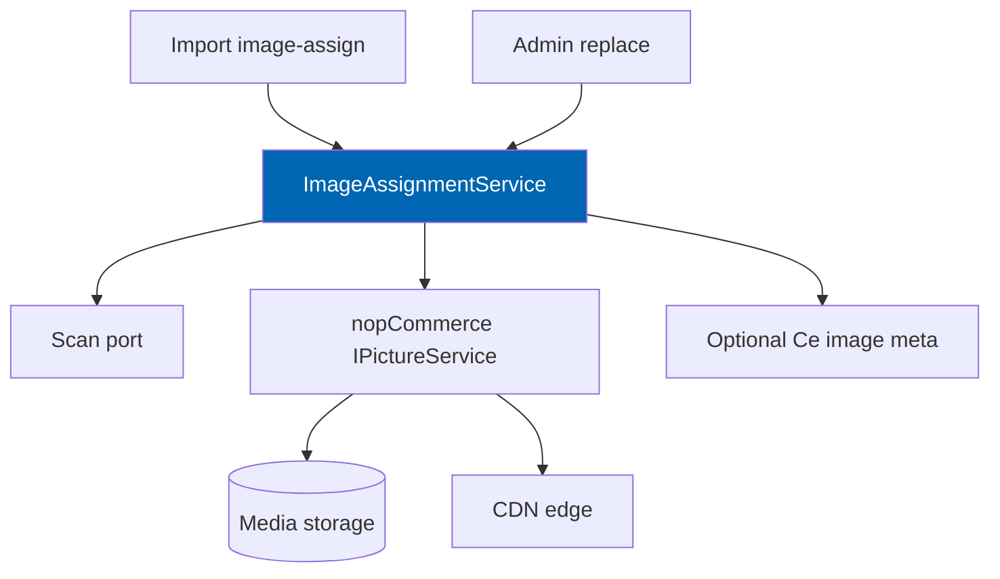

# 26 Image Management

> Product image sourcing, nopCommerce media storage, derivative sizes, CDN delivery, placeholders,
> quarantine, alt text, and professional replacement without breaking product links.

**Status:** Review · **Owner:** Platform Architect · **Last revised:** 2026-07-28

---

## Contents

- [Executive Summary](#executive-summary)
- [Objectives](#objectives)
- [Scope](#scope)
- [Detailed Specifications](#detailed-specifications)
  - [Storage and delivery](#storage-and-delivery)
  - [Derivative sizes](#derivative-sizes)
  - [Import assignment](#import-assignment)
  - [Placeholders](#placeholders)
  - [Professional replacement workflow](#professional-replacement-workflow)
  - [Alt text](#alt-text)
  - [Quarantine and security](#quarantine-and-security)
  - [Admin operations](#admin-operations)
- [Architecture](#architecture)
- [User Stories](#user-stories)
- [Acceptance Criteria](#acceptance-criteria)
- [Future Enhancements](#future-enhancements)
- [References](#references)

---

## Executive Summary

Images sell parts; broken links and unsafe uploads destroy trust. Check Engine uses **nopCommerce's
media pipeline** as the system of record for binary storage, adds automotive import assignment and
**replacement without orphaning products**, and quarantines hostile files.

Takeaways:

1. **Store via nopCommerce pictures; deliver via configurable CDN** (`FR-660`).
2. **Derivatives for listing, product, zoom** (`FR-661`).
3. **Import links supplier images or assigns placeholders** (`FR-630`).
4. **Professional replacement keeps `PictureId` associations stable** (`FR-631`).
5. **Malware/content failures quarantine** (`FR-670`).

---

## Objectives

| # | Objective | Traces to | Measure |
|---|---|---|---|
| 1 | Define storage, CDN, and derivative contract | `FR-660`, `FR-661` | Theme can rely on size names |
| 2 | Specify import image-assign behaviour | `FR-630` | Pipeline stage tests |
| 3 | Specify replacement workflow | `FR-631` | No broken product gallery |
| 4 | Enforce quarantine on failed checks | `FR-670` | Security tests |
| 5 | Optional AI alt-text candidates | `FR-662` | Review path via [25](25-ai-content-pipeline.md) |

---

## Scope

### In scope

- Assignment, placeholders, derivatives, CDN, replacement, quarantine, alt text
- Relationship to import stage Image-assign

### Out of scope

| Not covered | Where |
|---|---|
| Theme gallery UI polish | [21](21-theme-design.md) |
| Provider AI platform | [17](17-ai-architecture.md) |
| Digital asset management SaaS build | Future; not Horizon 1 |
| Video / 360 spin | Future enhancement |

### Assumptions

- Host picture services (`IPictureService` or 4.90 equivalent) remain the write API.
- CDN is operator-configured (Azure CDN, CloudFront, etc.) in front of media or via host settings.
- Max upload size follows host limits plus Check Engine stricter caps for import URLs.

### Dependencies

[24](24-product-import-pipeline.md), [09](09-plugin-architecture.md), Block 600 image FRs,
[28](28-security.md).

---

## Detailed Specifications

### Storage and delivery

| Topic | Rule (`FR-660`) |
|---|---|
| Binary store | nopCommerce media / picture pipeline |
| Metadata | Standard `Picture` + product-picture mappings |
| CDN | Configurable base URL / host CDN integration; storefront uses CDN URLs when enabled |
| No parallel blob silo | Check Engine does not invent a second media DB for product images |

Optional `CeProductImageMeta` may store import source URL, replacement state, quarantine flag if host
tables are insufficient — prefer extending via mapping table rather than duplicating binaries.

### Derivative sizes

| Size (`FR-661`) | Typical use |
|---|---|
| Listing / thumb | Category and search cards |
| Product / detail | Product page main |
| Zoom / large | Lightbox zoom |

Exact pixel dimensions follow theme design tokens ([22](22-ui-design-system.md)); this document requires
**three classes** to exist and be regenerable on replace.

Generation: on upload/assign/replace; async acceptable if placeholder shown until ready.

### Import assignment

| Case (`FR-630`) | Behaviour |
|---|---|
| Supplier provides image URL | Download (ssrf-safe allowlist/blocked private IPs), scan, create picture, map to product |
| Supplier provides embedded file | Extract from Excel/PDF when supported; else skip with reason |
| Missing | Assign configured **placeholder** picture id |
| Failure | Row warning; product may still publish with placeholder |

SSRF controls: block link-local, private ranges, metadata endpoints ([28](28-security.md)).

### Placeholders

| Rule | Detail |
|---|---|
| Default | Category-generic or global “no image” asset shipped with theme/plugin |
| Per-category | Optional override in settings |
| Distinguishable | Must not look like a real part photo (avoids fake confidence) |

### Professional replacement workflow

| Rule (`FR-631`) | Detail |
|---|---|
| Goal | Replace imagery without breaking product links or SEO image URLs where possible |
| Strategy | Prefer in-place binary replace + derivative regen; if new Picture entity required, remaps all product associations atomically |
| History | Optional retain previous binary for audit (setting); default keep last N |
| Bulk | Admin can queue replacements by SKU list |

### Alt text

| Rule (`FR-662` Should) | Detail |
|---|---|
| Locales | EN and AR fields |
| Manual | Always editable |
| AI candidate | Via content pipeline; review before publish ([25](25-ai-content-pipeline.md)) |
| Default | Product name + category fallback if empty |

### Quarantine and security

| Rule (`FR-670`) | Detail |
|---|---|
| Checks | Malware scan adapter; basic content-type sniff; optional AV |
| Fail | Quarantine store; not linked to storefront; admin alert |
| Release | Only after explicit admin clear |
| Formats | Allowlist jpeg/png/webp (gif optional); reject executable disguises |

### Admin operations

| Operation | Permission |
|---|---|
| Assign / replace / clear quarantine | `ManageCheckEngineCatalog` |
| Configure CDN / placeholders | `ManageCheckEngine` |
| Bulk regenerate derivatives | `ManageCheckEngineCatalog` |

---

## Architecture

### Rejected alternatives

| Alternative | Rejected because |
|---|---|
| Hotlinking supplier URLs forever | Broken images; mixed content; SSRF/tracking |
| Separate Check Engine-only blob store for products | Diverges from host media and Marketplace norms |
| Silent serve of unscanned uploads | `FR-670` |

---

## User Stories

| ID | Persona | Story | FR | Points | Priority |
|---|---|---|---|---|---|
| `US-431` | Operator | Import products and get placeholders when images missing | `FR-630` | 5 | Must |
| `US-432` | Operator | Replace a low-quality supplier photo with a studio shot | `FR-631` | 5 | Should |
| `US-433` | Customer | See sharp listing and zoom images on product page | `FR-661` | 5 | Must |
| `US-434` | Admin | Quarantined malware upload never appears on storefront | `FR-670` | 8 | Must |
| `US-435` | Operator | Set Arabic alt text on a product image | `FR-662` | 3 | Should |

---

## Acceptance Criteria

**`AC-26.1`** — Placeholder
Given an import row with no image, when image-assign completes, then the product has the configured placeholder picture (`FR-630`).

**`AC-26.2`** — Derivatives
Given a new upload, when processing completes, then listing, product, and zoom derivatives exist (`FR-661`).

**`AC-26.3`** — Replacement
Given a product with gallery images, when professional replace runs, then product still references valid pictures and storefront returns HTTP 200 for image URLs (`FR-631`).

**`AC-26.4`** — Quarantine
Given a file failing malware check, when upload completes, then it is not mapped to any product and is marked quarantined (`FR-670`).

**`AC-26.5`** — CDN
Given CDN base configured, when storefront requests listing image, then URL uses CDN host (`FR-660`).

**`AC-26.6`** — SSRF
Given an import image URL targeting a private IP, when download attempted, then it is rejected (`FR-670` / security).

---

## Future Enhancements

| Enhancement | Horizon | Notes |
|---|---|---|
| Licensed OEM-pack image feeds | 2 | Connector pattern |
| 360° / video | 3 | |
| Automatic background removal assist | 2 | Still reviewed |

---

## References

- [24 Product Import Pipeline](24-product-import-pipeline.md)
- [25 AI Content Pipeline](25-ai-content-pipeline.md)
- [21 Theme Design](21-theme-design.md)
- [22 UI Design System](22-ui-design-system.md)
- [28 Security](28-security.md)
- [09 Plugin Architecture](09-plugin-architecture.md)
