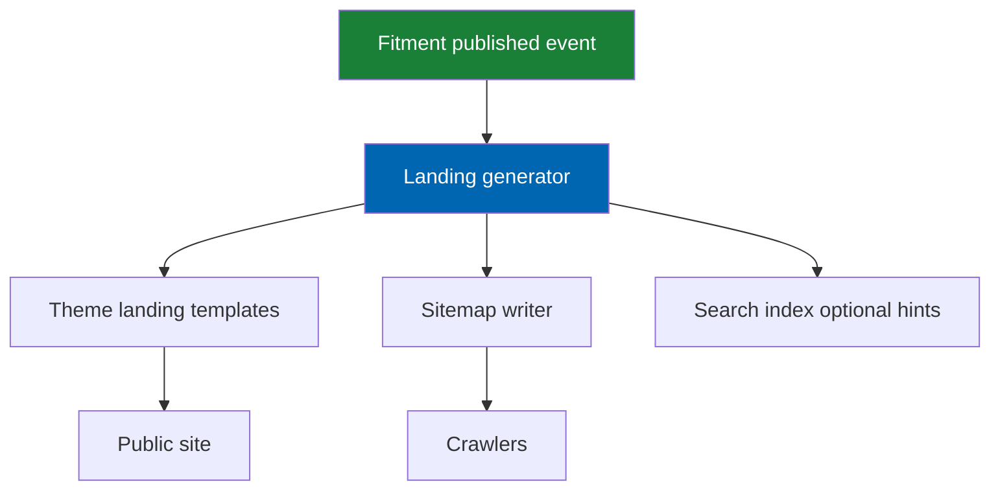

# 27 SEO Strategy

> Vehicle and part landing pages, URL architecture, hreflang, structured data, sitemaps, canonical
> discipline, thin-page handling, and Core Web Vitals as ranking inputs for Check Engine.

**Status:** Review · **Owner:** Growth / Product Owner · **Last revised:** 2026-07-28

---

## Contents

- [Executive Summary](#executive-summary)
- [Objectives](#objectives)
- [Scope](#scope)
- [Detailed Specifications](#detailed-specifications)
  - [SEO principles](#seo-principles)
  - [URL architecture](#url-architecture)
  - [Landing page types](#landing-page-types)
  - [Generation and incremental updates](#generation-and-incremental-updates)
  - [Internationalisation hreflang](#internationalisation-hreflang)
  - [Structured data](#structured-data)
  - [Metadata and AI candidates](#metadata-and-ai-candidates)
  - [Sitemaps and robots](#sitemaps-and-robots)
  - [Canonical and duplicate control](#canonical-and-duplicate-control)
  - [Thin and empty pages](#thin-and-empty-pages)
  - [Core Web Vitals](#core-web-vitals)
  - [Category and search URL behaviour](#category-and-search-url-behaviour)
  - [Measurement](#measurement)
- [Architecture](#architecture)
- [User Stories](#user-stories)
- [Acceptance Criteria](#acceptance-criteria)
- [Future Enhancements](#future-enhancements)
- [References](#references)

---

## Executive Summary

Check Engine’s SEO advantage is the **fitment graph**: pages can exist for vehicles and for
part-and-vehicle intersections that generic catalogs cannot honestly generate. SEO must never outrun
fitment truth — thin or empty landings are `noindex`, and claims on pages match published fitment
only (`FR-430`–`FR-440`).

Takeaways:

1. **Stable, localised URLs** with hreflang for AR/EN (`FR-433`).
2. **Incremental generation** — no full site rebuild required (`FR-434`).
3. **Structured data** for Product, BreadcrumbList, and automotive-relevant types where valid (`FR-432`).
4. **CWV budgets are SEO requirements** (`FR-438`, `NFR-054`).
5. **AI metadata is reviewable**, not auto-live (`FR-439`, [25](25-ai-content-pipeline.md)).

---

## Objectives

| # | Objective | Traces to | Measure |
|---|---|---|---|
| 1 | Specify URL and landing templates | `FR-430`–`FR-433` | Route tests |
| 2 | Define incremental generation + sitemap | `FR-434`, `FR-435` | Ops runbook |
| 3 | Enforce canonical / noindex rules | `FR-437`, `FR-440` | Crawler fixtures |
| 4 | Bind CWV to landing release | `FR-438` | Lighthouse CI |
| 5 | Keep manufacturer nominative-use safe | `FR-901` | Disclaimer present |

---

## Scope

### In scope

- Storefront SEO for Check Engine-generated and theme-rendered pages
- Metadata, structured data, sitemaps, hreflang, thin-page policy

### Out of scope

| Not covered | Where |
|---|---|
| Off-site content marketing | Commercial ops |
| Paid search | [44](44-commercial-strategy.md) |
| Theme visual layout | [21](21-theme-design.md) |
| AI generation internals | [25](25-ai-content-pipeline.md) |

### Assumptions

- Public site has distinct AR and EN URL strategies (path or subdomain — choose path prefix below).
- Search Console / Bing equivalents are operator-owned.
- Indexing only published, sellable fitment relationships.

### Dependencies

[16](16-search-engine.md), [15](15-fitment-engine.md), [12](12-vehicle-database.md), [21](21-theme-design.md),
[25](25-ai-content-pipeline.md), `FR-430`–`FR-445`.

---

## Detailed Specifications

### SEO principles

| Principle | Consequence |
|---|---|
| Truth before traffic | No landing without published Fits (or explicit operator override for non-index draft) |
| Stability | URLs do not change when titles change; slugs change only with redirect |
| Localisation | AR and EN are peers (`FR-433`) |
| Performance is ranking | CWV gated (`FR-438`) |
| Nominative use | Disclaimers where manufacturer marks appear (`FR-901`) |

### URL architecture

Normative path strategy (host may adjust prefix via settings):

| Page type | Pattern (EN) | Pattern (AR) |
|---|---|---|
| Vehicle landing | `/vehicles/{make}/{model}/{generation}/{configSlug}` | `/ar/vehicles/...` |
| Part × vehicle | `/parts/{productSlug}/for/{configSlug}` | `/ar/parts/...` |
| Category | Host category URLs | Host + locale |
| Product | Host product SEName | Host locale rules |
| Search | `/search?q=` shareable (`FR-442` Should) | Same |

Slugs: ASCII where possible for EN; AR slugs allowed when host supports; always unique.

Redirect map table for slug changes.

### Landing page types

| Type | FR | Index when |
|---|---|---|
| Vehicle landing | `FR-430` | Configuration has ≥ 1 sellable published Fits product |
| Part × vehicle | `FR-431` | Published Fits for that pair |
| Operator exclusion | `FR-436` Should | Node/product flagged excluded |

Content blocks: H1, short intro, fitment-constrained product list, breadcrumbs, disclaimer.

### Generation and incremental updates

| Rule | FR |
|---|---|
| Incremental | `FR-434` — on fitment publish/unpublish, product publish, configuration activation |
| Full rebuild | Admin optional; not required for routine ops |
| Job | Schedule task + on-demand |

### Internationalisation hreflang

| Rule (`FR-433`) | Detail |
|---|---|
| Alternates | Each EN landing links `hreflang="en"` / `hreflang="ar"` / `x-default` |
| Consistency | Reciprocal annotations |
| Locale switch | Preserves vehicle context (`FR-933`) without duplicate-index traps |

### Structured data

| Type (`FR-432`) | Where |
|---|---|
| `Product` | PDP and part×vehicle when product-centric |
| `BreadcrumbList` | All landings + PDP |
| `ItemList` | Vehicle landing product lists when appropriate |
| Automotive | Only types valid in Google’s current documentation — do not invent fake `Vehicle` markup that implies we are the OEM |

JSON-LD in page; validate in CI sampling.

### Metadata and AI candidates

| Topic | Rule |
|---|---|
| Title / description | Unique per landing; vehicle + part intent |
| Override | Operator editable (`FR-439`) |
| AI generate | Candidates under review ([25](25-ai-content-pipeline.md)); Horizon 2 |
| Synonyms | Automotive synonym lists aid copy and search (`FR-443`) — not doorway spam |

### Sitemaps and robots

| Rule (`FR-435`) | Detail |
|---|---|
| Include | Indexable vehicle + intersection pages + products/categories per host |
| Size | Split via sitemap index when over limits |
| Refresh | Incremental on generation |
| robots.txt | Allow landings; disallow internal facets that duplicate (operator configurable) |

### Canonical and duplicate control

| Rule (`FR-437`) | Detail |
|---|---|
| Canonical | Self-canonical on landings |
| Parameter URLs | Sort/filter params canonical to clean landing or category |
| Trailing slash | Host-consistent |

### Thin and empty pages

| Rule (`FR-440`) | Detail |
|---|---|
| No sellable Fits | `noindex, follow` or do not generate |
| After last product unpublished | Regenerate to noindex / remove from sitemap |
| Doorway risk | Do not mass-generate near-duplicate intersections with identical thin copy |

### Core Web Vitals

| Budget | Source |
|---|---|
| LCP ≤ 2.5 s, INP ≤ 200 ms, CLS ≤ 0.1 mobile | `NFR-054`, `FR-438` |
| Landing images | Prioritise LCP image; sized derivatives ([26](26-image-management.md)) |
| No heavy hero carousels | One dominant visual ([21](21-theme-design.md)) |

### Category and search URL behaviour

| Topic | FR |
|---|---|
| Category + vehicle | Update title/H1 (`FR-441`); prefer not to create infinite faceted indexables |
| Shareable search URLs | Restore context (`FR-442` Should) |
| Admin preview | Test queries (`FR-445` Should) |

### Measurement

| Metric | Use |
|---|---|
| Indexed landing count | Ops dashboard |
| Crawl errors | Operator Search Console |
| Organic landings CTR | Analytics ([30](30-analytics.md)) |
| CWV RUM | Release gate |

---

## Architecture

### Rejected alternatives

| Alternative | Rejected because |
|---|---|
| Generate all make/model/year combinations blindly | Thin/doorway risk; unfitment lies |
| One language only indexed | Violates `FR-433` |
| Ignoring CWV | Violates `FR-438` |

---

## User Stories

| ID | Persona | Story | FR | Points | Priority |
|---|---|---|---|---|---|
| `US-631` | Operator | Publish fitment and see a vehicle landing appear without full rebuild | `FR-434` | 8 | Must |
| `US-632` | Customer | Open AR and EN versions of a vehicle page via hreflang-consistent URLs | `FR-433` | 5 | Must |
| `US-633` | Operator | Exclude a configuration from landing generation | `FR-436` | 3 | Should |
| `US-634` | SEO manager | Download sitemap index including vehicle landings | `FR-435` | 5 | Must |
| `US-635` | Operator | Confirm empty landings are noindex | `FR-440` | 5 | Must |

---

## Acceptance Criteria

**`AC-27.1`** — Generation gate
Given a configuration with zero published Fits, when generation runs, then no indexable vehicle landing is emitted (`FR-430`, `FR-440`).

**`AC-27.2`** — Incremental
Given a new published Fits claim, when the generator task runs, then the related landing appears or updates without requiring full rebuild (`FR-434`).

**`AC-27.3`** — hreflang
Given an EN vehicle landing, when HTML is inspected, then reciprocal `hreflang` entries for `ar` and `en` exist (`FR-433`).

**`AC-27.4`** — Structured data
Given a PDP, when JSON-LD is validated, then Product and BreadcrumbList parse without errors (`FR-432`).

**`AC-27.5`** — CWV
Given a vehicle landing on mobile profile, when Lighthouse CI runs, then budgets meet `NFR-054` / `FR-438`.

**`AC-27.6`** — Canonical
Given a filtered parameter URL for a landing, when inspected, then canonical points to the clean landing URL (`FR-437`).

---

## Future Enhancements

| Enhancement | Horizon | Notes |
|---|---|---|
| Image sitemap | 2 | |
| FAQ schema from reviewed content | 2 | |
| Vendor-specific landing namespaces | 3 | Marketplace |

---

## References

- [16 Search Engine](16-search-engine.md)
- [15 Fitment Engine](15-fitment-engine.md)
- [21 Theme Design](21-theme-design.md)
- [25 AI Content Pipeline](25-ai-content-pipeline.md)
- [26 Image Management](26-image-management.md)
- [03 Non-Functional Requirements](03-non-functional-requirements.md)
- Google Search Central documentation — structured data and sitemaps (operator follows current rules)
