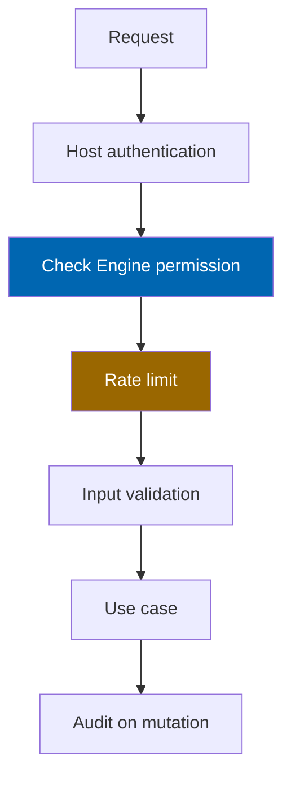

# 28 Security

> Authentication, authorisation, permissions, audit, OWASP Top Ten controls, rate limiting, secrets,
> data protection, upload hardening, and vulnerability disclosure for Check Engine.

**Status:** Review · **Owner:** Security Reviewer · **Last revised:** 2026-08-25

**Engineering status (2026-08-25):** Plugin `0.104.0` is in tree. Progress, evidence gates (G1–G6 done; G11 packing partial), and remaining blockers (H1.35/G8, G7, G11 vendor signing, G12) are recorded in [EXECUTION-PLAN.md](../EXECUTION-PLAN.md). This document remains the specification baseline.

---

## Contents

- [Executive Summary](#executive-summary)
- [Objectives](#objectives)
- [Scope](#scope)
- [Detailed Specifications](#detailed-specifications)
  - [Security principles](#security-principles)
  - [Authentication](#authentication)
  - [Authorisation and permissions](#authorisation-and-permissions)
  - [OWASP Top Ten mapping](#owasp-top-ten-mapping)
  - [Input validation and uploads](#input-validation-and-uploads)
  - [Secrets management](#secrets-management)
  - [Encryption](#encryption)
  - [Rate limiting](#rate-limiting)
  - [Audit logging](#audit-logging)
  - [Personal data and privacy](#personal-data-and-privacy)
  - [AI and licensing channels](#ai-and-licensing-channels)
  - [Marketplace isolation](#marketplace-isolation)
  - [Dependency and supply chain](#dependency-and-supply-chain)
  - [Vulnerability disclosure](#vulnerability-disclosure)
- [Architecture](#architecture)
- [User Stories](#user-stories)
- [Acceptance Criteria](#acceptance-criteria)
- [Future Enhancements](#future-enhancements)
- [References](#references)

---

## Executive Summary

Check Engine inherits nopCommerce authentication and adds **server-side permission gates**, **audited
mutations**, **rate limits** on VIN/search, and **fail-closed** behaviour for fitment and AI. Security
NFRs `NFR-033`–`NFR-045` are the acceptance bar; this document specifies the controls.

Takeaways:

1. **No custom credential store** (`NFR-034`) — use host auth.
2. **Every mutating admin/API path checks permissions** (`NFR-035`, `FR-990`).
3. **No secrets in repo**; CI secret scan clean (`NFR-037`).
4. **Raw VIN/PII absent from default logs** (`NFR-044`).
5. **Licence channel never carries catalog/customer/order data** (`FR-983`).
6. **Independent assessment is a human gate.** Engineering controls (T5.1, H1.34, `AC-080`) can be
   green while H1.35 / G8 / `AC-080.1` stays open until an independent reviewer signs off. Coding
   agents cannot close that gate. Record the sign-off in
   [07 Acceptance Go/No-Go](implementation/07-acceptance-go-no-go.md).

---

## Objectives

| # | Objective | Traces to | Measure |
|---|---|---|---|
| 1 | Map OWASP Top Ten to concrete controls | `NFR-033` | Checklist signed each release |
| 2 | Specify authz matrix for Check Engine permissions | `FR-990`, `NFR-035` | Automated authz tests |
| 3 | Define rate limits and audit integrity | `NFR-040`, `NFR-041`, `FR-970` | Abuse + audit tests |
| 4 | Protect VIN and garage PII | `NFR-039`, `NFR-044`, `FR-716` | Config + log review |
| 5 | Document disclosure SLA | `NFR-045` | CONTRIBUTING process |

---

## Scope

### In scope

- Storefront and admin Check Engine surfaces, APIs, imports, AI, ERP credentials, licence validation

### Out of scope

| Not covered | Where |
|---|---|
| Hardening the entire nopCommerce host | Operator responsibility; guidance only |
| Physical / cloud account security | Operator |
| Payment PCI detail | Paymob sibling plugin |

### Assumptions

- TLS terminates at reverse proxy or host (`NFR-038`).
- Operators apply nopCommerce security updates promptly.

### Dependencies

[09](09-plugin-architecture.md), [17](17-ai-architecture.md), [20](20-customer-garage.md),
[CONTRIBUTING.md](../CONTRIBUTING.md), [03](03-non-functional-requirements.md).

---

## Detailed Specifications

### Security principles

| Principle | Practice |
|---|---|
| Least privilege | Fine-grained Check Engine permissions |
| Defence in depth | Authz + validation + rate limit + audit |
| Fail closed | Fitment errors → Unknown; AI unpublished |
| Minimise data | Logs, AI prompts, licence channel |
| Secure by default | AI off; disclaimers on; conservative publish |

### Authentication

| Rule (`NFR-034`) | Detail |
|---|---|
| Customers / admins | nopCommerce authentication only |
| Garage APIs | Authenticated for account scope (`FR-718`) |
| Guest garage | Client-side only until migrate — not an auth bypass |
| Service accounts | Not used for Horizon 1 public API (none published) |

### Authorisation and permissions

| Permission | Gates |
|---|---|
| `ManageCheckEngine` | Settings, licence UI |
| `ManageCheckEngineCatalog` | Vehicle/OEM/import |
| `ManageCheckEngineFitment` | Claim review/publish |
| `ManageCheckEngineAi` | AI toggles and content review |
| `ManageCheckEngineErp` | ERP connection and conflicts |

| Rule (`NFR-035`) | Detail |
|---|---|
| Enforcement | Server-side on MVC/AJAX/API — never UI-only |
| Tests | Negative tests: forbidden role → 403 |
| Multi-store | Per-store enablement respected (`FR-994`) |

### OWASP Top Ten mapping

| Risk (illustrative OWASP categories) | Check Engine control |
|---|---|
| Broken access control | Permission attributes + vendor isolation tests (`NFR-043`) |
| Cryptographic failures | TLS; VIN encryption at rest when configured (`NFR-038`, `NFR-039`) |
| Injection | Parameterised data access; validated uploads (`NFR-036`) |
| Insecure design | Fitment/AI review gates; threat review on new features |
| Security misconfiguration | Secure defaults; no debug in production packages |
| Vulnerable components | CI vulnerable package gate (`NFR-042`) |
| Auth failures | Host lockout/rate limits; Check Engine rate limits on decode/search |
| Software/data integrity | Signed releases ([33](33-ci-cd.md)); audit append-only |
| Logging/monitoring failures | Structured logs + audit (`FR-970`); redaction (`NFR-044`) |
| SSRF | Import image URL allowlist/private IP block ([26](26-image-management.md)) |

### Input validation and uploads

| Surface | Control (`NFR-036`) |
|---|---|
| VIN / OEM / search | Length, charset, normalisation before engine |
| PDF/Excel/CSV import | Type sniff, size cap, malware scan hook, sandboxed parse |
| Image URLs | SSRF protections |
| Admin JSON settings | Schema validation via Options |

### Secrets management

| Rule (`NFR-037`) | Detail |
|---|---|
| Storage | Host secret store / environment / Azure Key Vault patterns |
| Forbidden | Secrets in `plugin.json`, source, docs samples with real keys |
| CI | gitleaks (or equivalent) must pass |
| Rotation | Documented for AI, ERP, licence keys |

### Encryption

| Data | Control |
|---|---|
| In transit | TLS 1.2+ (`NFR-038`) |
| VIN at rest | Platform data protection when configured (`NFR-039`, `FR-716`) |
| AI/ERP credentials | Encrypted secret storage |

### Rate limiting

| Endpoint class | Default policy (`NFR-040`) |
|---|---|
| Public VIN decode (`FR-215`) | Per IP + per customer; e.g. 30/min IP, 60/min authenticated (configurable) |
| Search / suggest / recommend (`FR-450`, `NFR-017`) | Per shopper (`search:customer:{id}`), not per NAT IP. Load tests must send a browser User-Agent |
| Login | Host policy |
| Admin import | Permission + concurrent batch limits |

Exceeded limits → 429 with Retry-After; logged without raw VIN.

### Audit logging

| Event (`FR-970`, `NFR-041`) | Required fields |
|---|---|
| Fitment approve/reject | Actor, claim id, before/after |
| Vehicle merge/archive | Actor, ids |
| Import publish | Actor, batch id |
| Licence settings | Actor, action (no secrets) |
| AI enable | Actor, feature, disclosure ack |
| Garage support view | Actor, customer id (`FR-715`) |

Storage: `CeAuditEntry` append-only from app perspective; retention per policy (`FR-971`).

### Personal data and privacy

| Topic | Rule |
|---|---|
| Export / erase | Garage included (`FR-960`, `FR-961`, `FR-710`) |
| Logs | No raw VIN/PII by default (`NFR-044`) |
| Diagnostics | Redact secrets/PII (`FR-992`) |
| AI consent | When personal data sent (`FR-962` H2) |
| Analytics | No raw VIN (`FR-413`) |

### AI and licensing channels

| Channel | Rule |
|---|---|
| AI | Disclosure before enable (`FR-502`); minimise VIN in prompts ([17](17-ai-architecture.md)) |
| Licence | Heartbeat only; **no** catalog/customer/order payload (`FR-983`) |
| Licence expiry | Storefront stays up (`FR-981`, `ADR-009`) |

### Marketplace isolation

Horizon 3 (`NFR-043`, `FR-857`): automated tests prove cross-vendor read/write denied.

### Dependency and supply chain

| Control (`NFR-042`) | Detail |
|---|---|
| CI | `dotnet list package --vulnerable` (or GH advisory) fails on critical/high without waiver |
| Lock files | Committed |
| Release | SBOM optional Horizon 2; checksums on packages ([33](33-ci-cd.md)) |

### Vulnerability disclosure

Follow [CONTRIBUTING.md](../CONTRIBUTING.md#reporting-security-vulnerabilities) (`NFR-045`): private
report, no public issue/PR until coordinated disclosure window closes.

---

## Architecture

### Rejected alternatives

| Alternative | Rejected because |
|---|---|
| Custom JWT auth parallel to nopCommerce | `NFR-034` |
| Client-only permission hiding | Broken access control |
| Logging full VIN for “support convenience” | `NFR-044` |

---

## User Stories

| ID | Persona | Story | Points | Priority |
|---|---|---|---|---|
| `US-701` | Security reviewer | Verify OWASP checklist before release | 5 | Must |
| `US-702` | Admin | Enable AI only after disclosure acknowledgement | 3 | Must |
| `US-703` | Attacker persona | Cannot decode VIN unbounded from one IP | 5 | Must |
| `US-704` | Customer | Export and erase garage data | 5 | Must |
| `US-705` | Vendor H3 | Cannot read another vendor’s orders | 8 | Must |

---

## Acceptance Criteria

**`AC-28.1`** — Authz negative
Given a role without `ManageCheckEngineFitment`, when publish claim API is called, then 403 (`NFR-035`).

**`AC-28.2`** — Rate limit VIN
Given > configured decode rate from one IP, when next request arrives, then 429 (`FR-215`).

**`AC-28.3`** — Secret scan
Given CI on a PR with a hardcoded API key pattern, when secret scan runs, then the build fails (`NFR-037`).

**`AC-28.4`** — Log redaction
Given default config, when VIN decode is logged, then the full VIN is absent (`NFR-044`).

**`AC-28.5`** — Licence channel
Given licence heartbeat traffic, when payload is inspected, then no product/customer/order entities are present (`FR-983`).

**`AC-28.6`** — Upload SSRF
Given import image URL to link-local IP, when fetch is attempted, then it is blocked (`NFR-036`).

**`AC-28.7`** — Independent assessment
Given Horizon 1 release sign-off, when `AC-080.1` / H1.35 / G8 is considered, then an independent
security assessment with no open high/critical findings is recorded. Engineering controls in this
document are necessary but not sufficient.

---

## Future Enhancements

| Enhancement | Horizon | Notes |
|---|---|---|
| WAF rule packs | Ops | Operator |
| Public API OAuth | 5 | [08](08-system-architecture.md) |
| Continuous ASPM | 2 | |

---

## References

- [03 Non-Functional Requirements](03-non-functional-requirements.md) — `NFR-033`–`NFR-045`
- [09 Plugin Architecture](09-plugin-architecture.md)
- [17 AI Architecture](17-ai-architecture.md)
- [20 Customer Garage](20-customer-garage.md)
- [26 Image Management](26-image-management.md)
- [31 Logging](31-logging.md)
- [33 CI-CD](33-ci-cd.md)
- [CONTRIBUTING.md](../CONTRIBUTING.md)
- OWASP Top Ten
