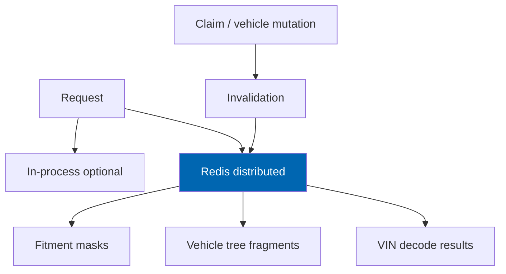

# 29 Performance

> Performance budgets, reference dataset, caching, query optimisation, Core Web Vitals, and load
> testing methodology for Check Engine on nopCommerce 4.90.

**Status:** Review · **Owner:** Architecture Owner · **Last revised:** 2026-08-24

---

## Contents

- [Executive Summary](#executive-summary)
- [Objectives](#objectives)
- [Scope](#scope)
- [Detailed Specifications](#detailed-specifications)
  - [Reference environment and dataset](#reference-environment-and-dataset)
  - [Budget catalogue](#budget-catalogue)
  - [Caching architecture](#caching-architecture)
  - [Query and data access](#query-and-data-access)
  - [Search and index](#search-and-index)
  - [Import and background jobs](#import-and-background-jobs)
  - [Core Web Vitals](#core-web-vitals)
  - [Scalability](#scalability)
  - [Load and soak testing](#load-and-soak-testing)
  - [Profiling gates](#profiling-gates)
- [Architecture](#architecture)
- [User Stories](#user-stories)
- [Acceptance Criteria](#acceptance-criteria)
- [Future Enhancements](#future-enhancements)
- [References](#references)

---

## Executive Summary

Performance is specified as **measurable budgets against a reference dataset** ([03](03-non-functional-requirements.md)).
This document turns those NFRs into engineering practice: what to cache, what to profile, and how to
fail a release when budgets regress.

Takeaways:

1. **Search p95 ≤ 300 ms** server-side; fitment ≤ 20 ms cached (`NFR-001`, `NFR-003`).
2. **Distributed cache required for web farms** (fitment/vehicle trees).
3. **Zero N+1** on top storefront routes (`NFR-014`).
4. **CWV** LCP/INP/CLS gated on key templates (`NFR-054`).
5. **Index is a projection** — correctness over stale fitment masks (`ADR-014`).

---

## Objectives

| # | Objective | Traces to | Measure |
|---|---|---|---|
| 1 | Operationalise all Must performance NFRs | `NFR-001`–`NFR-015` | CI/load gates |
| 2 | Specify cache keys and invalidation | `FR-114`, `FR-323` | Correctness + latency tests |
| 3 | Define load-test scenarios | `NFR-016`, `NFR-017` | Runbook |
| 4 | Bind frontend CWV to theme | `NFR-054`, `FR-438` | Lighthouse CI |
| 5 | Document scale headroom | `NFR-018`, `NFR-019` | Capacity note |

---

## Scope

### In scope

- Budgets, caching, SQL/index guidance, load methodology, CWV for Check Engine surfaces

### Out of scope

| Not covered | Where |
|---|---|
| Full host tuning guide | Operator DBA |
| CDN vendor config detail | Operator |

### Assumptions

- Reference hardware class matches [03](03-non-functional-requirements.md).
- Redis available for multi-node.

### Dependencies

[03](03-non-functional-requirements.md), [08](08-system-architecture.md), [10](10-database-design.md),
[16](16-search-engine.md), [15](15-fitment-engine.md), [21](21-theme-design.md).

---

## Detailed Specifications

### Reference environment and dataset

Use the baseline in [03](03-non-functional-requirements.md): ~250k parts, BMW-scale vehicle data,
published fitment claims, mid-range mobile / Slow 4G for CWV.

All Must budgets cite this baseline unless stated otherwise.

### Budget catalogue

| ID | Budget | Gate |
|---|---|---|
| `NFR-001` | Search first page p95 ≤ 300 ms | Load test |
| `NFR-002` | Search LCP ≤ 1.5 s mobile | Lighthouse |
| `NFR-003` | Fitment 1×1 ≤ 20 ms cached / 50 ms uncached | Microbench |
| `NFR-004` | Fitment 1×100 ≤ 100 ms cached | Bench |
| `NFR-005` | VIN local ≤ 40 ms | Bench |
| `NFR-006` | OEM lookup ≤ 15 ms | Bench |
| `NFR-007` | Hierarchy child ≤ 25 ms cached | Bench |
| `NFR-008` | PDP TTFB ≤ 200 ms with fitment | Load |
| `NFR-009` | Import ≥ 50 rows/s structured | Pipeline bench |
| `NFR-014` | No N+1 top 20 routes | Profiler gate |
| `NFR-054` | LCP ≤ 2.5 s, INP ≤ 200 ms, CLS ≤ 0.1 | RUM + CI |

Should/Could NFRs tracked but not release-blocking unless promoted.

### Caching architecture

| Cache | Key shape | TTL | Invalidate on |
|---|---|---|---|
| Fitment product×config | `ce:fit:{productId}:{configId}:{ctxHash}` | Short (e.g. 5–15 min) | Claim mutation |
| Vehicle tree | `ce:tree:{parentType}:{parentId}` | Medium | Node mutation |
| VIN decode | `ce:vin:{normalised}` | Configurable (default 24 h) | Pattern table change |
| Search | Provider-side | — | Product/fitment events |

**Farm rule:** sticky sessions not required for Check Engine caches (`NFR-020`).

### Query and data access

| Rule | Detail |
|---|---|
| Indexes | Hot paths in [10](10-database-design.md) mandatory |
| Batch fitment | Prefer set-based evaluate for search pages (`NFR-004`) |
| No N+1 | Include/join or prefetched ids (`NFR-014`) |
| LOH | Avoid large allocations on hot fitment path (`NFR-015` Should) |

### Search and index

| Topic | Budget / rule |
|---|---|
| Full rebuild | ≤ 4 h reference (`NFR-021` Should) |
| Incremental lag | ≤ 60 s (`NFR-022` Should) |
| Fallback | SQL path when index down (`NFR-027`) — may miss latency budget; availability wins |

### Import and background jobs

| Topic | Rule |
|---|---|
| Throughput | `NFR-009` |
| Parallel batches | ≥ 2 without corruption (`NFR-023`) |
| ERP stock batch | `NFR-011` Should |

### Core Web Vitals

| Practice | Detail |
|---|---|
| LCP | Prioritise hero/listing image; sized derivatives |
| CLS | Skeletons with reserved space |
| INP | Debounce search suggest; light JS |
| Templates | Home, category, product, search, landings ([21](21-theme-design.md), [27](27-seo-strategy.md)) |

### Scalability

| Topic | Target |
|---|---|
| Nodes | Linear to 4 with Redis (`NFR-016`) |
| Sessions | 2,000 concurrent within search budget (`NFR-017`) |
| Claims | Strategy to 10M documented; test at ≥ 2M (`NFR-019`) |
| Catalog | 2× reference without redesign (`NFR-018`) |

### Load and soak testing

| Scenario | Shape |
|---|---|
| Browse+search mix | 70% browse, 20% search, 10% PDP+fitment |
| VIN spike | Burst decode against rate limits |
| Soak | 2 h steady; watch GC and error rate |
| Chaos | Kill app node mid-order (`NFR-032`); index down (`NFR-027`) |

Tools: k6/JMeter/NBomber acceptable; scripts versioned with product.

Versioned `NFR-017` rehearsal (plugin 0.104.0):

- `CheckEngine/tests/perf/search-nfr017.js` — k6, 2,000 VUs, one first-page search each.
- `CheckEngine/scripts/run-search-load-gate.sh|.ps1` — prefers k6; falls back to
  `search-nfr017-sample.mjs` when k6 is not installed.
- In-process CI microbench: `SearchConcurrentSessionBudgetTests` (same p95/p99 budgets on the
  orchestration path).
- Search/suggest/recommend rate limits are per shopper (`search:customer:{id}`), not per NAT IP,
  so one load-generator host can represent 2,000 guests. Load scripts must send a browser
  `User-Agent`; nopCommerce maps crawler UAs onto one built-in customer.
- Default Node in-flight cap is 25 (`CHECKENGINE_LOAD_CONCURRENCY`) — the measured single-node
  HTTP ceiling that still holds p95 ≤ 300 ms for 2,000 unique shoppers. Set the cap equal to
  `CHECKENGINE_LOAD_VUS` for a synchronized herd; that shape needs the 4-node Redis reference
  in `NFR-016`, not this class of host.

### Profiling gates

Before release candidate:

1. MiniProfiler/DotTrace sample of top routes — zero N+1  
2. Fitment microbench vs `NFR-003`  
3. Lighthouse CI mobile on four templates  
4. Load test vs `NFR-001` / `NFR-017` sample  

---

## Architecture

Performance work stays inside ports: cache adapters in Infrastructure; no Domain timers as SoR.

### Rejected alternatives

| Alternative | Rejected because |
|---|---|
| Serving fitment only from search index | `ADR-014` |
| Single-node-only cache in farm | Stale wrong Fits |
| Ignoring CWV as “SEO-only” | `NFR-054` is Must |

---

## User Stories

| ID | Persona | Story | Points | Priority |
|---|---|---|---|---|
| `US-711` | Backend engineer | Meet fitment 20 ms cached budget with a bench in CI | 5 | Must |
| `US-712` | DevOps | Run a 2,000-session search load test before GA | 8 | Must |
| `US-713` | Frontend | Keep product LCP within budget after theme change | 5 | Must |
| `US-714` | DBA | Verify fitment index used in query plans | 3 | Must |

---

## Acceptance Criteria

**`AC-29.1`** — Search latency
Given reference dataset warm cache, when load test runs, then search p95 ≤ 300 ms (`NFR-001`).

**`AC-29.2`** — Fitment cached
Given warm fitment cache, when 1×1 evaluate runs, then p95 ≤ 20 ms (`NFR-003`).

**`AC-29.3`** — N+1 gate
Given top 20 storefront routes profiled, when reviewed, then zero N+1 patterns (`NFR-014`).

**`AC-29.4`** — CWV
Given Lighthouse CI mobile on home/category/product/search, when run, then `NFR-054` holds.

**`AC-29.5`** — Farm cache
Given two nodes + Redis, when claim published on node A, then node B reflects within invalidation SLA.

---

## Future Enhancements

| Enhancement | Horizon | Notes |
|---|---|---|
| Read replicas for heavy search | 2+ | |
| Automatic regression dashboards | 2 | |
| Partition claims at 10M | 2+ | `NFR-019` |

---

## References

- [03 Non-Functional Requirements](03-non-functional-requirements.md)
- [10 Database Design](10-database-design.md)
- [15 Fitment Engine](15-fitment-engine.md)
- [16 Search Engine](16-search-engine.md)
- [08 System Architecture](08-system-architecture.md)
- [35 Testing Strategy](35-testing-strategy.md)
