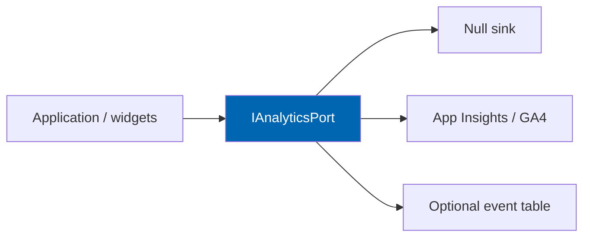

# 30 Analytics

> Product and commercial metrics, event taxonomy, funnel instrumentation, fitment accuracy
> measurement, and operator dashboards for Check Engine.

**Status:** Review · **Owner:** Product Owner · **Last revised:** 2026-07-28

**Engineering status (2026-08-25):** Plugin `0.104.0` is in tree. Progress, evidence gates (G1–G6 done; G11 packing partial), and remaining blockers (H1.35/G8, G7, G11 vendor signing, G12) are recorded in [EXECUTION-PLAN.md](../EXECUTION-PLAN.md). This document remains the specification baseline.

---

## Contents

- [Executive Summary](#executive-summary)
- [Objectives](#objectives)
- [Scope](#scope)
- [Detailed Specifications](#detailed-specifications)
  - [Measurement principles](#measurement-principles)
  - [Success metrics mapping](#success-metrics-mapping)
  - [Event taxonomy](#event-taxonomy)
  - [Funnels](#funnels)
  - [Fitment accuracy measurement](#fitment-accuracy-measurement)
  - [AI and cost analytics](#ai-and-cost-analytics)
  - [Operator dashboards](#operator-dashboards)
  - [Privacy](#privacy)
  - [Implementation sketch](#implementation-sketch)
- [Architecture](#architecture)
- [User Stories](#user-stories)
- [Acceptance Criteria](#acceptance-criteria)
- [Future Enhancements](#future-enhancements)
- [References](#references)

---

## Executive Summary

Analytics exists to prove **fitment-driven commerce works**: decode → context → filtered find →
purchase, without storing raw VINs by default. Product success measures in [00](00-vision.md) are the
north star; this document defines the **event taxonomy** and operator views.

Takeaways:

1. **Events are named, versioned, and privacy-safe** (`FR-413`).
2. **Fitment accuracy** is measured from reviews and wrong-fit reports, not vanity traffic.
3. **AI cost and queue depth** feed ops (`FR-590`).
4. **Garage and search events** power product decisions (`FR-720`).
5. Instrumentation must not block the request pipeline.

---

## Objectives

| # | Objective | Traces to | Measure |
|---|---|---|---|
| 1 | Publish a stable event catalogue | Vision success measures | Schema in code |
| 2 | Instrument primary funnels | J1–J3 journeys | Funnel reports |
| 3 | Measure fitment quality | `BR-001`, `BR-003` | Accuracy dashboard |
| 4 | Respect privacy redaction | `NFR-044`, `FR-413` | Audit |
| 5 | Support operator admin home widgets | `FR-993` | UI |

---

## Scope

### In scope

- First-party product analytics for Check Engine features
- Operator dashboards inside admin

### Out of scope

| Not covered | Where |
|---|---|
| Full Google Analytics property setup | Operator |
| Financial accounting | ERP |
| Marketplace scorecards detail | [19](19-marketplace-module.md) |

### Assumptions

- Events emit to an `IAnalyticsPort` (Infrastructure: file/DB/App Insights/GA4 — configurable).
- Sampling allowed under extreme load if documented.

### Dependencies

[00](00-vision.md), [07](07-user-journey.md), [16](16-search-engine.md), [17](17-ai-architecture.md),
[20](20-customer-garage.md), [28](28-security.md).

---

## Detailed Specifications

### Measurement principles

| Principle | Practice |
|---|---|
| Privacy first | Hash/mask VIN; no PII in event props by default |
| Stable names | `ce.` prefix; additive fields only |
| Correlation | Optional `correlationId` from logs |
| Non-blocking | Fire-and-forget / queue; failures logged |
| Honesty | Do not count Unknown as Fits success |

### Success metrics mapping

| Vision / product measure | Primary events |
|---|---|
| VIN → purchase | `vin_decode_*`, `garage_active_changed`, `search_with_context`, `purchase_with_context` |
| Fitment correctness | `fitment_badge_shown`, `fitment_wrong_report`, review actions |
| Search usefulness | `search_performed`, `search_zero_results`, `search_result_click` |
| Catalog ops | import batch outcomes, review queue age |
| AI economics | usage ledger + `ai_generation_*` |

### Event taxonomy

| Event | Properties (non-PII) | Notes |
|---|---|---|
| `vin_decode_submitted` | ok length?, source | No raw VIN |
| `vin_decode_succeeded` | outcome, candidateCount, wmi | |
| `vin_decode_failed` | reasonCode | |
| `garage_vehicle_saved` | hasConfig, hasVinMasked | |
| `garage_active_changed` | | |
| `garage_cleared` | | |
| `garage_guest_migrated` | vehicleCount | |
| `search_performed` | mode, hasContext, resultCount, degraded | `FR-413` |
| `search_zero_results` | mode, recoveryShown | |
| `search_result_click` | position, fitmentOutcome | |
| `fitment_badge_shown` | outcome | |
| `fitment_wrong_report` | claimId | |
| `purchase_with_context` | orderId, lineCount, allFits? | |
| `import_batch_completed` | rows, published, failed | |
| `ai_generation_created` | feature | |
| `ai_generation_published` | feature | |
| `erp_sync_failed` | operationType | |

Version property `schemaVersion: 1` on all payloads.

### Funnels

| Funnel | Steps |
|---|---|
| Retail VIN | submit → success → garage save → search_with_context → click → purchase_with_context |
| OEM trade | oem resolve → result → purchase |
| Zero-result recovery | zero_results → recovery action → later success |

### Fitment accuracy measurement

| Signal | Use |
|---|---|
| Wrong-fit customer reports | Numerator for defects |
| Review reject rate on import/AI | Quality of proposals |
| Returns tagged fitment-related | Operator process (optional ERP reason) |
| Sample audit | Curator spot-check published claims |

Dashboard: rolling 30-day wrong-fit report rate per 1,000 purchases_with_context.

### AI and cost analytics

| Source | View |
|---|---|
| `CeAiUsageDaily` | Cost/volume by feature ([17](17-ai-architecture.md)) |
| Review queue depth | `FR-590` |
| Ceiling hits | Alert |

### Operator dashboards

| Dashboard | Content |
|---|---|
| Admin home widget | Review queues, sync exceptions, licence (`FR-993`) |
| Search | Modes, zero-result rate, degraded % |
| Fitment | Badge outcome mix, wrong-fit reports |
| Import | Batch success/fail |
| AI | Cost, ceilings, publish lag |

### Privacy

| Rule | Detail |
|---|---|
| VIN | Last4 or hash only |
| IP | Optional truncated |
| Retention | Configurable; default align with analytics policy |
| Export | Respect DSR — analytics stores should support deletion keys by customer id hash |

### Implementation sketch

`IAnalyticsClient.Track(eventName, props)` registered in DI; theme and Application emit; Infrastructure
ships null adapter + Application Insights adapter.

---

## Architecture

### Rejected alternatives

| Alternative | Rejected because |
|---|---|
| Only third-party pageviews | Misses fitment truth |
| Storing raw VIN in analytics | `FR-413`, `NFR-044` |

---

## User Stories

| ID | Persona | Story | Points | Priority |
|---|---|---|---|---|
| `US-721` | Product owner | See VIN→purchase funnel weekly | 5 | Must |
| `US-722` | Operator | See zero-result rate by mode | 3 | Must |
| `US-723` | Operator | See AI spend vs ceiling | 3 | Must |
| `US-724` | Privacy officer | Confirm analytics lacks raw VIN | 3 | Must |

---

## Acceptance Criteria

**`AC-30.1`** — Event on decode
Given successful VIN decode, when completed, then `vin_decode_succeeded` is emitted without raw VIN.

**`AC-30.2`** — Search privacy
Given VIN-mode search, when `search_performed` is stored, then properties exclude full VIN (`FR-413`).

**`AC-30.3`** — Non-blocking
Given analytics sink throwing, when search runs, then search still returns 200.

**`AC-30.4`** — Admin widget
Given open review items, when admin home loads, then queue depth is visible (`FR-993`).

---

## Future Enhancements

| Enhancement | Horizon | Notes |
|---|---|---|
| Experimentation framework | 2 | |
| Vendor scorecards | 3 | [19](19-marketplace-module.md) |
| Public API analytics | 5 | |

---

## References

- [00 Vision](00-vision.md) — success measures
- [07 User Journey](07-user-journey.md)
- [16 Search Engine](16-search-engine.md)
- [17 AI Architecture](17-ai-architecture.md)
- [28 Security](28-security.md)
- [31 Logging](31-logging.md)
