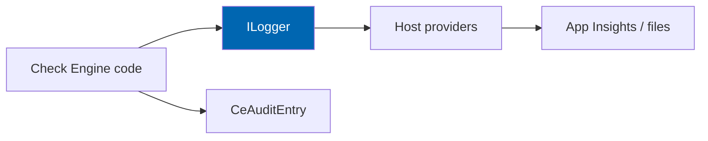

# 31 Logging

> Structured logging, levels, correlation identifiers, retention, sensitive-data redaction, and
> observability integration for Check Engine.

**Status:** Review · **Owner:** Architecture Owner · **Last revised:** 2026-07-28

---

## Contents

- [Executive Summary](#executive-summary)
- [Objectives](#objectives)
- [Scope](#scope)
- [Detailed Specifications](#detailed-specifications)
  - [Logging principles](#logging-principles)
  - [Levels](#levels)
  - [Structured fields](#structured-fields)
  - [Correlation](#correlation)
  - [Redaction dictionary](#redaction-dictionary)
  - [What to log by module](#what-to-log-by-module)
  - [Audit vs diagnostic logs](#audit-vs-diagnostic-logs)
  - [Retention and shipping](#retention-and-shipping)
  - [Health and diagnostics package](#health-and-diagnostics-package)
- [Architecture](#architecture)
- [User Stories](#user-stories)
- [Acceptance Criteria](#acceptance-criteria)
- [Future Enhancements](#future-enhancements)
- [References](#references)

---

## Executive Summary

Logs are for **operations and forensics**, not a second analytics warehouse. Check Engine uses
`ILogger<T>` with **structured templates**, **correlation ids**, and **mandatory redaction** of VINs,
secrets, and personal data (`NFR-044`).

Takeaways:

1. **Structured templates** — never string-concatenate secrets.
2. **Default: no raw VIN** in Information+.
3. **Correlation id** flows across decode → search → fitment.
4. **Audit** is separate from diagnostic logs (`CeAuditEntry`).
5. **Support packages redact** by default (`FR-992`).

---

## Objectives

| # | Objective | Traces to | Measure |
|---|---|---|---|
| 1 | Define field dictionary and levels | `NFR-044`, `NFR-068` | Review checklist |
| 2 | Enforce redaction rules | `FR-212`, `FR-413` | Log fixture tests |
| 3 | Specify correlation behaviour | Operability | Trace across modules |
| 4 | Separate audit from logs | `FR-970` | Design |
| 5 | Define diagnostics export | `FR-992` | Manual test |

---

## Scope

### In scope

- Application/diagnostic logging for Check Engine assemblies
- Redaction, correlation, retention guidance

### Out of scope

| Not covered | Where |
|---|---|
| Central SIEM product choice | Operator |
| nopCommerce core log config entirely | Host |
| Metrics time-series | [30](30-analytics.md) / App Insights metrics |

### Assumptions

- Host uses standard ASP.NET Core logging providers.
- Production level default Information; Debug only in non-prod.

### Dependencies

[28](28-security.md), [13](13-vin-engine.md), [34](34-coding-standards.md), [03](03-non-functional-requirements.md).

---

## Detailed Specifications

### Logging principles

| Principle | Practice |
|---|---|
| Structured | `"Fitment evaluated {ProductId} {ConfigurationId} {Outcome}"` |
| Redact first | Prefer hashes/last4 before write |
| Sampling | High-volume traces may sample in production |
| No PII fishing | Do not log request bodies wholesale |
| Performance | Avoid reflective dumping on hot paths |

### Levels

| Level | Use |
|---|---|
| Trace | Dev-only engine internals |
| Debug | Staging diagnostics |
| Information | Business milestones (decode success/fail reason, batch stage) |
| Warning | Recoverable (index degraded, ERP retry) |
| Error | Failures needing action |
| Critical | Store-breaking (should be rare) |

### Structured fields

| Field | Required? | Notes |
|---|---|---|
| `CorrelationId` | Yes when available | |
| `CustomerId` | When authenticated | Int id OK |
| `StoreId` | Multi-store | |
| `Module` | Yes | Vin, Fitment, Search, Import, Erp, Ai |
| `ReasonCode` | On failures | Domain codes |
| `DurationMs` | Hot paths | |
| `ProductId` / `ConfigurationId` | When relevant | |
| `VinLast4` / `VinHash` | Optional | Never full VIN by default |

### Correlation

| Rule | Detail |
|---|---|
| Inbound | Accept host/trace header if present; else generate |
| Flow | Pass through Application to Infrastructure HTTP clients (ERP/AI) as header where safe |
| Logs | Include on every Check Engine Information+ event in a request |

### Redaction dictionary

| Data | Default treatment |
|---|---|
| VIN | Last4 or HMAC hash (`FR-212`) |
| Auth cookies / tokens | Never |
| AI/ERP API keys | Never |
| Passwords | Never |
| Address / phone / email | Avoid; hash if required |
| Payment PANs | N/A (sibling plugin) |
| Import raw row | Debug only; truncate in Information |

### What to log by module

| Module | Information examples | Avoid |
|---|---|---|
| VIN | outcome, reasonCode, wmi, duration | raw VIN |
| OEM | normalised hit/miss, manufacturerId | — |
| Fitment | outcome, claimId, duration | — |
| Search | mode, resultCount, degraded | raw query if contains VIN — scrub |
| Import | batchId, stage, row errors | full file contents |
| ERP | operation, idempotencyKey, success | secrets, full payloads at Information |
| AI | feature, token counts, cache hit | prompt full text at Information (Debug only) |
| Licence | status transition | activation keys |

### Audit vs diagnostic logs

| Concern | Store |
|---|---|
| Who changed fitment/licence/import | `CeAuditEntry` |
| What the system did technically | `ILogger` |
| Customer analytics | [30](30-analytics.md) |

Do not use logger alone as compliance audit trail.

### Retention and shipping

| Guidance | Detail |
|---|---|
| App logs | Operator policy; recommend ≥ 30 days hot |
| Audit | Longer; per `FR-971` |
| Shipping | App Insights / Seq / ELK via host providers |
| PII in sinks | Same redaction before leave process |

### Health and diagnostics package

| Item (`FR-991`, `FR-992`) | Content |
|---|---|
| Health | DB, index, ERP, AI, licence status |
| Diagnostics zip | Versions, config **sans secrets**, recent redacted errors, migration list |

---

## Architecture

### Rejected alternatives

| Alternative | Rejected because |
|---|---|
| Free-text logging of request bodies | PII/secret leakage |
| Audit-only-in-logs | Not tamper evident / hard to query |

---

## User Stories

| ID | Persona | Story | Points | Priority |
|---|---|---|---|---|
| `US-731` | Ops | Trace a failed decode by correlation id | 3 | Must |
| `US-732` | Security | Confirm production logs lack raw VINs | 3 | Must |
| `US-733` | Support | Download redacted diagnostics package | 5 | Must |

---

## Acceptance Criteria

**`AC-31.1`** — VIN redaction
Given default config, when decode logs Information, then message/properties lack 17-char VIN (`FR-212`).

**`AC-31.2`** — Structured
Given fitment evaluation log, when parsed as template, then ProductId and Outcome are structured properties.

**`AC-31.3`** — Diagnostics redact
Given diagnostics package generation, when inspected, then connection strings and API keys are absent (`FR-992`).

**`AC-31.4`** — Correlation
Given a search request with correlation id, when fitment is evaluated in-process, then the same id appears on related logs.

---

## Future Enhancements

| Enhancement | Horizon | Notes |
|---|---|---|
| OpenTelemetry tracing spans | 2 | |
| Automatic PII scrubber middleware | 2 | |

---

## References

- [28 Security](28-security.md)
- [30 Analytics](30-analytics.md)
- [13 VIN Engine](13-vin-engine.md)
- [34 Coding Standards](34-coding-standards.md)
- [03 Non-Functional Requirements](03-non-functional-requirements.md)
