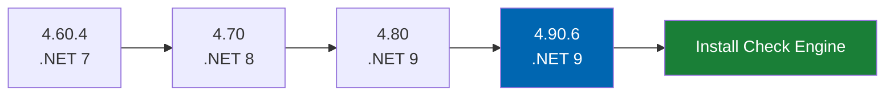
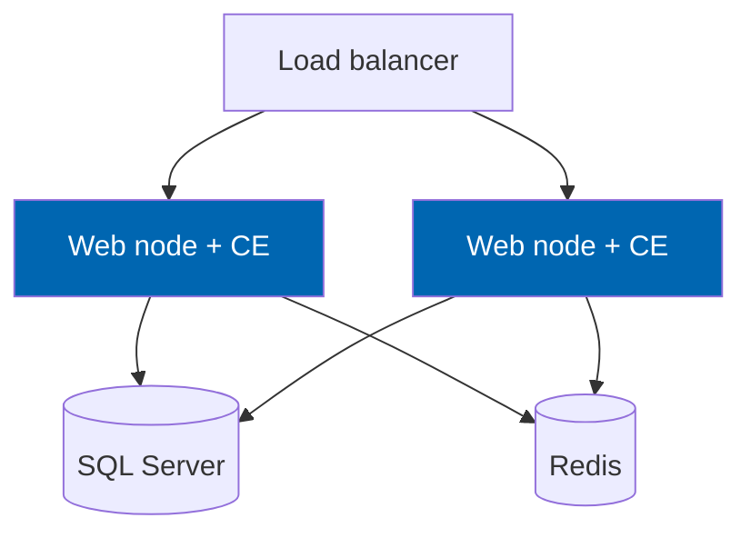

# 32 Deployment

> Platform upgrade from nopCommerce 4.60 to 4.90, environment topology, Check Engine install/upgrade
> /rollback, web farm operation, and containerisation guidance.

**Status:** Review · **Owner:** DevOps Architect · **Last revised:** 2026-07-28

---

## Contents

- [Executive Summary](#executive-summary)
- [Objectives](#objectives)
- [Scope](#scope)
- [Detailed Specifications](#detailed-specifications)
  - [Platform upgrade track](#platform-upgrade-track)
  - [Environment topology](#environment-topology)
  - [Prerequisites](#prerequisites)
  - [Fresh install](#fresh-install)
  - [Upgrade Check Engine](#upgrade-check-engine)
  - [Rollback](#rollback)
  - [Uninstall](#uninstall)
  - [Web farm](#web-farm)
  - [Configuration and secrets](#configuration-and-secrets)
  - [Health checks and warm-up](#health-checks-and-warm-up)
  - [Containerisation](#containerisation)
  - [Backup and DR](#backup-and-dr)
  - [NET 10 retarget](#net-10-retarget)
- [Architecture](#architecture)
- [User Stories](#user-stories)
- [Acceptance Criteria](#acceptance-criteria)
- [Future Enhancements](#future-enhancements)
- [References](#references)

---

## Executive Summary

Deployment has two tracks: **Horizon 0** brings the host from 4.60.4 to **4.90.6**, then **Check Engine**
installs as a plugin without patching `Libraries` or `Presentation` core. Upgrades are migration-forward;
rollbacks prefer database restore + previous plugin package.

Takeaways:

1. **Do not build Check Engine against 4.60** (`ADR-001`).
2. **Single-hop platform upgrades** with regression gates (`RISK-03`).
3. **Redis required for multi-node** fitment/vehicle caches.
4. **ERP/AI outages must not block install or checkout**.
5. **Cold start ≤ 30 s** target (`NFR-012` Should).

---

## Objectives

| # | Objective | Traces to | Measure |
|---|---|---|---|
| 1 | Specify 4.60→4.90 upgrade steps | Horizon 0, `ADR-001` | Runbook executable |
| 2 | Specify CE install/upgrade/rollback | `FR-910`–`FR-925` | Clean install AC |
| 3 | Define farm topology | [08](08-system-architecture.md) | Diagram + checklist |
| 4 | Document backup/DR expectations | `NFR-031` | DR drill note |
| 5 | Plan .NET 10 retarget gate | `ADR-002` | Milestone |

---

## Scope

### In scope

- Host upgrade track, CE plugin deployment, farm, containers, rollback, health

### Out of scope

| Not covered | Where |
|---|---|
| CI packaging automation | [33](33-ci-cd.md) |
| Marketplace listing upload | [42](42-marketplace-publishing.md) |
| Customer Azure landing zone design | Partner services |

### Assumptions

- Windows or Linux hosts supported by nopCommerce 4.90.
- The current verification stack uses PostgreSQL 16 in Podman; production database choice remains environment-specific.
- Operator has backup rights before any upgrade.

### Dependencies

[ROADMAP.md](../ROADMAP.md), [09](09-plugin-architecture.md), [10](10-database-design.md),
[08](08-system-architecture.md), [28](28-security.md).

---

## Detailed Specifications

### Platform upgrade track

| Step | From → To | Runtime | Gate before next |
|---|---|---|---|
| 0.1 | 4.60 → 4.70 | .NET 7 → 8 | Host tests green; plugins updated |
| 0.2 | 4.70 → 4.80 | .NET 8 → 9 | Same |
| 0.3 | 4.80 → 4.90.6 | .NET 9 | Same |
| 0.4 | Verification | — | Full regression; sample plugin installs |

**Backup** database + app files before each hop. Follow official nopCommerce upgrade docs per hop;
record CE-specific notes in runbook appendix as discovered (`RISK-03`).

**Rollback:** restore DB + files from pre-hop backup; do not jump backward across multiple hops without
restore.

### Environment topology

| Env | Purpose |
|---|---|
| Dev | Local SDK + optional Docker SQL |
| CI | Ephemeral ([33](33-ci-cd.md)) |
| Staging | Production-like; reference dataset subset |
| Production | Single-node or farm |

### Prerequisites

| Component | Requirement |
|---|---|
| nopCommerce | 4.90.6 |
| Runtime | .NET 9 |
| SQL Server | 2019+ |
| Redis | Required for farm; recommended otherwise for cache |
| Disk | Media + import staging |

### Fresh install

1. Deploy host 4.90.6 on empty or existing commerce DB.  
2. Copy `Plugins/TwinParticles.CheckEngine` package (all layer DLLs).  
3. Restart app; install from Admin → Local plugins.  
4. Confirm migrations applied; open configuration.  
5. Set theme `CheckEngine`; configure search/ERP/AI as needed (AI default off).  
6. Smoke: VIN decode, search, PDP fitment, install permissions.  
7. For the current E2E verification stack, use PostgreSQL 16 + Chromium via `e2e/start-manual-stack.ps1` or `e2e/run-regressions.ps1`.

Must succeed without manual SQL (`FR-925`).

### Upgrade Check Engine

1. Backup DB.  
2. Replace plugin files with new SemVer package.  
3. Restart; run pending FluentMigrator migrations.  
4. Smoke + migration duration note in CHANGELOG upgrade notes.  

### Rollback

| Situation | Action |
|---|---|
| Plugin upgrade failed | Restore previous plugin files + DB backup taken pre-upgrade |
| Migration irreversible | Restore DB; document in CHANGELOG |
| Theme only | Revert theme files; no schema |

Prefer **forward fix** for minor bugs when migration already applied safely.

### Uninstall

Per [09](09-plugin-architecture.md): confirm warning; export data first (`FR-924`); drop `Ce*` schema;
remove settings/resources/tasks/permissions (`FR-921`–`FR-923`). Host products/orders remain.

### Web farm

| Rule | Detail |
|---|---|
| Identical plugin binaries on all nodes | |
| Redis for Check Engine caches | [29](29-performance.md) |
| Schedule tasks | Single runner / host locking to avoid duplicate ERP posts |
| Rolling deploy | Drain node; deploy; warm-up; join |

### Configuration and secrets

| Item | Location |
|---|---|
| Feature toggles | nopCommerce settings / Options |
| AI/ERP secrets | Secret store (`FR-815`, `FR-504`) |
| Licence | Activation UI; offline mode ([43](43-licensing.md)) |

### Health checks and warm-up

| Check (`FR-991`) | Healthy when |
|---|---|
| Database | Can query `CeVehicleMake` or settings |
| Search index | Ping or fallback flagged degraded |
| ERP | Optional; unhealthy ≠ block storefront |
| AI | Optional |
| Licence | Status Active/Grace |

Warm-up URL hits home + search after deploy (`NFR-012`).

### Containerisation

Supported pattern: containerise **nopCommerce host** with plugin folder mounted/copied; the current E2E verification stack uses PostgreSQL 16 as a separate service and local Chromium for browser playback. The helper scripts `e2e/start-manual-stack.ps1` and `e2e/run-regressions.ps1` start the host and verify install/home/search/sample PDP smoke flows. Official images may vary — pin versions; run the same install steps. Not required for v1.0 GA but documented for operators who containerise.

### Backup and DR

| Item | Guidance |
|---|---|
| DB backup | Before CE upgrade; nightly production |
| RPO/RTO | Customer infra; document targets `NFR-031` |
| Media | Backup nopCommerce media with DB consistency strategy |
| Drill | Annual restore test recommended |

### NET 10 retarget

When nopCommerce ships .NET 10 major (`ADR-002`): budget compatibility branch; retarget TFM; rerun
full Phase 7 gates. Not calendar-forced before platform release.

---

## Architecture

### Rejected alternatives

| Alternative | Rejected because |
|---|---|
| Developing CE on 4.60 then porting | Double write (`ADR-001`) |
| Patching host `Libraries` for deploy | Breaks upgrades / Marketplace rules |

---

## User Stories

| ID | Persona | Story | Points | Priority |
|---|---|---|---|---|
| `US-741` | DevOps | Upgrade host 4.80 → 4.90.6 with rollback backup | 13 | Must |
| `US-742` | Admin | Install CE on clean 4.90.6 without SQL scripts | 5 | Must |
| `US-743` | DevOps | Rolling-deploy CE to a two-node farm with Redis | 8 | Must |
| `US-744` | Admin | Export fitment data before uninstall | 3 | Must |

---

## Acceptance Criteria

**`AC-32.1`** — Clean install
Given stock 4.90.6, when CE is installed from admin, then success without manual SQL (`FR-925`).

**`AC-32.2`** — Upgrade migrations
Given CE 1.0.0 DB, when 1.0.1 package applied, then pending migrations run and smoke passes.

**`AC-32.3`** — Farm
Given two nodes + Redis, when request round-robins, then fitment results stay consistent after publish.

**`AC-32.4`** — Uninstall
Given confirmed uninstall, when complete, then no `Ce*` tables remain (`FR-921`).

**`AC-32.5`** — Platform hop gate
Given each host upgrade hop, when regression suite runs, then it passes before the next hop starts.

---

## Future Enhancements

| Enhancement | Horizon | Notes |
|---|---|---|
| Blue/green CE slot swap | 2 | |
| Helm charts | 5 | SaaS |
| Automated 4.90 minor matrix deploy | 1 | [33](33-ci-cd.md) |

---

## References

- [ROADMAP.md](../ROADMAP.md) — Horizon 0
- [09 Plugin Architecture](09-plugin-architecture.md)
- [08 System Architecture](08-system-architecture.md)
- [29 Performance](29-performance.md)
- [33 CI-CD](33-ci-cd.md)
- [43 Licensing](43-licensing.md)
- nopCommerce official upgrade documentation
