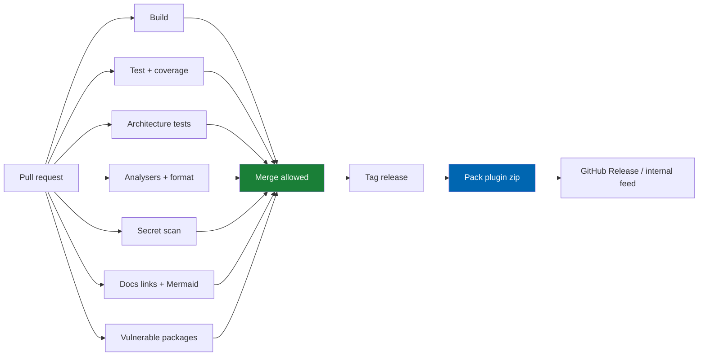

# 33 CI-CD

> GitHub Actions pipelines, build and test matrix, quality gates (including TDD evidence and Mermaid
> lint), packaging, signing, and release automation for Check Engine.

**Status:** Review · **Owner:** DevOps Architect · **Last revised:** 2026-07-28

---

## Contents

- [Executive Summary](#executive-summary)
- [Objectives](#objectives)
- [Scope](#scope)
- [Detailed Specifications](#detailed-specifications)
  - [Pipeline overview](#pipeline-overview)
  - [Triggers and environments](#triggers-and-environments)
  - [Build matrix](#build-matrix)
  - [Quality gates](#quality-gates)
  - [Traceability validation](#traceability-validation)
  - [Documentation gates](#documentation-gates)
  - [Packaging and artefacts](#packaging-and-artefacts)
  - [Signing and provenance](#signing-and-provenance)
  - [Release automation](#release-automation)
  - [Secrets in CI](#secrets-in-ci)
  - [Branch protections](#branch-protections)
- [Architecture](#architecture)
- [User Stories](#user-stories)
- [Acceptance Criteria](#acceptance-criteria)
- [Future Enhancements](#future-enhancements)
- [References](#references)

---

## Executive Summary

CI/CD enforces that **Check Engine cannot merge broken architecture, red tests, secret leaks, or
invalid Mermaid**. Releases produce a version-aligned plugin package (`plugin.json` =
`AssemblyInformationalVersion`) ready for Marketplace or private distribution.

Takeaways:

1. **PR pipeline** must pass before merge to `develop` / `main`.
2. **TDD/coverage gates** align with [34](34-coding-standards.md) and [35](35-testing-strategy.md).
3. **Docs:** link check + Mermaid allowlist parse ([CONTRIBUTING.md](../CONTRIBUTING.md)).
4. **Vulnerable packages** fail release (`NFR-042`).
5. **No credentials** in workflows or artefacts (`NFR-037`).

---

## Objectives

| # | Objective | Traces to | Measure |
|---|---|---|---|
| 1 | Define mandatory PR gates | CONTRIBUTING review gates | Workflow YAML |
| 2 | Automate package production | SemVer + Marketplace | Artefact |
| 3 | Enforce architecture + coverage | `NFR-057`, `NFR-058` | CI jobs |
| 4 | Lint documentation diagrams | Mermaid standards | Script job |
| 5 | Support signed releases | Supply chain | Optional signing step |

---

## Scope

### In scope

- GitHub Actions (normative CI host)
- Gates, artefacts, release flow for CE plugin + docs

### Out of scope

| Not covered | Where |
|---|---|
| Customer production CD into their IIS | [32](32-deployment.md) |
| nopCommerce core CI | Upstream |
| Mobile app pipelines | N/A |

### Assumptions

- Repo hosts Check Engine under `CheckEngine/` docs + future `src` plugin projects.
- GitHub Environments for `staging` / `release` with required reviewers.

### Dependencies

[34](34-coding-standards.md), [35](35-testing-strategy.md), [09](09-plugin-architecture.md),
[CONTRIBUTING.md](../CONTRIBUTING.md), [28](28-security.md).

---

## Detailed Specifications

### Pipeline overview

### Triggers and environments

| Trigger | Pipeline |
|---|---|
| PR to `develop` / `main` / `release-*` | Full PR gates |
| Push to `develop` | PR gates + publish CI package (unsigned) |
| Tag `v*` | Release pack + optional sign + GitHub Release |
| Nightly | Integration + vulnerable package refresh |

### Build matrix

| Dimension | Values |
|---|---|
| OS | `windows-latest` (primary); `ubuntu-latest` if SDK-compatible |
| SDK | .NET 9 matching host |
| Configuration | Release |

### Quality gates

| Gate | Fail when |
|---|---|
| Build | Warnings-as-errors on CE projects |
| Unit + architecture tests | Any fail |
| Coverage | Domain below threshold ([35](35-testing-strategy.md) / `NFR-058`) |
| `dotnet format --verify-no-changes` | Drift |
| Secret scan | Finding |
| Vulnerable packages | Critical/high without waiver |
| Docs | Broken links or Mermaid lint fail |
| Locale parity | EN key missing AR (`NFR-051`) when resources present |

**TDD:** CI cannot prove red-first alone; PR template evidence remains a human gate
([CONTRIBUTING.md](../CONTRIBUTING.md#test-driven-development)). Optional: job that runs new tests
against base SHA (advanced).

### Traceability validation

| Check | Rule |
|---|---|
| PR body | Contains `US-nnn` or docs-only label |
| Changelog | Required for customer-visible labels |
| AC identifiers | Optional scanner for `AC-` in tests |

### Documentation gates

| Check | Tooling |
|---|---|
| Markdown links | lychee or custom |
| Mermaid | Allowlist linter (as used in docs development) — reject `journey`, `quadrantChart`, `mindmap`, `timeline` |
| Template sections | Optional for new docs |

### Packaging and artefacts

| Artefact | Content |
|---|---|
| `TwinParticles.CheckEngine.{version}.zip` | Plugin folder layout for drop-in install |
| Symbols | Optional snupkg for internal |
| SBOM | Should Horizon 2 |

Version alignment: `plugin.json` Version == InformationalVersion (`AC-09.6`).

### Signing and provenance

| Step | Detail |
|---|---|
| Authenticode / NuGet sign | When certificates available in release environment |
| Checksums | SHA256 on GitHub Release |
| Provenance | GitHub OIDC attestation optional |

### Release automation

1. Tag `vX.Y.Z` from `main` or release branch.  
2. CI packs zip; attaches to GitHub Release.  
3. CHANGELOG section for version must exist.  
4. Marketplace upload may remain manual ([42](42-marketplace-publishing.md)).  

### Secrets in CI

| Allowed | Forbidden |
|---|---|
| GitHub Secrets for signing/feed | Real ERP/AI keys in PR logs |
| OIDC to cloud | Long-lived keys in YAML |

### Branch protections

| Branch | Rules |
|---|---|
| `main` | Reviews + all gates; no force push |
| `develop` | Reviews + gates |
| `release-*` | Same |

---

## Architecture

Workflows live under `.github/workflows/` (when code repo is wired): `pr.yml`, `release.yml`, `nightly.yml`.

### Rejected alternatives

| Alternative | Rejected because |
|---|---|
| Merge without tests | Violates TDD/DoD |
| Releasing unsigned unsigned-only forever without checksums | Weak supply chain |
| Skipping doc lint | Broken Mermaid ships again |

---

## User Stories

| ID | Persona | Story | Points | Priority |
|---|---|---|---|---|
| `US-751` | Engineer | Get CI failure on Domain→Nop reference | 5 | Must |
| `US-752` | Engineer | Get CI failure on invalid Mermaid in docs PR | 3 | Must |
| `US-753` | Release manager | Tag v1.0.0 and download plugin zip from Release | 5 | Must |
| `US-754` | Security | CI fails on critical vulnerable package | 5 | Must |

---

## Acceptance Criteria

**`AC-33.1`** — PR gates
Given a PR that breaks unit tests, when CI runs, then merge is blocked.

**`AC-33.2`** — Architecture
Given Domain references Nop.Core, when architecture tests run in CI, then fail (`NFR-057`).

**`AC-33.3`** — Mermaid
Given a docs PR with `quadrantChart`, when Mermaid lint runs, then fail.

**`AC-33.4`** — Version align
Given release pack, when `plugin.json` and assembly informational version compared, then equal.

**`AC-33.5`** — Secrets
Given gitleaks on repo, when run in CI, then clean for release tags.

---

## Future Enhancements

| Enhancement | Horizon | Notes |
|---|---|---|
| Mutation testing job for Domain | 2 | [34](34-coding-standards.md) |
| Perf bench gate on RC | 2 | [29](29-performance.md) |
| Auto Marketplace draft upload | 3 | |

---

## References

- [35 Testing Strategy](35-testing-strategy.md)
- [34 Coding Standards](34-coding-standards.md)
- [32 Deployment](32-deployment.md)
- [28 Security](28-security.md)
- [CONTRIBUTING.md](../CONTRIBUTING.md)
- [09 Plugin Architecture](09-plugin-architecture.md)
