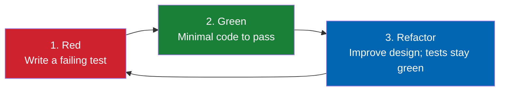
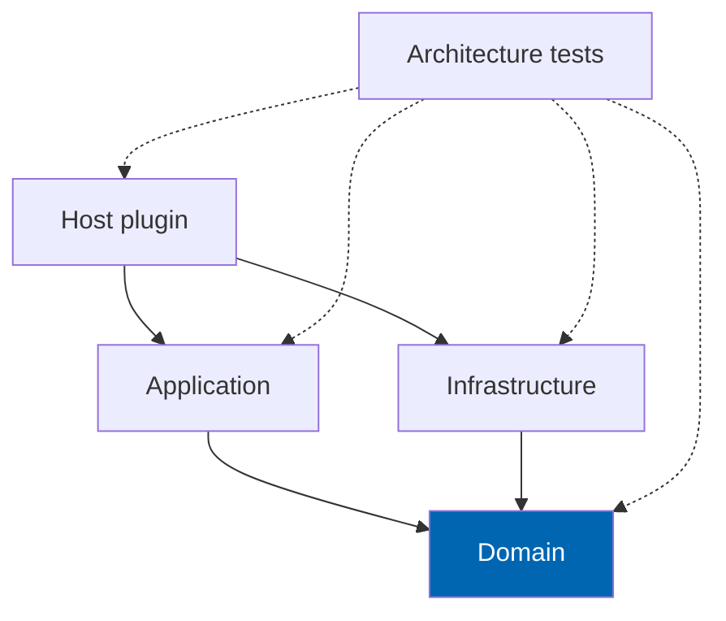

# 34 Coding Standards

> C# and solution engineering rules for Check Engine: Test-Driven Development, Clean Architecture
> enforcement, SOLID, CQRS boundaries, async discipline, Options pattern, error handling, and analyser
> configuration.

**Status:** Review · **Owner:** Engineering Lead · **Last revised:** 2026-07-28

---

## Contents

- [Executive Summary](#executive-summary)
- [Objectives](#objectives)
- [Scope](#scope)
- [Detailed Specifications](#detailed-specifications)
  - [Language and runtime](#language-and-runtime)
  - [Project and namespace rules](#project-and-namespace-rules)
  - [Clean Architecture and SOLID](#clean-architecture-and-solid)
  - [CQRS boundaries](#cqrs-boundaries)
  - [Async and cancellation](#async-and-cancellation)
  - [Options and configuration](#options-and-configuration)
  - [Error handling](#error-handling)
  - [Nullability and types](#nullability-and-types)
  - [Naming](#naming)
  - [Logging and diagnostics](#logging-and-diagnostics)
  - [Test-Driven Development](#test-driven-development)
  - [Testing standards](#testing-standards)
  - [Analysers and EditorConfig](#analysers-and-editorconfig)
  - [Code review checklist](#code-review-checklist)
- [Architecture](#architecture)
- [User Stories](#user-stories)
- [Acceptance Criteria](#acceptance-criteria)
- [Future Enhancements](#future-enhancements)
- [References](#references)

---

## Executive Summary

This document is the **engineering constitution** for Check Engine code. Product behaviour lives in
requirements docs; structure lives in [08](08-system-architecture.md)–[11](11-domain-model.md); **how
code is written and reviewed** lives here.

Takeaways:

1. **Test-Driven Development is mandatory** for production behaviour — red, green, refactor (`ADR-015`).
2. **Nullable reference types on; warnings as errors in CI** for Check Engine projects.
3. **Async all the way** for I/O; `CancellationToken` on public async APIs.
4. **CQRS is selective** — clear read/write paths where they help; no mandatory MediatR theatre.
5. **Options pattern** for settings; no static writable configuration.
6. **Domain errors are codes**; localisation happens at the Host edge.
7. **No manufacturer special cases in logic** (`ADR-004`, `INV-013`).

---

## Objectives

| # | Objective | Traces to | Measure |
|---|---|---|---|
| 1 | Make layering mechanically enforceable | `ADR-007`, `NFR-057` | Architecture tests + analysers |
| 2 | Standardise async, options, and errors | `NFR-033`–`NFR-045` | Checklist in review |
| 3 | Keep code reviewable by a new engineer in one week | `BR-015` | This doc + CONTRIBUTING |
| 4 | Prevent automotive correctness bugs from style shortcuts | Fitment FRs | Safety items on review checklist |
| 5 | Adopt TDD so behaviour is specified by failing tests before implementation | `NFR-057`, `ADR-015` | PR evidence of red→green; DoD in CONTRIBUTING |

---

## Scope

### In scope

- C# coding standards for all `TwinParticles.CheckEngine*` projects
- Architecture test expectations
- Analyser / EditorConfig policy
- Testing expectations at the engineering level (detail in [35](35-testing-strategy.md))

### Out of scope

| Not covered | Where |
|---|---|
| Git branching and commits | [CONTRIBUTING.md](../CONTRIBUTING.md) |
| Plugin packaging | [09](09-plugin-architecture.md) |
| Schema naming | [10](10-database-design.md) |
| Full test matrix | [35](35-testing-strategy.md) |
| Security control list | [28](28-security.md) |

### Assumptions

- C# 13 / .NET 9 toolset matching nopCommerce 4.90.6.
- IDE is Visual Studio 2022+ or Rider/VS Code with C# Dev Kit; EditorConfig is authoritative.

### Dependencies

[08](08-system-architecture.md), [09](09-plugin-architecture.md), [11](11-domain-model.md),
[CONTRIBUTING.md](../CONTRIBUTING.md).

---

## Detailed Specifications

### Language and runtime

| Rule | Standard |
|---|---|
| Language version | Latest C# supported by the host TFM (`net9.0`) |
| Nullable | `<Nullable>enable</Nullable>` on all Check Engine projects |
| Implicit usings | Allowed; do not hide ambiguous usings in Domain |
| File-scoped namespaces | Required for new files |
| Primary constructors | Allowed when they improve clarity; not mandatory |
| Records | Preferred for DTOs and domain events; entities may be classes |
| `required` members | Preferred on DTOs over post-construction mutation |

### Project and namespace rules

| Project | Namespace root |
|---|---|
| Domain | `TwinParticles.CheckEngine.Domain` |
| Application | `TwinParticles.CheckEngine.Application` |
| Infrastructure | `TwinParticles.CheckEngine.Infrastructure` |
| Host | `TwinParticles.CheckEngine` |

Feature folders append: `.Fitment`, `.Vin`, etc. Do not create `Domain.Models.Models` stacks.

**Usings:** Domain may not import `Nop.*`, `Microsoft.AspNetCore.*`, or Infrastructure namespaces.

### Clean Architecture and SOLID

| Principle | Application |
|---|---|
| **S** | One reason to change per class; fitment publish policy ≠ VIN decode |
| **O** | New OEM relation types via enum + handlers, not switch sprawl without tests |
| **L** | Repository implementations honour port contracts including nullability |
| **I** | Prefer narrow ports (`IFitmentClaimReadRepository` vs god `IData`) when ISP pain appears |
| **D** | Application depends on Domain ports; Infrastructure implements |

Architecture tests (NetArchTest or equivalent) **must** assert:

- Domain → independent of Nop/Infrastructure/Application
- Application → independent of Infrastructure and Nop
- Infrastructure → may depend on Domain (+ host data packages as required)
- Host → may depend on all for composition

### CQRS boundaries

| Use CQRS-style split when | Do not when |
|---|---|
| Search and vehicle-tree reads need dedicated models | Simple settings CRUD |
| Fitment evaluation read path must not load write graphs | One-line admin lookups |
| Import commit write model differs from review queue read | Premature dual models |

**MediatR (or similar):** optional for Application handlers. If introduced, confine to Application; Domain
never references it. Controllers remain thin either way.

**Commands** mutate and return results/error codes. **Queries** are side-effect free aside from
cache reads.

### Async and cancellation

| Rule | Detail |
|---|---|
| Async suffix | `Async` on all async methods |
| Token | `CancellationToken cancellationToken = default` on public async APIs; pass through |
| Sync-over-async | Forbidden (`.Result`, `.Wait()`, `.GetAwaiter().GetResult()`) except true legacy host hooks documented with justification |
| `ConfigureAwait` | Library code in Domain/Application/Infrastructure: `ConfigureAwait(false)` when not on ASP.NET request context helpers; Host MVC code may omit |
| Parallelism | `Task.WhenAll` only for independent I/O; watch DbContext/host data scope affinity — prefer sequential per scope unless using separate scopes |
| CPU-bound | Rare; offload only with clear reason (e.g. bulk fingerprint) |

### Options and configuration

| Rule | Detail |
|---|---|
| Pattern | `IOptions<T>`, `IOptionsMonitor<T>`, or `IOptionsSnapshot<T>` as appropriate |
| Mutability | Options classes have init/set properties for binding but runtime code treats them as immutable snapshots |
| Validation | `IValidateOptions<T>` or data annotations validated at start for critical groups |
| Secrets | Never log; never commit; bind from secure configuration |
| Feature flags | Explicit boolean options with safe defaults (AI off) |

```csharp
public sealed class AiOptions
{
    public const string SectionName = "CheckEngine:Ai";
    public bool Enabled { get; init; }
    public string? Provider { get; init; }
    public decimal DailyBudgetCap { get; init; }
}
```

### Error handling

| Layer | Practice |
|---|---|
| Domain | Throw `DomainException` with `Code` + optional invariant id; or use `Result<T>` consistently per module — **pick Result for Application boundaries, exceptions for truly unexpected invariant breaches**; do not mix ad hoc per file |
| Application | Translate domain failures to result DTOs; do not leak stack traces |
| Host | Map codes to locale resources; HTTP 400/404/409/422 as appropriate; 500 only for unknowns |
| Infrastructure | Wrap external AI/ERP failures with typed exceptions including transient flags |

**Forbidden:** empty catch; catch-all that returns success; swallowing fitment errors into "Fits".

Fitment evaluation failures degrade to **Unknown**, never to **Fits**.

### Nullability and types

| Rule | Detail |
|---|---|
| Prefer domain value objects over `string` for VIN/OEM | |
| Use `IReadOnlyList<T>` / `IReadOnlyCollection<T>` on public returns | |
| Avoid `null` collections — return empty | |
| `DateTime` | Store and compute in UTC; name fields `*Utc` |
| Culture | `StringComparison.Ordinal` for normalised OEM; invariant culture for hashes |

### Naming

| Element | Convention |
|---|---|
| Async methods | `VerbAsync` |
| Interfaces | `I` prefix |
| Handlers | `XCommand` / `XQuery` + `XHandler` if CQRS |
| Migrations | `YYYYMMDDHHMM_Description` |
| Tests | `Method_Scenario_Expected` or AAA with clear names |
| Booleans | `Is`, `Has`, `Can` prefixes |
| Cancelled British spelling in **docs**; American OK in **code APIs** matching .NET (`Canceled` token already BCL) — do not invent `CancelledToken` |

### Logging and diagnostics

| Rule | Detail |
|---|---|
| API | `ILogger<T>` |
| Levels | Trace/Debug development; Information business milestones; Warning recoverable; Error failures |
| Structured | Use templates: `"Fitment evaluated {ProductId} {ConfigurationId} {Status}"` |
| PII | Do not log full VIN in Information+ without policy redaction — prefer last 4 or hash ([28](28-security.md), [31](31-logging.md)) |
| Correlation | Accept and flow correlation id when host provides it |

### Test-Driven Development

Check Engine adopts **Test-Driven Development (TDD)** as the default development methodology for all
production behaviour (`ADR-015`). Tests are not an afterthought written to please coverage dashboards;
they are the executable specification that drives design.

#### The cycle (mandatory)



| Step | Rule |
|---|---|
| **Red** | Write one failing automated test that expresses a single acceptance slice or invariant. Run it; confirm it fails for the right reason |
| **Green** | Write the smallest production change that makes that test pass. No speculative features |
| **Refactor** | Clean structure, names, and duplication while keeping the suite green. Prefer domain clarity over cleverness |

A pull request that adds behaviour **without** new or updated tests that failed before the implementation
existed is incomplete. Reviewers may ask for the red commit or an equivalent demonstration (see
[CONTRIBUTING.md](../CONTRIBUTING.md#test-driven-development)).

#### Where TDD is required

| Work type | TDD required? | Notes |
|---|---|---|
| Domain logic (VIN, OEM, fitment, garage, import domain rules) | **Yes** | Highest priority; pure unit tests first |
| Application use cases / handlers | **Yes** | Fake ports; assert outcomes and fail-closed paths |
| New API / AJAX contracts | **Yes** | Contract or integration test before handler flesh-out |
| Bug fixes | **Yes** | Reproduce with a failing test first, then fix |
| FluentMigrator schema that encodes constraints | **Yes** | Integration test asserts constraint / column exists |
| Pure markup / CSS with no behaviour | No | Visual/RTL checks still required |
| Exploratory spikes | Time-boxed exception | Must be discarded or rewritten under TDD before merge (`spike/` branches do not merge to `develop`) |

#### Outside-in with characterisation when needed

For work that touches existing nopCommerce host behaviour, prefer **outside-in**: an acceptance or
integration test first, then unit tests inward. When changing undocumented legacy host interaction,
write a **characterisation test** that locks current behaviour, then TDD the intended change.

#### Mapping to acceptance criteria

| Artefact | Role in TDD |
|---|---|
| `AC-nnn` / story Given–When–Then | Source of the first failing test name and assertion |
| `INV-nnn` domain invariants | Unit tests that must exist before publish/evaluate code ships |
| `NFR` budgets | Performance tests may follow a spike measurement, then lock the budget with a regression test |

#### Anti-patterns (reject in review)

| Anti-pattern | Why rejected |
|---|---|
| Implementation first, tests copied from the code | Tests mirror bugs; no design pressure |
| Only happy-path tests | Fitment and VIN fail-open bugs hide here |
| Testing private methods by making them public | Test through the public port / aggregate API |
| Disabling a test to go green | Fix the product or delete the obsolete behaviour deliberately |
| Coverage theatre (assert nothing meaningful) | Does not satisfy DoD |

Coverage thresholds in [35 Testing Strategy](35-testing-strategy.md) are a **floor**, not a substitute
for TDD discipline. A module can hit coverage with post-hoc tests and still fail review for skipping red–green–refactor.

### Testing standards

| Layer | Expectation under TDD |
|---|---|
| Domain | Unit tests written first for value objects, invariants, publish policy, evaluation outcomes |
| Application | Handler tests with faked ports written before (or strictly with) the handler |
| Infrastructure | Integration tests for migrations and repositories; characterisation where host-coupled |
| Architecture | Reference rules on CI — treat a new illegal reference as a failing test to fix |
| UI | Theme/widget behaviour tests per [35](35-testing-strategy.md); interaction logic TDD'd |

No production code changes solely to make a bad test pass without fixing design. Prefer deleting a
wrong test and rewriting it red over weakening assertions.

Fitment-specific TDD obligation: every change to evaluation or publishing policy begins with a test that
would catch **fail-open to Fits** if the implementation regresses.

### Analysers and EditorConfig

Minimum:

| Package / rule set | Policy |
|---|---|
| Meziantou.Analyzer or equivalent | Warn/error on common footguns |
| StyleCop.Analyzers or `.editorconfig` style | Consistent naming; document deviations |
| `TreatWarningsAsErrors` | `true` on CI Release |
| CA2007 / async analysers | Align with ConfigureAwait policy |
| Banned API analyser | Ban `.Result` / `GetResult` if feasible |

EditorConfig shall set: UTF-8, CRLF or LF consistent with host repo, 4-space indent for C#, final newline.

### Code review checklist

Reviewers verify:

- [ ] Correct layer for the change
- [ ] No `Nop.*` in Domain
- [ ] No manufacturer control-flow literals
- [ ] Fitment failure → Unknown, not Fits
- [ ] AI outputs remain unpublished without review path
- [ ] `CancellationToken` threaded
- [ ] Options used instead of magic literals for settings
- [ ] Indexes/migrations considered if query added ([10](10-database-design.md))
- [ ] **TDD:** behaviour driven by tests that failed before the implementation (red→green visible in history or described in the PR)
- [ ] Failure and boundary cases tested, not only happy path
- [ ] Docs updated if behaviour/contract changed
- [ ] Licence path cannot block checkout

---

## Architecture

### Allowed dependency sketch



### Rejected alternatives

| Alternative | Rejected because |
|---|---|
| Allowing Domain to use `INopDataProvider` directly | Breaks unit testing and `ADR-007` |
| Mandatory MediatR for every call | Ceremony without benefit for many admin paths |
| Disabling nullable for "speed" | Hides automotive edge-case bugs |
| Custom British-spelling BCL wrappers | Noise |
| Test-after / coverage-only development | Fails to drive design; allows fail-open fitment bugs to ship with green coverage (`ADR-015`) |

---

## User Stories

| ID | Persona | Story | Points | Priority |
|---|---|---|---|---|
| `US-241` | Backend engineer | Know whether to put a class in Domain or Application | 2 | Must |
| `US-242` | Backend engineer | Run architecture tests locally before PR | 3 | Must |
| `US-243` | Reviewer | Use a checklist that catches fitment fail-open bugs | 3 | Must |
| `US-244` | Backend engineer | Bind AI settings via Options with validation | 3 | Must |
| `US-245` | New hire | Follow async and error conventions without tribal knowledge | 5 | Should |
| `US-246` | Backend engineer | Implement a fitment rule by writing a failing test first, then the minimal code | 5 | Must |
| `US-247` | Reviewer | Reject a PR that adds behaviour with only post-hoc happy-path tests | 3 | Must |

---

## Acceptance Criteria

**`AC-34.1`** — Nullable
Given Check Engine projects, when built in CI Release, then nullable warnings are treated as errors.

**`AC-34.2`** — Architecture tests
Given a PR that adds a Domain → Nop reference, when architecture tests run, then CI fails.

**`AC-34.3`** — Fail closed fitment
Given evaluation throws or returns error, when mapped to storefront badge, then status is Unknown (or DoesNotFit only when explicitly asserted), never Fits.

**`AC-34.4`** — Options
Given AI provider configuration, when read in Application, then it comes from `IOptions`/`IOptionsMonitor`, not hard-coded static fields.

**`AC-34.5`** — Review checklist
Given CONTRIBUTING links this checklist, when a PR affecting fitment is reviewed, then the checklist items are acknowledged in the PR template.

**`AC-34.6`** — TDD red before green
Given a pull request that introduces or changes production behaviour in Domain or Application, when reviewed, then it includes at least one automated test that encodes the acceptance slice and that failed against the pre-change code (demonstrated by commit order, CI log, or explicit Verification section).

**`AC-34.7`** — Bugfix starts with a test
Given a defect fix, when the PR is opened, then a regression test that failed on the buggy behaviour is included and passes after the fix.

---

## Future Enhancements

| Enhancement | Horizon | Notes |
|---|---|---|
| Roslyn analyser for manufacturer literals | 2 | Automate INV-013 |
| Public API client SDK standards | 5 | With public REST |
| Source generators for mappings | 2+ | Only if mapping pain is proven |
| Mutation testing gate for Domain | 2 | Strengthen TDD evidence beyond line coverage ([35](35-testing-strategy.md)) |

---

## References

- [08 System Architecture](08-system-architecture.md)
- [09 Plugin Architecture](09-plugin-architecture.md)
- [11 Domain Model](11-domain-model.md)
- [35 Testing Strategy](35-testing-strategy.md)
- [28 Security](28-security.md)
- [31 Logging](31-logging.md)
- [CONTRIBUTING.md](../CONTRIBUTING.md)
- Microsoft .NET coding conventions — baseline for C# style
