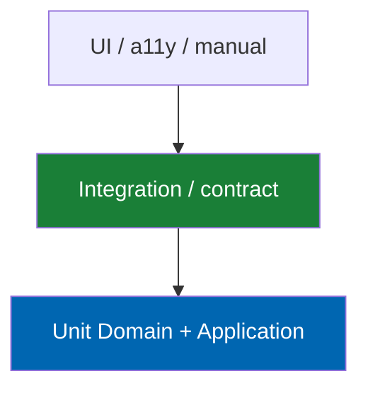

# 35 Testing Strategy

> Test categories, TDD practice, coverage thresholds, fitment accuracy corpus, fixtures, performance
> and accessibility testing, and manual verification protocols for Check Engine.

**Status:** Review · **Owner:** Engineering Lead · **Last revised:** 2026-07-28

---

## Contents

- [Executive Summary](#executive-summary)
- [Objectives](#objectives)
- [Scope](#scope)
- [Detailed Specifications](#detailed-specifications)
  - [Testing principles and TDD](#testing-principles-and-tdd)
  - [Test pyramid](#test-pyramid)
  - [Coverage thresholds](#coverage-thresholds)
  - [Unit tests](#unit-tests)
  - [Architecture tests](#architecture-tests)
  - [Integration tests](#integration-tests)
  - [Fitment accuracy corpus](#fitment-accuracy-corpus)
  - [Contract tests](#contract-tests)
  - [UI and accessibility tests](#ui-and-accessibility-tests)
  - [Performance tests](#performance-tests)
  - [Security tests](#security-tests)
  - [Manual verification protocols](#manual-verification-protocols)
  - [Test data and fixtures](#test-data-and-fixtures)
  - [CI mapping](#ci-mapping)
- [Architecture](#architecture)
- [User Stories](#user-stories)
- [Acceptance Criteria](#acceptance-criteria)
- [Future Enhancements](#future-enhancements)
- [References](#references)

---

## Executive Summary

Testing proves Check Engine is **correct, fast enough, accessible, and secure** — with
**Test-Driven Development** as the default way behaviour is born (`ADR-015`). Coverage thresholds are
a **floor**; they do not replace red→green→refactor ([34](34-coding-standards.md)).

Takeaways:

1. **Domain ≥ 80% line coverage** (`NFR-058`); fitment/VIN/OEM higher scrutiny.
2. **Fail-open to Fits is a P0 regression class** — dedicated tests required.
3. **Fitment corpus** with known vehicles/parts gates releases.
4. **Architecture tests** enforce `ADR-007`.
5. **Manual RTL + axe + CWV** protocols close gaps automation misses.

---

## Objectives

| # | Objective | Traces to | Measure |
|---|---|---|---|
| 1 | Define pyramid and ownership | `NFR-057`–`NFR-060` | Project structure |
| 2 | Codify TDD expectations in QA process | `ADR-015` | PR review |
| 3 | Specify fitment corpus | `BR-001`, `RISK-10` | Corpus size + pass rate |
| 4 | Map tests to CI jobs | [33](33-ci-cd.md) | Pipeline |
| 5 | Define manual protocols | `NFR-046`, `NFR-052` | Checklists |

---

## Scope

### In scope

- All automated and manual test categories for CE plugin + theme
- Fixtures for SQL, ERP, AI fakes

### Out of scope

| Not covered | Where |
|---|---|
| nopCommerce platform test suite ownership | Upstream |
| Pen-test firm methodology | Engagement SOW |
| Exact tool versions | Pin in repo when code exists |

### Assumptions

- xUnit (or host-aligned), FluentAssertions, NetArchTest (or equivalent), Testcontainers optional for SQL.
- AI/ERP tests use fakes by default; contract tests against pinned fixtures in nightly.

### Dependencies

[34](34-coding-standards.md), [33](33-ci-cd.md), [15](15-fitment-engine.md), [29](29-performance.md),
[23](23-ux-guidelines.md), [03](03-non-functional-requirements.md).

---

## Detailed Specifications

### Testing principles and TDD

| Principle | Practice |
|---|---|
| Red→green→refactor | Mandatory for Domain/Application behaviour ([34](34-coding-standards.md#test-driven-development)) |
| Bug fix | Failing reproduction test first |
| Tests as spec | Name from `AC` / `INV` / Given-When-Then |
| No coverage theatre | Assert outcomes, not private implementation |
| Determinism | No flake clocks/network without fakes |

### Test pyramid

| Layer | Volume | Speed |
|---|---|---|
| Unit | Most | Milliseconds |
| Integration | Moderate | Seconds |
| UI/manual | Least | Minutes |

### Coverage thresholds

| Scope | Threshold | NFR |
|---|---|---|
| Domain line | ≥ 80% | `NFR-058` |
| Fitment + VIN + OEM domain | ≥ 90% recommended | Safety |
| Application | ≥ 70% | Should |
| Infrastructure | Critical paths integration-covered; line % softer | |

Coverage is measured on CE projects only, not entire nopCommerce tree.

### Unit tests

| Focus | Examples |
|---|---|
| Value objects | `Vin`, `OemNormalisedNumber`, `Confidence` |
| Invariants | `INV-006` AI publish, `INV-009` single active |
| Fitment evaluate | Qualifiers, fail→Unknown, DoesNotFit exclusion |
| OEM supersession | Direction + transitive |
| Publishing policy | Safety-critical hard stop |
| Commission calc H3 | Snapshot rates |

Project: `TwinParticles.CheckEngine.Tests.Unit`.

### Architecture tests

| Rule | Assert |
|---|---|
| Domain independence | No Nop.* / Infrastructure refs (`NFR-057`) |
| Application | No Infrastructure ref |
| No manufacturer literals | Prefer custom analyser / banned words list in Domain |

Project: `TwinParticles.CheckEngine.Tests.Architecture`.

### Integration tests

| Area | Fixture |
|---|---|
| Migrations | Empty SQL DB apply all |
| Repositories | CRUD + unique constraints |
| Import stages | Sample CSV/xlsx |
| Cache invalidation | Redis testcontainer optional |
| Theme widgets | Host test server smoke |

Project: `TwinParticles.CheckEngine.Tests.Integration`.

### Fitment accuracy corpus

| Element | Specification |
|---|---|
| Contents | Curated VIN/config × product cases with expected Fits/DoesNotFit/Unknown |
| Size Horizon 1 | ≥ 200 cases spanning safety-critical and standard |
| Gate | 100% of Must cases pass on RC |
| Growth | Add case when field defect found (characterisation) |

Corpus is product IP; versioned under `tests/corpus/fitment/`.

### Contract tests

| Partner | Pin |
|---|---|
| ERPNext | Version-pinned API fixture (`FR-813`) |
| AI providers | WireMock/fake conforming to `IAiCompletionPort` |
| Search index | Fake + one optional real provider nightly |

### UI and accessibility tests

| Type | Scope |
|---|---|
| Smoke | Install, home, search, sample PDP (implemented); garage remains planned |
| axe | Key templates (`NFR-046`) |
| RTL visual | Protocol in [23](23-ux-guidelines.md) |
| Keyboard | Garage + search + selector (`NFR-047`) |

Implemented Playwright E2E currently runs against a PostgreSQL-backed local stack. The runner scripts are `e2e/start-manual-stack.ps1` for manual inspection and `e2e/run-regressions.ps1` for automated smoke checks. Local Chromium can be supplied via `PLAYWRIGHT_BROWSER_PATH`. Check Engine axe/RTL/keyboard coverage is automated in `AccessibilityAxeSpecs`, `AccessibilityViewportMatrixSpecs` and `AccessibilitySmokeSpecs`; operators also run `CheckEngine/scripts/run-a11y-gate.sh` (`NFR-046`) and `run-cwv-gate.sh` (`NFR-054`, `NFR-002`).

### Performance tests

Per [29](29-performance.md): microbench fitment/VIN; load search; Lighthouse CI. RC gate on Must NFRs.

### Security tests

| Type | Examples |
|---|---|
| Authz negatives | Forbidden publish → 403 |
| Rate limit | VIN 429 |
| SSRF | Private IP image URL |
| Secret scan | CI |
| Marketplace isolation H3 | Cross-vendor deny |

### Manual verification protocols

| Protocol | When |
|---|---|
| Clean install/uninstall | Each RC ([32](32-deployment.md)) |
| Journey J1 Arabic mobile | Each theme RC |
| Wrong-fit report path | Each fitment RC |
| ERP down checkout | Each ERP RC |
| Licence expired storefront | Each licence RC |

### Test data and fixtures

| Fixture | Content |
|---|---|
| `bmw-mini-slice` | Small vehicle tree + OEMs + claims |
| `import-sample.csv` | Happy + ambiguous rows |
| `vins-golden.json` | Check digit + decode vectors |

Never commit production customer VINs.

### CI mapping

| Job | Tests |
|---|---|
| PR | Architecture suite + Domain ≥ 80% / Application ≥ 70% coverlet gate (`NFR-058`/`NFR-059`) + format + secret + docs |
| Nightly | Full Integration + contract + corpus + vulnerable pkgs |
| RC | + PostgreSQL-backed Playwright smoke (install/home/search/sample PDP) plus axe/RTL/keyboard gates on Check Engine surfaces |

---

## Architecture

Test projects reference production projects per [09](09-plugin-architecture.md); Domain tests reference
Domain only.

### Rejected alternatives

| Alternative | Rejected because |
|---|---|
| Only UI end-to-end | Slow, brittle, weak domain proof |
| Coverage without TDD | `ADR-015` |
| Production data in CI | Privacy |

---

## User Stories

| ID | Persona | Story | Points | Priority |
|---|---|---|---|---|
| `US-761` | Engineer | Add fitment rule via failing corpus case first | 5 | Must |
| `US-762` | QA | Run fitment corpus on RC and sign results | 5 | Must |
| `US-763` | QA | Execute RTL+axe protocol on theme RC | 5 | Must |
| `US-764` | Engineer | See architecture test fail on illegal reference locally | 3 | Must |

---

## Acceptance Criteria

**`AC-35.1`** — Domain coverage
Given CI Release, when coverage is computed, then Domain ≥ 80% (`NFR-058`).

**`AC-35.2`** — Fail closed test
Given fitment repository throws, when unit test runs, then outcome Unknown is asserted.

**`AC-35.3`** — Corpus gate
Given RC, when fitment corpus Must set runs, then pass rate is 100%.

**`AC-35.4`** — TDD bugfix
Given a defect fix PR, when reviewed, then a regression test that failed on the bug is included (`AC-34.7`).

**`AC-35.5`** — Architecture CI
Given illegal Domain reference, when architecture tests run, then CI fails.

**`AC-35.6`** — Axe smoke
Given Playwright+axe on PDP/search, when RC pipeline runs, then no serious/critical (`NFR-046`).

---

## Future Enhancements

| Enhancement | Horizon | Notes |
|---|---|---|
| Mutation testing Domain | 2 | |
| Full visual regression | 2 | |
| Chaos automation in CI | 3 | |

---

## References

- [34 Coding Standards](34-coding-standards.md) — TDD
- [33 CI-CD](33-ci-cd.md)
- [15 Fitment Engine](15-fitment-engine.md)
- [29 Performance](29-performance.md)
- [28 Security](28-security.md)
- [23 UX Guidelines](23-ux-guidelines.md)
- [03 Non-Functional Requirements](03-non-functional-requirements.md)
- [CONTRIBUTING.md](../CONTRIBUTING.md)
