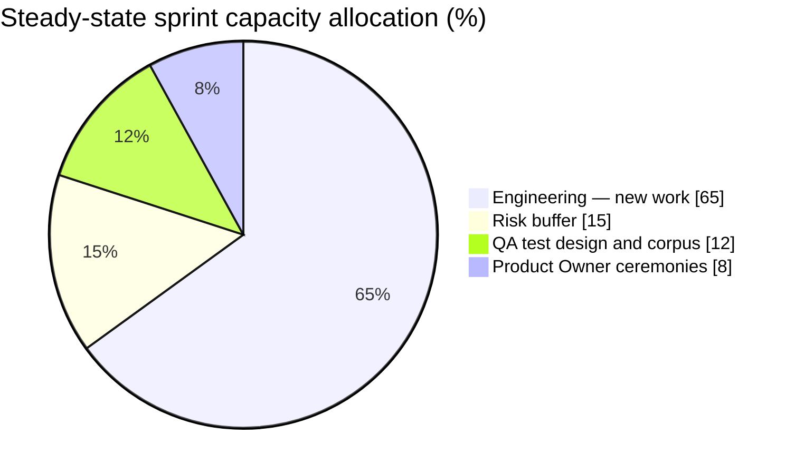
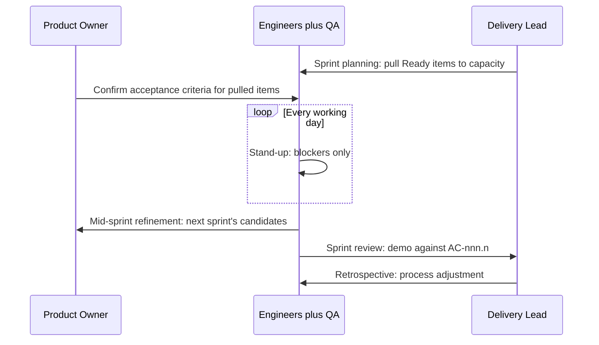

# 36 Sprint Planning

> Sprint cadence, team capacity model, the Horizon 0 platform-upgrade sprint sequence, the Horizon 1
> sprint map, Definition of Ready, risk buffers, spike policy, and the fitment-corpus feature-freeze
> gate for Check Engine delivery.

**Status:** Review · **Owner:** Delivery Lead · **Last revised:** 2026-07-28

**Engineering status (2026-08-25):** Plugin `0.104.0` is in tree. Progress, evidence gates (G1–G6 done; G11 packing partial), and remaining blockers (H1.35/G8, G7, G11 vendor signing, G12) are recorded in [EXECUTION-PLAN.md](../EXECUTION-PLAN.md). This document remains the specification baseline.

---

## Contents

- [Executive Summary](#executive-summary)
- [Objectives](#objectives)
- [Scope](#scope)
- [Detailed Specifications](#detailed-specifications)
  - [Sprint cadence and ceremonies](#sprint-cadence-and-ceremonies)
  - [Team capacity model](#team-capacity-model)
  - [Horizon 0 — platform upgrade sprints](#horizon-0--platform-upgrade-sprints)
  - [Horizon 1 — foundation sprint map](#horizon-1--foundation-sprint-map)
  - [Sequencing rationale](#sequencing-rationale)
  - [Definition of Ready](#definition-of-ready)
  - [Definition of Done — sprint-level addenda](#definition-of-done--sprint-level-addenda)
  - [Risk buffers](#risk-buffers)
  - [Spike policy](#spike-policy)
  - [Feature freeze policy](#feature-freeze-policy)
- [Architecture](#architecture)
- [User Stories](#user-stories)
- [Acceptance Criteria](#acceptance-criteria)
- [Future Enhancements](#future-enhancements)
- [References](#references)

---

## Executive Summary

Check Engine is delivered in **two-week sprints** by one cross-functional team: four engineers, one
shared Product Owner, and one shared QA engineer. Twenty sprints carry the product from an empty
4.60.4 host tree to a Horizon 1 general-availability candidate: four Horizon 0 platform-upgrade
sprints (`S0.1`–`S0.4`), then sixteen Horizon 1 foundation sprints (`S1.01`–`S1.16`).

Takeaways:

1. **Horizon 0 is not optional runway.** Four sprints move the host from 4.60.4 to 4.90.6 one major
   version at a time before a single line of Check Engine code is written (`ADR-001`).
2. **Sequencing follows the dependency graph, not the deliverable list order.** Vehicle, VIN, and OEM
   run largely in parallel once scaffolding lands; the import pipeline starts as soon as OEM matching
   is viable, because it is the critical path to a sellable catalog (`RISK-02`), not because it is late
   in any deliverable table.
3. **Capacity is 40–50 points a sprint at steady state**, for four engineers only. The Product Owner
   and QA engineer are shared, sized in allocation percentage, and do not carry story points.
4. **There is no calendar-triggered feature freeze.** Horizon 1 closes when the fitment accuracy corpus
   passes at 100% on the Must set, per [35 Testing Strategy](35-testing-strategy.md#fitment-accuracy-corpus)
   — not when `S1.16` ends on the plan.
5. **This document sequences; it does not rank.** Item-level ordering and story points live in
   [37 Product Backlog](37-product-backlog.md); this document maps that ordered backlog onto sprints.

---

## Objectives

| # | Objective | Traces to | Measure |
|---|---|---|---|
| 1 | Define sprint length, ceremonies, and capacity model | `BR-012`, `BR-036` | This document, adopted at kickoff retro |
| 2 | Sequence Horizon 0 into an executable sprint plan | `ROADMAP.md` Horizon 0, `ADR-001` | `S0.1`–`S0.4` table below |
| 3 | Sequence Horizon 1 into an executable sprint plan | `ROADMAP.md` Horizon 1 exit criteria | `S1.01`–`S1.16` table below |
| 4 | Align Definition of Ready/Done with TDD | `ADR-015`, [CONTRIBUTING.md](../CONTRIBUTING.md#definition-of-done) | Sprint review checklist |
| 5 | Make the fitment-corpus release gate explicit and non-calendar | `RISK-01`, `RISK-10` | No sprint marks Horizon 1 "done" while the corpus is red |

---

## Scope

### In scope

- Sprint length, ceremony cadence, and capacity model for the full delivery team
- Horizon 0 (platform upgrade) sprint-by-sprint plan
- Horizon 1 (foundation, v1.0) sprint-by-sprint map
- Definition of Ready, sprint-level Definition of Done addenda, risk buffer policy, spike policy, and
  the feature-freeze gate

### Out of scope

| Not covered | Where |
|---|---|
| Item-level ranking, points, and dependencies | [37 Product Backlog](37-product-backlog.md) |
| Epic definitions and traceability to requirements | [38 Epics](38-epics.md) |
| Story-level acceptance criteria | [40 Acceptance Criteria](40-acceptance-criteria.md) |
| Release gating, versioning, and go-to-market sequencing | [41 Release Plan](41-release-plan.md) |
| Horizon 2–5 sprint decomposition | Planned per-horizon addendum, not written until the preceding horizon's exit criteria are met (`ROADMAP.md#roadmap-governance`) |

### Assumptions

- The team is staffed at the levels in [Team capacity model](#team-capacity-model) from `S0.1`. A
  smaller team stretches the sprint count proportionally; it does not compress the dependency graph.
- Sprint numbering (`S0.n`, `S1.nn`) is a sequence identifier, not a calendar commitment. The calendar
  start date is fixed at kickoff and recorded in the sprint tracker, not in this document, so that a
  slipped sprint does not require a documentation change.
- One sprint of onboarding and environment setup precedes `S0.1` and is not numbered; it has no
  points target.

### Dependencies

[ROADMAP.md](../ROADMAP.md), [CONTRIBUTING.md](../CONTRIBUTING.md), [32 Deployment](32-deployment.md),
[35 Testing Strategy](35-testing-strategy.md), [37 Product Backlog](37-product-backlog.md),
[41 Release Plan](41-release-plan.md).

---

## Detailed Specifications

### Sprint cadence and ceremonies

Sprint length is **two weeks**, fixed for the life of Horizon 0 and Horizon 1. A shorter cycle was
evaluated and rejected — see [Rejected alternatives](#rejected-alternatives).

| Ceremony | Cadence | Attendees | Purpose |
|---|---|---|---|
| Sprint planning | Day 1, up to 2 hours | Full team | Pull ranked, Ready items from [37](37-product-backlog.md) up to capacity |
| Daily stand-up | Every working day, 15 minutes | Engineers, QA | Blockers, not status theatre |
| Backlog refinement | Weekly, up to 1 hour, mid-sprint | Engineers, PO, QA | Ready the next 1–2 sprints' worth of items (see [37](37-product-backlog.md#backlog-refinement-cadence)) |
| Sprint review / demo | Last day, up to 1 hour | Full team, stakeholders | Demo working software against `AC-nnn.n`; nothing undemonstrated is claimed done |
| Sprint retrospective | Last day, up to 1 hour | Full team | Process adjustment; feeds the risk buffer and spike-policy tuning below |

### Team capacity model

| Role | Headcount | Allocation | Carries story points | Notes |
|---|---|---|---|---|
| Engineer | 4 | 100% | Yes | Mixed backend/frontend; fitment, VIN, and OEM stories require a domain ramp-up documented in [12](12-vehicle-database.md)–[15](15-fitment-engine.md) |
| Product Owner | 1 (shared) | ~20% | No | Backlog refinement, acceptance sign-off, sprint review, stakeholder demo |
| QA engineer | 1 (shared) | ~50% | Partial — only dedicated test-design or corpus-curation stories | Fitment corpus curation, manual verification protocols ([35](35-testing-strategy.md#manual-verification-protocols)), RTL and axe checks |

At an average of 10–12.5 points per engineer per two-week sprint, steady-state **team capacity is
40–50 points**. Two adjustments apply:

| Sprint condition | Capacity adjustment | Reason |
|---|---|---|
| `S0.1`–`S0.2` (platform upgrade start) | 30–35 points | Environment setup, unfamiliar host code paths, host-test-suite triage |
| `S1.01`–`S1.02` (scaffolding start) | 35–40 points | Plugin skeleton and CI stand-up compete with story throughput |
| `S1.06`, `S1.14` (fitment core, ERP sync) | 40–45 points, 15–20% buffer | Highest domain and external-dependency risk in Horizon 1 — see [Risk buffers](#risk-buffers) |
| `S1.16` (hardening) | 35–40 points, QA-weighted | Deliberately biased toward defect burn-down and corpus work over new stories |

The pie shows *allocation of team attention*, not story points; only the engineering and buffer shares
convert to the 40–50 point figure above.

### Horizon 0 — platform upgrade sprints

Four sprints, matching the four steps specified in
[32 Deployment — platform upgrade track](32-deployment.md#platform-upgrade-track). No Check Engine
feature work starts before `S0.4` closes (`ADR-001`).

| Sprint | Step | Focus | Exit gate |
|---|---|---|---|
| `S0.1` | 0.1 | Host 4.60.4 → 4.70, .NET 7 → .NET 8; service-registration and nullable-reference fallout | Host test suite green on 4.70; sample plugin installs |
| `S0.2` | 0.2 | Host 4.70 → 4.80, .NET 8 → .NET 9; namespace and API refactor fallout from the platform's architecture cleanup | Host test suite green on 4.80; sample plugin installs |
| `S0.3` | 0.3 | Host 4.80 → 4.90.6; admin area and view-component adjustments | Host test suite green on 4.90.6; sample plugin installs |
| `S0.4` | 0.4 | Full regression against the platform suite; CI skeleton for the coming plugin repo; upgrade runbook written | Regression green; runbook executable by someone who did not perform the upgrade; `S1.01` can start |

Each sprint backs up the database and application files before its hop and does not proceed to the
next hop until its own gate is green (`RISK-03`). A hop that fails its gate extends that sprint rather
than carrying failure forward — see [Risk buffers](#risk-buffers).

### Horizon 1 — foundation sprint map

Sixteen sprints deliver the Horizon 1 exit criteria in
[ROADMAP.md](../ROADMAP.md#horizon-1--foundation). The map below sequences epics onto sprints; the
ranked item list that fills each sprint is [37 Product Backlog](37-product-backlog.md).

| Sprint | Epics in focus | What lands |
|---|---|---|
| `S1.01` | `EP-02` Scaffolding | Four-project plugin skeleton, `INopStartup` composition root, empty FluentMigrator baseline, install/uninstall round-trip, CI build+unit+architecture-test gates |
| `S1.02` | `EP-03` Vehicle | Vehicle hierarchy schema and domain aggregates, admin CRUD, brand-agnostic seed loader |
| `S1.03` | `EP-03` Vehicle (completion), `EP-04` VIN (start) | Vehicle tree caching; VIN value object and check-digit validation begin — first parallel track opens |
| `S1.04` | `EP-04` VIN, `EP-05` OEM (parallel) | VIN decoder skeleton and confidence model on one track; OEM registry schema and normalisation on the other, staffed by two engineer pairs |
| `S1.05` | `EP-05` OEM (completion), `EP-09` Import (start) | OEM supersession and cross-reference complete; import pipeline extraction, normalisation, and duplicate-detection stages start **early, as the critical path** (`RISK-02`), not after fitment |
| `S1.06` | `EP-06` Fitment (core) | Fitment claim aggregate, qualifiers, production-date-window evaluation, fail-closed algorithm — highest domain risk in the horizon |
| `S1.07` | `EP-06` Fitment (completion), `EP-09` Import (continued) | Confidence scoring, provenance, human review queue; import OEM-matching and vehicle-matching stages, which depend on the fitment and OEM foundations just landed |
| `S1.08` | `EP-09` Import (completion), `EP-10` Images | Enrichment/translation/SEO-generation hooks, categorisation, publication with dry-run; image sourcing, derivatives, CDN, placeholder strategy |
| `S1.09` | `EP-07` Search (core) | Unified query contract; VIN, OEM, vehicle-tree, category, and keyword modes over the now-populated catalog |
| `S1.10` | `EP-07` Search (completion), `EP-08` Garage | Arabic-English bilingual index, ranking, faceting, zero-result recovery; garage aggregate, guest-to-account migration, active-vehicle scoping |
| `S1.11` | `EP-11` Theme (start), `EP-12` L10n/RTL (start) | Layout system, mega menu, vehicle selector; resource-key structure and the RTL logical-CSS foundation |
| `S1.12` | `EP-11` Theme (completion), `EP-12` L10n/RTL (completion) | Garage widget, sticky search, product-page fitment band, landing templates; mirrored icons, Arabic typography, locale-formatted numerals/dates |
| `S1.13` | `EP-13` SEO | Vehicle and part landing generation, structured data, URL architecture and hreflang, sitemap index, Core Web Vitals gate |
| `S1.14` | `EP-14` ERPNext | Bi-directional product/inventory/customer/order/invoice/returns sync, conflict resolution, retry and idempotency, reconciliation reporting — highest external-dependency risk |
| `S1.15` | `EP-15` Security, `EP-16` Licence, `EP-17` Regional plugins | AuthN/AuthZ and permission model, OWASP control pass, rate limiting, licence activation and entitlement (`ADR-009`), Paymob and Bosta reference plugins |
| `S1.16` | Hardening and buffer | Full regression, fitment corpus run to Must-set green, performance and load testing against [29](29-performance.md) budgets, RC candidate cut |

### Sequencing rationale

Two questions come up whenever this map is reviewed, answered once here rather than in every sprint
planning session.

**Why does the deliverable order list fitment before import, but import starts in `S1.05`, before
fitment's own sprint `S1.06`?**
Because the *deliverable list* states relative completeness, not start order. Import's early stages —
extraction, normalisation, duplicate detection, and OEM matching — depend on the vehicle and OEM
foundations laid by `S1.04`, not on the fitment engine. Only import's later stages (vehicle matching
against confirmed configurations, and the fitment-candidate proposals it emits for review) need
fitment to exist, and those land in `S1.07`, after fitment's core in `S1.06`. Starting import's
front-end stages two sprints earlier is exactly what "critical path" means in practice: the pipeline
that has no value until it produces a sellable catalog gets its longest lead time.

**Why are VIN and OEM parallelisable but vehicle is not?**
Vehicle is the root of the hierarchy that both VIN decoding and OEM cross-referencing key against; the
domain model in [11](11-domain-model.md) makes vehicle configurations a precondition for both. Once
that root exists, VIN decoding (a parsing and confidence problem) and OEM registry management (a
normalisation and supersession problem) touch almost disjoint code paths and can be staffed as two
engineer pairs from `S1.04` without contention.

### Definition of Ready

A backlog item may be pulled into sprint planning only when all of the following hold. An item failing
any row stays in refinement.

| Criterion | Detail |
|---|---|
| Identified in [37](37-product-backlog.md) | Ranked, with epic, horizon, and dependency fields populated |
| Traceable | Maps to at least one `FR-nnn` or `NFR-nnn`; a story-level item also has a draft `US-nnn` and at least one `AC-nnn.n` once [38](38-epics.md)–[40](40-acceptance-criteria.md) exist |
| Sized | Story-pointed by the team that will build it, not estimated solo by the Product Owner |
| Unblocked | No dependency in the Notes column of [37](37-product-backlog.md) is still open |
| UX-ready if user-facing | Mockup or wireframe attached for any customer-visible change, in both LTR and RTL where the surface is shared ([23](23-ux-guidelines.md)) |
| Domain-flagged if applicable | Vehicle, VIN, OEM, or fitment items are flagged for domain review per [CONTRIBUTING.md](../CONTRIBUTING.md#automotive-domain-accuracy) before the sprint starts, not discovered mid-sprint |

### Definition of Done — sprint-level addenda

The authoritative Definition of Done is
[CONTRIBUTING.md — Definition of done](../CONTRIBUTING.md#definition-of-done); every item pulled into
a sprint is held to it in full, including **TDD (`ADR-015`)** as the required development method, not
an optional practice. This document adds only what is specific to the sprint boundary:

| Addendum | Detail |
|---|---|
| Demoed | Shown working at sprint review against its `AC-nnn.n`, not described |
| Corpus regression | Any story touching fitment, VIN, or OEM logic runs the fitment accuracy corpus subset for its area before the sprint closes ([35](35-testing-strategy.md#fitment-accuracy-corpus)) |
| Burndown reconciled | Points delivered reconciled against points pulled; a story split mid-sprint is re-pointed, not silently absorbed |
| Carry-over is not automatic | A story not done at sprint close returns to refinement for re-estimation, since "90% done" is not a story-point concept |

### Risk buffers

Every sprint reserves **10% of engineering capacity** (roughly 4–5 points at steady state) unallocated
at planning time, absorbing defect fallout and estimation error without displacing committed work. Three
sprints reserve **15–20%** because their risk is structural rather than a general estimation margin:

| Sprint | Buffer | Reason |
|---|---|---|
| `S1.06` | 20% | Fitment core; the product's highest-consequence domain logic (`RISK-01`, `RISK-10`) |
| `S1.14` | 20% | ERPNext sync; external API behaviour outside the team's control (`RISK-08`) |
| `S1.16` | Structural — see [Feature freeze policy](#feature-freeze-policy) | Hardening sprint is buffer by design, not buffer on top of a plan |

An unused buffer is not reassigned to new feature work mid-sprint; it is either returned to the backlog
unspent or absorbed by the retrospective's process-improvement actions.

### Spike policy

A **spike** is time-boxed technical investigation with no committed production outcome, used when a
story cannot be pointed with confidence — commonly the first VIN decoder for a new manufacturer, or an
unfamiliar ERPNext endpoint.

| Rule | Detail |
|---|---|
| Branch | `spike/*`, per [CONTRIBUTING.md — branching model](../CONTRIBUTING.md#branching-model) |
| Time box | One sprint maximum, agreed at planning, sized as a fixed capacity allocation (typically 3–5 points) rather than an open-ended task |
| Cadence | At most one active spike per engineer at a time; spikes do not stack |
| Output | A decision recorded in the sprint review — proceed, reject, or escalate to an architecture review if it touches an `ADR` — never a silent extension |
| Merge | Code from a spike is **rewritten under TDD** before it reaches `develop`; a spike branch is never merged as-is ([CONTRIBUTING.md — Test-Driven Development](../CONTRIBUTING.md#test-driven-development)) |

### Feature freeze policy

Horizon 1 does **not** freeze on a sprint number. It freezes when the fitment accuracy corpus Must set
reaches a 100% pass rate against the reference dataset, per
[35 Testing Strategy — fitment accuracy corpus](35-testing-strategy.md#fitment-accuracy-corpus) and the
Horizon 1 exit criteria in [ROADMAP.md](../ROADMAP.md#horizon-1--foundation).

- `S1.16` is planned as the hardening sprint, but if the corpus is still red at its close, the response
  is an **additional hardening sprint**, not a freeze declaration against a failing corpus and not a
  scope cut to force a green result by deleting hard cases.
- New feature work may continue in parallel with corpus hardening only where it does not touch
  fitment, VIN, or OEM logic; anything that does joins the hardening effort instead.
- This mirrors `RISK-01`: curated fitment data proving inaccurate at scale is the single risk most
  capable of destroying the product's commercial credibility, so the release gate is evidence-based,
  never date-based.

---

## Architecture

The sprint map is a scheduling artefact over the epic dependency graph. The diagram states the
compressed dependency chain that the sprint table above expands sprint by sprint.

```mermaid
flowchart LR
    H0["S0.1 to S0.4<br/>Platform upgrade<br/>4.60 to 4.90.6"]
    SC["S1.01<br/>Scaffolding"]
    VDB["S1.02 to S1.03<br/>Vehicle database"]
    PAR["S1.03 to S1.04<br/>VIN and OEM<br/>parallel tracks"]
    IMP1["S1.05<br/>Import starts<br/>critical path"]
    FIT["S1.06 to S1.07<br/>Fitment engine"]
    IMP2["S1.08<br/>Import completes<br/>plus Images"]
    SRCH["S1.09 to S1.10<br/>Search plus Garage"]
    THM["S1.11 to S1.12<br/>Theme plus RTL"]
    SEO["S1.13<br/>SEO"]
    ERP["S1.14<br/>ERPNext sync"]
    SEC["S1.15<br/>Security, licence,<br/>regional plugins"]
    HARD["S1.16<br/>Hardening and buffer"]

    H0 --> SC --> VDB --> PAR --> IMP1 --> FIT --> IMP2 --> SRCH --> THM --> SEO --> ERP --> SEC --> HARD

    style H0 fill:#6e7781,color:#fff
    style FIT fill:#0066B1,color:#fff
    style IMP1 fill:#9a6700,color:#fff
    style HARD fill:#1a7f37,color:#fff
```

The single unbranched chain understates real-world overlap between adjacent sprints (refinement for
sprint *n+1* runs inside sprint *n*), but it correctly shows that nothing in this plan allows Horizon 1
scope to begin before Horizon 0 closes, and that import's critical-path start (amber) sits ahead of
fitment's own completion (blue) rather than behind it.

The ceremony cadence within a single sprint is the same regardless of which epics are in focus:

### Rejected alternatives

| Alternative | Rejected because |
|---|---|
| One-week sprints | Ceremony overhead consumes a disproportionate share of a four-engineer team's capacity, and fitment-domain stories rarely resolve inside five working days |
| Four-week sprints | Feedback loop too slow for a horizon carrying this much sequencing risk; a wrong turn in `S1.06` would compound for a month before review caught it |
| Pure Kanban, no sprint boundary | The Horizon 0 platform upgrade has hard sequential gates (`RISK-03`) that benefit from a fixed checkpoint; Kanban's continuous flow model is reconsidered for Horizon 3 marketplace once the delivery cadence is proven |
| Calendar-based feature freeze for Horizon 1 | Freezing on a date rather than the fitment corpus result reintroduces exactly the risk `RISK-01` exists to prevent — see [Feature freeze policy](#feature-freeze-policy) |

---

## User Stories

| ID | Persona | Story | Points | Priority |
|---|---|---|---|---|
| `US-771` | Delivery Lead | Plan a sprint by pulling Ready items from the ranked backlog up to team capacity | 3 | Must |
| `US-772` | Engineer | Know before planning whether a fitment/VIN/OEM story requires domain review | 2 | Must |
| `US-773` | Product Owner | See a sprint's demo mapped to the acceptance criteria it claims to satisfy | 3 | Must |
| `US-774` | QA engineer | See the fitment corpus pass rate trend across sprints, not only at release candidate | 5 | Must |

---

## Acceptance Criteria

**`AC-36.1`** — Ready gate enforced
Given an item lacking a populated dependency field in [37](37-product-backlog.md), when sprint
planning runs, then the item is not pulled into the sprint.

**`AC-36.2`** — Horizon 0 sequential gate
Given `S0.2`'s regression suite is red, when the team considers starting `S0.3` work, then `S0.3` does
not start until `S0.2`'s gate is green.

**`AC-36.3`** — Buffer visibility
Given `S1.06` sprint planning, when capacity is allocated, then at least 20% of engineering capacity is
recorded as unallocated buffer before feature items are pulled.

**`AC-36.4`** — Spike time-box
Given a spike branch open longer than one sprint, when the sprint closes, then the spike is either
merged as a rewritten TDD change, explicitly extended with Delivery Lead sign-off, or discarded — it is
never silently carried as "in progress" past the boundary.

**`AC-36.5`** — Corpus-gated freeze
Given the fitment accuracy corpus Must set is below 100% at the close of `S1.16`, when the release
candidate is considered, then Horizon 1 is not declared feature-frozen and an additional hardening
sprint is scheduled instead.

---

## Future Enhancements

| Enhancement | Horizon | Notes |
|---|---|---|
| Velocity-based forecasting from `S0`–`S1` actuals | 2 | Replaces the illustrative 40–50 point figure with a measured range once real throughput exists |
| Cross-team scaling model | 3 | Marketplace horizon likely adds a second team; this document's single-team model does not generalise without a coordination addendum |
| Kanban re-evaluation for maintenance sprints | 2 | Once v1.0 is in support, defect-driven work may fit a continuous-flow model better than fixed sprints |
| Per-horizon sprint-map addenda for Horizons 2–5 | 2–5 | Written only when the preceding horizon's exit criteria are met, per `ROADMAP.md#roadmap-governance` |

---

## References

- [ROADMAP.md](../ROADMAP.md) — horizons, exit criteria, and the platform dependency track
- [CONTRIBUTING.md](../CONTRIBUTING.md) — Definition of Done, TDD (`ADR-015`), branching model, spike exception
- [32 Deployment](32-deployment.md) — platform upgrade track detail (`ADR-001`)
- [35 Testing Strategy](35-testing-strategy.md) — fitment accuracy corpus and coverage thresholds
- [37 Product Backlog](37-product-backlog.md) — ranked items, points, and dependencies that fill this map
- [38 Epics](38-epics.md) — epic definitions this map schedules
- [41 Release Plan](41-release-plan.md) — release gating that consumes this sprint plan's output
- [01 Business Requirements](01-business-requirements.md) — risk register (`RISK-01`–`RISK-14`)
- [29 Performance](29-performance.md) — performance budgets validated in `S1.16`
