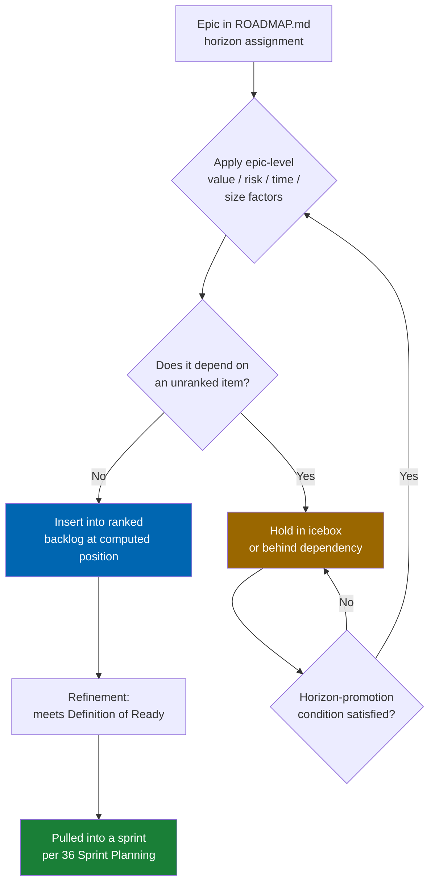
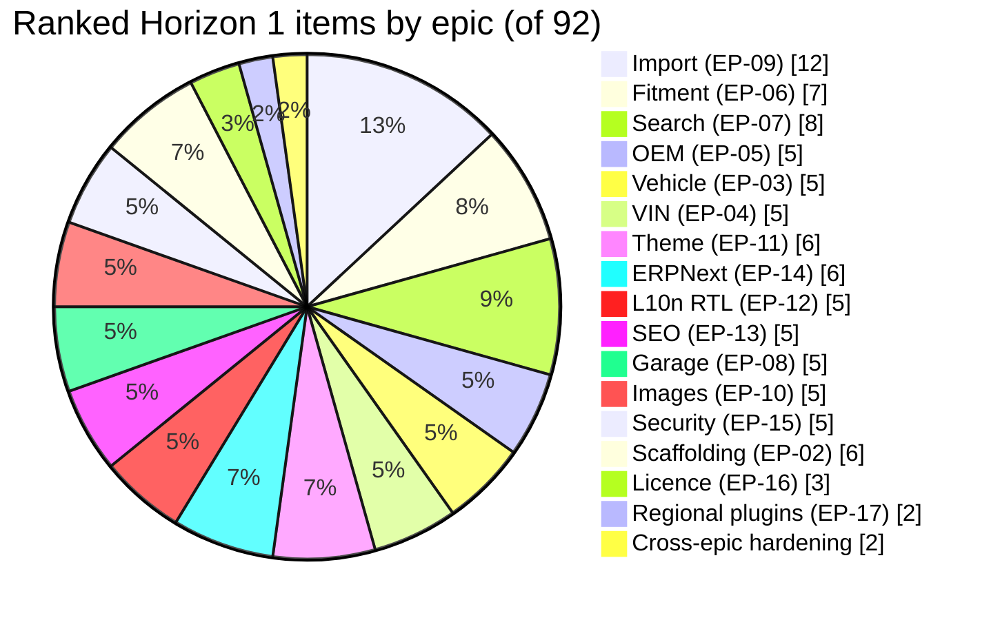

# 37 Product Backlog

> The full epic inventory mapped to horizons, the ordering methodology, the ranked Horizon 0/1 backlog
> with points and dependencies, the refinement cadence, and the icebox for Horizons 2–5.

**Status:** Review · **Owner:** Product Owner · **Last revised:** 2026-07-28

---

## Contents

- [Executive Summary](#executive-summary)
- [Objectives](#objectives)
- [Scope](#scope)
- [Detailed Specifications](#detailed-specifications)
  - [Epic reference](#epic-reference)
  - [Ordering methodology](#ordering-methodology)
  - [Ranked backlog — Horizon 0 and Horizon 1](#ranked-backlog--horizon-0-and-horizon-1)
  - [Backlog refinement cadence](#backlog-refinement-cadence)
  - [Icebox — Horizons 2 to 5](#icebox--horizons-2-to-5)
- [Architecture](#architecture)
- [User Stories](#user-stories)
- [Acceptance Criteria](#acceptance-criteria)
- [Future Enhancements](#future-enhancements)
- [References](#references)

---

## Executive Summary

This document is the single ordered queue of work for Check Engine. It holds **28 epics** (`EP-01`–
`EP-28`) across five horizons, expands the Horizon 0 and Horizon 1 epics into a **96-item ranked
backlog** — the "Must, end-to-end" slice that takes the product from an empty 4.60.4 host tree to a
Horizon 1 release candidate — and iceboxes everything beyond Horizon 1 without discarding it.

Takeaways:

1. **Ranking is dependency-first, value-second.** An item cannot outrank something it structurally
   depends on, regardless of how compelling its business case is in isolation.
2. **Items are epic slices, not fully specified stories.** Full `US-nnn` numbering and `AC-nnn.n`
   criteria are assigned in [38 Epics](38-epics.md)–[40 Acceptance Criteria](40-acceptance-criteria.md)
   as each slice is refined into sprint-ready work; this backlog fixes the *order* and the *size*.
3. **Ordering uses a simplified WSJF**, scored per epic rather than per item, because false per-item
   precision would outrun the confidence of a pre-implementation estimate.
4. **The backlog does not rank Horizon 2–5 items.** They sit in an [icebox](#icebox--horizons-2-to-5)
   with an epic-level rationale, promoted only when [ROADMAP.md](../ROADMAP.md#roadmap-governance)'s
   horizon-promotion rule is satisfied.
5. **This document orders; it does not schedule.** Sprint-by-sprint placement is
   [36 Sprint Planning](36-sprint-planning.md); release-level gating is
   [41 Release Plan](41-release-plan.md).

---

## Objectives

| # | Objective | Traces to | Measure |
|---|---|---|---|
| 1 | Enumerate every epic and its horizon | `ROADMAP.md` product horizons | Epic reference table below, 28 rows |
| 2 | State the ordering methodology so ranking is reproducible, not folklore | `BR-011`, `BR-012` | Documented WSJF-lite factors |
| 3 | Rank the Horizon 0/1 Must slice end to end | `ROADMAP.md#horizon-1--foundation` | 96-item table with dependencies |
| 4 | Define refinement cadence that keeps two sprints of Ready work available | [36](36-sprint-planning.md#definition-of-ready) | Refinement calendar below |
| 5 | Preserve Horizon 2–5 scope without false precision | `ROADMAP.md#roadmap-governance` | Icebox table |

---

## Scope

### In scope

- The complete epic inventory, `EP-01` through `EP-28`, with horizon assignment
- The ordering methodology applied to reach the ranking below
- A ranked, pointed, dependency-annotated backlog covering Horizon 0 and Horizon 1 in full
- The icebox for Horizons 2–5 at epic granularity
- The backlog refinement cadence

### Out of scope

| Not covered | Where |
|---|---|
| Sprint-by-sprint placement of ranked items | [36 Sprint Planning](36-sprint-planning.md) |
| Full `US-nnn` story text and persona detail | [38 Epics](38-epics.md), [39 User Stories](39-user-stories.md) |
| Given/When/Then acceptance criteria | [40 Acceptance Criteria](40-acceptance-criteria.md) |
| Release gating and go-to-market dates | [41 Release Plan](41-release-plan.md) |
| Detailed technical design per epic | The Track 4–7 specification documents (`08`–`35`) |

### Assumptions

- Points in the ranked table are **epic-slice estimates** by the team composition in
  [36 Sprint Planning — team capacity model](36-sprint-planning.md#team-capacity-model); they are
  refined, not replaced, once a slice reaches sprint planning.
- "Dependencies" cites the rank number(s) an item structurally requires, not every item merely related
  to it. A dependency on rank 30 (fitment claim aggregate) is structural; a "relates to search" note
  would not be, and is omitted.
- Priority uses MoSCoW (Must, Should, Could), consistent with every other document in this set.

### Dependencies

[ROADMAP.md](../ROADMAP.md), [36 Sprint Planning](36-sprint-planning.md),
[38 Epics](38-epics.md), [39 User Stories](39-user-stories.md),
[40 Acceptance Criteria](40-acceptance-criteria.md), [41 Release Plan](41-release-plan.md).

---

## Detailed Specifications

### Epic reference

Twenty-eight epics, permanent identifiers per
[CONTRIBUTING.md — requirement and identifier discipline](../CONTRIBUTING.md#requirement-and-identifier-discipline).
Full epic definitions with `FR-nnn` traceability belong in [38 Epics](38-epics.md); this table exists
so the ranking below is self-contained.

| Epic | Name | Horizon | Primary specification |
|---|---|---|---|
| `EP-01` | Platform upgrade | 0 | [32 Deployment](32-deployment.md) |
| `EP-02` | Scaffolding | 1 | [09 Plugin Architecture](09-plugin-architecture.md) |
| `EP-03` | Vehicle | 1 | [12 Vehicle Database](12-vehicle-database.md) |
| `EP-04` | VIN | 1 | [13 VIN Engine](13-vin-engine.md) |
| `EP-05` | OEM | 1 | [14 OEM Engine](14-oem-engine.md) |
| `EP-06` | Fitment | 1 | [15 Fitment Engine](15-fitment-engine.md) |
| `EP-07` | Search | 1 | [16 Search Engine](16-search-engine.md) |
| `EP-08` | Garage | 1 | [20 Customer Garage](20-customer-garage.md) |
| `EP-09` | Import | 1 | [24 Product Import Pipeline](24-product-import-pipeline.md) |
| `EP-10` | Images | 1 | [26 Image Management](26-image-management.md) |
| `EP-11` | Theme | 1 | [21 Theme Design](21-theme-design.md) |
| `EP-12` | L10n RTL | 1 | [23 UX Guidelines](23-ux-guidelines.md) |
| `EP-13` | SEO | 1 | [27 SEO Strategy](27-seo-strategy.md) |
| `EP-14` | ERPNext | 1 | [18 ERPNext Integration](18-erpnext-integration.md) |
| `EP-15` | Security | 1 | [28 Security](28-security.md) |
| `EP-16` | Licence | 1 | [43 Licensing](43-licensing.md) |
| `EP-17` | Regional plugins | 1 | [05 Product Strategy](05-product-strategy.md) |
| `EP-18` | AI abstraction | 2 | [17 AI Architecture](17-ai-architecture.md) |
| `EP-19` | NL search | 2 | [16 Search Engine](16-search-engine.md) |
| `EP-20` | AI content | 2 | [25 AI Content Pipeline](25-ai-content-pipeline.md) |
| `EP-21` | AI recommend/assistant | 2 | [17 AI Architecture](17-ai-architecture.md) |
| `EP-22` | Marketplace onboarding | 3 | [19 Marketplace Module](19-marketplace-module.md) |
| `EP-23` | Commissions | 3 | [19 Marketplace Module](19-marketplace-module.md) |
| `EP-24` | Split cart | 3 | [19 Marketplace Module](19-marketplace-module.md) |
| `EP-25` | Workshop | 4 | [46 Workshop Portal](46-workshop-portal.md) |
| `EP-26` | Fleet | 4 | [47 Fleet Portal](47-fleet-portal.md) |
| `EP-27` | Dealer | 4 | [48 Dealer Portal](48-dealer-portal.md) |
| `EP-28` | SaaS | 5 | [49 SaaS Roadmap](49-saas-roadmap.md) |

### Ordering methodology

Full WSJF (Weighted Shortest Job First) scores a queue of independently deliverable items. Check
Engine's Horizon 0/1 items are not independent — the dependency graph in
[36 Sprint Planning](36-sprint-planning.md#sequencing-rationale) already fixes most of the order — so
this backlog applies a **simplified WSJF at epic granularity**, then lets dependency order settle the
sequence of items within an epic.

| Factor | Question asked | Weight |
|---|---|---|
| Business value | Does this unblock revenue, or a Horizon 1 exit criterion? | High |
| Risk reduction | Does building this early retire a `RISK-nn` register item? | High |
| Time criticality | Does delay compound — does every sprint without this cost more later? | Medium |
| Job size | Engineering effort, inverse-weighted per classic WSJF | Divisor |

Applied at epic level, this is why the order reads as it does rather than as a simple value ranking:

| Epic | Why it ranks where it does |
|---|---|
| `EP-01` Platform upgrade | Zero standalone value, but every later epic depends on it; job size is fixed and time-boxed, so it is scheduled first and only once |
| `EP-09` Import | Lower standalone glamour than search or theme, but retires `RISK-02` (catalog acquisition speed) and is the only source of a non-empty catalog — ranked to start as soon as its dependencies (vehicle, partial OEM) allow, not when the deliverable list would place it |
| `EP-06` Fitment | Highest risk reduction score in the whole backlog (`RISK-01`, `RISK-10`); ranked immediately after the vehicle/VIN/OEM foundation it requires, ahead of anything customer-facing |
| `EP-11` Theme, `EP-13` SEO | High visible value, but time criticality is low relative to the engines beneath them — a beautiful storefront over unverified fitment is a liability, not an asset, so both wait for `EP-06` and `EP-07` |
| `EP-14` ERPNext | Job size and external-dependency risk are both large; scheduled late enough that the catalog and order model it synchronises already exist, early enough that its own risk buffer (`36 Sprint Planning`) still fits inside Horizon 1 |
| `EP-15` Security, `EP-16` Licence | Structurally deferrable in isolation, but the Horizon 1 exit criteria require a clean security review and an operating licence mechanism before general availability, so both are pulled into the hardening tail rather than left for a "later" that a v1.0 release cannot actually have |

This is deliberately **not** a numeric WSJF score per item. A number implies a precision the backlog
does not have before implementation starts; the qualitative table above is checkable and defensible in
review, which a synthetic score to two decimal places would not be.

### Ranked backlog — Horizon 0 and Horizon 1

Ninety-six items, ranked. "Dependencies" cites rank numbers. Points are epic-slice estimates, refined
at sprint planning per [36](36-sprint-planning.md#definition-of-ready).

| Rank | Item | Epic | Horizon | Priority | Points | Dependencies | Notes |
|---|---|---|---|---|---|---|---|
| 1 | Upgrade host 4.60 to 4.70 (.NET 7 to 8) | `EP-01` | 0 | Must | 13 | — | `ADR-001`; regression gate before rank 2 |
| 2 | Upgrade host 4.70 to 4.80 (.NET 8 to 9) | `EP-01` | 0 | Must | 13 | 1 | Regression gate before rank 3 |
| 3 | Upgrade host 4.80 to 4.90.6 | `EP-01` | 0 | Must | 8 | 2 | Regression gate before rank 4 |
| 4 | Full platform regression, runbook, CI skeleton | `EP-01` | 0 | Must | 8 | 3 | Gate before any Check Engine code |
| 5 | Four-project plugin skeleton (Domain/Application/Infrastructure/Host) | `EP-02` | 1 | Must | 8 | 4 | `ADR-007` layering |
| 6 | Composition root via `INopStartup` | `EP-02` | 1 | Must | 5 | 5 | `ADR-012` |
| 7 | FluentMigrator harness and empty schema baseline | `EP-02` | 1 | Must | 5 | 5 | |
| 8 | Install/uninstall lifecycle round-trip | `EP-02` | 1 | Must | 5 | 5, 7 | `FR-925` |
| 9 | CI build, unit, and architecture-test gates | `EP-02` | 1 | Must | 8 | 5 | Feeds [33](33-ci-cd.md) |
| 10 | Options-pattern configuration and secret-handling scaffold | `EP-02` | 1 | Must | 3 | 6 | |
| 11 | Vehicle hierarchy schema, make through trim | `EP-03` | 1 | Must | 8 | 7 | `FR-101` block |
| 12 | Vehicle domain aggregates and invariants | `EP-03` | 1 | Must | 8 | 11 | [11](11-domain-model.md) |
| 13 | Admin CRUD for the vehicle tree | `EP-03` | 1 | Must | 5 | 12 | |
| 14 | Brand-agnostic seed loader, BMW-first dataset | `EP-03` | 1 | Must | 8 | 11 | `ADR-004` |
| 15 | Vehicle tree caching | `EP-03` | 1 | Should | 5 | 12 | [29](29-performance.md) |
| 16 | VIN value object and check-digit validation | `EP-04` | 1 | Must | 5 | 12 | ISO 3779 / 4030 |
| 17 | WMI/VDS/VIS parsing and confidence model | `EP-04` | 1 | Must | 13 | 16 | |
| 18 | Reference decoder plugin, first manufacturer | `EP-04` | 1 | Must | 8 | 17 | |
| 19 | VIN decode API and rate limiting | `EP-04` | 1 | Must | 5 | 17 | [28](28-security.md) |
| 20 | VIN decode graceful failure, Unknown path | `EP-04` | 1 | Must | 3 | 17 | |
| 21 | OEM registry schema and normalisation rules | `EP-05` | 1 | Must | 8 | 12 | [14](14-oem-engine.md) |
| 22 | Cross-reference and aftermarket equivalence | `EP-05` | 1 | Must | 8 | 21 | |
| 23 | Supersession chain, directed and transitive | `EP-05` | 1 | Must | 8 | 21 | |
| 24 | OEM admin linking UI | `EP-05` | 1 | Must | 5 | 21 | |
| 25 | OEM search integration hook | `EP-05` | 1 | Should | 3 | 21 | Consumed by `EP-07` |
| 26 | Import extraction stage, PDF/Excel/CSV parsers | `EP-09` | 1 | Must | 13 | 14, 21 | `RISK-02` critical path |
| 27 | Import normalisation stage | `EP-09` | 1 | Must | 8 | 26 | |
| 28 | Import duplicate-detection stage | `EP-09` | 1 | Must | 8 | 27 | |
| 29 | Import OEM-matching stage | `EP-09` | 1 | Must | 8 | 22, 28 | |
| 30 | Fitment claim aggregate and qualifiers model | `EP-06` | 1 | Must | 13 | 14, 23 | `ADR-006` |
| 31 | Fitment production-date-window evaluation | `EP-06` | 1 | Must | 8 | 30 | |
| 32 | Fitment confidence scoring and provenance record | `EP-06` | 1 | Must | 8 | 30 | `RISK-01` |
| 33 | Fitment fail-closed evaluation algorithm | `EP-06` | 1 | Must | 8 | 31, 32 | Fail-open is a P0 defect class |
| 34 | Fitment human review queue, low-confidence claims | `EP-06` | 1 | Must | 8 | 32 | `ADR-008` |
| 35 | Fitment caching and publish invalidation | `EP-06` | 1 | Should | 5 | 33 | `ADR-013`, `ADR-014` |
| 36 | Import vehicle-matching stage | `EP-09` | 1 | Must | 13 | 14, 30 | |
| 37 | Import AI enrichment stage hook, disabled by default | `EP-09` | 1 | Should | 5 | 27 | `ADR-008` |
| 38 | Import translation stage hook | `EP-09` | 1 | Should | 5 | 37 | |
| 39 | Import SEO-generation stage hook | `EP-09` | 1 | Should | 5 | 37 | Feeds `EP-13` |
| 40 | Import categorisation stage | `EP-09` | 1 | Must | 5 | 27 | |
| 41 | Import image-assignment stage | `EP-09` | 1 | Must | 5 | 40 | Feeds `EP-10` |
| 42 | Import human review stage UI | `EP-09` | 1 | Must | 8 | 29, 36 | `FR-614` |
| 43 | Import publication stage with dry-run mode | `EP-09` | 1 | Must | 8 | 42 | `FR-643`, `FR-645` |
| 44 | Image sourcing and storage pipeline | `EP-10` | 1 | Must | 8 | 41 | |
| 45 | Image derivative generation, responsive sizes | `EP-10` | 1 | Must | 5 | 44 | |
| 46 | Image CDN delivery integration | `EP-10` | 1 | Must | 5 | 45 | |
| 47 | Image placeholder strategy | `EP-10` | 1 | Must | 3 | 44 | |
| 48 | Professional image-replacement workflow | `EP-10` | 1 | Should | 5 | 44 | |
| 49 | Unified search query contract | `EP-07` | 1 | Must | 8 | 33, 43 | [16](16-search-engine.md) |
| 50 | Search: VIN mode integration | `EP-07` | 1 | Must | 5 | 49, 19 | |
| 51 | Search: OEM mode integration | `EP-07` | 1 | Must | 5 | 49, 23 | |
| 52 | Search: vehicle tree, category, and keyword modes | `EP-07` | 1 | Must | 8 | 49, 13 | |
| 53 | Arabic-English bilingual index | `EP-07` | 1 | Must | 8 | 52 | Depends on `EP-12` foundations |
| 54 | Search ranking and faceting | `EP-07` | 1 | Must | 8 | 52 | |
| 55 | Search zero-result recovery path | `EP-07` | 1 | Should | 5 | 52 | |
| 56 | Search index rebuild task and degraded fallback | `EP-07` | 1 | Must | 5 | 49 | |
| 57 | Garage aggregate, saved vehicles/VINs/OEMs | `EP-08` | 1 | Must | 8 | 12, 16 | |
| 58 | Garage guest-to-account migration | `EP-08` | 1 | Must | 8 | 57 | |
| 59 | Garage active-vehicle scoped browsing | `EP-08` | 1 | Must | 8 | 57, 49 | |
| 60 | Garage cross-device persistence | `EP-08` | 1 | Should | 5 | 58 | |
| 61 | Garage admin support view, audited | `EP-08` | 1 | Should | 3 | 57 | |
| 62 | Theme layout system and mega menu | `EP-11` | 1 | Must | 8 | 5 | [21](21-theme-design.md) |
| 63 | Theme garage widget | `EP-11` | 1 | Must | 5 | 57 | |
| 64 | Theme vehicle selector component | `EP-11` | 1 | Must | 5 | 13 | |
| 65 | Theme sticky search bar | `EP-11` | 1 | Must | 5 | 50 | |
| 66 | Theme product-page fitment band | `EP-11` | 1 | Must | 5 | 33 | |
| 67 | Theme landing page templates | `EP-11` | 1 | Should | 5 | 62 | Feeds `EP-13` |
| 68 | L10n resource-key structure and AR/EN parity gate | `EP-12` | 1 | Must | 5 | 5 | |
| 69 | RTL layout, logical CSS properties | `EP-12` | 1 | Must | 8 | 62 | |
| 70 | Mirrored icon set | `EP-12` | 1 | Must | 3 | 69 | |
| 71 | Arabic typography system | `EP-12` | 1 | Must | 5 | 69 | |
| 72 | Numeral, date, and unit locale formatting | `EP-12` | 1 | Must | 3 | 68 | |
| 73 | SEO vehicle and part landing page generation | `EP-13` | 1 | Must | 8 | 39, 67 | |
| 74 | SEO structured data, schema.org | `EP-13` | 1 | Must | 5 | 73 | |
| 75 | SEO URL architecture and hreflang | `EP-13` | 1 | Must | 5 | 73, 68 | |
| 76 | SEO sitemap index including landings | `EP-13` | 1 | Must | 3 | 73 | |
| 77 | SEO Core Web Vitals budget gate | `EP-13` | 1 | Must | 5 | 62 | [29](29-performance.md) |
| 78 | ERPNext product and inventory sync | `EP-14` | 1 | Must | 13 | 40 | |
| 79 | ERPNext customer sync | `EP-14` | 1 | Must | 8 | 78 | |
| 80 | ERPNext order and invoice sync | `EP-14` | 1 | Must | 13 | 78, 79 | |
| 81 | ERPNext returns and shipments sync | `EP-14` | 1 | Should | 8 | 80 | |
| 82 | ERPNext conflict resolution, retry, idempotency | `EP-14` | 1 | Must | 8 | 78 | `RISK-08` |
| 83 | ERPNext reconciliation report | `EP-14` | 1 | Must | 5 | 80 | |
| 84 | AuthN/AuthZ and permission model | `EP-15` | 1 | Must | 8 | 5 | |
| 85 | OWASP Top Ten control pass | `EP-15` | 1 | Must | 8 | 84 | |
| 86 | Rate limiting, VIN decode and search | `EP-15` | 1 | Must | 5 | 19, 49 | |
| 87 | Secrets management | `EP-15` | 1 | Must | 5 | 10 | |
| 88 | Audit logging | `EP-15` | 1 | Must | 5 | 84 | [31](31-logging.md) |
| 89 | Licence activation mechanism | `EP-16` | 1 | Must | 8 | 5 | `ADR-009` |
| 90 | Licence entitlement enforcement, never blocks storefront | `EP-16` | 1 | Must | 8 | 89 | `ADR-009` |
| 91 | Licence grace/degraded-mode heartbeat task | `EP-16` | 1 | Must | 5 | 90 | |
| 92 | Paymob reference payment plugin | `EP-17` | 1 | Should | 8 | 5 | `ADR-005` isolation |
| 93 | Bosta reference shipping plugin | `EP-17` | 1 | Should | 8 | 5 | `ADR-005` isolation |
| 94 | Fitment accuracy corpus build-out, 200+ Must cases | `EP-06` | 1 | Must | 13 | 33 | `RISK-01`, [35](35-testing-strategy.md) |
| 95 | Full regression plus performance/load test at reference scale | Cross-epic | 1 | Must | 8 | 94, 77, 83 | [29](29-performance.md) |
| 96 | Release candidate cut and Horizon 1 exit checklist sign-off | Cross-epic | 1 | Must | 5 | 95 | Consumed by [41](41-release-plan.md) |

Total points for ranks 1–96 sum to approximately 660, which cross-checks against
[36 Sprint Planning](36-sprint-planning.md#team-capacity-model)'s twenty sprints: four Horizon 0
sprints at a 30–45 point ramp plus sixteen Horizon 1 sprints at 35–50 points span roughly 730–860
points of raw capacity, comfortably covering this backlog once the 10–20% risk buffers that document
reserves are set aside.

### Backlog refinement cadence

| Cadence | Activity | Owner |
|---|---|---|
| Weekly, mid-sprint | Engineers, Product Owner, and QA ready the next 1–2 sprints' items against [36's Definition of Ready](36-sprint-planning.md#definition-of-ready) | Product Owner convenes |
| Every sprint boundary | Re-rank check: has a dependency changed, has a risk in [01](01-business-requirements.md#risk-register) moved, does the WSJF-lite rationale still hold | Product Owner, Delivery Lead |
| Each horizon close | Full re-score of the icebox: does any Horizon 2–5 epic's promotion condition now hold | Product Owner, per `ROADMAP.md#roadmap-governance` |
| On new information | An unplanned dependency, a failed spike, or a corpus regression triggers an out-of-cycle re-rank rather than waiting for the next scheduled point | Whoever discovers it, raised at the next stand-up |

Re-ranking never changes an identifier. A re-ranked item keeps its row; only its rank number, points,
or dependency notes move, consistent with
[CONTRIBUTING.md's identifier discipline](../CONTRIBUTING.md#requirement-and-identifier-discipline).

### Icebox — Horizons 2 to 5

Not ranked at item level. Each epic below is promoted to ranked-item status only when
[ROADMAP.md](../ROADMAP.md#roadmap-governance)'s horizon-promotion rule holds: its dependencies are
already satisfied and its exit criteria are testable. Promoting early does not compress the graph; it
only moves risk earlier.

| Epic | Horizon | Promotion condition |
|---|---|---|
| `EP-18` AI abstraction | 2 | Horizon 1 exit criteria met; provider abstraction has no dependency on Horizon 1 UI, so its design may start in Horizon 1's tail as a spike, never as a shipped feature (`ADR-008`) |
| `EP-19` NL search | 2 | `EP-18` provider abstraction and `EP-07` deterministic search both shipped and stable — natural-language search resolves to the same query contract |
| `EP-20` AI content | 2 | `EP-18` shipped; content review workflow ([25](25-ai-content-pipeline.md)) exists and is exercised by the Horizon 1 import pipeline's human reviewers |
| `EP-21` AI recommend/assistant | 2 | `EP-18` and `EP-06` (fitment) shipped — every recommendation is fitment-constrained, so fitment must already be authoritative |
| `EP-22` Marketplace onboarding | 3 | Horizon 2 exit criteria met; single-supplier catalog, order, and fitment models proven at scale first |
| `EP-23` Commissions | 3 | `EP-22` onboarding flow exists; commission calculation has a vendor and order model to calculate against |
| `EP-24` Split cart | 3 | `EP-22` and `EP-23` shipped; split orders require a settled multi-vendor order model, not a checkout-only feature |
| `EP-25` Workshop | 4 | Horizon 3 exit criteria met; the vehicle and fitment engines are reused with no forked logic (`ROADMAP.md#horizon-4--verticals`) |
| `EP-26` Fleet | 4 | `EP-25` portal pattern proven; fleet reuses the same core-engine-reuse discipline |
| `EP-27` Dealer | 4 | `EP-25` and `EP-26` portal pattern proven |
| `EP-28` SaaS | 5 | Horizon 4 exit criteria met; multi-tenancy is a platform change, not a feature, and is not attempted underneath a still-changing vertical portal set |

---

## Architecture

The backlog is a queue with a promotion gate at its tail, not a flat prioritised list. The diagram
states how an icebox epic becomes a ranked item, and the ranking flow that produces the table above.

The ranked Horizon 0/1 backlog, by epic, shows where the 96 items concentrate. Import, fitment, and
search together account for nearly a third of the Horizon 1 slice, which is the numeric expression of
the sequencing rationale in [36 Sprint Planning](36-sprint-planning.md#sequencing-rationale).

### Rejected alternatives

| Alternative | Rejected because |
|---|---|
| Numeric WSJF score per item | False precision before implementation; the qualitative epic-level table is equally reproducible and more honestly uncertain |
| Ranking by business value alone | Would place the theme and SEO ahead of fitment, shipping a fast, beautiful storefront over unverified compatibility claims — the exact failure mode `RISK-01` exists to prevent |
| A single flat backlog spanning all five horizons | Produces false confidence about Horizon 3–5 sizing before Horizon 1's actuals exist to calibrate against; the icebox keeps the scope visible without pretending it is estimated |
| Re-ranking on every stand-up | Thrashes the plan without new information; re-ranking is triggered by an event (sprint boundary, horizon close, new information), not a clock |

---

## User Stories

| ID | Persona | Story | Points | Priority |
|---|---|---|---|---|
| `US-781` | Product Owner | See the full ranked Horizon 1 backlog on one page with dependencies visible | 3 | Must |
| `US-782` | Delivery Lead | Confirm an item is not pulled into a sprint while its dependency rank is still open | 3 | Must |
| `US-783` | Engineer | Understand why an epic ranks where it does, not just that it does | 2 | Should |
| `US-784` | Product Owner | Re-rank the icebox at a horizon close without renumbering any epic | 3 | Must |
| `US-785` | Stakeholder | See the WSJF-lite rationale for a deferred, high-visibility item like theme or SEO | 2 | Should |

---

## Acceptance Criteria

**`AC-37.1`** — Epic coverage
Given the epic reference table, when checked against the epic identifiers supplied for this document
set, then all of `EP-01` through `EP-28` appear exactly once with a horizon assignment.

**`AC-37.2`** — Dependency ordering
Given the ranked backlog, when any row's dependency column is checked, then every cited rank number is
strictly less than the row's own rank.

**`AC-37.3`** — No orphaned Must item
Given a Horizon 1 exit criterion in [ROADMAP.md](../ROADMAP.md#horizon-1--foundation), when the ranked
backlog is reviewed, then at least one Must-priority ranked item traces to it.

**`AC-37.4`** — Icebox promotion traceability
Given an icebox epic is promoted, when its ranked items are added, then the icebox row is updated to
reference the ranked range rather than deleted, preserving the identifier's history.

**`AC-37.5`** — Identifier permanence
Given a re-ranking event, when the backlog is updated, then no epic or item identifier changes — only
rank, points, or dependency annotations move.

---

## Future Enhancements

| Enhancement | Horizon | Notes |
|---|---|---|
| Per-item WSJF once Horizon 1 velocity is measured | 2 | Numeric scoring becomes defensible once real cycle-time data exists |
| Automated dependency-graph validation in CI | 2 | Machine-check `AC-37.2` instead of manual review, alongside the traceability checks in [33 CI-CD](33-ci-cd.md) |
| Cross-team backlog partitioning | 3 | Marketplace horizon likely needs a second ranked queue coordinated against this one |
| Customer-visible public roadmap view | 2 | A filtered, non-confidential projection of this backlog for licensed customers |

---

## References

- [ROADMAP.md](../ROADMAP.md) — horizons, exit criteria, and roadmap governance
- [36 Sprint Planning](36-sprint-planning.md) — capacity model and sprint-level placement of this backlog
- [38 Epics](38-epics.md) — full epic definitions and `FR-nnn` traceability
- [39 User Stories](39-user-stories.md) — full story inventory once epic slices are refined
- [40 Acceptance Criteria](40-acceptance-criteria.md) — Given/When/Then criteria per story
- [41 Release Plan](41-release-plan.md) — release-level gating consuming this backlog's Horizon 1 slice
- [01 Business Requirements](01-business-requirements.md) — risk register (`RISK-01`–`RISK-14`)
- [CONTRIBUTING.md](../CONTRIBUTING.md) — identifier discipline and Definition of Ready inputs
