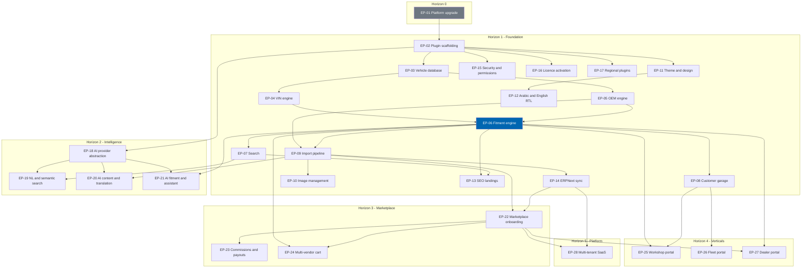

# 38 Epics

> The epic inventory `EP-01`–`EP-28`, each mapped to a delivery horizon, the business requirements it
> discharges, its functional requirement range, and the criteria that close it.

**Status:** Review · **Owner:** Product Owner · **Last revised:** 2026-08-25

**Engineering status (2026-08-25):** Plugin `0.104.0` is in tree. Progress, evidence gates (G1–G6 done; G11 packing partial), and remaining blockers (H1.35/G8, G7, G11 vendor signing, G12) are recorded in [EXECUTION-PLAN.md](../EXECUTION-PLAN.md). This document remains the specification baseline.

---

## Contents

- [Executive Summary](#executive-summary)
- [Objectives](#objectives)
- [Scope](#scope)
- [Detailed Specifications](#detailed-specifications)
  - [What an epic is](#what-an-epic-is)
  - [Epic index](#epic-index)
  - [Horizon 0 — Platform upgrade](#horizon-0--platform-upgrade)
  - [Horizon 1 — Foundation](#horizon-1--foundation)
  - [Horizon 2 — Intelligence](#horizon-2--intelligence)
  - [Horizon 3 — Marketplace](#horizon-3--marketplace)
  - [Horizon 4 — Verticals](#horizon-4--verticals)
  - [Horizon 5 — Platform](#horizon-5--platform)
  - [Coverage check](#coverage-check)
- [Architecture](#architecture)
- [User Stories](#user-stories)
- [Acceptance Criteria](#acceptance-criteria)
- [Future Enhancements](#future-enhancements)
- [References](#references)

---

## Executive Summary

This document is the bridge between requirement and delivery. Twenty-eight epics (`EP-01`–`EP-28`)
partition the entire Check Engine scope — from the platform upgrade prerequisite through Horizon 5
multi-tenant SaaS — into units large enough to plan a quarter around and small enough to carry a single
exit criterion set. Every epic traces backward to at least one business requirement in
[01](01-business-requirements.md) and forward to the story inventory in [39](39-user-stories.md).

Three things a reader should take from this document:

1. **Horizon 1 is sixteen epics wide, not one.** `EP-02` through `EP-17` all close together at the same
   gate — a single-supplier BMW parts store that is commercially operable end to end — but each has its
   own exit criteria, dependencies, and risk profile. Treating Horizon 1 as one undifferentiated block of
   work is how a plan silently drops the epics that are less visible than the storefront, such as
   licensing (`EP-16`) or the security audit (`EP-15`).
2. **The fitment engine (`EP-06`) is the dependency hinge.** Eleven of the other twenty-seven epics
   depend on it directly or transitively. No amount of parallelism removes this; it can only be planned
   around.
3. **Every Must-priority business requirement has an epic.** The coverage check in
   [Coverage check](#coverage-check) is not decorative — it is what [33 CI-CD](33-ci-cd.md) validates
   before a documentation phase is marked complete.

Engineering implementations of Horizon 1 slices exist in plugin `0.104.0`, but **epic close remains
the Horizon 1 gate**. `EP-01` is closed; `EP-02`–`EP-17` stay open. The inventory count is **1/28
closed**. Do not close Horizon 1 epics from engineering evidence alone. See
[EXECUTION-PLAN.md](../EXECUTION-PLAN.md).

---

## Objectives

| # | Objective | Measure | Traces to |
|---|---|---|---|
| 1 | Partition all in-scope work into epics no larger than one delivery horizon slice | Every `EP-nn` has a single horizon and a single exit criteria set | `BR-nnn` via [01](01-business-requirements.md) |
| 2 | Make epic dependency explicit before sprint planning begins | Every `EP-nn` lists its upstream epics; the dependency graph has no cycle | [36 Sprint Planning](36-sprint-planning.md) |
| 3 | Leave no Must-priority business requirement unassigned | Coverage check in this document passes with zero orphans | `BR-nnn` |
| 4 | Give every epic a named risk owner before work starts | Key risks column cites a `RISK-nn` from [01](01-business-requirements.md) where one exists | Risk register |

---

## Scope

### In scope

- The complete epic inventory `EP-01` through `EP-28`, one row per epic, across all five product
  horizons plus the Horizon 0 platform-upgrade prerequisite
- Business requirement and functional requirement traces for each epic
- Exit criteria, inter-epic dependencies, and key risks for each epic
- The epic dependency graph
- Representative user story identifiers per epic (full inventory in [39](39-user-stories.md))

### Out of scope

| Not covered here | Where it lives |
|---|---|
| Individual user stories | [39 User Stories](39-user-stories.md) |
| Given/When/Then acceptance criteria | [40 Acceptance Criteria](40-acceptance-criteria.md) |
| Sprint-level capacity and sequencing | [36 Sprint Planning](36-sprint-planning.md) |
| Prioritised, pointed backlog ordering | [37 Product Backlog](37-product-backlog.md) |
| Release cadence and gating dates | [41 Release Plan](41-release-plan.md) |
| Detailed module design | Documents 08–33, referenced per epic |

### Assumptions

| # | Assumption | Sensitivity |
|---|---|---|
| A1 | The business requirement baseline in [01](01-business-requirements.md) is stable for the duration of this phase | High — an epic re-scopes if its `BR` changes |
| A2 | Horizon boundaries in [ROADMAP.md](../ROADMAP.md) do not move mid-phase | Medium — an epic may be promoted early if its dependencies clear, per roadmap governance |
| A3 | Functional requirement ranges for Horizon 4 portals and Horizon 5 SaaS are allocated at kickoff, not fully enumerated yet | Low — this document records them as reserved, not invented |
| A4 | One epic has exactly one accountable owner at delivery time, even where this document does not name one | Medium — ownership is assigned in [36 Sprint Planning](36-sprint-planning.md) |

### Dependencies

| Dependency | Required for | Document |
|---|---|---|
| Business requirements `BR-001`–`BR-042` | Every epic's trace | [01](01-business-requirements.md) |
| Functional requirements `FR-101`–`FR-995` | Every epic's FR range | [02](02-functional-requirements.md) |
| Horizon definitions and exit criteria | Horizon grouping and gate wording | [ROADMAP.md](../ROADMAP.md) |
| Architecture decision records `ADR-001`–`ADR-015` | Constraints referenced in exit criteria | [CHANGELOG.md](../CHANGELOG.md#decisions) |

---

## Detailed Specifications

### What an epic is

An epic is the largest unit of planned work that still closes against a testable exit criteria set within
a single horizon. An epic is not a component and not a team — `EP-06 Fitment engine` and
`EP-15 Security audit and permissions` both touch the fitment codebase, but they close on different
criteria and can complete in either order relative to each other, subject to their own dependencies.

| Field | Meaning |
|---|---|
| `ID` | Permanent identifier, `EP-nn`. Never reused or renumbered, per [CONTRIBUTING.md](../CONTRIBUTING.md#requirement-and-identifier-discipline) |
| `Title` | Short, stable name |
| `Horizon` | 0–5, matching [ROADMAP.md](../ROADMAP.md#product-horizons) |
| `Priority` | Must / Should / Could, inherited from the dominant `BR-nnn` it discharges |
| `BR traces` | Business requirements this epic exists to satisfy |
| `FR range` | Functional requirement identifiers this epic implements |
| `Exit criteria` | Three to five testable conditions; all must hold before the epic is marked closed |
| `Dependencies` | Other epics that must be substantially complete first |
| `Key risks` | `RISK-nn` from [01](01-business-requirements.md) where a tracked risk applies, or a stated epic-local risk otherwise |

### Epic index

| ID | Title | Horizon |
|---|---|---|
| `EP-01` | Platform upgrade 4.60 → 4.90.6 | 0 |
| `EP-02` | Plugin scaffolding and install lifecycle | 1 |
| `EP-03` | Vehicle database | 1 |
| `EP-04` | VIN engine | 1 |
| `EP-05` | OEM engine | 1 |
| `EP-06` | Fitment engine | 1 |
| `EP-07` | Search — five modes, natural language deferred | 1 |
| `EP-08` | Customer garage | 1 |
| `EP-09` | Import pipeline | 1 |
| `EP-10` | Image management | 1 |
| `EP-11` | Theme and design system | 1 |
| `EP-12` | Arabic and English, RTL and LTR | 1 |
| `EP-13` | SEO landings | 1 |
| `EP-14` | ERPNext synchronisation | 1 |
| `EP-15` | Security audit and permissions | 1 |
| `EP-16` | Licence activation (`ADR-009`) | 1 |
| `EP-17` | Regional reference plugins — Paymob and Bosta (separate) | 1 |
| `EP-18` | AI provider abstraction and spend governance | 2 |
| `EP-19` | Natural-language and semantic search | 2 |
| `EP-20` | AI content and translation, with mandatory review | 2 |
| `EP-21` | AI fitment candidates, recommendations, and assistant | 2 |
| `EP-22` | Marketplace onboarding and vendor isolation | 3 |
| `EP-23` | Commissions and payouts | 3 |
| `EP-24` | Multi-vendor cart and vendor-contributed fitment | 3 |
| `EP-25` | Workshop portal | 4 |
| `EP-26` | Fleet portal | 4 |
| `EP-27` | Dealer portal | 4 |
| `EP-28` | Multi-tenant SaaS and data services | 5 |

### Horizon 0 — Platform upgrade

| Field | `EP-01` |
|---|---|
| Title | Platform upgrade 4.60 → 4.90.6 |
| Priority | Must |
| BR traces | Precedes the `BR` baseline; discharges constraint C1 and `ADR-001`, `ADR-002` |
| FR range | None — precedes the `FR-nnn` baseline. Success is measured against the [ROADMAP.md](../ROADMAP.md#horizon-0--platform-upgrade) exit gate and the regression suite in [32](32-deployment.md#platform-upgrade-track) |
| Exit criteria | • Host tree builds and passes its own test suite on 4.90.6 targeting .NET 9 • Each single-hop step (4.60→4.70, 4.70→4.80, 4.80→4.90) passes its own regression gate before the next begins • A reference plugin installs and uninstalls cleanly on the upgraded host • A rollback has been rehearsed at least once against a populated database |
| Dependencies | None — root epic |
| Key risks | `RISK-03` (upgrade uncovers breaking changes), `RISK-04` (nopCommerce's next major slips, affecting the later .NET 10 milestone) |

### Horizon 1 — Foundation

Sixteen epics close together at the Horizon 1 gate: *a single-supplier BMW parts store is commercially
operable end to end*. Full exit wording for the horizon is in
[ROADMAP.md](../ROADMAP.md#horizon-1--foundation); the table below states each epic's own criteria.

| ID | Title | Priority | BR traces | FR range |
|---|---|---|---|---|
| `EP-02` | Plugin scaffolding and install lifecycle | Must | `BR-010`, `BR-036` | `FR-910`–`FR-925` |
| `EP-03` | Vehicle database | Must | `BR-007`, `BR-013`, `BR-025` | `FR-101`–`FR-130` |
| `EP-04` | VIN engine | Must | `BR-002`, `BR-011`, `BR-020` | `FR-201`–`FR-215` |
| `EP-05` | OEM engine | Must | `BR-002`, `BR-021` | `FR-220`–`FR-240` |
| `EP-06` | Fitment engine | Must | `BR-001`, `BR-003`, `BR-004`, `BR-011` | `FR-301`–`FR-330` |
| `EP-07` | Search — five modes | Must | `BR-002`, `BR-005`, `BR-012` | `FR-401`–`FR-420`, `FR-441`–`FR-450` (excludes `FR-408`, `FR-416`, deferred to `EP-19`) |
| `EP-08` | Customer garage | Must | `BR-005`, `BR-022` | `FR-701`–`FR-720` |
| `EP-09` | Import pipeline | Must | `BR-006`, `BR-018`, `BR-019` | `FR-601`–`FR-615`, `FR-623`, `FR-640`–`FR-650` (excludes `FR-620`–`FR-622`, Horizon 2 AI stages, allocated to `EP-20`) |
| `EP-10` | Image management | Should | `BR-023` | `FR-630`–`FR-631`, `FR-660`–`FR-662`, `FR-670` |
| `EP-11` | Theme and design system | Must | `BR-034`; presentation surface for `BR-005`, `BR-008` | `FR-914`; `NFR-030`–`NFR-035` |
| `EP-12` | Arabic and English, RTL and LTR | Must | `BR-008`, `BR-030` | `FR-930`–`FR-945` |
| `EP-13` | SEO landings | Must | `BR-024` | `FR-430`–`FR-440` |
| `EP-14` | ERPNext synchronisation | Must | `BR-009`, `BR-032` | `FR-801`–`FR-830` |
| `EP-15` | Security audit and permissions | Must | `BR-015`, `BR-016` | `FR-960`–`FR-971`, `FR-990`–`FR-993` |
| `EP-16` | Licence activation | Must | `BR-037`, `BR-038`, `BR-039` | `FR-980`–`FR-983`, `FR-994` |
| `EP-17` | Regional reference plugins | Must | `BR-026` | `FR-950`–`FR-955` |

**Exit criteria, dependencies, and key risks per epic:**

| ID | Exit criteria | Dependencies | Key risks |
|---|---|---|---|
| `EP-02` | • Installs on a stock 4.90.6 instance with no manual SQL (`FR-925`) • Uninstall removes every `Ce*` schema object, setting, resource, and schedule task (`FR-921`–`922`) • Uninstall requires confirmation and offers export first (`FR-923`–`924`) • Services register via `INopStartup`/`IRouteProvider` without touching platform composition roots (`FR-911`, `913`) | `EP-01` | `RISK-03` residual; scope creep into core patching, which would violate `BR-010` |
| `EP-03` | • Hierarchy supports Make→Model→Generation→BodyStyle→Engine→Trim with configurable depth per Make (`FR-101`, `103`) • BMW launch dataset loaded to reference scale with zero third-party feed dependency (`FR-119`, `129`) • Adding a Make requires no code deployment (`FR-120`) • Manufacturer-neutral naming verified by static analysis (`FR-130`) • Merge/archive preserve fitment claims and are audited (`FR-112`) | `EP-02` | `RISK-01` (curated data accuracy), `RISK-09` (domain expertise concentration) |
| `EP-04` | • ISO 3779 check digit validated, decode failure distinct from checksum failure (`FR-201`–`202`) • BMW decoder resolves to Generation/Engine for supported WMI ranges (`FR-211`) • Multi-candidate decodes present disambiguation rather than guessing (`FR-206`) • VINs are not persisted in full in application logs by default (`FR-212`–`213`) • Decode API is rate-limited per IP and account (`FR-215`) | `EP-03` | `RISK-01`; VIN-privacy regression if redaction is bypassed |
| `EP-05` | • Registry qualified by manufacturer with normalised and display forms (`FR-220`–`222`) • Supersession is directed and transitively resolvable, never bidirectional (`FR-224`–`225`) • Registry sustains 500,000 entries within the lookup budget (`FR-235`) • Bulk upsert keys on normalised number plus manufacturer (`FR-236`) | `EP-03` | `RISK-01`; undetected conflicting cross-references |
| `EP-06` | • Evaluation returns exactly one of Fits / DoesNotFit / Unknown / NeedsDisambiguation, never a silent guess (`FR-302`) • Every claim carries confidence and provenance; below-threshold claims are never customer-visible (`FR-310`–`314`) • Safety-critical categories have a hard stop with no configuration bypass (`FR-316`–`317`) • Engine contains zero manufacturer-specific branches (`FR-324`) • Evaluation meets the cached/uncached latency budgets in [03](03-non-functional-requirements.md) (`FR-330`) | `EP-04`, `EP-05` | `RISK-01`, `RISK-10` — the dominant residual risk of the entire product |
| `EP-07` | • VIN, OEM, vehicle-tree, category-browse, and keyword modes all fitment-filter by default (`FR-402`–`407`) • First page returns within budget at reference catalog scale (`FR-409`) • Zero-result recovery offers widen, alternate-spelling, and vehicle-selector paths (`FR-412`) • Search degrades to a SQL fallback if the external index is unavailable (`FR-446`) | `EP-06` | `RISK-07` (search performance at scale) |
| `EP-08` | • Signed-in customers save vehicles, VINs, and OEM numbers, syncing across devices (`FR-701`–`703`, `707`) • Guest garage migrates to the account on sign-in with no loss (`FR-704`) • One active vehicle drives fitment filtering storefront-wide (`FR-705`, `713`) • Garage data is included in export/erasure flows; VINs are encrypted at rest where configured (`FR-710`, `716`) | `EP-06` | Garage data privacy, overlapping `BR-015` |
| `EP-09` | • Twelve-stage pipeline processes PDF, Excel, and CSV with individually re-runnable stages (`FR-602`–`604`) • A 10,000-line batch reaches published state within five working days including review (`FR-641`) • Above-threshold items publish with zero manual entry; below-threshold items queue for review (`FR-614`–`615`) • Failed items never block successful items in the same batch (`FR-643`) • Duplicate detection supports merge, link, and keep-separate decisions (`FR-610`–`611`) | `EP-05`, `EP-06` | `RISK-02` (acquisition speed), `RISK-12` (review capacity) |
| `EP-10` | • Placeholders assign automatically when supplier images are absent (`FR-630`) • Derivative sizes generate for listing, product, and zoom views (`FR-661`) • Professional replacement does not break existing product links (`FR-631`) • Malware/content-check quarantine blocks unsafe uploads before storefront exposure (`FR-670`) | `EP-09` | Weak images depress conversion; quarantine false positives block legitimate uploads |
| `EP-11` | • Theme renders correctly from 320 px to 2,560 px per [23](23-ux-guidelines.md) • Sticky search, garage widget, and mega menu ship as theme components with zero core patches (`FR-914`) • Storefront meets Core Web Vitals on a mid-range mobile device over throttled 4G (`NFR-030`–`035`) • Design tokens and component library are documented and versioned | `EP-02` | `RISK-07` shared (CWV under real catalog scale) |
| `EP-12` | • Every customer-facing and admin string resolves through localisation resources; no literal text (`FR-930`) • RTL layout is correct for Arabic with no per-page exceptions (`FR-932`) • Locale switching preserves vehicle context and cart contents (`FR-933`) • Part-type names come exclusively from the controlled bilingual vocabulary (`FR-940`) | `EP-11` | `RISK-14` (Arabic terminology quality) |
| `EP-13` | • Vehicle and part-intersection landing pages generate for configurations with sellable fitments (`FR-430`–`431`) • Landing pages emit structured data and stable, hreflang-linked localised URLs (`FR-432`–`433`) • Generation is incremental, never a full-site rebuild (`FR-434`) • Empty or thin landings are noindexed (`FR-440`) | `EP-06`, `EP-07` | Thin-content SEO penalty if the review queue lags catalog growth |
| `EP-14` | • Products, inventory, customers, orders, invoices, returns, and shipments sync bi-directionally (`FR-801`–`805`) • Sync is idempotent and safely retryable with configurable conflict rules (`FR-810`–`811`) • Daily reconciliation compares order, payment, and inventory totals across systems (`FR-825`) • ERP downtime never blocks order placement (`FR-830`) | `EP-09` | `RISK-08` (ERPNext API drift) |
| `EP-15` | • Permission records gate every Check Engine admin menu and API action (`FR-990`) • Administrative actions on fitment, vehicle data, import publish, and licence are audit-logged and tamper-evident (`FR-970`–`971`) • Export/erasure flows cover garage data and respect retention holds (`FR-960`–`961`) • Security review passes with no open high or critical findings | `EP-02` | `RISK-06` (trademark), general OWASP exposure |
| `EP-16` | • Licence expiry keeps the storefront fully operational; only admin configuration degrades to read-only (`FR-981`, `ADR-009`) • Offline activation works for air-gapped deployments (`FR-982`) • No catalog, customer, or order data transmits through the licensing channel (`FR-983`) • Multi-store deployments respect per-store feature enablement (`FR-994`) | `EP-02` | `RISK-13` (licence circumvention) |
| `EP-17` | • Core plugin has zero hard dependency on Paymob or Bosta assemblies (`FR-950`) • Payment and shipping use nopCommerce provider abstractions exclusively (`FR-951`) • Companion plugins version independently of the core (`FR-955`) • Core installs and operates fully with any other nopCommerce payment or shipping provider | `EP-02` | Regional API instability, isolated by design (`ADR-004`) |

### Horizon 2 — Intelligence

| ID | Title | Priority | BR traces | FR range |
|---|---|---|---|---|
| `EP-18` | AI provider abstraction and spend governance | Must | `BR-029`, `BR-035` | `FR-501`–`FR-505`, `FR-560`–`FR-563`, `FR-570` |
| `EP-19` | Natural-language and semantic search | Must | `BR-002` | `FR-408`, `FR-416`, `FR-510`–`FR-511` |
| `EP-20` | AI content and translation, with mandatory review | Must | `BR-030`, `BR-031` | `FR-520`–`FR-523`, `FR-620`–`FR-622`, `FR-662` |
| `EP-21` | AI fitment candidates, recommendations, and assistant | Must | `BR-017`, `BR-031` | `FR-328`, `FR-530`–`FR-531`, `FR-540`–`FR-541`, `FR-550`–`FR-551`, `FR-580`, `FR-590` |

| ID | Exit criteria | Dependencies | Key risks |
|---|---|---|---|
| `EP-18` | • Every AI feature is individually toggleable and disabled by default (`FR-501`) • Data disclosure is shown before any feature is enabled (`FR-502`) • Hard per-feature spend ceilings stop calls rather than degrade silently (`FR-561`) • The product remains fully functional with every AI feature disabled (`FR-505`) | `EP-02` | `RISK-05` (AI cost exceeds value) |
| `EP-19` | • Free text such as "BMW F30 water pump" parses into a structured vehicle and part intent (`FR-408`, `510`) • Semantic search handles synonyms, misspellings, and Arabic–English code-switching (`FR-416`, `511`) • The benchmark query set meets its published accuracy target before general release | `EP-07`, `EP-18` | Confident wrong answers if released ahead of fitment maturity — see [ROADMAP.md § Sequencing rationale](../ROADMAP.md#sequencing-rationale) |
| `EP-20` | • Description, specification, translation, and SEO metadata generation all create reviewable candidates and never publish directly (`FR-520`–`523`) • Translation enforces the controlled automotive glossary (`FR-522`) • Review throughput is demonstrated against a full import batch | `EP-09`, `EP-18` | `RISK-12` shared; translation quality, `RISK-14` |
| `EP-21` | • AI-inferred fitment claims are created below the publication threshold and never auto-publish (`FR-328`, `530`–`531`) • Recommendations and cross-sell are fitment-constrained; a non-fitting suggestion is treated as a defect (`FR-550`–`551`) • The assistant answers only from catalog, fitment, and policy data, and never invents a part number or price (`FR-540`–`541`) • Recommendation model inputs exclude another customer's personal data (`FR-580`) | `EP-06`, `EP-18` | `RISK-10` shared if the review path regresses; assistant hallucination |

### Horizon 3 — Marketplace

| ID | Title | Priority | BR traces | FR range |
|---|---|---|---|---|
| `EP-22` | Marketplace onboarding and vendor isolation | Should | `BR-027` | `FR-850`–`FR-852`, `FR-857`, `FR-870`, `FR-890` |
| `EP-23` | Commissions and payouts | Should | `BR-027` | `FR-853`–`FR-854`, `FR-860` |
| `EP-24` | Multi-vendor cart and vendor-contributed fitment | Should | `BR-003`, `BR-027` | `FR-855`–`FR-856` |

| ID | Exit criteria | Dependencies | Key risks |
|---|---|---|---|
| `EP-22` | • Supplier onboarding includes verification and agreement acceptance (`FR-851`) • Vendor catalogs are fully isolated; a vendor cannot read or modify another vendor's data (`FR-857`) • Existing single-supplier deployments upgrade to marketplace mode without catalog loss (`FR-890`) • Marketplace features are licence-tier gated (`FR-870`) | `EP-09`, `EP-14` | `RISK-11` (competitor timing); isolation defects are severe by nature |
| `EP-23` | • Commission models support flat, percentage, tiered, and category-specific rules (`FR-853`) • Payout statements reconcile exactly with ERPNext (`FR-854`) • Supplier scorecards are available in marketplace analytics (`FR-860`) | `EP-22` | Reconciliation drift against ERPNext |
| `EP-24` | • Multi-vendor carts split correctly into per-vendor orders and shipments (`FR-855`) • Vendor-contributed fitment claims are attributed, reviewable, and revocable (`FR-856`) | `EP-06`, `EP-22` | Split-order edge cases — partial cancellation, partial refund |

### Horizon 4 — Verticals

| ID | Title | Priority | BR traces | FR range |
|---|---|---|---|---|
| `EP-25` | Workshop portal | Should | `BR-028` | Reserved at Horizon 4 kickoff — [46 Workshop Portal](46-workshop-portal.md) |
| `EP-26` | Fleet portal | Should | `BR-028` | Reserved at Horizon 4 kickoff — [47 Fleet Portal](47-fleet-portal.md) |
| `EP-27` | Dealer portal | Should | `BR-028` | Reserved at Horizon 4 kickoff — [48 Dealer Portal](48-dealer-portal.md) |

| ID | Exit criteria | Dependencies | Key risks |
|---|---|---|---|
| `EP-25` | • Job-based ordering completes without touching the retail storefront • Labour estimates and parts-to-job allocation are supported • Trade pricing and credit terms are enforced server-side | `EP-06`, `EP-08` | Reuse discipline — must not fork the core vehicle or fitment logic, per the [ROADMAP.md](../ROADMAP.md#horizon-4--verticals) portal exit criteria |
| `EP-26` | • A bulk vehicle register import replaces the one-VIN-at-a-time retail flow • Maintenance forecasting and cost-per-vehicle reporting are available • Approval workflows are enforced for fleet purchases | `EP-08` | Register import scale and data quality |
| `EP-27` | • Franchise-aware catalogs and allocation/quota management operate per dealer agreement • Tiered dealer pricing is enforced server-side • Warranty claim support integrates with ERPNext | `EP-06`, `EP-22` | Franchise-specific rules pressuring the brand-agnostic schema, `BR-025` |

### Horizon 5 — Platform

| ID | Title | Priority | BR traces | FR range |
|---|---|---|---|---|
| `EP-28` | Multi-tenant SaaS and data services | Should | `BR-041`, `BR-042` | `FR-449` (public search API); remainder reserved — [49 SaaS Roadmap](49-saas-roadmap.md) |

| ID | Exit criteria | Dependencies | Key risks |
|---|---|---|---|
| `EP-28` | • Tenant isolation holds under the schema and configuration design established since Horizon 1 (`BR-042`) • A public REST API ships with a versioned, stable contract (`FR-449` and successors) • Vehicle data licensing is technically supportable because the catalog is owned, not licensed (`ADR-003`) | `EP-14`, `EP-22` | `RISK-04` (.NET 10 retargeting gate); multi-tenant data leakage |

### Coverage check

Every Must-priority `BR-nnn` in [01](01-business-requirements.md) maps to at least one epic above. The
table below is the traceability proof, read column by theme.

| `BR` theme | Epics covering it |
|---|---|
| A — Fitment correctness (`BR-001`–`004`, `011`, `014`) | `EP-06`, `EP-15` |
| B — Vehicle discovery (`BR-005`, `007`, `020`–`022`) | `EP-03`, `EP-04`, `EP-07`, `EP-08` |
| C — Catalog operations (`BR-006`, `018`, `019`, `023`, `024`) | `EP-09`, `EP-10`, `EP-13` |
| D — Platform integrity (`BR-010`, `012`, `033`, `034`, `036`) | `EP-02`, `EP-11` |
| E — Language and market reach (`BR-008`, `025`, `026`, `030`) | `EP-03`, `EP-04`, `EP-12`, `EP-17` |
| F — Operational integration (`BR-009`, `027`, `028`, `029`, `032`) | `EP-14`, `EP-18`, `EP-22`, `EP-25`–`27` |
| G — Intelligence (`BR-017`, `031`, `035`) | `EP-19`–`21` |
| H — Commercial and governance (`BR-013`, `015`, `016`, `037`–`042`) | `EP-03`, `EP-15`, `EP-16`, `EP-28` |

No Must-priority `BR-nnn` is unassigned. `BR-028` (trade-buyer experience) is Should at Horizon 4 and is
covered by `EP-25`–`EP-27`. This check is re-run whenever [01](01-business-requirements.md) changes.

---

## Architecture

Epics do not have a runtime architecture, but they have a **dependency architecture** that determines
delivery sequence. The graph below shows which epics must be substantially complete before another can
reasonably begin. `EP-06 Fitment engine` is the hinge — the single largest source of fan-out in the
graph — which is why [ROADMAP.md](../ROADMAP.md#guiding-principles) states that fitment correctness
precedes everything.

Read this graph as a minimum ordering, not a schedule: two epics with no edge between them may still run
sequentially for capacity reasons. [36 Sprint Planning](36-sprint-planning.md) turns this graph into a
dated sequence; this document only asserts what is technically or logically required to precede what.

### Rejected alternative

An earlier draft grouped epics purely by module (all "engine" epics together, all "commerce" epics
together) rather than by horizon-scoped delivery slice. That grouping was rejected because it obscured
the Horizon 1 exit gate — the single fact that matters most for sequencing — behind a taxonomy that reads
well but does not tell a planner what must ship together.

---

## User Stories

This document does not enumerate stories; the complete inventory is in [39](39-user-stories.md). The
table below shows one representative story per Horizon 1 epic so a reader can see the shape of the
decomposition without leaving this document.

| Epic | Representative story | Persona | Priority |
|---|---|---|---|
| `EP-03` | `US-011` Browse and edit the vehicle tree in admin without a code deployment | Nour | Must |
| `EP-04` | `US-017` Decode my VIN and see only parts that fit my exact car | Layla | Must |
| `EP-06` | `US-028` Refuse to publish a low-confidence brake pad fitment claim | Nour | Must |
| `EP-07` | `US-036` Search by the number on my old part and find its current equivalent | Hassan | Must |
| `EP-09` | `US-048` Import a supplier Excel file and review only the low-confidence rows | Nour | Must |
| `EP-14` | `US-072` Sync today's orders to ERPNext without a manual export | Tarek | Must |
| `EP-16` | `US-083` Keep selling after my licence lapses while a renewal is arranged | Karim | Must |

---

## Acceptance Criteria

These criteria apply to this document, not to the product. Per-story acceptance criteria are in
[40](40-acceptance-criteria.md).

**`AC-EP.1`** — Complete Must coverage
Given the Must-priority business requirements in [01](01-business-requirements.md), when the
[Coverage check](#coverage-check) is evaluated, then every one of them appears in at least one epic's
`BR traces` column.

**`AC-EP.2`** — No orphan epic
Given any `EP-nn` in the [Epic index](#epic-index), when its row is inspected, then it cites at least one
`BR-nnn`, has a stated horizon, and has at least three exit criteria.

**`AC-EP.3`** — Dependency graph is acyclic
Given the graph in [Architecture](#architecture), when it is traversed, then no epic depends, directly or
transitively, on itself.

**`AC-EP.4`** — Forward trace to stories
Given any Horizon 1 epic, when [39 User Stories](39-user-stories.md) is inspected, then at least one
`US-nnn` cites that epic in its Epic column.

---

## Future Enhancements

| Enhancement | Horizon | Notes |
|---|---|---|
| Functional requirement ranges for `EP-25`–`EP-27` | 4 | Allocated when the respective portal document (46, 47, 48) is drafted at Horizon 4 kickoff; reserving the range now would invite drift |
| Functional requirement ranges for `EP-28` beyond `FR-449` | 5 | Allocated in [49 SaaS Roadmap](49-saas-roadmap.md) |
| Epic-level cost estimates | 8 (documentation phase) | Owned by [37 Product Backlog](37-product-backlog.md), which applies story points from [39](39-user-stories.md) |
| Splitting `EP-09` if import stage ownership diverges across teams | 1, if capacity requires | Would create `EP-09a`/`EP-09b` as new permanent identifiers, never a renumbering of `EP-09` |

---

## References

- [ROADMAP.md](../ROADMAP.md) — horizon definitions and exit criteria this document decomposes
- [01 Business Requirements](01-business-requirements.md) — the `BR-nnn` inventory and risk register
- [02 Functional Requirements](02-functional-requirements.md) — the `FR-nnn` inventory
- [37 Product Backlog](37-product-backlog.md) — the prioritised, pointed backlog built from these epics
- [39 User Stories](39-user-stories.md) — the complete story inventory decomposing each epic
- [41 Release Plan](41-release-plan.md) — release cadence and gating built on horizon exit
- [CHANGELOG.md](../CHANGELOG.md#decisions) — `ADR-001`–`ADR-015`
- [CONTRIBUTING.md](../CONTRIBUTING.md#requirement-and-identifier-discipline) — identifier discipline
