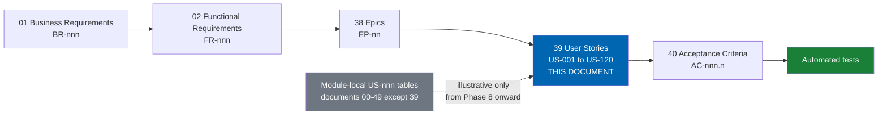

# 39 User Stories

> The complete delivery story inventory `US-001`–`US-120`, grouped by epic, each carrying a persona, a
> condensed value statement, a Fibonacci point estimate, a priority, and a horizon.

**Status:** Review · **Owner:** Product Owner · **Last revised:** 2026-07-28

**Engineering status (2026-08-25):** Plugin `0.104.0` is in tree. Progress, evidence gates (G1–G6 done; G11 packing partial), and remaining blockers (H1.35/G8, G7, G11 vendor signing, G12) are recorded in [EXECUTION-PLAN.md](../EXECUTION-PLAN.md). This document remains the specification baseline.

---

## Contents

- [Executive Summary](#executive-summary)
- [Objectives](#objectives)
- [Scope](#scope)
- [Detailed Specifications](#detailed-specifications)
  - [Story format](#story-format)
  - [Relationship to module-local story tables](#relationship-to-module-local-story-tables)
  - [Definition of Ready](#definition-of-ready)
  - [Definition of Done](#definition-of-done)
  - [Story point calibration](#story-point-calibration)
  - [Horizon 0 — Platform upgrade (`EP-01`)](#horizon-0--platform-upgrade-ep-01)
  - [Horizon 1 — Foundation (`EP-02`–`EP-17`)](#horizon-1--foundation-ep-02ep-17)
  - [Horizon 2 — Intelligence (`EP-18`–`EP-21`)](#horizon-2--intelligence-ep-18ep-21)
  - [Horizon 3 — Marketplace (`EP-22`–`EP-24`)](#horizon-3--marketplace-ep-22ep-24)
  - [Horizon 4 — Verticals (`EP-25`–`EP-27`)](#horizon-4--verticals-ep-25ep-27)
  - [Horizon 5 — Platform (`EP-28`)](#horizon-5--platform-ep-28)
  - [Inventory summary](#inventory-summary)
- [Architecture](#architecture)
- [User Stories](#user-stories)
- [Acceptance Criteria](#acceptance-criteria)
- [Future Enhancements](#future-enhancements)
- [References](#references)

---

## Executive Summary

This document is the single coherent story inventory for Check Engine delivery: **one hundred and twenty
stories, `US-001` through `US-120`**, each traced to one of the twenty-eight epics in
[38](38-epics.md). Every Must-priority Horizon 1 capability has at least one story here; Horizon 2
through Horizon 5 are represented by the stories that most shape their epics, rather than exhaustively,
because those horizons are still subject to the review cadence described in
[ROADMAP.md](../ROADMAP.md#roadmap-governance).

Three things a reader should take from this document:

1. **This is the delivery backlog's spine, not a duplicate of module-local illustrations.** Documents
   00–35 each carry a small, module-local `US-nnn` table illustrating the stories that document
   motivates. Phase 8 companions outside this inventory do the same in non-colliding ranges. Those
   tables use overlapping or document-scoped numbers by design and remain useful as illustration. This
   document is the authoritative, globally unique numbering that implementation branches and pull
   requests cite from this phase forward — see
   [Relationship to module-local story tables](#relationship-to-module-local-story-tables).
2. **Points are Fibonacci and calibrated against shipped reference stories**, not estimated from first
   principles each time. The [calibration table](#story-point-calibration) exists so that two different
   engineers estimating the same story converge.
3. **Priority is inherited from the epic's business requirement**, not re-litigated per story. A story
   under a Must-priority epic is Must unless explicitly marked otherwise for a genuinely deferrable
   slice of that epic's scope.

---

## Objectives

| # | Objective | Measure | Traces to |
|---|---|---|---|
| 1 | Give every epic at least one concrete, estimable story | Every `EP-nn` in [38](38-epics.md) has ≥ 2 stories here | [38 Epics](38-epics.md) |
| 2 | Make delivery backlog numbering unambiguous | A single `US-nnn` never appears twice with different meanings in this document | Identifier discipline |
| 3 | Attach a persona to every story | Every row cites a named persona from [06](06-personas.md) or a stated future persona | [06 Personas](06-personas.md) |
| 4 | Enable acceptance-criteria coverage | Every Must Horizon 1 story has ≥ 1 `AC-nnn.n` in [40](40-acceptance-criteria.md) | [40 Acceptance Criteria](40-acceptance-criteria.md) |

---

## Scope

### In scope

- The complete `US-001`–`US-120` inventory, grouped by epic and horizon
- Persona, condensed value statement, Fibonacci points, priority, and horizon for each story
- Definition of Ready and Definition of Done
- Story point calibration reference
- The relationship between this inventory and the pre-existing module-local `US-nnn` tables

### Out of scope

| Not covered here | Where it lives |
|---|---|
| Given/When/Then acceptance criteria | [40 Acceptance Criteria](40-acceptance-criteria.md) |
| Epic-level exit criteria and dependencies | [38 Epics](38-epics.md) |
| Sprint assignment and capacity | [36 Sprint Planning](36-sprint-planning.md) |
| Backlog ordering and prioritisation beyond Must/Should/Could | [37 Product Backlog](37-product-backlog.md) |
| Full detailed behaviour (this document condenses; `FR-nnn` states the behaviour precisely) | [02 Functional Requirements](02-functional-requirements.md) |

### Assumptions

| # | Assumption | Sensitivity |
|---|---|---|
| A1 | One story point is calibrated to roughly half a day of focused engineering effort at Check Engine's team composition | Medium — recalibrated after the first two sprints of real velocity data, per [36](36-sprint-planning.md) |
| A2 | Horizon 2–5 stories listed here are representative, not exhaustive; each expands at its horizon's kickoff | High — stated explicitly per horizon section below |
| A3 | A story maps to exactly one primary epic, even where its acceptance criteria touch a second module | Medium — cross-cutting concerns are called out in the story text |
| A4 | Personas not yet named in [06](06-personas.md) — vendor, dealer principal, tenant admin — are placeholder role labels until that document's Horizon 3–5 persona work is scheduled | Low — [06](06-personas.md#future-enhancements) already flags this gap |

### Dependencies

| Dependency | Required for | Document |
|---|---|---|
| Epic inventory `EP-01`–`EP-28` | Every story's Epic column | [38 Epics](38-epics.md) |
| Persona set | Every story's Persona column | [06 Personas](06-personas.md) |
| Functional requirements | The precise behaviour each story condenses | [02 Functional Requirements](02-functional-requirements.md) |
| Horizon definitions | The Horizon column | [ROADMAP.md](../ROADMAP.md) |

---

## Detailed Specifications

### Story format

Every story follows the classic form, condensed to one line in the inventory tables:

> As a **[persona]**, I want **[capability]**, so that **[value]**.

The full three-clause sentence is reconstructable from the condensed "Story" column by reading it as
"As a *Persona*, I want to *[Story text]*." Points use the Fibonacci sequence **1, 2, 3, 5, 8, 13, 21**;
larger stories are a signal to split, not an estimate to trust — see
[calibration](#story-point-calibration).

### Relationship to module-local story tables

Documents [00](00-vision.md), [01](01-business-requirements.md), [02](02-functional-requirements.md),
[03](03-non-functional-requirements.md), [04](04-competitive-analysis.md),
[05](05-product-strategy.md), [06](06-personas.md), [07](07-user-journey.md),
[08](08-system-architecture.md), [09](09-plugin-architecture.md), [11](11-domain-model.md),
[12](12-vehicle-database.md), [14](14-oem-engine.md), [17](17-ai-architecture.md),
[21](21-theme-design.md), [23](23-ux-guidelines.md), [24](24-product-import-pipeline.md),
[26](26-image-management.md), [27](27-seo-strategy.md), [28](28-security.md),
[30](30-analytics.md), [32](32-deployment.md), and [34](34-coding-standards.md) each carry a small
"User Stories" table using their own local `US-nnn` numbers (for example `US-401` appears independently
in both [05](05-product-strategy.md) and [17](17-ai-architecture.md); `US-601` appears independently in
[06](06-personas.md), [07](07-user-journey.md), and [21](21-theme-design.md)). Those numbers were
assigned locally at the time each document was drafted, in Documentation Phases 1 through 7, before this
consolidated inventory existed.

**This document is the single coherent numbering scheme for delivery.** From Documentation Phase 8
onward:

- New branches, commits, and pull requests cite an `US-nnn` from **this document**, per
  [CONTRIBUTING.md](../CONTRIBUTING.md#commit-conventions).
- The module-local tables in documents 00–35 remain in place as **illustrative** examples of the kind of
  story each module motivates; they are not renumbered, because identifiers are permanent per
  [CONTRIBUTING.md](../CONTRIBUTING.md#requirement-and-identifier-discipline) and because renumbering
  published documents would break existing cross-references for no safety benefit.
- Phase 8 companion documents ([36](36-sprint-planning.md)–[38](38-epics.md),
  [41](41-release-plan.md)–[49](49-saas-roadmap.md), [Appendix](appendix.md)) likewise carry short
  module-local `US-nnn` tables for readability. Those IDs are **illustrative only** and must not reuse
  `US-001`–`US-120`. Where a draft collided with an earlier module-local range (for example commercial
  docs originally overlapping [35](35-testing-strategy.md)–[37](37-product-backlog.md)), the colliding
  stories were renumbered into free blocks (`US-831`–`US-836`, `US-841`–`US-848`, `US-851`–`US-856`,
  `US-861`–`US-866` in [42](42-marketplace-publishing.md)–[45](45-future-roadmap.md)).
- Where a module-local story and a story in this document describe the same underlying capability (for
  example, `US-104` in [02](02-functional-requirements.md) "Import a supplier Excel and review only
  low-confidence rows" and `US-047`/`US-048` here), this document is authoritative for delivery tracking
  and the module-local story is treated as a worked example, cross-referenced informally in prose rather
  than merged, to avoid a renumbering exercise across seven completed documentation phases.
- [37 Product Backlog](37-product-backlog.md) sequences and points from **this** document exclusively.

### Definition of Ready

A story may enter a sprint only when all of the following hold:

| # | Condition |
|---|---|
| 1 | The story cites its epic (`EP-nn`) and traces to at least one `FR-nnn` or `NFR-nnn` |
| 2 | The persona is named and its goal is unambiguous |
| 3 | At least one acceptance criterion exists in [40](40-acceptance-criteria.md), or is drafted in the same pull request that pulls the story into a sprint |
| 4 | Dependencies on other stories or epics are identified and are either complete or explicitly sequenced around |
| 5 | The story is estimated by the team that will build it, not assigned an estimate by the product owner alone |
| 6 | For fitment-, licence-, or AI-adjacent stories, the relevant hard constraint (`ADR-007`, `ADR-008`, `ADR-009`) is stated in the story's notes, not assumed |

### Definition of Done

A story is done only when every item in
[CONTRIBUTING.md § Definition of done](../CONTRIBUTING.md#definition-of-done) is satisfied. The summary
most relevant to story closure:

| # | Condition |
|---|---|
| 1 | Every acceptance criterion for the story in [40](40-acceptance-criteria.md) passes |
| 2 | The behaviour was built test-first (red→green→refactor) per `ADR-015` |
| 3 | Documentation affected by the story is updated in the same pull request |
| 4 | For any customer-facing or admin-facing text, both Arabic and English ship together |
| 5 | The change is verified on a clean 4.90.6 instance, not only in a developer's existing environment |

### Story point calibration

Points are calibrated against these reference stories, all drawn from this inventory, so that estimation
converges across engineers rather than drifting per person.

| Points | Meaning | Reference story |
|---|---|---|
| 1 | A trivial, well-understood change with no new test surface | Cosmetic or configuration-only change |
| 2 | A small change with one clear test case | `US-068` — exclude a configuration from landing generation |
| 3 | A well-understood change touching one layer | `US-003` — reference plugin installs on the upgraded host |
| 5 | A typical story: new behaviour, one or two layers, a handful of test cases | `US-021` — OEM search with supersession resolution |
| 8 | A story spanning multiple layers or with meaningful edge cases | `US-026` — fitment-filtered browsing for the active vehicle |
| 13 | A story with real design uncertainty or multiple integration points | `US-047` — review queue for low-confidence import rows |
| 21 | A story that is really an epic slice; split before sprint entry wherever possible | `US-051` — 10,000-line catalog to published state within five working days |

A story estimated above 21 has not been decomposed enough to enter [Definition of Ready](#definition-of-ready)
and is returned to epic-level planning in [38](38-epics.md).

---

### Horizon 0 — Platform upgrade (`EP-01`)

| ID | Epic | Persona | As a… I want… so that… (condensed) | Points | Priority | Horizon |
|---|---|---|---|---|---|---|
| `US-001` | `EP-01` | Dina | the host upgraded from 4.60 to 4.90.6 in verified single-hop steps, so I never inherit an unpatched .NET runtime | 21 | Must | 0 |
| `US-002` | `EP-01` | Dina | a rehearsed rollback at every upgrade hop, so a failed step never strands production | 8 | Must | 0 |
| `US-003` | `EP-01` | Alex | a reference plugin that installs cleanly on the upgraded host, so I know the platform is ready for Check Engine | 5 | Must | 0 |

---

### Horizon 1 — Foundation (`EP-02`–`EP-17`)

Every story below is Must-priority unless marked otherwise, because it sits under a Must-priority
Horizon 1 epic. Should-priority stories represent scope inside a Must epic that the epic can still close
without.

#### `EP-02` — Plugin scaffolding and install lifecycle

| ID | Persona | As a… I want… so that… (condensed) | Points | Priority | Horizon |
|---|---|---|---|---|---|
| `US-004` | Dina | to install Check Engine from the admin Plugins page on a clean 4.90.6 store, so I never hand-edit SQL | 5 | Must | 1 |
| `US-005` | Dina | to uninstall and confirm no Check Engine tables, settings, or tasks remain, so the store returns to a clean state | 5 | Must | 1 |
| `US-006` | Dina | to be warned and offered an export before uninstall deletes vehicle and fitment data, so I never lose curated data by accident | 3 | Must | 1 |
| `US-007` | Alex | services to register via `INopStartup` without touching nopCommerce composition roots, so my plugin never forks the platform | 3 | Must | 1 |
| `US-008` | Alex | `plugin.json` to declare supported versions correctly, so the Plugins page shows compatibility before install | 2 | Should | 1 |

#### `EP-03` — Vehicle database

| ID | Persona | As a… I want… so that… (condensed) | Points | Priority | Horizon |
|---|---|---|---|---|---|
| `US-009` | Nour | to create, edit, merge, and archive vehicle nodes in admin, so the tree stays correct without a code deployment | 8 | Must | 1 |
| `US-010` | Nour | to add a brand-new Make without waiting for a release, so my catalog can grow with my business | 5 | Must | 1 |
| `US-011` | Layla | to select Make › Model › Generation and options in Arabic, so I can find my car in my own language | 8 | Must | 1 |
| `US-012` | Nour | to merge two duplicate generation nodes without losing fitment claims, so cleanup never destroys curated work | 8 | Must | 1 |
| `US-013` | Nour | to see a health report of configurations with no fitments, so I know where curation is incomplete | 5 | Should | 1 |
| `US-014` | Hassan | generation codes such as F30 and E90 to be first-class fields, so I can search using the codes enthusiasts actually use | 3 | Must | 1 |

#### `EP-04` — VIN engine

| ID | Persona | As a… I want… so that… (condensed) | Points | Priority | Horizon |
|---|---|---|---|---|---|
| `US-015` | Layla | to decode my VIN and see only parts confirmed to fit, so I never waste money on the wrong part | 13 | Must | 1 |
| `US-016` | Layla | a short disambiguation choice when my VIN matches more than one configuration, so I am never silently given the wrong one | 8 | Must | 1 |
| `US-017` | Omar | VIN decoding to complete in under 40 ms server-side, so I don't lose bay time waiting on a lookup | 5 | Must | 1 |
| `US-018` | Dina | assurance that VINs are never written to plain application logs by default, so a log leak is never a data-protection incident | 5 | Must | 1 |
| `US-019` | Layla | a clear structured failure when my VIN cannot be decoded, so I know to try another identification method | 5 | Must | 1 |
| `US-020` | Nour | to register a new manufacturer VIN decoder without a core deployment, so brand growth never waits on engineering | 8 | Must | 1 |

#### `EP-05` — OEM engine

| ID | Persona | As a… I want… so that… (condensed) | Points | Priority | Horizon |
|---|---|---|---|---|---|
| `US-021` | Hassan | to search by the number on my old part and get equivalents and current supersessions, so I never guess | 8 | Must | 1 |
| `US-022` | Hassan | to be told clearly when my part number was superseded and shown the current one, so I order the right replacement | 5 | Must | 1 |
| `US-023` | Nour | to bulk-import an OEM list that upserts by normalised number and manufacturer, so re-imports never create duplicates | 8 | Must | 1 |
| `US-024` | Nour | to link two OEM numbers as a supersession in admin, so the chain reflects what my supplier told me | 5 | Must | 1 |
| `US-025` | Hassan | to never see an aftermarket part mislabelled as genuine, so I can make an informed OEM-versus-aftermarket choice | 5 | Must | 1 |

#### `EP-06` — Fitment engine

| ID | Persona | As a… I want… so that… (condensed) | Points | Priority | Horizon |
|---|---|---|---|---|---|
| `US-026` | Layla | to see only parts that are certain to fit my exact car, so I never waste money or time on the wrong part | 13 | Must | 1 |
| `US-027` | Omar | assurance that "Fits" is never shown unless it is actually confirmed, so a job is never blocked by a wrong part arriving | 13 | Must | 1 |
| `US-028` | Nour | to be structurally unable to publish a low-confidence brake pad fitment claim, so a safety-critical mistake can never reach a customer | 8 | Must | 1 |
| `US-029` | Nour | to see the evidence and provenance behind every fitment claim, so I can defend or correct it | 5 | Must | 1 |
| `US-030` | Nour | a customer's wrong-fit report to become a tracked, auditable correction, so the catalog improves over time | 8 | Must | 1 |
| `US-031` | Layla | steering side, market, and build-date qualifiers applied correctly to my car, so parts unsuited to my market are excluded | 8 | Must | 1 |
| `US-032` | Omar | fitment evaluation to return within the performance budget at reference catalog scale, so search feels instant on the shop floor | 8 | Must | 1 |
| `US-033` | Nour | coverage reports showing parts with no claims and vehicles with no parts, so I know where to focus curation | 5 | Should | 1 |

#### `EP-07` — Search, five modes

| ID | Persona | As a… I want… so that… (condensed) | Points | Priority | Horizon |
|---|---|---|---|---|---|
| `US-034` | Layla | one search box that understands VIN, OEM, and keyword, so I never need to know which mode to pick | 8 | Must | 1 |
| `US-035` | Omar | a VIN search that returns a fitment-filtered results page fast, so I can quote a job while the car is on the ramp | 8 | Must | 1 |
| `US-036` | Hassan | to search by the number on my old part and find its current equivalent, so I re-order correctly | 5 | Must | 1 |
| `US-037` | Layla | to browse a category with my garage vehicle active and see only fitting parts, so browsing feels safe | 8 | Must | 1 |
| `US-038` | Layla | to recover gracefully from a zero-result search, so I am never left at a dead end | 5 | Must | 1 |
| `US-039` | Nour | to preview how a query performs against the live index in admin, so I can tune ranking before customers notice a problem | 5 | Should | 1 |

#### `EP-08` — Customer garage

| ID | Persona | As a… I want… so that… (condensed) | Points | Priority | Horizon |
|---|---|---|---|---|---|
| `US-040` | Layla | to save my car to a garage that remembers it next time, so I never re-enter my VIN every visit | 8 | Must | 1 |
| `US-041` | Layla | my guest-session garage to migrate to my account on sign-in, so I never lose what I already set up | 5 | Must | 1 |
| `US-042` | Layla | to mark one vehicle as active and have the whole site filter to it, so browsing stays relevant without extra steps | 8 | Must | 1 |
| `US-043` | Layla | my garage to sync across my phone and my laptop, so my saved cars are the same everywhere | 5 | Must | 1 |
| `US-044` | Sara | to export or erase my garage data on request, so I control my own information | 5 | Must | 1 |
| `US-045` | Omar | to be prompted to save my customer's vehicle right after a VIN search, so repeat visits for the same job are faster | 3 | Should | 1 |

#### `EP-09` — Import pipeline

| ID | Persona | As a… I want… so that… (condensed) | Points | Priority | Horizon |
|---|---|---|---|---|---|
| `US-046` | Nour | to upload a supplier Excel file and map its columns once as a reusable profile, so future files import without re-mapping | 8 | Must | 1 |
| `US-047` | Nour | to review only the rows the system is unsure about, so I never re-key data the system already matched confidently | 13 | Must | 1 |
| `US-048` | Nour | duplicate parts flagged across a new import and the existing catalog, so I can merge, link, or keep them separate deliberately | 8 | Must | 1 |
| `US-049` | Nour | to re-run the vehicle-matching stage after fixing an alias, so a small correction never requires restarting the whole batch | 5 | Must | 1 |
| `US-050` | Nour | successful rows in a batch to publish while failed rows stay listed for correction, so one bad row never blocks nine thousand good ones | 5 | Must | 1 |
| `US-051` | Nour | a 10,000-line supplier catalog to reach published state within five working days including review, so I open for business in days rather than months | 21 | Must | 1 |
| `US-052` | Nour | to dry-run a large file before go-live, so I see the expected outcome without publishing anything | 5 | Should | 1 |
| `US-053` | Dina | every import action attributed and audited, so catalog changes are always traceable | 3 | Must | 1 |

#### `EP-10` — Image management

| ID | Persona | As a… I want… so that… (condensed) | Points | Priority | Horizon |
|---|---|---|---|---|---|
| `US-054` | Nour | a placeholder assigned automatically when a supplier provides no image, so no product page is ever blank | 5 | Must | 1 |
| `US-055` | Nour | to replace a low-quality supplier photo with a studio shot without breaking the product's links, so quality improves without rework | 5 | Should | 1 |
| `US-056` | Layla | sharp listing and zoom images on the product page, so I can verify the part visually before buying | 5 | Must | 1 |
| `US-057` | Dina | a malware-flagged image quarantined and never shown on the storefront, so an unsafe upload can never reach a customer | 8 | Must | 1 |

#### `EP-11` — Theme and design system

| ID | Persona | As a… I want… so that… (condensed) | Points | Priority | Horizon |
|---|---|---|---|---|---|
| `US-058` | Layla | a sticky search bar while scrolling a long category page, so I can refine my search without scrolling back up | 5 | Must | 1 |
| `US-059` | Layla | to open my garage from the header on mobile, so switching cars takes one tap | 5 | Must | 1 |
| `US-060` | Omar | fitment status shown prominently on the product page, so I never have to hunt for the one fact that matters most | 5 | Must | 1 |
| `US-061` | Alex | to enable the theme on a 4.90 store with zero code edits to the host, so delivery stays repeatable across customers | 3 | Must | 1 |

#### `EP-12` — Arabic and English, RTL and LTR

| ID | Persona | As a… I want… so that… (condensed) | Points | Priority | Horizon |
|---|---|---|---|---|---|
| `US-062` | Layla | to use the entire store in Arabic RTL with no mirrored product images or clipped layout, so I am never a second-class customer in my own language | 13 | Must | 1 |
| `US-063` | Layla | to switch locale mid-session without losing my active vehicle or cart contents, so switching languages never costs me my progress | 5 | Must | 1 |
| `US-064` | Nour | to manage the controlled bilingual part-name vocabulary with change history, so terminology stays consistent as the catalog grows | 5 | Should | 1 |
| `US-065` | Layla | dates, numbers, and currency formatted for my locale, so the store reads naturally in Arabic | 3 | Must | 1 |

#### `EP-13` — SEO landings

| ID | Persona | As a… I want… so that… (condensed) | Points | Priority | Horizon |
|---|---|---|---|---|---|
| `US-066` | Nour | a vehicle landing page to appear automatically once a configuration has sellable fitments, so organic traffic starts without manual page-building | 8 | Must | 1 |
| `US-067` | Karim | hreflang-consistent Arabic and English versions of a vehicle landing page, so search engines rank both correctly | 5 | Must | 1 |
| `US-068` | Nour | to exclude a specific configuration from landing-page generation, so thin or irrelevant pages never get indexed | 2 | Should | 1 |
| `US-069` | Karim | confirmation that empty landing pages are set to noindex, so search engines never penalise the site for thin content | 5 | Must | 1 |

#### `EP-14` — ERPNext synchronisation

| ID | Persona | As a… I want… so that… (condensed) | Points | Priority | Horizon |
|---|---|---|---|---|---|
| `US-070` | Tarek | today's orders synced to ERPNext without a manual export, so I never maintain two systems by hand | 8 | Must | 1 |
| `US-071` | Tarek | inventory quantities from ERPNext treated as the system of record, so the storefront never oversells | 8 | Must | 1 |
| `US-072` | Tarek | sync exceptions surfaced in admin with payload and error detail, so I can resolve them without guessing | 5 | Must | 1 |
| `US-073` | Tarek | daily reconciliation reports comparing order, payment, and inventory totals, so drift is caught before it compounds | 5 | Must | 1 |
| `US-074` | Karim | to keep taking orders even when ERPNext is unreachable, so a third-party outage never stops revenue | 8 | Must | 1 |
| `US-075` | Tarek | to retry a failed sync operation safely without creating duplicate records, so idempotency protects the books | 5 | Must | 1 |

#### `EP-15` — Security audit and permissions

| ID | Persona | As a… I want… so that… (condensed) | Points | Priority | Horizon |
|---|---|---|---|---|---|
| `US-076` | Dina | every Check Engine admin action gated by a permission record, so access always follows least privilege | 5 | Must | 1 |
| `US-077` | Dina | administrative actions on fitment, vehicle data, and licence settings audit-logged, so any change traces to a person and a time | 5 | Must | 1 |
| `US-078` | Sara | to export and erase my own personal data including garage entries, so I control what the store keeps about me | 5 | Must | 1 |
| `US-079` | Dina | a support diagnostic package that redacts secrets and personal data by default, so troubleshooting never leaks sensitive information | 5 | Must | 1 |
| `US-080` | Dina | a security review with no open high or critical findings before go-live, so I can defend the deployment to my own compliance function | 8 | Must | 1 |

#### `EP-16` — Licence activation

| ID | Persona | As a… I want… so that… (condensed) | Points | Priority | Horizon |
|---|---|---|---|---|---|
| `US-081` | Karim | to keep selling through my storefront even if my licence lapses, so a billing dispute never becomes an outage | 8 | Must | 1 |
| `US-082` | Dina | to activate the licence offline for an air-gapped deployment, so isolated environments are never locked out of activation | 5 | Must | 1 |
| `US-083` | Karim | assurance that no catalog, customer, or order data is transmitted through the licensing channel, so licensing never becomes a data-protection exposure | 3 | Must | 1 |
| `US-084` | Dina | each store in a multi-store deployment to enable Check Engine features independently, so one licence never forces uniform behaviour | 5 | Must | 1 |

#### `EP-17` — Regional reference plugins

| ID | Persona | As a… I want… so that… (condensed) | Points | Priority | Horizon |
|---|---|---|---|---|---|
| `US-085` | Alex | to install Check Engine core with zero dependency on Paymob or Bosta assemblies, so I can deploy outside Egypt without dead code | 5 | Must | 1 |
| `US-086` | Karim | to use any nopCommerce-compatible payment or shipping provider with Check Engine, so I am never locked into one regional stack | 5 | Must | 1 |
| `US-087` | Alex | to upgrade the Paymob or Bosta plugin independently of the core version, so a regional API change never forces a core release | 3 | Must | 1 |

---

### Horizon 2 — Intelligence (`EP-18`–`EP-21`)

Representative of Horizon 2's Must-priority scope. Full decomposition expands at Horizon 2 kickoff per
[ROADMAP.md § Documentation phases](../ROADMAP.md#documentation-phases).

| ID | Epic | Persona | As a… I want… so that… (condensed) | Points | Priority | Horizon |
|---|---|---|---|---|---|---|
| `US-088` | `EP-18` | Karim | a clear data-disclosure screen before enabling any AI feature, so I know what leaves my store before I turn something on | 5 | Must | 2 |
| `US-089` | `EP-18` | Karim | a hard daily spend ceiling per AI feature, so a runaway job can never exceed my budget | 8 | Must | 2 |
| `US-090` | `EP-18` | Karim | to run the entire store with every AI feature switched off, so AI is never a dependency for basic operation | 3 | Must | 2 |
| `US-091` | `EP-18` | Alex | to switch AI provider between OpenAI, Azure OpenAI, and Anthropic without rewriting feature code, so I am never locked to one vendor | 8 | Must | 2 |
| `US-092` | `EP-19` | Layla | to type "water pump for my 2016 320i" and get correct results, so I never need to know model codes to search naturally | 13 | Must | 2 |
| `US-093` | `EP-19` | Hassan | a misspelled or code-switched Arabic-English query to still return relevant results, so imperfect typing never costs me a search | 8 | Should | 2 |
| `US-094` | `EP-19` | Nour | to see the natural-language search benchmark score before it ships to customers, so a regression is caught pre-release, not in production | 5 | Must | 2 |
| `US-095` | `EP-20` | Nour | AI-drafted product descriptions to arrive as reviewable candidates only, so nothing publishes without a human check | 8 | Must | 2 |
| `US-096` | `EP-20` | Nour | AI translation to use the controlled automotive glossary, so part names are never freely re-translated into something wrong | 8 | Must | 2 |
| `US-097` | `EP-20` | Nour | AI-generated SEO titles and descriptions queued for review, so metadata quality stays consistent with the brand | 5 | Should | 2 |
| `US-098` | `EP-20` | Nour | AI content candidates to move through review at throughput matching import volume, so AI accelerates rather than bottlenecks publishing | 8 | Must | 2 |
| `US-099` | `EP-21` | Nour | AI-inferred fitment claims to arrive capped below the publication threshold, so an AI guess can never become a published "Fits" claim on its own | 8 | Must | 2 |
| `US-100` | `EP-21` | Layla | never to receive a recommended part that does not fit my active vehicle, so cross-sell never wastes my time | 8 | Must | 2 |
| `US-101` | `EP-21` | Layla | assistant answers grounded only in the store's own catalog and fitment data, so it never invents a part number or price | 13 | Must | 2 |
| `US-102` | `EP-21` | Sara | assurance that the recommendation engine never uses another customer's personal data as an input, so my privacy is never traded for someone else's convenience | 5 | Must | 2 |

---

### Horizon 3 — Marketplace (`EP-22`–`EP-24`)

Representative of Horizon 3's Should-priority scope, per `BR-027`. Full decomposition expands at
Horizon 3 kickoff.

| ID | Epic | Persona | As a… I want… so that… (condensed) | Points | Priority | Horizon |
|---|---|---|---|---|---|---|
| `US-103` | `EP-22` | Karim | to onboard a second supplier through a verification workflow, so marketplace growth never bypasses quality control | 8 | Should | 3 |
| `US-104` | `EP-22` | Vendor | to manage my own catalog, inventory, and orders through a vendor dashboard, so I never depend on the operator for routine updates | 13 | Should | 3 |
| `US-105` | `EP-22` | Karim | assurance that one vendor can never read or modify another vendor's catalog, orders, or customers, so marketplace trust is structurally enforced, not just promised | 13 | Must | 3 |
| `US-106` | `EP-23` | Karim | to configure commission as flat, percentage, tiered, or category-specific, so the model matches my commercial agreements with each vendor | 8 | Should | 3 |
| `US-107` | `EP-23` | Vendor | a payout statement that reconciles exactly with ERPNext, so I trust what I am paid | 8 | Should | 3 |
| `US-108` | `EP-24` | Layla | to check out a cart containing parts from two vendors and receive correctly split shipments, so a mixed order still works simply | 13 | Should | 3 |
| `US-109` | `EP-24` | Vendor | to contribute a fitment claim for my own listing that enters review before publication, so my expertise adds value without bypassing safety controls | 8 | Should | 3 |
| `US-110` | `EP-24` | Nour | to revoke a vendor-contributed fitment claim that turns out to be wrong, so vendor mistakes never stay published | 5 | Should | 3 |

`Vendor` is a Horizon 3 role label pending a named persona addition to [06](06-personas.md).

---

### Horizon 4 — Verticals (`EP-25`–`EP-27`)

Representative of Horizon 4's Should-priority scope, per `BR-028`. Full decomposition expands at each
portal's kickoff, per [ROADMAP.md § Horizon 4](../ROADMAP.md#horizon-4--verticals).

| ID | Epic | Persona | As a… I want… so that… (condensed) | Points | Priority | Horizon |
|---|---|---|---|---|---|---|
| `US-111` | `EP-25` | Youssef | to place an order against a specific customer job rather than a generic cart, so invoicing and allocation trace to the right vehicle | 13 | Should | 4 |
| `US-112` | `EP-25` | Youssef | labour estimates alongside parts pricing for a job, so I can quote the whole job, not just parts | 8 | Should | 4 |
| `US-113` | `EP-25` | Youssef | to order on trade credit terms through the workshop portal, so monthly purchasing never requires card payment per job | 8 | Should | 4 |
| `US-114` | `EP-26` | Mona | to import a bulk vehicle register instead of adding vehicles one VIN at a time, so onboarding a fleet takes minutes, not days | 13 | Should | 4 |
| `US-115` | `EP-26` | Mona | scheduled-maintenance forecasts and cost-per-vehicle reporting, so I can plan spend rather than react to breakdowns | 13 | Should | 4 |
| `US-116` | `EP-26` | Mona | to require manager approval above a spend threshold, so fleet purchases follow my organisation's authorisation rules | 8 | Should | 4 |
| `US-117` | `EP-27` | Dealer principal | a catalog scoped to my franchise allocation and quota, so I only order what my agreement permits | 13 | Should | 4 |
| `US-118` | `EP-27` | Dealer principal | to submit a warranty claim that links to the original sale through ERPNext, so warranty processing never needs a parallel spreadsheet | 8 | Should | 4 |

`Dealer principal` is a Horizon 4 role label; [06](06-personas.md#future-enhancements) schedules it as a
named persona addition.

---

### Horizon 5 — Platform (`EP-28`)

Representative of Horizon 5's Should-priority scope, per `BR-041`/`BR-042`. Full decomposition expands at
Horizon 5 kickoff.

| ID | Epic | Persona | As a… I want… so that… (condensed) | Points | Priority | Horizon |
|---|---|---|---|---|---|---|
| `US-119` | `EP-28` | Tenant admin | assurance that my tenant's data is isolated from every other tenant on the platform, so shared hosting never compromises my catalog | 21 | Should | 5 |
| `US-120` | `EP-28` | Alex | to call a versioned public API to query vehicle and fitment data programmatically, so a headless integration never depends on scraping the storefront | 13 | Should | 5 |

`Tenant admin` is a Horizon 5 role label; [06](06-personas.md#future-enhancements) schedules it as a named
persona addition alongside the dealer principal.

### Inventory summary

| Horizon | Stories | Story ID range | Total points |
|---|---|---|---|
| 0 | 3 | `US-001`–`US-003` | 34 |
| 1 | 84 | `US-004`–`US-087` | 527 |
| 2 | 15 | `US-088`–`US-102` | 113 |
| 3 | 8 | `US-103`–`US-110` | 76 |
| 4 | 8 | `US-111`–`US-118` | 84 |
| 5 | 2 | `US-119`–`US-120` | 34 |
| **Total** | **120** | `US-001`–`US-120` | **868** |

Horizon 1's 527 points across 84 stories is the number [36 Sprint Planning](36-sprint-planning.md) uses
as the basis for its capacity model; it is a story-point total, not a duration, and is converted to a
sprint count only once real team velocity is measured.

---

## Architecture

Stories do not have a runtime architecture, but they have a **decomposition architecture**: every story
narrows exactly one epic, and every epic narrows one or more business requirements. The diagram shows the
funnel and where this document sits in it.

Read the dotted arrow as a statement of precedence, not data flow: this document does not consume the
module-local tables, it supersedes them as the citation target for new work while leaving them published
as worked examples.

### Rejected alternative

Renumbering every module-local `US-nnn` table across documents 00–35 to fit a single scheme was
considered and rejected. It would have touched twenty-three already-reviewed documents to fix a cosmetic
inconsistency, violated the permanent-identifier rule in
[CONTRIBUTING.md](../CONTRIBUTING.md#requirement-and-identifier-discipline), and produced no safety or
delivery benefit, since no code yet cites any of those identifiers in a merged pull request.

---

## User Stories

This document *is* the story inventory; there is no further decomposition to show here. The stories most
central to the product's safety and commercial posture, cross-referenced from other documents' Executive
Summaries, are:

| ID | Why it matters |
|---|---|
| `US-028` | The structural impossibility of auto-publishing a safety-critical fitment claim |
| `US-062` | The Arabic RTL parity bar every storefront story is measured against |
| `US-081` | The licence-expiry behaviour that removes the largest objection to entitlement enforcement |
| `US-099` | The AI fitment cap that keeps `EP-21` inside `ADR-008`'s review discipline |
| `US-105` | The vendor isolation guarantee `EP-22` cannot ship without |

---

## Acceptance Criteria

Criteria for this document itself; per-story criteria are in [40](40-acceptance-criteria.md).

**`AC-US.1`** — Every epic has stories
Given the epic inventory in [38](38-epics.md), when this document is checked, then every `EP-nn` has at
least two stories citing it.

**`AC-US.2`** — No duplicate meaning
Given any `US-nnn` in this document, when compared against every other `US-nnn` here, then no two rows
share an identifier.

**`AC-US.3`** — Persona traceability
Given any story citing a named persona, when [06 Personas](06-personas.md) is checked, then that persona
exists there, or the story explicitly labels it as a pending Horizon 3–5 role.

**`AC-US.4`** — Points are Fibonacci
Given the Points column for every story, when validated, then every value is a member of
{1, 2, 3, 5, 8, 13, 21}.

---

## Future Enhancements

| Enhancement | Horizon | Notes |
|---|---|---|
| Full Horizon 2 decomposition beyond the 15 representative stories | 2 | Expands at Horizon 2 kickoff once `EP-18`–`21` enter active sprint planning |
| Full Horizon 3 decomposition | 3 | Expands at Horizon 3 kickoff |
| Full Horizon 4 decomposition across all three portals | 4 | Expands per-portal, at each portal's own kickoff |
| Full Horizon 5 decomposition | 5 | Expands once the SaaS architecture in [49](49-saas-roadmap.md) is drafted |
| Named personas for vendor, dealer principal, and tenant admin | 3–5 | Tracked in [06](06-personas.md#future-enhancements); this document uses role labels until then |
| Retrospective re-pointing after two sprints of real velocity | 1 (ongoing) | Owned by [36 Sprint Planning](36-sprint-planning.md) |

---

## References

- [38 Epics](38-epics.md) — the epic inventory this document decomposes
- [40 Acceptance Criteria](40-acceptance-criteria.md) — Given/When/Then criteria per story
- [02 Functional Requirements](02-functional-requirements.md) — the precise behaviour behind each condensed story
- [06 Personas](06-personas.md) — the persona set
- [36 Sprint Planning](36-sprint-planning.md) — capacity model built on the point totals here
- [37 Product Backlog](37-product-backlog.md) — prioritised, sequenced backlog built from this inventory
- [ROADMAP.md](../ROADMAP.md) — horizon definitions
- [CONTRIBUTING.md](../CONTRIBUTING.md#commit-conventions) — how a branch or commit cites a story
