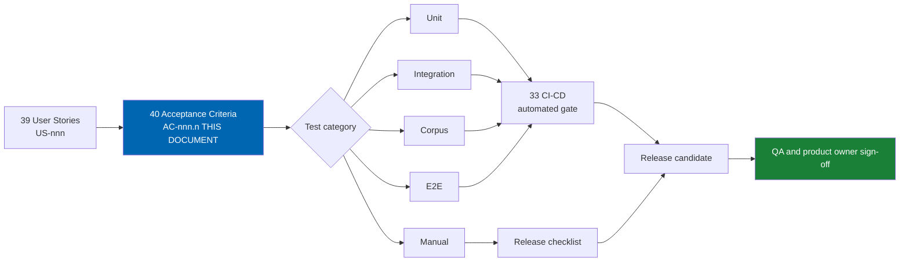
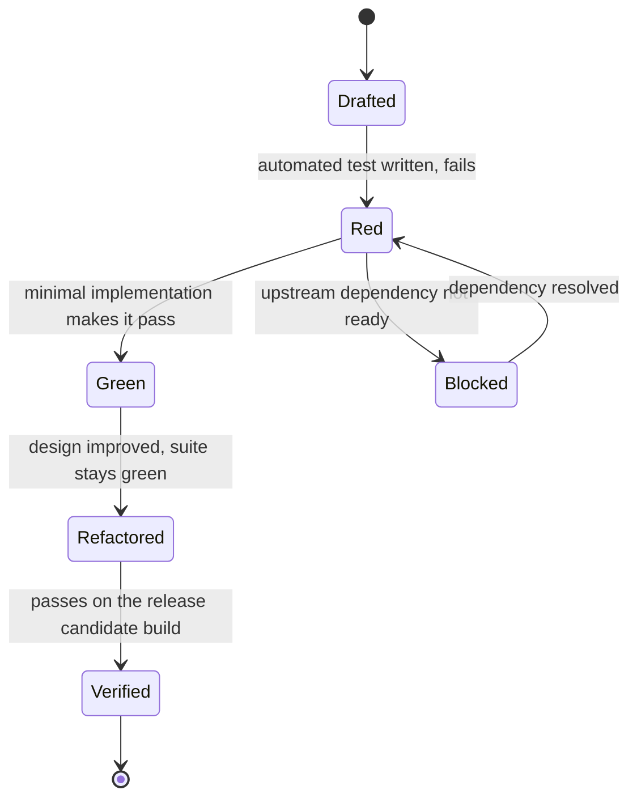

# 40 Acceptance Criteria

> Given/When/Then acceptance criteria `AC-nnn.n` for every Must-priority story in Horizon 1 (and the
> Horizon 0 platform-upgrade epic), each mapped to a test category and, where relevant, to a domain
> invariant or non-functional requirement.

**Status:** Review · **Owner:** QA Lead · **Last revised:** 2026-07-28

---

## Contents

- [Executive Summary](#executive-summary)
- [Objectives](#objectives)
- [Scope](#scope)
- [Detailed Specifications](#detailed-specifications)
  - [AC format and identifier scheme](#ac-format-and-identifier-scheme)
  - [Test categories](#test-categories)
  - [Critical acceptance criteria](#critical-acceptance-criteria)
  - [Horizon 0 — `EP-01` Platform upgrade](#horizon-0--ep-01-platform-upgrade)
  - [Horizon 1 — criteria by epic](#horizon-1--criteria-by-epic)
  - [Horizon 1 — Should-priority stories, batched](#horizon-1--should-priority-stories-batched)
  - [Horizon 2–5 — skeleton criteria](#horizon-25--skeleton-criteria)
  - [Coverage summary](#coverage-summary)
- [Architecture](#architecture)
- [User Stories](#user-stories)
- [Acceptance Criteria](#acceptance-criteria)
- [Future Enhancements](#future-enhancements)
- [References](#references)

---

## Executive Summary

This document states, in Given/When/Then form, how each Must-priority story in
[39 User Stories](39-user-stories.md) is verified. Coverage is complete for every Must story in Horizon 0
and Horizon 1 — seventy-eight stories in total — because Horizon 1 is the release that must ship
correctly the first time; Horizon 2 through Horizon 5 are represented by skeleton criteria against
representative stories, expanding to full coverage at each horizon's kickoff, per
[ROADMAP.md](../ROADMAP.md#roadmap-governance).

Three things a reader should take from this document:

1. **Five criteria are load-bearing for the entire product and are stated first, in full, in
   [Critical acceptance criteria](#critical-acceptance-criteria)**: fitment never fails open to Fits, AI
   never auto-publishes, a licence expiry never takes the storefront offline, the schema and logic stay
   brand-agnostic, and a VIN is never written in full to logs by default. Every other criterion in this
   document is secondary to these five.
2. **Every criterion states its test category** — Unit, Integration, Corpus, E2E, or Manual — so that
   [35 Testing Strategy](35-testing-strategy.md) and [33 CI-CD](33-ci-cd.md) know where each criterion is
   enforced and a criterion is never left unverifiable by omission.
3. **A criterion without a passing test is not done.** [CONTRIBUTING.md](../CONTRIBUTING.md#definition-of-done)
   makes this explicit; this document is what a reviewer checks a pull request against.

---

## Objectives

| # | Objective | Measure | Traces to |
|---|---|---|---|
| 1 | State a testable criterion for every Must story in Horizon 0 and Horizon 1 | Zero Must stories in [39](39-user-stories.md#horizon-0--platform-upgrade-ep-01) or [39](39-user-stories.md#horizon-1--foundation-ep-02ep-17) without at least one `AC-nnn.n` here | [39 User Stories](39-user-stories.md) |
| 2 | Make the five load-bearing safety and trust properties unambiguous and impossible to miss | They appear first, in full prose, before any table | Product safety posture |
| 3 | Bind every criterion to a verification method | Every row states a test category | [35 Testing Strategy](35-testing-strategy.md) |
| 4 | Trace safety- and privacy-relevant criteria to their domain invariant or NFR | Critical and fitment/AI/licence/VIN criteria cite `INV-nnn` or `NFR-nnn` where one exists | [11](11-domain-model.md), [03](03-non-functional-requirements.md) |

---

## Scope

### In scope

- Given/When/Then criteria for every Must-priority story `US-001`–`US-003` (Horizon 0) and
  `US-004`–`US-087` excluding Should-priority stories (Horizon 1)
- A batched summary for the nine Should-priority Horizon 1 stories
- Skeleton criteria for one to two representative stories per epic `EP-18`–`EP-28` (Horizon 2–5)
- Test-category and requirement-trace columns for every criterion

### Out of scope

| Not covered here | Where it lives |
|---|---|
| The story text and points each criterion verifies | [39 User Stories](39-user-stories.md) |
| Full Horizon 2–5 criteria beyond the skeletons | Expands at each horizon's kickoff; tracked in [Future Enhancements](#future-enhancements) |
| Test implementation detail (fixtures, frameworks, CI wiring) | [35 Testing Strategy](35-testing-strategy.md), [33 CI-CD](33-ci-cd.md) |
| Performance measurement methodology | [29 Performance](29-performance.md) |
| Domain invariants themselves, beyond citation | [11 Domain Model](11-domain-model.md) |

### Assumptions

| # | Assumption | Sensitivity |
|---|---|---|
| A1 | Every criterion here can be automated except where explicitly marked Manual | High — a criterion that resists automation is a design smell worth revisiting |
| A2 | "Published" release-candidate criteria (security review, five-day import) are evaluated once per release, not per pull request | Medium — still Must, but gated at [ROADMAP.md](../ROADMAP.md#horizon-1--foundation) exit, not at every commit |
| A3 | Corpus-category criteria run against the reference dataset in [03](03-non-functional-requirements.md#reference-environment-and-dataset) | High — a criterion measured against a toy dataset does not verify the claim it makes |
| A4 | A Should-priority story still receives a test; it is exempted only from a dedicated full GWT entry in this document, per the batching allowed by [CONTRIBUTING.md](../CONTRIBUTING.md#document-template) | Low |

### Dependencies

| Dependency | Required for | Document |
|---|---|---|
| Story inventory `US-001`–`US-120` | The subject of every criterion | [39 User Stories](39-user-stories.md) |
| Functional and non-functional requirements | The behaviour each criterion verifies | [02](02-functional-requirements.md), [03](03-non-functional-requirements.md) |
| Domain invariants `INV-001`–`INV-015` | Trace column for safety- and integrity-relevant criteria | [11 Domain Model](11-domain-model.md) |
| Test category definitions | Consistent categorisation | [35 Testing Strategy](35-testing-strategy.md) |

---

## Detailed Specifications

### AC format and identifier scheme

Every criterion is identified `AC-nnn.n`, where `nnn` is the `US-nnn` it verifies and `.n` numbers
criteria within that story starting at 1. A story with two distinct testable facets carries `AC-nnn.1`
and `AC-nnn.2`; a story fully covered by one facet carries only `AC-nnn.1`. Identifiers are permanent per
[CONTRIBUTING.md](../CONTRIBUTING.md#requirement-and-identifier-discipline) — a criterion is never
renumbered, only marked `WITHDRAWN` if the story it verifies is withdrawn.

Every criterion is written as a single, non-compound Given/When/Then statement. A criterion that needs
"and" to join two unrelated outcomes is two criteria, not one.

### Test categories

| Category | Meaning | Typical tool |
|---|---|---|
| **Unit** | Verifies a domain rule or value object in isolation, no database or host | xUnit against Domain/Application projects |
| **Integration** | Verifies behaviour across a service boundary — database, cache, or an internal module contract | xUnit with a real or Testcontainers-backed SQL Server instance |
| **Corpus** | Verifies behaviour against the curated fitment or VIN test corpus at reference scale | The fitment accuracy corpus in [35](35-testing-strategy.md#fitment-accuracy-corpus) |
| **E2E** | Verifies a complete user-facing flow through the rendered storefront or admin UI | Playwright, both Arabic RTL and English LTR where UI is involved |
| **Manual** | Verified by a documented human protocol, not automatable without disproportionate cost | Named protocol, executed and recorded per release |

### Critical acceptance criteria

These twelve criteria, across five themes, are the properties the product cannot ship without and that
no later convenience is allowed to erode. Each is drawn from a specific Must story in
[39](39-user-stories.md) but is elevated here because a regression in any of them is, by definition, at
least Severity 2 per [CONTRIBUTING.md § Reporting defects](../CONTRIBUTING.md#reporting-defects), and
because a wrong-fitment or unsafe-auto-publish regression can cause physical harm, per
[LICENSE.md § 9.4](../LICENSE.md#94-safety-critical-components).

#### Theme 1 — Fitment never fails open to Fits

**`AC-026.1`** — Fail-closed default
Given any fitment evaluation path — storefront search, product-page badge, recommendation, or bulk admin
evaluation — when the engine cannot establish a confident match for the active vehicle, then the result
returned is `Unknown` or `NeedsDisambiguation`, and the part is never labelled `Fits`.
**Test:** Integration · **Trace:** `INV-008`, `FR-302`–`304`

**`AC-027.1`** — "Fits" is never speculative
Given a part displayed with fitment status `Fits` for the active vehicle context, when the underlying
claim is inspected, then it is a published claim at or above the configured publication threshold, never
an unpublished, below-threshold, or AI-inferred-and-unreviewed claim.
**Test:** Corpus · **Trace:** `INV-008`, `FR-303`, `FR-310`

#### Theme 2 — Safety-critical categories have a hard stop

**`AC-028.1`** — No configuration permits below-threshold auto-publish
Given a fitment claim in a safety-critical category (braking, steering, suspension, restraints/airbags)
with confidence below the publication threshold, when any actor — including an administrator holding the
elevated fitment-review permission — attempts to publish it directly, then the system refuses the
operation, regardless of any setting that actor controls.
**Test:** Integration · **Trace:** `INV-007`, `FR-316`–`317`, `LICENSE.md § 9.4`

**`AC-028.2`** — The refusal is audited
Given the refusal in `AC-028.1`, when it occurs, then an audit log entry records the actor, the claim
identifier, the attempted action, and the timestamp, and the entry is retained under the same
tamper-evident policy as every other fitment audit event.
**Test:** Unit · **Trace:** `FR-970`–`971`, `BR-016`

#### Theme 3 — AI never auto-publishes

**`AC-095.1`** — AI content stays a candidate until reviewed
Given AI-generated product description, specification, translation, or SEO metadata, when it is
generated, then it is persisted with `IsPublished = false`, and no code path exists that sets it to
`true` without an associated review action recorded against a named reviewer identity.
**Test:** Integration · **Trace:** `INV-014`, `FR-520`–`523`, `FR-531`

**`AC-099.1`** — AI-inferred fitment is capped and unpublished
Given an AI compatibility-inference process, when it creates a Fitment Claim, then the claim's source
type is `AiInference`, its confidence is capped below the publication threshold by configuration, and
`IsPublished` is `false` until a human reviewer sets it `true` through the review workflow.
**Test:** Integration · **Trace:** `INV-006`, `FR-328`, `FR-530`

#### Theme 4 — Licence expiry never interrupts the storefront

**`AC-081.1`** — The storefront is unaffected by licence expiry
Given a Production Instance whose Subscription Term has expired, when a customer browses the storefront,
adds items to cart, and completes checkout, then every step succeeds exactly as it would under an active
licence, with no feature gate, watermark, or forced interruption on the customer-facing path.
**Test:** E2E · **Trace:** `INV-015`, `FR-981`, `ADR-009`, `BR-038`

**`AC-081.2`** — Only administration degrades, and only to read-only
Given the same expired licence, when an administrator opens Check Engine configuration screens, then the
screens render in a clearly labelled read-only mode, and no storefront-facing capability is disabled as a
side effect of the degradation.
**Test:** E2E · **Trace:** `INV-015`, `FR-981`

#### Theme 5 — The schema and logic stay brand-agnostic

**`AC-010.1`** — No manufacturer literal in schema, type, or logic
Given the Check Engine codebase and database schema, when the brand-agnostic static-analysis check scans
table names, column names, type names, and control-flow branches outside decoder plug-in assemblies and
seed data, then zero manufacturer name literals are found.
**Test:** Unit (static analysis gate) · **Trace:** `INV-013`, `FR-130`, `FR-324`, `ADR-004`

**`AC-020.1`** — A new manufacturer decoder requires no core deployment
Given an administrator registering a new manufacturer VIN decoder plug-in, when registration completes,
then the decoder is active and no core Check Engine assembly is recompiled or redeployed to support it.
**Test:** Integration · **Trace:** `FR-210`, `FR-025` (via `BR-025`)

#### Theme 6 — A VIN is never written in full to logs by default

**`AC-018.1`** — No full VIN in application logs by default
Given the default logging configuration, when a VIN decode attempt — success or failure — is logged,
then the log entry contains a masked or hashed VIN, never the full seventeen-character value, and carries
a correlation identifier sufficient for support diagnosis.
**Test:** Unit · **Trace:** `NFR-044`, `FR-212`

**`AC-018.2`** — The masking strategy is applied consistently
Given an administrator configures VIN masking or hashing, when the configuration is saved, then the
selected strategy applies uniformly across VIN decode logs, search analytics, and garage event logs, with
no code path left using the unmasked value.
**Test:** Integration · **Trace:** `NFR-044`, `FR-213`, `FR-413`

---

### Horizon 0 — `EP-01` Platform upgrade

| AC ID | Given | When | Then | Test | Trace |
|---|---|---|---|---|---|
| `AC-001.1` | The host repository at nopCommerce 4.60.4 | the 4.60→4.70→4.80→4.90 upgrade sequence completes | `dotnet build` and the platform's own test suite pass with zero new failures on .NET 9 | Integration | `ADR-001`, `RISK-03` |
| `AC-002.1` | A populated database snapshot taken before an upgrade hop | the hop's documented rollback procedure is executed | the environment returns to its pre-hop state with no data loss, verified against the snapshot | Manual | `RISK-03` |
| `AC-003.1` | The upgraded 4.90.6 host | a reference plugin is installed | it installs without manual SQL and appears active on the admin Plugins page | Integration | Analogue of `FR-925` |

---

### Horizon 1 — criteria by epic

#### `EP-02` Plugin scaffolding and install lifecycle

| AC ID | Given | When | Then | Test | Trace |
|---|---|---|---|---|---|
| `AC-004.1` | A stock nopCommerce 4.90.6 instance | Check Engine is installed from the admin Plugins page | installation completes with no manual SQL script and the plugin activates | Integration | `FR-925` |
| `AC-005.1` | Check Engine installed with sample data | it is uninstalled with confirmation | no `Ce*` schema objects, setting keys, locale resources, or schedule tasks remain | Integration | `FR-921`–`922` |
| `AC-006.1` | An administrator initiates uninstall | the confirmation dialog appears | it states that vehicle and fitment data will be deleted and offers an export action before proceeding | E2E | `FR-923`–`924` |
| `AC-006.2` | A PostgreSQL-backed local install stack with Chromium playback | the install smoke test runs | it completes the install step, restarts the app, and captures distinct install/home screenshots | E2E | `FR-925`, `NFR-046` |
| `AC-006.3` | The current browser E2E harness | the smoke suite runs | install, home, search, and sample PDP are exercised in one run | E2E | `FR-401`, `FR-412`, `FR-661` |
| `AC-007.1` | The plugin's composition root | static analysis inspects service registration | every registration uses `INopStartup`/`IRouteProvider` and no nopCommerce composition root file is modified | Unit | `FR-911`, `913`, `ADR-012` |

#### `EP-03` Vehicle database

| AC ID | Given | When | Then | Test | Trace |
|---|---|---|---|---|---|
| `AC-009.1` | An administrator holding vehicle-management permission | they create, edit, merge, or archive a vehicle node | the change applies without a code deployment and is reflected immediately in the admin tree | Integration | `FR-111` |
| — | `US-010` | brand-agnostic Make addition | see **`AC-010.1`** in [Critical acceptance criteria](#critical-acceptance-criteria) | — | `INV-013` |
| `AC-011.1` | The storefront in Arabic locale | a customer selects Make, Model, and Generation | every level's localised Arabic name displays and the selection narrows correctly at each step | E2E | `FR-102`, `105` |
| `AC-012.1` | Two duplicate generation nodes, each with fitment claims | an administrator merges them | all child nodes and fitment claims reassign to the survivor, and the merge is recorded in the audit log | Integration | `FR-112`, `BR-016` |
| `AC-014.1` | A Generation node | its generation code (for example F30) is set | the code is stored as a first-class searchable attribute, never embedded in free text | Unit | `FR-116` |

#### `EP-04` VIN engine

| AC ID | Given | When | Then | Test | Trace |
|---|---|---|---|---|---|
| `AC-015.1` | A valid 17-character VIN for a supported WMI range | it is decoded and the resulting parts list is rendered | the parts list contains zero parts that fail fitment evaluation for the decoded configuration | Corpus | `FR-205`, `FR-402` |
| `AC-016.1` | A VIN that resolves to more than one candidate configuration | decoding completes | the system returns the ranked candidate set for customer disambiguation, never selecting one automatically | Integration | `FR-206` |
| `AC-017.1` | The reference environment in [03](03-non-functional-requirements.md#reference-environment-and-dataset) | VIN decode latency is measured excluding external calls | the 95th-percentile latency is ≤ 40 ms | Integration (perf) | `NFR-005` |
| — | `US-018` | VIN logging | see **`AC-018.1`** and **`AC-018.2`** in [Critical acceptance criteria](#critical-acceptance-criteria) | — | `NFR-044` |
| `AC-019.1` | An unrecognised or invalid VIN | decode is attempted | the response is a structured failure with a distinct reason code, never an empty success | Unit | `FR-207` |
| — | `US-020` | new decoder registration | see **`AC-020.1`** in [Critical acceptance criteria](#critical-acceptance-criteria) | — | `FR-210` |

#### `EP-05` OEM engine

| AC ID | Given | When | Then | Test | Trace |
|---|---|---|---|---|---|
| `AC-021.1` | An OEM number in any of its display variants | it is searched | the registry resolves it to the correct entry, qualified by manufacturer | Integration | `FR-227`–`228` |
| `AC-022.1` | A superseded OEM number | it is looked up | the result shows supersession status and surfaces the current directed successor, never treating the chain as bidirectional | Unit | `FR-224`–`225`, `234` |
| `AC-023.1` | A bulk OEM file containing numbers already present in the registry | it is imported | existing entries are updated by normalised number and manufacturer with no duplicate rows created | Integration | `FR-236` |
| `AC-024.1` | Two existing OEM registry entries | an administrator links one as superseding the other | the relation is stored as directed and is immediately resolvable in lookup | Integration | `FR-230` |
| `AC-025.1` | An aftermarket part linked to an OEM number | it is displayed to a customer | it is labelled as aftermarket and is never presented as genuine | E2E | `FR-904`, `FR-226` |

#### `EP-06` Fitment engine

| AC ID | Given | When | Then | Test | Trace |
|---|---|---|---|---|---|
| — | `US-026` | fail-closed default | see **`AC-026.1`** in [Critical acceptance criteria](#critical-acceptance-criteria) | — | `INV-008` |
| — | `US-027` | "Fits" is never speculative | see **`AC-027.1`** in [Critical acceptance criteria](#critical-acceptance-criteria) | — | `INV-008` |
| — | `US-028` | safety-critical hard stop | see **`AC-028.1`** and **`AC-028.2`** in [Critical acceptance criteria](#critical-acceptance-criteria) | — | `INV-007` |
| `AC-029.1` | A published fitment claim | an operator inspects it | its confidence score, source type, source reference, creator, and timestamps are all visible | Unit | `FR-311` |
| `AC-030.1` | A customer-submitted fitment correction report | it is received | a review item is created linked to the original claim, and an approved correction updates or supersedes the claim with the correction event recorded | Integration | `FR-318`–`319` |
| `AC-031.1` | A vehicle context with a known build date and a claim with a production-date window | evaluation runs | the engine intersects the build date with the claim's window rather than matching on generation alone | Unit | `FR-306` |
| `AC-032.1` | The reference dataset in [03](03-non-functional-requirements.md#reference-environment-and-dataset) | a single part-to-vehicle fitment evaluation is measured | cached latency is ≤ 20 ms and uncached is ≤ 50 ms at the 95th percentile | Integration (perf) | `NFR-003` |

#### `EP-07` Search — five modes

| AC ID | Given | When | Then | Test | Trace |
|---|---|---|---|---|---|
| `AC-034.1` | The unified search entry point | a VIN, OEM, or keyword string is entered | the system routes to the correct mode without the customer selecting one manually | E2E | `FR-401` |
| `AC-035.1` | An active VIN-derived vehicle context | a category or keyword search runs | only fitment-filtered results appear and the first page returns within the `NFR-001` budget | Integration (perf) | `FR-402`, `409`, `NFR-001` |
| `AC-036.1` | An OEM search for a superseded number | it is executed | the linked current product displays with its supersession status shown | Integration | `FR-403`, `234` |
| `AC-037.1` | An active garage vehicle | a category is browsed | only verified-fit parts display by default, with an explicit control to widen the filter | E2E | `FR-405`, `407` |
| `AC-038.1` | A search that returns zero results | the results page renders | it offers at least one recovery path: widen fitment filter, alternate-spelling suggestion, or a link to the vehicle selector | E2E | `FR-412` |
| `AC-038.2` | PostgreSQL-backed smoke stack with sample data | the search smoke runs | install/home/search/sample PDP are all exercised in the same run | E2E | `FR-401`, `FR-412`, `FR-661` |

#### `EP-08` Customer garage

| AC ID | Given | When | Then | Test | Trace |
|---|---|---|---|---|---|
| `AC-040.1` | A signed-in customer | they save a Vehicle Configuration | it persists in their garage and is retrievable on the next session | Integration | `FR-701` |
| `AC-041.1` | A guest with garage entries in browser storage | they sign in | the entries migrate to the account with no loss | E2E | `FR-704` |
| `AC-042.1` | Multiple garage vehicles | one is marked active | storefront catalog surfaces immediately reflect fitment filtering for that vehicle, and only one vehicle is ever active at a time | E2E | `FR-705`–`706`, `INV-009` |
| `AC-042.2` | The current browser E2E harness | the run completes | the successful run leaves screenshot artifacts for install/home, and the install step is verified against the restart cycle | E2E | `FR-925`, `NFR-046` |
| `AC-043.1` | A garage entry added on one device | the same account signs in on a second device | the entry is present without a manual sync action | Integration | `FR-707` |
| `AC-044.1` | A customer's data-export or erasure request | it is processed | garage entries — including saved VINs and OEM numbers — are included in the export or erasure | Integration | `FR-710`, `960`–`961` |

#### `EP-09` Import pipeline

| AC ID | Given | When | Then | Test | Trace |
|---|---|---|---|---|---|
| `AC-046.1` | A supplier Excel file | column mapping is configured once | the mapping persists as a named profile and reapplies automatically to that supplier's next file | Integration | `FR-606` |
| `AC-047.1` | An import batch with items above and below the confidence threshold | the review queue is opened | only below-threshold items require a decision, each showing its ambiguity reason | Integration | `FR-614`–`615` |
| `AC-048.1` | A new import overlapping the existing catalog by OEM number | duplicate detection runs | matches are presented with merge, link, or keep-separate options rather than silently created as new items | Integration | `FR-610`–`611` |
| `AC-049.1` | A vehicle-match failure caused by a missing alias | the alias is added and the vehicle-match stage is re-run | only that stage re-executes, not the full batch | Integration | `FR-604` |
| `AC-050.1` | A batch containing both successful and failed rows | publish is triggered | successful rows publish and failed rows remain listed with error detail; no successful row is blocked | Integration | `FR-643` |
| `AC-051.1` | A 10,000-line reference supplier file on reference hardware | it is processed end to end including human review | it reaches published state within five working days, with zero manual data entry for above-threshold items | Corpus | `FR-641`, `BR-018` |
| `AC-053.1` | Any import action — upload, stage re-run, or publish | it executes | it is attributed to the acting user and recorded in the audit log | Unit | `FR-644` |

#### `EP-10` Image management

| AC ID | Given | When | Then | Test | Trace |
|---|---|---|---|---|---|
| `AC-054.1` | An imported item with no supplier image | it is published | a placeholder image is assigned automatically and the product page is never blank | Integration | `FR-630` |
| `AC-056.1` | A published product | its page renders | listing, product, and zoom derivative images are all present and correctly sized | E2E | `FR-661` |
| `AC-057.1` | An uploaded image that fails a malware or content check | the check completes | the image is quarantined and never appears on the storefront | Integration | `FR-670` |

#### `EP-11` Theme and design system

| AC ID | Given | When | Then | Test | Trace |
|---|---|---|---|---|---|
| `AC-058.1` | A long category page | the customer scrolls | the search bar remains accessible without a scroll back to the top | E2E | `FR-414` |
| `AC-059.1` | The mobile header | the garage icon is tapped | the garage panel opens in a single interaction | E2E | `FR-709` |
| `AC-060.1` | A product page with an active vehicle context | it renders | fitment status (Fits / Does not fit / Unknown / Select your vehicle) is visible without scrolling on a mobile viewport | E2E | `FR-320` |
| `AC-061.1` | A stock 4.90 host | the theme is enabled | no host template file requires modification | Manual | Theme install procedure |

#### `EP-12` Arabic and English, RTL and LTR

| AC ID | Given | When | Then | Test | Trace |
|---|---|---|---|---|---|
| `AC-062.1` | The storefront in Arabic | any page renders | layout mirrors correctly with no clipped chrome and no mirrored product photography | E2E | `FR-932`, `NFR-052` |
| `AC-063.1` | A customer with an active vehicle and cart contents in English | they switch to Arabic | both the active vehicle and the cart contents persist unchanged | E2E | `FR-933` |
| `AC-065.1` | The Arabic locale | dates, numbers, and prices render | they follow the Arabic locale's formatting rules configured for the store | Unit | `FR-945` |

#### `EP-13` SEO landings

| AC ID | Given | When | Then | Test | Trace |
|---|---|---|---|---|---|
| `AC-066.1` | A vehicle configuration gains its first sellable fitment | the landing-page generator runs incrementally | a landing page appears without a full-site rebuild | Integration | `FR-430`, `434` |
| `AC-067.1` | A generated vehicle landing page | it is inspected | Arabic and English versions exist with correct reciprocal hreflang tags | Integration | `FR-433` |
| `AC-069.1` | A landing page with no sellable fitments | it renders | it carries a `noindex` directive | Unit | `FR-440` |

#### `EP-14` ERPNext synchronisation

| AC ID | Given | When | Then | Test | Trace |
|---|---|---|---|---|---|
| `AC-070.1` | An order placed on the storefront | the scheduled sync task runs | the order appears in ERPNext as a Sales Order with no manual export | Integration | `FR-804` |
| `AC-071.1` | A stock change recorded in ERPNext | sync completes | the storefront's available quantity matches ERPNext exactly | Integration | `FR-802` |
| `AC-072.1` | A sync operation that cannot resolve automatically | it fails | it appears in the admin exception list with payload and error detail | Integration | `FR-812` |
| `AC-073.1` | A day's transactions | the daily reconciliation report runs | it compares order, payment, and inventory totals across both systems and flags discrepancies | Integration | `FR-825` |
| `AC-074.1` | ERPNext is unreachable | a customer places an order | the order completes and queues for sync once connectivity returns | Integration | `FR-830`, `NFR-029` |
| `AC-075.1` | A sync operation retried after a transient failure | it re-executes | no duplicate record is created in either system | Integration | `FR-810` |

#### `EP-15` Security audit and permissions

| AC ID | Given | When | Then | Test | Trace |
|---|---|---|---|---|---|
| `AC-076.1` | A user without the relevant Check Engine permission | they attempt an admin action gated by it | the action is refused server-side regardless of the state of the client UI | Integration | `FR-990`, `NFR-035` |
| `AC-077.1` | An administrative action on a fitment claim, vehicle node, import publish, or licence setting | it executes | it is recorded in the tamper-evident audit log with actor, timestamp, and before/after state | Unit | `FR-970`–`971`, `NFR-041` |
| `AC-078.1` | A customer's data-export or erasure request | it is processed | garage entries, order history subject to retention holds, and account data are all handled per the request | Integration | `FR-960`–`961` |
| `AC-079.1` | A support diagnostic package | it is generated | it contains no plaintext secret and no unredacted personal data | Unit | `FR-992` |
| `AC-080.1` | The Horizon 1 release candidate | the security review is conducted | zero open high- or critical-severity findings remain | Manual | `NFR-033`, [ROADMAP.md](../ROADMAP.md#horizon-1--foundation) |

#### `EP-16` Licence activation

| AC ID | Given | When | Then | Test | Trace |
|---|---|---|---|---|---|
| — | `US-081` | licence expiry behaviour | see **`AC-081.1`** and **`AC-081.2`** in [Critical acceptance criteria](#critical-acceptance-criteria) | — | `INV-015` |
| `AC-082.1` | An air-gapped deployment | licence activation is performed offline | activation completes without any outbound network access | Manual | `FR-982` |
| `AC-083.1` | The licensing channel | any transmission to or from it is inspected | no catalog, customer, or order data is present in the payload | Integration | `FR-983` |
| `AC-084.1` | A multi-store deployment | Check Engine features are enabled on one store | other stores in the same installation remain unaffected unless independently enabled | Integration | `FR-994` |

#### `EP-17` Regional reference plugins

| AC ID | Given | When | Then | Test | Trace |
|---|---|---|---|---|---|
| `AC-085.1` | The core plugin assembly | its dependency graph is inspected | it contains no reference to a Paymob or Bosta assembly | Unit | `FR-950` |
| `AC-086.1` | Any nopCommerce-compliant payment or shipping provider | it is configured | Check Engine checkout and fulfilment function correctly through it | Integration | `FR-951` |
| `AC-087.1` | A new Paymob or Bosta plugin version | it is released | it installs and functions without requiring a core Check Engine version change | Manual | `FR-955` |

---

### Horizon 1 — Should-priority stories, batched

Per [CONTRIBUTING.md § Document template](../CONTRIBUTING.md#document-template), related Should-priority
stories are batched here rather than given individual full criteria. Each still has an automated test; it
is simply not release-blocking for Horizon 1 exit.

| Story | Summary criterion | Test | Trace |
|---|---|---|---|
| `US-008` | Packaging smoke test in CI confirms `plugin.json` declares `SupportedVersions` including 4.90 | Integration | `FR-917` |
| `US-013` | Scheduled report job produces a vehicle-hierarchy health report listing orphan nodes and incomplete paths | Integration | `FR-125` |
| `US-033` | Scheduled report job produces fitment coverage figures (parts without claims, vehicles without parts) | Integration | `FR-327` |
| `US-039` | Admin-only smoke test confirms a search query preview against the live index returns without error | E2E | `FR-445` |
| `US-045` | E2E test confirms a VIN search prompts the customer to save the vehicle to their garage | E2E | `FR-717` |
| `US-052` | Integration test confirms dry-run mode executes matching with zero publish side effects | Integration | `FR-645` |
| `US-055` | Integration test confirms a professional image replacement preserves existing product links | Integration | `FR-631` |
| `US-064` | Integration test confirms vocabulary term edits are captured in the audit trail | Integration | `FR-941` |
| `US-068` | Integration test confirms an excluded configuration never generates a landing page | Integration | `FR-436` |

---

### Horizon 2–5 — skeleton criteria

Full acceptance criteria for Horizon 2 through Horizon 5 are drafted at each horizon's kickoff, once
detailed design for the epic is underway, per [ROADMAP.md § Documentation phases](../ROADMAP.md#documentation-phases).
The skeletons below establish the shape and the safety posture each full set must preserve; they are not
a substitute for the eventual complete inventory.

| AC ID (skeleton) | Epic | Given | When | Then | Test | Trace |
|---|---|---|---|---|---|---|
| `AC-089.1` | `EP-18` | A configured per-feature AI spend ceiling | usage reaches it | further AI calls for that feature stop, and an admin alert fires | Integration | `FR-561` |
| `AC-092.1` | `EP-19` | The published natural-language benchmark query set | it is evaluated against the release candidate | precision meets or exceeds the published accuracy target | Corpus | `ROADMAP.md` Horizon 2 exit |
| `AC-095.1` | `EP-20` | AI content candidates | — | see [Critical acceptance criteria — Theme 3](#critical-acceptance-criteria) | Integration | `INV-014` |
| `AC-099.1` | `EP-21` | AI-inferred fitment | — | see [Critical acceptance criteria — Theme 3](#critical-acceptance-criteria) | Integration | `INV-006` |
| `AC-105.1` | `EP-22` | Two vendor accounts on the same marketplace instance | Vendor A's API token is used to query Vendor B's orders | the request is refused with an authorisation error and the attempt is audited | Integration | `FR-857`, `NFR-043` |
| `AC-106.1` | `EP-23` | A category-specific commission rule | an order in that category settles | payout calculation applies the category rule, not the default | Integration | `FR-853` |
| `AC-108.1` | `EP-24` | A cart with items from two vendors | checkout completes | two vendor-scoped orders and shipments are created from the one cart | E2E | `FR-855` |
| `AC-111.1` | `EP-25` | A workshop job record | parts are ordered against it | the order links to the job rather than existing as a standalone cart | Integration | Reserved FR, [46](46-workshop-portal.md) |
| `AC-114.1` | `EP-26` | A CSV bulk vehicle register | it is imported | every vehicle appears in the fleet register with no one-by-one manual entry | Integration | Reserved FR, [47](47-fleet-portal.md) |
| `AC-117.1` | `EP-27` | A dealer's franchise allocation and quota | their catalog is viewed | only stock within the allocated quota is orderable | Integration | Reserved FR, [48](48-dealer-portal.md) |
| `AC-119.1` | `EP-28` | Two tenants on the shared multi-tenant platform | Tenant A issues any Check Engine API request | no data belonging to Tenant B is returned under any circumstance | Integration | `BR-042` |

### Coverage summary

| Scope | Stories | Individual `AC` entries | Batched | Skeleton |
|---|---|---|---|---|
| Horizon 0 (`EP-01`) | 3 Must | 3 | 0 | 0 |
| Horizon 1 Must (`EP-02`–`EP-17`) | 75 Must | 78 (7 stories / 10 criteria in the Critical section, 68 stories / 68 criteria in per-epic tables) | 0 | 0 |
| Horizon 1 Should (`EP-02`–`EP-17`) | 9 Should | 0 | 9 | 0 |
| Horizon 2–5 representative | 11 stories | 2 (`US-095`, `US-099`, already counted in the Critical section) | 0 | 11 |
| **Total stories addressed** | **98 of 120** | **81** | **9** | **11** |

The 22 Horizon 2–5 stories not yet touched by this document are the remainder of the 15 Horizon 2, 8
Horizon 3, 8 Horizon 4, and 2 Horizon 5 representative stories in [39](39-user-stories.md) beyond the
eleven skeletons above; they receive full criteria at their horizon's kickoff, per
[Future Enhancements](#future-enhancements).

---

## Architecture

Acceptance criteria do not have a runtime architecture, but they have a **verification lifecycle** and a
**traceability chain**. Both are shown below.

Every automatable criterion reaches a CI gate; every Manual criterion reaches a release checklist. Neither
path is optional, and a release candidate does not proceed to sign-off with either path incomplete.

The lifecycle a single criterion moves through, from being written to being proven on a release
candidate, follows the Test-Driven Development discipline mandated by `ADR-015`:

A criterion that reaches `Verified` without having been `Red` first is treated as a process defect, even
if the underlying behaviour is correct, because it means the test was written after the implementation and
cannot be trusted to have failed for the right reason.

### Rejected alternative

Writing every Horizon 1 criterion as full narrative Given/When/Then prose, in the style of the
[Critical acceptance criteria](#critical-acceptance-criteria) section, was considered for the entire
document and rejected. At seventy-five individual Must criteria, narrative prose for all of them would
roughly quadruple this document's length without adding verification value beyond what the compact tables
already state precisely. The five critical themes earn the narrative treatment because they are read far
more often, in isolation, by reviewers who need the full sentence, not the table row.

---

## User Stories

This document verifies stories; it does not introduce new ones. The stories whose criteria appear in
[Critical acceptance criteria](#critical-acceptance-criteria) are the ones most worth a reviewer
memorising:

| Story | Criterion | Theme |
|---|---|---|
| `US-026`, `US-027` | `AC-026.1`, `AC-027.1` | Fitment fail-closed |
| `US-028` | `AC-028.1`, `AC-028.2` | Safety-critical hard stop |
| `US-095`, `US-099` | `AC-095.1`, `AC-099.1` | AI never auto-publishes |
| `US-081` | `AC-081.1`, `AC-081.2` | Licence expiry, storefront stays up |
| `US-010`, `US-020` | `AC-010.1`, `AC-020.1` | Brand-agnostic schema and decoders |
| `US-018` | `AC-018.1`, `AC-018.2` | VIN redaction in logs |

---

## Acceptance Criteria

Criteria for this document itself.

**`AC-40.1`** — Complete Must coverage for Horizon 0 and 1
Given every Must-priority story in [39 User Stories](39-user-stories.md) for `EP-01` through `EP-17`,
when this document is checked, then each has at least one `AC-nnn.n` entry, either in a per-epic table or
in [Critical acceptance criteria](#critical-acceptance-criteria).

**`AC-40.2`** — No compound criteria
Given any `AC-nnn.n` in this document, when its Then clause is inspected, then it states exactly one
outcome, never two joined by "and" describing unrelated effects.

**`AC-40.3`** — Every criterion has a test category
Given any `AC-nnn.n` in this document, when its row or block is inspected, then it names exactly one
value from {Unit, Integration, Corpus, E2E, Manual}.

**`AC-40.4`** — Critical criteria are never demoted
Given the twelve criteria in [Critical acceptance criteria](#critical-acceptance-criteria), when this
document is revised, then none is removed, weakened, or merged into a compound criterion without product
owner and architecture owner sign-off recorded in [CHANGELOG.md](../CHANGELOG.md).

---

## Future Enhancements

| Enhancement | Horizon | Notes |
|---|---|---|
| Full Horizon 2 acceptance criteria for all 15 representative stories | 2 | Expands at Horizon 2 kickoff; the four skeletons above set the safety floor |
| Full Horizon 3 acceptance criteria for all 8 representative stories | 3 | Expands at Horizon 3 kickoff |
| Full Horizon 4 acceptance criteria across all three portals | 4 | Expands per-portal at each portal's own kickoff |
| Full Horizon 5 acceptance criteria | 5 | Expands once [49 SaaS Roadmap](49-saas-roadmap.md) is drafted |
| Automated traceability linter enforcing `AC-40.1`–`AC-40.3` | 1 (tooling) | Proposed for [33 CI-CD](33-ci-cd.md) alongside the existing Mermaid parse gate |

---

## References

- [39 User Stories](39-user-stories.md) — the story inventory these criteria verify
- [38 Epics](38-epics.md) — the epic each criterion's story belongs to
- [02 Functional Requirements](02-functional-requirements.md), [03 Non-Functional Requirements](03-non-functional-requirements.md) — the precise behaviour and budgets cited in the Trace column
- [11 Domain Model](11-domain-model.md) — `INV-001`–`INV-015`, cited where a criterion enforces a domain invariant
- [35 Testing Strategy](35-testing-strategy.md) — test category definitions and the fitment accuracy corpus
- [33 CI-CD](33-ci-cd.md) — automated gates that enforce Unit, Integration, Corpus, and E2E criteria
- [CONTRIBUTING.md](../CONTRIBUTING.md#test-driven-development) — the red→green→refactor discipline behind the [Architecture](#architecture) lifecycle diagram
- [LICENSE.md](../LICENSE.md#94-safety-critical-components) — the contractual weight behind Theme 2
- [ROADMAP.md](../ROADMAP.md#horizon-1--foundation) — the Horizon 1 exit gate this document's coverage supports
