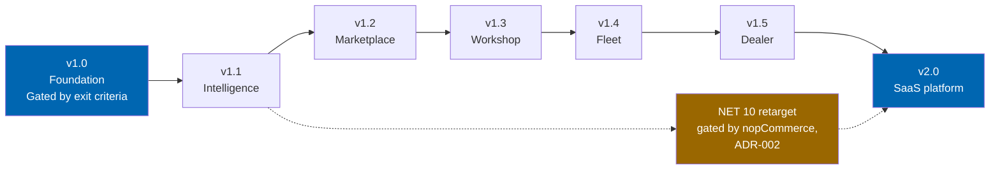
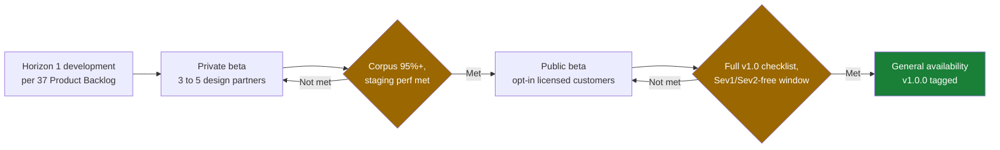
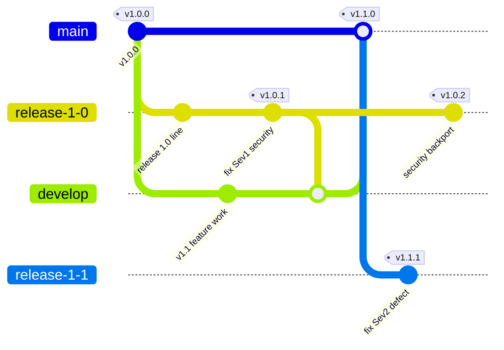

# 41 Release Plan

> The release train from v1.0 through v2.0, gating criteria drawn from ROADMAP.md's exit criteria, the
> v1.0 beta programme, go-to-market sequencing, the externally gated .NET 10 milestone, hotfix and
> SemVer policy, and rollback criteria.

**Status:** Review · **Owner:** Product Owner · **Last revised:** 2026-07-28

---

## Contents

- [Executive Summary](#executive-summary)
- [Objectives](#objectives)
- [Scope](#scope)
- [Detailed Specifications](#detailed-specifications)
  - [Release train overview](#release-train-overview)
  - [Dates policy](#dates-policy)
  - [Gating criteria per release](#gating-criteria-per-release)
  - [Beta programme for v1.0](#beta-programme-for-v10)
  - [Go-to-market sequencing](#go-to-market-sequencing)
  - [The .NET 10 milestone](#the-net-10-milestone)
  - [Hotfix and SemVer policy](#hotfix-and-semver-policy)
  - [Rollback criteria](#rollback-criteria)
- [Architecture](#architecture)
- [User Stories](#user-stories)
- [Acceptance Criteria](#acceptance-criteria)
- [Future Enhancements](#future-enhancements)
- [References](#references)

---

## Executive Summary

Check Engine ships as seven releases across five horizons: **v1.0** (Horizon 1, Foundation) through
**v2.0** (Horizon 5, SaaS). Every release is **gated by exit criteria, not by a calendar date** — this
document states no ship date for v1.0, because none exists yet to state honestly, and states exactly
one external calendar fact (.NET 9's end of support) because it is the one date genuinely outside Twin
Particles' control.

Takeaways:

1. **v1.0 has no target date.** It ships when the Horizon 1 exit criteria in
   [ROADMAP.md](../ROADMAP.md#horizon-1--foundation) are met, most consequentially the fitment accuracy
   corpus reaching 100% on the Must set ([35](35-testing-strategy.md#fitment-accuracy-corpus)). Any
   date quoted externally before that point is a forecast, not a commitment, and must be labelled as
   such.
2. **The .NET 10 milestone is gated by nopCommerce, not by Twin Particles.** .NET 9 reaches end of
   support on **10 November 2026** — a fact, not a forecast — but nopCommerce's next major version,
   which v2.0 tracks, has no announced date. `ADR-002` treats this as a standing, budgeted milestone.
3. **v1.0 runs a two-stage beta** — private, then public — each with its own exit gate, before general
   availability. Neither stage has a fixed duration; each ends when its gate is satisfied.
4. **SemVer plus a platform-compatibility discipline** governs every version number, per
   [README.md — Versioning and support](../README.md#versioning-and-support): patches never carry a
   schema or API break, and two minor lines are supported concurrently.
5. **Forward-fix is preferred to rollback.** A release is pulled or a customer advised to stay on the
   prior minor only when a forward-fix cannot meet the severity SLA in
   [CONTRIBUTING.md](../CONTRIBUTING.md#reporting-defects) — never as a default response to a defect.

---

## Objectives

| # | Objective | Traces to | Measure |
|---|---|---|---|
| 1 | Define the release train and its version numbers | `ROADMAP.md` product horizons | Table below, seven releases |
| 2 | Adapt each horizon's exit criteria into a release-level gating checklist | `ROADMAP.md` per-horizon exit criteria | Checklists below |
| 3 | Define the v1.0 beta programme with exit gates, not fixed durations | `BR-004`, `RISK-01` | Beta stage table |
| 4 | Sequence go-to-market against marketplace publishing and commercial readiness | [42](42-marketplace-publishing.md), [44](44-commercial-strategy.md) | Sequencing table |
| 5 | State the .NET 10 milestone as an external gate with no invented ship date | `ADR-002` | Milestone table, one real date only |
| 6 | Codify hotfix, SemVer, and rollback policy | [README.md](../README.md#versioning-and-support), [32](32-deployment.md#rollback) | Policy tables below |

---

## Scope

### In scope

- The release train from v1.0 to v2.0, version numbering, and per-release gating checklists
- The v1.0 beta programme
- Go-to-market sequencing at the level of what must be true before the next step, not calendar dates
- The .NET 10 retargeting milestone and its externally gated nature
- Hotfix, SemVer, and rollback policy at the release level

### Out of scope

| Not covered | Where |
|---|---|
| Sprint-level decomposition that produces a release | [36 Sprint Planning](36-sprint-planning.md) |
| Item ranking and points within a horizon | [37 Product Backlog](37-product-backlog.md) |
| nopCommerce Marketplace listing assets and submission mechanics | [42 Marketplace Publishing](42-marketplace-publishing.md) |
| Pricing, packaging, and sales motion | [44 Commercial Strategy](44-commercial-strategy.md) |
| Licence tiers, activation, and entitlement mechanics | [43 Licensing](43-licensing.md) |
| Deployment-level install, upgrade, and rollback procedure | [32 Deployment](32-deployment.md) |

### Assumptions

- nopCommerce continues a roughly annual major-version cadence, consistent with its history through
  4.30, 4.60, and 4.90; this is a planning assumption, not a commitment nopCommerce has made.
- A design-partner cohort of three to five operators, drawn from existing ERPNext users in the launch
  region, is available for the private beta stage.
- Every release satisfies the platform requirements in
  [README.md — Platform requirements](../README.md#platform-requirements) at the time it ships.

### Dependencies

[ROADMAP.md](../ROADMAP.md), [36 Sprint Planning](36-sprint-planning.md),
[37 Product Backlog](37-product-backlog.md), [32 Deployment](32-deployment.md),
[42 Marketplace Publishing](42-marketplace-publishing.md),
[44 Commercial Strategy](44-commercial-strategy.md), [43 Licensing](43-licensing.md).

---

## Detailed Specifications

### Release train overview

| Release | Horizon | Theme | Ships when |
|---|---|---|---|
| **v1.0** | 1 — Foundation | A correct, complete, single-supplier automotive store | Horizon 1 exit criteria met in full, including the public beta exit gate |
| **v1.1** | 2 — Intelligence | AI that shortens work without removing judgement | Horizon 2 exit criteria met; v1.0 has been generally available for at least one full support cycle of customer feedback |
| **v1.2** | 3 — Marketplace | From one supplier to many | Horizon 3 exit criteria met |
| **v1.3** | 4 — Verticals (Workshop) | Job-based ordering and trade pricing | Horizon 4 workshop-portal exit criteria met |
| **v1.4** | 4 — Verticals (Fleet) | Bulk vehicle registers and maintenance forecasting | Horizon 4 fleet-portal exit criteria met |
| **v1.5** | 4 — Verticals (Dealer) | Franchise-aware catalogs and allocation | Horizon 4 dealer-portal exit criteria met |
| **v2.0** | 5 — Platform | Check Engine as a hosted, multi-tenant service | Horizon 5 exit criteria met **and** the .NET 10 retarget is complete |

Each release is additive to the support matrix in
[README.md — Support matrix](../README.md#support-matrix): a new major or minor version does not
retire the previous one until its own supported window elapses.

### Dates policy

This document states dates only where they are facts about something outside Twin Particles' control,
never as a promise of when Check Engine ships. This is a deliberate policy, not an omission.

| Statement | Type | Why |
|---|---|---|
| "v1.0 ships when Horizon 1 exit criteria are met" | Gate, no date | The honest statement — see [ROADMAP.md](../ROADMAP.md#horizon-1--foundation) |
| ".NET 9 reaches end of support on 10 November 2026" | External fact, dated | Published by Microsoft, verifiable independently of Check Engine's schedule |
| "nopCommerce's next major version is expected to target .NET 10" | Expectation, no date | Inferred from cadence, not announced by nopCommerce Ltd |
| "v2.0 ships when Horizon 5 exit criteria are met and .NET 10 retarget is complete" | Gate, no date | Compound gate; naming a date would imply control Twin Particles does not have over nopCommerce's release |

Any external communication — marketing page, investor update, customer call — that attaches a calendar
date to v1.0 or v2.0 is out of step with this document and should be corrected against it.

### Gating criteria per release

Each checklist adapts the corresponding horizon's exit criteria from ROADMAP.md into a release-signing
checklist. A release is not tagged until every box is checked; a partially met checklist is a reason to
extend the hardening sprint in [36 Sprint Planning](36-sprint-planning.md#feature-freeze-policy), not a
reason to relabel the release "beta" and ship anyway.

#### v1.0 — Foundation

- [ ] A supplier catalog in PDF, Excel, or CSV form imports to a published, reviewed state without manual data entry
- [ ] A VIN resolves to a vehicle configuration, and the resulting parts list contains no part that does not fit
- [ ] Every published fitment claim carries a confidence score and a provenance record
- [ ] The fitment accuracy corpus Must set passes at 100% ([35](35-testing-strategy.md#fitment-accuracy-corpus))
- [ ] Search returns results within budget at reference catalog scale ([03](03-non-functional-requirements.md))
- [ ] The storefront meets its Core Web Vitals targets on a mid-range mobile device over a throttled connection
- [ ] Arabic and English render correctly in RTL and LTR with no layout defects
- [ ] Orders, inventory, and customers reconcile with ERPNext with no manual intervention
- [ ] Test coverage meets the thresholds in [35 Testing Strategy](35-testing-strategy.md)
- [ ] The plugin installs and uninstalls cleanly on a stock 4.90.6 instance, leaving no orphaned schema
- [ ] Security review passes with no open high or critical findings
- [ ] The public beta exit gate in [Beta programme](#beta-programme-for-v10) is satisfied

#### v1.1 — Intelligence

- [ ] Natural-language search resolves the published benchmark query set at or above its accuracy target
- [ ] No AI feature can publish customer-visible content without passing through review
- [ ] Every AI recommendation is fitment-constrained to the active vehicle context
- [ ] AI spend is observable per feature, and a configured ceiling stops spend rather than degrading silently
- [ ] All AI features remain individually disableable, and the product is fully functional with every one disabled
- [ ] v1.0 has completed at least one full support cycle with no open Sev1 defect

#### v1.2 — Marketplace

- [ ] A supplier onboards, lists, sells, ships, and is paid without operator intervention
- [ ] A vendor cannot read or modify another vendor's catalog, orders, or customers
- [ ] Commission and payout figures reconcile exactly with ERPNext
- [ ] Vendor-contributed fitment claims are attributed, reviewable, and revocable
- [ ] Split-cart checkout settles correctly across at least two vendors in the reference test scenario

#### v1.3 / v1.4 / v1.5 — Workshop, Fleet, Dealer

Each vertical release shares the same three-item exit criteria from
[ROADMAP.md — Horizon 4](../ROADMAP.md#horizon-4--verticals), applied to its own portal:

- [ ] The segment's primary workflow completes without using the retail storefront
- [ ] Segment-specific pricing, credit terms, and approval rules are enforced server-side
- [ ] The portal's data model reuses the core vehicle and fitment engines with no forked logic

Plus one portal-specific verification: workshop job-to-parts allocation reconciles against the order
(v1.3); fleet maintenance forecasting output matches the reference consumption dataset within its
stated tolerance (v1.4); dealer allocation and quota enforcement blocks an over-quota order server-side
(v1.5).

#### v2.0 — SaaS platform

- [ ] A tenant cannot read or modify another tenant's data under load testing, not only functional testing
- [ ] Metered billing reconciles against actual per-tenant usage
- [ ] The public REST API is versioned, documented, and has not had a breaking change since its own beta
- [ ] The .NET 10 retarget has passed full regression per [32 Deployment — NET 10 retarget](32-deployment.md#net-10-retarget)
- [ ] Vehicle-data-as-a-service consumers can be onboarded without engineering involvement per request

### Beta programme for v1.0

Two stages, each ended by its exit gate rather than a fixed number of weeks. A stage that has not met
its gate does not advance, regardless of elapsed time.

| Stage | Who | Entry gate | Exit gate |
|---|---|---|---|
| **Private beta** | Three to five design-partner operators, invited, under a beta agreement referencing [44 Commercial Strategy](44-commercial-strategy.md) terms | Fitment corpus Must set ≥ 95%; staging performance budgets met; core v1.0 checklist items above are checked except the ones only measurable at production scale | No open Sev1 defect from partner usage; corpus at 100%; at least one partner has completed a full import-to-checkout cycle on their own catalog |
| **Public beta** | Any licensed customer, opt-in | Private beta exit gate met | Full [v1.0 gating checklist](#v10--foundation) checked; a rolling window with no newly opened Sev1 or Sev2 defect from the beta cohort |

| Programme element | Detail |
|---|---|
| Feedback loop | Weekly office hours during private beta; a shared defect tracker visible to all beta participants during public beta |
| Defect handling | Triaged against the severity table in [CONTRIBUTING.md — reporting defects](../CONTRIBUTING.md#reporting-defects); a beta-reported Sev1 or Sev2 blocks GA until resolved and verified |
| Data handling | Beta participants use production data at their own discretion; Check Engine does not require synthetic-only data for beta, but wrong-fitment reports from beta are treated as Sev2 minimum per the same rule that applies post-GA |
| Communication | Beta status (which stage, which gate items remain open) is visible to all participants; no participant is told a date, only a gate |

### Go-to-market sequencing

Sequencing states what must be true before the next step, deliberately without calendar placement.

| Step | Precondition | Coordinates with |
|---|---|---|
| 1. Pricing and packaging finalised | Commercial model decided for the tiers the private beta agreement will reference | [44 Commercial Strategy](44-commercial-strategy.md) |
| 2. Private beta opens | Private beta entry gate met (see [Beta programme](#beta-programme-for-v10)) | — |
| 3. Public beta opens | Private beta exit gate met | [44](44-commercial-strategy.md) sales motion drafted for a self-hosted licence sale |
| 4. Marketplace submission prepared | Public beta open; listing assets, screenshots, and description drafted against the product as it now behaves, not as originally speculated | [42 Marketplace Publishing](42-marketplace-publishing.md) |
| 5. General availability, v1.0.0 tagged | Full v1.0 gating checklist satisfied | Direct sales channel opens same day |
| 6. Marketplace submission filed | GA reached; submission uses the GA build, never a beta build | [42](42-marketplace-publishing.md); nopCommerce Ltd's review timeline is an external gate, not one Twin Particles controls |
| 7. Marketplace listing live | nopCommerce review passes | [42](42-marketplace-publishing.md), [44](44-commercial-strategy.md) launch communication |

Direct self-hosted sales are not blocked on marketplace acceptance; the marketplace is an additional
distribution channel, not the only one, consistent with the packaging model in
[README.md — Packaging](../README.md#packaging).

### The .NET 10 milestone

Restated from [ROADMAP.md — the .NET 10 milestone](../ROADMAP.md#the-net-10-milestone) at the release
level: Check Engine tracks the platform, it does not lead it. A plugin cannot target a runtime its host
does not support, so v2.0's .NET 10 retarget is triggered by nopCommerce's release, not by a date this
document sets.

| Event | Status as of this document | Date |
|---|---|---|
| .NET 9 released, Standard Term Support | Past | November 2024 |
| .NET 10 released, Long Term Support | Past | November 2025 |
| .NET 9 reaches end of support | Future, fixed | **10 November 2026** |
| nopCommerce next major, expected on .NET 10 | Not yet announced | External gate — no date |
| .NET 10 reaches end of support | Future, fixed | November 2028 |

Twin Particles maintains a compatibility branch ahead of nopCommerce's release where feasible
(`RISK-04`), so that when the gate opens, v2.0's .NET 10 work is a retarget-and-regress exercise per
[32 Deployment](32-deployment.md#net-10-retarget), not a from-scratch port. This budgeted-but-undated
posture is the release-level expression of `ADR-002`.

### Hotfix and SemVer policy

Version numbers follow [README.md — Versioning and support](../README.md#versioning-and-support).
This section states what that means for a hotfix specifically.

| Rule | Detail |
|---|---|
| PATCH increment | Bug fix only. No schema change, no API change, no new nopCommerce version target |
| MINOR increment | Backward-compatible feature, additive schema only, same nopCommerce major target |
| MAJOR increment | Breaking change, or a new nopCommerce major version target |
| Concurrent support | Two minor lines supported at a time, per [README.md — Support matrix](../README.md#support-matrix); a hotfix to the older of the two is still owed until its window elapses |
| Security backport | A security fix is backported to **every** currently supported version, regardless of the two-minor rule for feature backports |
| Branch | `fix/US-nnn-short-slug` or `fix/defect-id`, branched from the affected `release/x.y`, per [CONTRIBUTING.md — branching model](../CONTRIBUTING.md#branching-model) |
| Review | One engineer approval plus a regression test that failed on the defect before the fix, per [CONTRIBUTING.md — ways to contribute](../CONTRIBUTING.md#ways-to-contribute) |
| Changelog | Mandatory entry under the affected version in `CHANGELOG.md`, including the migration note if the patch touches schema in a purely additive way |

| Severity (per [CONTRIBUTING.md](../CONTRIBUTING.md#reporting-defects)) | Target patch shipped |
|---|---|
| 1 — Critical | Within 48 hours of root cause confirmed |
| 2 — High | Within 5 business days |
| 3 — Medium | Next scheduled patch release |
| 4 — Low | Next scheduled minor release |

**Incorrect fitment is always at least severity 2**, so a wrong-fitment hotfix never waits for a
scheduled patch window.

### Rollback criteria

**Forward-fix is the default.** A release is rolled back, or customers are advised to remain on the
prior minor, only when forward-fixing cannot meet the severity SLA above.

| Trigger | Response |
|---|---|
| Migration corrupted data on a subset of installs | Rollback per [32 Deployment — rollback](32-deployment.md#rollback): restore database and prior plugin package; do not attempt a forward-fix migration against already-corrupted rows |
| Security exposure requires immediate removal | Pull the release artefact from distribution channels immediately; advisory issued per [CONTRIBUTING.md — reporting security vulnerabilities](../CONTRIBUTING.md#reporting-security-vulnerabilities); patch follows under the Sev1 SLA |
| A Sev1 defect cannot be safely forward-fixed within 48 hours | Advise affected customers to remain on the prior minor while the fix is completed; do not ship a rushed patch that has not been through the TDD cycle |
| Any other defect, however severe, that a red-then-green regression test can fix within its SLA window | Forward-fix; rollback is not invoked |

A rollback is always accompanied by a `CHANGELOG.md` entry stating what was rolled back and why,
consistent with the changelog's role in the traceability chain.

---

## Architecture

The release train is a single forward path with one externally gated branch point. Reading the
sequence bottom to top of the document is the same as reading it left to right here.

The v1.0 beta programme sits inside the first node above; expanded, it is a two-gate funnel rather than
a single step.

Hotfix and backport flow, illustrating the two-minor concurrent support rule against a live security
fix:

Both `release-1-0` and `release-1-1` remain live at once, which is the diagram's point: the two-minor
support window is not a policy statement without a mechanism, it is this branch shape.

### Rejected alternatives

| Alternative | Rejected because |
|---|---|
| A committed calendar date for v1.0 | Commits to a number the fitment corpus and beta cohort do not yet support, and repeats the failure mode `RISK-01` exists to prevent — a confident wrong answer, this time about the calendar rather than a part |
| Continuous deployment with no discrete releases | The nopCommerce Marketplace and self-hosted customers both require an installable, versioned artefact; a plugin cannot be "always the latest commit" the way a SaaS-only product could |
| Supporting three minor lines concurrently | Multiplies the hotfix and security-backport burden for marginal customer benefit; two lines matches the pace at which customers have historically been willing to upgrade a commerce platform |
| Skipping the private beta and going straight to public | Removes the lowest-cost place to catch a defect — a small, engaged cohort under closer support — before opening the corpus-completeness claim to a wider, less forgiving audience |

---

## User Stories

| ID | Persona | Story | Points | Priority |
|---|---|---|---|---|
| `US-821` | Release Manager | Tag v1.0.0 only once every gating checklist item is checked | 3 | Must |
| `US-822` | Design-partner operator | Join the private beta and know exactly which gate my catalog needs to pass | 3 | Must |
| `US-823` | Support engineer | Know the SLA for a Sev1 patch without checking three documents | 2 | Must |
| `US-824` | Product Owner | Communicate v1.0's status externally using gate language, never a date | 3 | Must |

---

## Acceptance Criteria

**`AC-41.1`** — No fabricated date
Given any public-facing description of v1.0's release timing, when reviewed against this document, then
it states a gate ("when Horizon 1 exit criteria are met") and never a calendar date.

**`AC-41.2`** — Checklist completeness before tagging
Given a release candidate for any version in the [release train](#release-train-overview), when it is
tagged, then every item in that release's [gating checklist](#gating-criteria-per-release) is checked
and evidenced.

**`AC-41.3`** — Beta gate enforcement
Given the private beta cohort reports an open Sev1 defect, when the public beta start is considered,
then the public beta does not open until that defect is resolved and verified.

**`AC-41.4`** — Security backport reach
Given a security fix is released for the current minor, when supported-version status is checked, then
the fix is also released for every other currently supported minor, not only the newest.

**`AC-41.5`** — Rollback is exceptional
Given a defect that a red-then-green regression test can resolve within its severity SLA, when the
response is decided, then a forward-fix patch is issued and a rollback is not invoked.

---

## Future Enhancements

| Enhancement | Horizon | Notes |
|---|---|---|
| Canary or blue-green release strategy | 2 | Once farm deployments are common, reduces hotfix blast radius further than the rolling-deploy model in [32](32-deployment.md#web-farm) |
| Automated release-note generation from `CHANGELOG.md` | 2 | Reduces manual transcription error between the changelog and marketplace release notes |
| Continuous-delivery cadence for the SaaS tier | 5 | Once v2.0's multi-tenant operation exists, the SaaS tier may adopt a faster cadence than the self-hosted plugin line, which remains discrete-release for Marketplace compatibility |
| Customer-facing release radar | 3 | A public, non-confidential view of upcoming gates, distinct from a date-bearing roadmap |

---

## References

- [ROADMAP.md](../ROADMAP.md) — horizons and the exit criteria this document's checklists adapt
- [36 Sprint Planning](36-sprint-planning.md) — the sprint sequence that produces a release candidate
- [37 Product Backlog](37-product-backlog.md) — ranked scope each release draws from
- [32 Deployment](32-deployment.md) — install, upgrade, rollback, and the NET 10 retarget procedure
- [42 Marketplace Publishing](42-marketplace-publishing.md) — listing submission mechanics
- [44 Commercial Strategy](44-commercial-strategy.md) — pricing, packaging, and sales motion
- [43 Licensing](43-licensing.md) — licence tiers referenced by the beta agreement
- [README.md — Versioning and support](../README.md#versioning-and-support) — SemVer and the support matrix
- [CONTRIBUTING.md](../CONTRIBUTING.md) — defect severity table and security disclosure process
- [.NET support policy](https://dotnet.microsoft.com/en-us/platform/support/policy/dotnet-core) — the one external date this document relies on
