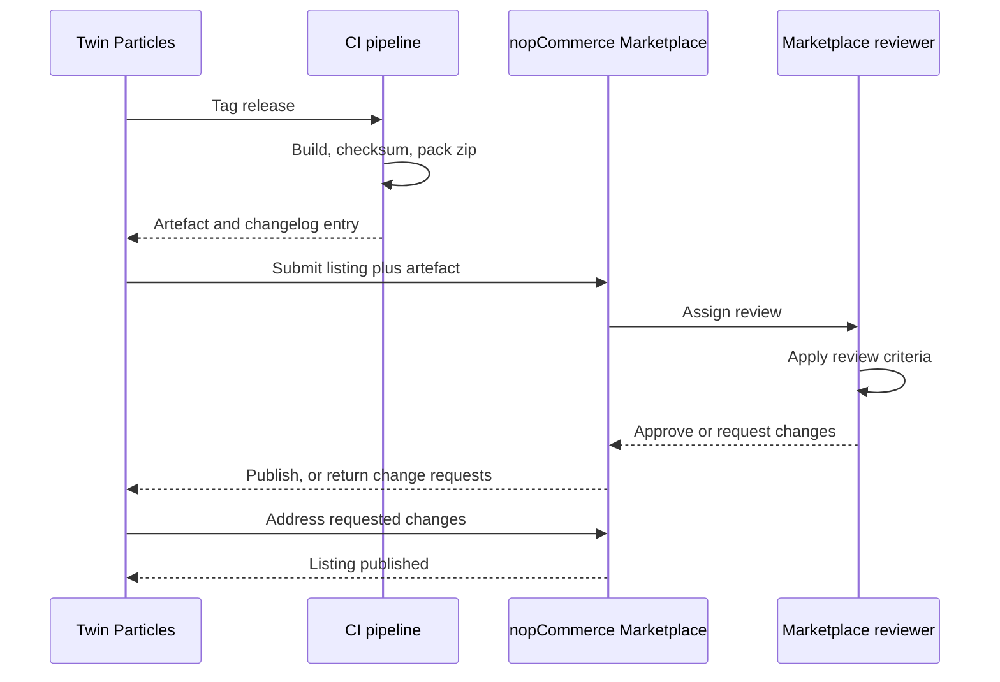
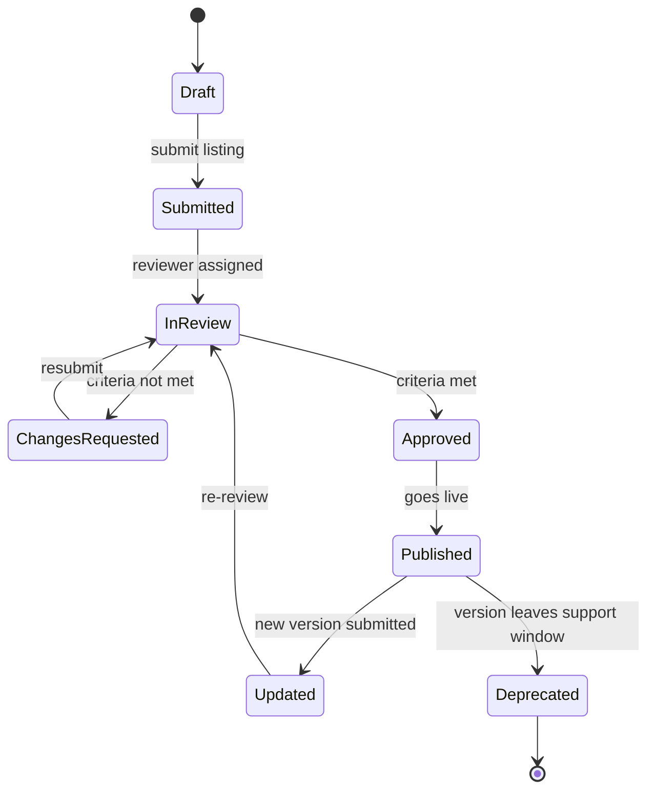

# 42 Marketplace Publishing

> nopCommerce Marketplace submission for the Check Engine plugin: packaging rules, listing assets and
> copy, review criteria, the version update process, companion-plugin listings, and trademark-safe
> listing language.

**Status:** Review · **Owner:** Product Owner / DevOps Architect · **Last revised:** 2026-08-25

**Engineering status (2026-08-25):** Plugin `0.104.0` is in tree. Progress, evidence gates (G1–G6 done; G11 packing partial), and remaining blockers (H1.35/G8, G7, G11 vendor signing, G12) are recorded in [EXECUTION-PLAN.md](../EXECUTION-PLAN.md). This document remains the specification baseline.

---

## Contents

- [Executive Summary](#executive-summary)
- [Objectives](#objectives)
- [Scope](#scope)
- [Detailed Specifications](#detailed-specifications)
  - [Submission overview](#submission-overview)
  - [Package composition and boundaries](#package-composition-and-boundaries)
  - [Listing assets](#listing-assets)
  - [Listing description (English)](#listing-description-english)
  - [Trademark nominative use in listing copy](#trademark-nominative-use-in-listing-copy)
  - [Review criteria](#review-criteria)
  - [Companion plugin listings](#companion-plugin-listings)
  - [Version update process](#version-update-process)
  - [Support URL and channel](#support-url-and-channel)
  - [Submission readiness checklist](#submission-readiness-checklist)
- [Architecture](#architecture)
- [User Stories](#user-stories)
- [Acceptance Criteria](#acceptance-criteria)
- [Future Enhancements](#future-enhancements)
- [References](#references)

---

## Executive Summary

The nopCommerce Marketplace is a **secondary distribution and discovery channel**, not the primary
sales motion. [05 Product Strategy](05-product-strategy.md) is explicit that marketplace-led consumer
acquisition is an anti-goal — Check Engine sells direct and through implementation partners, and the
Marketplace listing exists so a prospect already inside the nopCommerce ecosystem can find and evaluate
the product. This document specifies what it takes to get and keep a listing there without
compromising anything decided elsewhere in the specification set.

Takeaways:

1. **The package boundary is the same boundary the product already enforces.** No core modification
   (`BR-010`), clean install and uninstall (`BR-036`), and no bundled licensed third-party fitment data
   (`LICENSE.md § 9.2`) are product requirements independent of the Marketplace; this document maps them
   onto the Marketplace's review criteria rather than inventing new ones.
2. **The theme ships inside the Check Engine package**, not as a separate nopCommerce Theme listing —
   a single versioned artefact avoids the two-listing version-drift failure mode.
3. **Paymob and Bosta are separate listings**, because they are separate plugins with no dependency on
   Check Engine (`ADR-004`, `ADR-005`).
4. **Listing copy is trademark-constrained the same way catalog pages are** (`LICENSE.md § 10`): nominative
   use only, disclaimer present, no manufacturer logos.
5. **The update process is the release process** in [33 CI-CD](33-ci-cd.md) with one extra step: the
   listing itself, and its changelog excerpt, are re-submitted after the package is built.

---

## Objectives

| # | Objective | Traces to | Measure |
|---|---|---|---|
| 1 | Define the packaging boundary that keeps Check Engine eligible for listing | `BR-010`, `BR-036` | Marketplace review checklist passes on first submission |
| 2 | Specify listing assets and copy so a listing can be assembled without further discovery | `BR-037` | Draft listing reviewed and approved by the Product Owner |
| 3 | Map "no core modification" and "clean install/uninstall" review criteria to existing controls | `FR-910`–`FR-925` | Architecture tests and uninstall verification cited, not re-specified |
| 4 | Keep companion plugins as independent listings | `BR-026`, `ADR-004`, `ADR-005` | Separate listing pages; no cross-dependency |
| 5 | Align version updates with the CI/CD release train | [33](33-ci-cd.md) | Listing version equals `plugin.json` version on every update |
| 6 | Keep listing copy trademark-safe | `BR-014`, `LICENSE.md § 10` | Disclaimer present verbatim on every listing revision |

---

## Scope

### In scope

- The submission process, packaging rules, listing asset set, and listing copy for the Check Engine
  plugin listing.
- Review-criteria compliance mapping (no core modification, clean install/uninstall).
- The version update and re-submission process, aligned to [33 CI-CD](33-ci-cd.md).
- Companion plugin listings for `TwinParticles.Payments.Paymob` and `TwinParticles.Shipping.Bosta`.
- Trademark nominative-use rules as they apply specifically to listing copy and screenshots.
- The support URL published on the listing.
- A submission-readiness checklist with acceptance criteria.

### Out of scope

| Not covered | Where |
|---|---|
| The end-user licence agreement text | [LICENSE.md](../LICENSE.md) |
| Licence tiers, activation, and entitlement enforcement | [43 Licensing](43-licensing.md) |
| Pricing and packaging economics | [44 Commercial Strategy](44-commercial-strategy.md) |
| CI build, signing, checksum, and packaging mechanics | [33 CI-CD](33-ci-cd.md) |
| Plugin install/uninstall lifecycle implementation | [09 Plugin Architecture](09-plugin-architecture.md) |
| General go-to-market motion beyond the Marketplace channel | [05 Product Strategy](05-product-strategy.md) |

### Assumptions

- The nopCommerce Marketplace remains the ecosystem's principal storefront for paid, self-hosted
  nopCommerce plugins at the time of each submission. Its published vendor terms, commission structure,
  and field limits are set by nopCommerce Ltd and are outside Twin Particles' control; the Product
  Owner reviews the current terms immediately before each submission rather than this document
  reproducing figures that change independently of it.
- A Twin Particles Marketplace vendor account exists and is in good standing before the first
  submission.
- The compiled release artefact produced by [33 CI-CD](33-ci-cd.md) is the artefact submitted; no
  Marketplace-specific build exists.

### Dependencies

[05](05-product-strategy.md), [09](09-plugin-architecture.md), [33](33-ci-cd.md),
[43](43-licensing.md), [44](44-commercial-strategy.md), [LICENSE.md](../LICENSE.md) §§ 9–10,
[CONTRIBUTING.md](../CONTRIBUTING.md), [ROADMAP.md](../ROADMAP.md) (Phase 8).

---

## Detailed Specifications

### Submission overview

| Step | Owner | Detail |
|---|---|---|
| Vendor account | Product Owner | Twin Particles registers and maintains a Marketplace vendor account, subject to nopCommerce Ltd's current vendor terms |
| Eligibility check | Product Owner | Confirm the release artefact meets [Package composition and boundaries](#package-composition-and-boundaries) before drafting a listing |
| Listing draft | Product Owner | Assemble assets per [Listing assets](#listing-assets) and copy per [Listing description (English)](#listing-description-english) |
| Legal check | Product Owner | Confirm trademark wording against [Trademark nominative use in listing copy](#trademark-nominative-use-in-listing-copy) |
| Submission | Product Owner | Submit listing and artefact through the Marketplace vendor portal |
| Review | nopCommerce Marketplace | Reviewer applies the Marketplace's published criteria; see [Review criteria](#review-criteria) for the mapping to Check Engine's controls |
| Publication | nopCommerce Marketplace | Listing goes live; support URL and pricing tier summary become customer-visible |

The Marketplace is additive to, not a replacement for, direct sales. Per [05 Product Strategy](05-product-strategy.md#go-to-market-motion),
a Marketplace-led consumer acquisition motion contradicts the customer-ownership bet the product is
built on; the listing exists for awareness and inbound qualification, not as the primary revenue
channel.

### Package composition and boundaries

| Rule | Detail | Enforced by |
|---|---|---|
| One package, one plugin | The submitted artefact is `TwinParticles.CheckEngine` only. Operator rehearsal: `pack-checkengine.sh` emits an unsigned zip; Marketplace submission is G12 and still pending | [33 CI-CD](33-ci-cd.md#packaging-and-artefacts) |
| Theme ships inside the plugin | Theme assets are part of the Check Engine `Software` definition (`LICENSE.md § 1`) and install with the plugin; there is no separate nopCommerce Theme Marketplace listing | See [Rejected alternatives](#rejected-alternatives) |
| No core modification | The package contains no patched host file; it operates through documented extension points only | `FR-910`–`FR-918`, `ADR-007` |
| No bundled licensed third-party data | The artefact contains no TecDoc, ACES, PIES, or equivalent licensed fitment dataset | `LICENSE.md § 9.2` |
| No credentials or keys | The artefact contains no connection string, API key, or licence key | [CONTRIBUTING.md](../CONTRIBUTING.md#local-configuration) |
| No customer or catalog data | The artefact ships with no seeded customer, order, or third-party catalog record beyond the documented BMW-first structural seed and H1.6a top-10 catalog JSON | `LICENSE.md § 9.1` |
| Host binaries excluded | The zip must not contain `Nop.Web`, `App_Data`, or native `runtimes` copied from a local host build | `PluginPackagingConventionsTests` |
| Version alignment | `plugin.json` `Version` equals the `AssemblyInformationalVersion` of the submitted build | `AC-33.4` |
| `SupportedVersions` accuracy | `plugin.json` declares exactly the nopCommerce minor range validated in CI for that release | `FR-917` |

### Listing assets

| Asset | Requirement |
|---|---|
| Title | "Check Engine — Automotive Commerce Platform" |
| Icon / logo | The Check Engine mark, supplied at the Marketplace's published dimensions; no manufacturer mark appears in the icon |
| Short description | One sentence stating the fitment problem and the resolution, within the Marketplace's current character limit |
| Long description (English) | Full listing copy; see [Listing description (English)](#listing-description-english) |
| Screenshots | At least five: the storefront theme home page, the sticky vehicle search with a resolved VIN, a product page showing a verified-fit badge, the admin fitment review queue, and the admin licence status panel. No real customer data appears in any screenshot (`BR-015`) |
| Category / tags | `Automotive`, matching the `Group` value in `plugin.json` |
| Platform badges | nopCommerce version range and .NET runtime version, matching [README.md](../README.md#platform-requirements) |
| Pricing summary | Tier names and their headline entitlements, linking to [43 Licensing](43-licensing.md) for the full comparison rather than restating it in the listing |
| Support URL | See [Support URL and channel](#support-url-and-channel) |
| Video walkthrough | Not included at initial submission; see [Future Enhancements](#future-enhancements) |

### Listing description (English)

The long description is drafted once and revised only when capability or tier structure changes,
keeping the Marketplace copy and the product specification from diverging. A representative draft:

```text
Check Engine — Automotive Commerce Platform for nopCommerce

Selling automotive parts means answering one question correctly, every time: does this part fit
this vehicle? Check Engine adds the automotive layer nopCommerce doesn't have — a vehicle database,
a VIN decoder, an OEM part-number registry, and a fitment engine that only ever shows a customer
parts that verifiably fit their car.

What's included:
- Vehicle database: make, model, generation, body, engine, and trim, built brand-agnostic from the
  first commit
- VIN decoding with a stated confidence level on every result
- OEM part-number cross-references, aftermarket equivalence, and supersession chains
- A fitment engine that carries provenance on every claim, with mandatory human review below the
  publication confidence threshold
- Six-mode search — VIN, OEM number, vehicle tree, category, keyword, and AI natural language
- A supplier catalog import pipeline for PDF, Excel, and CSV sources
- A customer garage for saved vehicles, VINs, and OEM numbers
- Bi-directional ERPNext synchronisation
- A premium dark automotive theme with full Arabic and English, RTL and LTR support

Requires nopCommerce 4.90.0–4.90.6 on .NET 9. Licence tiers from Single Store through
OEM/Redistribution — see the licensing page linked below for the full comparison.

Check Engine is a trademark of Twin Particles. Vehicle manufacturer names referenced in this listing
and in the product's catalog are used solely to identify vehicle and part compatibility. Twin
Particles is not affiliated with, endorsed by, or sponsored by any vehicle manufacturer.
```

### Trademark nominative use in listing copy

`LICENSE.md § 10` governs what a *licensee* may publish about manufacturers in their own catalog.
This section governs what Twin Particles, as the *listing publisher*, may say about its own product's
brand coverage.

| Rule | Detail |
|---|---|
| Factual scope statements are permitted | "The initial vehicle dataset covers BMW and MINI" describes the product truthfully and is not an endorsement claim |
| No manufacturer logos or wordmarks in listing graphics | Screenshots may show manufacturer names as they appear inside the product's own UI (nominative use in context); a manufacturer roundel, wordmark, or trade dress is never used as a standalone marketing asset |
| No affiliation implication | Listing copy never states or implies partnership, sponsorship, certification, or endorsement by a vehicle manufacturer |
| Disclaimer required | Every listing revision carries the disclaimer sentence shown at the end of [Listing description (English)](#listing-description-english) verbatim |
| Aftermarket labelling is consistent | Where a screenshot shows a part, it is labelled aftermarket if it is aftermarket, matching `FR-904` |
| No legal advice | This section states Twin Particles' own publishing practice; it is not legal advice for a licensee's separate catalog obligations under `LICENSE.md § 10.3` |

### Review criteria

The Marketplace's published review criteria are not reproduced here because they are set and revised
by nopCommerce Ltd; the table below maps the criteria classes every plugin submission is assessed
against to the control that already satisfies them in Check Engine's specification.

| Criteria class | Check Engine control |
|---|---|
| No modification of nopCommerce core source | Architecture tests fail the build if `Domain` or `Application` reference `Nop.Core`/`Nop.Services` outside documented adapters (`ADR-007`, `NFR-057`) |
| Clean install on a stock instance | `FR-925`; versioned, reversible `FluentMigrator` migrations (`ADR-011`) |
| Clean uninstall, no orphaned schema or settings | `FR-921`–`FR-923`; export-before-uninstall warning (`FR-924`) |
| Accurate `SupportedVersions` | `FR-917`; validated by the CI build matrix against the declared nopCommerce minor range (`AC-33.4`) |
| No malware, obfuscation designed to hide behaviour, or undisclosed telemetry | Standard Release-configuration compiled assembly; the only outbound channel not visible in product settings is the licence heartbeat, and its payload is fully disclosed in `LICENSE.md § 6.1` and [43 Licensing](43-licensing.md#activation-and-heartbeat) |
| Licence enforcement does not disable a working install without notice | `ADR-009`; expiry degrades administration and background work only, never the storefront (`FR-981`) |
| Functional description matches actual behaviour | Listing copy is drafted from, and reviewed against, the current [README.md](../README.md) and module specifications, not marketing copy written independently of them |

### Companion plugin listings

`TwinParticles.Payments.Paymob` and `TwinParticles.Shipping.Bosta` are **listed independently** of
Check Engine.

| Plugin | Listing | Dependency on Check Engine | Why separate |
|---|---|---|---|
| `TwinParticles.Payments.Paymob` | Own listing, `Payment methods` group | None — implements the standard nopCommerce payment provider abstraction | `ADR-004`, `ADR-005`; a buyer outside the launch region should not be shown an Egypt-specific payment plugin as if it were required |
| `TwinParticles.Shipping.Bosta` | Own listing, `Shipping rate computation` group | None — implements the standard nopCommerce shipping provider abstraction | Same rationale; keeps the core package's market-agnostic claim demonstrable rather than asserted |

Each companion plugin versions independently (`FR-955`) and is submitted, reviewed, and updated on its
own schedule. Bundling either into the Check Engine package would force every buyer, including those
outside the launch region, to accept a regional dependency they may not need — this is the packaging
mistake [05 Product Strategy](05-product-strategy.md#packaging-strategy) explicitly rejects.

### Version update process

1. A release tag `vX.Y.Z` triggers the CI/CD release pipeline, producing a checksummed (and, where
   certificates are available, signed) `TwinParticles.CheckEngine.{version}.zip` (`33 CI-CD`).
2. `CHANGELOG.md` carries an entry for the version before the listing is touched — an untraceable
   listing update is not accepted (`CONTRIBUTING.md`).
3. The Product Owner updates the listing's version number, changelog excerpt, and any screenshot that
   the release changed materially.
4. The listing is re-submitted. Patch and minor updates are typically a lighter review than the initial
   submission; a major version — such as the Horizon 5 retarget to a new nopCommerce major version and
   .NET 10 — is treated as a **new eligibility review** because `SupportedVersions` changes entirely.
5. `plugin.json` `Version` and `SupportedVersions` are re-validated against the submitted build
   (`AC-33.4`, `AC-42.5`).
6. When a version leaves the two-concurrently-supported-minor-versions window in
   [README.md § Support matrix](../README.md#support-matrix), the listing's compatibility statement is
   updated so a prospect does not purchase against an unsupported line.

**Open item, recorded rather than deferred silently:** whether a major version bump (for example, the
.NET 10 retarget in Horizon 5) is published as an update to the existing listing or as a new listing
entry is a decision for the Product Owner, made when that release is scheduled, because it depends on
the Marketplace's versioning conventions in force at that time. Decision owner: Product Owner. Trigger:
scheduling of the Horizon 5 release in [41 Release Plan](41-release-plan.md).

### Support URL and channel

The listing's support URL resolves to the ticket portal referenced in `LICENSE.md § 13` and detailed in
[43 Licensing § Support lifecycle](43-licensing.md#support-lifecycle). Marketing copy on the listing
states channel availability only ("ticket portal and email"); it does not restate per-tier response
time targets, because those vary by licence tier and overstating them in public marketing copy would
create an expectation the lowest tier does not carry.

### Submission readiness checklist

| # | Check |
|---|---|
| 1 | Release artefact built and checksummed by the tagged CI pipeline (or `pack-checkengine.sh` for unsigned rehearsal). Vendor signing and Marketplace upload remain G11 remainder / G12 |
| 2 | `CHANGELOG.md` entry exists for the version being submitted |
| 3 | `plugin.json` `Version` equals the build's informational version |
| 4 | `plugin.json` `SupportedVersions` matches the CI-validated nopCommerce range |
| 5 | Architecture tests green (no core reference) |
| 6 | Install and uninstall verified on a clean 4.90.6 instance in the current release cycle |
| 7 | Artefact scanned for licensed third-party data, credentials, and customer data — none present |
| 8 | Screenshots current for this version and free of real customer data |
| 9 | Listing copy carries the manufacturer non-affiliation disclaimer verbatim |
| 10 | Support URL resolves to the current ticket portal |
| 11 | Pricing summary links to, and does not contradict, [43 Licensing](43-licensing.md) |
| 12 | Product Owner sign-off recorded before submission |

---

## Architecture



Submission is a request-response cycle around a single artefact that CI already produces; the only new
work the Marketplace adds is the listing itself and its review turnaround.



A listing spends most of its life in `Published`, cycling briefly through `Updated` and `InReview` on
each release; `Deprecated` is reached by the support-window policy, not by removal.

### Rejected alternatives

| Alternative | Rejected because |
|---|---|
| Separate nopCommerce Theme Marketplace listing for the theme assets | Two listings for one product invite version drift — a buyer could install a theme version that predates the plugin version it was built for. The theme is part of the `Software` in `LICENSE.md § 1` and ships inside one artefact |
| Bundling Paymob and/or Bosta into the Check Engine package | Violates `ADR-004`/`ADR-005` and forces a regional dependency on every buyer, including those outside the launch region |
| Marketplace as the primary sales channel | Contradicts the customer-ownership bet in [05 Product Strategy](05-product-strategy.md); the Marketplace's transaction model also does not fit a tiered, entitlement-based commercial licence as cleanly as direct sale |
| Publishing exact Marketplace commission and fee figures in this document | Those terms are set unilaterally by nopCommerce Ltd and can change independently of this specification; restating them here would create a stale, uncheckable claim |

---

## User Stories

| ID | Persona | Story | Traces to | Points | Priority |
|---|---|---|---|---|---|
| `US-831` | Product Owner | Assemble a Marketplace listing from this document without further discovery | [Listing assets](#listing-assets) | 5 | Must |
| `US-832` | DevOps Engineer | Verify `plugin.json` `SupportedVersions` before every submission | `FR-917`, `AC-33.4` | 3 | Must |
| `US-833` | Prospect | See an accurate manufacturer non-affiliation disclaimer on the listing | `BR-014` | 2 | Must |
| `US-834` | Release Manager | Update the listing after a patch release without breaking existing installs | [Version update process](#version-update-process) | 5 | Must |
| `US-835` | Buyer | Confirm that Paymob and Bosta are optional, not required, before purchase | `ADR-004`, `ADR-005` | 3 | Should |
| `US-836` | Reviewer (nopCommerce Marketplace) | Verify clean install and uninstall on a stock instance during review | `FR-921`–`FR-925` | 5 | Must |

---

## Acceptance Criteria

**`AC-42.1`** — No core modification
Given the submitted artefact, when the architecture test suite runs against it, then no host source
file has been patched and no reference to a non-public nopCommerce type exists (`FR-918`).

**`AC-42.2`** — Clean uninstall
Given a stock 4.90.6 instance with Check Engine installed, when it is uninstalled, then no `Ce*` schema
object, setting, locale resource, or schedule task remains (`FR-921`–`FR-922`).

**`AC-42.3`** — Companion independence
Given the Check Engine Marketplace listing, when a prospect reviews it, then nothing states or implies
that Paymob or Bosta is required to install or operate Check Engine.

**`AC-42.4`** — Trademark disclaimer present
Given a published or updated listing, when its description is rendered, then the manufacturer
non-affiliation disclaimer sentence is present verbatim.

**`AC-42.5`** — Version alignment
Given a release tag, when the listing is updated, then the listing's stated version, `plugin.json`
`Version`, and the build's `AssemblyInformationalVersion` are identical, and `SupportedVersions`
matches the CI-validated range (`AC-33.4`).

**`AC-42.6`** — No licensed third-party data in the artefact
Given the packaged artefact, when it is scanned before submission, then it contains no file sourced
from a licensed third-party fitment feed such as TecDoc, ACES, or PIES (`LICENSE.md § 9.2`).

**`AC-42.7`** — Submission readiness sign-off
Given a completed [submission readiness checklist](#submission-readiness-checklist), when every item is
checked, then the Product Owner records sign-off before the listing is submitted; an unchecked item
blocks submission.

---

## Future Enhancements

| Enhancement | Horizon | Notes |
|---|---|---|
| Automated Marketplace draft upload from the release pipeline | 3 | Already tracked as a future item in [33 CI-CD](33-ci-cd.md#future-enhancements) |
| Video walkthrough asset for the listing | 2 | Complements the AI-feature demonstrations shipping in Horizon 2 |
| Arabic listing copy | 4 | Aligned with trade-portal regional expansion rather than the initial launch-region listing |
| Sandbox/demo instance linked from the listing | 2 | Reduces pre-sales friction for evaluators who cannot self-host a trial quickly |

---

## References

- [05 Product Strategy](05-product-strategy.md) — go-to-market motion and packaging strategy
- [09 Plugin Architecture](09-plugin-architecture.md) — install/uninstall lifecycle and extension points
- [33 CI-CD](33-ci-cd.md) — build, signing, checksums, packaging, and release automation
- [43 Licensing](43-licensing.md) — licence tiers referenced from the listing
- [44 Commercial Strategy](44-commercial-strategy.md) — pricing bands behind the listing's pricing summary
- [LICENSE.md](../LICENSE.md) §§ 9–10 — vehicle data provenance and trademark obligations
- [CONTRIBUTING.md](../CONTRIBUTING.md) — release and documentation conventions
- [ROADMAP.md](../ROADMAP.md) — documentation Phase 8 sequencing
