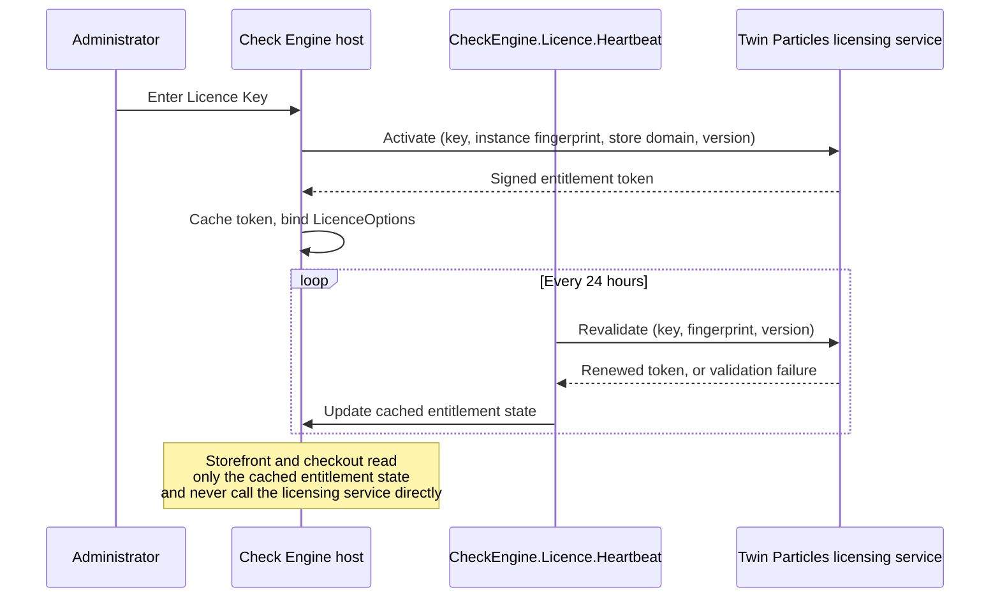
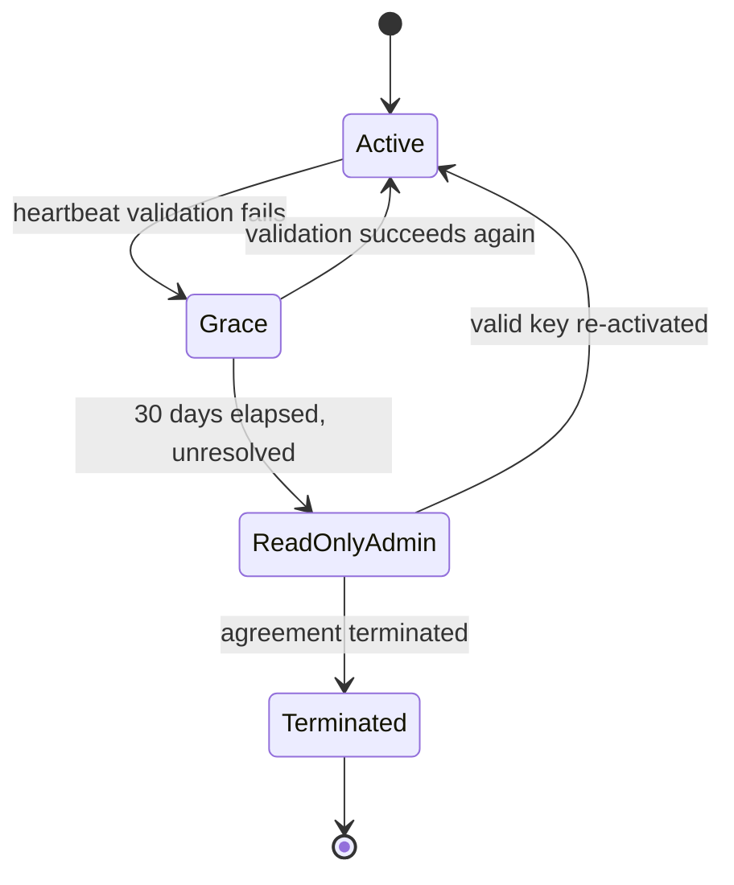
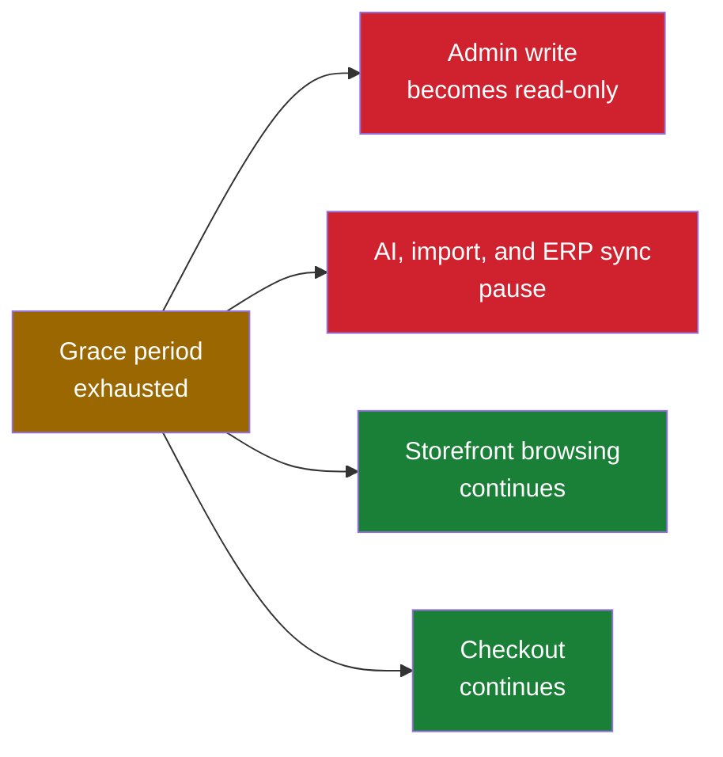

# 43 Licensing

> Licence tiers, the activation and heartbeat mechanism, offline and air-gapped operation, the
> entitlement enforcement matrix that keeps a lapsed licence from ever touching the storefront, the
> support lifecycle, end-of-life policy, the trademark compliance obligations that flow to licensees,
> marketplace-module gating, and portal SKUs as future entitlements.

**Status:** Review · **Owner:** Product Owner · **Last revised:** 2026-07-28

**Engineering status (2026-08-25):** Plugin `0.104.0` is in tree. Progress, evidence gates (G1–G6 done; G11 packing partial), and remaining blockers (H1.35/G8, G7, G11 vendor signing, G12) are recorded in [EXECUTION-PLAN.md](../EXECUTION-PLAN.md). This document remains the specification baseline.

---

## Contents

- [Executive Summary](#executive-summary)
- [Objectives](#objectives)
- [Scope](#scope)
- [Detailed Specifications](#detailed-specifications)
  - [Licence tiers](#licence-tiers)
  - [Licence key and entitlement encoding](#licence-key-and-entitlement-encoding)
  - [Activation and heartbeat](#activation-and-heartbeat)
  - [Offline and air-gapped operation](#offline-and-air-gapped-operation)
  - [Entitlement enforcement matrix](#entitlement-enforcement-matrix)
  - [Support lifecycle](#support-lifecycle)
  - [End-of-life policy](#end-of-life-policy)
  - [Trademark compliance obligations for licensees](#trademark-compliance-obligations-for-licensees)
  - [Marketplace module gating](#marketplace-module-gating)
  - [Portal SKUs as future entitlements](#portal-skus-as-future-entitlements)
  - [Audit rights operationalisation](#audit-rights-operationalisation)
- [Architecture](#architecture)
- [User Stories](#user-stories)
- [Acceptance Criteria](#acceptance-criteria)
- [Future Enhancements](#future-enhancements)
- [References](#references)

---

## Executive Summary

This document is the technical and commercial specification behind [LICENSE.md](../LICENSE.md) §§ 3, 6,
10, 13, and 18. The legal text states the rights and obligations; this document states how Check Engine
implements them — the tier-to-entitlement encoding, what the activation channel actually transmits,
what happens minute by minute when a licence lapses, and how support and end-of-life commitments are
operationalised.

Takeaways:

1. **Five tiers** — Single Store, Multi Store, Business, Enterprise, OEM/Redistribution — each encoding
   Instance count, Store count, source-code entitlement, and marketplace-module entitlement
   (`LICENSE.md § 3.1`, `BR-037`).
2. **The licensing channel carries no Licensee Data.** Activation and the 24-hour heartbeat transmit
   only the fields in [Activation and heartbeat](#activation-and-heartbeat) — never catalog, customer,
   or order data (`FR-983`, `BR-015`).
3. **A lapsed licence degrades administration and background work, never the storefront.** Checkout for
   an in-stock, fitting part completes regardless of licence state (`ADR-009`, `BR-038`, `FR-981`). This
   is the single most load-bearing design decision in this document.
4. **A 30-day grace period** absorbs transient validation failures before anything degrades
   (`LICENSE.md § 6.3`).
5. **The Marketplace module is gated to Business tier and above** (`FR-870`), and portal entitlements
   (workshop, fleet, dealer) are designed into the same token schema for Horizon 4 rather than requiring
   a second licensing system later.

---

## Objectives

| # | Objective | Traces to | Measure |
|---|---|---|---|
| 1 | Specify the five tiers precisely enough to implement entitlement checks | `BR-037` | Tier table matches `LICENSE.md § 3.1` field for field |
| 2 | Specify exactly what activation and heartbeat transmit, and confirm what they never transmit | `BR-038`, `FR-980`, `FR-983` | Payload schema matches `LICENSE.md §§ 6.1–6.2` |
| 3 | Specify offline grace and air-gapped activation | `FR-982` | Grace-period and offline-activation tests pass |
| 4 | Specify entitlement enforcement so a lapsed licence never interrupts the storefront | `BR-038`, `ADR-009`, `FR-981` | Degrade matrix implemented; `AC-08.5` and `AC-28.5` remain true under test |
| 5 | Specify the support lifecycle per tier | `BR-039` | Matches [README.md § Versioning and support](../README.md#versioning-and-support) and `LICENSE.md § 13.1` |
| 6 | Specify the end-of-life policy | `BR-039` | Two-concurrently-supported-minor-versions policy stated with a notice period |
| 7 | Operationalise the trademark obligations that flow to licensees | `BR-014`, `LICENSE.md § 10` | Disclaimer default-enabled and admin guidance present in every install |
| 8 | Define marketplace-module entitlement gating | `FR-870`, `BR-027` | Entitlement test aligned with `AC-19.5` in [19 Marketplace Module](19-marketplace-module.md) |
| 9 | Design the entitlement schema to accept future portal SKUs without a breaking change | `BR-028`, `BR-042` | Schema versioned; unknown fields ignored by older validators |

---

## Scope

### In scope

- Tier definitions and their entitlement encoding.
- The conceptual design of the activation and heartbeat protocol: what is sent, what is returned, what
  is cached, and what is never sent.
- Offline grace behaviour and the air-gapped activation procedure.
- The entitlement enforcement matrix: what degrades on expiry and what never does.
- Support lifecycle SLAs by tier and severity.
- End-of-life policy and notice periods.
- Trademark compliance obligations for licensees, operationalised from `LICENSE.md § 10` into product
  behaviour.
- Marketplace-module tier gating.
- Portal SKUs as a forward-compatible entitlement design, not yet sold.
- The operational workflow behind the audit right in `LICENSE.md § 18`.

### Out of scope

| Not covered | Where |
|---|---|
| The binding legal text of the licence | [LICENSE.md](../LICENSE.md) |
| Pricing figures and packaging economics | [44 Commercial Strategy](44-commercial-strategy.md) |
| Marketplace listing submission process | [42 Marketplace Publishing](42-marketplace-publishing.md) |
| Marketplace multi-vendor module feature specification | [19 Marketplace Module](19-marketplace-module.md) |
| AI provider data disclosure (a separate channel from licensing) | [17 AI Architecture](17-ai-architecture.md) |
| Workshop, fleet, and dealer portal feature specifications | [46](46-workshop-portal.md)–[48](48-dealer-portal.md) |

### Assumptions

- `LicenceOptions` is bound via the Options pattern and validated at startup ([09](09-plugin-architecture.md#dependency-injection)).
- The scheduled task `CheckEngine.Licence.Heartbeat` runs every 24 hours ([09](09-plugin-architecture.md#schedule-tasks)).
- The `ManageCheckEngine` permission gates the licence configuration UI ([28](28-security.md#authorisation-and-permissions)).
- The Licence Key is a token signed with a Twin Particles-held private key; the product embeds the
  corresponding public key so entitlement can be verified without a network call, which is what makes
  offline and air-gapped operation possible at all tiers.

### Dependencies

[LICENSE.md](../LICENSE.md) (source of legal truth), [08](08-system-architecture.md),
[09](09-plugin-architecture.md), [28](28-security.md), [19](19-marketplace-module.md),
`BR-037`–`BR-042`, `FR-870`, `FR-901`–`FR-905`, `FR-980`–`FR-983`, `ADR-009`.

---

## Detailed Specifications

### Licence tiers

The tier table below is the entitlement source of truth and must remain field-identical to
`LICENSE.md § 3.1`.

| Tier | Production Instances | Stores per Instance | Source code | Marketplace module | Support | Non-Production allowance |
|---|---|---|---|---|---|---|
| **Single Store** | 1 | 1 | No | No | Standard | 3 per licensed Production Instance |
| **Multi Store** | 1 | Up to 5 | No | No | Standard | 3 per licensed Production Instance |
| **Business** | 3 | Up to 10 each | Read-only | Yes | Priority | 3 per licensed Production Instance |
| **Enterprise** | Unlimited within one legal entity | Unlimited | Modifiable | Yes | Dedicated | 3 per licensed Production Instance |
| **OEM / Redistribution** | As negotiated | As negotiated | Modifiable | Yes | Negotiated | As negotiated |

The Non-Production allowance (`LICENSE.md § 3.3`) applies uniformly across tiers because development,
staging, and continuous-integration capacity is an engineering necessity at every scale, not a
commercial upsell.

### Licence key and entitlement encoding

The Licence Key is a signed token. Its fields are the complete input to the entitlement checks that run
throughout the product; nothing in Check Engine gates a feature on any field not listed here.

| Field | Purpose | Example |
|---|---|---|
| `Tier` | Selects the row of the [Licence tiers](#licence-tiers) table applied by the entitlement matrix | `"Business"` |
| `ProductionInstanceLimit` | Enforced against the count of distinct instance fingerprints observed at heartbeat | `3` |
| `StoresPerInstanceLimit` | Enforced per instance against the platform's own multi-store count | `10` |
| `SourceCodeEntitlement` | `None`, `ReadOnly`, or `Modifiable` | `"ReadOnly"` |
| `MarketplaceModuleEntitlement` | Boolean gate for [19 Marketplace Module](19-marketplace-module.md) | `true` |
| `TermStart` / `TermEnd` | The Subscription Term window | `2026-01-01` / `2027-01-01` |
| `AccountId` | An opaque reference to the Licensee account; never a personal identifier | `acct_7f2c…` |
| `KeyVersion` / `IssuedAt` | Supports key rotation and revocation without breaking older installs | `2` / `2026-01-01` |
| `SchemaVersion` | Allows new entitlement fields to be added later without invalidating older tokens — see [Portal SKUs as future entitlements](#portal-skus-as-future-entitlements) | `1` |

An older validator that does not recognise a field added in a later `SchemaVersion` ignores it rather
than failing closed on the fields it does understand — this is what allows a future portal entitlement
to be added without forcing every existing customer to reactivate.

### Activation and heartbeat

Activation happens once, when an administrator enters a Licence Key. Revalidation happens automatically
every 24 hours via the `CheckEngine.Licence.Heartbeat` scheduled task. Both calls send exactly the
fields in `LICENSE.md § 6.1`:

| Transmitted | Purpose | Retention |
|---|---|---|
| Licence Key | Entitlement validation | Term plus 24 months |
| Instance fingerprint (salted hash of hostname and installation identifier) | Instance counting | Term plus 24 months |
| Store primary domain | Store counting | Term plus 24 months |
| Software version | Update eligibility, security notification | Term plus 24 months |
| nopCommerce and .NET version | Compatibility validation, support triage | Term plus 24 months |

What is **never** transmitted (`FR-983`), regardless of tier or configuration:

| Never transmitted | Why not |
|---|---|
| Product, category, or catalog records | The licensing channel is entitlement-only, not a telemetry channel; `LICENSE.md § 6.2` |
| Customer records | Same; also keeps Twin Particles out of a data-controller role for Licensee Data (`LICENSE.md § 12.1`) |
| Order or transaction data | Same |
| The full VIN or any personal data | Consistent with the VIN-redaction principle applied to logging (`NFR-044`, [31 Logging](31-logging.md)) |
| AI provider prompts or generated content | That is a separate, independently disclosed channel ([17 AI Architecture](17-ai-architecture.md)); the licensing channel has no relationship to it |

The response to a successful activation or heartbeat call is a signed entitlement token — the decoded
fields from [Licence key and entitlement encoding](#licence-key-and-entitlement-encoding) — which the
host caches and re-verifies locally using the embedded public key on every request that needs an
entitlement decision, so that ordinary page requests never make a network call.

### Offline and air-gapped operation

| Scenario | Behaviour |
|---|---|
| Transient network fault at a scheduled heartbeat | The Software continues operating normally on the last-known-good cached token. Retried at the next scheduled heartbeat |
| Fault persists | A 30-day grace period runs from the first failed validation (`LICENSE.md § 6.3`). Administration remains fully writable throughout the grace period |
| Grace period exhausted with no successful validation | The [Entitlement enforcement matrix](#entitlement-enforcement-matrix) applies |
| Air-gapped deployment (`FR-982`) | An offline activation file is issued on request, valid for the Subscription Term, and imported through the admin licence UI. The heartbeat task detects offline mode and does not attempt an outbound call; entitlement is verified locally against the file's embedded expiry using the same public-key mechanism as online validation |
| Renewal in an air-gapped deployment | A new offline file is issued before the current one's `TermEnd` and imported the same way; there is no automatic online renewal to fall back on, so this is an administrative process the Licensee must schedule |

### Entitlement enforcement matrix

This table is the technical realisation of `ADR-009`: **a lapsed licence changes what an administrator
can configure, never what a customer can buy.**

| Capability | Valid licence | Grace period (validation failing, ≤ 30 days) | Confirmed expiry (grace exhausted) |
|---|---|---|---|
| Storefront browsing | Full | Full | Full |
| Checkout and order placement | Full | Full | Full |
| Admin — read (view settings, reports, review queues) | Full | Full | Full |
| Admin — write (Check Engine settings, fitment publication, import configuration) | Full | Full | **Read-only** (`FR-981`) |
| AI features (content generation, natural-language search, assistant) | Per configuration | Per configuration | **Paused** |
| Import pipeline processing | Full | Full | **Paused** — queued items resume automatically on restore |
| ERPNext synchronisation | Full | Full | **Paused** — outbox continues accumulating and catches up on restore, per the same idempotent design used for ERP downtime (`FR-830`) |
| Search index incremental rebuild | Full | Full | **Paused** — the last good index continues serving search and fitment-filtered results |
| Scheduled fitment re-evaluation | Full | Full | **Paused** |
| Software Updates | Available | Available | **Not applied** |
| Marketplace module (where entitled) | Full | Full | **Read-only**, same as other admin write |

"Paused" means the background process disables itself cleanly and resumes automatically once a valid
token is restored — no data is lost, and no manual replay step is required. This is deliberately the
narrowest possible failure mode: everything a customer touches keeps working, and everything an
administrator would need to *change* is frozen rather than *broken*.

Termination under `LICENSE.md § 14` is a distinct, contractual event from a technical expiry: on
termination the Licensee has a legal obligation to cease use and destroy copies within 30 days, but
Check Engine's code contains no mechanism that forcibly shuts down a running instance. Enforcement of
termination is contractual and, where necessary, through the audit right in
[Audit rights operationalisation](#audit-rights-operationalisation) — never a remote kill switch, which
would itself be a form of the availability risk `ADR-009` exists to remove.

### Support lifecycle

Combining the tier table in `LICENSE.md § 13.1` with the severity definitions in
[CONTRIBUTING.md](../CONTRIBUTING.md#reporting-defects) gives the full response-time matrix:

| Tier | Sev 1 — Critical | Sev 2 — High | Sev 3 — Medium | Sev 4 — Low | Coverage |
|---|---|---|---|---|---|
| Single Store | 2 business days | 2 business days | 3 business days | Next planning cycle | Business hours |
| Multi Store | 1 business day | 1 business day | 3 business days | Next planning cycle | Business hours |
| Business | 8 business hours | 8 business hours | 3 business days | Next planning cycle | Extended hours |
| Enterprise | 4 hours, 24×7 | 8 business hours | 3 business days | Next planning cycle | 24×7 for Sev 1 |
| OEM / Redistribution | Negotiated | Negotiated | Negotiated | Negotiated | Negotiated |

**Incorrect fitment is always at least Severity 2** regardless of tier
([CONTRIBUTING.md](../CONTRIBUTING.md#reporting-defects)), because it is the one defect class that can
cause physical harm (`LICENSE.md § 9.4`); tier only changes response speed, never whether a fitment
defect is triaged as high severity.

Support exclusions — custom development, modified source code, third-party plugin conflicts not caused
by the Software, nopCommerce platform defects, AI Provider outages, server administration, data entry,
and training beyond the supplied Documentation — are as stated in `LICENSE.md § 13.2` and are not
repeated here as a separate list to avoid the two texts drifting.

### End-of-life policy

Check Engine supports **two minor versions concurrently**, matching
[README.md § Support matrix](../README.md#support-matrix):

| Policy | Detail |
|---|---|
| Support window | A supported minor version receives security patches and Updates until 12 months after the next minor version ships |
| End-of-life notice | Published in `CHANGELOG.md` and sent to registered licence contacts at least **90 days** before a supported version's patch support ends |
| Security backporting | Every currently supported version receives security fixes, not only the latest |
| Post-EOL behaviour | The Software continues to run — Updates and security patches simply stop. This is a risk the Licensee accepts by remaining on an unsupported version, not an enforced degradation; it is the same posture `ADR-009` takes toward licence expiry, applied to version support |
| Major-line EOL | Gated by the platform dependency track in [ROADMAP.md](../ROADMAP.md#platform-dependency-track); for example, the 2.0 line's support horizon tracks .NET 10's LTS end date of November 2028, not an independently chosen date |
| Recommended action | Upgrade before EOL; Twin Particles' implementation services (`BR-040`) are available to assist but are not mandatory |

### Trademark compliance obligations for licensees

`LICENSE.md § 10.2` places the trademark compliance obligation on the Licensee as the publisher of
their own catalog. This section specifies how the product turns that obligation into default,
enforced-by-configuration behaviour rather than leaving it as an unaided legal instruction.

| Obligation (`LICENSE.md § 10.2`) | Product behaviour | Requirement |
|---|---|---|
| Use manufacturer names/numbers only to identify a vehicle or part | Manufacturer names surface only within vehicle-selector, search, and catalog contexts; no marketing copy template inserts a manufacturer name outside those contexts | `FR-901` |
| No manufacturer logos, wordmark styling, or trade dress | The vehicle database ships with **no logo assets** of any kind | `FR-903` |
| No implied affiliation, endorsement, or sponsorship | The affiliation-disclaimer component is present wherever a manufacturer mark appears in the storefront | `FR-901` |
| Clearly identify aftermarket parts as aftermarket | A part not flagged OEM/genuine in the import pipeline renders with an "Aftermarket" badge | `FR-904` |
| Display a disclaimer on catalog pages referencing manufacturer marks | The disclaimer component defaults to **enabled**; disabling it requires an explicit, audited administrative action | `FR-902`, audit trail per [28 Security](28-security.md#audit-logging) |

The admin settings page for this component links to `LICENSE.md § 10` and states plainly that the
guidance is not legal advice (`FR-905`, `LICENSE.md § 10.3`); a Licensee operating in a jurisdiction with
stricter nominative-use case law is responsible for configuring stricter wording, and the disclaimer
text itself is editable per locale rather than hardcoded, so that it can be adapted without a code
change.

Where a Licensee's own use of a manufacturer mark gives rise to a third-party claim, `LICENSE.md § 17.2`
places the indemnification obligation on the Licensee, not on Twin Particles — the product's controls
in this section reduce the likelihood of that claim but do not shift the legal responsibility for it.

### Marketplace module gating

| Tier | Marketplace module entitlement | Behaviour without entitlement |
|---|---|---|
| Single Store | No | Marketplace admin menu and API routes return access denied |
| Multi Store | No | Same |
| Business | Yes | Full marketplace mode available (Horizon 3) |
| Enterprise | Yes | Full marketplace mode available |
| OEM / Redistribution | Yes | Full marketplace mode available |

This is the same gate exercised by `AC-19.5` in [19 Marketplace Module](19-marketplace-module.md#acceptance-criteria):
a licence lacking `MarketplaceModuleEntitlement` denies the marketplace admin route regardless of
whether the feature flag is otherwise enabled. Enabling marketplace mode does not itself require a
separate purchase transaction beyond holding a qualifying tier — there is no metered add-on for the
module itself, though an optional revenue share on marketplace GMV is a distinct commercial term
covered in [44 Commercial Strategy](44-commercial-strategy.md).

### Portal SKUs as future entitlements

The workshop, fleet, and dealer portals ([46](46-workshop-portal.md)–[48](48-dealer-portal.md)) are
Horizon 4 and are **not yet sold**. This section records the design commitment that keeps them from
requiring a second licensing system when they ship.

| Future entitlement | Portal | Horizon | Encoding approach |
|---|---|---|---|
| `WorkshopPortalEntitlement` | [46](46-workshop-portal.md) | 4 | Boolean add-on flag, independent of core tier |
| `FleetPortalEntitlement` | [47](47-fleet-portal.md) | 4 | Boolean add-on flag, optionally seat-counted |
| `DealerPortalEntitlement` | [48](48-dealer-portal.md) | 4 | Boolean add-on flag |
| `SaaSTenantEntitlement` | [49](49-saas-roadmap.md) | 5 | A metered model, structurally different from per-instance activation because the deployment itself is hosted rather than self-hosted; specified fully in [49](49-saas-roadmap.md), not retrofitted onto this token |

The constraint that makes this possible without a breaking change is `SchemaVersion` in
[Licence key and entitlement encoding](#licence-key-and-entitlement-encoding): an entitlement field
introduced in a later schema version is additive, and a validator built before that version exists
simply does not recognise the field rather than rejecting the token. A licensee who never buys a portal
entitlement is unaffected by the schema gaining the capacity to express one.

### Audit rights operationalisation

`LICENSE.md § 18` grants Twin Particles the right to verify Instance and Store compliance, subject to
30 days' written notice, no more than once in 12 months, during business hours.

| Step | Detail |
|---|---|
| Trigger | Scheduled proactively, or prompted by a heartbeat pattern suggesting more active instances than the licensed count |
| Scope | Instance fingerprint count, Store count per instance, and tier entitlement in force. Nothing else |
| Evidence | Twin Particles' own retained heartbeat records (see retention periods in [Activation and heartbeat](#activation-and-heartbeat)), cross-checked against the Licensee's own confirmation |
| Explicit exclusion | Licensee Data is never in scope, and no audit procedure requests database access, export, or a copy of catalog, customer, or order records |
| Outcome | Where the audit reveals under-licensing, the Licensee pays the shortfall and the cost of the audit within 30 days (`LICENSE.md § 18`) |
| Disruption minimisation | Conducted remotely against retained heartbeat evidence wherever possible; an on-site or system-access request is the exception, not the default |

---

## Architecture

Only the scheduled heartbeat task talks to the licensing service. Every request-time entitlement check
— including every checkout — reads the locally cached, signature-verified token, which is what makes it
structurally impossible for a slow or failing network call to affect a customer transaction.

Storefront and checkout are not modelled as states in this diagram because they do not change across
any of them — the state machine governs administration and background work only, which is the point of
`ADR-009`.

Warning-coloured trigger, danger-coloured degradations, success-coloured continuities — the diagram is
coloured to make the asymmetry itself the takeaway: two capability classes stop, two never do.

### Rejected alternatives

| Alternative | Rejected because |
|---|---|
| Hard kill-switch on expiry (disable the storefront) | Directly contradicts `ADR-009` and `BR-038`; also the single strongest argument a competitor could make against adopting a licensed plugin at all |
| Validate entitlement synchronously on every request | Makes every page load dependent on network latency to a third-party service; the cached-token design in the sequence diagram above avoids this entirely |
| One shared token schema for self-hosted activation and hosted SaaS metering | Self-hosted per-instance activation and hosted per-tenant metering are different problems with different trust boundaries; forcing one schema to serve both would compromise the SaaS design in [49](49-saas-roadmap.md) without simplifying the self-hosted case |
| Usage-based (per-catalog-row or per-order) metering in v1.0 | Does not match the per-instance mental model of a self-hosted nopCommerce plugin, and would require exactly the kind of request-time network dependency the cached-token design exists to avoid |

---

## User Stories

| ID | Persona | Story | Traces to | Points | Priority |
|---|---|---|---|---|---|
| `US-841` | Administrator | Activate a fresh install with a licence key, confident no catalog data leaves the server | `FR-980`, `FR-983` | 5 | Must |
| `US-842` | Operations engineer | Understand exactly what happens during a prolonged network outage | [Offline and air-gapped operation](#offline-and-air-gapped-operation) | 3 | Must |
| `US-843` | Store operator | Confirm that checkout keeps working after a missed renewal | `ADR-009`, `FR-981` | 5 | Must |
| `US-844` | Support engineer | Look up the correct response target for a Business-tier severity-1 ticket | [Support lifecycle](#support-lifecycle) | 2 | Must |
| `US-845` | Administrator | Activate an air-gapped installation with an offline file | `FR-982` | 5 | Should |
| `US-846` | Product Owner | Gate a future portal behind a new entitlement flag without breaking existing licences | `SchemaVersion` design | 5 | Should |
| `US-847` | Compliance officer | Conduct an audit that verifies Instance count without ever touching Licensee Data | `LICENSE.md § 18` | 3 | Should |
| `US-848` | Catalog manager | See the manufacturer disclaimer enabled by default with guidance on my obligations | `FR-901`, `FR-905` | 3 | Must |

---

## Acceptance Criteria

**`AC-43.1`** — Tier entitlement encoding
Given a Business-tier Licence Key, when it is decoded, then `ProductionInstanceLimit` is 3,
`StoresPerInstanceLimit` is 10, `SourceCodeEntitlement` is `ReadOnly`, and
`MarketplaceModuleEntitlement` is `true` (`LICENSE.md § 3.1`).

**`AC-43.2`** — No Licensee Data on the licensing channel
Given captured activation or heartbeat traffic, when inspected, then no product, customer, or order
field is present in the payload (`FR-983`).

**`AC-43.3`** — Grace period holds administration open
Given a heartbeat validation failure, when 29 days have elapsed without a successful revalidation, then
administrative write access remains fully available (`LICENSE.md § 6.3`).

**`AC-43.4`** — Confirmed expiry degrades administration only
Given 30 days have elapsed since the first failed validation with no successful revalidation, when an
administrator opens Check Engine settings, then the settings are read-only, and background AI, import,
and ERP synchronisation tasks are paused (`FR-981`).

**`AC-43.5`** — Storefront and checkout never degrade
Given any licence state, including confirmed expiry, when a customer completes checkout for an
in-stock, fitting part, then the order completes without interruption (`ADR-009`; consistent with
`AC-08.5` and `AC-28.5`).

**`AC-43.6`** — Offline activation
Given an air-gapped instance with no outbound network access, when a valid offline activation file is
imported, then the Software activates without any network call being attempted (`FR-982`).

**`AC-43.7`** — Marketplace gating
Given a Single Store licence, when the marketplace admin route is requested, then access is denied
(`FR-870`; consistent with `AC-19.5`).

**`AC-43.8`** — Restore without data loss
Given an instance in the read-only administrative state, when a valid, renewed Licence Key is
activated, then administrative write access is restored and all queued import, ERP, and AI work resumes
without data loss.

**`AC-43.9`** — Disclaimer default-enabled
Given a fresh installation with no configuration changes, when a category page referencing a
manufacturer mark is rendered, then the affiliation disclaimer is visible (`FR-901`, `FR-902`).

**`AC-43.10`** — Support severity routing
Given a Business-tier ticket logged as Severity 1, when triaged, then the first response target is 8
business hours (`LICENSE.md § 13.1`).

**`AC-43.11`** — End-of-life notice
Given a supported minor version approaching the end of its patch-support window, when the notice period
opens, then a `CHANGELOG.md` entry and a notification to registered licence contacts both exist at
least 90 days before support ends.

**`AC-43.12`** — Audit scope
Given an audit conducted under `LICENSE.md § 18`, when evidence is compiled, then it is limited to
Instance and Store counts, and no Licensee Data is requested or accessed.

---

## Future Enhancements

| Enhancement | Horizon | Notes |
|---|---|---|
| Self-service licence management portal | 2–3 | Reduces manual key issuance and renewal overhead |
| Portal entitlement flags activated in the schema | 4 | Ties to [46](46-workshop-portal.md)–[48](48-dealer-portal.md); the schema field reservation is already specified above |
| SaaS metered entitlement model | 5 | Specified in full in [49 SaaS Roadmap](49-saas-roadmap.md), not retrofitted onto this per-instance token |
| Automated audit-evidence export tool | 3 | Reduces the operational burden of an audit under `LICENSE.md § 18` for both parties |

---

## References

- [LICENSE.md](../LICENSE.md) — the binding legal text, especially §§ 3, 6, 9, 10, 13, 14, and 18
- [08 System Architecture](08-system-architecture.md) — where licensing sits in the module map
- [09 Plugin Architecture](09-plugin-architecture.md) — `LicenceOptions`, the heartbeat schedule task, settings
- [28 Security](28-security.md) — the `ManageCheckEngine` permission and the licence channel's data-minimisation rule
- [19 Marketplace Module](19-marketplace-module.md) — the feature gated by `MarketplaceModuleEntitlement`
- [42 Marketplace Publishing](42-marketplace-publishing.md) — how tier information is summarised on the public listing
- [44 Commercial Strategy](44-commercial-strategy.md) — pricing behind each tier
- [01 Business Requirements](01-business-requirements.md) — `BR-037`–`BR-042`
- [02 Functional Requirements](02-functional-requirements.md) — `FR-870`, `FR-901`–`FR-905`, `FR-980`–`FR-983`
- [ROADMAP.md](../ROADMAP.md) — the platform dependency track behind major-line end-of-life dates
- [CHANGELOG.md](../CHANGELOG.md) — `ADR-009` and the full architecture decision record
