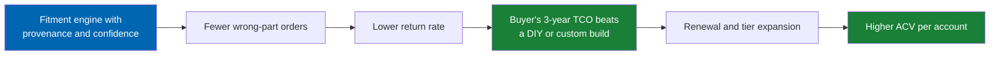
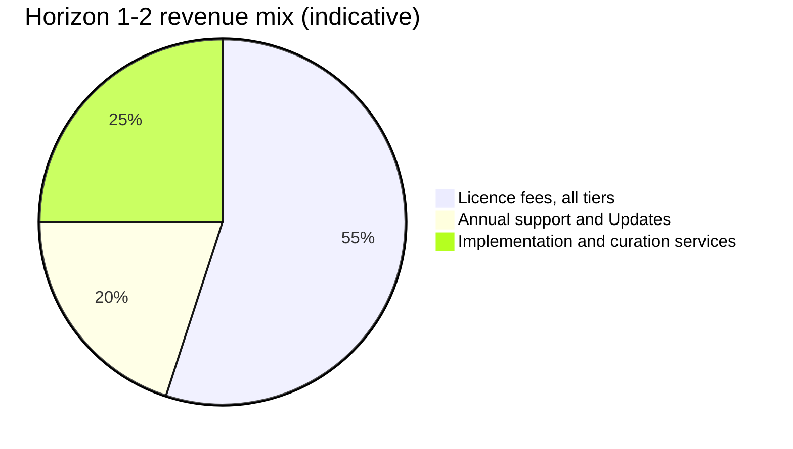
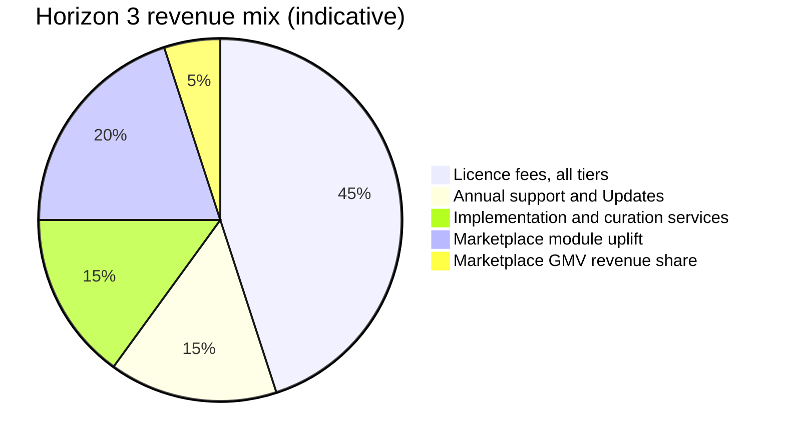
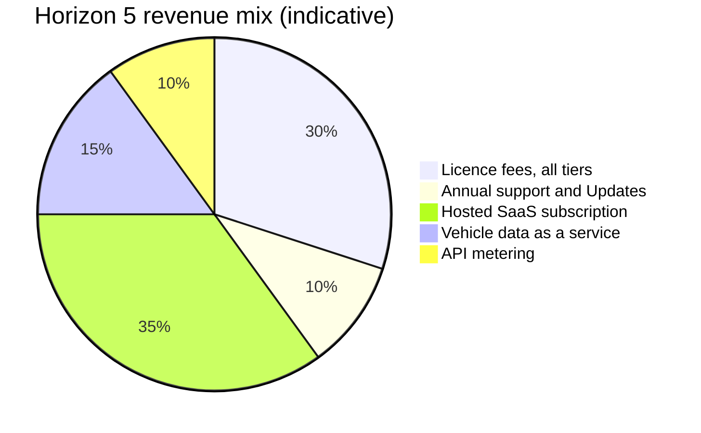

# 44 Commercial Strategy

> Pricing principles, illustrative price bands, packaging SKUs, the partner programme, the sales
> motion, unit economics drivers, competitive price posture, and revenue mix by horizon for Check
> Engine.

**Status:** Review · **Owner:** Product Owner · **Last revised:** 2026-07-28

---

## Contents

- [Executive Summary](#executive-summary)
- [Objectives](#objectives)
- [Scope](#scope)
- [Detailed Specifications](#detailed-specifications)
  - [Pricing principles](#pricing-principles)
  - [Indicative price bands](#indicative-price-bands)
  - [Packaging SKUs](#packaging-skus)
  - [Partner programme](#partner-programme)
  - [Sales motion](#sales-motion)
  - [Unit economics drivers](#unit-economics-drivers)
  - [Competitive price posture](#competitive-price-posture)
- [Architecture](#architecture)
- [User Stories](#user-stories)
- [Acceptance Criteria](#acceptance-criteria)
- [Future Enhancements](#future-enhancements)
- [References](#references)

---

## Executive Summary

This document translates [05 Product Strategy](05-product-strategy.md) and the tier structure in
[43 Licensing](43-licensing.md) into a commercial model: what is priced, roughly how, to whom, and
through which channel. **No figure in this document is drawn from market research**, and none is a
live price. Every price band is explicitly labelled **"indicative, subject to commercial review"** and
exists to make the packaging logic concrete enough to reason about, not to commit Twin Particles to a
number. The live price list is maintained by commercial operations outside this documentation baseline.

Takeaways:

1. **Packaging mirrors the licence tiers 1:1** (`LICENSE.md § 3.1`, [43](43-licensing.md)) — a buyer
   never reconciles two different tier lists.
2. **Pricing is anchored to the value of returns reduction and catalog ownership**, not to a
   competitor's per-seat data-licensing cost — Check Engine has no per-seat data cost to pass through,
   because the catalog is curated in-house (`ADR-003`).
3. **Services are optional revenue, never a mandatory gate** (`BR-040`) — a Licensee can operate fully
   licensed without buying a single hour of implementation or curation services.
4. **The partner programme's margin comes from services and referral discount, never from
   sub-licensing** — one Licence Key may not serve more than one client (`LICENSE.md § 3.4`).
5. **Competitive price posture is set against the buyer's real alternative** — a DIY or custom
   nopCommerce build — not against TecDoc-style per-seat data licensing, which is a different cost
   structure entirely.

---

## Objectives

| # | Objective | Traces to | Measure |
|---|---|---|---|
| 1 | State pricing principles and guardrails | `BR-037` | Every price figure in this document carries the indicative label |
| 2 | Provide illustrative price bands per tier | `BR-037`, `BR-039` | Bands map exactly to the tiers in [43 Licensing](43-licensing.md) |
| 3 | Define packaging SKUs matching Product Strategy | [05](05-product-strategy.md#packaging-strategy) | SKU table has no entry absent from, or contradicting, 05 |
| 4 | Define partner programme economics | `BR-040`, `LICENSE.md § 3.4` | Margin structure is compatible with the anti-sublicensing constraint |
| 5 | Define the sales motion | [05](05-product-strategy.md#go-to-market-motion) | Motion list matches 05; no channel invented here that contradicts it |
| 6 | Define unit economics drivers | `BR-018`, [00 Vision](00-vision.md) | Each driver traces to a specific product mechanism, not a marketing claim |
| 7 | State competitive price posture | [04 Competitive Analysis](04-competitive-analysis.md) | Posture explicitly excludes TecDoc per-seat pricing as an anchor |

---

## Scope

### In scope

- Pricing principles and the labelling discipline that keeps illustrative figures from being read as
  commitments.
- Indicative annual price bands per licence tier and for professional services.
- Packaging SKUs, restated from [05](05-product-strategy.md#packaging-strategy) with a pricing lens.
- The partner programme: referral and implementation margin structure.
- The sales motion, restated from [05](05-product-strategy.md#go-to-market-motion) with commercial
  ownership.
- Unit economics drivers behind the revenue model in
  [01 Business Requirements](01-business-requirements.md#revenue-model).
- Competitive price posture.
- Revenue mix by horizon.

### Out of scope

| Not covered | Where |
|---|---|
| Legal tier definitions, entitlement encoding, activation | [43 Licensing](43-licensing.md) |
| The binding licence text | [LICENSE.md](../LICENSE.md) |
| Marketplace listing submission and its pricing summary | [42 Marketplace Publishing](42-marketplace-publishing.md) |
| Feature-level competitive comparison | [04 Competitive Analysis](04-competitive-analysis.md) |
| Marketing collateral and campaign execution | Outside this repository |
| The live, current price list | Maintained by commercial operations, not this document |

### Assumptions

- Figures are expressed in USD as a neutral reference currency for illustration only; actual invoicing
  currency and amount are set per region and contract by commercial operations.
- This document is part of the confidential, proprietary documentation set governed by
  [LICENSE.md Appendix A](../LICENSE.md#appendix-a-documentation-licence); it is an internal commercial
  reference, not a published price list.
- Annual subscription is the default commercial term; multi-year terms are a discount lever applied by
  commercial operations, not a distinct tier.

### Dependencies

[05 Product Strategy](05-product-strategy.md), [43 Licensing](43-licensing.md) (tier definitions),
[LICENSE.md](../LICENSE.md) § 3, [04 Competitive Analysis](04-competitive-analysis.md) (TCO argument),
[01 Business Requirements](01-business-requirements.md#revenue-model), [ROADMAP.md](../ROADMAP.md)
(horizons).

---

## Detailed Specifications

### Pricing principles

| # | Principle | Rationale |
|---|---|---|
| 1 | **Price the outcome, not the seat.** Packaging tracks Instances, Stores, and capability entitlement — never a per-user or per-catalog-row data fee | Check Engine owns its data (`ADR-003`); a per-seat data fee would import a cost structure the product does not have |
| 2 | **Every figure in this document is an illustrative band**, explicitly labelled *"indicative, subject to commercial review"* | Distinguishes a specification artefact from a live commercial commitment |
| 3 | **Packaging mirrors the licence tiers exactly** | A prospect should never encounter a SKU name in a price sheet that does not appear in [43 Licensing](43-licensing.md) or `LICENSE.md § 3.1` |
| 4 | **Services are priced and sold separately from the licence, and are never mandatory** | `BR-040` |
| 5 | **The Marketplace module is an uplift on Business-tier-and-above pricing**, not an independent SKU | Matches the entitlement gate in [43 Licensing § Marketplace module gating](43-licensing.md#marketplace-module-gating) |
| 6 | **No price is benchmarked against a competitor's per-seat data-licensing fee** | See [Competitive price posture](#competitive-price-posture) |

### Indicative price bands

All figures below are **indicative, subject to commercial review**.

| Tier | Illustrative annual band (USD, indicative) | What moves the price within the band |
|---|---|---|
| Single Store | 1,500 – 3,000 | Support responsiveness expectations, onboarding complexity |
| Multi Store | 3,000 – 6,000 | Number of stores actually operated, up to the tier's limit of 5 |
| Business | 8,000 – 15,000 | Marketplace module usage, number of Production Instances up to 3, source-code audit access |
| Enterprise | From 25,000, quoted after scoping | Number of legal-entity Instances, dedicated support commitment, modification rights |
| OEM / Redistribution | Negotiated, not published | Redistribution scope, volume, and support commitment are unique per agreement |

| Professional service | Illustrative rate (USD, indicative) | Basis |
|---|---|---|
| Implementation (setup, ERPNext integration guidance, theme customisation) | 150 – 250 per hour, or fixed packages of 5,000 – 20,000 | Scope-dependent; fixed packages preferred for predictable engagements |
| Data curation assistance | Priced per 1,000 catalog line items processed | Directly mitigates `RISK-12` (operator cannot staff the review queue) as an optional capacity purchase, per `BR-040` |

### Packaging SKUs

Restated from [05 Product Strategy § Packaging strategy](05-product-strategy.md#packaging-strategy)
with the pricing mechanism attached; the SKU names and inclusions here must never diverge from 05.

| SKU | Includes | Priced via | Notes |
|---|---|---|---|
| Check Engine core | Plugin, theme assets, BMW-first starter methodology | Tier annual licence, see [Indicative price bands](#indicative-price-bands) | Paymob and Bosta are not included |
| Regional starter kit | Documented `Payments.Paymob` and `Shipping.Bosta` provider plugins with sample configuration | Frequently offered at no additional charge alongside a core purchase in the launch region; licensed independently if adopted standalone | Not required (`ADR-004`) |
| Curation services | Optional professional catalog review capacity | Per-1,000-line-item rate or day rate, see the services table above | Not mandatory for the licence (`BR-040`) |
| Marketplace module | Multi-supplier operation | Included in Business-tier-and-above pricing; an optional revenue share on marketplace GMV is a separate commercial term negotiated case by case | Gated by `FR-870` |
| Portal SKUs (workshop, fleet, dealer) | Trade-segment portals | **Not yet priced.** Horizon 4; see [45 Future Roadmap](45-future-roadmap.md). Decision owner: Product Owner. Trigger: sign-off of the respective portal specification | Explicit open item, not a placeholder — the trigger and owner are stated |

### Partner programme

| Partner type | Motion | Margin structure (indicative) |
|---|---|---|
| Referral partner | Introduces a qualified buyer; does not deliver services | 10–15% of first-year licence value, paid on closed-won |
| Implementation partner | Delivers implementation and/or curation services under their own engagement | Retains their own service fee in full; may receive a 15–20% discount on licence value they facilitate, structured as a reseller discount rather than a sub-licence |

The margin structure is constrained by `LICENSE.md § 3.4`: a partner may hold its own licence for
development and demonstration purposes, but **the end client, not the partner, must be the named
Licensee** on every production deployment. A partner proposal that structures the client as a
sub-licensee of the partner's own key is not a commercial variant of this programme — it is a licence
violation, and the programme's margin structure is designed so a partner never has a commercial
incentive to attempt it (the discount only applies to a licence issued directly to the client).

### Sales motion

Restated from [05 Product Strategy § Go-to-market motion](05-product-strategy.md#go-to-market-motion)
with commercial ownership attached; this table does not introduce a channel absent from 05.

| Motion | Owner | Role |
|---|---|---|
| Direct sales to importers and distributors | Twin Particles commercial | Primary motion for Horizon 1 |
| nopCommerce Marketplace listing | Product Owner, per [42 Marketplace Publishing](42-marketplace-publishing.md) | Awareness and inbound qualification; secondary |
| Implementation partners | Partner programme | Capacity without headcount, particularly for regional deployments |
| Content and SEO on fitment pain points | Twin Particles commercial / marketing | Inbound education supporting the direct motion |
| Marketplace-led consumer acquisition | — | **Not** a motion Check Engine pursues; it contradicts the customer-ownership bet (`05 anti-goals`) |

### Unit economics drivers

| Driver | Mechanism | Product feature that enables it |
|---|---|---|
| Return-rate reduction value proposition | Every percentage point of avoided returns is a concrete number a buyer can weigh against the licence cost | The fitment engine's provenance and confidence scoring ([15](15-fitment-engine.md)) |
| Annual contract value (ACV) growth path | A buyer lands on Single or Multi Store and expands to Business at the marketplace or priority-support inflection point, then to Enterprise at multi-entity scale | The tier ladder mirrors genuine usage growth rather than artificial feature withholding |
| Gross margin after support cost | Support cost scales sub-linearly with tier, because Priority and Dedicated support levels apply to a deliberately smaller share of the install base | The support lifecycle tiering in [43 Licensing](43-licensing.md#support-lifecycle) |
| Services attach rate | Curation services convert the risk that a buyer cannot staff a review queue (`RISK-12`) into an optional revenue line rather than a cause of churn | `BR-040` |
| Net revenue retention | The renewal base is support and Updates; the expansion layer is marketplace and, later, portal SKUs | The revenue model in [01 Business Requirements](01-business-requirements.md#revenue-model) |

The loop closes because a lower return rate is the argument that wins the TCO comparison in
[04 Competitive Analysis](04-competitive-analysis.md#pricing-and-commercial-model-comparison), and a won
TCO comparison is what produces renewal and expansion revenue rather than a one-time sale.

### Competitive price posture

| Compared against | Posture | Why |
|---|---|---|
| DIY or custom nopCommerce build | Check Engine's licence-plus-curation cost is compared against the fully loaded engineering cost of building and maintaining an equivalent vehicle and fitment layer in-house | This is the Ideal Customer Profile's real alternative, per [04 Competitive Analysis](04-competitive-analysis.md#pricing-and-commercial-model-comparison) |
| Shopify plus an app stack | Positioned against fee accumulation and app-management sprawl over a three-year horizon, not against a headline monthly figure | Relevant to buyers evaluating a platform switch, not only a plugin purchase |
| TecDoc-centric per-seat data licensing | **Explicitly not the pricing anchor.** Check Engine owns its data (`ADR-003`) and carries no per-seat data-licensing cost to pass through or undercut | Anchoring price to a competitor's cost structure that Check Engine does not have would misrepresent the product's actual economics and cede a pricing argument Check Engine should win outright |
| Amazon or general marketplace referral fees | Not directly comparable; different business model (traffic access versus customer ownership) | Consistent with [04 Competitive Analysis](04-competitive-analysis.md#pricing-and-commercial-model-comparison): Check Engine loses this comparison for buyers who primarily want marketplace traffic, and that comparison is not the one it is priced to win |

---

## Architecture

Revenue mix is expected to shift materially across horizons as the marketplace and platform revenue
streams in [01 Business Requirements § Revenue model](01-business-requirements.md#revenue-model) come
online. The following are **illustrative compositions**, not forecasts, and every named stream traces
to a stream already defined in that revenue model — none is introduced here for the first time.

Reading the three charts together, the conclusion is structural rather than numeric: licence fees fall
from being nearly the whole mix to a minority share, not because they shrink, but because the
marketplace uplift and, later, the SaaS and data streams are additive layers made possible by the same
owned-data decision (`ADR-003`) that makes the licence itself sellable in the first place.

### Rejected alternatives

| Alternative | Rejected because |
|---|---|
| Per-seat or per-user pricing mirroring TecDoc | Contradicts `ADR-003`; Check Engine has no per-seat data cost to recover, so per-seat pricing would misrepresent its economics rather than reflect them |
| Usage- or GMV-only pricing from Horizon 1 | Does not fit a self-hosted, per-instance plugin's operating model; metered pricing is deferred to the hosted SaaS model in [49 SaaS Roadmap](49-saas-roadmap.md), where it fits the deployment model |
| Publishing a committed, non-indicative price list in this document | Would freeze commercial terms inside a document governed by the documentation change-control process in [CONTRIBUTING.md](../CONTRIBUTING.md) rather than by commercial operations, and would go stale the moment operations adjusted a figure |
| Mandatory marketplace GMV revenue share | Rejected as a default; kept optional to preserve the self-hosted, customer-owns-the-relationship positioning central to [05 Product Strategy](05-product-strategy.md) |

---

## User Stories

| ID | Persona | Story | Traces to | Points | Priority |
|---|---|---|---|---|---|
| `US-851` | Sales representative | Quote a Business-tier deal using the indicative bands without redoing pricing research | [Indicative price bands](#indicative-price-bands) | 3 | Must |
| `US-852` | Implementation partner | Understand the referral margin range before proposing a deal to a client | [Partner programme](#partner-programme) | 3 | Should |
| `US-853` | Product Owner | Track how revenue mix is expected to shift by horizon | [Architecture](#architecture) | 3 | Should |
| `US-854` | Prospect | See Check Engine's cost compared against a custom build, not against a data-seat product | [Competitive price posture](#competitive-price-posture) | 2 | Must |
| `US-855` | Finance analyst | Model gross margin after support cost by tier | [Unit economics drivers](#unit-economics-drivers) | 5 | Should |
| `US-856` | Implementation partner | Confirm that one Licence Key cannot legally serve more than one client before structuring a deal | `LICENSE.md § 3.4` | 2 | Must |

---

## Acceptance Criteria

**`AC-44.1`** — Indicative labelling
Given any price figure in this document, when it is read, then it is accompanied by or falls under a
heading stating "indicative, subject to commercial review."

**`AC-44.2`** — SKU alignment
Given the [Packaging SKUs](#packaging-skus) table, when compared against
[05 Product Strategy § Packaging strategy](05-product-strategy.md#packaging-strategy), then every SKU
name and inclusion is identical; no SKU exists in one document and not the other.

**`AC-44.3`** — Tier alignment
Given a price band in [Indicative price bands](#indicative-price-bands), when compared against
`LICENSE.md § 3.1` and [43 Licensing § Licence tiers](43-licensing.md#licence-tiers), then the tier name
and its entitlements match exactly; no sixth tier is introduced.

**`AC-44.4`** — Partner licence compliance
Given a partner-structured deal, when reviewed, then the end client — not the partner — is the named
Licensee on the resulting Licence Key (`LICENSE.md § 3.4`).

**`AC-44.5`** — Competitive posture exclusion
Given the [Competitive price posture](#competitive-price-posture) table, when reviewed, then TecDoc-style
per-seat data-licensing pricing is explicitly named as excluded from the pricing anchor, not merely
absent from the table.

**`AC-44.6`** — Revenue stream traceability
Given a named revenue stream in any [Architecture](#architecture) pie chart, when cross-checked against
[01 Business Requirements § Revenue model](01-business-requirements.md#revenue-model), then the stream
already appears there; no revenue stream is introduced for the first time in a chart.

---

## Future Enhancements

| Enhancement | Horizon | Notes |
|---|---|---|
| Formal partner programme tiers | 2 | Already flagged in [05 Product Strategy § Future Enhancements](05-product-strategy.md#future-enhancements) |
| Interactive pricing/packaging calculator for sales | 2–3 | Would replace static bands with a configurable quote tool; does not change the pricing principles above |
| Regional price localisation bands | 4 | Aligned with trade-portal regional expansion, not the initial launch-region pricing |
| Marketplace GMV revenue-share formalisation | 3 | Currently case-by-case; a published default band is a candidate once Horizon 3 has operating data |
| Metered SaaS and data-service pricing model | 5 | Specified in [49 SaaS Roadmap](49-saas-roadmap.md), not retrofitted onto the per-instance bands above |

---

## References

- [05 Product Strategy](05-product-strategy.md) — positioning, packaging strategy, go-to-market motion
- [43 Licensing](43-licensing.md) — the tier definitions this document prices
- [LICENSE.md](../LICENSE.md) § 3 — the legal tier and per-entity scope text, § 3.4 — agency and partner constraint
- [42 Marketplace Publishing](42-marketplace-publishing.md) — where pricing is summarised publicly
- [04 Competitive Analysis](04-competitive-analysis.md) — the TCO argument behind competitive posture
- [01 Business Requirements](01-business-requirements.md#revenue-model) — the revenue model this document prices against
- [00 Vision](00-vision.md) — the strategic bet on owned data (`ADR-003`) that underlies the pricing principles
- [ROADMAP.md](../ROADMAP.md) — horizon definitions used in the revenue-mix charts
- [CHANGELOG.md](../CHANGELOG.md) — `ADR-003`, `ADR-004`
