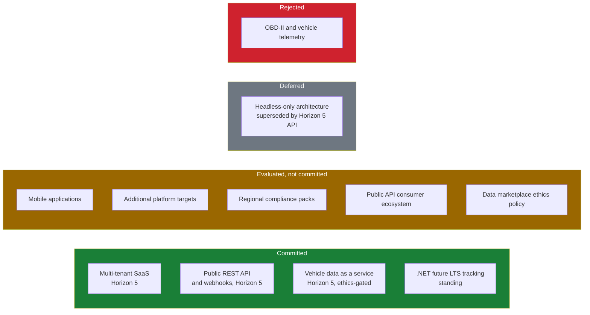

# 45 Future Roadmap

> What lies beyond Horizon 5, and — just as importantly — what has been evaluated and set aside, and
> what has been rejected outright. A governance record, not a backlog.

**Status:** Review · **Owner:** Product Owner · **Last revised:** 2026-07-28

---

## Contents

- [Executive Summary](#executive-summary)
- [Objectives](#objectives)
- [Scope](#scope)
- [Detailed Specifications](#detailed-specifications)
  - [Classification method](#classification-method)
  - [Mobile applications](#mobile-applications)
  - [Additional platform targets](#additional-platform-targets)
  - [OBD-II and vehicle telemetry — rejected](#obd-ii-and-vehicle-telemetry--rejected)
  - [Headless-only architecture — deferred](#headless-only-architecture--deferred)
  - [Regional compliance packs](#regional-compliance-packs)
  - [Public API consumer ecosystem](#public-api-consumer-ecosystem)
  - [Data marketplace ethics](#data-marketplace-ethics)
  - [.NET future LTS tracking](#net-future-lts-tracking)
  - [Master disposition table](#master-disposition-table)
- [Architecture](#architecture)
- [User Stories](#user-stories)
- [Acceptance Criteria](#acceptance-criteria)
- [Future Enhancements](#future-enhancements)
- [References](#references)

---

## Executive Summary

[ROADMAP.md](../ROADMAP.md) commits to five horizons. This document exists so that everything *beyond*
those horizons — and everything considered *within* their planning but not included — has a recorded,
reasoned disposition instead of living only in someone's memory of a meeting. That distinction matters
operationally: a rejected idea that is not written down gets re-proposed every planning cycle by someone
who was not in the room the first time, and an evaluated idea that is not written down gets forgotten
even when its blocking condition resolves.

Takeaways:

1. **Three dispositions, precisely defined**: *Committed* (in a named horizon with exit criteria),
   *Evaluated, not committed* (considered, with a stated blocking reason and a promotion path), and
   *Rejected* (declined, requiring a new strategic decision — not just spare capacity — to revisit).
2. **OBD-II and vehicle telemetry are rejected outright** as a different product category, not merely
   deferred (`ROADMAP.md § What we are not doing`).
3. **Headless-only architecture is deferred, not rejected** — the public API is committed at Horizon 5
   with a stable, versioned contract, which is the prerequisite a headless architecture needs and does
   not yet have.
4. **A future data-as-a-service offering is gated by an explicit ethics guardrail table**, derived
   directly from commitments already made in `LICENSE.md §§ 7.3, 10, 11.4, 12.1` — it does not get to
   contradict them just because it is a new revenue line.
5. **Tracking the platform's future LTS runtime is a standing commitment, not a one-off** — `ADR-002`
   established the pattern for .NET 9 → .NET 10; this document keeps that pattern alive for every
   subsequent hop.

---

## Objectives

| # | Objective | Traces to | Measure |
|---|---|---|---|
| 1 | Give every beyond-Horizon-5 item an explicit disposition and reason | `BR-042`, [ROADMAP.md](../ROADMAP.md) | The [Master disposition table](#master-disposition-table) has no blank or unreasoned row |
| 2 | Track the .NET future-LTS retargeting pattern as a standing, recurring commitment | `ADR-002` | A process exists to open a new milestone without rewriting this document |
| 3 | Record data-marketplace ethics guardrails before any data-as-a-service feature is scheduled | `BR-041`, `ADR-003`, [49](49-saas-roadmap.md) | A written guardrail table exists and is a precondition of promotion to committed |
| 4 | Prevent re-litigation of settled rejections without a new strategic decision | [ROADMAP.md § What we are not doing](../ROADMAP.md#what-we-are-not-doing) | A rejected item requires a new `BR` and a Product Owner decision record to be reconsidered |
| 5 | Define how an evaluated item is promoted to committed | [ROADMAP.md § Roadmap governance](../ROADMAP.md#roadmap-governance) | Promotion requires satisfied dependencies and testable exit criteria, recorded in both this document and `ROADMAP.md` |

---

## Scope

### In scope

- Everything named as a candidate beyond Horizon 5, and every item evaluated during Horizon 1–5
  planning but not included, elaborated to specification depth with an owner and a reason.
- The committed / evaluated / rejected classification and the master table.
- The standing process for tracking future .NET LTS milestones.
- The ethics guardrails a future data-as-a-service offering must satisfy before it can be scheduled.

### Out of scope

| Not covered | Where |
|---|---|
| Horizon 1–5 delivery detail | [ROADMAP.md](../ROADMAP.md) |
| Multi-tenant SaaS architecture detail | [49 SaaS Roadmap](49-saas-roadmap.md) |
| Sprint- and release-level scheduling, and any calendar date commitment | [36 Sprint Planning](36-sprint-planning.md), [41 Release Plan](41-release-plan.md) |
| Workshop, fleet, and dealer portal feature specifications | [46](46-workshop-portal.md)–[48](48-dealer-portal.md) |

### Assumptions

- Nothing in this document authorises implementation. Promotion from *evaluated* to *committed* still
  passes through the standard requirement pipeline — `BR` then `FR` then `US` then `AC` — described in
  [CONTRIBUTING.md](../CONTRIBUTING.md#requirement-and-identifier-discipline) before any code is written.
- This document is reviewed at the close of each horizon, per
  [ROADMAP.md § Roadmap governance](../ROADMAP.md#roadmap-governance), so dispositions stay current
  rather than becoming a historical curiosity.

### Dependencies

[ROADMAP.md](../ROADMAP.md) (Horizon 5, the platform dependency track, and "what we are not doing"),
[49 SaaS Roadmap](49-saas-roadmap.md), [00 Vision](00-vision.md), [05 Product Strategy](05-product-strategy.md),
[08 System Architecture](08-system-architecture.md) (`ADR-002`, `ADR-007`), [LICENSE.md](../LICENSE.md).

---

## Detailed Specifications

### Classification method

| Disposition | Meaning | What changes it |
|---|---|---|
| **Committed** | In a named horizon in [ROADMAP.md](../ROADMAP.md) with an owner and testable exit criteria | Standard delivery process; no special action needed here |
| **Evaluated, not committed** | Actively considered, with a stated blocking reason. Could be promoted if the blocking condition resolves | A new `BR`, Product Owner approval, and architecture review confirming the dependency is satisfied — per [ROADMAP.md § Roadmap governance](../ROADMAP.md#roadmap-governance) |
| **Rejected** | Considered and explicitly declined for a strategic reason, not a capacity reason | Reconsideration requires a new strategic decision recorded by the Product Owner — a backlog request alone does not reopen it |
| **Deferred** | Not rejected; scheduled for a later horizon because a specific prerequisite has to land first | Automatic once the stated prerequisite (usually a specific horizon's committed deliverable) ships |

### Mobile applications

**Disposition: Evaluated, not committed.**

A native mobile application depends on the versioned, stable public REST API committed at Horizon 5
([ROADMAP.md § Horizon 5](../ROADMAP.md#horizon-5--platform)); publishing a mobile client against an
unversioned internal contract would freeze API decisions before the fitment engine's semantics have
had time to stabilise across a full marketplace and portal cycle — precisely the reasoning
[08 System Architecture](08-system-architecture.md#rejected-alternatives) already applied to rejecting a
public REST surface in Horizon 1.

A meaningful share of the mobile use case is already served without a dedicated app: the theme's
responsive, Core Web Vitals-budgeted design ([21](21-theme-design.md), [22](22-ui-design-system.md),
[29](29-performance.md)) covers mobile browser usage from Horizon 1. The open question a native app
would answer is trade-segment field usage — a workshop technician or fleet inspector working from a
phone with intermittent connectivity — which is a different demand signal from consumer retail
convenience and is more likely to surface from the Horizon 4 portals than from the retail storefront.

**Promotion trigger:** the Horizon 5 public API is live and stable, and a trade-portal customer
segment (workshop or fleet) demonstrates a field-usage need that browser access does not satisfy.

### Additional platform targets

**Disposition: Evaluated, not committed**, for every platform listed.

| Platform | Reasoning |
|---|---|
| Shopify | The domain layer's independence from nopCommerce (`ADR-007`) is exactly what makes a port *conceivable* — vehicle, VIN, OEM, and fitment logic carry no platform dependency. Conceivable is not the same as sequenced: Shopify's more restrictive checkout extensibility model and its Liquid/App Bridge architecture would require an adapter layer comparable in scope to the one [08 System Architecture](08-system-architecture.md) already specifies for nopCommerce, and no `BR` currently commits capacity to building it. The [05 Product Strategy](05-product-strategy.md#ideal-customer-profile) Ideal Customer Profile is explicitly "nopCommerce now or migrating to 4.90" |
| WooCommerce, Magento | Same domain-portability logic applies; no demand signal has been recorded against either |
| Salesforce Commerce Cloud, Adobe Commerce | Theoretical overlap with the Enterprise-tier ICP, but no recorded demand. If ever pursued, the shape would resemble an OEM/Redistribution-style bespoke engagement (`LICENSE.md § 3.1`) rather than a packaged SKU |

**Promotion trigger:** a recorded, qualified deal that cannot proceed without a named platform, sized
large enough to justify the adapter-layer investment.

### OBD-II and vehicle telemetry — rejected

**Disposition: Rejected**, not deferred.

OBD-II diagnostics and vehicle telemetry are a different product category from automotive **commerce**.
Check Engine matches a resolved vehicle configuration — static, catalog-facing data — to a set of
sellable parts. Telemetry reads live sensor data and diagnostic trouble codes from a running vehicle,
which requires an entirely different ingestion model (streaming device data, not periodic catalog and
fitment updates), a hardware relationship (OBD-II dongles or connected-vehicle APIs) that Check Engine
has no reason to acquire, and a materially different liability profile: `LICENSE.md §§ 9.3–9.4` disclaim
fitment-determination accuracy, and those disclaimers do not translate to diagnostic-accuracy claims,
which carry their own, distinct legal exposure.

This is rejected outright, not deferred, because pursuing it would dilute the fitment-engine identity
that is the product's actual defensibility (`04 Competitive Analysis § Defensibility analysis`), and
because [05 Product Strategy § Anti-goals](05-product-strategy.md#anti-goals) already treats scope
dilution of this kind as something to actively refuse, not merely deprioritise.

**Reconsideration trigger:** none is defined. Reopening this would require a new business requirement
and a new competitive thesis from the Product Owner — not a capacity unlock.

### Headless-only architecture — deferred

**Disposition: Deferred**, distinct from rejected.

[ROADMAP.md § What we are not doing](../ROADMAP.md#what-we-are-not-doing) and
[05 Product Strategy § Anti-goals](05-product-strategy.md#anti-goals) both record the same reasoning: the
Ideal Customer Profile needs a working theme and admin from day one, not only an API, and publishing a
public contract before fitment semantics have stabilised across a marketplace and portal cycle would
freeze decisions the team is not ready to commit to
([08 System Architecture § Rejected alternatives](08-system-architecture.md#rejected-alternatives)).

The public REST API and webhooks are **already committed at Horizon 5**
([ROADMAP.md § Horizon 5](../ROADMAP.md#horizon-5--platform)). "Deferred" here means exactly that and
nothing more: a headless deployment mode is not pulled forward into an earlier horizon without the
versioned-contract prerequisite already being satisfied.

### Regional compliance packs

**Disposition: Evaluated, not committed**, already flagged as a Horizon 3 candidate in
[05 Product Strategy § Future Enhancements](05-product-strategy.md#future-enhancements).

| Candidate | Detail |
|---|---|
| Egypt ETA e-invoicing | Currently treated as an operator/ERPNext concern rather than a Check Engine core capability ([05 Product Strategy § Market-agnostic regional strategy](05-product-strategy.md#market-agnostic-regional-strategy)) |
| GCC VAT and e-invoicing mandates | Same posture; regional tax compliance sits with the operator's ERP and accounting stack |
| Consumer-protection disclosures beyond GDPR | Data-subject rights are already specified in [28 Security](28-security.md) and `BR-015`; a jurisdiction-specific disclosure pack would be additive, not foundational |

**Promotion trigger:** a specific jurisdiction's mandate becomes a blocking objection for a committed
customer segment — for example, a Business-tier Egypt customer requiring in-product e-invoicing rather
than ERP-side handling.

### Public API consumer ecosystem

**Disposition: Evaluated, not committed** — distinct from the API itself, which is committed.

Shipping a versioned public REST API and webhook surface is committed at Horizon 5. Cultivating a
*consumer ecosystem* on top of it — third-party integrations, a partner API programme, an app-store-like
listing of community extensions — is a separate, larger undertaking requiring developer-relations
investment, a versioning discipline sustained across multiple releases, and a partner agreement
template. None of that exists yet, and none of it can usefully exist before the API it depends on has
shipped and proven stable in production.

**Promotion trigger:** the Horizon 5 public API has been stable in production through at least one full
minor release cycle without a breaking change.

### Data marketplace ethics

**Disposition: Evaluated, not committed, and explicitly gated.**

[ROADMAP.md § Horizon 5](../ROADMAP.md#horizon-5--platform) commits to "vehicle data as a service" and
is explicit about why it is viable at all: "only viable because the catalog is owned, not licensed —
see `ADR-003`." Ownership of the *product's own curated catalog* does not automatically extend to a
right to monetise data that touches individual Licensees' businesses, and several obligations already
made elsewhere in this specification set constrain what a future data-service SKU may draw on. These
are recorded here as guardrails, not as aspirational values, so that a future data-service design
proposal has a concrete checklist to satisfy rather than a values statement to interpret.

| Guardrail | Source obligation | Consequence for a future data-service SKU |
|---|---|---|
| No aggregation of Licensee catalog data across customers | `LICENSE.md § 11.4` | A data-service offering can draw only on Twin Particles-owned curated data — the vehicle hierarchy, VIN decoding rules, and the OEM registry — never on customer-specific catalog contributions, unless a customer explicitly opts in under separate, new commercial terms |
| Licensee retains all rights in Licensee Data | `LICENSE.md § 7.3` | A Licensee's own catalog is never resold, including to that Licensee's competitors |
| No AI training on Licensee Data | `LICENSE.md § 11.4` | A data-service offering does not double as an AI training-data acquisition channel |
| Nominative-use limits on manufacturer marks | `LICENSE.md § 10` | A data-service customer inherits the same nominative-use obligations as a product Licensee; the data service does not launder a use that would be impermissible in the product itself |

**Promotion trigger:** a written data-ethics policy and a distinct licence instrument for data-service
customers exist, reviewed by the Product Owner and by external counsel given the legal exposure. This is
an explicit open decision — not a placeholder — with a named owner and trigger: **owner:** Product
Owner; **trigger:** scheduling of Horizon 5 work in [41 Release Plan](41-release-plan.md).

### .NET future LTS tracking

**Disposition: Committed, standing.**

`ADR-002` and [ROADMAP.md § The .NET 10 milestone](../ROADMAP.md#the-net-10-milestone) establish the
pattern for the single hop the product currently faces — .NET 9 to .NET 10 — and the governing
principle: **Check Engine tracks the platform, not leads it.** A plugin cannot target a runtime its host
does not support, so retargeting is scheduled as a standing, budgeted milestone triggered by
nopCommerce's own release cadence, and carried in the risk register as `RISK-04`
([01 Business Requirements](01-business-requirements.md#risk-register)). This section exists so that
the *pattern* survives past the single instance already documented in `ROADMAP.md`, rather than needing
this document rewritten every time nopCommerce ships another major version.

| .NET version | Support type | End of support | Relevance |
|---|---|---|---|
| .NET 9 | Standard Term Support | 10 November 2026 | Current target for nopCommerce 4.90 |
| .NET 10 | Long Term Support | November 2028 | Expected target for nopCommerce's next major version (Horizon 5, v2.0) |
| Beyond .NET 10 | Not yet published by Microsoft | Not yet published | Tracked only as a recurring process, not a predicted date — see below |

Microsoft's published cadence is one release every November, with even-numbered major versions
receiving Long Term Support; on that pattern, a subsequent LTS release would be expected roughly two
years after .NET 10. **That date is not asserted here** because Microsoft had not published it as of
this revision — only the recurring pattern and the response process are committed:

1. When nopCommerce announces or ships a major version targeting a new .NET release, a new milestone
   entry is opened in [ROADMAP.md § Platform dependency track](../ROADMAP.md#platform-dependency-track)
   using the same structure as the .NET 10 entry.
2. The retargeting work is budgeted as a standing item in the relevant [41 Release Plan](41-release-plan.md)
   cycle, not treated as an emergency.
3. `RISK-04` is re-assessed at that time rather than closed, since the same risk recurs on every major
   platform hop.

### Master disposition table

| Item | Disposition | Horizon / trigger | Reasoning |
|---|---|---|---|
| Multi-tenant SaaS operation | Committed | 5 | [ROADMAP.md § Horizon 5](../ROADMAP.md#horizon-5--platform); [49](49-saas-roadmap.md) |
| Public REST API and webhooks | Committed | 5 | [ROADMAP.md § Horizon 5](../ROADMAP.md#horizon-5--platform) |
| Vehicle data as a service | Committed, ethics-gated | 5 | `ADR-003`; see [Data marketplace ethics](#data-marketplace-ethics) |
| .NET future LTS tracking | Committed, standing | Recurring | `ADR-002`, `RISK-04` |
| Mobile applications | Evaluated, not committed | Depends on Horizon 5 API maturity plus a trade-portal demand signal | [Mobile applications](#mobile-applications) |
| Additional platform targets (Shopify and others) | Evaluated, not committed | Unscheduled; requires a qualified deal | [Additional platform targets](#additional-platform-targets) |
| Regional compliance packs | Evaluated, not committed | Horizon 3 candidate | [Regional compliance packs](#regional-compliance-packs) |
| Public API consumer ecosystem | Evaluated, not committed | After the Horizon 5 API is stable in production | [Public API consumer ecosystem](#public-api-consumer-ecosystem) |
| Data marketplace ethics policy | Evaluated, not committed (a gate, not a feature) | Before any data-service SKU is scheduled | [Data marketplace ethics](#data-marketplace-ethics) |
| Headless-only architecture in v1.0 | Deferred | Superseded by the committed Horizon 5 API | [Headless-only architecture](#headless-only-architecture--deferred) |
| OBD-II and vehicle telemetry | **Rejected** | — | [OBD-II and vehicle telemetry](#obd-ii-and-vehicle-telemetry--rejected) |

---

## Architecture

The four bands are ordered by certainty, not by desirability: an item's place in this diagram states
what is known about it today, and the [Master disposition table](#master-disposition-table) is the
authoritative detail behind each box.

### Rejected alternatives

| Alternative (to this document's own approach) | Rejected because |
|---|---|
| Leaving evaluated-but-declined ideas unrecorded | Invites the same idea being re-proposed and re-litigated every planning cycle by someone unaware it was already considered |
| Using a `quadrantChart` or `timeline` to plot these items by effort and impact | Both are outside the enforced Mermaid allowlist in [CONTRIBUTING.md](../CONTRIBUTING.md#mermaid-diagram-standards); a banded `flowchart` plus the master table conveys the same information without the parser risk |
| Committing calendar dates for evaluated or committed-but-unscheduled items in this document | Date commitments belong only in [41 Release Plan](41-release-plan.md); stating one here would create a second, inconsistent source of truth |
| Treating "deferred" and "rejected" as one category | Conflates "not yet, and here is the exact prerequisite" with "no, and it would take a new strategic decision to revisit" — the distinction is operationally useful and is preserved |

---

## User Stories

| ID | Persona | Story | Traces to | Points | Priority |
|---|---|---|---|---|---|
| `US-861` | Product Owner | Point to a recorded disposition for "will we support Shopify" instead of re-deciding it live in a sales call | [Additional platform targets](#additional-platform-targets) | 2 | Must |
| `US-862` | Engineering Lead | Know that OBD-II is rejected so it is not re-proposed every planning cycle | [OBD-II and vehicle telemetry](#obd-ii-and-vehicle-telemetry--rejected) | 2 | Must |
| `US-863` | Product Owner | See the data-marketplace ethics guardrails before any Horizon 5 data-service design work begins | [Data marketplace ethics](#data-marketplace-ethics) | 3 | Must |
| `US-864` | Architecture Owner | Track the standing .NET LTS milestone pattern beyond the single .NET 10 entry already in `ROADMAP.md` | [.NET future LTS tracking](#net-future-lts-tracking) | 3 | Should |
| `US-865` | Prospect | Understand headless and public-API availability timing before committing to an integration plan | [Headless-only architecture](#headless-only-architecture--deferred) | 2 | Should |
| `US-866` | Architecture Owner | Follow a defined process to promote an evaluated item to committed | [Classification method](#classification-method) | 3 | Should |

---

## Acceptance Criteria

**`AC-45.1`** — No blank dispositions
Given the [Master disposition table](#master-disposition-table), when reviewed, then every row carries
one of the four defined dispositions and a reasoning reference; none is blank or marked "to be decided."

**`AC-45.2`** — Rejected items require a new decision to reconsider
Given OBD-II and vehicle telemetry is raised again in a planning cycle, when evaluated against this
document, then it is not re-added to the backlog without a new business requirement and a Product Owner
decision record.

**`AC-45.3`** — Data-service ethics gate enforced
Given a proposal to schedule a data-as-a-service SKU, when reviewed against this document, then it is
blocked from committed status until every row of the [Data marketplace ethics](#data-marketplace-ethics)
guardrail table is satisfied.

**`AC-45.4`** — .NET tracking is a standing process, not a one-off entry
Given a nopCommerce major version announcement beyond the .NET 10 hop already tracked in
`ROADMAP.md`, when it occurs, then a new milestone entry is opened using the process in
[.NET future LTS tracking](#net-future-lts-tracking) without first requiring this document to be
rewritten.

**`AC-45.5`** — No calendar date commitments
Given this document, when read in full, then no beyond-Horizon-5 item carries a calendar date
commitment; dates exist only in [41 Release Plan](41-release-plan.md).

**`AC-45.6`** — Promotion is recorded in both documents
Given an item promoted from evaluated to committed, when the change is made, then `ROADMAP.md` is
updated in the same change set, and this document's [Master disposition table](#master-disposition-table)
row is updated to match.

---

## Future Enhancements

This document is itself a record of future-facing decisions; its own "future enhancements" are the
review commitments that keep it accurate rather than new product capabilities.

| Enhancement | Horizon | Notes |
|---|---|---|
| Annual re-review of every "evaluated" row against its promotion trigger | Recurring, tied to each horizon retrospective | Per [ROADMAP.md § Roadmap governance](../ROADMAP.md#roadmap-governance) |
| Re-assessment of mobile applications once the Horizon 5 API is stable | 5+ | See [Mobile applications](#mobile-applications) |
| Formal data-ethics policy and licence instrument for a data-service SKU | 5 | See [Data marketplace ethics](#data-marketplace-ethics) |
| First regional compliance pack, if a blocking sales objection materialises | 3–4 | See [Regional compliance packs](#regional-compliance-packs) |

---

## References

- [ROADMAP.md](../ROADMAP.md) — Horizon 5, the platform dependency track, and "what we are not doing"
- [49 SaaS Roadmap](49-saas-roadmap.md) — the committed multi-tenant and data-service architecture
- [00 Vision](00-vision.md) — the strategic bets this document's dispositions must remain consistent with
- [05 Product Strategy](05-product-strategy.md) — anti-goals and the market-agnostic regional strategy
- [08 System Architecture](08-system-architecture.md) — `ADR-002`, `ADR-007`, and rejected Horizon-1 API alternatives
- [LICENSE.md](../LICENSE.md) §§ 7, 9, 10, 11, 12 — the obligations behind the data-ethics guardrails
- [01 Business Requirements](01-business-requirements.md#risk-register) — `RISK-04`
- [CHANGELOG.md](../CHANGELOG.md) — `ADR-002`, `ADR-003`, `ADR-007`
- [CONTRIBUTING.md](../CONTRIBUTING.md) — the requirement pipeline a promotion must still pass through
